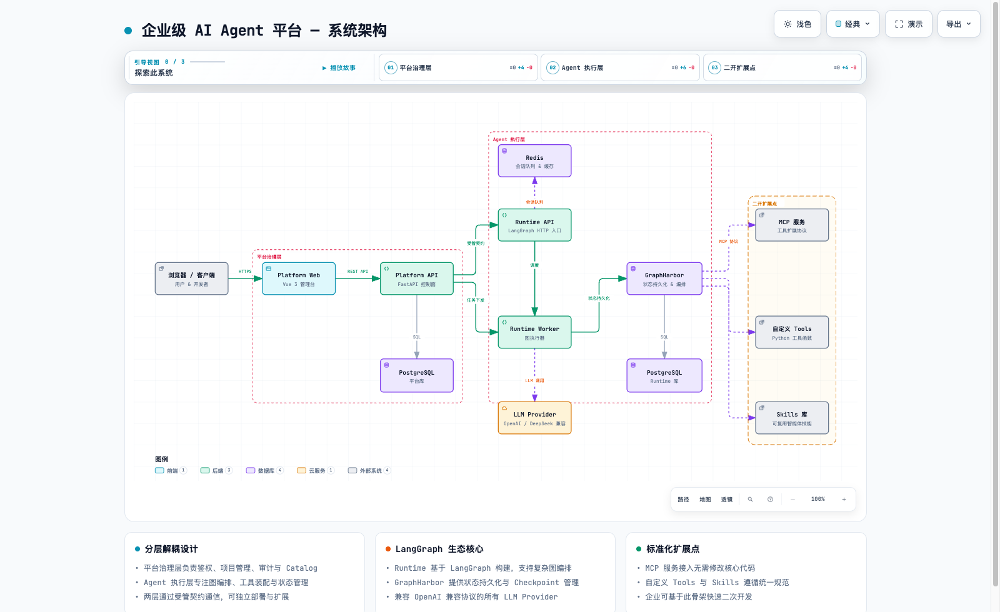
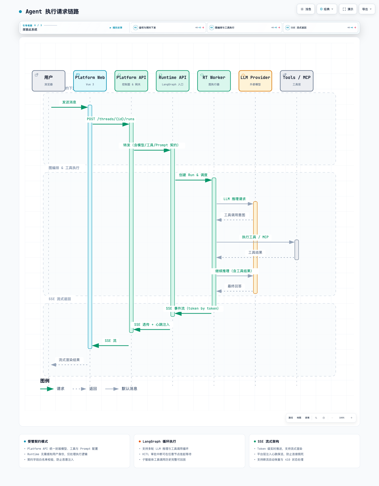
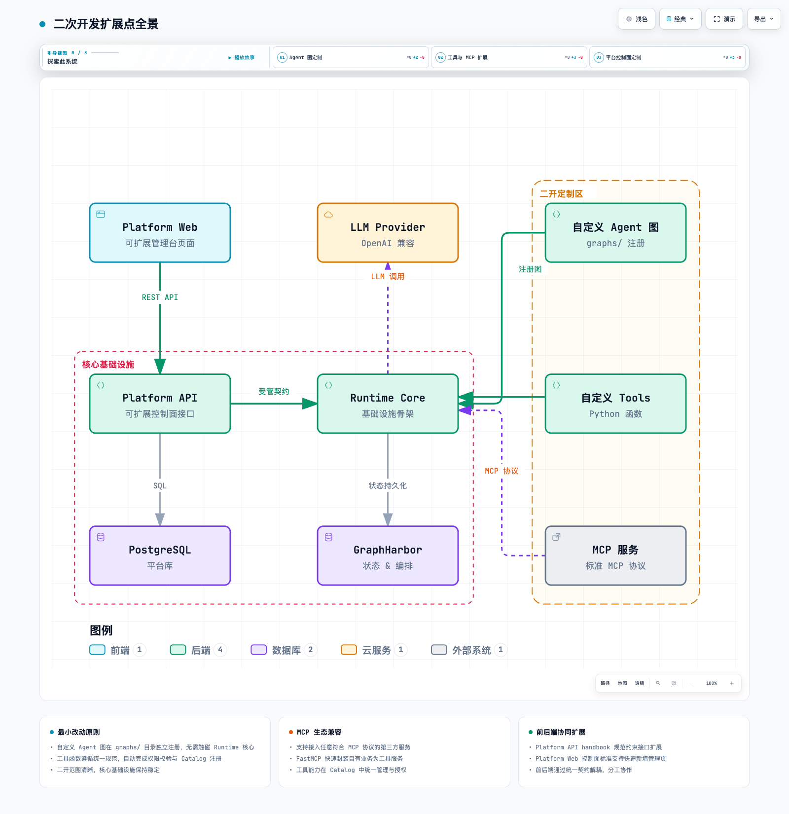
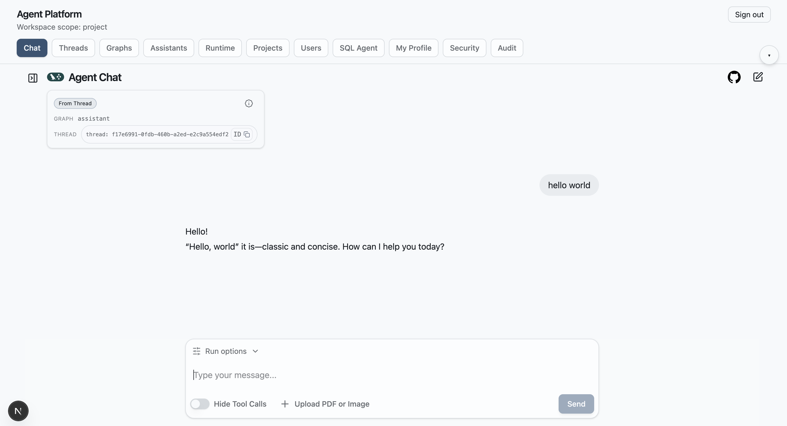

<h1 align="center">企业级 AI Agent 平台</h1>

<p align="center"><strong>面向二次开发与企业落地的 AI Agent 平台底座 · 基于 LangGraph 生态体系</strong></p>

<p align="center"><a href="README.en.md">English</a> | 中文</p>

<p align="center">
  
  
  
  
  
  
  
  
  <a href="https://github.com/ljxpython/ai-agent-platform/releases/latest"></a>
</p>

<p align="center">
  <a href="#system-overview">系统总览</a> ·
  <a href="#architecture-diagrams">架构与链路图解</a> ·
  <a href="#agent-ecosystem">内置智能体生态</a> ·
  <a href="#secondary-development">二次开发指南</a> ·
  <a href="#frontend-showcase">前端体验与工作台</a> ·
  <a href="#quick-start">快速开始</a> ·
  <a href="docs/guides/deployment-guide.md">部署手册</a> ·
  <a href="docs/CHANGELOG.md">更新日志</a> ·
  <a href="#acknowledgements">致谢与技术核心</a>
</p>

---

## 项目定位：解决什么问题？

很多团队做 Agent 容易停留在 Demo 阶段：平台治理、运行时执行、状态存储和前端交互全揉成一个“大泥球”，一到生产落地就面临权限缺失、状态丢失、模型切换困难、二开举步维艰的问题。

本项目为解决这一痛点而生，提供一个**可直接用于二次开发、快速搭建企业私有 AI Agent 平台**的工程底座：

- **解耦平台治理与 Agent 执行**：平台层专职负责认证鉴权、多租户/项目隔离、审计回溯、模型 Catalog 治理；Agent 运行时专职负责图编排、工具装配与状态机运转。两层通过受管契约通信，互不污染。
- **拥抱主流开源生态，不造封闭轮子**：全面基于 `LangGraph / LangChain` 系列生态设计，深度吸收 `open-swe`、`deepagents` 与 `deer-flow` 的工程思想，原生支持复杂图编排、状态持久化、多轮工具调用循环与人机协同（HITL）审批中断。
- **标准化二次开发骨架**：预留清晰的扩展点（自定义 Agent 图、自定义 Tools、标准 MCP 服务、Skills 技能），其他企业可以直接拉取作为模板，快速装配自有业务 Agent。

<a id="system-overview"></a>

## 系统总览

整个系统由三大服务分层构建，各司其职：

| 服务 | 目录 | 职责定位 | 核心技术栈 |
|---|---|---|---|
| **Platform API** | `apps/platform-api` | **控制面核心**：认证鉴权、项目治理、审计日志、模型 Catalog 目录、受管契约网关转发 | FastAPI + SQLAlchemy + PostgreSQL |
| **Platform Web** | `apps/platform-web` | **管理控制台前端**：工作台布局、Agent 交互对话流、权限管理、多端流式渲染 | Vue 3 + Vite + Tailwind CSS + Pinia |
| **Runtime Service** | `apps/runtime-service` | **Agent 执行引擎**：LangGraph 图注册、工具与 MCP 装配、会话调度、SSE 事件流保活推送 | Python 3.11+ + LangGraph + GraphHarbor + Redis |

<a id="architecture-diagrams"></a>

## 架构与链路图解

### 1. 系统架构全景图

> 🔗 **交互式网页体验：** [👉 打开全屏交互式架构图 (HTML)](docs/diagrams/arch-system-overview.html)（支持节点聚焦缩放、深浅主题切换与全要素搜索）



- **平台治理层（左）**：集中处理所有的用户身份、安全隔离与审计流向，Runtime 内部无须耦合任何用户鉴权逻辑。
- **Agent 执行层（中）**：Runtime API 与 Runtime Worker 分离，状态由 GraphHarbor 统一落库，保障长时间运行与故障断点恢复。
- **二开扩展点（右）**：工具函数、标准 MCP 服务与外部 LLM 全部通过标准化协议接入，扩展时对核心代码零侵入。

---

### 2. Agent 执行请求链路时序

> 🔗 **交互式网页体验：** [👉 打开全屏交互式时序图 (HTML)](docs/diagrams/seq-agent-run.html)（支持三阶段分段探索与完整链路追踪）



- **阶段一（鉴权与契约组装）**：Platform API 拦截用户请求，从数据库读取当前项目启用的模型参数、可用工具白名单和系统 Prompt，组装成受保护的“受管契约”下发给 Runtime。
- **阶段二（图编排与工具循环）**：Runtime Worker 接管任务，驱动 LangGraph 状态机向 LLM 发起推理；当模型决定调用工具或 MCP 时，进入工具执行/人机审批流，完成后携带结果继续推理。
- **阶段三（SSE 流式保活透传）**：执行状态以 Server-Sent Events（SSE）形式实时推送，网关层自动注入保活心跳，前端支持流式打字渲染与断流自愈。

---

### 3. 二次开发扩展点全景

> 🔗 **交互式网页体验：** [👉 打开全屏交互式扩展点图 (HTML)](docs/diagrams/arch-extension-points.html)（清晰划定二开边界）



- **二开业务定制区（右侧）**：业务开发者主要编写自定义 Agent 图、业务 Tools 和挂载 MCP 插件。
- **核心基础设施骨架（左下）**：认证、网关、状态持久化、SSE 传输通道等基础设施开箱即用，一般无需做侵入性修改。

---

<a id="agent-ecosystem"></a>

## 内置智能体生态：从教学到生产落地

仓库内置了两套具有不同使命的智能体示例，兼顾了快速上手学习与极端复杂场景落地：

### 1. 教学入门智能体：`showcase_demo`
- **定位**：初学者了解平台机制的最小样板间。
- **源码位置**：`apps/runtime-service/src/runtime_service/services/demo/showcase_demo/`
- **覆盖能力**：
  - ✅ **基础与高级工具调用 (Tool Calling)**
  - ✅ **人机协同审批中断 (HITL - Human-in-the-Loop)**
  - ✅ **子智能体协作与调用轨迹基础回放**
  - ✅ **沙箱安全工作区 (Workspace) + 产物实时预览**
  - ✅ **MCP 工具集成与动态装配**

### 2. 生产级标杆智能体：`DeerFlow Agent`
- **定位**：真正面向生产级任务工程的复杂智能体实现，验证平台对极端复杂场景的承载力。
- **设计思想**：深度吸收 `bytedance/deer-flow`、`langchain-ai/deepagents` 与 `langchain-ai/open-swe` 的工程设计范式。
- **生产级核心特质**：
  - 🧠 **全流程多模式切换**：支持探索研究（Research）、工程代码编写（Coding）、长效规划（Planning）与任务分发子智能体多模式动态调度。
  - 💾 **记忆闭环引擎 (Memory Pipeline)**：具备会话短期上下文管理与跨会话个人/项目长期记忆提取、存储、检索与注入机制。
  - 🛡️ **安全沙箱隔离工作区**：提供本地/容器化双模式执行沙箱，原生支持文件树浏览、代码高亮预览与成果归档下载（.zip）。
  - 💻 **交互式终端 (PTY)**：提供基于 xterm 的真实终端会话，支持命令审计、防越权拦截、终端划词一键入 Chat 与多终端保活。
  - 🧰 **深度工具与企业级 Skills 矩阵**：内置文件操作、语法树检索、代码分析等成套 Production Skills。

> 💡 **企业二开建议：** 企业客户可以直接复用 `DeerFlow Agent` 的工程实现作为高阶智能体模板，也可将其拆解为底层组件，按需装配到企业原有的垂直业务场景中。

---

<a id="secondary-development"></a>

## 二次开发指南：如何接入你的业务？

### 扩展点代码速查

| 扩展需求 | 目标代码路径 | 开发说明 |
|---|---|---|
| **新增自定义 Agent 图** | `apps/runtime-service/src/runtime_service/graphs/` | 基于 LangGraph 编写 `StateGraph`，定义节点与边，并在统一入口注册 |
| **新增自定义工具 (Tools)** | `apps/runtime-service/src/runtime_service/tools/` | 使用 `@tool` 装饰器编写纯 Python 函数，平台自动提取 JSON Schema 供模型调用 |
| **接入第三方 MCP 服务** | `apps/runtime-service` 配置文件 | 标准 MCP 客户端开箱即用，通过配置快速挂载外部 FastMCP / 官方 MCP 工具服务 |
| **扩展控制面 API** | `apps/platform-api/src/platform_api/` | 遵循 `apps/platform-api/docs/handbook/` 规范新增 REST 端点与数据模型 |
| **管理台页面二次开发** | `apps/platform-web/src/modules/` | 遵循 `control-plane-page-standard.md` 页面标准，快速扩建控制台视图 |

---

<a id="frontend-showcase"></a>

## 前端体验与工作台

当前平台控制台已完成多次大版本重构，消灭了早期简陋的 Demo 样貌，全面演进为现代化工业级控制台：



### 核心工作台体验矩阵

平台当前已沉淀出 4 大核心视觉与交互空间：

1. **通透无界智能体对话流**：
   - 支持模型思考过程（Think 块）流式实时折叠与展开
   - 仿 GPT-style 视口平滑锚定与防抖动流式生长
   - 敏感操作工具审批（HITL）交互卡片与状态机自愈
   - 时间旅行（Time Travel）历史节点快速筛选与分叉执行
2. **沉浸式沙箱 Workspace**：
   - 弹性拖拽双栏布局与全屏最大化
   - 实时懒加载文件树、Markdown / HTML 渲染预览
   - 多终端（PTY）交互式命令行、划词入会话与成果一键打包（Zip）
3. **DeepSeek 级轨迹 DevTools 视图**：
   - 对话模式与排障轨迹视图秒级切换
   - 三层横向甘特时间线（Input / Model / Tools）、Turn 树状执行链与性能指标看板
4. **企业级控制面管理空间**：
   - 模型统一目录（支持多 Provider、端点防重、BYOK 私有密钥隔离）
   - 项目、用户多角色 RBAC 隔离与安全审计流向

> 💡 *关于界面体验补充：我们正在准备一套完整的 30 秒快速漫游短视频与高帧率 GIF 动图，欢迎保持关注！*

---

<a id="quick-start"></a>

## 快速开始

### 运行环境准备

- **Python**：3.11+（各服务独立依赖隔离）
- **Node.js**：18+ / pnpm 9+
- **PostgreSQL**：建议 14+（平台与 Runtime 使用独立数据库隔离）
- **Redis**：支持会话队列与临时缓存

### 1. 本地原生多进程启动（开发推荐）

```bash
# 1. 激活 runtime 虚拟环境（确保依赖已安装）
source "apps/runtime-service/.venv/bin/activate"

# 2. 运行健康自检，检查数据库、Redis 连接与配置文件
bash "scripts/local-stack.sh" doctor

# 3. 自动执行数据库迁移并拉起全栈进程 (Runtime API、Worker、Platform API、Platform Web)
bash "scripts/local-stack.sh" start

# 4. 查看当前栈运行状态与端口占用
bash "scripts/local-stack.sh" status

# 5. 停止本地全栈服务
bash "scripts/local-stack.sh" stop
```

首次运行的配置初始化、数据库建表及密码配置，请查阅 [非容器化本地部署手册](docs/guides/deployment-guide.md)。

---

### 2. Docker / Docker Compose 启动

```bash
# 选项 A：仅启动 runtime-service 执行层
docker compose -f apps/runtime-service/deploy/docker-compose.runtime-service.yml \
  --env-file apps/runtime-service/deploy/.env.runtime-service up -d

# 选项 B：启动全栈 stack（前后端独立暴露端口）
docker compose -f deploy/docker-compose.stack.yml --env-file deploy/.env.stack up -d

# 选项 C：启动全栈 stack（带 Nginx 反向代理，单端口统一入口）
docker compose -f deploy/docker-compose.stack.nginx.yml --env-file deploy/.env.stack up -d
```

完整容器指南见 [deploy/README.md](deploy/README.md) 与 [容器化零到一运行指南](docs/guides/zero-to-one-container-deploy.md)。

---

### 3. 默认访问入口与健康检查

| 模块 | 默认本地地址 | 最小健康检查指令 |
|---|---|---|
| **Platform Web** | `http://127.0.0.1:3000` | 浏览器直接访问前端管理界面 |
| **Platform API** | `http://127.0.0.1:2142` | `curl -fsS "http://127.0.0.1:2142/_system/health"` |
| **Runtime Service** | `http://127.0.0.1:8123` | `curl -fsS "http://127.0.0.1:8123/ready"` |

---

## 仓库结构速览

```text
ai-agent-platform/
├── apps/
│   ├── platform-api/       # 平台控制面后端 (FastAPI, 权限/项目/审计/Catalog)
│   ├── platform-web/       # 平台控制面前端 (Vue 3, 统一管理台与聊天流)
│   └── runtime-service/    # LangGraph 执行运行时 (图编排/工具装配/状态机)
├── deploy/                 # Docker Compose 生产与开发镜像编排
├── docs/                   # 架构设计、场景指南与跨服务标准体系
│   ├── architecture/       # 系统架构沉淀与概念透析专篇
│   ├── diagrams/           # 交互式架构与时序图表 (Archify HTML)
│   ├── guides/             # 开发者指南、部署手册与数据库运维规范
│   └── standards/          # 跨服务通信、错误信封与追踪标准
├── scripts/                # 本地栈启停管理与一致性检查脚本
└── AGENTS.md               # 团队工程规范与 AI 协同开发指南
```

---

## 按目标阅读文档

- 🚀 **我想把环境跑起来：**
  - [本地开发快速上手](docs/guides/local-dev.md)
  - [本地/服务器部署手册](docs/guides/deployment-guide.md)
  - [环境变量矩阵总览](docs/guides/env-matrix.md)
- 📐 **我想深入理解架构：**
  - [系统架构文档总索引](docs/architecture/README.md)
  - [跨服务通信与契约规范](docs/standards/README.md)
- 🛠️ **我想进行代码二开：**
  - [AI 与开发者协作规范 (AGENTS.md)](AGENTS.md)
  - [Platform API 开发手册](apps/platform-api/docs/handbook/development-playbook.md)
  - [Platform Web 开发手册](apps/platform-web/docs/frontend-development-playbook.md)
  - [Runtime Service 标准体系](apps/runtime-service/docs/standards/README.md)
- 🐳 **我想做生产容器化发布：**
  - [容器化部署配置指南](deploy/README.md)
  - [容器升级与日常运维 Runbook](docs/runbooks/container-update-runbook.md)

---

## 当前状态与工程基线

- **当前正式版本**：`v0.5.0`（迭代记录见 [CHANGELOG.md](docs/CHANGELOG.md)）
- **代码质量与门禁**：
  - Python 全仓 570+ 源码文件实现 Ruff 100% 格式化与诊断清零（0 errors）
  - 前端 Vitest 单元测试覆盖核心会话状态机，打包构建无告警
  - 后端核心单测全绿，保持端到端可执行契约验证

---

## 支持与交流

如果你在企业内部落地 Agent 平台、使用 LangGraph 进行二次开发或使用 MCP 扩展能力时遇到问题，欢迎交流探讨：

个人微信号：


---

<a id="acknowledgements"></a>

## 致谢与技术核心

本项目在持续演进过程中，深度受益于以下开源项目与核心工程思想：

### 核心灵感与架构支柱（Technical Core）
- [open-swe](https://github.com/langchain-ai/open-swe)：提供了现代化沙箱工作区（Artifacts Workspace）、多终端 PTY 会话流及工业级工程交互模型的核心灵感。
- [deepagents](https://github.com/langchain-ai/deepagents)：提供了复杂长程任务分解、子智能体协同编排及调用历史轨迹持久化的关键设计参考。
- [deer-flow](https://github.com/bytedance/deer-flow)：提供了生产级端到端智能体流式执行、记忆闭环治理与全链路工程落地的核心思想。

### 生态基石与重要参考
- [LangGraph / LangChain](https://docs.langchain.com/langgraph)：提供了卓越的状态图编排核心与智能体运行时抽象。
- [FastAPI](https://fastapi.tiangolo.com/)：高并发控制面与异步网关接口的可靠基石。
- [FastMCP](https://gofastmcp.com/)：模型上下文协议（MCP）工程化落地的重要参考。
- [Wei-Shaw/sub2api](https://github.com/Wei-Shaw/sub2api/tree/main)：提供了极具质感的前端后台工作台排布与交互美学启发。
- [HKUDS/LightRAG](https://github.com/HKUDS/LightRAG)：知识检索与图结构 RAG 探索的重要参考。

---

## 开源协议与引用规范

本项目以开源方式持续演进，欢迎学习、参考与基于本项目搭建商业化产品。若你在公开技术分享、衍生开源项目或商业发行版中使用了本项目的代码或架构设计，请注明原项目出处：

```text
Based on Enterprise AI Agent Platform:
https://github.com/ljxpython/ai-agent-platform
```
