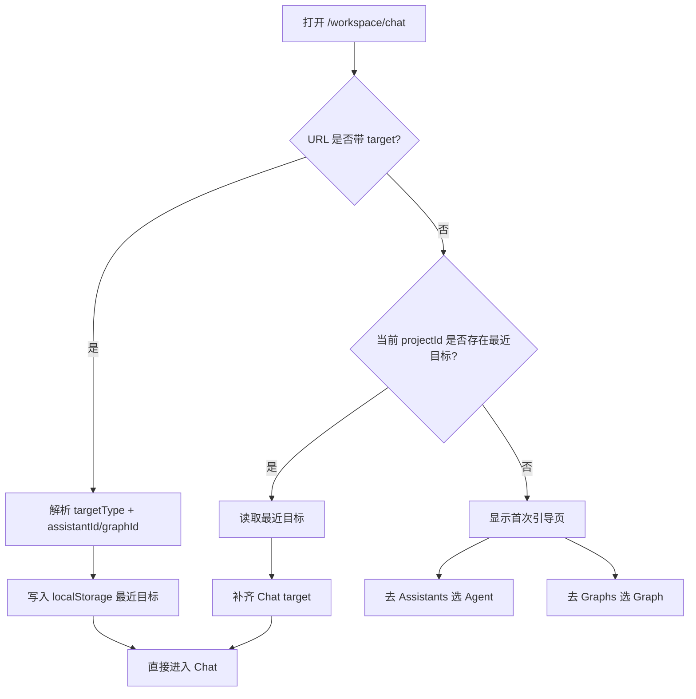

# Chat 入口优化与复杂工作区修复方案

更新时间：2026-04-02

## 1. 背景

当前 `platform-web-v2` 已完成复杂工作区的基础迁移，但在验收时暴露出三类问题：

- `SQL Agent` 页面已渲染但主内容区高度上下文不稳定，页面看起来像空白
- `Testcase Generate` 同样复用了复杂聊天母版，出现相同的可视区域塌陷问题
- `Chat` 页继续依赖页面内下拉选择 `assistant / graph`，而当前代理接口 `POST /api/langgraph/assistants/search` 与 `POST /api/langgraph/graphs/search` 在现环境返回 `404`

这三个问题不能分开补丁式修。要一次把“进入方式、展示骨架、验收口径”定清楚，不然后面继续烂尾。

## 2. 目标

- `Chat` 第一次打开时不再暴露坏掉的下拉入口
- 用户从 `Assistants / Graphs / Threads` 跳入 `Chat` 时，自动记住最近一次目标
- 再次打开 `/workspace/chat` 时，如果已经存在最近目标，直接进入对话界面
- `SQL Agent / Testcase Generate` 的聊天主区域恢复正常显示
- `Testcase` 区域明确展示 `Generate / Cases / Documents` 三个页面入口

## 3. Chat 进入流转图



## 4. 页面草案

### 4.1 首次引导页

首次打开且当前项目没有历史目标时，`/workspace/chat` 不进入聊天壳子，直接显示引导卡片：

```text
+---------------------------------------------------------------+
| Agent Chat                                                    |
| 先选一个 Agent 或 Graph，Chat 才能带着正确目标进入。          |
|                                                               |
| 你还没有为当前项目选择最近使用的聊天目标。                    |
|                                                               |
| [前往 Assistants]   [前往 Graphs]                             |
|                                                               |
| 说明：后续从详情页或列表页进入 Chat 后，这里会自动记住选择。  |
+---------------------------------------------------------------+
```

### 4.2 已选择目标后的 Chat

存在 URL target 或最近目标时：

- 不再显示页面内 target 下拉
- 直接进入 `BaseChatTemplate`
- 顶部上下文条继续展示：
  - 当前项目
  - 当前 target 类型
  - target ID
  - 当前 threadId（存在时）

### 4.3 Testcase 导航草案

`Generate` 页顶部上下文区域除了当前项目信息，还要增加三页切换入口：

```text
[AI 对话生成] [用例列表] [文档列表]
```

要求：

- 当前页高亮
- 不新增第二套复杂侧边栏
- 先放在 testcase 头部，降低改动面

## 5. 最近目标存储设计

存储载体：`localStorage`

建议 key：

`platform-web-v2:chat-target:<projectId>`

值结构：

```json
{
  "targetType": "assistant",
  "assistantId": "agent_xxx",
  "graphId": "",
  "updatedAt": "2026-04-02T00:00:00.000Z"
}
```

约束：

- `projectId` 为空时不持久化，避免跨项目串目标
- `assistant` 与 `graph` 互斥存储
- URL 参数优先级高于本地记忆

## 6. 代码改动清单

### 6.1 文档

- 新增 `docs/chat-entry-optimization.md`
- 更新 `docs/master-checklist.md`

### 6.2 布局修复

- 调整 `src/app/globals.css`
- 必要时补强 `workspace-shell__main / workspace-shell__content` 的 `flex / min-height / overflow` 规则
- 让 `BaseChatTemplate` 所在区域获得稳定高度上下文

### 6.3 Chat 入口重构

- 改造 `src/app/workspace/chat/page.tsx`
- 新增 `src/lib/chat-target-preference.ts`
- 新增一个轻量引导组件，承接“首次进入无目标”的场景

### 6.4 外部入口统一记忆

- `src/app/workspace/assistants/[assistantId]/page.tsx`
- `src/app/workspace/graphs/page.tsx`
- `src/components/threads/thread-history-page.tsx`

这些入口统一：

- 带上 `targetType`
- 带上正确的 `assistantId / graphId`
- 进入 Chat 前写入最近目标

### 6.5 Testcase 三页面入口

- 改造 `src/components/platform/testcase-chat-header.tsx`
- 在 `Generate` 头部增加 `generate / cases / documents` 入口

## 7. 验收清单

- [ ] `/workspace/sql-agent` 主聊天区域可见且可交互
- [ ] `/workspace/testcase/generate` 主聊天区域可见且可交互
- [ ] `/workspace/testcase/cases` 可以正常浏览与编辑
- [ ] `/workspace/testcase/documents` 可以正常浏览与预览
- [ ] `/workspace/chat` 首次打开无目标时展示引导页
- [ ] 从 `Assistants` 进入 `Chat` 后，刷新 `/workspace/chat` 能直接恢复最近目标
- [ ] 从 `Graphs` 进入 `Chat` 后，刷新 `/workspace/chat` 能直接恢复最近目标
- [ ] 从 `Threads` 打开 `Chat` 时，`threadId + target` 一起恢复
- [ ] 不再依赖当前 404 的 `assistants/search`、`graphs/search` 下拉接口

## 8. 实施顺序

1. 先修壳子高度，解决 `SQL Agent / Testcase Generate` 空白
2. 再重构 `Chat` 入口，彻底绕开坏掉的 target 下拉
3. 再把 `Assistants / Graphs / Threads` 的 chat 跳转统一到新入口协议
4. 最后补 `Testcase` 三页面入口并做联调验收
