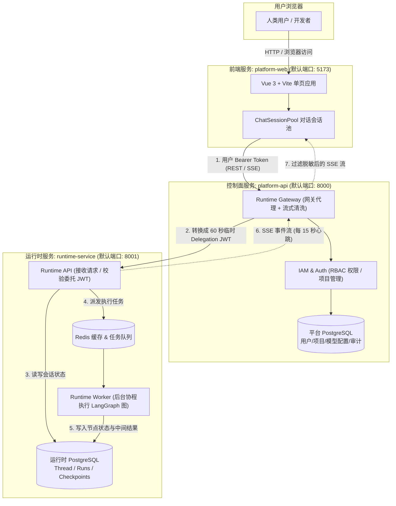

# 系统架构拓扑与进程全景

如果第一次看这个仓库的代码，很容易被各种目录绕晕。其实只要把整套系统当成一个**分工明确的餐厅**，它的结构就很直观：

- **`platform-web`（前厅点单台）**：前端界面，用户在这里打字聊天、看管理后台。
- **`platform-api`（前厅经理与收银台）**：处理用户登录、检查账号权限、记录审计日志、管理模型秘钥。它绝不下厨炒菜。
- **`runtime-service`（后厨工作间）**：真正调大模型、跑 LangGraph 状态机、运行工具和 Skills 的地方。

---

### 全景交互式架构图谱（支持在预览中直接拖拽、高亮、切换主题）

<iframe src="./system-topology-interactive.html" width="100%" height="680px" frameborder="0" style="border: 1px solid #e2e8f0; border-radius: 8px; margin-bottom: 24px;"></iframe>

> 无法加载 iframe 时，也可直接使用浏览器打开查看：[system-topology-interactive.html](system-topology-interactive.html)

---

### 静态拓扑连线与进程依赖（Mermaid 源码视图）

---

## 运行时实际存在的 4 个服务进程

当你执行根目录的启动脚本 `bash "scripts/local-stack.sh" start` 时，本地一共会跑起 4 个核心进程：

| 进程名称 | 所在目录 | 监听端口 | 承担的具体工作 |
|---|---|---|---|
| **Platform Web** | `apps/platform-web` | `5173` (Vite) | 浏览器工作台。承接管理后台和聊天对话界面。 |
| **Platform API** | `apps/platform-api` | `8000` (FastAPI) | 业务管理中心。负责登录、项目隔离、签发向后访问的短时凭证。 |
| **Runtime API** | `apps/runtime-service` | `8001` (FastAPI) | 智能体接口层。只认 API 签发的内部凭证，负责创建运行线程与接收消息。 |
| **Runtime Worker** | `apps/runtime-service` | 无外部端口 | 后台执行工人。从 Redis 队列取任务，一步步运行 LangGraph 节点和工具。 |

除了这 4 个应用进程，系统还依赖 2 个数据库实体：

1. **平台业务库（Platform PostgreSQL）**：存放用户表、项目成员表、审计日志、模型密钥配置（BYOK）。
2. **运行时专库（Runtime PostgreSQL + Redis）**：存放 LangGraph 的 Checkpoints（运行快照）、历史对话上下文、子智能体工具调用记录。

---

## 为什么一定要分成三层？

初学者常问：**为什么不直接让前端连 Runtime，或者干脆把 API 和 Runtime 写在一个 Python 项目里？**

有三个非常实际的原因：

1. **防止前端直接拿到大模型权限**
   如果前端直接调用 Runtime，用户一旦在浏览器抓包，就能拿到底层大模型的调用凭证，甚至能绕过项目权限直接操作数据库。通过 `platform-api` 挡在中间，前端永远只持有普通用户的登录 Cookie/Token，没有任何底层资源的直接权限。

2. **慢任务不能阻塞快业务**
   Agent 跑一个复杂任务（比如写代码、爬网页、查数据）可能需要 30 秒甚至数分钟。如果跟平时的登录、修改用户信息写在一个进程里，一旦几个大模型请求卡住，整个管理后台都跟着打不开。把 Worker 和控制面拆开后，后厨哪怕排大队，前厅照样能秒开。

3. **两套数据完全解耦**
   平台管理关注的是“这个用户属于哪个项目、有什么权限”；Agent 执行关注的是“上一步工具输出了什么、下一步该调哪个函数”。把这两类数据分别存在不同的库里，后续给 Runtime 扩容、清空测试会话或者做集群备份时，不会伤到平台账号数据。

---

## 核心代码入口速查

想亲自去翻代码时，认准这几个入口文件：

- **前端路由与挂载**：`apps/platform-web/src/main.ts` 与 `apps/platform-web/src/router/routes.ts`
- **控制面后端入口**：`apps/platform-api/src/platform_api/main.py`
- **控制面网关代理逻辑**：`apps/platform-api/src/platform_api/modules/runtime_gateway/`
- **运行时服务入口**：`apps/runtime-service/src/runtime_service/webapp.py`
- **本地多进程编排脚本**：`scripts/local-stack.sh`
