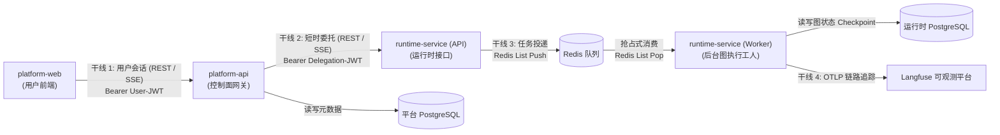
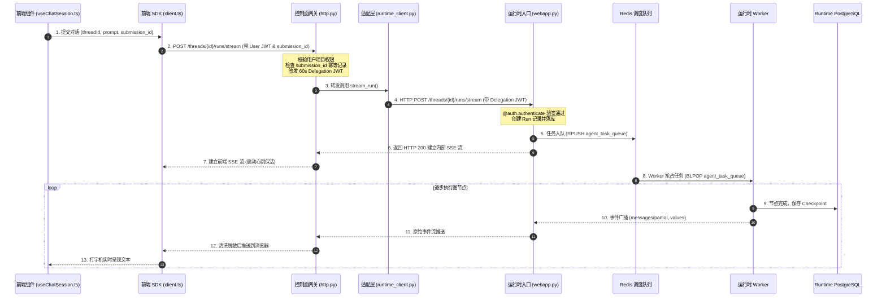

# 02-01 服务间通信全景矩阵深度解密

> **模块定位与核心价值**：建立整套系统的**通信总线契约与调用地图**。
> 明确回答在分布式执行环境下，各个独立进程在什么时机、用什么协议、带什么凭证调用谁，杜绝服务间职责不清、超时配置冲突以及重试引发雪崩的严重隐患。

---

## 零、 知识前置与上下文串联（Knowledge Bridges）

在深入阅读各个接口前，必须先理清三个底层通信概念，以及整仓通信干线的全局拓扑。

### 1. 前置必备概念速查

- **概念 1：为什么存在多种通信协议（HTTP REST vs. SSE vs. Redis List vs. OTLP）？**
  - **HTTP REST**：用于确定性的单次查询与元数据提交（如登录、拉取助手列表、修改项目配置），具有强一致性的状态码机制；
  - **SSE（Server-Sent Events）**：用于单向流式输出（大模型逐字生成、实时思考状态推送），开销远低于双向 WebSocket；
  - **Redis List / PubSub**：用于内部异步解耦，API 快速接单后丢入队列即释放连接，后台 Worker 抢占消费，实现高并发削峰填谷；
  - **OTLP（OpenTelemetry Protocol）**：标准化的遥测链路传输协议，用于异步将运行时 Trace 树上报到 Langfuse 等可观测平台。
- **概念 2：业务提交幂等凭据（`submission_id`）**
  - 在移动端或网络不稳定场景下，用户点击一次“发送”，客户端可能会因为首包超时发起两次真实的 HTTP POST；
  - 如果接口无状态，服务端会创建两个重复的 Run 并扣两次模型费用。系统通过在客户端生成不可变的 `submission_id`（UUID），配合服务端的准入去重，彻底阻断重复扣费与并发冲突。
- **概念 3：透明代理与业务网关的本质差别**
  - 普通透明代理（如 Nginx 反向代理）只做 TCP/HTTP 转发，不感知业务；
  - 平台的 `runtime_gateway` 是具备状态感知能力的业务网关：负责校验用户权限、动态换发内部短时凭证（Delegation JWT）、清洗大模型输出，并在上游长时间静默时注入保活心跳。

### 2. 链路上下文坐标



---

## 一、 对立视角：简易原型 vs 生产架构（Naive vs. Production）

### 1. 初学者的常规写法（Naive Demo）
很多初学者做 Agent 平台时，子系统之间的调用往往是网状混乱的：
- 前端直接拿到 Runtime 接口地址发请求；
- 某个 Agent 节点卡死 2 分钟，前端整个界面转圈等待，刷新页面后之前输入的内容全部丢失；
- 服务之间通过配置长期固定的全局 API Key 互相调用，没有任何调用频率、权限范围或模型白名单限制。

### 2. 生产环境下的致命缺陷
- **安全边界沦陷**：前端一旦被恶意脚本注入或被用户抓包，底层大模型调用密钥彻底泄露；
- **雪崩效应**：当大模型服务端响应缓慢时，所有请求堆积在 Web 进程中，迅速耗尽服务器的连接池和内存，连系统登录页都会瘫痪；
- **重试风暴**：网络抖动时，客户端如果没有退避策略与幂等保护，会短时间内发出成百上千次相同任务请求，引发后台重复扣费。

### 3. 本项目的架构升级与设计取舍（Trade-offs）
- **通信干线严格收敛为 4 条**：严禁出现跨层调用（例如前端绝对不直连 Runtime，Worker 绝对不直连平台库）；
- **快慢进程彻底物理隔离**：控制面 API 处理毫秒级管理业务，秒级至分钟级的 Agent 思考任务全部交由 Redis 队列解耦给 Worker 异步执行；
- **全链路分级超时与幂等去重**：各干线设置差异化的超时阈值，并在网关层通过 `submission_id` 实现秒级幂等识别。

---

## 二、 源码精准坐标映射（Code Pointer Map）

| 通信干线 | 核心发起方路径 | 核心接收方路径 | 关键类 / 函数 |
|---|---|---|---|
| **干线 1 (Web -> API)** | `apps/platform-web/src/services/langgraph/client.ts` | `apps/platform-api/src/platform_api/modules/runtime_gateway/presentation/http.py` | `LangGraphClient.streamRun()`, `stream_thread_run()` |
| **干线 2 (API -> Runtime)** | `apps/platform-api/src/platform_api/adapters/langgraph/runtime_client.py` | `apps/runtime-service/src/runtime_service/auth/platform.py` | `LangGraphRuntimeClient.stream_run()`, `@auth.authenticate` |
| **干线 3 (Runtime -> Worker)** | `apps/runtime-service/src/runtime_service/webapp.py` | `apps/runtime-service/src/runtime_service/runtime/` | Redis 任务入队与后台 Worker 消费循环 |
| **干线 4 (Runtime -> 观测)** | `apps/runtime-service/src/runtime_service/observability/` | Langfuse / 平台审计表 | `setup_agent_trace()`, OTLP Exporter |

---

## 三、 4 条通信干线权威参数对照矩阵

| 参数维度 | 干线 1（前台业务通道） | 干线 2（内部受控通道） | 干线 3（任务调度通道） | 干线 4（遥测审计通道） |
|---|---|---|---|---|
| **调用两端** | `platform-web` -> `platform-api` | `platform-api` -> `runtime-service` | `Runtime API` -> `Runtime Worker` | `runtime-service` -> `Langfuse / 审计` |
| **通信协议** | HTTP/1.1 或 H2 (REST / SSE) | 内网 HTTP/1.1 (反向代理 / SSE) | Redis List / PubSub 协议 | HTTP REST / OTLP 协议 |
| **认证凭证** | 用户登录产生的 `Bearer User-JWT` | 网关动态签发的 `Bearer Delegation-JWT` | 内网凭据 / 基础设施信任 | Langfuse 专用 API Key 与内网标记 |
| **有效生存期** | 数小时至数天（支持 Refresh） | **严格 60 秒**（过期立即废弃） | 依赖 Redis 内存生存期 | 永久审计归档 |
| **超时时间** | 查询 10s；首字 30s；流式心跳刷新 | 同步接口 10s；流式保持 | Worker 任务单步最长 600s | 异步非阻塞上报（超时 3s 丢弃） |
| **重试策略** | 指数退避（1, 2, 4, 8, 15s）最多 5 次 | 内部不盲目重试，故障直接报错 | 依赖 Checkpoint 机制原地恢复 | 失败静默丢弃，不阻塞主任务 |

---

## 四、 端到端函数级调用时序（Function-Level Trace）



---

## 五、 核心实现高保真伪代码（High-Fidelity Pseudocode）

### 1. 前端客户端：携带幂等标识与指数退避重试控制器

```typescript
// 对应源码：apps/platform-web/src/services/langgraph/client.ts
interface StreamRunOptions {
  threadId: string;
  assistantId: string;
  input: Record<string, unknown>;
  submissionId: string; // 唯一幂等编号
}

async function streamRunWithRetry(options: StreamRunOptions) {
  const retryDelays = [1000, 2000, 4000, 8000, 15000]; // 指数退避间隔（毫秒）
  let attempt = 0;

  while (attempt <= retryDelays.length) {
    try {
      // 提交时始终携带相同的 submissionId，确保重试不会重复创建 Run
      return await executeFetchStream({
        url: `/api/v1/threads/${options.threadId}/runs/stream`,
        method: "POST",
        headers: {
          "Content-Type": "application/json",
          "X-Submission-Id": options.submissionId,
        },
        body: JSON.stringify({
          assistant_id: options.assistantId,
          input: options.input,
        }),
      });
    } catch (err: any) {
      // 遇到不可重试的错误（4xx 客户端错误、410 游标失效、鉴权失败）直接抛出
      if (err.status >= 400 && err.status < 500) {
        throw err;
      }

      attempt++;
      if (attempt > retryDelays.length) {
        throw new Error(`连接失败，已达到最大重试次数 (${attempt})`);
      }

      const delay = retryDelays[attempt - 1];
      console.warn(`网络异常，将在 ${delay}ms 后进行第 ${attempt} 次重试...`);
      await new Promise((resolve) => setTimeout(resolve, delay));
    }
  }
}
```

### 2. 控制面网关：幂等识别与分发防护（提取自 `http.py`）

```python
# 对应源码：apps/platform-api/src/platform_api/modules/runtime_gateway/presentation/http.py
from fastapi import HTTPException, Request


async def handle_stream_submission(
    request: Request, thread_id: str, payload: dict, submission_id: str
):
    # 1. 检查 submission_id 幂等记录
    existing_run = await audit_service.get_run_by_submission_id(submission_id)
    if existing_run:
        if existing_run.is_running:
            # 如果之前的同名提交已经在执行中，绝不重复启动，直接加入现有流
            return await join_existing_run_stream(
                thread_id, existing_run.id, request
            )
        else:
            # 已经执行完毕的直接返回终态，防止刷单
            return existing_run.final_output

    # 2. 准入通过，签发短时 Delegation JWT
    delegation_token = create_runtime_delegation_token(
        subject=request.state.user_id,
        project_id=request.state.project_id,
        scope={"operation": "run-create", "thread_id": thread_id},
        secret=settings.runtime_delegation_secret,
    )

    # 3. 通过反向代理打到运行时接口
    return await upstream_runtime_client.post_stream(
        path=f"/threads/{thread_id}/runs/stream",
        headers={"Authorization": f"Bearer {delegation_token}"},
        body=payload,
    )
```

---

## 六、 假想断电与极限场景推演（Thought Experiments）

### 场景：用户因为网络不稳定，在 1 秒内连续狂点 5 次“发送”按钮
- **简易系统表现**：后端连续收到 5 个请求，数据库并发插入 5 个 Run，大模型收到 5 份相同提示词并开始并发生成，平台白白扣除 5 份 API 费用，客户端收到 5 股互相打架的流式文字并发生显示混乱。
- **本系统表现**：
  1. 前端在点击第一下时，生成唯一的 `submission_id`，之后的 4 次狂点由于绑定的是同一个提交上下文，携带的 `submission_id` 完全一致；
  2. 网关 `handle_stream_submission` 在收到第 1 个包时成功抢占锁并创建 Run；
  3. 第 2 到第 5 个并发包到达网关时，检测到该 `submission_id` 已经在运行中，网关直接返回已存在的流式订阅句柄（Join Stream），而不是重复建 Run；
  4. 后台 Worker 始终只有 1 个任务在跑，数据库状态单一有序，零额外模型计费。

---

## 七、 架构不变量清单（Architectural Invariants）

任何后续二次开发与代码重构，绝不允许打破以下三条红线：

1. **调用流向单向禁止跨层**：前端绝对不直接暴露 Runtime 端口；控制面绝对不把用户长效 Bearer Token 透传给 Runtime；Worker 绝对不直连平台业务库。
2. **所有长任务创建必须强制绑定 `submission_id`**：发起 Run 的入口必须具备幂等识别凭据，严禁设计无幂等保护的盲目提交接口。
3. **干线 2 的凭证生存期不得超过 60 秒**：服务间委托凭证绝不允许被硬编码为永久 Token，必须动态计算 `now + 60`，从源头消灭凭证泄露隐患。
