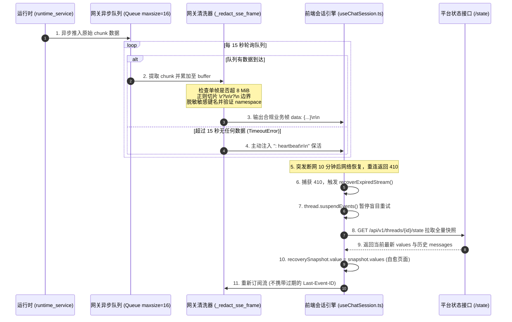

# 02-03 SSE 流式推送全链路与自愈机制深度解密

> **模块定位与核心价值**：构建运行端（`runtime-service`）、网关层（`platform-api`）与浏览器前端（`platform-web`）之间的**长效稳定流式事件管道**。
> 彻底解决大模型长思考引发的 45 秒空闲假死断连、超大单帧内存撑爆，以及网络抖动后 HTTP 410 游标过期死循环重试的工程死穴。

---

## 零、 知识前置与上下文串联（Knowledge Bridges）

在阅读具体实现代码前，必须掌握三个底层协议与运行时概念，以及本机制在全系统链路中的坐标。

### 1. 前置必备概念速查

- **概念 1：SSE 协议帧规范与注释行的保活原理**
  - 标准 SSE 基于持久化 HTTP 长连接（`text/event-stream`）。数据必须以 `\n\n` 结尾作为单帧分界；
  - 规范规定：凡是以冒号 `:` 开头的行均为**注释行**（例如 `: heartbeat`）。浏览器和标准客户端解析器在收到注释行时，会完整读取并刷新 TCP/HTTP 活跃计时器，但不会向业务层抛出任何消息事件。这是实现零业务干扰保活的关键协议特性。
- **概念 2：HTTP 410 Gone 与 EventSource 游标过期**
  - 当客户端发生网络波动断开连接后，重连时会在请求头携带 `Last-Event-ID` 尝试断点续传；
  - 服务端由于内存限制或滚动清理，若该事件历史早已被丢弃，则不能返回 404（资源不存在）或 500，必须返回 **410 Gone（`cursor_expired`）**，明确告知客户端“之前的事件游标彻底失效，请勿再拿原位置重试”。
- **概念 3：LangGraph 的两类流式事件模式**
  - **`values` 模式**：每次图节点执行完毕，输出当前图状态（State）的全量快照；
  - **`messages/partial` 模式**：当大模型处于吐字阶段时，逐 Token 产出增量文本块（Chunk）。

### 2. 链路上下文坐标

- **输入来源（上游）**：
  `runtime-service` 中的 LangGraph 执行图通过异步生成器产出原始事件字节流（包含中间节点状态更新、大模型增量输出与子智能体命名空间调用）。
- **当前处理（本层）**：
  控制面 `platform-api` 的网关反向代理层通过异步队列解耦接收，逐帧审查体积、清洗内部敏感键名，并在上游静默超 15 秒时向下游注入保活帧。
- **输出去向（下游）**：
  清洗后的安全流推送给浏览器 `platform-web`。前端由 `useChatSession.ts` 和 `useSessionInterrupts.ts` 消费，负责流式渲染文本、提取思考过程，并在遭遇 410 异常时触发单飞快照自愈。

---

## 一、 对立视角：简易原型 vs 生产架构（Naive vs. Production）

### 1. 初学者的常规写法（Naive Demo）
很多初学者构建 Agent 平台时，流式转发代码通常直接写成如下形式：
```python
# 常见的简易透传写法（存在严重生产隐患）
@router.post("/threads/{id}/runs/stream")
async def naive_stream(id: str):
    async def event_generator():
        async for chunk in upstream_client.stream(id):
            yield chunk  # 原封不动往外抛

    return StreamingResponse(event_generator(), media_type="text/event-stream")
```
前端也仅仅简单声明一个原生客户端：
```javascript
const es = new EventSource(`/threads/${id}/runs/stream`);
es.onerror = () => es.reconnect(); // 盲目重试
```

### 2. 生产环境下的致命缺陷
- **缺陷 1（45 秒假死断连）**：当智能体调用慢速工具（如复杂爬虫、跑大脚本或深度推理大模型思考长达 30 秒）时，上游没有任何字节产出。由于很多云厂商负载均衡和现代浏览器对空闲 HTTP 连接设置了 45 秒超时，连接会被静默切断，前端直接报红出错。
- **缺陷 2（超大单帧内存击穿）**：某个工具意外读取并输出了几十兆的日志或大文件，一个巨大的单帧直接推送给前端，瞬间导致浏览器标签页崩溃，网关进程也面临内存溢出风险。
- **缺陷 3（410 游标失效死循环）**：网络断开几分钟后，前端带着失效的 `Last-Event-ID` 触发重连，服务端返回 410。简易客户端如果陷入盲目重试，会导致接口每秒几十次连续报错 410，页面彻底死锁卡死。

### 3. 本项目的架构升级与设计取舍（Trade-offs）
- **引入双向异步队列与 15 秒独立心跳生成器**：即便上游彻底静默，网关依然能按严格的 15 秒间隔向下游发送 `: heartbeat\n\n`，保证 TCP 连接始终处于保活状态。
- **滑动窗口硬限制（8 MiB）**：以 8,388,608 字节为绝对红线，发现单帧超限立刻主动关闭上下游连接，宁可阻断单次脏数据，也绝不牺牲系统内存稳定性。
- **状态快照自愈替代死循环重试**：前端捕获 410 错误后，单飞一个 Promise 降级拉取最新状态（`service.state(id)`），重置会话后再订阅，实现用户无感恢复。

---

## 二、 源码精准坐标映射（Code Pointer Map）

| 模块职责 | 核心代码路径 | 关键类 / 函数 / 钩子 |
|---|---|---|
| **网关异步流式过滤器** | `apps/platform-api/src/platform_api/modules/runtime_gateway/presentation/http.py` | `_redact_protocol_event_stream()` |
| **单帧审查与脱敏解析** | `apps/platform-api/src/platform_api/modules/runtime_gateway/presentation/http.py` | `_redact_sse_frame()`, `_redact_event_value()` |
| **前端游标失效自愈** | `apps/platform-web/src/modules/chat/composables/useChatSession.ts` | `recoverExpiredStream()`, `reconnectStream()` |
| **前端审批状态机自愈** | `apps/platform-web/src/modules/chat/composables/useSessionInterrupts.ts` | `useSessionInterrupts()` |

---

## 三、 真实数据结构与报文（Real Payloads & DB Schemas）

### 1. 真实原始 SSE 业务帧（大模型流式增量与子智能体命名空间）
```http
event: messages/partial
data: {"method":"events","params":{"namespace":["dearflow_agent","subagent_worker"],"payload":{"id":"msg_8819","chunk":"正在分析","reasoning_content":"需要优先检索数据库"}}}

```

### 2. 真实网关保活心跳帧（注释格式，不含 data 字段）
```http
: heartbeat

```

### 3. 真实游标失效（410 Gone）响应报文
```http
HTTP/1.1 410 Gone
Content-Type: application/json

{
  "code": "cursor_expired",
  "message": "The requested event cursor is no longer available in the event buffer",
  "request_id": "9a01f4c781e24785b93e4307ef02c781"
}
```

---

## 四、 端到端函数级调用时序（Function-Level Trace）



---

## 五、 核心实现高保真伪代码（High-Fidelity Pseudocode）

### 1. 网关层：生产者消费者队列与 15 秒保活心跳（提取自 `http.py`）

```python
# 对应源码：apps/platform-api/src/platform_api/modules/runtime_gateway/presentation/http.py
import asyncio
import re
from typing import AsyncIterator, Callable

MAX_SSE_FRAME_BYTES = 8 * 1024 * 1024  # 8 MiB
DEFAULT_HEARTBEAT_SECONDS = 15.0
SSE_BOUNDARY = re.compile(b"\r?\n\r?\n")


async def redact_protocol_event_stream(
    upstream_stream: AsyncIterator[bytes],
    heartbeat_seconds: float = DEFAULT_HEARTBEAT_SECONDS,
    on_close: Callable[[str], None] | None = None,
) -> AsyncIterator[bytes]:
    buffer = bytearray()
    # 限制队列容量为 16，形成背压，防止消费太慢撑爆网关内存
    queue: asyncio.Queue[bytes | None | Exception] = asyncio.Queue(maxsize=16)

    # 后台协程：负责从上游 Runtime 拉取原始字节并压入队列
    async def read_upstream_task():
        try:
            async for chunk in upstream_stream:
                await queue.put(chunk)
            await queue.put(None)  # 终止标识
        except Exception as exc:
            await queue.put(exc)

    task = asyncio.create_task(read_upstream_task())

    try:
        while True:
            try:
                # 关键保活逻辑：等待队列数据，超时时间固定为 15 秒
                item = await asyncio.wait_for(queue.get(), timeout=heartbeat_seconds)
            except TimeoutError:
                # 超过 15 秒没有收到上游任何字节，立即向下游吐出注释保活帧
                yield b": heartbeat\n\n"
                continue

            if item is None:
                break
            if isinstance(item, Exception):
                raise item

            chunk: bytes = item
            buffer.extend(chunk)

            # 严格防范超大帧：如果单帧在未遇到分界符前超过 8 MiB，立即熔断
            if len(buffer) > MAX_SSE_FRAME_BYTES:
                raise ValueError("frame_too_large: 单帧超过 8 MiB 限制")

            # 增量扫描双换行符切片，绝不提前整包反序列化
            while boundary := SSE_BOUNDARY.search(buffer):
                raw_frame = bytes(buffer[: boundary.start()])
                del buffer[: boundary.end()]  # 清理消费过的缓冲区

                # 脱敏并发送单帧
                sanitized_frame = redact_single_sse_frame(raw_frame)
                yield sanitized_frame + b"\n\n"

        if on_close:
            on_close("eof")
    except Exception as exc:
        if on_close:
            on_close("frame_rejected" if "frame_too_large" in str(exc) else "upstream_error")
        raise
    finally:
        task.cancel()
        if hasattr(upstream_stream, "aclose"):
            await upstream_stream.aclose()
```

### 2. 前端层：互斥单飞的 410 游标失效快照自愈（提取自 `useChatSession.ts`）

```typescript
// 对应源码：apps/platform-web/src/modules/chat/composables/useChatSession.ts
let recoveryPromise: Promise<void> | undefined;

async function recoverExpiredStream(threadId: string) {
  // 规则：严格互斥单飞，并发报错时只能有一个恢复 Promise 在执行
  if (recoveryPromise) {
    return recoveryPromise;
  }

  recoveryPromise = (async () => {
    try {
      console.warn("检测到 410 cursor_expired，启动快照自愈机制");

      // 1. 立即挂起物理事件流，终止客户端无脑重试
      stream.getThread()?.suspendEvents();

      // 2. 重新验证当前会话的权限与状态
      const access = await apiService.getThreadAccess(threadId);
      if (!access.canRead) {
        throw new Error("权限已收回，断开会话连接");
      }

      // 3. 并行拉取服务端最新快照与历史全量消息
      const [latestState, history] = await Promise.all([
        apiService.fetchThreadState(threadId),
        apiService.fetchThreadHistory(threadId),
      ]);

      // 4. 水合更新页面数据，将状态推进到当前节点（恢复审批卡片、更新输入输出）
      chatSessionStore.setSessionHistory(threadId, history);
      recoverySnapshot.value = latestState.values;
      errorBanner.value = "历史流已过期，已刷新为最新运行状态";

      // 5. 重新发起事件订阅（清空旧的 Last-Event-ID，从当前点起跑）
      await stream.getThread()?.reconnectEvents();
    } finally {
      recoveryPromise = undefined; // 释放锁
    }
  })();

  return recoveryPromise;
}
```

---

## 六、 假想断电与极限场景推演（Thought Experiments）

### 场景一：大模型进行深度推理，静默长达 40 秒不输出任何文字
- **简易系统表现**：第 45 秒，客户端或 Nginx 触发超时断开，前端突然弹出红色连接断开报错，用户任务失败。
- **本系统表现**：
  1. 第 15 秒，网关 `asyncio.wait_for` 超时，生成器产出第一行 `: heartbeat\n\n`；
  2. 第 30 秒，网关产出第二行 `: heartbeat\n\n`；
  3. 浏览器虽然没有渲染新字，但 TCP 连接被持续刷新；
  4. 第 40 秒，大模型终于产出文本，`messages/partial` 正常送达前端并打字呈现。全过程用户无感知。

### 场景二：用户合上笔记本电脑屏幕 10 分钟后重新打开
- **简易系统表现**：前端携带 10 分钟前的 `Last-Event-ID` 疯狂重连，服务端返回 410，前端进入每秒重试死循环，页面卡死。
- **本系统表现**：
  1. 浏览器唤醒后发起重试，网关返回 HTTP 410；
  2. 前端 `useChatSession.ts` 捕获 410，立即触发 `suspendEvents()` 掐死自动重试；
  3. 前端触发 `recoverExpiredStream()`，从状态接口拉取全量快照，将页面直接对齐到 10 分钟后的最终状态；
  4. 清理旧游标重新建连，整个过程控制在一次网络往返内解决。

---

## 七、 架构不变量清单（Architectural Invariants）

任何后续二次开发与代码重构，绝不允许打破以下三条红线：

1. **连接断开不等于 Run 失败**：网络抖动、页面刷新或 TCP 断开属于 Transport 连接层事件，严禁在前端或网关直接将后台任务标记为终态失败。后台任务的状态只以 Runtime Checkpoint 为准。
2. **单帧上限严格锁定为 8 MiB**：单次推送帧的长度超过 8,388,608 字节必须强制阻断并抛出 `frame_too_large`，防止恶意或异常工具输出耗尽网关与前端内存。
3. **心跳帧严禁携带任何业务 Payload**：保活帧格式必须为纯注释（`: heartbeat\n\n`），绝不能为了省事往心跳里塞消息内容，确保标准客户端解析器不产生脏事件。
