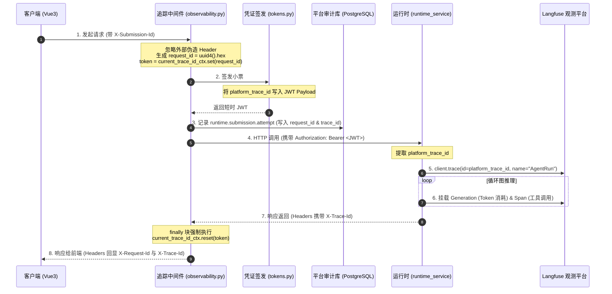

# 02-04 全链路追踪与可观测性体系深度解密

> **模块定位与核心价值**：建立整套系统的**分布式链路追踪与审计流水体系**。
> 统一 `request_id`、`platform_trace_id` 与 `submission_id` 的生成与传导规范，让每一次用户操作在大模型生成、工具调用、网关清洗及数据库落库的全生命周期中拥有唯一确定性的追踪轨迹，杜绝线上排障无从下手的痛点。

---

## 零、 知识前置与上下文串联（Knowledge Bridges）

在阅读具体追踪代码前，必须掌握三个底层追踪概念，以及追踪数据在全系统链路中的坐标。

### 1. 前置必备概念速查

- **概念 1：为什么需要区分 Request ID 与 Trace ID？**
  - **`request_id`**：属于**单次 HTTP 传输层标识**。客户端与服务端之间的一次 HTTP 请求/响应生命周期对应一个唯一的 `request_id`。如果客户端因网络超时重试了 3 次，会产生 3 个完全不同的 `request_id`；
  - **`platform_trace_id`**：属于**全局业务链路标识**。它自请求进入网关时生成，一路注入 Delegation JWT 传导给 Runtime Service，并与 Langfuse 的 Trace 树对齐。多次网络重试如果归属于同一业务会话，其 `platform_trace_id` 可以关联到同一棵执行树上。
- **概念 2：Python 异步编程中的 `ContextVar` 协程安全隔离**
  - 在 FastAPI / Starlette 的异步并发体系下，多个 HTTP 请求由同一个事件循环（Event Loop）交替调度执行。如果使用常规的全局变量存储当前请求的 Trace ID，会导致不同用户的请求发生严重的**变量污染与串号**；
  - Python 标准库的 `contextvars.ContextVar` 提供协程局部存储能力，保证每个协程调用链拥有独立的上下文数据副本。
- **概念 3：Langfuse 树状调用模型（Traces -> Generations -> Spans）**
  - **Trace**：代表一次完整的用户问答生命周期；
  - **Generation**：代表单次大模型的推理过程（记录输入 Prompt、输出 Chunk、Prompt Tokens 与 Completion Tokens 消耗）；
  - **Span**：代表单次 Python 工具或 MCP 外部调用（记录工具入参、执行耗时与返回数据）。

### 2. 链路上下文坐标

- **输入来源（上游）**：
  前端发起请求，网关层通过 `trace_propagation_middleware` 生成 32 位十六进制 `request_id` 并将其写入 `ContextVar`。
- **当前处理（本层）**：
  控制面在签发 Delegation JWT 时，将 `platform_trace_id` 显式写入 Payload，并在写入本地审计数据库时记录请求准入流水（`runtime.submission.attempt`）。
- **输出去向（下游）**：
  Runtime Service 提取 `platform_trace_id`，将其作为根标识注入给 Langfuse 客户端和 LangGraph 节点回调，同时在 HTTP 响应头回显 `X-Trace-Id` 供前端记录。

---

## 一、 对立视角：简易原型 vs 生产架构（Naive vs. Production）

### 1. 初学者的常规写法（Naive Demo）
很多初学者处理分布式日志时，做法非常简陋：
```python
# 简易日志记录（存在严重生产隐患）
@app.middleware("http")
async def naive_logging(request: Request, call_next):
    # 盲目信任客户端伪造的 Header
    trace_id = request.headers.get("X-Trace-Id", str(uuid.uuid4()))
    logger.info(f"[{trace_id}] 开始处理请求: {request.url.path}")
    response = await call_next(request)
    return response
```

### 2. 生产环境下的致命缺陷
- **盲目信任外部输入引发安全伪造**：黑客可以在请求头传入恶意的 `X-Trace-Id`（如包含 SQL 注入语句或超长字符），导致内部审计日志解析异常甚至被日志注入攻击污染；
- **异常情况下协程上下文泄漏**：如果中间件没有把上下文设置与重置放在严格的 `try...finally` 块中，当请求中途抛出异常或被客户端掐断连接时，该协程复用的线程上下文未能清理，导致后续不相关的请求沿用旧的 Trace ID；
- **大模型调用与平台操作脱节**：平台后台查到某条审计日志报错，但由于没有贯穿到大模型可观测系统，根本不知道那次报错究竟消耗了多少 Token，也无法查出当时发给模型的原始 Prompt 是什么。

### 3. 本项目的架构升级与设计取舍（Trade-offs）
- **单向生成，彻底忽略外部伪造 Header**：网关层无论收到什么外部 Header，强制在本地由安全随机数生成 32 位小写十六进制字符串（`uuid.uuid4().hex`），绝不回显外部不可信原值；
- **严格防御的 ContextVar 生命周期治理**：设置与重置置于完整的 `try...finally` 结构中，覆盖正常响应、业务异常以及客户端提前断流（CancelledError）全部分支；
- **全链路打通 Langfuse 深度观测**：将 `platform_trace_id` 深度融入 Delegation JWT 与 Langfuse 回调体系，实现“平台审计记录”与“大模型 Token 消耗树”双向毫秒级精确互查。

---

## 二、 源码精准坐标映射（Code Pointer Map）

| 模块职责 | 核心代码路径 | 关键类 / 函数 / 变量 |
|---|---|---|
| **请求上下文与 ID 生成** | `apps/platform-api/src/platform_api/core/observability.py` | `trace_propagation_middleware()`, `current_trace_id_ctx` |
| **令牌凭证注入** | `apps/platform-api/src/platform_api/core/security/tokens.py` | `create_runtime_delegation_token(..., platform_trace_id=...)` |
| **审计流水白名单记录** | `apps/platform-api/src/platform_api/modules/audit/service.py` | `AuditService.record_runtime_event()`, `http_resolution.py` |
| **运行时观测挂载** | `apps/runtime-service/src/runtime_service/observability/` | `setup_agent_trace()`, `LangGraphTraceCallbackHandler` |

---

## 三、 真实数据结构与报文（Real Payloads & DB Schemas）

### 1. 3 个核心编号的生成与比对规则

| 编号字段 | 生成格式 | 校验规则 | 传递载体 |
|---|---|---|---|
| **`request_id`** | `uuid.uuid4().hex` | 32 位纯小写十六进制字符串 | HTTP 响应头 `X-Request-Id` |
| **`platform_trace_id`** | 初始取 `request_id` | 32 位纯小写十六进制字符串 | Delegation JWT Payload、HTTP 响应头 `X-Trace-Id` |
| **`submission_id`** | 客户端生成的标准 UUID | 36 位标准 UUIDv4（含连字符） | HTTP 请求头 `X-Submission-Id`、数据库 `submission_id` 列 |

### 2. 真实审计数据库白名单字段（PostgreSQL 表 `audit_runtime_events`）
```sql
CREATE TABLE audit_runtime_events (
    id UUID PRIMARY KEY DEFAULT gen_random_uuid(),
    event_type VARCHAR(64) NOT NULL,            -- 例如: runtime.stream.opened, runtime.submission.attempt
    platform_trace_id VARCHAR(32) NOT NULL,     -- 关联全局追踪
    request_id VARCHAR(32) NOT NULL,            -- 关联单次 HTTP
    submission_id UUID,                         -- 关联业务幂等
    project_id VARCHAR(64) NOT NULL,
    thread_id VARCHAR(64),
    run_id VARCHAR(64),
    close_reason VARCHAR(32),                   -- 例如: eof, client_disconnect, frame_rejected
    created_at TIMESTAMPTZ NOT NULL DEFAULT NOW()
);

-- 高频查询专用复合索引
CREATE INDEX idx_audit_trace ON audit_runtime_events (platform_trace_id);
CREATE INDEX idx_audit_submission ON audit_runtime_events (submission_id, created_at);
```

---

## 四、 端到端函数级调用时序（Function-Level Trace）



---

## 五、 核心实现高保真伪代码（High-Fidelity Pseudocode）

### 1. 控制面：协程安全隔离中间件（提取自 `observability.py`）

```python
# 对应源码：apps/platform-api/src/platform_api/core/observability.py
import contextvars
import uuid
from starlette.middleware.base import BaseHTTPMiddleware
from starlette.requests import Request
from starlette.responses import Response

# 协程安全上下文变量
current_trace_id_ctx = contextvars.ContextVar(
    "current_trace_id_ctx", default=None
)


class TracePropagationMiddleware(BaseHTTPMiddleware):

    async def dispatch(self, request: Request, call_next) -> Response:
        # 规则 1：单向生成，彻底忽略客户端伪造的 X-Request-Id
        generated_id = uuid.uuid4().hex

        # 规则 2：绑定到当前协程上下文，返回用于还原的 token
        token = current_trace_id_ctx.set(generated_id)

        # 挂载到 request.state 方便下游路由提取
        request.state.request_id = generated_id
        request.state.platform_trace_id = generated_id

        try:
            response: Response = await call_next(request)

            # 规则 3：回显统一追踪头
            response.headers["X-Request-Id"] = generated_id
            response.headers["X-Trace-Id"] = generated_id
            return response

        finally:
            # 规则 4：无论正常完成、抛出未捕获异常还是连接断开，必须强制复原上下文，防协程污染
            current_trace_id_ctx.reset(token)
```

### 2. 运行时：Langfuse 树状调用追踪器（提取自 `observability/`）

```python
# 对应源码：apps/runtime-service/src/runtime_service/observability/
from langfuse import Langfuse
from langfuse.callback import CallbackHandler


def create_agent_trace_handler(
    platform_trace_id: str,
    project_id: str,
    thread_id: str,
    assistant_id: str,
) -> CallbackHandler:
    langfuse = Langfuse()

    # 规则 5：直接使用平台透传过来的 platform_trace_id 作为 Langfuse 根 Trace ID
    trace = langfuse.trace(
        id=platform_trace_id,
        name="LangGraphExecution",
        project_id=project_id,
        metadata={
            "thread_id": thread_id,
            "assistant_id": assistant_id,
            "runtime_environment": "production",
        },
    )

    # 返回 LangChain 原生回调处理器，自动拦截图内每一个大模型调用与工具调用
    return trace.get_langchain_handler()
```

---

## 六、 假想断电与极限场景推演（Thought Experiments）

### 场景：大模型调用过程中，客户端突然拔掉网线
- **简易系统表现**：服务端协程抛出 `ClientDisconnect` 异常崩溃。由于没有清理上下文，下一个进来的用户请求恰好复用了该工作线程，日志里输出了上一个用户的 Trace ID，线上排障时两条完全不同的会话被串成一条，引发运维误判。
- **本系统表现**：
  1. 客户端掐断连接，ASGI 服务器触发取消信号；
  2. 控制面 `TracePropagationMiddleware` 捕获到取消事件，进入 `finally` 块；
  3. 执行 `current_trace_id_ctx.reset(token)`，将协程上下文安全复位；
  4. 审计模块记录 `runtime.stream.closed`，并将原因准确标记为 `client_disconnect`；
  5. 后续任何请求进入该工作线程，均重新生成全新的 32 位 Trace ID，零上下文泄漏。

---

## 七、 架构不变量清单（Architectural Invariants）

任何后续二次开发与代码重构，绝不允许打破以下三条红线：

1. **外部追踪头严禁轻信与持久化**：进入系统的 `request_id` 与 `platform_trace_id` 必须由控制面后端唯一签发，严禁把客户端传入的未过滤字符串直接当成系统追踪号记录。
2. **上下文变量必须包裹在完整 try/finally 内**：对 `ContextVar` 的任何 `set()` 操作，必须且只能在匹配的 `finally` 块中通过其返回的 `token` 执行 `reset()`，防止异步协程池污染。
3. **审计查询强制带索引时间窗口约束**：按照 `submission_id`、`thread_id` 或 `run_id` 检索审计流水时，查询必须强制附带小于等于 7 天的时间范围限制，严禁在无时间过滤条件下全表扫描。
