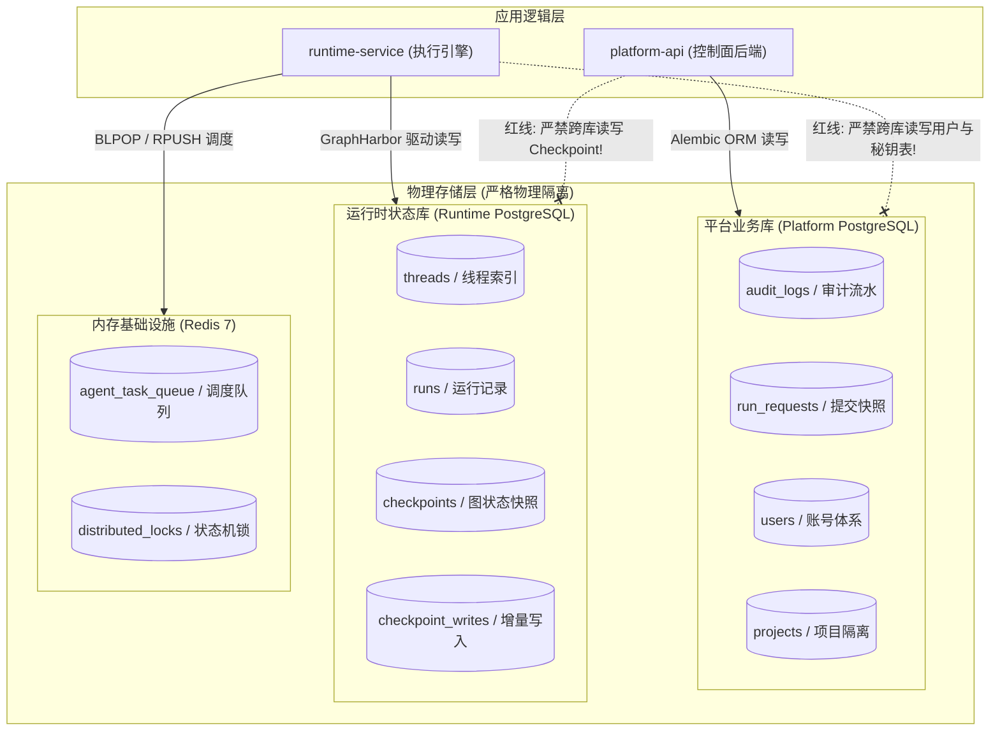
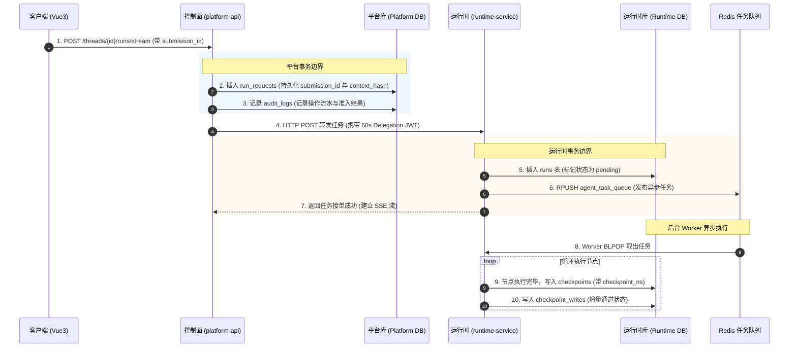

# 02-05 存储架构与数据隔离模型深度解密

> **模块定位与核心价值**：剖析平台的**多存储引擎物理隔离与生命周期分离架构**。
> 详细拆解平台业务库（Platform PostgreSQL）、运行时状态库（Runtime PostgreSQL）与缓存队列（Redis）的职责边界，明确回答“为什么必须物理分库”、“各自维护哪些表结构”以及“如何守住绝不跨库直连的红线”。

---

## 零、 知识前置与上下文串联（Knowledge Bridges）

在深入阅读各个表结构前，必须先理清三个底层存储概念，以及数据在平台中的生命周期特征。

### 1. 前置必备概念速查

- **概念 1：为什么单库逻辑分表无法满足企业级 Agent 场景？**
  - **平台业务数据**：如组织架构、用户账号、项目成员角色、大模型 API 密钥。数据体量通常在兆字节（MB）到吉字节（GB）级别，读多写少，要求极高的 ACID 事务可靠性与灾备能力；
  - **运行时状态数据**：LangGraph 的 Checkpoint 机制在每跑一个节点（大模型推理、工具执行、条件分支）时，都会将当前图的局部变量、对话消息历史做全量或增量快照序列化。单次任务可能产生数十条体积达数兆的快照记录。
  - 如果混在同一个数据库实例中，高并发运行 Agent 会瞬间吃满数据库的 I/O 带宽与连接池，直接让管理后台的普通 HTTP 查询超时瘫痪。
- **概念 2：GraphHarbor 的 Checkpoint 存储模型与 `checkpoint_ns` 命名空间**
  - LangGraph 依托底层持久化器存储状态，而在本项目中由 `graphharbor==0.13.0.post37` 负责驱动；
  - 它通过 `checkpoints`、`checkpoint_blobs` 和 `checkpoint_writes` 三张表实现时间旅行与状态回溯。其中 `checkpoint_ns`（命名空间）是 post37 升级的核心特性，用于隔离主智能体与派生的子智能体（Subagent）状态。
- **概念 3：Alembic 迁移机制与双库独立演进**
  - 控制面后端使用标准的 `Alembic` 进行版本化表结构升级（位于 `apps/platform-api/migrations/versions/`）；
  - 运行时库的表结构生命周期由 GraphHarbor 自身内建的迁移器驱动。两个库的迁移历史完全独立，升级 Runtime 绝不要求控制面后端锁表重启。

### 2. 链路上下文坐标



---

## 一、 对立视角：简易原型 vs 生产架构（Naive vs. Production）

### 1. 初学者的常规写法（Naive Demo）
很多初学者做 Agent 平台时，数据库设计通常是“一张 SQLite 走天下”或者“单库单表全包圆”：
```python
# 初学者常见的单表设计
class BadAgentSession(Base):
    __tablename__ = "sessions"
    id = Column(String, primary_key=True)
    user_id = Column(String)  # 混在一起
    project_id = Column(String)
    model_api_key = Column(String)  # 明文混存
    chat_history = Column(JSON)  # 大 JSON 频繁读写
    graph_state = Column(LargeBinary)  # 状态快照死磕同一张表
```

### 2. 生产环境下的致命缺陷
- **行锁与表锁冲突**：大模型每输出一句话就要写一次 `graph_state`，由于和用户信息在同一张表，高频更新产生行锁等待，用户连查询个人资料都会被阻塞卡死；
- **密钥跨越安全边界泄露**：大模型 API Key 和动态执行的 Python 状态存放在一起。一旦某个动态加载的第三方工具（如 Bash 执行工具）存在目录遍历或 SQL 注入漏洞，攻击者能直接 dump 出整张表的所有模型密钥和管理员密码；
- **历史归档困难**：Agent 运行一个月后，快照表膨胀到几百个 GB。由于表里混着核心用户数据，运维无法安全地执行 `TRUNCATE` 或分区快速裁剪。

### 3. 本项目的架构升级与设计取舍（Trade-offs）
- **物理分库分级保障**：控制面库聚焦高价值业务资产，定期做严格的热备与逻辑备份；运行时库聚焦高频 JSON 快照与日志，支持单独挂载高性能 NVMe 盘并设置基于时间的快照归档策略；
- **Redis 承担瞬间并发与锁治理**：将任务分发与状态防重抢占下沉到 Redis，保证数据库不直接承受任务排队的轮询压力；
- **网关作为唯一通信界面**：两套数据库各自只对自己的服务进程开放网络端口，从网络层直接物理掐断“跨库直连”。

---

## 二、 源码精准坐标映射（Code Pointer Map）

| 存储领域 | 核心代码与迁移路径 | 关键类 / 模块 |
|---|---|---|
| **平台业务库 ORM 定义** | `apps/platform-api/src/platform_api/core/db.py` | `session_scope()`, `BaseModel` |
| **平台库 Alembic 迁移脚本** | `apps/platform-api/migrations/versions/20260910_0001_platform_baseline.py` | `audit_logs`, `run_requests`, `users`, `projects` |
| **运行时库驱动入口** | `apps/runtime-service/src/runtime_service/db/` | GraphHarbor PostgreSQL 存储适配层 |
| **子智能体命名空间隔离** | `apps/runtime-service/pyproject.toml` | `graphharbor==0.13.0.post37`（锁定支持 `checkpoint_ns`） |

---

## 三、 真实数据结构与 Schema（Real Payloads & DB Schemas）

### 1. 平台业务库核心表结构（Alembic 迁移：`20260910_0001_platform_baseline.py`）

#### ① 审计日志表（`audit_logs`）
```sql
CREATE TABLE audit_logs (
    id UUID PRIMARY KEY,
    request_id VARCHAR(64) NOT NULL,            -- 关联单次 HTTP 请求
    plane VARCHAR(32) NOT NULL,                 -- 所属分层: control_plane / runtime_gateway
    action VARCHAR(128) NOT NULL,               -- 操作动作: 例如 run.create, user.login
    target_type VARCHAR(64),
    target_id VARCHAR(64),
    actor_user_id VARCHAR(64),                  -- 操作人 ID
    project_id VARCHAR(64),                     -- 租户隔离项目 ID
    result VARCHAR(32) NOT NULL,                -- success / failure
    status_code INTEGER NOT NULL,
    duration_ms INTEGER NOT NULL,
    metadata_json JSON NOT NULL,                -- 结构化扩展属性
    created_at TIMESTAMPTZ NOT NULL DEFAULT NOW()
);
```

#### ② 运行请求幂等快照表（`run_requests`）
```sql
CREATE TABLE run_requests (
    id UUID PRIMARY KEY,                        -- 对齐客户端 submission_id
    project_id VARCHAR(64) NOT NULL,
    thread_id VARCHAR(128) NOT NULL,
    agent_key VARCHAR(128) NOT NULL,
    requested_by VARCHAR(255) NOT NULL,
    idempotency_key VARCHAR(128) NOT NULL,      -- 幂等摘要
    request_digest VARCHAR(64) NOT NULL,        -- 请求内容哈希
    context_snapshot JSON NOT NULL,             -- 提交时的上下文环境
    config_snapshot JSON NOT NULL,              -- 提交时的模型/工具配置
    context_hash VARCHAR(128) NOT NULL,
    run_id VARCHAR(128),                        -- 关联的底层 Runtime Run ID
    parent_run_id VARCHAR(128)
);
```

### 2. 运行时状态库核心表结构（GraphHarbor post37 驱动）

#### ① 检查点核心表（`checkpoints`）
```sql
CREATE TABLE checkpoints (
    thread_id VARCHAR(128) NOT NULL,
    checkpoint_ns VARCHAR(255) NOT NULL DEFAULT '', -- post37 核心列: 子智能体路由命名空间
    checkpoint_id VARCHAR(128) NOT NULL,           -- 单步快照唯一标识 (如 1ef7...)
    parent_checkpoint_id VARCHAR(128),             -- 上一步快照 ID (构建历史回溯 DAG)
    type VARCHAR(64),
    checkpoint BYTEA NOT NULL,                     -- 压缩序列化后的图节点 State 全量快照
    metadata JSONB NOT NULL DEFAULT '{}'::jsonb,   -- 运行元数据 (step, source, writes)
    PRIMARY KEY (thread_id, checkpoint_ns, checkpoint_id)
);

CREATE INDEX idx_checkpoints_ns ON checkpoints (thread_id, checkpoint_ns);
```

#### ② 增量写入表（`checkpoint_writes`）
```sql
CREATE TABLE checkpoint_writes (
    thread_id VARCHAR(128) NOT NULL,
    checkpoint_ns VARCHAR(255) NOT NULL DEFAULT '',
    checkpoint_id VARCHAR(128) NOT NULL,
    task_id VARCHAR(128) NOT NULL,
    idx INTEGER NOT NULL,
    channel VARCHAR(128) NOT NULL,                 -- 触发写入的状态通道名称
    type VARCHAR(64),
    value BYTEA NOT NULL,                          -- 增量更新的局部变更值
    PRIMARY KEY (thread_id, checkpoint_ns, checkpoint_id, task_id, idx)
);
```

---

## 四、 端到端函数级调用时序（Function-Level Trace）

展示一次 Run 提交时，数据如何在两个数据库间分流落地：



---

## 五、 核心实现高保真伪代码（High-Fidelity Pseudocode）

### 1. 控制面：防重放与事务隔离写入（提取自 `service.py`）

```python
# 对应源码：apps/platform-api/src/platform_api/modules/runtime_gateway/application/service.py
from platform_api.core.db import session_scope
from platform_api.core.errors import ConflictError


async def record_submission_intent(
    project_id: str,
    thread_id: str,
    submission_id: str,
    idempotency_key: str,
    context_hash: str,
) -> None:
    # 严格在独立的平台库会话作用域内执行
    async with session_scope() as session:
        # 1. 尝试查询已存在的提交记录
        existing = await session.execute(
            select(RunRequest).where(RunRequest.id == submission_id)
        )
        if existing.scalar_one_or_none():
            raise ConflictError(
                f"submission_id {submission_id} 已经存在，拒绝重复提交"
            )

        # 2. 插入幂等审计记录
        run_request = RunRequest(
            id=submission_id,
            project_id=project_id,
            thread_id=thread_id,
            idempotency_key=idempotency_key,
            context_hash=context_hash,
            status="accepted",
        )
        session.add(run_request)
        # 事务自动在 session_scope 退出时 commit，失败自动 rollback
```

### 2. 运行时：带命名空间的 Checkpoint 持久化（提取自 GraphHarbor 驱动逻辑）

```python
# 对应源码：GraphHarbor post37 运行态 Checkpoint 保存伪代码
from typing import Any, Mapping


async def save_graph_checkpoint(
    connection: Any,
    thread_id: str,
    checkpoint_ns: str,  # 核心参数: 主图传空字符串，子智能体传 "subagent:<name>"
    checkpoint_id: str,
    state_values: Mapping[str, Any],
    metadata: Mapping[str, Any],
) -> None:
    # 压缩序列化当前状态数据
    serialized_bytes = compress_and_pickle(state_values)

    sql = """
    INSERT INTO checkpoints (
        thread_id, checkpoint_ns, checkpoint_id, checkpoint, metadata
    ) VALUES ($1, $2, $3, $4, $5)
    ON CONFLICT (thread_id, checkpoint_ns, checkpoint_id)
    DO UPDATE SET checkpoint = EXCLUDED.checkpoint, metadata = EXCLUDED.metadata;
    """

    # 独立读写运行时专库，完全不触碰平台库
    await connection.execute(
        sql,
        thread_id,
        checkpoint_ns,
        checkpoint_id,
        serialized_bytes,
        json.dumps(metadata),
    )
```

---

## 六、 假想断电与极限场景推演（Thought Experiments）

### 场景：某次批量抓取任务导致运行时数据库高并发写满（磁盘 I/O 达到 100%）
- **简易系统表现**：整个 PostgreSQL 实例 I/O 挂起，连接池全部耗尽。其他用户无法登录，管理员无法打开控制台，甚至无法进入数据库后台杀死异常进程，整个平台彻底瘫痪。
- **本系统表现**：
  1. 运行时数据库 `Runtime DB` 的 I/O 虽被占满，部分 Agent 任务的 Checkpoint 写入发生延迟；
  2. 但控制面数据库 `Platform DB` 处于完全独立的物理实例或连接池，资源隔离度为 100%；
  3. 前台用户登录、租户权限鉴权、控制台管理查询依然在毫秒级正常响应；
  4. 运维可在控制台安全调阅系统审计日志，快速定位到引发 I/O 激增的具体项目与线程，精准实施降级阻断。

---

## 七、 架构不变量清单（Architectural Invariants）

任何后续二次开发与代码重构，绝不允许打破以下三条红线：

1. **绝对禁止双向跨库直连**：控制面代码严禁加载 Runtime 数据库连接串去查 Checkpoint；Runtime 代码严禁加载平台库去读账号和 API 密钥。两边数据交互必须且只能通过 HTTP REST 与网关换签进行。
2. **子智能体快照必须包含显式 `checkpoint_ns`**：在对 LangGraph 进行子图派生或 Subagent 编排时，严禁使用扁平的根命名空间覆盖主图状态，必须显式传递隔离命名空间（对齐 `post37` 规范）。
3. **敏感凭据仅允许在平台库加密静态保存**：大模型 API Key（BYOK）只保存在平台库 `model_references` 中并进行 AES 加密，严禁将其复制或持久化到运行时状态库的任何快照字段中。
