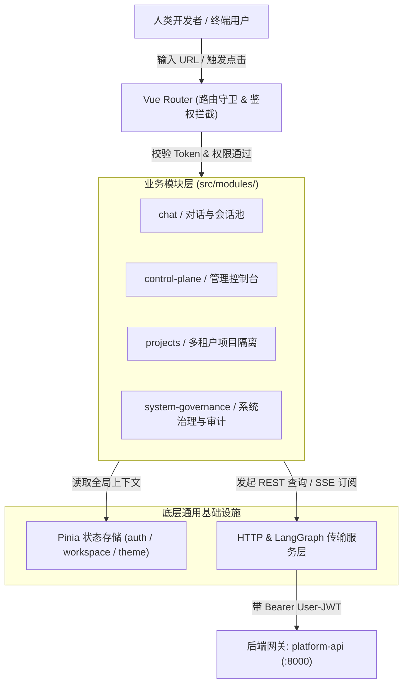
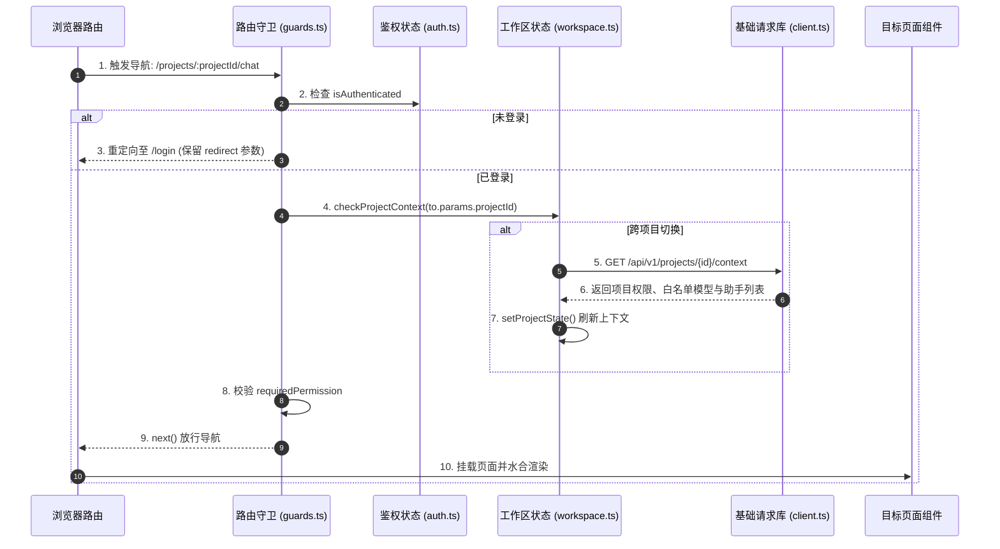

# 03-01 前端平台宿主架构与工程骨架深度解密

> **模块定位与核心价值**：剖析 `apps/platform-web` 作为企业级 Agent 平台主入口的**分层架构与工程治理规范**。
> 详细拆解 Vue 3 + TypeScript + Vite 下的模块化领域划分（Modules）、服务适配层（Services）、响应式状态机（Stores）以及路由鉴权守卫（Router Guards），解决大型前端工程代码膨胀、权限状态漂移与生命周期混乱的难题。

---

## 零、 知识前置与上下文串联（Knowledge Bridges）

在阅读具体前端实现代码前，必须掌握三个核心工程概念，以及前端在整套架构中的上下游位置。

### 1. 前置必备概念速查

- **概念 1：基于领域的模块化架构（Domain-Driven Modular Frontend）**
  - 传统前端往往按技术角色把代码机械切成 `views/`、`components/`、`apis/`，导致业务膨胀后修改一个“聊天”功能需要在几十个目录里反复横跳；
  - 本项目采用**业务领域模块化（Modules）**：将相关性极高的页面、业务组件、局部状态、ViewModel 聚合在 `src/modules/{domain}/` 下（如 `chat` 对话模块、`control-plane` 管理控制台、`projects` 项目隔离、`system-governance` 系统治理），实现高内聚、低耦合。
- **概念 2：Vue 3 组合式函数（Composables）与无状态 UI**
  - 组件模板（`.vue`）严格遵循瘦 UI 原则，只负责布局与交互绑定；
  - 复杂的业务状态机（如流式会话生命周期、长连接断线自愈、审批中断处理）全部抽取为纯 TypeScript 驱动的 `composables/`，不仅便于单测（无需挂载真实 DOM 即可跑 Vitest），也便于多场景复用。
- **概念 3：双层鉴权模型（路由级 Gate 与组件级 Permission Guard）**
  - **路由守卫**：在页面跳转阶段拦截，检查用户是否登录、租户是否有效、是否具有控制台访问门槛；
  - **组件守卫**：针对细粒度按钮（如创建项目、重置密钥、审批危险操作），基于用户的 RBAC 角色动态禁用或隐藏。

### 2. 链路上下文坐标



---

## 一、 对立视角：简易单页应用 vs 生产架构（Naive vs. Production）

### 1. 初学者的常规写法（Naive Demo）
初学者的 Vue 3 项目通常直接在组件内写死请求：
```vue
<!-- 典型的初学者反模式：组件臃肿、强耦合、无法测试 -->
<script setup>
import axios from 'axios';
const messages = ref([]);
const send = async (text) => {
  // 缺乏鉴权检查、缺乏状态池、缺乏取消机制
  const res = await axios.post('/api/chat', { text });
  messages.value.push(res.data);
};
</script>
```

### 2. 生产环境下的致命缺陷
- **状态随路由切换灰飞烟灭**：用户正在等待大模型生成一个耗时 2 分钟的代码，手滑点进左侧菜单的“项目管理”查看配置，再点回聊天页面时，由于原组件被 `unmount` 卸载，正在运行的流式连接被中断，已输出的代码全白费；
- **接口错误满屏红色 Toast 轰炸**：当后台长连接网络抖动时，组件内零散的 `catch` 逻辑会瞬间弹出一连串令人惊慌的报错弹窗，用户无法区分是系统崩溃还是短暂重试；
- **权限与项目上下文不同步**：用户在右上角切换了“项目 B”，但由于没有集中的工作区状态守卫，之前页面缓存的依然是“项目 A”的智能体列表，引发跨项目非法调用。

### 3. 本项目的架构升级与设计取舍（Trade-offs）
- **会话持久化与 DOM 渲染解耦**：引入集中式会话池（`ChatSessionPool`），切页面时不销毁会话与连接，只通过 Teleport 将 DOM 挂起至后台休眠；
- **连接态与报错态严格分离**：重连中（Reconnecting）只展示温和的琥珀色脉冲指示，绝对不向用户弹红色报错条；
- **全站项目工作区状态机（Workspace Context）**：路由与 Pinia `workspace` 深度联动，每次切换项目，全局自动派发清理事件并重新校验模型白名单与权限。

---

## 二、 源码精准坐标映射（Code Pointer Map）

| 架构分层 | 核心源码路径 | 关键文件与职责 |
|---|---|---|
| **路由入口与守卫** | `apps/platform-web/src/router/` | `routes.ts`（页面清单与权限元数据）、`guards.ts`（登录态、过期与 ACL 守卫） |
| **全局状态管理** | `apps/platform-web/src/stores/` | `auth.ts`（Token 刷新与当前用户）、`workspace.ts`（活跃项目与全局租户切片） |
| **通用 HTTP 传输层** | `apps/platform-web/src/services/http/` | `client.ts`（Axios 实例、401 自动拦截、统一 Envelope 拆包） |
| **LangGraph 客户端** | `apps/platform-web/src/services/langgraph/` | `client.ts`（原生 fetchEventSource 封装、SDK 错误格式转换） |
| **核心业务模块** | `apps/platform-web/src/modules/` | `chat/`（流式聊天引擎）、`control-plane/`（控制台页面群） |

---

## 三、 真实数据结构与 Schema（Real Payloads & DB Schemas）

### 1. 路由权限元数据结构（`RouteMeta`）
定义在 `apps/platform-web/src/router/route-meta.d.ts`，每个受控路由均携带精确的安全属性：
```typescript
interface RouteMeta {
  title: string;
  requiresAuth: boolean;          // 是否必须登录
  workspaceRequired?: boolean;    // 是否必须已选择特定项目工作区
  requiredPermission?: string;    // 细粒度权限码 (如 "project.runtime.write")
  rolesAllowed?: string[];        // 允许访问的角色列表 (如 ["platform_super_admin"])
  hideNavigation?: boolean;       // 是否全屏沉浸模式 (如独立工件演示页)
}
```

### 2. 全局 Workspace 状态切片（Pinia `useWorkspaceStore`）
```typescript
interface WorkspaceState {
  currentProjectId: string | null;
  currentProjectName: string;
  activeRole: "project_owner" | "project_developer" | "project_viewer" | null;
  allowedModelIds: string[];      // 当前项目可用的模型白名单
  availableAgents: AgentSummary[]; // 当前工作区已注册的助手列表
  isHydrated: boolean;            // 是否已从后端同步完成
}
```

---

## 四、 端到端函数级调用时序（Function-Level Trace）

展示用户登录并点击进入项目控制台的完整前端初始化拦截时序：



---

## 五、 核心实现高保真伪代码（High-Fidelity Pseudocode）

### 1. 路由守卫链条（提取自 `guards.ts`）

```typescript
// 对应源码：apps/platform-web/src/router/guards.ts
import type { Router } from "vue-router";
import { useAuthStore } from "@/stores/auth";
import { useWorkspaceStore } from "@/stores/workspace";

export function setupRouterGuards(router: Router) {
  router.beforeEach(async (to, from, next) => {
    const authStore = useAuthStore();
    const workspaceStore = useWorkspaceStore();

    // 1. 检查路由是否要求登录
    if (to.meta.requiresAuth && !authStore.isAuthenticated) {
      return next({
        path: "/login",
        query: { redirect: to.fullPath },
      });
    }

    // 2. 检查工作区项目绑定
    const targetProjectId = to.params.projectId as string | undefined;
    if (to.meta.workspaceRequired && targetProjectId) {
      if (workspaceStore.currentProjectId !== targetProjectId) {
        try {
          // 切换项目上下文，拉取该项目的最新模型白名单与助手列表
          await workspaceStore.switchProject(targetProjectId);
        } catch (err) {
          console.error("无权访问该项目工作区或项目不存在");
          return next({ path: "/workspace/unavailable" });
        }
      }
    }

    // 3. 细粒度操作权限校验
    const requiredPermission = to.meta.requiredPermission;
    if (requiredPermission && !workspaceStore.hasPermission(requiredPermission)) {
      console.warn(`当前角色缺少权限: ${requiredPermission}`);
      return next({ path: "/403" });
    }

    next();
  });
}
```

### 2. 统一 HTTP 响应拆包与 401 自动驱逐（提取自 `client.ts`）

```typescript
// 对应源码：apps/platform-web/src/services/http/client.ts
import axios from "axios";
import { useAuthStore } from "@/stores/auth";

export const httpClient = axios.create({
  baseURL: "/api/v1",
  timeout: 15000,
});

// 请求拦截器：自动注入 Bearer Token
httpClient.interceptors.request.use((config) => {
  const authStore = useAuthStore();
  if (authStore.token) {
    config.headers.Authorization = `Bearer ${authStore.token}`;
  }
  return config;
});

// 响应拦截器：处理标准 Envelope 结构与 401 会话失效
httpClient.interceptors.response.use(
  (response) => {
    // 自动解包后端返回的统一格式数据
    return response.data;
  },
  async (error) => {
    const authStore = useAuthStore();
    if (error.response?.status === 401) {
      console.warn("登录凭证过期，自动清理会话并重定向");
      authStore.logout();
      window.location.href = `/login?redirect=${encodeURIComponent(window.location.pathname)}`;
    }
    return Promise.reject(error);
  }
);
```

---

## 六、 假想断电与极限场景推演（Thought Experiments）

### 场景：用户打开两个浏览器标签页，在一个标签页中切换了账号并在控制台修改了项目模型配置
- **简易系统表现**：另一个标签页没有感知，依然使用旧账号和旧模型发起对话。后端返回 403，页面崩溃弹出红字，用户不知道发生了什么。
- **本系统表现**：
  1. `auth.ts` 监听浏览器的 `storage` 事件，当检测到跨标签页的 Token 或租户变更时，立即更新内存中的 `sessionEpoch`；
  2. 另一个标签页在发起下一个请求前，守卫检测到 `sessionEpoch` 发生漂移；
  3. 系统自动挂起当前对话，向用户弹出温和提示：“检测到登录身份已变更，正在为您同步当前最新工作区状态”；
  4. 重新拉取新账号下的项目列表，无刷新安全过渡。

---

## 七、 架构不变量清单（Architectural Invariants）

任何后续二次开发与代码重构，绝不允许打破以下三条红线：

1. **页面组件严禁直接调用底层 Axios 实例**：所有后端请求必须封装在 `src/services/` 对应的服务类中，组件只允许通过 ViewModel 或 Composable 间接调用，保持 UI 层的无状态纯粹性。
2. **严禁在本地存储中保留未经加密的临时委托令牌**：`localStorage` 或 Cookie 只允许持久化用户的长期 Session Token；后端下发的短时 Delegation JWT 仅能在内存流式上下文中单次使用，用完即弃，严禁存入持久化缓存。
3. **工作区切换必须强制重置所有活跃会话连接**：当用户切换 `projectId` 时，前端必须显式调用会话池的清理逻辑，阻断一切可能跨项目混淆的后台长连接。
