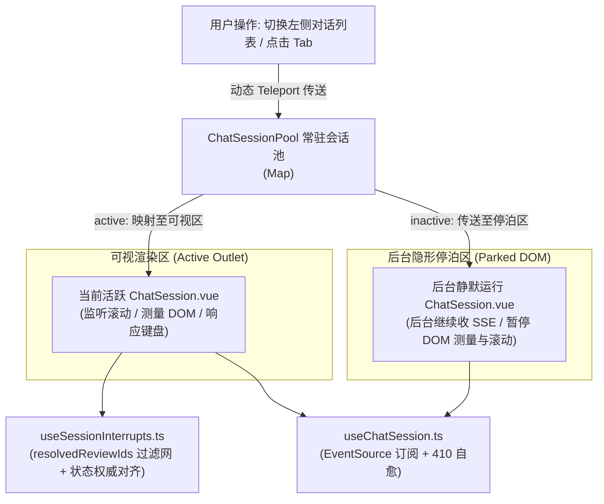
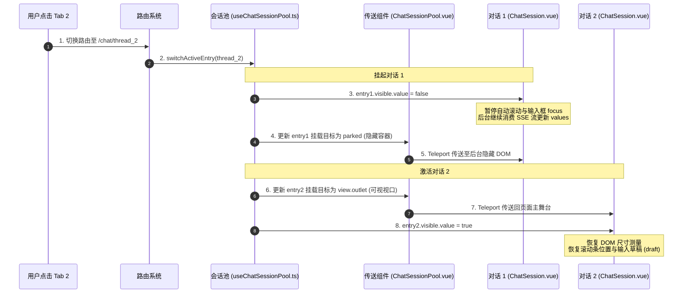

# 03-02 对话会话池与多 Tab 保活状态机深度解密

> **模块定位与核心价值**：解析 `apps/platform-web` 核心对话引擎的**常驻会话池（ChatSessionPool）与人机协同审批状态机（Session Interrupts）**。
> 彻底解决用户在多对话之间切换 Tab 导致流式连接意外断开、打字草稿丢失，以及大模型中断审批（HITL）因历史重放产生死锁的深水区工程难题。

---

## 零、 知识前置与上下文串联（Knowledge Bridges）

在阅读具体会话引擎实现代码前，必须掌握三个底层前端与智能体交互概念，以及会话池在整个工作台中的生命周期位置。

### 1. 前置必备概念速查

- **概念 1：Vue 3 `Teleport` 机制在长连接保活中的非典型应用**
  - 传统 Vue 应用切换路由时，旧页面的组件会被触发 `unmount` 卸载，导致组件内部发起的 SSE 或 WebSocket 连接被浏览器直接掐断；
  - 本系统利用 Vue 3 的 `<Teleport to="...">` 特性：当用户切走当前对话时，会话组件**绝不销毁**，而是通过 Teleport 将其物理 DOM 动态传送至一个隐藏的“停泊容器（Parked Container）”中常驻运行；切回时再瞬间传送回活跃的可视视口。
- **概念 2：人机协同审批中断（HITL Interrupts）**
  - 当智能体执行高危操作（如调用删除文件、向外部发送邮件的工具）时，LangGraph 状态机会主动挂起（`status: "interrupted"`），并通过 SSE 向前端抛出 `interrupt` 结构；
  - 前端收到中断后，必须阻断普通输入框，渲染出专用的审批确认面板，等待用户明确点击“批准”或“驳回”，再调用 `respondAll()` 恢复状态机。
- **概念 3：历史重放引发的“审批死锁”陷阱**
  - GraphHarbor 在读取 Thread 历史时，会将之前已执行过的 Run 中断事件作为历史流重放给前端；
  - 如果前端状态机缺乏区分机制，会误把已经处理过的历史审批当成新的待审批事项，导致前端不断弹出已失效的审批卡片，引发用户无法提交的死锁故障。

### 2. 链路上下文坐标



---

## 一、 对立视角：传统路由切页重载 vs 生产架构（Naive vs. Production）

### 1. 初学者的常规写法（Naive Demo）
大多数开源对话前端直接依赖 `<router-view>` 或简单的 `<keep-alive>`：
```vue
<!-- 初学者常见的做法：简单套 keep-alive -->
<router-view v-slot="{ Component }">
  <keep-alive>
    <component :is="Component" :key="$route.params.threadId" />
  </keep-alive>
</router-view>
```

### 2. 生产环境下的致命缺陷
- **多 Tab 无法保持物理并存**：`<keep-alive>` 依赖组件的 `key`，当用户同时在左侧点击新开 3 个不同的对话时，由于路由只能同时指向一个 URL，无法让 3 个对话同时在后台保持与后端的 SSE 长连接；
- **切页导致流式被打断或内存泄漏**：`<keep-alive>` 会暂停组件的更新和事件派发，导致在后台运行的大模型 SSE 流出现严重的缓冲区堆积，一旦用户 5 分钟后再切回来，瞬间刷出成千上万个微任务，直接把浏览器主线程卡死；
- **审批状态与后台 Run 脱节**：用户在 Tab A 触发了人工审批卡片，切到 Tab B 发了另一句话，再切回 Tab A 时，审批卡片消失或报“运行实例已结束”，产生不可逆的业务阻断。

### 3. 本项目的架构升级与设计取舍（Trade-offs）
- **基于 Teleport 的集中式会话池（`useChatSessionPool`）**：每个对话会话拥有独立的唯一 `instanceId`，物理生命周期完全常驻内存；
- **前台活跃态与后台休眠态感知（`visible` 标记）**：切到后台时，会话依然在默默消费流式事件更新状态，但**主动暂停 DOM 测量、自动滚动与输入框聚焦**，将 CPU 消耗降至最低；
- **已解决审批响应式过滤网（`resolvedReviewIds`）**：在前端设立专属过滤集合，并配合权威状态接口（`syncAuthoritativeReviews`）实时校准，彻底消除旧中断重放带来的死锁。

---

## 二、 源码精准坐标映射（Code Pointer Map）

| 模块职责 | 核心代码路径 | 关键类 / 函数 / 响应式变量 |
|---|---|---|
| **会话池数据结构与管理** | `apps/platform-web/src/modules/chat/composables/useChatSessionPool.ts` | `createChatSessionPool()`, `PoolEntry`, `entries` |
| **物理传送渲染宿主** | `apps/platform-web/src/modules/chat/components/ChatSessionPool.vue` | `Teleport`, `renderEntry()`, `parked` |
| **审批中断防死锁状态机** | `apps/platform-web/src/modules/chat/composables/useSessionInterrupts.ts` | `useSessionInterrupts()`, `resolvedReviewIds`, `syncAuthoritativeReviews()` |
| **单会话生命周期与自愈** | `apps/platform-web/src/modules/chat/composables/useChatSession.ts` | `recoverExpiredStream()`, `bindConnectionState()` |

---

## 三、 真实数据结构与 Schema（Real Payloads & DB Schemas）

### 1. 会话池条目实体结构（`PoolEntry`）
定义在 `apps/platform-web/src/modules/chat/composables/useChatSessionPool.ts`：
```typescript
interface PoolEntry {
  instanceId: string;               // 唯一实例 ID (即使关联同一 threadId 也保持不变)
  scope: string;                    // userId + sessionEpoch + projectId 不可变组合
  projectId: string;
  target: {
    graphId: string;
    agentId?: string;
    name: string;
  };
  threadId: Ref<string | undefined>;
  draft: Ref<string>;               // 页面未发送的输入草稿内容
  attachments: Ref<ChatAttachment[]>; // 上传但尚未发送的文件附件
  visible: Ref<boolean>;            // 当前是否处于用户可视视口内
  view: Ref<PoolView | undefined>;  // 绑定的物理挂载点与插槽引用
  generation: number;               // 实例代数，用于检测是否已被外部清退
  disposed: boolean;
  lastViewedAt: number;             // 最近查看时间戳，用于 LRU 清退保护
}
```

### 2. 真实审批中断事件报文（SSE `event: interrupt`）
```json
{
  "id": "interrupt_review_98a71c",
  "value": {
    "action": "execute_bash_command",
    "params": {
      "command": "rm -rf ./tmp/cache_build"
    },
    "risk_level": "high",
    "prompt": "智能体申请执行清理临时构建缓存命令，请核实后审批"
  },
  "ns": ["subagent_builder"]
}
```

---

## 四、 端到端函数级调用时序（Function-Level Trace）

展示用户在两个不同对话 Tab 之间切换时的完整物理传送与保活时序：



---

## 五、 核心实现高保真伪代码（High-Fidelity Pseudocode）

### 1. 会话池动态 Teleport 传送渲染（提取自 `ChatSessionPool.vue`）

```typescript
// 对应源码：apps/platform-web/src/modules/chat/components/ChatSessionPool.vue
import { Teleport, h, ref } from "vue";
import ChatSession from "./ChatSession.vue";
import type { PoolEntry } from "../composables/useChatSessionPool";

export function renderSessionPool(entries: Map<string, PoolEntry>, parkedEl: HTMLElement) {
  return Array.from(entries.values()).map((entry) => {
    // 关键设计：如果当前视口存在，挂载到前台 outlet；否则挂载到后台 parkedEl
    const targetElement = entry.visible.value && entry.view.value?.outlet
      ? entry.view.value.outlet
      : parkedEl;

    return h(
      Teleport,
      {
        key: entry.instanceId,
        to: targetElement, // 仅改变物理渲染容器，不销毁组件内部状态
      },
      [
        h(ChatSession, {
          instanceId: entry.instanceId,
          threadId: entry.threadId.value,
          visible: entry.visible.value,
          draft: entry.draft.value,
          "onUpdate:draft": (newVal: string) => {
            entry.draft.value = newVal; // 跨页面保留打字草稿
          },
        }),
      ]
    );
  });
}
```

### 2. 审批中断状态机防死锁自愈（提取自 `useSessionInterrupts.ts`）

```typescript
// 对应源码：apps/platform-web/src/modules/chat/composables/useSessionInterrupts.ts
import { ref, computed, watch } from "vue";

export function useSessionInterrupts(deps: {
  threadId: Ref<string | null>;
  stream: { interrupts: Ref<any[]>; respondAll: Function };
  service: { state: Function };
}) {
  // 核心防线：记录已经在当前生命周期内被用户提交过的审批 ID
  const resolvedReviewIds = ref<Set<string>>(new Set());

  // 线程切换时清空历史审批过滤网
  watch(() => deps.threadId.value, () => {
    resolvedReviewIds.value.clear();
  });

  // 响应式计算当前真正需要人类审批的卡片列表
  const activeReviews = computed(() => {
    const rawInterrupts = deps.stream.interrupts.value || [];
    return rawInterrupts
      .filter((item) => !resolvedReviewIds.value.has(item.id)) // 彻底滤除已处理的重放项
      .map(parseReviewItem);
  });

  // 提交审批操作
  async function submitApproval(reviewId: string, approved: boolean) {
    // 1. 立即标记该 ID 已完成，页面卡片立刻收起，防止二次点击
    resolvedReviewIds.value.add(reviewId);

    try {
      // 2. 向后端状态机响应审批决策
      await deps.stream.respondAll({
        [reviewId]: { approved, timestamp: Date.now() },
      });
    } catch (err) {
      // 3. 提交失败时回滚，重新展示卡片
      resolvedReviewIds.value.delete(reviewId);
      throw err;
    }

    // 4. 主动与权威服务端 state 对齐，杜绝脏数据滞留
    await syncAuthoritativeState();
  }

  async function syncAuthoritativeState() {
    if (!deps.threadId.value) return;
    const latestState = await deps.service.state(deps.threadId.value);
    // 确保本地中断状态与数据库持久化状态严格对齐
    hydrateReviews(latestState.interrupts);
  }

  return { activeReviews, submitApproval };
}
```

---

## 六、 假想断电与极限场景推演（Thought Experiments）

### 场景一：用户正在 Tab 1 等待代码生成，中途切换到 Tab 2 聊天
- **简易系统表现**：Tab 1 的组件被 unmount 销毁，后台 SSE 流被掐断。当用户在 Tab 2 聊完切回 Tab 1 时，生成中断，已出的半截代码丢失。
- **本系统表现**：
  1. 会话池检测到路由切换，将 Tab 1 的 DOM 物理 Teleport 到隐藏的 `parked` 容器中，`visible` 标记置为 `false`；
  2. Tab 1 的 `useChatSession` 依然在后台正常接收 SSE 流式事件并更新 Pinia store；
  3. 当用户切回 Tab 1 时，Teleport 瞬间将常驻组件搬回前台视口，用户直接看到大模型已经把整段代码生成完毕，毫秒级无感恢复。

### 场景二：智能体触发了工具审批，同时后台网络波动导致 GraphHarbor 重放旧 Run
- **简易系统表现**：旧 Run 的历史中断事件被推送到前端，前端误以为又有一个旧工具在等待审批，界面弹出两个冲突的卡片，用户点哪一个都会报错“Run 已结束”，形成死锁。
- **本系统表现**：
  1. `useSessionInterrupts.ts` 内部维护了 `resolvedReviewIds` 响应式过滤网；
  2. 重放的旧中断因其 ID 已经存在于集合中，被直接过滤拦截，绝不向视图层抛出；
  3. 配合 `syncAuthoritativeReviews()` 校验，确保界面上永远只显示属于当前最新活跃 Run 的真实审批卡片，彻底根治死锁。

---

## 七、 架构不变量清单（Architectural Invariants）

任何后续二次开发与代码重构，绝不允许打破以下三条红线：

1. **会话切换绝不允许物理销毁组件**：除非用户显式点击“关闭/删除会话”或触发全局退出登录，多会话切换必须且只能通过 `ChatSessionPool` 配合 Teleport 挂起，严禁在路由跳转时无差别卸载活跃会话。
2. **隐藏状态下严禁执行 DOM 测量与强滚动**：当 `visible.value === false` 时，会话内部一切自动滚动到底部、输入框 `autofocus` 以及 DOM 尺寸测算逻辑必须全部阻断，防止后台无意义重排重绘卡死浏览器。
3. **已处理审批必须在本地立即锁定**：用户点击“批准”或“驳回”动作后，该审批 ID 必须立即进入 `resolvedReviewIds`，严禁等待网络返回后再更新 UI，杜绝弱网环境下用户因重复点击引发的并发决策冲突。
