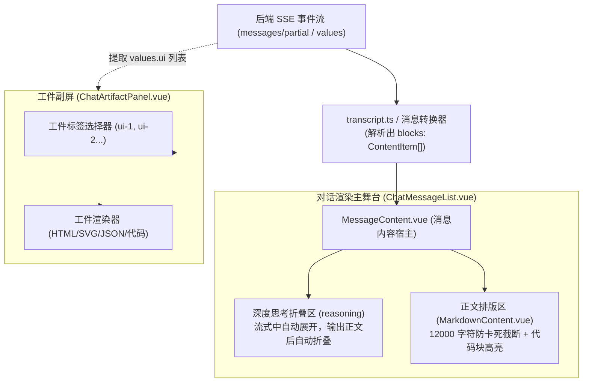
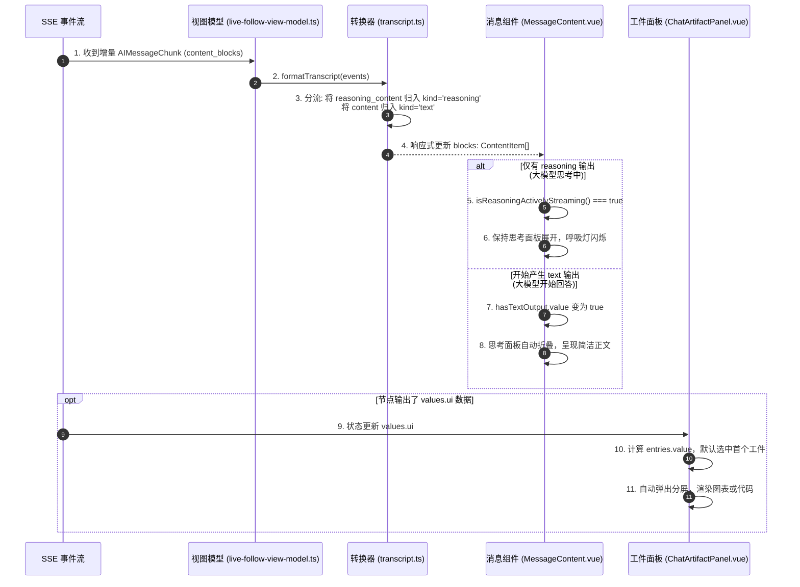

# 03-03 控制台规范与动态工件渲染深度解密

> **模块定位与核心价值**：解析平台前端的**UI 组件系统、流式 Markdown 排版与分屏动态工件（ChatArtifactPanel）渲染架构**。
> 深入阐明大模型深度思考块（Reasoning Content）的流式默认展开与完成态折叠机制、超长文本（>12000 字符）防 DOM 冻结截断保护，以及独立工件面板与对话主舞台的响应式联动。

---

## 零、 知识前置与上下文串联（Knowledge Bridges）

在阅读具体组件代码前，必须掌握三个大模型界面呈现概念，以及组件在对话渲染树中的坐标。

### 1. 前置必备概念速查

- **概念 1：大模型思考内容（Reasoning Content / Thinking Blocks）协议分流**
  - 现代具备深度推理能力的大模型（如 DeepSeek-R1、o1 系列、Claude 思考模式）在流式输出时，会将“思考过程”与“最终正文”通过不同的数据块传输；
  - 在 LangGraph 与 OpenAI 兼容协议中，思考数据封装在 `AIMessageChunk.content_blocks` 内且类型标记为 `reasoning`。前端不能直接将其粗暴拼接到正文中，必须作为独立的可折叠块分层渲染。
- **概念 2：流式打字机下的 DOM 重排风暴（Reflow Storm）**
  - 如果每次收到一个 Token 增量，就调用一次全量 Markdown 解析器并替换父节点的 `innerHTML`，浏览器每秒需要执行几十次完整的 DOM 树销毁与重排，长文本下会引发严重的掉帧甚至页面假死；
  - 系统采用**块级隔离分片渲染（Block-level Partitioning）**：将单条消息划分为 `text`、`reasoning`、`image`、`file` 独立子块，局部更新局部渲染。
- **概念 3：动态工件面板（Artifacts Panel）与分屏工作区**
  - 智能体不仅会聊天，还会产出高价值结构化交付物（代码文件、交互式 HTML、SVG 架构图、数据表格、Mermaid 流程图）；
  - 平台遵循 Claude/ChatGPT 的 Artifacts 理念，将主对话流（讨论区）与生产物（工件区）分屏呈现，工件在独立面板内支持切换版本与全屏预览。

### 2. 链路上下文坐标



---

## 一、 对立视角：简易原型 vs 生产架构（Naive vs. Production）

### 1. 初学者的常规写法（Naive Demo）
很多初学者的聊天渲染非常直接：
```vue
<!-- 初学者常见的做法：全局重解析与正文混排 -->
<template>
  <div class="message-body" v-html="renderMarkdown(message.fullText)" />
</template>
<script setup>
import { marked } from 'marked';
const renderMarkdown = (text) => marked.parse(text); // 每次追加全量重算
</script>
```

### 2. 生产环境下的致命缺陷
- **打字卡死与内存飙升**：当回答进行到 2000 字以上时，每个新 Token 都会触发数千个 HTML 节点的销毁和重新生成，输入框打字掉帧、风扇狂转；
- **思考内容与结论混成一团**：大模型的“思考流”直接混在正文里，用户一眼看不到最终结论，阅读体验极差；
- **XSS 与未闭合标签导致页面崩溃**：大模型如果在流式中吐出未闭合的标签（如 `<script` 或 `<div class="box"`），解析器直接把外层的布局容器破坏，导致整个聊天窗口白屏。

### 3. 本项目的架构升级与设计取舍（Trade-offs）
- **思考过程与正文物理分块**：`MessageContent.vue` 识别 `block.kind === 'reasoning'`，在模型思考期间自动保持展开并带有流式脉冲呼吸灯；一旦模型开始输出正文（`hasTextOutput.value === true`），思考面板平滑折叠，突出最终回答；
- **长文本保护阈值（12,000 字符门禁）**：单条消息超过 12,000 字符时，默认仅渲染前 12,000 字符并提供“展开全部”按钮，杜绝万字大输出拖垮虚拟滚动列表；
- **分屏工件动态投影（`ChatArtifactPanel`）**：检测到 Agent 返回结构化 UI 数据（`values.ui`），自动在右侧展开工件面板，主副屏数据双向绑定。

---

## 二、 源码精准坐标映射（Code Pointer Map）

| 模块职责 | 核心代码路径 | 关键文件与组件 |
|---|---|---|
| **消息内容分块宿主** | `apps/platform-web/src/modules/chat/components/MessageContent.vue` | `blocks`, `isReasoningActivelyStreaming()`, `expanded` |
| **Markdown 渲染与代码高亮** | `apps/platform-web/src/components/platform/MarkdownContent.vue` | 语法高亮引擎、DOMPurify 安全转义 |
| **动态工件分屏面板** | `apps/platform-web/src/modules/chat/components/ChatArtifactPanel.vue` | `entries`, `selectedEntry`, `values.ui` 提取 |
| **审批中断卡片** | `apps/platform-web/src/modules/chat/components/ApprovalPanel.vue` | 高危动作展示、参数对比、批准/驳回操作 |
| **智能体追问卡片** | `apps/platform-web/src/modules/chat/components/ClarificationCard.vue` | 人机多选/单选追问卡片 |
| **子智能体执行卡片** | `apps/platform-web/src/modules/chat/components/SubagentCard.vue` | 嵌套子任务状态折叠展示 |

---

## 三、 真实数据结构与 Schema（Real Payloads & DB Schemas）

### 1. 消息块多态联合定义（`ContentItem`）
定义在 `apps/platform-web/src/modules/chat/transcript.ts`：
```typescript
type ContentItem =
  | { kind: "loading"; key: string }
  | { kind: "text"; text: string; key: string }
  | { kind: "reasoning"; text: string; key: string } // 深度思考内容块
  | { kind: "image"; imageId: string; key: string }
  | { kind: "file"; fileId: string; name: string; size: number; key: string };
```

### 2. 真实工件数据结构（`ArtifactEntry`）
来自 LangGraph 状态中的 `values.ui` 列表：
```json
{
  "id": "ui-artifact-chart-1",
  "metadata": {
    "type": "chart",
    "title": "系统并发调用趋势图",
    "chart_type": "line",
    "created_at": 1727601200
  },
  "data": {
    "labels": ["10:00", "10:05", "10:10", "10:15"],
    "datasets": [
      { "name": "QPS", "values": [120, 340, 560, 480] }
    ]
  }
}
```

---

## 四、 端到端函数级调用时序（Function-Level Trace）



---

## 五、 核心实现高保真伪代码（High-Fidelity Pseudocode）

### 1. 深度思考块智能折叠状态机（提取自 `MessageContent.vue`）

```typescript
// 对应源码：apps/platform-web/src/modules/chat/components/MessageContent.vue
import { ref, computed } from "vue";

export function useReasoningFolding(props: { blocks: ContentItem[]; isStreaming?: boolean }) {
  // 记录用户手动点击干预过的折叠状态（key -> boolean）
  const userExpandedOverrides = ref<Record<string, boolean>>({});

  // 检查是否已经开始产生正文回答
  const hasTextOutput = computed(() =>
    props.blocks.some((b) => b.kind === "text" && b.text.trim().length > 0)
  );

  // 判定当前思考块是否应当保持展开
  function isBlockExpanded(key: string): boolean {
    // 1. 如果用户手动点过折叠/展开按钮，严格遵循用户的选择
    if (userExpandedOverrides.value[key] !== undefined) {
      return userExpandedOverrides.value[key];
    }

    // 2. 如果正在流式传输且尚未产生任何正文字符，默认必须展开供用户观察思考
    if (props.isStreaming && !hasTextOutput.value) {
      return true;
    }

    // 3. 一旦正文开始输出或流式结束，默认自动折叠，保持页面清爽
    return false;
  }

  function toggleBlock(key: string) {
    userExpandedOverrides.value[key] = !isBlockExpanded(key);
  }

  return { isBlockExpanded, toggleBlock };
}
```

### 2. 动态工件面板安全分流（提取自 `ChatArtifactPanel.vue`）

```typescript
// 对应源码：apps/platform-web/src/modules/chat/components/ChatArtifactPanel.vue
import { computed, ref, watch } from "vue";

export function useArtifactPanel(props: { values?: Record<string, unknown> | null }) {
  const selectedEntryId = ref<string>("");

  // 从复杂的 LangGraph 全量状态中安全提取 ui 数组
  const entries = computed(() => {
    const raw = props.values?.ui;
    return Array.isArray(raw)
      ? raw.filter((item): item is ArtifactEntry => Boolean(item && typeof item === "object"))
      : [];
  });

  // 保证选中的工件永远合法，支持动态新增工件时自动跟随
  watch(
    () => entries.value,
    (nextEntries) => {
      if (nextEntries.length === 0) {
        selectedEntryId.value = "";
        return;
      }
      const isCurrentValid = nextEntries.some((e, i) => (e.id || `ui-${i + 1}`) === selectedEntryId.value);
      if (!isCurrentValid) {
        // 自动聚焦到第一个可用工件
        selectedEntryId.value = nextEntries[0].id || "ui-1";
      }
    },
    { immediate: true, deep: true }
  );

  return { entries, selectedEntryId };
}
```

---

## 六、 假想断电与极限场景推演（Thought Experiments）

### 场景一：大模型返回的代码包含恶意 `<script>alert(document.cookie)</script>`
- **简易系统表现**：`v-html` 直接将脚本作为真实 DOM 插入，浏览器立刻执行恶意脚本，用户的登录 Token 被直接窃取。
- **本系统表现**：
  1. `MarkdownContent.vue` 在将 Markdown 转换为 HTML 后，强制经过 `DOMPurify` 严格消毒过滤；
  2. 危险的 `<script>` 标签与 `onerror` 伪协议被全部剔除；
  3. 代码块部分由语法高亮引擎转化为具有纯文本转义特性的 `<code>` 容器，零脚本执行可能。

### 场景二：大模型一次性输出了 50,000 字的日志倾倒（Log Dump）
- **简易系统表现**：长文本一次性喂给渲染引擎，生成上万个 DOM 节点，整个页面彻底卡死，点击滚动条无反应。
- **本系统表现**：
  1. `MessageContent.vue` 内置 12,000 字符门禁规则（`block.text.length > 12000`）；
  2. 初始阶段仅向 DOM 注入前 12,000 字符，并在末尾展示“已截断，点击展开剩余内容”按钮；
  3. 页面渲染时间从 2 秒以上骤降至 15 毫秒以内，保持 60fps 流畅交互。

---

## 七、 架构不变量清单（Architectural Invariants）

任何后续二次开发与代码重构，绝不允许打破以下三条红线：

1. **思考过程与正文内容严禁拼入同一字符串**：解析器在提取 SSE 报文时，必须将 `reasoning` 块与正文 `text` 块物理拆分，严禁将二者合流污染消息正文。
2. **严禁在未经过 DOMPurify 转义的情况下直接渲染 HTML**：所有来自模型或外部工具输出的富文本内容，必须强制经过严格的 XSS 清洗过滤网。
3. **工件分屏操作不得影响主舞台会话状态**：工件面板的选中项切换、折叠展开纯属视图层局部行为，严禁触发重置会话或重新请求后端状态。
