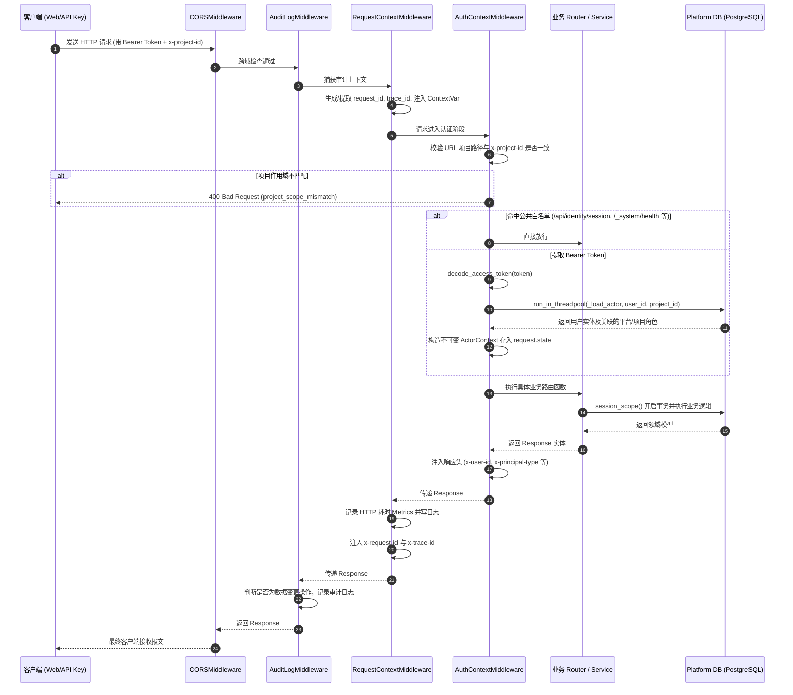

# 01-后端分层架构与领域划分 (Layered Architecture & Domain Partitioning)

## 模块定位与核心价值

`platform-api` 是整个智能体平台的中枢控制面（Control Plane）。它不对 LLM 进行直接推理，也不直接调度底层 Docker 或宿主机进程，而是承上启下：对外对接 `platform-web` 前端与企业现有系统，向下对接并严格监管 `runtime-service` 执行集群。

很多团队做大模型网关时，最容易犯的错误就是把后端写成一个平铺直叙的 FastAPI CRUD 脚本，甚至直接让前端直连 LangGraph/LangChain。在真实的生产环境里，这种做法等同于自杀：权限不可控、多租户边界被穿透、运行时崩溃拖垮整个平台、会话状态与审计全无留存。

`platform-api` 摒弃了传统的扁平 MVC 模式，采用**领域驱动设计（DDD）**与**六边形架构（Ports and Adapters）**的混合体。核心划分为四个层次：
1. **Entrypoints (入口层)**：HTTP 路由、中间件洋葱圈、请求上下文萃取与依赖注入。
2. **Modules (领域业务层)**：按业务限界上下文（Bounded Context）强隔离的独立模块（IAM、Projects、Runtime Gateway、Runtime Policies、Runtime Catalog、Identity、Audit 等）。
3. **Core (跨领域核心基础设施)**：全局统一的数据库会话工厂、上下文模型、错误码体系、安全工具包与链路追踪。
4. **Adapters (外部系统适配器)**：专门隔离与 LangGraph / Runtime Service 通信的客户端、SDK 适配器与协议转换器。

<details>
<summary>💡 老王说人话：什么是 DDD 和六边形架构？（30秒速懂）</summary>

1. **生活大白话类比**：就像品牌大饭店的中央厨房，大厨（核心领域业务）只专注制定菜品标准，墙上开两个标准窗口：输入窗口（端口）对接美团外卖、堂食点餐（适配器），输出窗口（端口）对接外卖打包盒、高档瓷盘摆盘（适配器），大厨绝不被外卖平台绑架。
2. **解决的生产痛点**：如果不这么拆，代码就会沦为路边苍蝇馆子，厨子一边在锅边炒菜一边拿油手收钱找零（视图函数里混杂 SQL、权限、第三方 HTTP 和扣费），改个字段全局崩溃，单测根本跑不起来。
3. **本项目怎么落地**：对应平台代码中的 `entrypoints/`（输入适配器）、`modules/`（领域限界上下文）、`adapters/`（下游系统适配器），详细演进与 20 行极简对比代码传送门：[01-从 MVC 到 DDD 与六边形架构深度透析](../concepts/01-mvc-ddd-hexagonal.md)。
</details>

---

## 零、知识前置与上下文串联（Knowledge Bridges）

### 1. 认知输入（前置模块输入）
- 依赖 [01-overview/01-system-topology.md](file:///Users/lijiaxin/PyCharmMiscProject/ai-agent-platform/docs/architecture/01-overview/01-system-topology.md)：掌握 `platform-api` 处于平台核心控制面的中枢位置。
- 依赖 [02-cross-cutting/02-delegation-auth.md](file:///Users/lijiaxin/PyCharmMiscProject/ai-agent-platform/docs/architecture/02-cross-cutting/02-delegation-auth.md)：理解用户凭证（User Bearer JWT / API Key）与平台代理凭证（Delegation JWT）的双层令牌置换模型。
- 依赖 [03-platform-web/01-architecture.md](file:///Users/lijiaxin/PyCharmMiscProject/ai-agent-platform/docs/architecture/03-platform-web/01-architecture.md)：明确前端发起的所有 HTTP/SSE 请求均必须携带 `x-project-id` 及标准认证头。

### 2. 本章核心流转
- **请求摄入与生命周期管控**：由 ASGI/FastAPI 启动并交由中间件洋葱圈过滤，完成追踪注入、认证解析与项目作用域校验。
- **上下文冻结**：将解析得到的身份信息、租户项目信息组装为不可变的 `PlatformRequestContext`，存入当前请求的协程上下文。
- **领域路由分发**：根据业务类型分流至各领域 Module，Module 内部遵循事务隔离。

### 3. 认知输出（支撑后续模块）
- 为 [02-runtime-gateway.md](file:///Users/lijiaxin/PyCharmMiscProject/ai-agent-platform/docs/architecture/04-platform-api/02-runtime-gateway.md) 提供统一认证后具有可信 Actor 的请求执行环境。
- 为 [03-iam-and-governance.md](file:///Users/lijiaxin/PyCharmMiscProject/ai-agent-platform/docs/architecture/04-platform-api/03-iam-and-governance.md) 提供多租户隔离与角色权限判定的基石。
- 为 [04-catalog-management.md](file:///Users/lijiaxin/PyCharmMiscProject/ai-agent-platform/docs/architecture/04-platform-api/04-catalog-management.md) 提供持久化数据库事务与加密工具支撑。

---

## 一、对立视角：简易原型 vs 生产架构（Naive vs Production）

| 维度 | 玩具级/简易原型实现 (Naive Prototype) | 本平台生产级架构 (Production Architecture) | 选型与演进考量 |
| :--- | :--- | :--- | :--- |
| **代码组织** | 扁平 `routers/`, `services/`, `models/`，所有业务逻辑揉在一起，跨业务实体互相外键引用。 | 模块化 DDD 划分（`modules/{module}/{domain,application,infra,presentation}`），模块间依赖极小化。 | 防止项目膨胀后代码演化为大泥球，支撑团队按领域独立维护与测试。 |
| **运行时调用** | 视图函数里直接用 `httpx.post("http://runtime/...")`，没有鉴权没有上下文转换。 | 六边形适配器隔离（`adapters/langgraph/` 与 `ports.py`），通过接口解耦，下游通信与协议脱敏高度封装。 | 运行时引擎技术选型可换，屏蔽底层网络重试、私有状态拦截和请求头注入细节。 |
| **数据库会话** | 每个请求通过 FastAPI `Depends(get_db)` 注入 `Session`，视图内隐式 autocommit，异常难以回滚。 | 显式 `session_scope()` 上下文管理器，`expire_on_commit=False`，严格事务边界控制。 | 杜绝隐式提交导致脏数据落盘，防止跨线程/跨协程的 ORM 对象在 Detached 状态下触发二次查询报错。 |
| **启动一致性校验** | 应用直接监听端口，数据库有没有缺表、迁移跑没跑全看报错运气。 | `bootstrap/lifespan.py` 严格校验数据库 Schema（如 `thread_access` 表必须包含特定列），未通过直接熔断。 | 杜绝版本发布时因数据库未完成迁移而产生脏数据或不可预期的崩溃。 |
| **多租户安全** | 路由里拿入参的 `project_id` 查库，攻击者篡改 URL 参数即可越权访问其他项目。 | 中间件层强制校验 URL 路径项目 ID 与 `x-project-id` Header，不匹配直接在入口处打回 400。 | 入口第一道防线切断越权扫描，杜绝业务层因漏判项目归属而产生越权漏洞。 |

---

## 二、源码精准坐标映射（Code Pointer Map）

### 1. 入口与引导编排
- [main.py](file:///Users/lijiaxin/PyCharmMiscProject/ai-agent-platform/apps/platform-api/src/platform_api/main.py)：FastAPI 应用工厂 `create_app()`，配置加载、中间件挂载、异常处理器注册与全局路由聚合。
- [bootstrap/lifespan.py](file:///Users/lijiaxin/PyCharmMiscProject/ai-agent-platform/apps/platform-api/src/platform_api/bootstrap/lifespan.py)：生命周期管理，负责 SQLAlchemy Engine 与 `sessionmaker` 初始化、数据库 Schema 严格校验、超级管理员兜底初始化、应用停机资源释放。
- [entrypoints/http/router.py](file:///Users/lijiaxin/PyCharmMiscProject/ai-agent-platform/apps/platform-api/src/platform_api/entrypoints/http/router.py)：聚合 11 个核心模块的 API 路由。

### 2. 中间件洋葱链
- [entrypoints/http/middleware/auth_context.py](file:///Users/lijiaxin/PyCharmMiscProject/ai-agent-platform/apps/platform-api/src/platform_api/entrypoints/http/middleware/auth_context.py)：身份认证中间件，提取 Bearer Token 或 API Key，校验路由与 Header 的项目作用域，装配 `ActorContext`。
- [entrypoints/http/middleware/request_context.py](file:///Users/lijiaxin/PyCharmMiscProject/ai-agent-platform/apps/platform-api/src/platform_api/entrypoints/http/middleware/request_context.py)：请求链路追踪中间件，生成/传递 `x-request-id`、`x-trace-id`，记录耗时指标并清理 `ContextVar`。
- [entrypoints/http/middleware/audit_log.py](file:///Users/lijiaxin/PyCharmMiscProject/ai-agent-platform/apps/platform-api/src/platform_api/entrypoints/http/middleware/audit_log.py)：HTTP 请求审计日志中间件，捕获变更类操作并落盘审计记录。

### 3. 核心领域模块划分
- [modules/runtime_gateway/](file:///Users/lijiaxin/PyCharmMiscProject/ai-agent-platform/apps/platform-api/src/platform_api/modules/runtime_gateway/)：运行时反向代理、协议归一化与流式脱敏（后文详述）。
- [modules/iam/](file:///Users/lijiaxin/PyCharmMiscProject/ai-agent-platform/apps/platform-api/src/platform_api/modules/iam/)：RBAC 策略引擎 `IamPolicyEngine`，平台级角色与项目级角色权限校验。
- [modules/projects/](file:///Users/lijiaxin/PyCharmMiscProject/ai-agent-platform/apps/platform-api/src/platform_api/modules/projects/)：工作空间项目生命周期、成员归属与隔离隔离模型。
- [modules/runtime_policies/](file:///Users/lijiaxin/PyCharmMiscProject/ai-agent-platform/apps/platform-api/src/platform_api/modules/runtime_policies/)：项目级模型启用策略、工具禁用覆盖层与 Delegation 策略生成。
- [modules/runtime_catalog/](file:///Users/lijiaxin/PyCharmMiscProject/ai-agent-platform/apps/platform-api/src/platform_api/modules/runtime_catalog/)：模型、图、工具与技能的统一目录管理，Fernet 密文加解密。

### 4. 基础设施与数据层
- [core/db/session.py](file:///Users/lijiaxin/PyCharmMiscProject/ai-agent-platform/apps/platform-api/src/platform_api/core/db/session.py)：数据库连接池构建、`session_scope` 上下文事务控制。
- [core/context/models.py](file:///Users/lijiaxin/PyCharmMiscProject/ai-agent-platform/apps/platform-api/src/platform_api/core/context/models.py)：不可变请求上下文模型（`PlatformRequestContext`, `ActorContext`, `ProjectContext` 等）。

---

## 三、真实数据结构与报文（Real Payloads & DB Schemas）

### 1. 不可变请求上下文数据模型
在整个请求生命周期内，身份与追踪信息被冻结为不可变对象，防止业务代码随意篡改全局状态。

```python
# apps/platform-api/src/platform_api/core/context/models.py

@dataclass(frozen=True, slots=True)
class ActorContext:
    user_id: str | None = None
    subject: str | None = None
    email: str | None = None
    principal_type: str = "user"           # user | service_account
    authentication_type: str = "bearer"    # bearer | api_key
    credential_id: str | None = None
    must_change_password: bool = False
    platform_roles: tuple[str, ...] = field(default_factory=tuple)
    project_roles: Mapping[str, tuple[str, ...]] = field(default_factory=dict)

@dataclass(frozen=True, slots=True)
class PlatformRequestContext:
    request: RequestContext
    tenant: TenantContext
    project: ProjectContext
    actor: ActorContext
```

### 2. 标准错误响应结构（Error Envelope）
当发生鉴权失败、未捕获异常或校验报错时，入口层全局异常拦截器统一输出标准 JSON 载荷：

```json
{
  "code": "project_scope_mismatch",
  "message": "Route and header project scopes do not match",
  "request_id": "req-98fbc18c-3677-4c7b-99f5-19a9a3b680cb",
  "details": null
}
```

---

## 四、端到端函数级调用时序（Function-Level Trace）

FastAPI 采用洋葱模型，各中间件按声明的反向顺序执行。当客户端发起一个请求至业务端点时，完整调用链路如下：



---

## 五、核心实现高保真伪代码（High-Fidelity Pseudocode）

### 1. 应用启动校验与生命周期绑定（Lifespan）
```python
# 对应 apps/platform-api/src/platform_api/bootstrap/lifespan.py

@asynccontextmanager
async def lifespan(app: FastAPI) -> AsyncIterator[None]:
    settings = app.state.settings
    engine = None

    if settings.platform_db_enabled:
        # 1. 建立数据库连接池 (pool_pre_ping 杜绝死连接)
        engine = build_engine(settings.database_url)
        app.state.db_engine = engine
        session_factory = build_session_factory(engine)
        app.state.db_session_factory = session_factory

        # 2. 严格校验数据库 Schema 完整性 (必须包含关键列)
        inspector = inspect(engine)
        columns = {c["name"] for c in inspector.get_columns("thread_access")} if inspector.has_table("thread_access") else set()
        if not {"provisioning_status", "reserved_at"} <= columns:
            raise RuntimeError("Platform database schema is outdated; apply Alembic revision 20260925_0005")

        # 3. 兜底初始化超级管理员
        if settings.bootstrap_admin_enabled:
            service = IdentityService(settings=settings, session_factory=session_factory)
            await run_in_threadpool(service.ensure_bootstrap_admin)

    try:
        yield
    finally:
        # 4. 优雅关闭，释放连接池资源
        if engine is not None:
            await run_in_threadpool(engine.dispose)
        app.state.db_engine = None
        app.state.db_session_factory = None
```

### 2. 数据库事务上下文（Session Scope）
```python
# 对应 apps/platform-api/src/platform_api/core/db/session.py

def build_session_factory(engine: Engine) -> sessionmaker[Session]:
    # expire_on_commit=False 保证事务提交后，实体属性依然可以在内存中读取，不触发惰性加载异常
    return sessionmaker(
        bind=engine,
        autoflush=False,
        autocommit=False,
        expire_on_commit=False,
    )

def session_scope(session_factory: sessionmaker[Session]) -> AbstractContextManager[Session]:
    # 借助 SQLAlchemy 的 begin() 上下文管理器：退出无异常自动 commit，异常自动 rollback
    return session_factory.begin()
```

---

## 六、假想断电与极限场景推演（Thought Experiments）

### 场景一：攻击者篡改 URL 中的 `project_id` 越权操作
- **推演过程**：攻击者拥有项目 A 的访问权限，但尝试向 `/api/projects/{Project_B_ID}/assistants` 发送请求，Header 中保留其合法的项目 A Token 与 `x-project-id: Project_A_ID`。
- **系统表现**：`auth_context_middleware` 在解析请求时，比对路径中的 `route_project_id`（Project_B_ID）与 Header 中的 `header_project_id`（Project_A_ID），发现不一致，立即在中间件层熔断并返回 `400 project_scope_mismatch`。请求完全无法触达业务路由，DB 查询被直接避免。

### 场景二：数据库发生主备切换或连接因网络超时中断
- **推演过程**：RDS 实例发生瞬时网络抖动或主备切换，已建立的数据库连接成为失效连接。
- **系统表现**：`build_engine` 中配置了 `pool_pre_ping=True`。每次业务代码通过 `session_scope` 获取连接时，连接池会自动发送轻量级的 `SELECT 1` 心跳检测。发现连接断开后，连接池自动将其剔除并重连，而不会将废弃连接扔给业务逻辑抛出 `OperationalError: server closed the connection unexpectedly`。

### 场景三：异步接口内部跨线程读取 ORM 属性
- **推演过程**：FastAPI 业务函数在 `run_in_threadpool` 提交事务后，将查询出的 ORM 模型返回到外层异步函数中序列化。
- **系统表现**：由于 `build_session_factory` 明确指定了 `expire_on_commit=False`，实体提交后内存中的属性缓存不会被置空，外层异步线程无需重新发起数据库懒加载查询，彻底根绝 `DetachedInstanceError` 报错。

---

## 七、架构不变量清单（Architectural Invariants）

1. **不可变请求上下文原则**：`PlatformRequestContext` 及其嵌套的 `ActorContext` 必须全部声明为 `frozen=True`。任何中间件和业务代码在请求处理阶段不得修改已有字段，状态变更必须生成全新上下文对象。
2. **多租户双重校验原则**：任何包含项目路径参数的路由，必须严格满足 `header_project_id == route_project_id`，杜绝任何形式的作用域歧义。
3. **显式事务边界原则**：领域层的所有持久化操作必须通过 `session_scope` 显式包裹，严禁依赖框架全局隐式提交。
4. **启动一致性阻断原则**：数据库 Schema 缺少关键索引或字段迁移未完成时，服务进程必须在 `lifespan` 阶段直接阻断启动，严禁带病上线。
