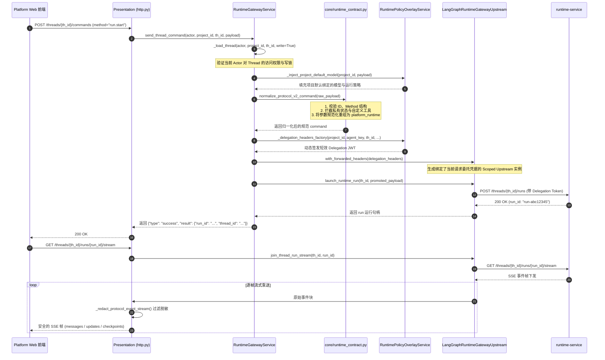
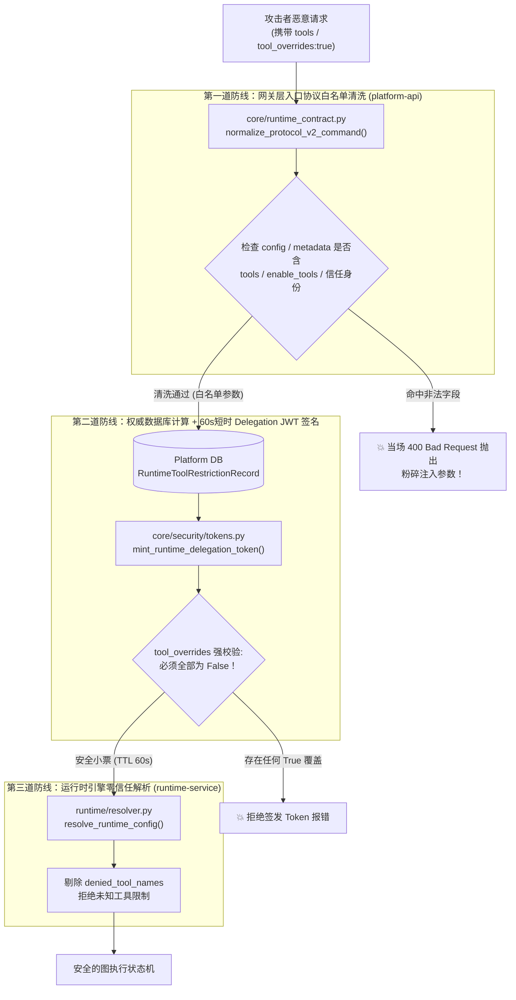

# 02-网关反向代理与协议转换细节 (Runtime Gateway Reverse Proxy & Protocol Normalization)

## 模块定位与核心价值

`modules/runtime_gateway` 是 `platform-api` 体系中最核心、逻辑最复杂的领域模块（其核心服务 `service.py` 超过 3000 行）。在企业级智能体架构中，它绝非一个简单的 Nginx 式盲目反向代理，而是一个**有状态的协议安全哨兵与流量治理中枢**。

如果把智能体平台的前端比作客户端，底层 `runtime-service`（基于 LangGraph 构建的执行引擎）比作核心计算核，那么 `runtime_gateway` 就是两者之间的防火墙和协议翻译机：
1. **协议归一化与防御（Protocol Normalization）**：对前端传入的 Protocol v2 命令进行严格清洗，剥离危险的私有注入字段，校准运行参数（如超时、运行模式、重试与中断配置）。
2. **凭据置换与权限收敛（Delegation Minting）**：在每次向下游转发请求前，依据当前的会话所有权、租户项目与被调用的 Agent，动态铸造单次有效、范围严格受限的 Delegation JWT。
3. **断点恢复防篡改（Resume Guard）**：在人类介入审批（Human-in-the-loop）恢复执行时，强行阻断任何试图修改模型参数或提示词的恶意覆盖。
4. **流式反向代理与脱敏（Stream Interception & Redaction）**：拦截下游抛出的 SSE 事件流，剥离运行时私有状态字段，在保持零拷贝缓冲的同时将干净安全的事件泵送给前端。

---

## 零、知识前置与上下文串联（Knowledge Bridges）

### 1. 认知输入（前置模块输入）
- 依赖 [01-architecture.md](01-architecture.md)：已完成用户身份鉴权与 `ActorContext` / `ProjectContext` 的构建。
- 依赖 [02-cross-cutting/03-sse-streaming-pipeline.md](../02-cross-cutting/03-sse-streaming-pipeline.md)：掌握 Protocol v2 SSE 事件通道规范（`messages`, `updates`, `values`, `checkpoints`, `lifecycle`）。
- 依赖 [03-platform-web/02-chat-session-engine.md](../03-platform-web/02-chat-session-engine.md)：前端会话池发起 `run.start` 与 `input.respond` 的状态机流转。

### 2. 本章核心流转
- **协议清洗与反注入**：调用 `normalize_protocol_v2_command`，强校验 JSON 载荷，剔除客户端伪造的 `tools` 或私有状态。
- **线程所有权核验**：通过 `_load_thread` 读取或校验本地 `thread_access` 表，确保用户拥有目标会话的执行权限。
- **委托令牌动态签发**：基于目标 Thread 与 Agent 信息，动态生成 Delegation JWT 注入请求头。
- **流式透传与脱敏**：建立与下游的 SSE 长连接，实时过滤私有数据字段，流式回传客户端。

<details>
<summary>💡 老王说人话：网关请求进入前的“洋葱圈中间件”是个啥？（30秒速懂）</summary>

1. **生活大白话类比**：就像进入无尘车间穿脱防护服，进门时一层层穿上（CORS检查 → 审计拍照 → 挂Trace工牌计时 → 刷指纹验Token），出门时原路一层层脱下（算总耗时打指标 → 写回响应头 → 彻底销毁工牌防泄漏）。
2. **解决的生产痛点**：如果不搞洋葱模型，每个网关接口都得自己写计时、鉴权和异常捕获，一旦某个接口漏清理协程变量（ContextVar），高并发下就会发生致命的跨租户身份串号大事故。
3. **本项目怎么落地**：在控制面入口由 `main.py` 逆序装配 4 层中间件洋葱皮，详细图解与 20 行极简解析传送门：[02-深入理解中间件洋葱圈模型](concepts/02-onion-middleware-model.md)。
</details>

### 3. 认知输出（支撑后续模块）
- 为 [03-iam-and-governance.md](03-iam-and-governance.md) 的 BYOK 模型配置覆盖与工具禁用策略提供落地执行通道。
- 为底层 `runtime-service` 屏蔽非法的恶意输入，保障图执行器的状态机确定性。

---

## 一、对立视角：简易原型 vs 生产架构（Naive vs Production）

| 维度 | 简易代理原型 (Naive Proxy) | 本网关生产级实现 (Production Architecture) | 选型与演进考量 |
| :--- | :--- | :--- | :--- |
| **请求转发** | 直接通过 `httpx` 将客户端 Body 原样转发给下游 LangGraph 服务。 | 强制经过 `normalize_protocol_v2_command` 协议归一化与白名单字段过滤。 | 杜绝客户端恶意构造下游图私有状态字段（如伪造 memory claim），杜绝攻击者越权下发未授权工具。 |
| **凭证管理** | 将用户的原始 JWT 或全局静态 API Key 直接透传给运行时服务。 | 每次调用动态签发针对特定 `thread_id`、`agent_key`、`operation` 的短期 Delegation JWT。 | 遵循最小权限原则，即使下游某节点被穿透，也无法冒用凭证横向移动访问其他会话或项目。 |
| **断点恢复 (HITL)** | 审批通过时允许客户端传入全新的 prompt、model 或 config 重新发起运行。 | 严格拦截 `input.respond` 参数，发现包含任何配置参数直接报错 `resume_configuration_override`。 | 杜绝安全绕过漏洞：防止攻击者在需要审核的高危操作时提交合法代码，在二次恢复执行时偷偷换成恶意代码。 |
| **流式传输** | 简单管道转发，下游吐出什么就往客户端前端写什么。 | 流式事件逐帧解包，执行私有字段清洗（`redact_runtime_private_fields`），自动重包输出。 | 防止运行时内部的中间推理状态、私有插件配置和未脱敏的系统元数据泄露给前端。 |
| **会话锁与并发** | 没有任何并发限制，前端疯狂双击直接派发多个并行的 Run 导致图状态损坏。 | 基于 `submission_id` 与客户端请求指纹进行严格去重，支持会话接管（Takeover）互斥锁。 | 保证 LangGraph 的 Checkpoint 写入严格线性，防止并发写状态机导致版本冲突死锁。 |

---

## 二、源码精准坐标映射（Code Pointer Map）

### 1. 网关控制层与路由
- [modules/runtime_gateway/presentation/http.py](../../../apps/platform-api/src/platform_api/modules/runtime_gateway/presentation/http.py)：声明网关暴露给前端的全部 HTTP/SSE 路由（涵盖 `/threads`, `/runs`, `/commands`, `/stream/events`, `/terminals`, `/workspace` 等 50+ 个端点）。
- [modules/runtime_gateway/application/service.py](../../../apps/platform-api/src/platform_api/modules/runtime_gateway/application/service.py)：`RuntimeGatewayService` 聚合服务类，处理所有运行时协议交互、状态授权检查与 Delegation 置换。

### 2. 协议归一化与边界契约
- [core/runtime_contract.py](../../../apps/platform-api/src/platform_api/core/runtime_contract.py)：
  - `reject_private_runtime_state()`：拦截 `runtime_message_claim`、`dear_memory_source` 等私有键。
  - `normalize_protocol_v2_command()`：Protocol v2 指令校验、运行时参数归一化。
  - `normalize_runtime_contract()`：剥离 `tools`、`enable_tools` 等前端非法注入的工具配置。

### 3. 上游适配器与下沉传输
- [adapters/langgraph/runtime_gateway_upstream.py](../../../apps/platform-api/src/platform_api/adapters/langgraph/runtime_gateway_upstream.py)：`LangGraphRuntimeGatewayUpstream`，实现与下游 HTTP/SSE 通信，管理连接池，并提供不可变派生方法 `with_forwarded_headers()`。
- [adapters/langgraph/sdk_client.py](../../../apps/platform-api/src/platform_api/adapters/langgraph/sdk_client.py)：`redact_runtime_private_fields()`，用于清洗图状态与流式消息中的运行时私有数据。

---

## 三、真实数据结构与报文（Real Payloads & DB Schemas）

### 1. 前端下发的原始 `run.start` 指令报文
```json
{
  "id": 1001,
  "method": "run.start",
  "params": {
    "assistant_id": "software_engineer",
    "input": {
      "messages": [
        {
          "role": "user",
          "content": "分析当前仓库的代码架构"
        }
      ]
    },
    "config": {
      "configurable": {
        "execution_mode": "pro",
        "model_id": "claude-3-5-sonnet-20241022",
        "temperature": 0.2
      }
    },
    "durability": "sync",
    "stream_resumable": true,
    "on_disconnect": "continue"
  }
}
```

### 2. 经过网关清洗并注入后的上游转发报文
网关对入参进行合法性校验，剔除私有状态后，将运行参数收敛至 `platform_runtime` 命名空间下，并注入由平台签发的 Delegation Header：

```http
POST /threads/th-e90f23b1/runs/stream HTTP/1.1
Host: runtime-service:8000
Content-Type: application/json
x-request-id: req-78ac21
x-trace-id: trc-99a01b
x-runtime-delegation-token: eyJhbGciOiJIUzI1NiIsInR5cCI6IkpXVCJ9...

{
  "assistant_id": "software_engineer",
  "input": {
    "messages": [
      {
        "role": "user",
        "content": "分析当前仓库的代码架构"
      }
    ]
  },
  "config": {
    "configurable": {
      "platform_runtime": {
        "execution_mode": "pro",
        "model_id": "claude-3-5-sonnet-20241022",
        "temperature": 0.2,
        "access_policy": "workspace_write"
      }
    }
  },
  "stream_mode": ["values", "updates", "messages", "checkpoints"]
```

<details>
<summary>💡 老王说人话：前端透传的内容，到底哪些是业务层、哪些是底层真正需要的？权限到底归谁管？（30秒速懂）</summary>

1. **生活大白话类比**：就像市民（前端）去法院（控制面）打官司，法官（PDP）翻卷宗定权限并开具盖章的判决书（Delegation JWT）；而监狱狱警（PEP 执行面）只认判决书不认人，严格把违禁工具搜身没收后推进牢房执行。
2. **解决的生产痛点**：如果让执行层直连业务库查权限，或者允许前端在请求里传 `tools`，任何恶意用户按一下 F12 就能在服务器上提权反弹 Shell，导致灾难性的 RCE 和数据泄露。
3. **本项目怎么落地**：在网关层通过 `normalize_protocol_v2_command` 彻底粉碎非法工具入参，并依靠防漂移四重锁（60s短TTL、context_hash指纹、只减不增、23项operation）保证跨层一致，全量报文字段对比与端到端源码映射详见 [concepts/04-control-vs-execution-plane-permissions.md](concepts/04-control-vs-execution-plane-permissions.md)。
</details>

---

## 四、端到端函数级调用时序（Function-Level Trace）

以客户端调用 `/threads/{thread_id}/commands` 启动智能体执行并监听 SSE 为例：



---

## 五、核心实现高保真伪代码（High-Fidelity Pseudocode）

### 1. 协议清洗与防伪造校验（Protocol v2 Normalizer）
```python
# 对应 apps/platform-api/src/platform_api/core/runtime_contract.py

def normalize_protocol_v2_command(*, payload: dict[str, Any], default_model_id: str | None = None) -> dict[str, Any]:
    command_id = payload.get("id")
    method = payload.get("method")
    params = payload.get("params")

    # 1. 严格信封校验
    if not isinstance(command_id, int) or isinstance(command_id, bool):
        raise ValueError("Protocol command id must be an integer")
    if not isinstance(method, str) or not method.strip():
        raise ValueError("Protocol command method must be a non-empty string")
    if params is not None and not isinstance(params, dict):
        raise ValueError("Protocol command params must be an object")
    if set(payload) - {"id", "method", "params"}:
        raise ValueError("Unsupported Protocol v2 command fields")

    normalized = {"id": command_id, "method": method, "params": dict(params or {})}
    if method != "run.start":
        return normalized

    run_params = normalized["params"]
    # 2. 强力阻断客户端注入私有运行时状态
    reject_private_runtime_state(run_params.get("input"))

    # 3. 扫描所有层级，阻断攻击者注入平台受信身份或直接定义 tools
    forbidden_locations = (
        ("metadata", run_params.get("metadata")),
        ("config", run_params.get("config")),
        ("config.configurable", run_params.get("config", {}).get("configurable")),
    )
    for loc, val in forbidden_locations:
        if isinstance(val, dict):
            forbidden = set(val).intersection((*TRUSTED_RUNTIME_CONTEXT_KEYS, "tools", "enable_tools"))
            if forbidden:
                raise ValueError(f"{loc} must not contain trusted identity or tool fields: {forbidden}")

    # 4. 抽取合法运行时参数并验证取值范围
    runtime_options = {}
    for key in RUNTIME_OPTION_KEYS:  # model_id, temperature, max_tokens, access_policy 等
        if key in run_params.get("context", {}):
            runtime_options[key] = run_params["context"][key]

    if default_model_id and not runtime_options.get("model_id"):
        runtime_options["model_id"] = default_model_id

    _validate_runtime_option_values(runtime_options)

    # 5. 重新封装成上游标准 platform_runtime 结构
    run_params.setdefault("config", {})["configurable"] = {"platform_runtime": runtime_options}
    return normalized
```

### 2. 断点恢复防篡改逻辑（Resume Anti-Tamper）
```python
# 对应 apps/platform-api/src/platform_api/modules/runtime_gateway/application/service.py

async def send_thread_command(self, *, actor: ActorContext, project_id: str, thread_id: str, payload: dict[str, Any], ...):
    # 校验用户对当前会话的权限
    thread = await self._load_thread(actor=actor, project_id=project_id, thread_id=thread_id, write=True)

    if payload.get("method") == "input.respond":
        params = payload.get("params") or {}
        # 严厉打击参数篡改：恢复执行时只允许传递 interrupt_id 与对应的响应结果！
        # 任何人试图在 resume 时传入 model_id、prompt 或 tool 配置均立即抛出 400 阻断
        disallowed = set(params) - {"interrupt_id", "response", "resume", "assistant_id", "responses", "namespace"}
        if disallowed:
            raise BadRequestError(
                code="resume_configuration_override",
                message="Resume cannot change execution configuration"
            )

        # 归一化 resume 结构为 {interrupt_id: response}
        resumes = _extract_resumes(params)
        if not resumes:
            raise BadRequestError(code="interrupt_id_required", message="Resume requires interrupt IDs")

        # 透传至下游恢复执行
        return await self._upstream.send_thread_command(thread_id, {"method": "input.respond", "params": {"resume": resumes}})
```

---

## 六、假想断电与极限场景推演（Thought Experiments）

### 场景一：恶意用户试图通过入参注入未授权的 Bash 工具（深度攻防剖析）

#### 1. 核心困惑认知对齐：正常用户“工具传参”到底发生在哪里？
在理解攻击之前，必须先理清正常用户工具使用的三个完全解耦的阶段——**正常用户压根不需要、也绝不允许在请求报文中直接定义工具列表**：
1. **工具清单谁决定？（服务端编排与预置）**：
   - 智能体（如平台旗舰 `dearflow_agent`）拥有的工具集（文件操作、检索、沙箱执行等 38 类工具），是在服务端代码与资产目录（Catalog）中静态或动态编排好的。
   - 正常用户发起的 `run.start` 请求体中，**仅包含自然语言 Prompt 与受控运行参数**（如 `model_id`, `temperature`, `execution_mode`），压根没有 `tools` 数组字段。
2. **工具调用的入参谁生成？（大模型自发推理产出）**：
   - 用户输入 Prompt（如“帮我统计 sales.csv 的前10行”）进入 `runtime-service` 后，系统将工具的 Schema 随上下文传给 LLM。
   - LLM 推理后自主生成 Tool Call 报文（如 `{"name": "bash_execute", "args": {"command": "head -n 10 sales.csv"}}`），由后端的 ToolNode 在隔离沙箱中执行。**工具参数是 LLM 生成的，不是客户端在 HTTP 请求里硬塞的。**
3. **人类唯一介入工具参数的阶段：断点审批（HITL）**：
   - 当高危工具触发中断（Interrupt）挂起等待人类批准时，前端弹窗交互后调用 `input.respond`，此时仅传递 `interrupt_id` 与审批决定（`approve`/`reject`），严禁携带任何工具配置。

#### 2. 恶意用户干了啥？（攻击者抓包注入与提权企图）
在大量低质量的 Agent 玩具原型中，后端往往盲目透传客户端入参给 LangGraph（Naive Proxy），甚至允许客户端通过 `config.configurable.tools` 动态挂载工具。
如果一个低权限租户已被管理员在控制面安全策略中禁用了 `bash_execute`（终端命令行工具），攻击者试图抓包并在 `run.start` 中恶意构造如下 Payload：
```json
{
  "id": 666,
  "method": "run.start",
  "params": {
    "assistant_id": "dearflow_agent",
    "input": {"messages": [{"role": "user", "content": "提权执行敏感操作"}]},
    "config": {
      "configurable": {
        // 恶意注入 1：直接强塞未授权的高危命令行工具
        "tools": ["bash_execute", "filesystem_destroy"],
        "enable_tools": ["bash_execute"],

        // 恶意注入 2：伪造受信任的平台身份试图水平越权
        "user_id": "admin_super_user",
        "role": "platform_admin",

        // 恶意注入 3：妄图覆盖平台禁用策略，强行把封禁项置为 true（开启）
        "tool_overrides": {
          "bash_execute": true
        }
      }
    }
  }
}
```
**攻击企图**：绕过平台黑名单策略，强制激活 Bash 工具，配合 Prompt Injection 在宿主沙箱或容器中执行任意 Shell 脚本，窃取企业凭证或实施逃逸。

#### 3. 平台的“三道纵深防御防线”（源码级闭环）



- **第一道防线：网关层入口协议归一化与白名单粉碎**
  - **源码坐标**：[core/runtime_contract.py](../../../apps/platform-api/src/platform_api/core/runtime_contract.py)（`normalize_protocol_v2_command`、`normalize_runtime_contract`）
  - **防御动作**：网关深入遍历客户端请求中的 `metadata`、`config`、`configurable`，执行 `forbidden = set(value).intersection((*TRUSTED_RUNTIME_CONTEXT_KEYS, "tools", "enable_tools"))`。一旦检测到客户端私自传递 `tools` 或平台受信任上下文，直接抛出 `ValueError` 并转化为 **`400 Bad Request`**，恶意参数在入口处被当场击毙。
- **第二道防线：控制面根据权威数据库动态计算 + 60s 短时 Delegation JWT（切斯特顿栅栏）**
  - **源码坐标**：
    - [modules/runtime_policies/application/service.py](../../../apps/platform-api/src/platform_api/modules/runtime_policies/application/service.py)（`resolve_tool_overrides`）
    - [core/security/tokens.py](../../../apps/platform-api/src/platform_api/core/security/tokens.py)（`mint_runtime_delegation_token`）
  - **防御动作**：合法的工具策略完全由平台从权威数据库 `RuntimeToolRestrictionRecord` 中按项目与用户读取，生成 `overrides = {"bash_execute": False}`。
  - **只减不增原则**：`tokens.py` 内部硬编码强断言 `any(v is not False for v in tool_overrides.values()) -> raise ValueError("tool_overrides must contain only false values")`。系统在数据结构上彻底封死提权可能——`tool_overrides` 只准作为黑名单显式声明 `False`（禁用），绝无声明 `True`（放通）的语法空间！随后以 60 秒超短 TTL 签署成不可篡改的 Delegation JWT。

  <details>
  <summary>💡 老王说人话：什么是“切斯特顿栅栏”？为什么 tool_overrides 只能是 False？（30秒速懂）</summary>

  1. **生活大白话类比**：野外路中央横着一道木头栅栏，自作聪明的新手嫌挡路想顺手拆掉；长者拦住他：你搞清楚它当初在防什么（比如防狂暴野牛群或掩盖流沙）之前，一根木头都别想动！
  2. **解决的生产痛点**：新手重构看到 `tool_overrides` 明明是字典却只准填 `False`，自以为很懂地改成“支持填 `True` 动态开启工具以提高灵活性”，结果直接送给黑客一个未授权注入 Bash 提权 RCE 的灾难性大漏洞。
  3. **本项目怎么落地**：在本项目对应 `core/security/tokens.py` 的 `mint_runtime_delegation_token` 强断言与 `runtime_policies`，深度推演、20行极简代码对比与平台4大经典栅栏清单详见 [concepts/03-chestertons-fence-in-software-defense.md](concepts/03-chestertons-fence-in-software-defense.md)。
  </details>
- **第三道防线：运行时引擎零信任解析与物理装配剔除**
  - **源码坐标**：[runtime/resolver.py](../../../apps/runtime-service/src/runtime_service/runtime/resolver.py)（`parse_tool_overrides`、`resolve_runtime_config`）
  - **防御动作**：下游 `runtime-service` 根本不信任任何 HTTP Body 里的权限声明，只校验 Delegation JWT 签名。从 JWT 中解出 `denied = set(policy.denied_tool_names)` 后，装配候选工具时强行过滤：
    ```python
    optional = tuple(
        name for name in defaults.optional_tool_names
        if name not in denied and name in available
    )
    ```
    被策略封禁的 `bash_execute` 在工具装配阶段被彻底剥离。大模型收到的 Prompt 上下文中完全没有该工具的 Schema，任凭攻击者如何诱导，智能体在物理层面根本不具备调用 Bash 的能力。

### 场景二：长耗时推理期间客户端主动断开 SSE 连接
- **推演过程**：智能体正在执行长达 2 分钟的代码生成任务，用户浏览器因关闭标签页或网络故障中断连接。
- **系统表现**：网关在归一化参数时设置了 `on_disconnect="continue"`。前端断连仅触发网关层流式生成器的 `GeneratorExit`，但下游 `runtime-service` 内的后台协程不受影响，继续执行图计算并将每个节点的输出安全持久化至 Checkpoint。用户重新打开页面后，前端通过 `join_thread_run_stream` 即可无缝接续后续输出，或通过 `/history` 获取完整结果。

### 场景三：下游 Runtime Service 发生宕机或网络分区
- **推演过程**：执行过程中 `runtime-service` 容器因 OOM 崩溃或重启。
- **系统表现**：网关内部的 `LangGraphRuntimeClient` 捕获到底层连接异常，将其包装为标准 `UpstreamServiceError`，HTTP 状态码为 `502 Bad Gateway`，包含统一的 Envelope 错误体（`code="upstream_service_unavailable"`），保证客户端明确感知下游状态，杜绝前端死锁挂起。

---

## 七、架构不变量清单（Architectural Invariants）

1. **零透明透传原则**：前端发起的任何执行命令与状态修改，严禁未经 `runtime_contract` 归一化清洗直接发送给下游。
2. **委托令牌即时绑定原则**：每次向下游发起的请求，必须使用由 `_delegation_headers_factory` 根据当前 `thread` 动态计算签发的 Delegation Token，严禁跨请求复用委托凭证。
3. **断点恢复只读配置原则**：处理 `input.respond` 恢复执行时，绝对禁止修改任何执行期配置（包括模型、温度、Prompt 与工具列表）。
4. **私有状态单向隔离原则**：包含 `runtime_message_claim` 等私有键的状态数据，只能由运行时向平台回传，绝对禁止由客户端从入口层自顶向下注入。
