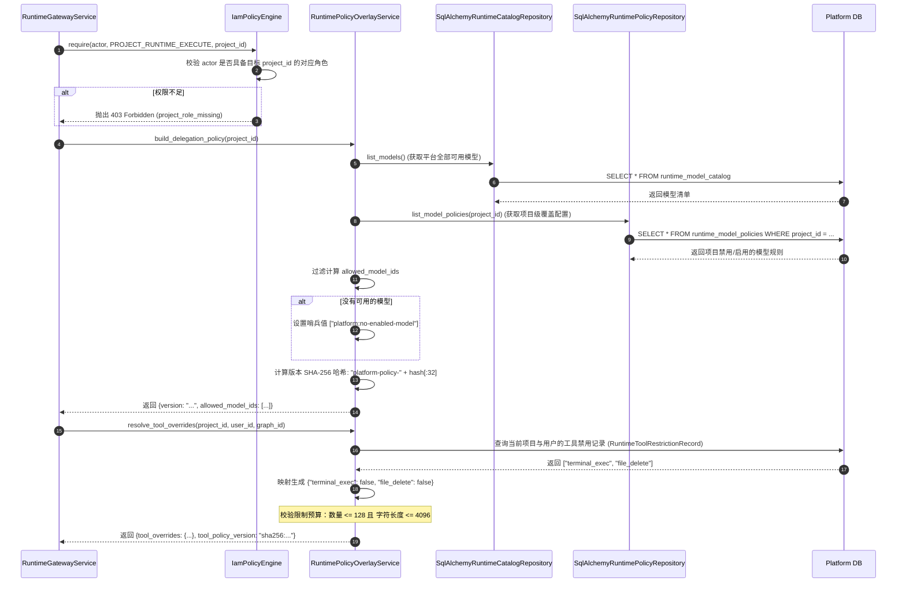

# 03-IAM 权限模型、租户隔离与 BYOK 模型治理 (IAM, Tenant Isolation & BYOK Model Governance)

## 模块定位与核心价值

在面向企业级场景的 AI Agent 平台中，安全治理与权限管控是决定系统能否商用的生死线。不同于单租户的玩具项目，企业级平台面临极度严苛的安全边界：
1. **组织与项目隔离**：不同部门、项目组之间的数据和会话严禁穿透，执行中的 Agent 不能擅自跨越工作空间访问其他项目的资产。
2. **细粒度权限控制（RBAC）**：平台管理员、项目管理员、普通开发者与只读访客的角色职责必须清晰划分。
3. **BYOK（Bring Your Own Key）模型资产治理**：企业各部门可能拥有自己采购的 OpenAI、Claude 或私有部署的 DeepSeek 凭据。如何保证这些高危敏感密钥在平台内安全存储，且在下发给执行引擎时做到**零泄露、细粒度授权、即时撤销**？
4. **工具使用边界限制（Tool Governance）**：特定项目或特定用户可能被禁止调用某些高危工具（如直接执行终端命令或写入外部文件）。

`platform-api` 通过 `modules/iam`、`modules/projects`、`modules/runtime_policies` 与 `modules/audit` 协同构建了这一套完整的防御体系。

---

## 零、知识前置与上下文串联（Knowledge Bridges）

### 1. 认知输入（前置模块输入）
- 依赖 [01-architecture.md](01-architecture.md)：中间件阶段已提取出 `ActorContext`，其中包含用户的平台角色（`platform_roles`）以及按项目映射的项目角色（`project_roles`）。
- 依赖 [02-runtime-gateway.md](02-runtime-gateway.md)：网关在接收到任何执行指令前，必须由 IAM 判定其是否具有 `PROJECT_RUNTIME_EXECUTE` 或 `PROJECT_RUNTIME_READ` 权限。

### 2. 本章核心流转
- **双层权限裁决**：`IamPolicyEngine` 依据 `AuthorizationRequest` 中的权限码（平台级 vs 项目级）进行分层裁决，强制要求项目级操作显式绑定 `project_id`。
- **模型授权策略裁剪**：`RuntimePolicyOverlayService` 计算项目可用的模型白名单（Allowed Models），并基于哈希生成不可变的版本指纹。
- **工具限制黑名单叠加**：针对项目与特定用户查询工具禁用规则，构建仅包含 `False` 值的覆盖表并校验预算预算限制（最大 128 个工具 / 4KB 限制）。
- **凭据加密保全**：使用 Fernet 对称主密钥对 API Key 进行密文存储与受控解密。

### 3. 认知输出（支撑后续模块）
- 为 [04-catalog-management.md](04-catalog-management.md) 提供模型凭证的密文加解密与状态隐藏机制。
- 为向下游签发的 Delegation Token 提供精准的模型白名单与工具禁用清单。

<details>
<summary>💡 老王说人话：到底什么是 IAM？双层 RBAC 是怎么玩的？（30秒速懂）</summary>

1. **生活大白话类比**：就像高档小区门禁保安（AAA体系）：先验工牌（AuthN 认证），再查业主权限套餐（AuthZ 鉴权），最后监控拍照记账（Audit 审计）；平台超管就像总行长，没有万能钥匙，想查分行私密保险箱必须走显式接管并亮红灯审计。
2. **解决的生产痛点**：如果不搞双层 RBAC，全系统就一个 `is_admin`，财务管理员能直接登录清空算法代码库；前端传一个 `thread_id` 就能水平越权偷看全公司商业机密。
3. **本项目怎么落地**：在本项目对应 `modules/iam/application/policies.py` 的 `IamPolicyEngine` 与 `PlatformRole`/`ProjectRole`，完整推演与 20 行极简对比详见 [concepts/05-iam-and-rbac-architecture.md](concepts/05-iam-and-rbac-architecture.md)。
</details>

---

## 一、对立视角：简易原型 vs 生产架构（Naive vs Production）

| 维度 | 简易原型方案 (Naive) | 本平台企业级架构 (Production Architecture) | 选型与演进考量 |
| :--- | :--- | :--- | :--- |
| **权限校验** | 单一的 `is_admin` 布尔值，或者在接口内部到处硬编码 `if user.role != "admin"`。 | 分离的平台级（Platform）与项目级（Project）RBAC 引擎（`IamPolicyEngine`），代码中完全基于权限码（`PermissionCode`）解耦。 | 支撑复杂的企业组织架构，避免超级管理员在未加入特定项目时随意污染项目内部的运行状态。 |
| **租户数据隔离** | 数据库只建一个大表，通过前端传来的 `project_id` 过滤，缺少强制性上下文核验。 | 双重作用域校验：中间件级强校验 URL 路径与 `x-project-id` Header；领域层强校验 Actor 的项目角色。 | 从网络边界到数据库 Repository 层层设防，彻底杜绝 IDOR（不安全的直接对象引用）水平越权。 |
| **模型 Key 管理** | 数据库明文存储 API Key，或者直接让前端在聊天请求中传入 `OPENAI_API_KEY`。 | 平台集中托管，使用 Fernet 对称加密，数据库只存密文；只向授权的运行时内部暴露一次性解密凭证。 | 杜绝由于客户端反编译、XSS 或开发人员疏忽导致昂贵的企业大模型 API Key 泄露。 |
| **工具权限管理** | 智能体能调用的工具全部写死在 Prompt 或代码里，全开全关。 | 动态覆盖层机制（Tool Restrictions Overlay），项目/用户级别按需对特定工具设置禁用（`False`）。 | 满足合规要求：允许初级开发者使用 Agent 进行代码阅读，但严禁使用写入或远程执行类工具。 |
| **操作审计** | 无审计或仅有简单的 `console.log`，难以回溯责任人与变更前后的数据。 | 专有 `modules/audit` 模块，结构化捕获请求上下文、Actor、敏感数据脱敏与变更快照。 | 满足 SOC2、ISO27001 等企业合规审计要求。 |

---

## 二、源码精准坐标映射（Code Pointer Map）

### 1. IAM 与策略引擎
- [modules/iam/application/policies.py](../../../apps/platform-api/src/platform_api/modules/iam/application/policies.py)：
  - `PermissionCode`：声明 32 个细粒度权限码（如 `PLATFORM_USER_READ`, `PROJECT_RUNTIME_EXECUTE` 等）。
  - `PLATFORM_PERMISSION_MAP` 与 `PROJECT_PERMISSION_MAP`：权限到角色的静态映射规则。
  - `IamPolicyEngine`：执行 `evaluate()` 与 `require()`，提供清晰的判决原因（`PolicyReason`）。
- [modules/iam/domain/roles.py](../../../apps/platform-api/src/platform_api/modules/iam/domain/roles.py)：
  - `PlatformRole`：`super_admin`, `operator`, `viewer`。
  - `ProjectRole`：`admin`, `editor`, `executor`。

### 2. 项目与多租户隔离
- [modules/projects/router.py](../../../apps/platform-api/src/platform_api/modules/projects/router.py)：项目工作空间管理端点。
- [modules/projects/service.py](../../../apps/platform-api/src/platform_api/modules/projects/service.py)：项目成员管理、项目归属校验与配额管理。

### 3. 运行时策略与 BYOK 治理
- [modules/runtime_policies/application/service.py](../../../apps/platform-api/src/platform_api/modules/runtime_policies/application/service.py)：
  - `build_delegation_policy()`：提取项目启用的可用模型清单，计算版本哈希。
  - `resolve_tool_overrides()`：计算当前执行的工具禁用覆盖字典。
- [modules/runtime_catalog/application/credentials.py](../../../apps/platform-api/src/platform_api/modules/runtime_catalog/application/credentials.py)：
  - `encrypt_api_key()` 与 `decrypt_api_key()`：基于 Fernet 的模型密钥对称加解密。

### 4. 审计体系
- [modules/audit/http_writer.py](../../../apps/platform-api/src/platform_api/modules/audit/http_writer.py)：结构化审计日志落盘。
- [entrypoints/http/middleware/audit_log.py](../../../apps/platform-api/src/platform_api/entrypoints/http/middleware/audit_log.py)：HTTP 请求审计拦截器。

---

## 三、真实数据结构与报文（Real Payloads & DB Schemas）

### 1. 角色与权限映射定义
```python
# apps/platform-api/src/platform_api/modules/iam/application/policies.py

PROJECT_PERMISSION_MAP: dict[PermissionCode, frozenset[ProjectRole]] = {
    PermissionCode.PROJECT_MEMBER_READ: frozenset({ProjectRole.ADMIN, ProjectRole.EDITOR, ProjectRole.EXECUTOR}),
    PermissionCode.PROJECT_MEMBER_WRITE: frozenset({ProjectRole.ADMIN}),
    PermissionCode.PROJECT_AUDIT_READ: frozenset({ProjectRole.ADMIN, ProjectRole.EDITOR}),
    PermissionCode.PROJECT_ASSISTANT_READ: frozenset({ProjectRole.ADMIN, ProjectRole.EDITOR, ProjectRole.EXECUTOR}),
    PermissionCode.PROJECT_ASSISTANT_WRITE: frozenset({ProjectRole.ADMIN, ProjectRole.EDITOR}),
    PermissionCode.PROJECT_RUNTIME_READ: frozenset({ProjectRole.ADMIN, ProjectRole.EDITOR, ProjectRole.EXECUTOR}),
    PermissionCode.PROJECT_RUNTIME_EXECUTE: frozenset({ProjectRole.ADMIN, ProjectRole.EDITOR, ProjectRole.EXECUTOR}),
    PermissionCode.PROJECT_RUNTIME_WRITE: frozenset({ProjectRole.ADMIN}),
}
```

<details>
<summary>💡 老王说人话：32 项权限码和双层 RBAC 到底怎么判定？超管怎么接管项目？（30秒速懂）</summary>

1. **生活大白话类比**：银行总行长（平台超管）管大楼，分行私人保险柜（项目）只有支行长（Admin）和持有特定钥匙的员工（Editor/Executor）能进；总行长不能偷看，紧急排障必须走显式接管（Takeover）并在监控室留下大红印章。
2. **解决的生产痛点**：如果业务代码到处硬编码 `if role == "admin"`，新增一个角色就要重构 200 个接口；通过人 -> 角色 -> 权限码三层解耦与原生 frozenset 查表，判定耗时仅 0.01ms，新增角色零代码改动！
3. **本项目怎么落地**：在本项目对应 `modules/iam/application/policies.py` 的 `IamPolicyEngine`，32项原子权限码字典、猎鹰智航车企实战故事线与 5 阶段时序推演详见 [concepts/06-dual-layer-rbac-deep-dive.md](concepts/06-dual-layer-rbac-deep-dive.md)。
</details>

### 2. 工具限制持久化模型（SQLAlchemy）
限制表采用“只减不增”的否定式设计。表中存在记录即代表该主体（项目或个人）在该图执行时**禁用**该工具：

```python
# apps/platform-api/src/platform_api/modules/runtime_policies/infra/sqlalchemy/models.py

class RuntimeToolRestrictionRecord(Base):
    __tablename__ = "runtime_tool_restrictions"

    id: Mapped[UUID] = mapped_column(primary_key=True, default=uuid4)
    project_id: Mapped[UUID] = mapped_column(ForeignKey("projects.id"), index=True, nullable=False)
    graph_id: Mapped[str] = mapped_column(String(128), index=True, nullable=False)
    tool_name: Mapped[str] = mapped_column(String(128), nullable=False)
    subject_type: Mapped[str] = mapped_column(String(32), nullable=False)  # "project" | "user"
    subject_id: Mapped[UUID] = mapped_column(nullable=False)
    created_at: Mapped[datetime] = mapped_column(DateTime(timezone=True), default=datetime.utcnow)
```

---

## 四、端到端函数级调用时序（Function-Level Trace）

当智能体准备启动时，网关拉取授权策略并组装 Delegation Policy 的完整调用时序如下：



---

## 五、核心实现高保真伪代码（High-Fidelity Pseudocode）

### 1. 双层 RBAC 权限引擎判决（IamPolicyEngine）
```python
# 对应 apps/platform-api/src/platform_api/modules/iam/application/policies.py

class IamPolicyEngine:
    def evaluate(self, *, actor: ActorContext, authorization: AuthorizationRequest) -> PolicyDecision:
        if not actor.is_authenticated:
            return PolicyDecision(allowed=False, reason=PolicyReason.NOT_AUTHENTICATED)

        permission = authorization.permission

        # 1. 项目级权限裁决 (严格要求 project_id 必填)
        if permission in PROJECT_PERMISSION_MAP:
            if not authorization.project_id:
                return PolicyDecision(allowed=False, reason=PolicyReason.PROJECT_SCOPE_REQUIRED)

            # 获取当前用户在目标项目下的角色集合
            user_roles = actor.project_role_set(authorization.project_id)
            required_roles = PROJECT_PERMISSION_MAP[permission]
            # 只要有一个角色匹配即允许
            if any(role in required_roles for role in user_roles):
                return PolicyDecision(allowed=True, reason=PolicyReason.PROJECT_ROLE_ALLOWED)
            return PolicyDecision(allowed=False, reason=PolicyReason.MISSING_PROJECT_ROLE)

        # 2. 平台级权限裁决
        if permission in PLATFORM_PERMISSION_MAP:
            # 平台超级管理员天生放行平台级操作
            if actor.has_platform_role(PlatformRole.SUPER_ADMIN.value):
                return PolicyDecision(allowed=True, reason=PolicyReason.PLATFORM_SUPER_ADMIN)

            required_roles = PLATFORM_PERMISSION_MAP[permission]
            if any(actor.has_platform_role(r.value) for r in required_roles):
                return PolicyDecision(allowed=True, reason=PolicyReason.PLATFORM_ROLE_ALLOWED)
            return PolicyDecision(allowed=False, reason=PolicyReason.MISSING_PLATFORM_ROLE)

        return PolicyDecision(allowed=False, reason=PolicyReason.PERMISSION_NOT_REGISTERED)
```

### 2. 工具限制覆盖与预算安全守卫（resolve_tool_overrides）
```python
# 对应 apps/platform-api/src/platform_api/modules/runtime_policies/application/service.py

def resolve_tool_overrides(self, *, project_id: str, user_id: str | None, graph_id: str) -> dict:
    project = parse_uuid(project_id)
    user = parse_uuid(user_id) if user_id else None

    with self._session_factory() as session:
        # 查询属于当前项目或当前用户的禁用工具列表
        tool_names = session.scalars(
            select(RuntimeToolRestrictionRecord.tool_name).where(
                RuntimeToolRestrictionRecord.project_id == project,
                RuntimeToolRestrictionRecord.graph_id == graph_id,
                or_(
                    (RuntimeToolRestrictionRecord.subject_type == "project") & (RuntimeToolRestrictionRecord.subject_id == project),
                    (RuntimeToolRestrictionRecord.subject_type == "user") & (RuntimeToolRestrictionRecord.subject_id == user),
                )
            )
        ).all()

    # 核心设计：工具覆盖永远只能设为 False（只允许禁用，不允许越权启用）
    overrides = {name: False for name in sorted(set(tool_names))}

    # 预算保护：防止恶意大量录入工具黑名单导致 JWT 超限爆头
    serialized = json.dumps(overrides, separators=(",", ":"))
    if len(overrides) > 128 or len(serialized.encode()) > 4096:
        raise ServiceUnavailableError(
            code="tool_policy_too_large",
            message="Tool restrictions exceed delegation budget"
        )

    # 产生防篡改版本哈希
    payload = json.dumps([project_id, user_id, graph_id, overrides], separators=(",", ":"))
    return {
        "tool_overrides": overrides,
        "tool_policy_version": "sha256:" + hashlib.sha256(payload.encode()).hexdigest(),
    }
```

---

## 六、假想断电与极限场景推演（Thought Experiments）

### 场景一：平台超级管理员试图直接操作未加入的项目会话
- **推演过程**：系统超级管理员（拥有 `PlatformRole.SUPER_ADMIN`）在平台控制台直接调用 `/threads/{thread_id}/commands` 介入某个敏感研发项目的会话，但该管理员未被项目 Admin 添加为该项目的成员。
- **系统表现**：`IamPolicyEngine` 识别到请求所需权限为 `PROJECT_RUNTIME_EXECUTE`（属于 `PROJECT_PERMISSION_MAP`）。此时引擎不会因为具有超级管理员角色而自动豁免，而是强行检查其 `project_roles`。由于其不在项目成员列表内，判定结果为 `MISSING_PROJECT_ROLE`，抛出 `403 Forbidden`。若管理员必须介入，必须走显式的项目接管（`takeover`）流程，并在审计日志中记录接管事件。

### 场景二：攻击者批量录入数千条工具限制试图进行 DoS 攻击
- **推演过程**：具有项目管理员权限的攻击者编写脚本，向平台接口循环添加 5000 个伪造的工具限制，试图撑大 Delegation JWT 使请求头超出网关的 8KB 限制，拖垮上下游通信。
- **系统表现**：`resolve_tool_overrides` 在计算时执行硬检查：当 `len(overrides) > 128` 或 JSON 序列化大小超过 4096 字节时，立即抛出 `ServiceUnavailableError("tool_policy_too_large")`，请求被阻断且不会签发出畸形的超大令牌，保护了底层网络协议栈。

### 场景三：项目管理员将所有大模型全部关闭
- **推演过程**：项目管理员在项目设置中误操作关闭了所有模型，随后用户在界面发起对话。
- **系统表现**：`build_delegation_policy` 检测到 `allowed_model_ids` 为空。为了保证生成的 Delegation JWT 在结构上依然合法合规，它不会传入空列表导致下游解析器崩溃，而是注入安全哨兵值 `["platform:no-enabled-model"]`。在网关层前置校验或下游执行时，由于找不到匹配的模型立即拒绝执行，并返回语义清晰的错误提示，而不是报出未知的空指针或索引越界。

---

## 七、架构不变量清单（Architectural Invariants）

1. **项目权限作用域强制性**：任何项目级权限（`PROJECT_*`）的评估，必须提供 `project_id`；平台超级管理员身份不得无缝穿透项目级安全边界。
2. **工具覆盖只减不增原则**：所有由策略模块生成的 `tool_overrides` 映射值必须严格为 `False`。平台只支持向下禁用工具，绝对禁止通过覆盖层赋予主体其本身不具备的工具能力。
3. **明文凭据非持久化原则**：大模型 API Key 在入库前必须完成 Fernet 对称加密，只持久化密文；任何对外暴露的查询 API 严禁返回明文 Key。
4. **工具限制预算硬上限原则**：单个会话/图执行绑定的工具禁用字典，总条目严禁超过 128 条，JSON 序列化字节数严禁超过 4096 字节。
