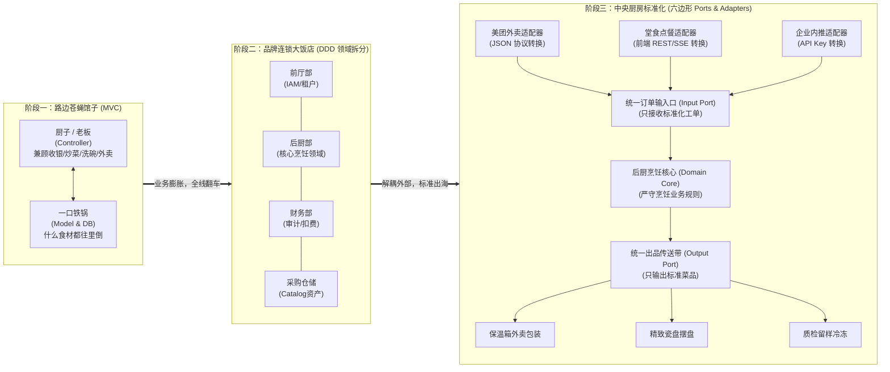
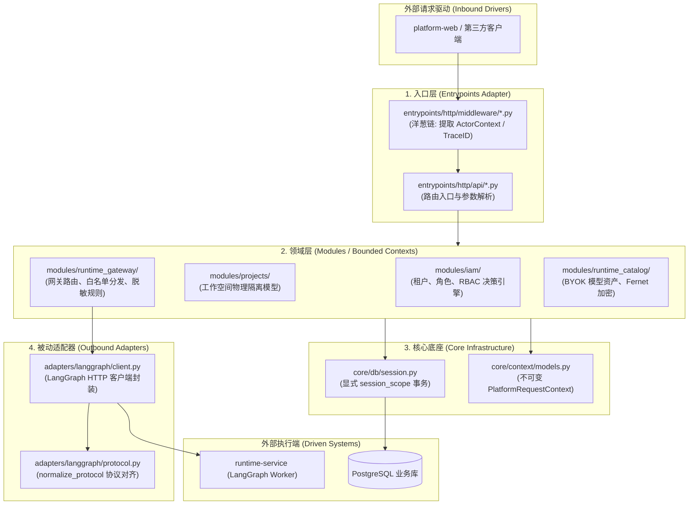

# 01-从 MVC 到 DDD 与六边形架构深度透析 (From MVC to DDD & Hexagonal Architecture)

> **核心定位**：彻底扫清阅读 `platform-api` 源码的架构门槛。用人话和极简代码搞清楚：为什么平台后端坚决摒弃常见的一把抓平铺 MVC，转向**领域驱动设计（DDD）**与**六边形架构（Ports and Adapters）**？在当前工程中怎么找代码？新需求该往哪写？

---

## 一、 生活大白话演进史（不讲黑话讲人话）

写代码就跟开馆子做餐饮一模一样。系统的架构之所以演化，从来不是哪个架构师吃饱了撑的为了炫技，而是被业务规模和生产事故给生生逼出来的。



### 1. 传统 MVC：路边苍蝇馆子
- **怎么干的**：一个厨子（Controller）既当老板又当店小二。客人进门点菜（View），厨子听完直接抓起生肉扔锅里（Model），一边颠勺一边拿满是油污的手收钱找零。
- **痛点在哪里**：店小、只卖炒饭时，这套特别快。但凡生意一好，增加了美团外卖、微信扫码、会员打折、退款仲裁：厨子正在锅边颠勺，外卖小哥冲进后厨催单，收银台阿姨大喊退款算错账。厨子一慌神，盐当成糖倒进锅里，菜糊了，账乱了，整家店当场瘫痪。
- **映射到代码**：就是很多初学者最爱的 FastAPI 极简写法——在 `routers/` 的一个视图函数里写上 200 行：查 SQL、算权限、调第三方大模型、发邮件、记日志，全塞在一起。改个字段，全局崩溃。

### 2. 领域驱动设计（DDD）：品牌连锁大饭店
- **怎么干的**：把饭店按业务边界强拆成**独立部门（限界上下文 Bounded Context）**：前厅接待（IAM/权限）、后厨烹饪（核心业务）、财务出纳（账单审计）、仓储采购（模型/工具资产目录）。
- **核心好处**：各司其职，语言统一。后厨的特级大厨只需要钻研怎么醒肉、火候怎么控（核心业务逻辑与领域实体），绝不操心客人是用微信支付还是刷外卡。前厅改了会员升级规则，后厨一概不知也不需要知道。

### 3. 六边形架构（端口与适配器）：中央厨房标准化
- **怎么干的**：后厨墙上开了两个标准化窗口：
  - **输入窗口（Inbound Port，驱动型端口）**：后厨宣布“只要递进来的小票符合《标准烹饪工单格式》，不管是外卖小哥送来的、堂食服务员送来的、还是电话预约的，我都接”。至于外卖 JSON 怎么转成工单，由窗外的**输入适配器（Adapter）**负责转换。
  - **输出窗口（Outbound Port，被动型端口）**：大厨炒好菜，往出餐带上一推。至于外面是打包进降解外卖盒、还是装进五星级瓷盘，由窗外的**输出适配器（Adapter）**去包装。大厨绝不会在炒菜时写“如果是美团外卖就撕个塑料袋”。
- **核心好处**：**核心业务稳如磐石，外部依赖随意替换**。哪怕明天把前端从 Vue 换成 React，把底层大模型从 OpenAI 换成 Anthropic，把数据库从 PostgreSQL 换成 MySQL，后厨的核心代码一行都不用改！

---

## 二、 20 行极简代码对立演示（Naive vs. Production）

### 1. 玩具级 MVC 大泥球（反例：千万别这么写）

看下面这段典型的 FastAPI 初学者代码，把路由、网络调用、数据库与业务规则全死死绑死：

```python
# 典型反例：全部揉在 router 里的“自杀式”写法
from fastapi import APIRouter, Depends
import httpx
from sqlalchemy.orm import Session

router = APIRouter()

@router.post("/chat")
def chat(user_id: str, prompt: str, db: Session = Depends(get_db)):
    # 1. 业务逻辑与数据库 ORM 死死耦合
    user = db.query(UserModel).filter(UserModel.id == user_id).first()
    if not user or user.balance <= 0:
        return {"error": "余额不足"}

    # 2. 核心业务里直接写死第三方 HTTP 调用（一旦接口改动或断网，业务全塌）
    resp = httpx.post("https://api.openai.com/v1/chat/completions", json={"prompt": prompt})
    result = resp.json()["choices"][0]["text"]

    # 3. 随手扣费，缺少显式事务与审计边界
    user.balance -= 1
    db.commit()
    return {"reply": result}
```

> 💥 **这玩意的致命缺陷**：
> 1. **无法单测**：想测试“余额不足”分支，你必须连上真实数据库；想测扣费，还得真实请求 OpenAI。
> 2. **外部绑死**：明天 Runtime 换成私有部署的 LangGraph，或者 OpenAI 协议升级，必须去动核心视图函数。
> 3. **脏写隐患**：`db.commit()` 随处调用，要是大模型请求超时卡死，事务挂起直接拖死连接池。

---

### 2. DDD + 六边形架构（正例：工业级拆解）

用最纯粹的 Python 规范拆解为：**纯内存领域实体 + 抽象端口 + 外部适配器**。

```python
from typing import Protocol
from dataclasses import dataclass

# ==================== 1. 核心领域（Domain: 纯业务规则，零第三方依赖） ====================
@dataclass
class ChatWallet:
    user_id: str
    balance: int

    def deduct(self, amount: int = 1) -> None:
        if self.balance < amount:
            raise ValueError("余额不足，拒绝执行！")
        self.balance -= amount

# ==================== 2. 输出端口（Port: 核心对外部执行引擎的抽象契约） ====================
class AgentExecutionPort(Protocol):
    def invoke_agent(self, prompt: str) -> str:
        """核心业务只认这个接口，根本不管底层是 LangGraph、OpenAI 还是 Mock"""
        ...

# ==================== 3. 外部适配器（Adapter: 隔离具体的网络与第三方细节） ====================
class LangGraphRuntimeAdapter(AgentExecutionPort):
    def __init__(self, endpoint: str):
        self.endpoint = endpoint

    def invoke_agent(self, prompt: str) -> str:
        # 在这里处理 httpx、Delegation JWT 注入与重试细节
        # 即使这里改翻了天，核心领域的业务规则也是零感知的！
        return f"[来自 LangGraph 真实执行] 回复: {prompt}"

# ==================== 4. 业务用例编排（Application / UseCase） ====================
class ChatApplicationService:
    def __init__(self, execution_port: AgentExecutionPort):
        self.execution_port = execution_port

    def execute_chat(self, wallet: ChatWallet, prompt: str) -> str:
        # 纯净的业务时序编排：先校验业务不变量，再触发执行，再扣减
        wallet.deduct(1)
        return self.execution_port.invoke_agent(prompt)
```

> 🎯 **老王敲黑板**：
> 看明白没有？核心业务类 `ChatWallet` 和 `ChatApplicationService` 里没有一丁点 `httpx`、没有一丁点 FastAPI、也没有一丁点 SQLAlchemy！
> 跑单测时，传一个本地返回固定字符串的 Fake 适配器，0.001 秒就能把所有扣费和边界条件测个底朝天！

---

## 三、 本项目真实工程落地对照（Mapping to Real Codebase）

在 `platform-api` 里面，这个理论体系是怎么具体落地的？别去找虚无缥缈的概念，直接对准你的编辑器目录：



### 1. 精确物理坐标映射表

| 六边形 / DDD 角色 | 本项目实际源码路径 | 承担的核心职责与设计取舍 |
|---|---|---|
| **入口适配器 (Inbound Adapter)** | `apps/platform-api/src/platform_api/entrypoints/http/` | 把外部的 HTTP / SSE 请求转化为内部调用。负责路由聚合 (`router.py`)，中间件洋葱链 (`middleware/`) 完成 Token 验证和 Trace 注入。 |
| **领域限界上下文 (Bounded Contexts)** | `apps/platform-api/src/platform_api/modules/` | 业务核心。每个子目录就是一个业务闭环，**严禁跨模块外键乱飞**：<br>• `iam/`：RBAC 策略计算；<br>• `projects/`：租户项目隔离；<br>• `runtime_gateway/`：网关反向代理规则；<br>• `runtime_catalog/`：模型与密钥解密。 |
| **出口端口与适配器 (Outbound Adapters)** | `apps/platform-api/src/platform_api/adapters/` | 封装与外部系统的一切通信。<br>• `adapters/langgraph/`：隔离与 `runtime-service` 的网络细节、双向验签与数据格式转换，下文的 `normalize_protocol` 就在这里。 |
| **基础设施与共享内核 (Shared Kernel & Core)** | `apps/platform-api/src/platform_api/core/` | 整个控制面共用的基础设施：<br>• `core/db/session.py`：强制使用显式 `session_scope()` 事务管理器；<br>• `core/context/models.py`：强类型且只读的 `PlatformRequestContext`。 |

---

## 四、 老王灵魂拷问（思考题与自测问答）

### Q1：我在 `modules/runtime_gateway` 里想调用 `runtime-service`，为什么不能直接在函数里写 `import httpx; httpx.post(...)`？

> **老王怒喷**：
> 艹！你要是敢在业务模块里直接 `import httpx` 发请求，老王我真想抽你！
> 1. **你把网络细节给硬编码进业务了**：如果明天下游服务增加了 Delegation JWT 双向令牌签名、配置了重试熔断策略、或者是切换成 gRPC，你打算把几十个业务函数一个个翻出来改？
> 2. **你让自动化单测成了灾难**：一旦直接绑死 `httpx.post`，单测就必须启动真实网络或在全局打猴子补丁（monkeypatch），极易污染上下文。通过 `adapters/langgraph` 封装，测试时注入一个 mock client，毫秒级跑完，干脆利落！

---

### Q2：为什么数据库 ORM 模型（如 `ProjectModel`）绝不允许直接当成入参或出参在各层到处传？

> **老王拍桌**：
> 这是典型的“贪图省事、后患无穷”的傻瓜做法！
> 1. **ORM 是活的、有状态的**：SQLAlchemy 的模型实例跟 `Session` 绑定在一起。当你在入口层或者异步任务里访问一个没在事务里预加载（eager load）的关联关系时，ORM 会偷偷在后台发一条 SQL。而在 ASGI 异步协程环境里，这会导致经典的 `DetachedInstanceError` 瞬间把接口干崩！
> 2. **接口契约与数据库结构彻底绑死**：前端要个字段，你就直接在表里加一列；表里字段改个名，前端直接拿不到数据报 500。在本项目中，入口接收 Pydantic DTO，上下文使用只读 `dataclass(frozen=True)`，落库前转换为 ORM，各走各的道，井水不犯河水！

---

### Q3：如果明天要给平台新增一个“飞书机器人告警通知”能力，我应该怎么组织代码？

> **老王给你梳理的标准动作**：
> 1. **第一步（定端口）**：在业务需要发送告警的地方，定义一个通用的通知抽象接口（比如 `NotificationPort`），里面只有一个抽象方法 `notify(title: str, content: str)`。
> 2. **第二步（写适配器）**：在 `adapters/feishu/` 目录下新建适配器类，实现这个接口，里面专心处理飞书特定的 Webhook URL、签名算法以及 JSON 拼装。
> 3. **第三步（依赖注入组装）**：在入口启动或容器初始化时，把飞书适配器注入给业务用例。
> 4. **收益**：后天如果老板抽风说改用钉钉，业务层一行代码不用改，直接再写个 `adapters/dingtalk/` 换掉注入即可。这，就叫专业的工程规范！
