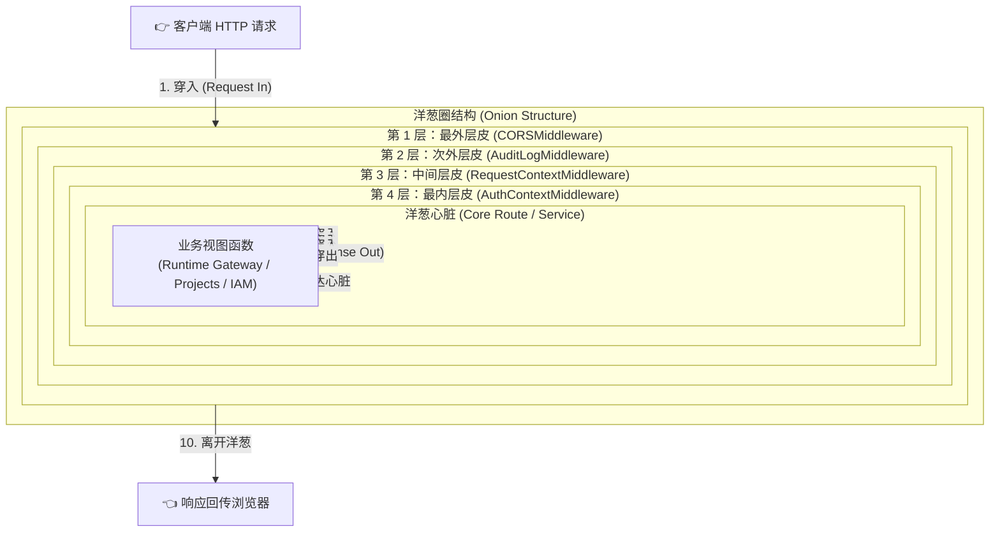
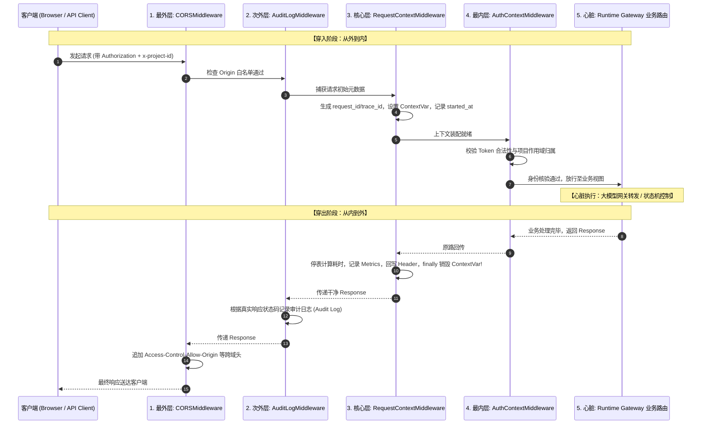

# 02-深入理解中间件洋葱圈模型 (Onion Middleware Model)

> **核心定位**：彻底拆解现代 Web 框架（FastAPI / Starlette / Koa / Gin）的核心设计基石——**洋葱模型（Onion Middleware Model）**。用人话和平台真实代码，搞清楚为什么它不是一条直来直去的单向流水线，请求和响应如何在各层中优雅穿透，以及平台控制面如何借助它实现无感追踪、权限拦截、指标采集与上下文防泄漏。

---

## 一、 生活大白话演进史（不讲黑话讲人话）

很多人初学 Web 开发，看到“中间件（Middleware）”这个词，脑子里往往把它脑补成工厂里的**单向传送带**：

```text
[客户端请求] ---> [A 检查跨域] ---> [B 校验 Token] ---> [C 业务视图] ---> [客户端收到]
```

> 💥 **老王拍桌：大错特错！如果真是单向传送带，你告诉我这几个生产问题怎么解决：**
> 1. **谁来算耗时？** A 在门外看着请求进去了，但 A 怎么知道整个请求在里面折腾了多少毫秒才出来？
> 2. **谁来收拾残局？** 如果 C（业务视图）突然抛出异常崩溃了，单向传送带直接卡死断流，前端拿到的是冰冷丑陋的连接断开或 500 堆栈，谁来在最外层把它包装成友好的 JSON 错误包？
> 3. **谁来打扫房间？** 请求在处理过程中申请了数据库连接、设置了协程上下文变量（`ContextVar`），跑完了谁来销毁？

### 真实的洋葱模型：进无尘车间穿脱防护服

洋葱是一层包一层的。最中心是**核心业务视图（Router / Service / 数据库 / 大模型执行）**，外面裹着一层又一层的**中间件皮**。



#### 请求的生命周期分为两个截然相反的阶段：
1. **穿入阶段（Request In，从外向内剥洋葱）**：
   - 先穿最外层（CORS）：看看你从哪个域名来，不是白名单直接拦截；
   - 再穿第二层（Audit）：门禁监控拍个照，记录有人进来了；
   - 再穿第三层（RequestContext）：给你脖子上挂个工牌（生成 `trace_id`、`request_id`），按下秒表（记录起始时间 `started_at`），把工牌存入当前协程；
   - 再穿第四层（AuthContext）：刷指纹查权限（Token 验签与项目归属），权限不对当场一脚踹出去（**短路返回**，根本不会打扰里面的核心业务）；
   - 终于抵达心脏（Router）：真正干业务逻辑（调大模型网关、查库、算状态机）。
2. **穿出阶段（Response Out，从内向外原路穿回）**：
   - 心脏干完活，交出产物（Response）；
   - 原路返回穿透第四层（AuthContext）：执行后置校验；
   - 原路返回穿透第三层（RequestContext）：秒表停表，计算出接口总共花了 `42.5ms`，把耗时记入 Prometheus 指标库，在回执上盖章 `x-trace-id`，**并在离场前把协程工牌彻底销毁（防止下一个人冒用）**；
   - 原路返回穿透第二层（Audit）：记录最终响应状态码（是 200 还是 403）；
   - 原路返回穿透最外层（CORS）：把允许跨域的 Header 贴在包装盒上。

> 🎯 **老王总结一句话**：
> **进一次，出一趟；前置逻辑进门准备，后置逻辑出门善后；这就是洋葱圈！**

---

## 二、 20 行极简代码对立演示（Naive vs. Production）

### 1. 玩具级单体写法（反例：没有洋葱圈的恶心代码）

如果不搞洋葱中间件，你的每个视图函数就会烂成这副鬼样子：

```python
# 典型反例：每个视图都在重复写横切逻辑，漏写一个就出灾难性事故
@router.post("/threads/{thread_id}/runs")
async def start_run(thread_id: str, request: Request):
    # 1. 手动打点计时
    start = time.perf_counter()
    trace_id = request.headers.get("x-trace-id") or uuid.uuid4().hex

    # 2. 手动验 Token
    token = request.headers.get("Authorization")
    if not token or not verify_jwt(token):
        return JSONResponse(status_code=401, content={"error": "unauthorized"})

    # 3. 业务核心逻辑
    try:
        result = await execute_agent(thread_id)
    except Exception as e:
        # 异常如果没接住，直接把底层密码或堆栈裸奔吐给前端
        return JSONResponse(status_code=500, content={"error": str(e)})

    # 4. 手动记录指标和耗时（50个接口就要粘50次！）
    cost_ms = (time.perf_counter() - start) * 1000
    metrics.record("start_run", cost_ms)

    resp = JSONResponse(content=result)
    resp.headers["x-trace-id"] = trace_id
    return resp
```

---

### 2. FastAPI 中间件写法：`call_next` 是怎么用的？

在 FastAPI / Starlette 中，编写中间件的黄金模板如下：

```python
import time
import uuid
from fastapi import FastAPI, Request
from fastapi.responses import JSONResponse

app = FastAPI()

@app.middleware("http")
async def timing_and_trace_onion_middleware(request: Request, call_next):
    # ==================== [阶段一：穿入洋葱皮（前置进门）] ====================
    start_time = time.perf_counter()
    trace_id = request.headers.get("x-trace-id") or uuid.uuid4().hex
    request.state.trace_id = trace_id  # 把工牌塞给请求

    try:
        # ==================== [穿透：调用下一层（直到核心业务）] ====================
        # 注意看这行！call_next 是框架传进来的形参，代表“下一个洋葱层”
        response = await call_next(request)
    except Exception as exc:
        # 全局异常兜底：里面任何一层崩了，在外层体面地打包成标准错误
        response = JSONResponse(status_code=500, content={"code": "system_error", "message": "服务开小差了"})

    # ==================== [阶段二：穿出洋葱皮（后置出门）] ====================
    duration_ms = round((time.perf_counter() - start_time) * 1000, 2)
    response.headers["x-trace-id"] = trace_id
    response.headers["x-process-time-ms"] = str(duration_ms)

    return response  # 把加工好的响应原路送出
```

> 💡 **很多同学读到这里都会懵：`call_next` 到底是个啥？它从哪冒出来的？为什么没看到它的 `def call_next(...)` 定义？**

---

### 3. 彻底解密：`call_next` 到底是个什么鬼东西？（纯 Python 15 行手搓洋葱圈）

别被框架的黑魔法给唬住了！**`call_next` 根本不是什么深不可测的高科技，它本质就是一个动态生成的 Python 闭包（Closure）函数！**

如果你不用任何 FastAPI / Starlette，怎么用纯 Python 模拟出一个真正的洋葱圈？

看下面这段可以直接在终端裸跑的 Python 代码，老王我带你亲手把 `call_next` 造出来：

```python
import asyncio

# 1. 模拟两个中间件层
async def middleware_a(req, call_next):
    print("【A 进门】检查权限...")
    # 调用传入的 call_next，其实就是去执行 middleware_b！
    res = await call_next(req)
    print("【A 出门】追加 Header 善后！")
    return res + " -> [A 盖章]"

async def middleware_b(req, call_next):
    print("  【B 进门】开启计时...")
    # 调用传入的 call_next，其实就是去执行核心视图 core_view！
    res = await call_next(req)
    print("  【B 出门】记录耗时指标！")
    return res + " -> [B 盖章]"

# 2. 模拟核心业务视图（洋葱的心脏）
async def core_view(req):
    print("    【业务核心】正在调度 LangGraph 运行智能体...")
    return f"Response({req})"

# 3. 核心大揭秘：洋葱圈调度器（就是它动态构造出了 call_next！）
def build_onion(middlewares, final_handler):
    def get_layer(index):
        # 已经穿透到最深处，直接返回业务视图
        if index == len(middlewares):
            return final_handler

        current_middleware = middlewares[index]

        # 🎯 看这里！！这就是框架底层为你动态生成的 call_next！！
        async def call_next(request):
            next_layer = get_layer(index + 1)  # 找到下一层洋葱
            return await next_layer(request)   # 穿透到下一层执行

        # 把 call_next 包装并传给当前中间件
        async def layer_runner(request):
            return await current_middleware(request, call_next)

        return layer_runner

    return get_layer(0)

# ==================== 运行测试 ====================
async def main():
    # 组装洋葱圈：A 在最外层，B 在内层，core_view 在核心
    app = build_onion([middleware_a, middleware_b], core_view)
    result = await app("用户请求数据")
    print("\n最终返回结果:", result)

asyncio.run(main())
```

#### 运行这段代码，终端输出如下：
```text
【A 进门】检查权限...
  【B 进门】开启计时...
    【业务核心】正在调度 LangGraph 运行智能体...
  【B 出门】记录耗时指标！
【A 出门】追加 Header 善后！

最终返回结果: Response(用户请求数据) -> [B 盖章] -> [A 盖章]
```

> 🎯 **老王彻底给你点破**：
> 1. 对于 `middleware_a` 来说，框架传给它的 `call_next`，其实就是**“去调用 `middleware_b`”**的包装函数；
> 2. 对于 `middleware_b` 来说，框架传给它的 `call_next`，其实就是**“去调用核心视图 `core_view`”**的包装函数；
> 3. 当你在中间件里写下 `await call_next(request)` 时，你就是在对框架喊：**“老子的前置逻辑搞完了，后面的兄弟该你了！”**

## 三、 本项目真实工程落地对照（Mapping to Real Codebase）

在 `platform-api` 里面，洋葱圈是怎么组装、按什么顺序执行的？直接看源码：

### 1. `main.py` 中的注册顺序 vs 实际执行顺序

看 [main.py](../../../../apps/platform-api/src/platform_api/main.py#L31-L41)：

```python
# apps/platform-api/src/platform_api/main.py
register_auth_context_middleware(app, settings)     # ① 最早注册 (最内层皮)
register_request_context_middleware(app)            # ② 中间注册
register_audit_log_middleware(app)                 # ③ 较晚注册
app.add_middleware(CORSMiddleware, ...)             # ④ 最后注册 (最外层皮)
```

> ⚠️ **老王敲黑板（无数新手踩的巨坑）**：
> 在 FastAPI/Starlette 里，**越晚 `add_middleware` 的，越处于洋葱的最外层！**
> 因为每一次 `add_middleware` 都是拿一层新的外衣把现有的应用套起来。

### 2. 洋葱完整剖面时序图



### 3. 源码级硬核细节：`RequestContextMiddleware` 的进出闭环

看平台生产源码 [request_context.py](../../../../apps/platform-api/src/platform_api/entrypoints/http/middleware/request_context.py#L21-L55)：

```python
@app.middleware("http")
async def request_context_middleware(request: Request, call_next):
    # ---------- [进门] ----------
    context = build_request_context(request)
    token = set_current_request_context(context)       # 塞入协程变量
    request.state.request_id = context.request.request_id
    request.state.platform_context = context

    try:
        try:
            # ---------- [穿透到底] ----------
            response = await call_next(request)
        except Exception as exc:
            # 异常转体面 JSON，绝不吐原始堆栈
            response = unexpected_error_response(request, exc)

        # ---------- [出门] ----------
        current_context = request.state.platform_context
        duration_ms = round((perf_counter() - current_context.request.started_at) * 1000, 2)
        metrics_registry.record_http_request(...)       # 记录 Prometheus 监控指标
        response.headers["x-request-id"] = current_context.request.request_id
        response.headers["x-trace-id"] = current_context.request.trace_id
        return response
    finally:
        # ---------- [离场打扫] ----------
        reset_current_request_context(token)           # 必须销毁！杜绝并发协程复用时身份串号！
```

---

## 四、 老王灵魂拷问（思考题与自测问答）

### Q1：为什么在 `finally` 块里必须调用 `reset_current_request_context(token)`？如果省掉这行会发生什么惨案？

> **老王怒喷**：
> 艹！在异步协程（Asyncio）的世界里，这是最隐蔽的**“投毒级”大 Bug**！
> 1. Python 的 `ContextVar` 在同一个协程线程池被复用时，如果你不主动 reset，下一个完全无关的用户请求打进来，可能在某处直接读取了上一个请求的 `platform_context`！
> 2. 其后果就是：张三在网页上聊天，莫名其妙看到了李四的项目 ID 和租户配额，甚至拿着李四的权限把别人的智能体给删了！
> 3. 洋葱圈模型的 `try ... finally` 就是保证：**不论业务正常返回还是直接抛异常崩掉，出门时必须把现场给我清理得干干净净！**

---

### Q2：如果用户上传的 Token 过期了，或者 `x-project-id` 不匹配，洋葱圈是怎么“短路”的？

> **老王指路**：
> 看 `AuthContextMiddleware`：
> ```python
> if not is_valid_token:
>     return JSONResponse(status_code=401, content={"error": "token_expired"})
> ```
> 注意！它根本**不调用 `await call_next(request)`**！
> - 一旦不调 `call_next`，洋葱的穿入阶段当场终止，请求根本**不会触碰到业务路由，也不会触发下游数据库查询**；
> - 响应直接掉头从当前层向外穿出，外层的 `RequestContext` 照样能记录这次 401 的拦截耗时，`CORS` 照样能补全跨域头。
> - 这就叫**短路守卫（Short-Circuit Guard）**，把恶意请求和垃圾流量挡在最外层，保护里面脆弱的核心计算资源！
