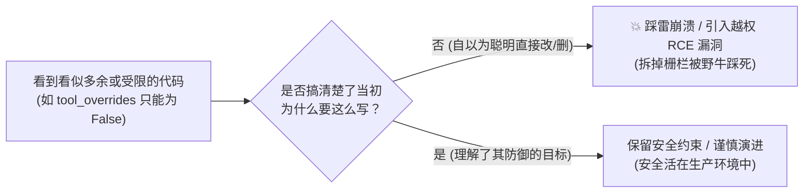
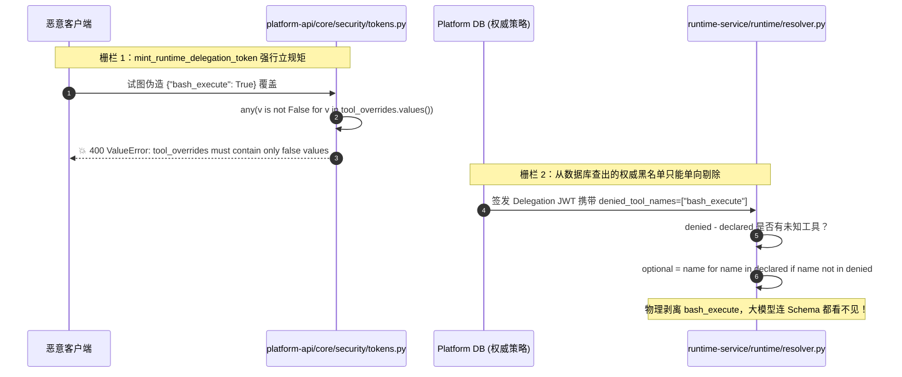

# 03-切斯特顿栅栏在软件架构防御中的深度透析 (Chesterton's Fence in Software Defense)

> **核心定位**：彻底拆解软件工程与防御性架构设计中最深刻的思维模型——**切斯特顿栅栏（Chesterton's Fence）**。用人话和平台真实代码，剖析为什么很多看似“过度繁琐、限制死板、缺乏灵活性”的代码，背后其实是在替整个系统抵挡致命的安全漏洞。通过平台中 `tool_overrides` 只能为 `False` 的硬核设计，搞清楚为什么生产级架构必须坚持“只减不增”的防御哲学。

---

## 一、 生活大白话演进史（不讲黑话讲人话）

### 1. 荒野路上的神秘栅栏

这个概念源于 1929 年英国哲学家 G.K. 切斯特顿（G.K. Chesterton）在其著作《事物观察》（The Thing）中讲的一个经典思想实验：

> 假设一条荒野土路上横立着一道木头栅栏，把路拦了一半。
>
> **毛躁的新手路过**，看了看四周平坦的草地，骂骂咧咧地说：“这破栅栏立在这里莫名其妙，既挡路又没用，老子顺手把它拆了！”
>
> **聪明的长者走过来拦住他**，说：“你现在还没搞清楚当初立栅栏的人为什么要在这里立它。如果你能调查清楚他为什么立、这道栅栏在防什么，那时候你如果还觉得它没用，我才允许你动手拆。”

几天后一问当地农夫才知道：
原来这道栅栏下方有一块被草皮掩盖的致命流沙陷阱；更关键的是，每年春天附近山上会有发情的狂暴野牛群顺着这条小道狂奔，这道栅栏就是用来强行迫使野牛减速并分流转向的！
**如果毛躁的新手当初真的把栅栏给拆了，掉进流沙或者被野牛踩死的正是他自己。**



---

### 2. 软件工程里的“拆栅栏惨案”

在软件开发中，程序员每天都在上演“拆栅栏”的悲剧：

- **典型案发现场一：过度热心的“重构大师”**
  新来团队的工程师翻看前人代码，看到一行：
  ```python
  if len(secret.encode("utf-8")) < 32:
      raise ValueError("secret too short")
  ```
  心想：“写死 32 字节太死板了！我们在本地测试用 6 位密码多方便，改成大于等于 1 吧！”
  结果：上线后被暴力破解撞库，内网穿透。
- **典型案发现场二：为了“灵活性”放弃安全约束**
  看到接口参数：
  ```python
  # 平台权威代码：强制要求 overrides 里的值只能为 False！
  if any(v is not False for v in tool_overrides.values()):
      raise ValueError("tool_overrides must contain only false values")
  ```
  新工程师大惑不解：“这写得也太反人类了吧？既然是个字典 `dict[str, bool]`，为什么只准填 `False` 不准填 `True`？我给前端加个配置，想开哪个工具就填 `True`，想关哪个就填 `False`，这不更加‘灵活可扩展’吗？”
  **结果：攻击者抓包直接传 `{"bash_execute": true}`，在服务器沙箱里提权执行 `rm -rf /`，一发 RCE 直接把公司送走！**

> 🎯 **老王敲黑板**：
> **代码本身记录了最终写了什么，但绝对不会自动告诉你它“放弃了什么”以及“在防范什么”！**
> 在你真正搞明白一段代码是在防哪类恶意攻击或容错场景之前，绝不要为了所谓的“优雅”、“灵活性”或“代码简洁”去擅自动它！

---

## 二、 20 行极简代码对立演示（Naive vs. Production）

为了让你彻底看清两者的本质区别，我们用一个“工具策略管理器”的极简对比来展示：

### 1. 假聪明的灵活原型（反例：自作聪明的无约束栅栏）

```python
# 典型反例：看似“自由灵活”，实则门户大开的自杀代码
class NaiveToolPolicyManager:
    def __init__(self, disabled_tools: set[str]):
        # 本地策略：管理员封禁了 rm 和 bash
        self.system_disabled = disabled_tools  # {"bash", "rm"}

    def apply_overrides(self, client_overrides: dict[str, bool]) -> set[str]:
        """允许客户端自由传入 True(开启) 或 False(禁用) 进行动态覆盖"""
        active_tools = {"read_file", "search"} - self.system_disabled

        for tool_name, is_enabled in client_overrides.items():
            if is_enabled:
                # 💥 致命漏洞：客户端只要传 {"bash": True}，直接在这里强行激活！
                # 管理员在后台设置的封禁策略被客户端参数瞬间废弃！
                active_tools.add(tool_name)
            else:
                active_tools.discard(tool_name)

        return active_tools
```
- **漏洞危害**：攻击者拥有低权限账号，本不具备执行 Shell 脚本的资格。通过在 HTTP 请求中恶意注入 `{"bash": True}`，直接实现了**未授权特权提升（Privilege Escalation）**。

---

### 2. 贯彻切斯特顿栅栏的生产级架构（正例：只减不增原则）

```python
# 生产级正例：切斯特顿栅栏硬编码守护，从数据结构上封死提权可能
class DefensiveToolPolicyManager:
    def __init__(self, base_available_tools: set[str]):
        self.available_tools = base_available_tools  # 智能体支持的候选工具集

    def apply_overrides(self, tool_overrides: dict[str, bool]) -> set[str]:
        """
        严格遵循切斯特顿栅栏：
        tool_overrides 只准作为黑名单（只能填 False 禁用），绝对不准作为白名单提权！
        """
        # 1. 栅栏守卫一：只要出现任何不是 False 的值，直接判定为恶意参数，当场打死！
        if not isinstance(tool_overrides, dict) or any(v is not False for v in tool_overrides.values()):
            raise ValueError("tool_overrides must contain only false values (granting tools via overrides is forbidden)")

        # 2. 提取需要被剥夺的工具黑名单
        denied_tools = set(tool_overrides.keys())

        # 3. 栅栏守卫二：只减不增（差集运算）
        # 无论客户端怎么折腾，active_tools 只能是候选集的子集，绝无可能凭空多出工具！
        return self.available_tools - denied_tools
```

> 💡 **架构哲学核心对比**：
> - 为什么不用 `{"bash": "disabled"}` 这种字符串？因为布尔值 `False` 在类型和体积上最具确定性。
> - 为什么明明是 `bool` 却只允许 `False`？因为系统的安全模型是：**“平台赋予你候选池，策略只能往下裁剪权限（只减不增），任何新增权限必须走严格的管理员 IAM 赋权，绝不可在请求上下文覆盖中放通！”**

---

## 三、 本项目真实工程落地对照（Mapping to Real Codebase）

在当前企业级 Agent 平台中，“切斯特顿栅栏”随处可见。最核心、最典型的落地就是前文讨论的**跨服务工具策略约束链条**：



### 平台内“切斯特顿栅栏”源码物理坐标清单：

| 栅栏位置与文件 | 源码坐标与核心断言 | 看似限制灵活性的表象 | 栅栏背后实际防范的致命野兽 |
|---|---|---|---|
| **Delegation 签发守卫** | [core/security/tokens.py](../../../apps/platform-api/src/platform_api/core/security/tokens.py)<br>`any(v is not False for v in tool_overrides.values())` | 凭证字典明明是 key-value，却只准 value 全是 `False`，不准设 `True`。 | **未授权工具提权**：封死攻击者通过入参注入 `{"bash": True}` 越权激活敏感工具的企图。 |
| **断点恢复参数守卫** | [modules/runtime_gateway/application/service.py](../../../apps/platform-api/src/platform_api/modules/runtime_gateway/application/service.py)<br>`disallowed = set(params) - {"interrupt_id", "response", ...}` | `input.respond` 恢复执行时，强行禁止携带任何 `model_id`、`config` 或提示词。 | **二次执行换药攻击**：防止攻击者在审批前提交安全脚本，审批通过恢复瞬间偷换成恶意代码。 |
| **网关 SSE 帧守卫** | [adapters/langgraph/runtime_gateway_upstream.py](../../../apps/platform-api/src/platform_api/adapters/langgraph/runtime_gateway_upstream.py)<br>`if len(chunk) > 8 * 1024 * 1024: raise StreamTruncated` | 单帧 SSE 强行卡死 8 MiB 限制，超过直接切断连接。 | **大包内存 DoS 炸弹**：防止下游异常吐出巨大 base64 图片或死循环日志挤爆网关内存导致整个集群 OOM。 |
| **沙箱文件写权限守卫** | [services/dearflow_agent/agent.py](../../../apps/runtime-service/src/runtime_service/services/dearflow_agent/agent.py)<br>`FilesystemPermission(paths=["/skills/**"], mode="deny")` | 智能体明明拥有当前工作区的写权限，却对自身的 `/skills/**` 被强置为只读。 | **Agent 自我篡改死循环**：防止大模型写 Python 脚本改写自身技能代码产生幻觉污染。 |

---

## 四、 老王灵魂拷问（思考题与自测问答）

### 拷问 1：如果未来有个需求，项目管理员想给某个 VIP 用户额外“开小灶”临时增加一个工具，我们能不能把 `tool_overrides` 改成支持 `True`？
> 💥 **老王答**：
> **绝对不能！谁提这个 PR 老王我直接打断他的腿！**
> 如果需要新增工具，正确的架构路径是：在控制面修改该角色的 RBAC 权限，或者在 Agent Catalog 的候选工具池（`optional_tool_names`）中配置放通，然后由系统重新计算签发包含该工具的新版图配置。
> `tool_overrides` 的语义永远是**基于候选池的下行裁剪（Subtractive Policy）**，绝不能为了一个局部需求把核心的“只减不增”栅栏给推倒！

### 拷问 2：为什么 Delegation JWT 的 TTL 强行限制在 60 秒，延长到 1 小时难道不能降低网关签名开销吗？
> 💥 **老王答**：
> 这又是一道典型的切斯特顿栅栏！
> 跨服务通信使用的是对称密钥（HMAC SHA256），签名验签耗时通常在微秒级别（`0.05ms`），根本不存在所谓的性能瓶颈。
> 相反，Delegation JWT 携带着执行权限和小票，**它不走集中式 Redis 校验（无状态校验）**。如果 TTL 设为 1 小时，管理员在控制面刚封禁了一个恶意的 Run 或者拉黑了某个用户的权限，该用户手持未过期的 1 小时小票依然能在下游横行霸道！60 秒短 TTL 保证了权限变更最多 1 分钟即可自然失效收敛。

### 拷问 3：在看到老代码中写了复杂的校验逻辑时，重构的标准动作是什么？
> 🎯 **老王行为准则**：
> 1. 先看代码旁边的 Git Blame 和 Commit 历史，看当初为什么加这段代码；
> 2. 阅读架构文档的 `METHODOLOGY.md` 和设计决策（ADR）；
> 3. 编写能够复现其防御场景的单元测试（负例测试用例）；
> 4. 在保留所有安全断言不变的前提下，才能动内部实现的刀子（Surgical Changes）！
