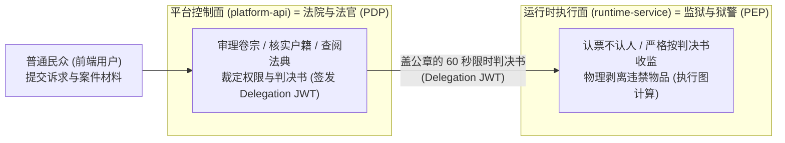
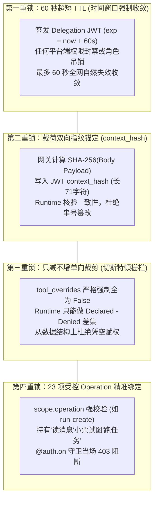
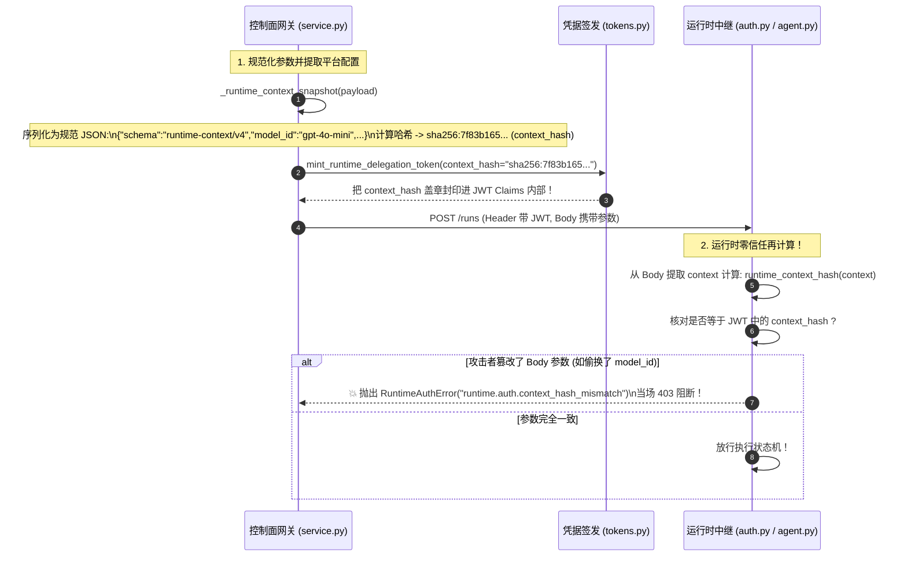

# 04-控制面与执行面权限解耦与透传报文深度透析 (Control vs Execution Plane Permissions & Payload Dissection)

> **核心定位**：彻底拆解智能体平台中最容易混淆的架构盲区——**控制面（Platform API）与执行面（Runtime Service）的权责边界与权限一致性保障**。用人话和全量报文字段对比，讲透为什么权限管理绝不在 Runtime 层、前端为什么绝不能传工具、前端请求到达底层究竟剥离和注入了什么，以及跨服务通信如何依靠“防漂移四重锁”保障安全不变量。

---

## 一、 生活大白话演进史（不讲黑话讲人话）

### 1. 法院法官与无情狱警的隐喻（PDP vs PEP）

很多刚接触微服务或者 AI 智能体架构的同学，容易把“权限管理（Authorization Management）”和“权限执行（Authorization Enforcement）”搅成一锅粥。



用现实生活打个比方：
- **平台控制面（`platform-api`）就是法院与法官（PDP, Policy Decision Point）**：
  法官手里有户籍档案（租户与用户系统）、刑法法典（RBAC 角色权限策略）、财产证明（BYOK 模型密钥），还有对嫌疑人的前科禁令记录（`RuntimeToolRestrictionRecord` 工具禁用表）。
  当市民（前端用户）带着诉求来打官司时，**只有法官有资格裁定“张三有没有资格调 GPT-4o，张三能不能使用 Bash 终端”**。法官开出一张盖了防伪钢印、有效期极短的**执行通知书（Delegation JWT）**。
- **运行时服务（`runtime-service`）就是监狱与执行狱警（PEP, Policy Enforcement Point）**：
  狱警手里**根本没有户籍库，也不连法院档案局，甚至不认识张三是谁**！狱警唯一的动作就是：核对通知书上的防伪钢印（HMAC 验签），看通知书上写着“剥夺政治权利终身，没收危险工具（`denied_tool_names: ["bash"]`）”，狱警就冷酷无情地在牢房门口把 Bash 搜身没收，然后把张三推进去关禁闭（启动 LangGraph 执行）。

> 💥 **老王拍桌**：
> 如果你让狱警去管理刑法法典（把权限管理放到 Runtime 层），或者让张三自己写判决书（允许前端传工具权限），你的系统明天就会发生越狱暴动！

---

### 2. 为什么前端绝对不能拥有“工具权限”？

在玩具级 Demo 中，很多开发者偷懒，让前端直接传 `tools: ["bash", "search"]`。
这相当于让犯人自己挑刑具和武器进牢房！
- 攻击者只需按一下 F12 打开控制台，把 `tools` 改成 `["bash_execute", "rm_rf"]`，就能直接让智能体在服务器沙箱里反弹 Shell 提权。
- **正规架构铁律**：智能体拥有哪些工具是服务端蓝图决定的；用户能用哪些工具是法官（控制面）从数据库裁决的；**前端连输入工具字段的语法资格都没有！**

---

## 二、 20 行极简代码对立演示（Naive vs. Production）

### 1. 概念混淆的单体浆糊网关（反例：执行层既管业务又管权限）

```python
# 典型反例：执行层越权直连数据库，客户端随意伪造工具
@app.post("/runtime/run")
async def bad_runtime_run(request: Request, db: Session = Depends(get_db)):
    body = await request.json()
    # 💥 致命设计缺陷 1：Runtime 居然直接连平台业务库查用户，两层物理隔离荡然无存！
    user = db.query(User).filter_by(id=body.get("user_id")).first()

    # 💥 致命设计缺陷 2：轻信前端透传的 tools 参数
    tools = body.get("tools", [])
    if "admin" not in user.roles and "bash_execute" in tools:
        # 试图在执行层做业务权限拦截，代码逻辑严重侵入计算核
        raise HTTPException(status_code=403, detail="No permission")

    return await execute_langgraph(tools=tools, prompt=body["prompt"])
```

---

### 2. 权责解耦的生产级架构（正例：PDP 签发 + PEP 零信任验票执行）

```python
# 生产级正例：两层职责泾渭分明，网关换发 60s 票据，底座认票不认人

# ==================== 控制面 (platform-api) ====================
async def gateway_forward_run(actor: ActorContext, thread_id: str, payload: dict) -> Response:
    # 1. 协议归一化与暴力清洗：客户端绝不准夹带 tools 字段
    clean_payload = normalize_protocol_v2_command(payload=payload)

    # 2. 控制面从权威数据库裁决：提取模型白名单与工具黑名单
    policy = db_query_user_restrictions(project_id=actor.project_id, user_id=actor.user_id)

    # 3. 现场铸造 60 秒短时不可篡改票据 (Delegation JWT)
    delegation_token = mint_runtime_delegation_token(
        subject=actor.user_id,
        allowed_model_ids=policy.models,
        tool_overrides=policy.denied_tools, # 强制全为 False (只减不增)
        scope={"operation": "run-create", "thread_id": thread_id}
    )

    # 4. 转发给底座：请求头带小票，Body 只有干净的执行参数
    return await upstream.post(
        f"/threads/{thread_id}/runs",
        headers={"x-runtime-delegation-token": delegation_token},
        json=clean_payload
    )

# ==================== 执行面 (runtime-service) ====================
async def runtime_receive_run(token: str = Header(...), body: dict = Body(...)):
    # 1. 零信任验票：只验证 JWT 签名与 60s 有效期，根本不碰平台数据库
    claims = verify_delegation_jwt(token)

    # 2. 机械化执行策略裁剪：差集剥离违禁工具
    denied = set(claims["tool_overrides"].keys())
    active_tools = [t for t in agent_declared_tools if t.name not in denied]

    # 3. 启动状态机执行
    return await langgraph_engine.run(tools=active_tools, input=body["input"])
```

---

## 三、 本项目真实工程落地对照（Mapping to Real Codebase）

### 1. 报文字段全生命周期透视表（前端业务层 vs 网关清洗 vs Runtime 执行层）

下表完整还原了一个普通对话请求从浏览器发出，穿透平台网关，最终进入执行引擎的**全量字段清洗与置换对照表**：

| 原始字段 (前端 platform-web 发出) | 经过网关清洗与转换处理 (platform-api) | 最终进入 Runtime 的形式与归宿 (runtime-service) | 所属领域属性 |
| :--- | :--- | :--- | :--- |
| **`id: 1001`** | 保留，用于 RPC 回执匹配 | **直接丢弃**（下游仅在响应 Envelope 中回填） | 客户端业务会话层 |
| **`method: "run.start"`** | 校验白名单，映射至下游路径 `/threads/{id}/runs` | 路由为底层对应端点，提取 `scope.operation="run-create"` | 网关协议路由层 |
| **`params.assistant_id`** | 校验其合法性与平台资产目录（Catalog）是否存在 | **HTTP Body 保留**：用于定位 LangGraph 具体的图状态机 | **跨层核心标识** |
| **`params.input.messages`** | 调用 `reject_private_runtime_state()` 清洗私有键 | **HTTP Body 保留**：作为初始 State 喂入图节点给 LLM 推理 | **业务层核心数据** |
| **`params.context.model_id`** | 比对当前项目 BYOK 白名单，校验合法性后移出 context | **移入 `config.configurable.platform_runtime.model_id`** | 业务选项 -> 运行时配置 |
| **`params.context.execution_mode`**| 校验是否为 `flash`/`standard`/`pro`/`ultra` 之一 | **移入 `config.configurable.platform_runtime.execution_mode`** | 业务模式 -> 运行时配置 |
| **`params.durability` / `on_disconnect`** | 校验是否在枚举白名单内（`sync`/`async`, `continue`/`cancel`） | 网关层保持长连接状态机消费，指导客户端断流时是否中断下游 | 传输与容错控制 |
| **`params.config.configurable.tools`** | 💥 **直接抛出 400 Bad Request 击毙请求！** | 🚫 **永远无法到达底层！** | 非法提权注入（粉碎） |
| ***(无)***<br>*(前端完全无感知)* | **网关动态注入**：查库计算后现场加密签名生成 | **HTTP Header：`x-runtime-delegation-token`**<br>包含 `allowed_model_ids`、`tool_overrides`、`scope` | **底层真正需要的安全凭证** |

---

### 2. 跨服务权限防漂移四重锁（保证权限 100% 一致）

由于两套服务物理隔离且不共享数据库，平台通过**四道物理咬合锁**彻底消除了权限漂移漏洞：



### 2. 跨服务权限防漂移四重锁（深度解密核心三问）

由于两套服务物理隔离且不共享数据库，平台通过**四道物理咬合锁**彻底消除了权限漂移与越权篡改漏洞：


---

#### 核心硬核问题一：60 秒超短 TTL 在代码层是怎么完成的？长任务会超时吗？

很多新同学最大的困惑是：“一个 Agent 执行深度思考或者跑代码，动辄 2~3 分钟，TTL 只有 60 秒，那任务跑一半凭证过期了，难道不会被系统当场掐死报错吗？”

##### 1. 签发端算法（`platform-api`）
- **源码坐标**：[core/security/tokens.py](../../../apps/platform-api/src/platform_api/core/security/tokens.py)（第 292~296 行）
- **实现机制**：
  ```python
  now = _now()  # 获取当前标准 UTC 时间
  payload = {
      # ...
      "iat": int(now.timestamp()),      # 签发时间戳
      "nbf": int(now.timestamp()),      # 生效时间 (Not Before)
      "exp": int((now + timedelta(seconds=settings.runtime_delegation_ttl_seconds)).timestamp()),  # 严格 60 秒到期！
  }
  ```
  配置项 `runtime_delegation_ttl_seconds = 60`。网关在发起请求的毫秒级瞬间现场计算时间戳，写入 JWT 标准 Claims。

##### 2. 消费端校验（`runtime-service`）
- **源码坐标**：[runtime/auth.py](../../../apps/runtime-service/src/runtime_service/runtime/auth.py)（第 175~184 行）
- **实现机制**：
  ```python
  claims = jwt.decode(
      token, secret, algorithms=["HS256"], issuer=issuer, audience=audience,
      options={"require": ["exp", "nbf", "sub", "jti", "type"], "verify_aud": True}
  )
  ```
  底层 `PyJWT` 库在解码瞬间，会自动用当前服务器时间对比 `exp`。如果当前时间超过了 `exp`，直接抛出 `jwt.ExpiredSignatureError`，在入关瞬间转为 `401 Unauthorized` 拦截。

##### 3. 为什么执行 3 分钟不会报错？（门禁准入原则 vs 任务生命周期）
> 🎯 **架构核心红线**：
> **60 秒管的是“进大门的门票（准入门禁 Admission Control）”，管不了“电影散场（执行生命周期）”！**
>
> 按照标准文档 [docs/standards/delegation-jwt.md](../../../standards/delegation-jwt.md)：
> - **“委托到期不自动取消已接受的 Run；已建立的 SSE 连接不增加持续重鉴权或定时断流”**！
> - 网关发起 HTTP/SSE 握手耗时仅需微秒级，Runtime 在第 0.1 秒验票通过后，后端的 LangGraph 状态机协程就已经启动并进入了执行阶段。
> - 60 秒 TTL 的真正设计价值是：**如果管理员在控制面拉黑了一个恶意员工或停用了一个受害项目，该用户的任何新请求在最多 60 秒内就会在全网所有节点自然失效，绝无持有长期 Token 横向作恶的可能！**

---

#### 核心硬核问题二：23 项受控 Operation 精准绑定：为什么这么多？有哪些？以后还会增加吗？

很多工程师习惯了粗粒度的 CRUD（`read/write`），无法理解为什么跨服务凭证要拆解出 23 项细粒度操作。

##### 1. 为什么不用粗粒度的 `read/write`？（最小权限原则与跨域隔离）
如果只分 `read` 和 `write`：
- 一个用户在前端只是想预览工作空间里的某张输出图片（`image-read`），如果给他发了一个泛通用的 `read` 凭据，他拿着这个凭据就能顺手去读取其他项目的敏感对话消息（`message-read`）！
- 一个用户只想在终端里打一个 `ls` 命令（`terminal-write`），如果给他发了一个通用的 `write` 凭据，他拿着这个凭据就能直接在后台发起 `run-delete` 销毁别人的会话线程！
**23 项枚举把权限严格收敛到单次操作最小集，杜绝通配符 `*` 滥用！**

##### 2. 全量 23 项 Operation 字典清单（5 大核心领域）
源码坐标：[tokens.py](../../../apps/platform-api/src/platform_api/core/security/tokens.py) & [auth.py](../../../apps/runtime-service/src/runtime_service/runtime/auth.py)

| 领域分类 | Operation 枚举值 | 资源类型 | 核心用途与拦截守卫 |
| :--- | :--- | :--- | :--- |
| **原生会话管理 (4项)** | `thread-create`<br>`thread-reconcile`<br>`thread-edit`<br>`thread-delete` | **LangGraph 原生资源** | 创建线程、调和修复线程快照、人工注入状态补丁、物理删除会话。 |
| **原生任务调度 (4项)** | `run-create`<br>`run-cancel`<br>`run-delete`<br>`message-enqueue` | **LangGraph 原生资源** | 启动智能体图执行、取消任务、清理历史 Run、向运行中会话追加消息。 |
| **只读查询类 (6项)** | `read` (原生通用)<br>`message-read`<br>`image-read`<br>`workspace-file-read`<br>`terminal-read`<br>`dear-skills-read` | 原生 + 自定义扩展 | 区分消息读取、沙箱图片查看、工作区源码读取、PTY 终端输出回放、技能列表查看。 |
| **沙箱与交互扩展 (4项)** | `image-upload`<br>`workspace-file-upload`<br>`workspace-fork`<br>`terminal-write` | 自定义扩展资源 | 上传多模态图片、写入工作区代码文件、克隆分支沙箱、向交互终端输入字符。 |
| **DearFlow 智能体治理 (5项)** | `dear-skills-write`<br>`dear-memory-read`<br>`dear-memory-write`<br>`dear-governance-read`<br>`dear-governance-write` | 旗舰专有高阶能力 | 上传/删除私有技能包（需审批）、三层长期记忆读写、执行算力预算与治理策略读写。 |

*注：前 8 项为 LangGraph 原生资源操作，后 15 项为平台自定义扩展操作。持有扩展操作凭据的请求绝对禁止越权调用原生执行引擎接口。*

##### 3. 谁在把控 Operation？底层代码到底是怎么使用它的？（源码级拦截剖析）

很多同学会纳闷：“我们在控制面签发了 `scope.operation`，那底层 `runtime-service` 到底是在哪一行代码用它来防守的？”

答案是：**双层梯次把控！网关按接口意图签发分配，运行时在“框架门禁”与“业务状态机”两层联合绞杀！**

###### ① 框架级门禁守卫（LangGraph 原生资源阻断）
- **源码坐标**：[runtime_service/auth/platform.py](../../../apps/runtime-service/src/runtime_service/auth/platform.py)（第 97~225 行）
- 运行时注册了 LangGraph 的原生资源守卫 `@auth.on`，请求刚进框架层就必须交出 operation 审查：
  ```python
  @auth.on
  async def deny_image_scope_on_server_resources(ctx: Auth.types.AuthContext, value: dict):
      scope = _user_value(ctx.user, "runtime_scope")

      # 守卫 1：原生资源准入（原生 LangGraph 资源仅允许 8 项特定 operation 访问！）
      # 如果你拿一个上传图片的凭据 (image-upload) 试图调用 LangGraph 原生接口，直接 403 击毙！
      if not isinstance(scope, dict) or scope.get("operation") not in {
          "read", "run-create", "thread-create", "thread-reconcile",
          "thread-edit", "thread-delete", "run-cancel", "run-delete",
      }:
          raise Auth.exceptions.HTTPException(
              status_code=403,
              detail="custom operation tokens cannot access native LangGraph server resources",
          )

      # 守卫 2：操作与动作强力绑定（Action 矩阵校验）
      allowed_actions = {
          "read": {"read", "search"},
          "run-create": {"create_run"},
          "thread-edit": {"update"},
          "thread-delete": {"delete"},
          "run-cancel": {"update"},
          "run-delete": {"delete"},
      }
      if action not in allowed_actions.get(scope["operation"], set()):
          # 拿"读消息"小票发起"创建Run"，当场 403 报错！
          raise Auth.exceptions.HTTPException(
              status_code=403, detail="Delegation operation mismatch"
          )
  ```

###### ② 业务与中间件深度把控（状态机执行期防线）
除了外层 HTTP 门禁，底层各个领域模块在执行时还会二次核验 operation：
- **中间件配置守卫**（[middlewares/runtime_config.py](../../../apps/runtime-service/src/runtime_service/middlewares/runtime_config.py) 第 264 行）：
  ```python
  if facts.scope.operation != "run-create":
      # 只有明确标记为 run-create 的操作，才允许往执行上下文挂载动态运行时配置！
  ```
- **工作区与代码执行守卫**（[dearflow_agent/agent.py](../../../apps/runtime-service/src/runtime_service/services/dearflow_agent/agent.py) 第 157 行）：
  ```python
  executing = facts is not None and facts.scope.operation == "run-create"
  # 只有持有 run-create 凭证，工作空间沙箱才开启写权限；其余 operation 一律强制以只读沙箱挂载！
  ```
- **长期记忆防篡改守卫**（[dearflow_agent/memory_access.py](../../../apps/runtime-service/src/runtime_service/services/dearflow_agent/memory_access.py) 第 30 行）：
  ```python
  if facts.scope.operation != "run-create":
      # 严禁在非执行类会话中偷偷刷写或污染用户的长效记忆库！
  ```

---

##### 4. 什么是“架构 RFC”？为什么跨服务通信严禁私加 Operation？

很多初学者听到“架构 RFC”这个词，觉得高深莫测，其实它的道理极其简单。

###### ① 生活大白话：市政修路与业主公约
- 假设一个小区的地下停车场，某天某个业主觉得车位不够，自己半夜偷偷拿电锯把隔壁承重墙锯了改车位。结果第二天整栋楼成了危房，全小区都要塌！
- **什么是 RFC（Request for Comments，征求意见提案）？**
  你想动承重墙、改地下管网，必须先写一份公开的工程提案（RFC 草案），交由全体业主、结构工程师和物业公开挑刺和评审。只有全员评估风险、签字画押通过后，施工队才能进场。

###### ② 软件工程中的 RFC 演进史
- 互联网历史上的所有基石协议（IP 协议来自 RFC 791，HTTP 协议来自 RFC 2616），全部是通过 IETF 组织的 RFC 机制沉淀出来的；
- 现代大型开源工程（如 Python 的 PEP、Rust 的 RFC、React 的 RFC）都严格遵守这套规则：**任何人不得把个人意志或临时需求直接硬编码进主干，重大变更必须以 RFC 形式公开评审。**

###### ③ 本项目怎么落地 RFC 治理？（跨服务契约红线）
在我们的智能体平台中，`platform-api` 与 `runtime-service` 分属两个独立进程，两者的通信契约就是法律。
- **惨痛教训**：如果 API 开发人员私自在前端接口加了一个 `terminal-debug` 的 operation 并随 Token 发给下游，而底层 Runtime 根本没有在白名单里注册过它，Runtime 的 `@auth.on` 门禁就会判定为非法伪造凭据，直接向前端抛出 403，全线业务死锁！
- **平台 RFC 治理四步法**：
  1. **提交契约草案**：在 [docs/standards/delegation-jwt.md](../../../standards/delegation-jwt.md) 中提交流程变更，将 status 标为 `draft`，说明为什么现有 23 项无法涵盖；
  2. **团队架构评审（Human Review）**：严格按照 `AGENTS.md` 的治理变更流程，由架构负责人人工评审批准；
  3. **双端原子锁步开发**：控制面 [`tokens.py`](../../../apps/platform-api/src/platform_api/core/security/tokens.py) 与执行面 [`auth.py`](../../../apps/runtime-service/src/runtime_service/runtime/auth.py) 必须**在同一个版本周期内原子合并**；
  4. **全链路端到端回归**：跑通正向通行单测与非法越权拦截单测，验收通过后标准文件的 status 方可转为 `active`。

---

#### 核心硬核问题三：载荷双向指纹锚定（`context_hash`）深度透析

这是整个跨服务安全链条中最绝妙的设计——**防止“混淆代理人攻击（Confused Deputy Attack）与中间人参数篡改”！**

##### 1. 假设没有 `context_hash`，会出什么大事故？
- **真实攻击推演**：
  1. 攻击者小李拥有普通账号，在前端发送了一个低成本请求：“使用便宜模型 `gpt-4o-mini`，算力模式选 `flash`”；
  2. 控制面网关核验其配额充足，放心地为他签发了一张合法的 Delegation JWT 小票；
  3. 小李是内网黑客，他在数据包发送给下游 Runtime 之前截获了请求，把 HTTP Body 篡改成了：`model_id="claude-3-5-sonnet"`，算力模式改成了极度烧钱的 `ultra`；
  4. 下游 Runtime 收到后，验了一下 JWT 签名——是真的！有效时间还没过！于是 Runtime 就帮助小李跑了极度昂贵的大模型；
  **小李成功用便宜小票，套现白嫖了顶级算力！这就是经典的中间人参数篡改！**

##### 2. 代码层怎么实现“双向指纹锚定”？
为了把小票（Header）和内容（Body）死死锁在一起，平台设计了哈希双向绑定：



- **网关端生成**：[service.py](../../../apps/platform-api/src/platform_api/modules/runtime_gateway/application/service.py) 中的 `_runtime_context_snapshot()` 将运行参数按标准字典序紧凑排列（`sort_keys=True, separators=(',', ':')`），加上版本号 `"schema": "runtime-context/v4"`，算出一个 71 字符的 `sha256:xxxxxxxx...`，**作为不可篡改的 Claim 焊死在 JWT 内部**。
- **运行时端校验**：[dearflow_agent/agent.py](../../../apps/runtime-service/src/runtime_service/services/dearflow_agent/agent.py)（第 181 行）与 [runtime_config.py](../../../apps/runtime-service/src/runtime_service/middlewares/runtime_config.py)（第 259 行）：
  ```python
  if facts.context_hash != runtime_context_hash(context):
      raise RuntimeAuthError("runtime.auth.context_hash_mismatch", "context_hash")
  ```
  Runtime 拿到 Body 里的配置用一模一样的规则重新算一遍，一旦发现任何人动了 Body 里的哪怕一个字符，哈希对不上，当场打死！
  **这就实现了“票随人走，人票合一，改字即废”！**

---

### 3. 真实物理源码坐标映射清单

| 架构防线 | 真实物理文件坐标 | 核心函数 / 类 / 守卫 | 核心职责 |
|---|---|---|---|
| **入口清洗** | [platform-api/core/runtime_contract.py](../../../apps/platform-api/src/platform_api/core/runtime_contract.py) | `normalize_protocol_v2_command()` | 强校验信封，剔除客户端 `tools` 与私有注入 |
| **策略提取** | [platform-api/modules/runtime_policies/application/service.py](../../../apps/platform-api/src/platform_api/modules/runtime_policies/application/service.py) | `resolve_tool_overrides()` | 查 DB 生成全为 `False` 的工具黑名单 |
| **凭证铸造** | [platform-api/core/security/tokens.py](../../../apps/platform-api/src/platform_api/core/security/tokens.py) | `mint_runtime_delegation_token()` | 校验 23 项 operation，签发 60s 短时票据 |
| **底座认证** | [runtime-service/auth/platform.py](../../../apps/runtime-service/src/runtime_service/auth/platform.py) | `@auth.authenticate` | 拦截 HTTP 请求，HS256 验签并挂载身份上下文 |
| **底座鉴权** | [runtime-service/auth/platform.py](../../../apps/runtime-service/src/runtime_service/auth/platform.py) | `@auth.on` | 拦截越权 operation，核验 `thread_id` 匹配 |
| **物理装配** | [runtime-service/runtime/resolver.py](../../../apps/runtime-service/src/runtime_service/runtime/resolver.py) | `resolve_runtime_config()` | 差集剥离违禁工具，组装最终运行配置 |

---

### 4. 权威标准与深度文档索引导航

若需深入钻研协议细节，直接查阅如下官方标准与专题文档：
- 📜 **协议标准规范**：[docs/standards/delegation-jwt.md](../../../standards/delegation-jwt.md) —— 包含 23 项 operation 枚举表、JWT Claims 字段预算（≤4096字节）与置信度健康度。
- 📖 **通信大动脉深度解剖**：[docs/architecture/02-cross-cutting/02-delegation-auth.md](../../02-cross-cutting/02-delegation-auth.md) —— 函数级端到端调用时序与 HS256 对称哈希选型权衡。
- 📖 **架构原则总纲**：[docs/architecture/01-overview/03-design-principles.md](../../01-overview/03-design-principles.md) —— 双库物理隔离与控制面/执行面分离第一性原理。

---

## 四、 老王灵魂拷问（思考题与自测问答）

### 拷问 1：既然两边都认同一个对称密钥，为什么不干脆在网关和 Runtime 之间用 gRPC 或者内部 RPC，非要走带 JWT 的 HTTP/SSE？
> 💥 **老王答**：
> 两个字：**生态与容错！**
> 1. 底层的 LangGraph 原生服务端（基于 Starlette/FastAPI 构建）对外暴露的是标准的 HTTP/SSE 协议和 `@auth.authenticate` 钩子，直接走 HTTP/SSE 可以 100% 保持对 LangGraph 官方生态与 SDK 的兼容，绝不魔改底层图执行器。
> 2. SSE（Server-Sent Events）对于大模型长文本打字机流式输出、中间工具状态实时推送具备天然的原生优势。走 JWT 头部承载凭据，使得单次短连接代理和长连接流式中继能够复用完全一致的鉴权中间件管道，符合 KISS 原则！

### 拷问 2：如果前端用户在流式对话中突然关闭了浏览器，Runtime 会不会因为权限到期（超过60秒）被强行掐断？
> 💥 **老王答**：
> **绝对不会！**
> 仔细看我们的生命周期规则：**“委托到期不自动取消已接受的 Run；已建立的 SSE 连接不增加持续重鉴权或定时断流”**！
> 60 秒的 TTL 考核的是**“准入门禁（Admission Control）”**，只要你在 60 秒内通过了校验并启动了图状态机，你的任务就会平稳执行到底；断连是传输层事件（`on_disconnect="continue"`），下游继续安全持久化 Checkpoint，绝不会愚蠢地中途断流！
