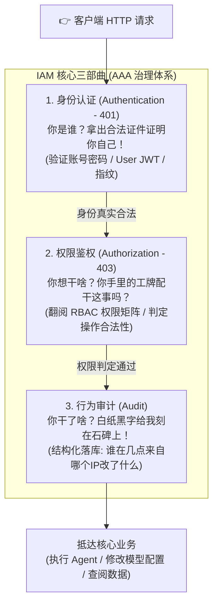
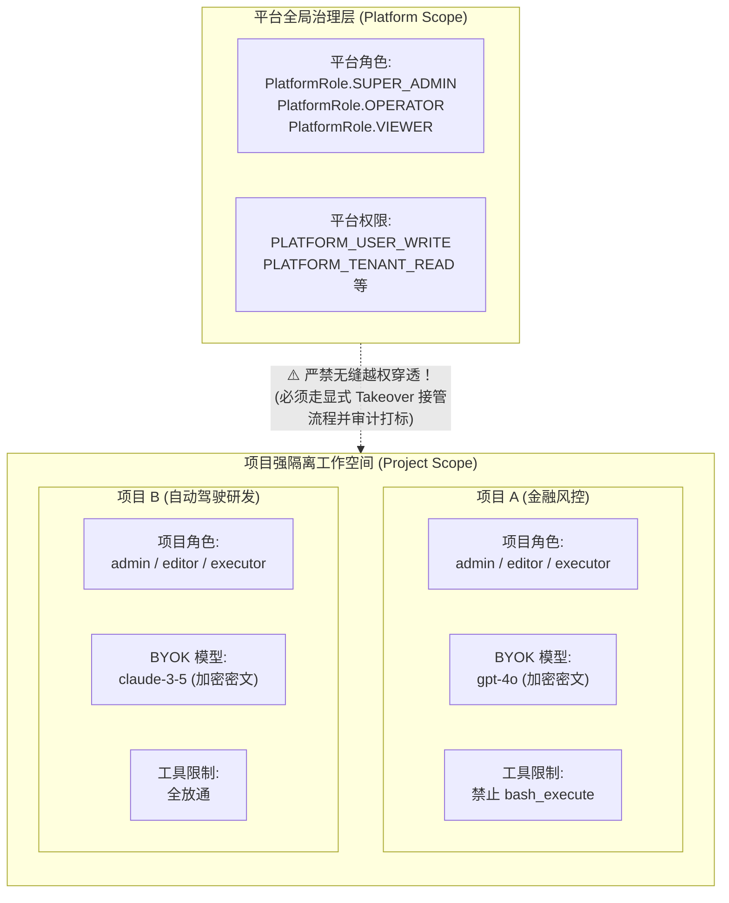

# 05-IAM 身份认证、双层 RBAC 与多租户安全治理深度透析 (IAM, Dual-Layer RBAC & Multi-Tenant Governance)

> **核心定位**：彻底扫除企业级安全治理的认知门槛——用人话拆解 **IAM（身份识别与访问管理）** 的底层逻辑。搞清楚为什么单靠 `is_admin` 会让系统死无葬身之地、RBAC（基于角色的访问控制）如何优雅解耦、平台角色与项目角色为什么必须物理切开、超管为什么绝不能随意越界，以及 AI 平台独有的 BYOK 密钥保全与工具级细粒度封禁治理。

---

## 一、 生活大白话演进史（不讲黑话讲人话）

### 1. 小区硬核保安的“哲学三连问”（AAA 体系）

在软件工程中，**IAM = Identity and Access Management（身份识别与访问管理）**。
别被这一长串英文缩写唬住了，它的本质就是高档小区的门禁保安系统。任何一个请求想要访问系统资源，IAM 永远在回答保安的**“哲学三连问”**（工业界统称 **AAA 体系**）：



1. **你是谁？—— 身份认证（Authentication，简称 AuthN，门禁卡）**
   - 你声称自己是张三，拿什么证明？密码、手机短信码，还是请求头带的 `Authorization: Bearer <User JWT>`？
   - 证明不了身份？当场一脚踹出去：**`401 Unauthorized`**！
2. **你想干啥？你配干吗？—— 权限鉴权（Authorization，简称 AuthZ，通行条）**
   - 证明你是张三了，但你想物理删除生产环境的核心 Agent（`thread-delete`），你有这个资格吗？
   - 查了权限表发现你只是个只读访客？当场亮红灯拦截：**`403 Forbidden`**！
3. **你干了什么？—— 行为审计（Audit，监控录像）**
   - 如果张三是管理员，真把 Agent 给删除了，系统必须自动把**“张三、在几点几分、来自哪个 IP、删了哪个 Thread”**结构化记入不可篡改的审计日志。
   - 发生安全事故时，合规审查员调取日志，白纸黑字谁也抵赖不了。

---

### 2. 为什么单靠 `is_admin` 布尔值在企业级会死得很惨？

初学者写玩具 Demo，数据库 `User` 表里通常就搞一个布尔字段：`is_admin: bool`。
每个接口内部到处充斥着胶水代码：
```python
if not current_user.is_admin:
    raise HTTPException(status_code=403, detail="必须是管理员才能操作！")
```

> 💥 **老王拍桌：这在真实企业级系统里纯属自杀行为！**

#### 真实企业环境有多残酷？
1. **跨部门越权灾难**：财务部有个 Admin，自动驾驶算法部也有个 Admin。如果只有一个全局 `is_admin`，财务部的 Admin 岂不是能直接登录自动驾驶项目，把核心算法代码和会话全清空了？
2. **职责分离（Separation of Duties）**：同一个敏捷小组内，张三负责调试 Prompt（开发者），李四负责财务审批（买 Token 充值），王五是实习生只能看报表。如果你直接给张三开全局 Admin，他就能乱花公款；给李四开 Admin，他就能乱改生产 Agent！
3. **临时工与最小权限原则（PoLP）**：外部顾问进驻两周做模型调优，他只需要单次执行权限，绝对禁止他导出全公司的私有会话数据。

**因此，企业级系统必须引入分层分级的正规权限模型！**

---

## 二、 20 行极简代码对立演示（Naive vs. Production）

### 1. 脆弱不堪的单体硬编码（反例：全局布尔与水平越权）

```python
# 典型反例：全局布尔值，无多租户隔离，漏洞百出
@router.delete("/projects/{project_id}/threads/{thread_id}")
async def naive_delete_thread(project_id: str, thread_id: str, current_user: User):
    # 💥 致命缺陷 1：全局粗暴判断，无法支撑部门级隔离
    if not current_user.is_admin:
        raise HTTPException(status_code=403, detail="Only admin can delete")

    # 💥 致命缺陷 2：IDOR 水平越权！根本没有校验 thread_id 是否真正属于该 project_id
    thread = db.query(Thread).filter_by(id=thread_id).first()
    db.delete(thread)
    # 攻击者遍历 thread_id 即可越权删除全公司其他项目的所有会话！
    return {"status": "deleted"}
```

---

### 2. 生产级解耦的 RBAC 权限引擎（正例：人 -> 角色 -> 权限码 + 作用域核验）

```python
# 生产级正例：基于权限码解耦，强制绑定项目作用域

class IamPolicyEngine:
    def __init__(self, permission_map: dict[PermissionCode, frozenset[ProjectRole]]):
        self.permission_map = permission_map

    def require(self, *, actor: ActorContext, permission: PermissionCode, project_id: str) -> None:
        # 1. 认证检查
        if not actor.is_authenticated:
            raise UnauthorizedError(code="not_authenticated", message="Login required")

        # 2. 项目作用域强核验：必须具备目标项目的具体角色套餐！
        user_roles = actor.get_project_roles(project_id)
        allowed_roles = self.permission_map.get(permission, frozenset())

        # 3. 角色与权限码解耦匹配
        if not any(role in allowed_roles for role in user_roles):
            raise ForbiddenError(code="missing_project_role", message=f"Need roles: {allowed_roles}")

# 业务视图使用：干净纯粹，无任何硬编码
@router.delete("/projects/{project_id}/threads/{thread_id}")
async def secure_delete_thread(project_id: str, thread_id: str, actor: ActorContext = Depends(get_actor)):
    # 权限引擎精准裁决：要求当前人具备目标项目的 PROJECT_RUNTIME_WRITE 权限
    iam_engine.require(actor=actor, permission=PermissionCode.PROJECT_RUNTIME_WRITE, project_id=project_id)
    # 仓储层强制带上 project_id 双重过滤，杜绝 IDOR
    thread_repo.delete(project_id=project_id, thread_id=thread_id)
    return {"status": "deleted"}
```

---

## 三、 本项目真实工程落地对照（Mapping to Real Codebase）

在当前企业级 Agent 平台中，IAM 不仅管理用户和项目，还深度治理**大模型私有密钥（BYOK）**与**智能体物理工具（Tools）**：



### 1. 核心架构设计一：双层 RBAC 引擎（平台级 vs 项目级）
- **源码坐标**：[modules/iam/application/policies.py](../../../apps/platform-api/src/platform_api/modules/iam/application/policies.py)
- **平台角色（`PlatformRole`）**：`super_admin`, `operator`, `viewer`。管基础设施（租户开户、用户注册、系统大盘）。
- **项目角色（`ProjectRole`）**：`admin`, `editor`, `executor`。管具体业务（会话、调试 Prompt、运行 Agent）。
- **铁律：超管不得无缝越界穿透！**
  平台超级管理员也不能直接偷看某保密项目的会话记录。如果发生线上严重 Bug 超管必须介入，**必须调用显式的接管接口（`takeover`），系统在审计日志中加盖鲜红大印记录“超管接管事件”**，确保合规可追溯！

---

### 2. 核心架构设计二：多租户物理级防越权（IDOR 绝缘）
- **中间件级守卫**：请求打入时，网关强校验 URL 中的 `/projects/{project_id}` 与请求头 `x-project-id` 必须一致；
- **仓储层（Repository）绝对隔离**：所有针对 `Thread`、`Run`、`Assistant` 的数据库 SQL 查询，必须强制注入 `WHERE project_id = :project_id`。即便攻击者猜到了其他项目的 UUID，也绝对查不出任何一条数据！

---

### 3. 核心架构设计三：BYOK（Bring Your Own Key）模型资产治理
- **源码坐标**：[modules/runtime_catalog/application/credentials.py](../../../apps/platform-api/src/platform_api/modules/runtime_catalog/application/credentials.py)
- 企业各部门采购的大模型 Key 极度昂贵且敏感：
  1. **主密钥对称加密**：使用平台配置的 Fernet 主密钥对 API Key 进行强加密，**数据库中只持久化密文字符串，严禁存明文**；
  2. **对外显示完全脱敏**：前端控制台调用查询接口时，返回的永远是带掩码的字符串（如 `sk-proj-****a89c`）；
  3. **内存生命周期收敛**：只有用户发起 `run.start` 时，控制面在内存中现场解密，注入由平台签发的高防 Delegation JWT 中传给下游沙箱，任务执行完毕后内存自动回收，绝不落盘！

---

### 4. 核心架构设计四：工具级动态覆盖治理（Tool Restrictions）
- **源码坐标**：[modules/runtime_policies/application/service.py](../../../apps/platform-api/src/platform_api/modules/runtime_policies/application/service.py)
- 不仅管“人能不能进项目”，还管“人能不能在会话里用特定螺丝刀”：
  - 管理员在 `RuntimeToolRestrictionRecord` 表中登记禁用项；
  - 动态签发时生成 `tool_overrides = {"bash_execute": False}`（只减不增原则）；
  - 单个图执行绑定的工具禁用字典，条目上限 128 条，紧凑 JSON 预算上限 4096 字节，防止超大请求头引发 DoS 炸弹。

---

### 5. 源码物理坐标映射与核心类清单

| 治理职责 | 真实物理文件坐标 | 核心类 / 函数 / 映射 | 核心职责说明 |
|---|---|---|---|
| **权限码声明** | [modules/iam/application/policies.py](../../../apps/platform-api/src/platform_api/modules/iam/application/policies.py) | `PermissionCode` | 声明 32 个原子权限枚举（如 `PROJECT_RUNTIME_EXECUTE`） |
| **RBAC 映射矩阵** | [modules/iam/application/policies.py](../../../apps/platform-api/src/platform_api/modules/iam/application/policies.py) | `PLATFORM_PERMISSION_MAP`<br>`PROJECT_PERMISSION_MAP` | 静态声明角色与权限码的绑定关系 |
| **策略裁决引擎** | [modules/iam/application/policies.py](../../../apps/platform-api/src/platform_api/modules/iam/application/policies.py) | `IamPolicyEngine.evaluate()`<br>`IamPolicyEngine.require()` | 执行双层权限判定，输出显式决策原因（`PolicyReason`） |
| **BYOK 加密** | [modules/runtime_catalog/application/credentials.py](../../../apps/platform-api/src/platform_api/modules/runtime_catalog/application/credentials.py) | `encrypt_api_key()`<br>`decrypt_api_key()` | 基于 Fernet 对称加密算法实现模型凭据密文存储 |
| **审计拦截器** | [entrypoints/http/middleware/audit_log.py](../../../apps/platform-api/src/platform_api/entrypoints/http/middleware/audit_log.py) | `AuditLogMiddleware` | 洋葱圈中间件捕获请求者身份、响应状态码与脱敏上下文 |

---

## 四、 老王灵魂拷问（思考题与自测问答）

### 拷问 1：为什么我们不直接用开源的 Casbin 或复杂的 ABAC（基于属性的访问控制），非要自己写双层 RBAC？
> 💥 **老王答**：
> 遵循 **KISS（简单至上）与 YAGNI（别想太多）原则**！
> 引入重量级权限框架（如 Casbin 或 OPA）需要引入额外的 DSL 语法解析器、甚至独立的守护进程，不仅拖慢网关响应耗时，而且极大增加了二开门槛与排错难度。
> 本平台的业务边界非常清晰：只有“全局平台”和“隔离项目”两层。用原生的 Python `Enum` 和 `frozenset` 查表匹配，执行耗时在微秒级（`0.01ms`），零第三方外部依赖，没有任何黑魔法，改代码时一眼见底！

### 拷问 2：如果数据库被黑客脱裤（全量导出 SQL），我们存储的那些企业大模型 API Key 会泄露吗？
> 💥 **老王答**：
> **绝对泄露不了！**
> 因为数据库里存的全部是形如 `gAAAAABm...` 的 Fernet 密文字符串！
> 只要你把主加密密钥（`PLATFORM_CREDENTIAL_MASTER_KEY`）配置在宿主机环境变量或企业 KMS（密钥管理系统）中，不跟数据库备份文件放在一起，黑客拿到数据库也是干瞪眼，连一个明文字符都还原不出来！
