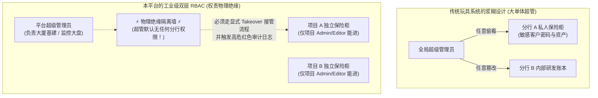
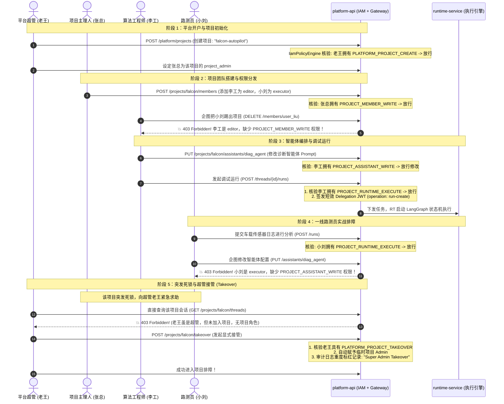

# 06-双层 RBAC 权限引擎设计与端到端实战推演 (Dual-Layer RBAC Architecture & End-to-End Simulation)

> **核心定位**：彻底拆解平台核心的 **双层 RBAC（基于角色的访问控制）权限引擎**。从第一性原理分析为什么必须物理切开平台级与项目级、用原生集合交集实现 0.01ms 无库 IO 极速裁决、32 项原子权限码全量字典，以及通过大型车企“猎鹰智航”的真实项目案例，从开户、成员管理、智能体调试、路测员对话到超管接管（Takeover），端到端时序还原真实业务落地。

---

## 一、 生活大白话演进史（不讲黑话讲人话）

### 1. 银行总行长与支行私人保险柜的隐喻

很多开发者在设计权限系统时，脑子里只认一种人：“超级管理员（Super Admin）”。觉得超管就是无所不能的神，系统里所有的表、所有的接口超管都能随便调。



用现实生活打个比方：
- **银行大楼的保卫总监（平台角色 `PlatformRole`）**：
  负责整栋银行大厦的消防安全、开门关门、电梯运行、工牌发放。
- **某支行的 VIP 客户私人保险柜（项目角色 `ProjectRole`）**：
  客户将自己的商业秘密存入保险箱，钥匙只有支行行长（`ProjectRole.ADMIN`）和客户自己拥有。
- **核心安全红线**：
  保卫总监不能因为自己管整栋楼，就半夜拿着电锯去切开 VIP 客户的私人保险柜！
  如果保险箱突发火警总监必须破门介入，**必须走极其严苛的“紧急接管（Takeover）”审批程序，并在全行监控室记录大红标记！**

---

### 2. 传统权限硬编码的“扩展性火葬场”

初级工程师写业务代码，最喜欢直接判断角色：
```python
# 典型灾难反例：到处硬编码角色字符串
if user.role == "project_admin" or user.role == "project_editor":
    allow_action()
```
**生产痛点**：
半年后，公司业务扩张，新增了一个“算法调试员”或“外包审核员”角色。
这时候程序员就要去翻全系统 200 个接口，一个一个去改 `if user.role in [...]`，只要漏掉一个，要么权限泄露，要么线上 500 报错崩溃！

#### 工业级解法：三层解耦（人 -> 角色 -> 权限码）
- **原子权限码（PermissionCode）**：系统里最细的不可分割的钥匙（比如 `PROJECT_RUNTIME_EXECUTE`、`PROJECT_MEMBER_WRITE`）。
- **角色（Role）**：权限钥匙串的包装盒（比如 `ProjectRole.EDITOR` 套餐包）。
- **主体（Actor）**：当前请求的操作人。
**业务代码（Router / Service）永远只认“权限码”，绝不直接判断角色！以后无论怎么增加新角色，业务逻辑一行代码都不需要改！**

---

## 二、 20 行极简代码对立演示（Naive vs. Production）

### 1. 随手写出来的灾难代码（反例：角色与业务强耦合）

```python
# 典型反例：业务代码中硬编码角色，混淆平台与项目边界
@router.post("/projects/{project_id}/assistants")
async def create_assistant(project_id: str, payload: dict, user: User = Depends(get_current_user)):
    # 💥 致命缺陷 1：直接拿角色字符串硬编码，新增角色直接火葬场
    if user.platform_role != "super_admin" and user.project_role != "admin" and user.project_role != "editor":
        raise HTTPException(status_code=403, detail="No permission")

    # 💥 致命缺陷 2：缺少 project_id 边界核验，超管直接被判定为通过，造成跨租户穿透污染
    return await assistant_service.create(project_id, payload)
```

---

### 2. 平台核心高保真实现（正例：双层解耦 + 集合交集秒级判定）

```python
# 生产级正例：基于原生 frozenset 查表，零数据库 IO，微秒级极速裁决

class IamPolicyEngine:
    def __init__(self, platform_map: dict, project_map: dict):
        self._platform_map = platform_map
        self._project_map = project_map

    def evaluate(self, *, actor: ActorContext, authorization: AuthorizationRequest) -> PolicyDecision:
        if not actor.is_authenticated:
            return PolicyDecision(allowed=False, reason=PolicyReason.NOT_AUTHENTICATED)

        permission = authorization.permission

        # 1. 项目级权限裁决：强制绑定 project_id 作用域！
        if permission in self._project_map:
            if not authorization.project_id:
                return PolicyDecision(allowed=False, reason=PolicyReason.PROJECT_SCOPE_REQUIRED)

            # 获取用户在目标项目的角色集合 (如 {"project_editor"})
            user_roles = actor.project_role_set(authorization.project_id)
            required_roles = self._project_map[permission]

            # 原生集合交集匹配：只要命中允许角色之一，瞬间放行！
            if any(role in required_roles for role in user_roles):
                return PolicyDecision(allowed=True, reason=PolicyReason.PROJECT_ROLE_ALLOWED)
            # 否则一律 403 阻断 (哪怕是平台超管，没加入该项目也绝对进不来！)
            return PolicyDecision(allowed=False, reason=PolicyReason.MISSING_PROJECT_ROLE)

        # 2. 平台级权限裁决
        if permission in self._platform_map:
            if actor.has_platform_role(PlatformRole.SUPER_ADMIN.value):
                return PolicyDecision(allowed=True, reason=PolicyReason.PLATFORM_SUPER_ADMIN)

            required_roles = self._platform_map[permission]
            if any(role in required_roles for role in actor.platform_roles):
                return PolicyDecision(allowed=True, reason=PolicyReason.PLATFORM_ROLE_ALLOWED)
            return PolicyDecision(allowed=False, reason=PolicyReason.MISSING_PLATFORM_ROLE)

        return PolicyDecision(allowed=False, reason=PolicyReason.PERMISSION_NOT_REGISTERED)
```

---

## 三、 本项目真实工程落地对照（Mapping to Real Codebase）

### 1. 双层角色模型与 32 项细粒度权限码全景速查表

源码坐标：
- [domain/roles.py](../../../apps/platform-api/src/platform_api/modules/iam/domain/roles.py)
- [application/policies.py](../../../apps/platform-api/src/platform_api/modules/iam/application/policies.py)

#### ① 平台层（3 大全局角色 + 22 项平台权限码）
管辖范围：租户开户、用户生命周期、全局基础设施、机器服务账号（Service Account）：

| 权限分类 | 权限码枚举 (`PermissionCode`) | 允许的角色 (`PLATFORM_PERMISSION_MAP`) | 核心功能说明 |
| :--- | :--- | :--- | :--- |
| **用户治理** | `PLATFORM_USER_READ`<br>`PLATFORM_USER_WRITE`<br>`PLATFORM_USER_CREATE`<br>`PLATFORM_USER_STATUS_WRITE`<br>`PLATFORM_USER_CREDENTIAL_RESET`<br>`PLATFORM_USER_ROLE_WRITE` | SUPER_ADMIN / OPERATOR<br>*(重置密码与改角色仅 SUPER_ADMIN)* | 用户列表查看、禁用/启用员工、重置初始密码、晋升或降级平台角色。 |
| **项目治理** | `PLATFORM_PROJECT_READ`<br>`PLATFORM_PROJECT_CREATE`<br>`PLATFORM_PROJECT_WRITE`<br>`PLATFORM_PROJECT_TAKEOVER` | SUPER_ADMIN<br>*(读权限包含 OPERATOR/VIEWER)* | 创建独立隔离项目、冻结违规项目、以及**超管紧急故障接管（TAKEOVER）**。 |
| **全局模型** | `PLATFORM_MODEL_READ`<br>`PLATFORM_MODEL_WRITE`<br>`PLATFORM_CATALOG_REFRESH` | SUPER_ADMIN / OPERATOR | 管理平台中心化模型目录、触发动态资产热刷新（Catalog Refresh）。 |
| **基础设施** | `PLATFORM_AUDIT_READ`<br>`PLATFORM_CONFIG_READ`<br>`PLATFORM_CONFIG_WRITE`<br>`PLATFORM_ANNOUNCEMENT_WRITE` | SUPER_ADMIN / OPERATOR<br>*(读权限包含 VIEWER)* | 全局审计日志排查、全站环境变量配置、发布顶部系统停机维护公告。 |
| **机器账号** | `PLATFORM_SERVICE_ACCOUNT_READ`<br>`PLATFORM_SERVICE_ACCOUNT_WRITE`<br>`PLATFORM_SERVICE_ACCOUNT_GRANT_WRITE` | SUPER_ADMIN / OPERATOR<br>*(授权仅 SUPER_ADMIN)* | 为 CI/CD 流水线或外部自动化脚本签发机器凭证（M2M Token）。 |

---

#### ② 项目层（3 大隔离角色 + 10 项项目权限码）
管辖范围：项目内部的智能体资产、对话会话、工作空间与运行时安全：

| 权限码枚举 (`PermissionCode`) | ADMIN (主理人) | EDITOR (开发者) | EXECUTOR (业务人员) | 核心功能与边界约束 |
| :--- | :---: | :---: | :---: | :--- |
| **`PROJECT_MEMBER_READ`** | ✅ | ✅ | ✅ | 查看项目成员列表与各自角色。 |
| **`PROJECT_MEMBER_WRITE`** | ✅ | ❌ | ❌ | **主理人专属特权**：添加新成员、修改项目内角色、将人员踢出项目。 |
| **`PROJECT_ASSISTANT_READ`** | ✅ | ✅ | ✅ | 查看项目内已编排的智能体列表及其元数据。 |
| **`PROJECT_ASSISTANT_WRITE`** | ✅ | ✅ | ❌ | 创建新智能体、修改 Prompt、配置工作模式（Flash/Pro/Ultra）。 |
| **`PROJECT_RUNTIME_EXECUTE`**| ✅ | ✅ | ✅ | **核心业务执行**：发起会话对话、向智能体发送 Prompt 指令。 |
| **`PROJECT_RUNTIME_READ`** | ✅ | ✅ | ✅ | 读取历史对话会话快照、回放子智能体工具调用轨迹。 |
| **`PROJECT_RUNTIME_WRITE`** | ✅ | ❌ | ❌ | **安全合规特权**：在策略中心为特定用户/项目禁用高危工具。 |
| **`PROJECT_AUDIT_READ`** | ✅ | ✅ | ❌ | 查看项目内部的操作审计流（谁何时修改了 Prompt、谁发起了执行）。 |
| **`PROJECT_ANNOUNCEMENT_READ`**| ✅ | ✅ | ✅ | 查看项目内部置顶通知。 |
| **`PROJECT_ANNOUNCEMENT_WRITE`**| ✅ | ✅ | ❌ | 发布/下架项目级置顶公告。 |

---

### 2. 强隔离不变量与“超管接管（Takeover）”机制

#### 为什么超管必须被挡在项目门外？
- **现实场景**：银行或医疗系统中的 Agent 会话包含患者病历或高管薪资。如果一个平台运维人员拥有超管角色，就能在前端直接打开“CEO 会话记录”，系统将彻底丧失商业机密保密性。
- **代码实现**：
  在 `IamPolicyEngine.evaluate()` 中，当请求属于 `PROJECT_PERMISSION_MAP` 时：
  ```python
  actor_roles = actor.project_role_set(authorization.project_id)
  ```
  引擎只看该用户在目标项目中的成员角色。**超管如果未被项目 Admin 邀请加入该项目，`actor_roles` 就是空集合，当场抛出 `403 Forbidden (missing_project_role)`！**

#### 紧急排障时的合法通道：显式接管（Takeover）
- 如果项目内唯一的主理人突然离职且未移交权限，或者发生重大死锁，平台超管可以调用专属端点：
  `POST /api/v1/projects/{project_id}/takeover`
- **接管流程**：
  1. 权限引擎校验当前人具有平台级 `PLATFORM_PROJECT_TAKEOVER` 权限；
  2. 系统通过事务在数据库 `project_members` 表中自动插入一条具有有效期的超管项目管理员记录；
  3. **审计日志以极高优先级标红落库**：记录“超级管理员老王于 2026-09-30 08:30 执行了强制接管，原因：主理人离职排障”；
  4. 超管方可进入该项目排查故障。

---

### 3. 实战业务全景推演：某车企“猎鹰智航”全生命周期推演

为了让你彻底看清这套 RBAC 在实际业务中是怎么跑通的，我们推演一个真实的企业级落地场景：

#### ① 角色出场阵容：
- **老王（平台超管 `PlatformRole.SUPER_ADMIN`）**：负责平台底座稳定性；
- **张总（项目主理人 `ProjectRole.ADMIN`）**：自动驾驶研发部总监；
- **李工（算法工程师 `ProjectRole.EDITOR`）**：负责调教诊断智能体 DearFlow Agent；
- **小刘（实车路测员 `ProjectRole.EXECUTOR`）**：在试车场拿着平板与智能体交互排障。



---

### 4. 源码物理坐标映射表

| 模块职责 | 核心源码物理路径 | 关键类 / 函数 / 映射 | 核心职责说明 |
|---|---|---|---|
| **角色枚举** | [domain/roles.py](../../../apps/platform-api/src/platform_api/modules/iam/domain/roles.py) | `PlatformRole`<br>`ProjectRole` | 声明两级角色名称及其数据库存储转换规则 |
| **权限码定义** | [application/policies.py](../../../apps/platform-api/src/platform_api/modules/iam/application/policies.py) | `PermissionCode` | 声明 32 项细粒度权限码枚举 |
| **静态矩阵映射** | [application/policies.py](../../../apps/platform-api/src/platform_api/modules/iam/application/policies.py) | `PLATFORM_PERMISSION_MAP`<br>`PROJECT_PERMISSION_MAP` | 权限码与合法角色的不可变集合映射关系 |
| **判定裁决引擎** | [application/policies.py](../../../apps/platform-api/src/platform_api/modules/iam/application/policies.py) | `IamPolicyEngine.evaluate()`<br>`IamPolicyEngine.require()` | 执行双层权限裁决，提供精准的拒绝原因码 |
| **执行上下文承载** | [core/context/models.py](../../../apps/platform-api/src/platform_api/core/context/models.py) | `ActorContext.project_roles` | 维护当前操作人按项目划分的角色映射字典 |
| **项目接管服务** | [modules/projects/service.py](../../../apps/platform-api/src/platform_api/modules/projects/service.py) | `ProjectsService.takeover_project()` | 实现超级管理员显式接管项目与审计落盘 |

---

## 四、 老王灵魂拷问（思考题与自测问答）

### 拷问 1：如果未来系统要新增一个“财务审计员（Project Auditor）”角色，我们该如何平滑升级？
> 💥 **老王答**：
> 这就是我们基于权限码解耦的极致魅力！
> 1. 在 `domain/roles.py` 中向 `ProjectRole` 枚举添加 `AUDITOR = "project_auditor"`；
> 2. 在 `application/policies.py` 的 `PROJECT_PERMISSION_MAP` 中，将 `AUDITOR` 加入到 `PROJECT_AUDIT_READ`、`PROJECT_MEMBER_READ` 等只读权限集合中；
> 3. **全系统所有的 Router 和 Service 代码一行都不用改！** 业务逻辑永远只认权限码，新增角色 5 分钟优雅落地！

### 拷问 2：为什么 `ActorContext` 内部的 `project_roles` 设计成 `Mapping[str, tuple[str, ...]]` 字典？
> 💥 **老王答**：
> 因为在真实的企业里，一个人可以同时属于多个不同的项目组，并且在不同项目中的职责完全不同！
> 张三在【金融项目】里是负责把关的核心主理人（`admin`），但在【自动驾驶项目】里他只是一个使用工具排障的一般测试员（`executor`）。
> 字典结构 `{ "proj-finance": ("admin",), "proj-autopilot": ("executor",) }` 保证了同一用户在不同项目边界内拥有完全独立、互不干扰的权限上下文。

### 拷问 3：为什么业务路由里面绝不直接调用 `evaluate()`，而总是调用 `require()`？
> 💥 **老王答**：
> `evaluate()` 返回的是一个包含布尔值和原因码的不可变对象 `PolicyDecision`，用于复杂的自定义判定或前端权限状态查询；
> 而在接口守卫中，调用 `require()` 可以在权限不足时**自动抛出结构严格统一的领域异常**（`401 NotAuthenticatedError`、`400 BadRequestError(project_scope_required)`、`403 ForbiddenError(missing_project_role)`），省去了上百处重复的 `if not decision.allowed: raise ...` 样板胶水代码，代码简洁度拉满！
