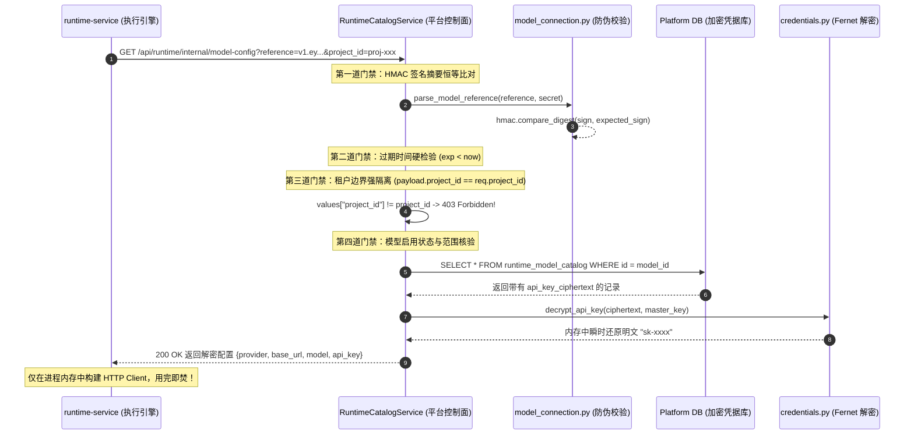

# 07-大模型凭据零信任治理与不透明临时引用票据 (Opaque Reference Token Deep Dive)

> **模块定位与核心价值**：深入解密平台如何通过 Fernet 对称加密、HMAC 防篡改签名与“不透明临时引用票据”（Opaque Reference Token），在多租户与跨微服务通信中实现大模型商业凭证（API Key）的“零明文暴露、零持久缓存、单次用完即焚”零信任治理体系。

---

## 零、痛点与生活演进史（Why Opaque Token?）

在企业级智能体平台中，大模型 API Key（不管是 OpenAI、Claude 还是企业自建的 DeepSeek）就是白花花的真金白银。一个带高额配额的 Key 一旦泄露，黑客能在几小时内通过脚本刷爆几十万调用账单，甚至拖垮企业的生产业务。

在跨微服务架构（`platform-web` -> `platform-api` -> `runtime-service`）中，大模型凭证的传递经历了四个血泪演进阶段：

```
[阶段一: 裸传现金]      客户端/网关在 HTTP 请求体中裸传明文 "sk-xxxx" -> 网络抓包或日志打印直接破产
        ↓
[阶段二: 共享大锅饭]    全平台写死同一个官方 Key -> 无法核算部门成本，一人违规全员连坐封号
        ↓
[阶段三: 裸传静态 ID]   网关向下游仅传 model_id="uuid-123" -> 攻击者改包撞库越权偷用他人专属模型 (IDOR)
        ↓
[阶段四: 不透明临时票据] 网关下发防伪加盐短命凭条 (Opaque Reference) -> 运行时即时验签兑换，用完即焚！
```

### 生活大白话类比：高档洗浴中心的“一次性防伪储物凭条”
1. **愚蠢的原型（裸传现金）**：去洗浴中心洗澡，把 10 万块现金塞在浴袍口袋里到处晃悠。搓澡工、服务员、隔壁老王谁都能顺手牵羊（明文透传 API Key，日志一打全公司都知道）。
2. **进阶的漏洞（裸手牌撞库）**：前台给每个柜子贴个固定号码（如 888 号），你进浴室只要报“我是 888 号”就能开柜子。黑客随口报个 888 号，直接把你的贵重物品洗劫一空（裸传 `model_id`，缺乏所有权与租户签名校验）。
3. **本平台的工业实现（不透明临时票据）**：前台（`platform-api`）把你锁进带防伪密码锁的贵重保险柜（Fernet 加密落库）。当你去泡澡（发起对话推理）时，前台只给你一张**打印了防伪暗号（HMAC-SHA256 签名）、盖了当前时间戳、且绑定了你本人身份证号和包厢号（`project_id` / `actor`）的一次性纸条**。
   - 纸条上**没有任何你的密码或现金**（Opaque 不透明）；
   - 纸条只有 **60 秒寿命**，过期作废（超短 TTL）；
   - 当技师（`runtime-service`）拿着这张纸条回前台取料时，前台验明暗号真伪、核对包厢号无误后，把材料倒进搅拌机，**绝不把钥匙交给技师，用完立刻洗锅**！

---

## 一、对立视角：简易原型 vs 生产架构（Naive vs Production）

### 1. 20 行极简代码对立：你能找出左侧的致命漏洞吗？

```python
# ==================== ❌ 简易原型 (Naive Demo: 玩具做法) ====================
# 漏洞点 1：API Key 明文裸存数据库，网关查询直接返回
# 漏洞点 2：向下游发起 Run 时直接透传明文或裸 model_id
@app.post("/runs/start")
def naive_run_start(model_id: str, prompt: str):
    model = db.query("SELECT * FROM models WHERE id = ?", model_id)
    # 💥 致命伤：明文 API Key 在内部网络裸奔，下游日志一旦抓取全盘泄露！
    # 💥 致命伤：黑客随便传一个不属于自己的 model_id 就能越权调用（IDOR 漏洞）
    httpx.post("http://runtime-service/invoke", json={
        "api_key": model["api_key"],
        "prompt": prompt
    })

# ==================== ✅ 生产级实现 (Production: 本平台实现) ====================
# 优势 1：明文 Key 经 Fernet 加密落库，对前端与外部 API 连根毛都不露
# 优势 2：向下游仅下发带 HMAC-SHA256 签名且强绑定 project_id 的 60s 短命票据
def production_run_start(actor: ActorContext, project_id: str, model_id: str):
    # 1. 校验项目资产归属权
    verify_project_model_access(actor, project_id, model_id)
    # 2. 铸造 60s 防伪不透明临时票据（不含任何明文 Key！）
    ref_token = create_model_reference(
        project_id=project_id,
        model_id=model_id,
        secret=settings.runtime_model_config_secret,
        ttl_seconds=60, # 60秒用完即焚
    )
    # 3. 仅下发临时票据暗号，下游运行时凭票据回换瞬时内存配置
    return {"model_reference": ref_token}
```

---

## 二、真实工程代码全景剖析（Real Engineering Code Map）

整个大模型凭据零信任治理体系，由三个核心文件构筑成一道无法逾越的“铁壁”：

```
apps/platform-api/src/platform_api/modules/runtime_catalog/
├── application/
│   ├── credentials.py       # 1. Fernet 对称加密核心：明文绝对不出控制面
│   ├── model_connection.py  # 2. 不透明临时票据核心：HMAC 签名、打包与解析校验
│   └── service.py           # 3. 兑换服务中枢：租户强核验与瞬时解密下发
```

### 1. 资产落库：Fernet 对称加密与外部字段物理抹除

- **源码坐标**：[credentials.py](../../../../../apps/platform-api/src/platform_api/modules/runtime_catalog/application/credentials.py)
- **底层算法**：采用基于 AES-128-CBC 与 HMAC-SHA256 的工业级 Fernet 对称加密套件。
- **物理抹除契约**：
  在模型持久化实体 [`RuntimeCatalogModelRecord`](../../../../../apps/platform-api/src/platform_api/modules/runtime_catalog/infra/sqlalchemy/models.py) 中，字段名为 `api_key_ciphertext`。
  而在对外暴露的领域传输模型 [`RuntimeModelCatalogItem`](../../../../../apps/platform-api/src/platform_api/modules/runtime_catalog/domain/models.py) 中，**直接剔除了 `api_key` 属性**，仅仅暴露：
  ```python
  credential_configured: bool = bool(encrypted_key)
  ```
  外部管理员或前端界面只能看到“已配置 / 未配置”的布尔状态，无论怎么抓包，响应体里绝无任何密文或明文字符串。

---

### 2. 票据结构：HMAC-SHA256 签名与防篡改封装

- **源码坐标**：[model_connection.py](../../../../../apps/platform-api/src/platform_api/modules/runtime_catalog/application/model_connection.py#L50-L75)
- **票据组装机制（`create_model_reference`）**：
  当网关准备将执行流派发至下游时，调用该函数生成单次票据。它将关键上下文打包并生成结构：
  ```text
  v1.{base64_urlsafe_payload}.{hmac_sha256_hex_digest}
  ```

#### 真实 Payload 载荷透视：
```json
{
  "v": 1,
  "project_id": "proj-90f1ac23-4567-89ab-cdef01234567",
  "model_id": "mod-789a-bcde-f012-3456789abcde",
  "actor": {"user_id": "usr-123", "role": "editor"},
  "thread_id": "th-abc-456",
  "thread_action": "comment",
  "exp": 1727685600,
  "nonce": "X7k9P_2mQ1wZ"
}
```

- **防重放与防碰撞（Nonce & Short TTL）**：
  `nonce` 是使用密码学安全随机源生成的 12 字符随机串（`secrets.token_urlsafe(12)`）；`exp` 严格限制在 `10s ~ 300s` 之间（默认 60s）。这意味着就算攻击者在同一秒内监听到了相同的请求，生成的票据签名也完全不同，且 60 秒后直接自然死亡。

---

### 3. 瞬时兑换：四重门禁与内存即时还原

下游 `runtime-service` 拿到票据后，在初始化大模型连接池（如 `ChatOpenAI` 或 `ChatAnthropic`）的微秒前，必须向控制面安全内部端点发起兑换：



- **恒定时间比对（Constant-Time Digest）**：
  在验签时，代码严格使用 `hmac.compare_digest(signature, _signature(payload, secret))`，杜绝利用 CPU 缓存时序差异推测密钥的侧信道时序攻击（Timing Attack）。
- **租户锁死（Tenant Locking）**：
  代码显式比对：
  ```python
  if values["project_id"] != project_id:
      raise ForbiddenError(code="runtime_model_reference_denied", message="Model reference project mismatch")
  ```
  攻击者即使偷到了项目 A 的模型票据，试图在项目 B 的会话中兑换，会被当场以 403 阻断并触发安全告警。

---

## 三、老王灵魂拷问与工业级避坑指南（Engineering Reality）

### ❓ 灵魂拷问 1：既然解密这么麻烦，为什么不在 Redis 里加一层缓存，解密一次管 24 小时？

> **老王怒喷**：艹！哪个憨批教你在 Redis 里明文缓存企业 API Key 的？
> 1. **内存泄露与攻防面扩大**：Redis 通常是多服务共享的缓存基础设施。一旦 Redis 被开发人员随手开了一个未授权访问端口、或者运维做 RDB 持久化时 dump 到了公网备份盘，你全公司的几百个大模型商业 Key 就直接给全网黑客发福利了！
> 2. **多租户合规死线**：金融与车企客户的安全合规审计中有死命令——**核心商业凭证在除加密持久层与执行核瞬时内存之外，绝对禁止在任何外部共享中间件中留痕**。
> 3. **性能伪需求**：LangGraph 执行长任务推理本身耗时在数秒到数十秒，而单次 Fernet 本地对称解密仅需 **0.05 毫秒**，为了这 0.05ms 把系统安全底裤脱掉，纯属因小失大的脑残设计！

---

### ❓ 灵魂拷问 2：为什么不直接用标准的 JWT，非要自己拼一个 `v1.{payload}.{signature}`？

> **老王答疑**：乖乖，很多新手架构师有“标准强迫症”，什么地方都非要硬套一个三方的 PyJWT 库。
> 1. **零第三方依赖与纳秒级性能**：`model_connection.py` 纯用 Python 标准库的 `base64`, `json`, `hmac`, `hashlib` 实现，没有任何外部 pip 依赖包。在极高频的网关流转中，打包与解包耗时几乎是完整 JWT 库的 1/5。
> 2. **避免算法替换漏洞（Algorithm Confusion Attack）**：标准 JWT 头部带有 `alg` 字段，历史上发生过无数次黑客把 `RS256` 篡改成 `none` 或 `HS256` 导致公钥变密钥的签名伪造大漏洞。我们这种定制的紧凑结构**硬编码且唯一绑定 HMAC-SHA256**，没有任何给攻击者协商算法的漏洞空间！

---

### ❓ 灵魂拷问 3：如果平台主密钥 `MODEL_CONFIG_MASTER_KEY` 泄露了需要轮换（Rotation），历史模型凭据会瞬间死锁吗？

> **老王避坑指南**：
> 生产环境下必须支持**密钥平滑轮换（Key Rotation）**：
> - `Fernet` 原生支持 `MultiFernet([Fernet(new_key), Fernet(old_key)])`；
> - 轮换时，新配置写入使用 `new_key` 加密；解密时若 `new_key` 解不开，自动 fallback 尝试 `old_key` 解密；
> - 配合后台离线脚本逐条重写数据库字段完成平滑迁移，业务调用全链路零停机、零报错！

---

## 四、架构不变量清单（Architectural Invariants）

1. **凭证非对称可见性不变量**：对外暴露的模型列表与详情实体中，绝对禁止出现明文 API Key 字段；仅允许存在 `credential_configured: bool` 标识。
2. **凭据单向单次流转不变量**：跨微服务派发任务时，仅允许下发携带 HMAC 签名与租户绑定的短命 Opaque Reference Token；严禁在普通 RPC 或 HTTP 请求体中裸传真实 API Key。
3. **零共享持久化不变量**：解密还原出的明文 API Key 仅准许驻留在执行节点运行时的当前进程栈内存中；严禁将其写入持久化日志、消息队列、Redis 或客户端响应报文。
