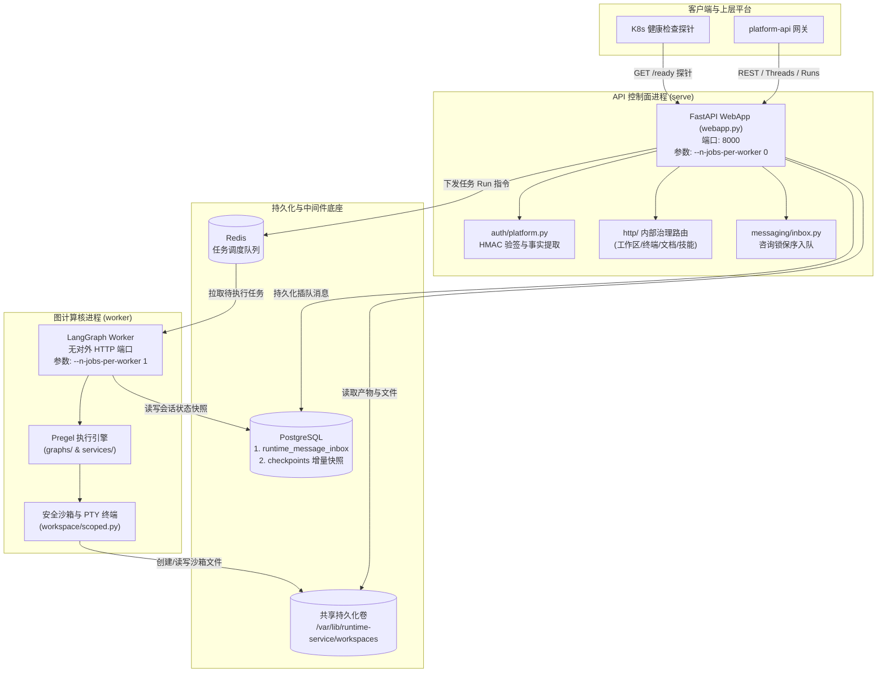
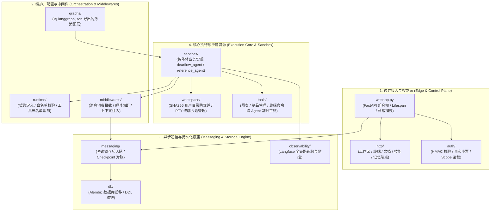
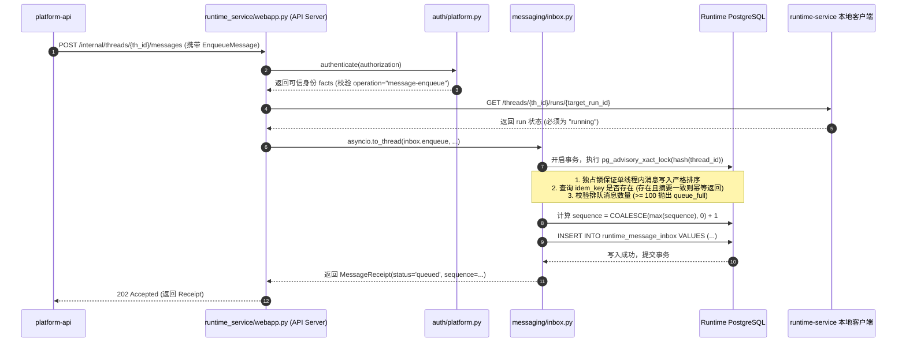

# 01-运行时双进程架构与全景模块解密 (Runtime Dual-Process & Modular Architecture)

## 模块定位与核心价值

`apps/runtime-service` 是整个 AI Agent 平台的最底层心脏。它不处理任何上层花里胡哨的租户账号、计费、控制台页面，它唯一的使命就是：**高并发、高可靠、物理隔离地承载 LangGraph 编译出的计算图（Pregel Execution Engine）、多模态沙箱工作区、伪终端控制台（PTY Terminals）以及后台异步通信收件箱（MessageInbox Engine）。**

很多刚入行的初学者写 Agent 平台，脑子里只有玩具思维：起一个单进程单线程的 FastAPI，把接收用户 HTTP 请求、调用大模型推理（耗时几十秒）、跑沙箱代码、写磁盘全部塞在同一个进程的同一个 `asyncio` 事件循环（Event Loop）里。
**艹，这种玩具代码放到生产环境不出 5 分钟就得被 Kubernetes 的健康检查探针直接掐死，或者一个 OOM 就让全平台几千个正在聊天的用户全部断连！**

为了彻底根除这些低级死穴，`runtime-service` 在物理架构与代码架构上执行了坚决的**解耦原则**：
1. **控制面与计算核物理双进程彻底切分**：`API Server`（对外暴露端口，`--n-jobs-per-worker 0`，强行禁止接计算任务，纯 I/O 与 HTTP 代理）与 `Worker`（无对外端口，`--n-jobs-per-worker 1`，纯后台拉取任务执行耗时图计算与沙箱代码）物理隔离运行在不同容器或独立进程中。
2. **12 大核心子模块单一职责划分**：从入口鉴权验签、安全配置解析与黑白名单、工作区防穿透隔离，到声明式图装配与旗舰 Agent 状态机，每一层边界清晰，严禁职责越界。
3. **高可靠异步消息收件箱（MessageInbox Engine）**：基于 PostgreSQL 咨询锁（Advisory Lock）与行级事务锁，在 Agent 长周期执行（如 Deep Research 耗时数分钟）过程中，允许外部系统以绝对有序、幂等且掉电不丢的方式向正在运行的 Run 实时追加指令。

---

## 零、知识前置与上下文串联（Knowledge Bridges）

### 1. 认知输入（前置模块输入）
- 依赖 [04-platform-api/02-runtime-gateway.md](../04-platform-api/02-runtime-gateway.md)：明确上层网关如何通过 `with_forwarded_headers` 注入 Delegation JWT，并将请求分发至 `runtime-service` 的 `/threads/...` 端点。
- 依赖 [02-cross-cutting/05-data-isolation.md](../02-cross-cutting/05-data-isolation.md)：明确运行时数据库（Runtime DB）的物理边界，其拥有独立的 `runtime_message_inbox` 与 LangGraph `checkpoints` 表空间。

### 2. 本章核心流转与双进程协同
- **控制面 API 快速安检**：API Server 拦截 HTTP 请求，调用 `runtime_service.auth.platform.authenticate` 校验 Delegation Token，提取可信事实（`facts`），将任务提交给 Redis 调度队列并立即返回给上层，绝对不阻塞等待模型生成。
- **后台 Worker 闭环计算**：独立 Worker 进程从 Redis 任务队列拉取图任务，通过 `runtime_service.runtime.resolver` 安全加载配置与解密凭证，反序列化 PostgreSQL Checkpoint，驱动 Pregel 执行栈全速运行。
- **动态消息插队对账**：执行中若有补充消息，API Server 借助 `MessageInbox.enqueue` 申请 `pg_advisory_xact_lock` 线程锁，分配单调递增的 `sequence` 持久化入库；Worker 端通过 `MessageQueueMiddleware` 在下一次 Super-step 启动前自动消费并对账。

### 💡 老王 30 秒避坑与核心认知速查表（零门槛速通）

| 核心疑问 | 生活大白话类比 (30秒极速通透) | 避坑价值与生产痛点 | 专篇深潜链接 |
| :--- | :--- | :--- | :--- |
| **底层能脱离平台自测吗？** | 就像汽车厂测发动机，接外接电机（Mock 模型）不烧油就能测气缸，绝不需要交警大队（Platform-API）到场办公。 | 避免执行层沦为“分布式单体”，改一行 Prompt 不用起 5 个容器配 3 张表，单测 0.05 秒跑完。 | [01-执行层微服务自治与无依赖测试架构](concepts/01-runtime-autonomy-and-decoupled-testing.md) |
| **Runtime 管不管业务逻辑？** | 就像显卡驱动与操作系统：OS 管权限账号，显卡驱动只管拿到 Shader 算力指令后闭眼全速渲染。 | 平台 RBAC 在网关处已收敛成纯粹的“事实小票”（允许模型与禁用工具），底座只做物理装配。 | [02-运行时执行边界与 DX 批判式审视](concepts/02-runtime-execution-and-developer-experience-critique.md) |
| **到底什么是“双架构”？** | 五金汽修店前台小妹（API Server）接电话开小票，后院师傅（Worker）开机床车零件，师傅崩了前台依然完好。 | 单进程模式下跑沙箱爆内存导致探针超时杀容器；双进程实现物理故障隔离与非对称弹性扩缩容。 | [03-运行时双进程架构与运行模型深度透析](concepts/03-dual-process-runtime-deep-dive.md) |
| **怎么开发新 Agent？为什么要薄封装？** | 就像给 iPhone 装 App 走原生 SDK，别自己造山寨模拟器。底座原生无损，平台管控走中间件。 | 避免过度抽象导致开源生态升级时自研代码变废纸，掌握 6 步 SOP 与 0.1 秒极速单测实操。 | [04-LangGraph 生态扫盲与 Agent 开发 SOP](concepts/04-langgraph-ecosystem-thin-wrapper-and-agent-development-guide.md) |
| **追加消息怎么保证不乱序？** | 传菜窗木板模型：外部插队绝不抢大厨锅铲，Postgres 咨询锁排队，租约防暴毙，检查点闭环对账。 | 避免行锁在空表失效引发序号冲突，单会话严格保序，掉电不丢一条消息。 | [05-MessageInbox 咨询锁与对账深潜](concepts/05-message-inbox-advisory-lock-and-reconciliation-deep-dive.md) |
| **上层消息如何进港？验签消杀怎么做？** | 国际机场海关入境大厅：边检（`auth.py`）验 Delegation 签证防越权，检疫消杀传送带（`runtime/`）剔除违禁品装配模型。 | 杜绝客户端篡改参数越权横向窃取会话，防范恶意字段注入攻击，用完即焚动态拉取敏感凭据。 | [06-请求验签与配置净化深潜](concepts/06-request-authentication-and-runtime-resolution-pipeline.md) |
| **runtime/ 目录 11 个文件都是干嘛的？** | 六大中枢铁壁：`contracts` 铸造不可变底座，`resolver` 强力消杀 18 类字段，`modeling` 用完即焚兑换凭据，`resource_bindings` 锁死沙箱。 | 搞懂底座执行层纯逻辑内核分工，杜绝把安全胶水代码与图逻辑混在一起，掌握企业级权限隔离。 | [07-Runtime 核心内核源码与职责剖析](concepts/07-runtime-core-module-anatomy-and-code-responsibilities.md) |
| **db/ 目录代码那么少，底座不存数据吗？** | 双轨制存储：引擎链（`checkpoints` 等4张表）由 LangGraph 官方托管；应用链由 `0001_application.py` 原生 SQL 管理 4 大业务表。 | 搞懂底座为什么不用繁重 ORM，理清 Platform-API 与 Runtime 的数据边界，掌握咨询锁热迁移。 | [08-Runtime 数据库双轨制与应用表透析](concepts/08-database-architecture-dual-chains-and-application-schema.md) |
| **workspace/ 15 个文件是干嘛的？真实场景怎么用？** | 智能体加工车间与保险箱：`scoped` 防逃逸，`execution` 断网无特权 Docker 沙箱，`terminal` 交互 PTY，`archives` 防炸弹，`artifact_refs` 原子发布。 | 绝不容忍在宿主机裸跑命令或随意读写，杜绝 Prompt Injection 逃逸、Fork 炸弹、Zip Slip 与 Stored XSS。 | [09-工作区沙箱、PTY终端与资产管线](concepts/09-workspace-sandbox-pty-and-asset-pipeline.md) |
| **webapp.py 到底扮演什么角色？控制面怎么运作？** | API Server 组合根与消息进港大厅：`lifespan` 强杀终端僵尸容器，挂载 8 大业务子路由，`MessageInbox` 咨询锁原子入库与终态自愈对账。 | 彻底解耦控制面 I/O 与后台 Worker 算力，杜绝优雅停机时容器泄漏，杜绝任务取消后排队消息悬挂变成幽灵。 | [10-运行时Web控制面与消息对账引擎](concepts/10-runtime-webapp-api-server-and-inbox-pipeline.md) |
| **patches.py 为什么要给上层打补丁？改了什么？** | 官方源码级消音器与救生圈：拦截 `StreamToolCallHandler` 把人工审批当中断的流式假报警，修补 `ToolNode` 异步冒泡吞没缺陷，类方法替换+幂等自执行。 | 杜绝 HITL 人机协同流式输出报红炸裂、前端误判工具故障，彻底理清 LangGraph 最新 upstream main 分支已修与未修的底细。 | [11-LangGraph官方源码级猴子补丁与人机中断避坑](concepts/11-upstream-langgraph-monkey-patches-and-hitl-bug-anatomy.md) |
| **observability 到底怎么实现的？生产怎么用？** | 软着陆代理与零信任消杀大门：`_FailSoftCallback` 吞掉监控平台全部报错防反噬，强制覆盖调用方身份，`_RuntimeDiagnosticsCallback` 本地离线 0.05 秒断言，5 秒优雅排空防死锁。 | 彻底杜绝 Langfuse/OTel 监控超时或挂掉导致用户图计算被强行中断，杜绝敏感密钥明文泄露，实现跨微服务分布式全链路 Trace 串联。 | [12-运行时可观测性架构与Langfuse/OTel追踪管线](concepts/12-runtime-observability-langfuse-and-otel-pipeline.md) |

### 3. 认知输出（支撑后续模块）
- 为 [02-langgraph-execution.md](02-langgraph-execution.md) 提供底座图执行时由 `MessageQueueMiddleware` 消费的持久化数据源与执行上下文。
- 为 [03-hitl-and-interrupts.md](03-hitl-and-interrupts.md) 提供断点恢复、伪终端交互与多模态数据输入的基础设施。

---

## 一、架构本质：为什么必须采用双进程架构？（Why Dual-Process Architecture?）

### 1. Naive 单进程的三大生产级致命死穴

如果用单进程将 HTTP API 和 Agent 图计算混在一起跑，生产环境会发生以下三大灾难：

```
                    【Naive 单进程的悲剧：一损俱损】

             HTTP 请求 (K8s 探针 / 终端交互 / 消息追加)
                                 │
                                 ▼
         ┌─────────────────────────────────────────────────┐
         │             同一个 Python 进程 (Event Loop)       │
         │                                                 │
         │   [事件循环假死]        [沙箱代码 OOM 崩溃]         │
         │   超大 JSON 序列化       跑用户脚本爆内存             │
         │   CPU 算力被打满         kill -9 整个进程暴毙         │
         └─────────────────────────────────────────────────┘
                                 │
               ┌─────────────────┴─────────────────┐
               ▼                                   ▼
      K8s 探针超时 (5s)                   全部在线用户 SSE 流断连
      容器被强制杀死重启                   执行中的所有 Agent 状态丢失！
```

1. **死穴一：K8s 健康检查探针超时假死（Probe Timeout Collapse）**
   - Agent 推理过程中伴随着大量的图状态反序列化、大文本 JSON 拼接、工具结果过滤与向量检索。这些操作会在短时间内霸占 CPU，甚至在 Python GIL 下让 `asyncio` 事件循环产生毫秒级到秒级的调度停滞。
   - Kubernetes 默认每 5 秒到 10 秒打一次 `/ready` 探针。单进程模式下，探针请求被排在耗时的图计算任务后面，一旦连续 3 次超时，K8s 判定容器死亡，立即强杀重启。一个正在运行的大模型计算直接把整个服务带走。
2. **死穴二：故障爆炸半径失控（Fault Blast Radius Isolation）**
   - Agent 会调用工具，比如在伪终端（PTY）里运行 Python 脚本、安装 npm 包、或者解析 50MB 的超大 PDF。这些操作极易触发系统级内存不足（Out of Memory, OOM）被内核 OOM Killer 强杀，或者因 C 扩展库段错误（Segmentation Fault）瞬崩。
   - 在单进程下，计算核崩溃 = 整个 API 端口瞬间关闭，所有正在进行交互的用户、终端 WebSocket 全部阵亡！
3. **死穴三：弹性伸缩不对称性（Asymmetric Elastic Scaling）**
   - API Server 是典型的 **I/O 密集型**（低 CPU、低内存、超高并发网络连接，几百兆内存就能抗上千 QPS）；
   - Worker 是典型的 **计算与内存密集型**（高内存、高 CPU、长耗时执行）。
   - 如果混在一起，当并发任务增多时，你必须把整个笨重的单体复制扩容，造成昂贵的资源浪费。

### 2. 生产级双进程物理模型

`runtime-service` 采用严格的物理双进程拓扑，通过 Redis 调度队列、PostgreSQL 存储与共享 Workspaces 卷解耦：



### 3. 切斯特顿栅栏对比（Naive vs Production）

| 维度 | 简易原型方案 (Naive) | 本运行时生产级架构 (Production Architecture) | 选型与演进考量 |
| :--- | :--- | :--- | :--- |
| **进程模型** | 单进程执行所有图推理和 HTTP 监听，耗时计算阻塞事件循环，无法水平扩展。 | 控制面 API 服务（`webapp.py`）与 LangGraph 计算引擎逻辑分工明确，通过持久化存储解耦。 | 保证执行大规模复杂图或多工具调用时，API 网关仍能毫秒级响应探针检测与终端交互。 |
| **计算并发配置** | 不做限制，API 收到请求直接在当前进程拉起图执行，内存与 CPU 瞬间被打满。 | **`serve` 配置 `--n-jobs-per-worker 0`，`worker` 配置 `--n-jobs-per-worker 1`**。 | API 强行禁止承接任何图计算，算力与 I/O 资源物理隔离。 |
| **运行时追加消息** | 运行中的 Agent 无法接收新消息，用户必须等待当前轮次彻底结束才能再次发言。 | 基于 `MessageInbox` 机制，支持对正在 `running` 状态的目标 Run 进行动态插队追加消息。 | 支持长时间深度研究（Deep Research）或多步骤工作流场景下，用户随时追加补充指令。 |
| **消息去重与并发控制** | 依赖应用内存中的 `asyncio.Queue`，服务重启消息全部丢光，并发写入发生乱序。 | 基于 PostgreSQL `pg_advisory_xact_lock(hashtextextended(thread_id, 0))` 实现线程级行锁与序列号保序。 | 掉电不丢消息，杜绝因网络重试导致重复消费，保障多消息插入状态机严格线性递增。 |
| **终端与外部资源清理** | 容器被杀死时残留大量孤儿 `bash` 子进程，造成服务器僵尸进程堆积与句柄泄漏。 | Lifespan 阶段通过 `asyncio.to_thread(terminals.shutdown)` 显式向所有伪终端树发送 `SIGTERM/SIGKILL`。 | 彻底回收容器或宿主机系统资源，杜绝资源泄漏拖垮服务器。 |

### 4. 源码实锤：本地开发脚本 (local-stack.sh) 与 Docker 双轨对照

很多开发者会有个误解：“我日常本地调试都跑 `bash scripts/local-stack.sh start`，没起 Docker，那我跑的是不是就不是双进程了？”

**艹！大错特错！老王必须严正纠偏：无论你在本地跑脚本，还是线上跑 Docker，底座的物理双进程架构 100% 绝对一致！**

Docker 只是用 cgroup 和命名空间把进程打包进了容器，而 `local-stack.sh` 则是直接在你的宿主机操作系统里原生派生了独立的后台进程树。两者的解耦哲学、参数配置与进程隔离完全是对等的。

#### (1) 本地多进程开发态：[`scripts/local-stack.sh`](../../../scripts/local-stack.sh#L211-L220)
在本地一键启动脚本中，`local-stack.sh` 通过 `spawn_detached`（基于 Python `subprocess.Popen(start_new_session=True)`）启动了两个完全隔离的后台操作系统进程，并分配了独立的 PID 文件与日志：

```bash
# 对应 scripts/local-stack.sh
runtime-api)
  start_process runtime-api "$RUNTIME_DIR" \
    "env RUNTIME_SELF_URL=http://127.0.0.1:$(shell_quote "$RUNTIME_PORT") uv run --frozen graphharbor serve --host 127.0.0.1 --port $(shell_quote "$RUNTIME_PORT") --config $(shell_quote "$GRAPH_CONFIG") --n-jobs-per-worker 0" \
    "$LOG_DIR/runtime-api.log" "$RUNTIME_PORT"
  ;;
runtime-worker)
  start_process runtime-worker "$RUNTIME_DIR" \
    "env PLATFORM_RUNTIME_MESSAGE_AUTH_URL=... uv run --frozen graphharbor worker --config $(shell_quote "$GRAPH_CONFIG") --n-jobs-per-worker 4" \
    "$LOG_DIR/runtime-worker.log"
  ;;
```
- **`runtime-api` 进程**：占用 8123 端口，PID 记录在 `/tmp/aitestlab-local-stack/pids/runtime-api.pid`，配置 `--n-jobs-per-worker 0`，死活不接计算任务；
- **`runtime-worker` 进程**：无外部网络端口，PID 记录在 `/tmp/aitestlab-local-stack/pids/runtime-worker.pid`，配置 `--n-jobs-per-worker 4`，专门从 Redis 消费任务并在本地并发计算。

#### (2) 生产容器化部署态：[`apps/runtime-service/deploy/docker-compose.runtime-service.yml`](../../../apps/runtime-service/deploy/docker-compose.runtime-service.yml#L49-L96)
在生产或容器化编排中，这两个进程被进一步封装进独立的 Linux 容器进行硬件资源硬限制：

```yaml
# 1. 控制面 API 容器：专门暴露 8000 端口，--n-jobs-per-worker 0 明确禁止接计算任务
runtime-service:
  image: "${RUNTIME_SERVICE_IMAGE:-aitestlab-runtime-service:local}"
  ports:
    - "${RUNTIME_SERVICE_PORT:-8123}:8000"
  command: ["serve", "--host", "0.0.0.0", "--port", "8000", "--config", "${RUNTIME_GRAPH_CONFIG:-/app/langgraph.json}", "--n-jobs-per-worker", "0"]
  volumes:
    - runtime-service-workspace-data:/var/lib/runtime-service/workspaces
  healthcheck:
    test: ["CMD", "python", "-c", "import json,urllib.request; assert json.load(urllib.request.urlopen('http://127.0.0.1:8000/ready'))['ready']"]

# 2. 计算核 Worker 容器：无端口暴露，从 Redis 拉取任务，专门承载 Pregel 计算
worker:
  image: "${RUNTIME_SERVICE_IMAGE:-aitestlab-runtime-service:local}"
  command: ["worker", "--config", "${RUNTIME_GRAPH_CONFIG:-/app/langgraph.json}", "--n-jobs-per-worker", "1"]
  volumes:
    - runtime-service-workspace-data:/var/lib/runtime-service/workspaces
```

| 维度 | 本地脚本开发态 (`local-stack.sh`) | 生产容器化部署态 (`docker-compose`) | 架构本质的一致性 |
| :--- | :--- | :--- | :--- |
| **API 进程命令** | `uv run graphharbor serve ... --n-jobs-per-worker 0` | 容器 command: `serve ... --n-jobs-per-worker 0` | **绝对一致**：均为 0 计算负载，专注 HTTP 与探针响应 |
| **Worker 进程命令** | `uv run graphharbor worker ... --n-jobs-per-worker 4` | 容器 command: `worker ... --n-jobs-per-worker 1` | **绝对一致**：均为纯后台工作流进程，无端口暴露 |
| **进程生命周期** | 操作系统独立 PID，由 Shell 脚本启停，写本地日志 | 独立 Docker 容器，由 Docker Daemon 守护监控 | 进程空间与内存完全独立，单点暴毙不影响对方 |
| **任务通信解耦** | 本机 Redis 实例 + 本机 PostgreSQL 实例 | 容器网络中的 Redis + Postgres 独立服务 | 通过数据库与 Redis 中间件作为物理通信介质 |

---

## 二、全景模块职责图谱（12 大核心子模块职责全景表）

`apps/runtime-service/src/runtime_service` 目录严格遵循洋葱分层架构与单一职责原则。各个模块各司其职，坚决不越俎代庖。

### 1. 运行时全景分层架构图



### 2. 12 大核心子模块职责全景映射表

| 序号 | 模块名称 (子目录) | 核心职责定位 | 核心文件 / 典型入口 | 为什么这么设计？（老王敲黑板） |
| :---: | :--- | :--- | :--- | :--- |
| **1** | `auth/` | **运行时安全防线**：负责 HMAC-SHA256 签名校验、Delegation JWT 解码与安全降级检查，将上层鉴权结果收敛为只读不可变的 `VerifiedDelegation` 事实小票。 | [auth/platform.py](../../../apps/runtime-service/src/runtime_service/auth/platform.py) | **绝不信任前端传入的任何头信息！** 即使外部绕过了上层网关直接打到 Runtime 端口，没有底层预共享密钥的 HMAC 签名，请求连门都进不来。 |
| **2** | `runtime/` | **领域模型与合规净化**：定义运行时核心规范契约（Contracts），负责模型提供商白名单核验、工具黑名单过滤裁剪与连接解密。 | [runtime/contracts.py](../../../apps/runtime-service/src/runtime_service/runtime/contracts.py)<br/>[runtime/resolver.py](../../../apps/runtime-service/src/runtime_service/runtime/resolver.py) | **防御性编程！** 用户在前端点了禁用某个危险工具，平台网关可能漏掉，但底座解析器在 `resolve_runtime_config` 里会强制做黑名单求差，坚决不把违规工具注册进模型。 |
| **3** | `messaging/` | **异步插队与对账收件箱**：提供高可靠消息队列，通过 PostgreSQL 独占咨询锁保证并发入队单调递增，并在执行后与 Checkpoint 对账。 | [messaging/inbox.py](../../../apps/runtime-service/src/runtime_service/messaging/inbox.py)<br/>[messaging/reconcile.py](../../../apps/runtime-service/src/runtime_service/messaging/reconcile.py) | **解决长周期任务追加消息的痛点！** 避免用内存队列导致的重启丢消息，利用数据库分布式锁保障多消息绝对保序。 |
| **4** | `workspace/` | **多租户安全沙箱与终端**：负责租户工作区目录的哈希派生、防路径穿越校验、文件读写流式处理与交互式 PTY 伪终端会话树管理。 | [workspace/scoped.py](../../../apps/runtime-service/src/runtime_service/workspace/scoped.py)<br/>[workspace/terminal.py](../../../apps/runtime-service/src/runtime_service/workspace/terminal.py) | **绝不能让 Agent 读到宿主机 `/etc/passwd`！** 每一个租户和会话强制由 SHA256 哈希计算出独立工作区，且 PTY 终端在应用下线时必须优雅排空。 |
| **5** | `http/` | **内部治理 REST 端点集合**：为 `platform-api` 网关提供沙箱文件读写、PTY 终端命令下发、图片文档元数据查看、技能与记忆管理的专用路由。 | [http/workspace.py](../../../apps/runtime-service/src/runtime_service/http/workspace.py)<br/>[http/terminal.py](../../../apps/runtime-service/src/runtime_service/http/terminal.py) | **保持主应用清爽！** 将具体的 HTTP 操作与 Agent 执行引擎解耦，拆成独立的 FastAPI APIRouter 挂载在主应用上。 |
| **6** | `middlewares/` | **切面拦截器**：包含在图执行每个 Super-step 消费收件箱的中间件、模型调用超时熔断、以及运行时动态配置注入。 | [middlewares/](../../../apps/runtime-service/src/runtime_service/middlewares/) | **非侵入式扩展！** 像消息拉取、超时控制这种通用逻辑，绝不能写死在 Agent 业务提示词或状态节点里，必须通过中间件统一拦截。 |
| **7** | `tools/` | **跨 Agent 通用工具库**：提供生成图表（Mermaid/SVG）、管理生成制品（Artifacts）、终端命令执行以及多模态文档解析等公共能力。 | [tools/](../../../apps/runtime-service/src/runtime_service/tools/) | **杜绝重复造轮子（DRY 原则）！** 无论是旗舰 Agent 还是教学 Demo，所有工具实现统一定义、统一参数校验，方便全库复用。 |
| **8** | `services/` | **核心智能体业务实现层**：智能体的真正大脑，包含状态定义、Prompt 装配、节点流转逻辑。<br/>- `reference_agent`: 最小标准范式<br/>- `dearflow_agent`: 工业级旗舰 Agent | [services/reference_agent/agent.py](../../../apps/runtime-service/src/runtime_service/services/reference_agent/agent.py)<br/>[services/dearflow_agent/agent.py](../../../apps/runtime-service/src/runtime_service/services/dearflow_agent/agent.py) | **核心资产！** 将极简范式与重型工业实现分离，新开发者学 `reference_agent`，生产用 `dearflow_agent`。 |
| **9** | `graphs/` | **LangGraph 接入插座（Adapter）**：薄薄一层胶水代码，专供 `langgraph.json` 导出 `get_agent(config)`。 | [graphs/dearflow_agent.py](../../../apps/runtime-service/src/runtime_service/graphs/dearflow_agent.py)<br/>[graphs/reference_agent.py](../../../apps/runtime-service/src/runtime_service/graphs/reference_agent.py) | **依赖倒置！** 业务代码写在 `services/`，对外框架协议写在 `graphs/`，哪怕将来换了图底座，内部业务逻辑一行都不用改。 |
| **10** | `observability/` | **全链路可观测性**：负责 Langfuse 追踪客户端的生命周期管理、事件批量刷盘（Flush）与超时强制关闭。 | [observability/__init__.py](../../../apps/runtime-service/src/runtime_service/observability/__init__.py) | **杜绝盲盒运行！** Agent 每一步思考、工具调用耗时与 Token 开销必须全量上报追踪，停机前必须等队列刷盘完毕。 |
| **11** | `db/` | **数据库结构演进（Alembic）**：负责独立维护 Runtime 独享的数据库表（如 `runtime_message_inbox`）及其迁移版本。 | [db/migrations/](../../../apps/runtime-service/src/runtime_service/db/migrations/) | **数据库物理隔离！** Runtime 的表结构升级完全自治，不需要上层 Platform-API 跑迁移脚本。 |
| **12** | `webapp.py` | **组合根与生命周期容器**：聚合所有 HTTP 路由，定义全局异常拦截器，统筹应用 Lifespan 的启停清理逻辑。 | [webapp.py](../../../apps/runtime-service/src/runtime_service/webapp.py) | **统摄全局的舵手！** 负责在容器关闭信号到来时，安全排空所有的子进程伪终端，关闭追踪客户端。 |

---

## 三、新开发者爬坡学习路径指南（How to Onboard Step-by-Step）

老王我见过太多新手，第一天进组就点开 1500 行的 `dearflow_agent/agent.py`，从头读到尾，满脸懵逼：看不懂图是怎么启动的，搞不清入参从哪儿来的，最后把自己逼疯。

**听老王的，按下面这套“三阶段爬坡法”，半天时间就能把这个微服务吃得透透的！**

```
                    【新开发者三阶段学习路径图】

 ┌─────────────────────────────────────────────────────────────┐
 │ 阶段一：鸟瞰骨架与部署拓扑 (30 分钟)                           │
 │ 1. 读 docker-compose.runtime-service.yml (理解双进程切分)     │
 │ 2. 读 langgraph.json (看注册了哪 4 个图、API 入口与鉴权入口)    │
 │ 3. 读 webapp.py (掌握 Lifespan 启停、挂载了哪些 /internal 路由)│
 └──────────────────────────────┬──────────────────────────────┘
                                │
                                ▼
 ┌─────────────────────────────────────────────────────────────┐
 │ 阶段二：透视安全检查与数据流转 (1 小时)                         │
 │ 1. 读 auth/platform.py (搞清 HMAC 本地验签与事实小票提取)     │
 │ 2. 读 runtime/contracts.py & resolver.py (掌握模型配置净化)  │
 │ 3. 读 messaging/inbox.py (看明白咨询锁并发排队与幂等设计)     │
 └──────────────────────────────┬──────────────────────────────┘
                                │
                                ▼
 ┌─────────────────────────────────────────────────────────────┐
 │ 阶段三：攻克图执行核心与业务定制 (半天)                         │
 │ 1. 必读 services/reference_agent/ (学习不足 100 行的标准图范式)│
 │ 2. 读 workspace/scoped.py (搞清多租户沙箱防路径穿越原理)       │
 │ 3. 进阶研读 services/dearflow_agent/ (掌握工业级旗舰 Agent)   │
 └─────────────────────────────────────────────────────────────┘
```

### 阶段一：鸟瞰骨架与部署拓扑（预计耗时：30 分钟）
1. **第一步：看运行配置文件** [`apps/runtime-service/deploy/docker-compose.runtime-service.yml`](../../../apps/runtime-service/deploy/docker-compose.runtime-service.yml)
   - 重点看第 70 行的 `runtime-service`（参数是 `serve ... --n-jobs-per-worker 0`）和第 93 行的 `worker`（参数是 `worker ... --n-jobs-per-worker 1`）。搞清楚物理上这两个容器跑的是同一个镜像，但由于参数不同，一个变成了无计算负载的纯控制面网关，另一个变成了专干脏活累活的后台执行进程。
2. **第二步：看图注册描述清单** [`apps/runtime-service/langgraph.json`](../../../apps/runtime-service/langgraph.json)
   - 看到 `http.app` 绑定了 `./src/runtime_service/webapp.py:app`；
   - 看到 `auth.path` 绑定了 `./src/runtime_service/auth/platform.py:auth`；
   - 看到它注册了 4 张图：`reference_agent`、`workflow_demo`、`showcase_demo`、`dearflow_agent`。
3. **第三步：看 Web 组合根** [`apps/runtime-service/src/runtime_service/webapp.py`](../../../apps/runtime-service/src/runtime_service/webapp.py)
   - 看 34-44 行的 `lifespan`：系统启动初始化 Langfuse，关闭时强制排空 `terminals.shutdown` 并优雅断开追踪；
   - 看 46-54 行挂载的子路由（工作区、终端、文档、图片、技能等）；
   - 看 67-150 行的消息入队端点 `/internal/threads/{thread_id}/messages`。

### 阶段二：透视安全检查与数据流转（预计耗时：1 小时）
1. **第一步：看安检门** [`apps/runtime-service/src/runtime_service/auth/platform.py`](../../../apps/runtime-service/src/runtime_service/auth/platform.py)
   - 观察 `authenticate` 函数：它是怎么根据请求头计算 HMAC-SHA256 签名的？如果网关没配 HMAC，它怎么降级校验 Delegation JWT？最后它组装出的不可变上下文 `AuthContext` 包含哪些字段？
2. **第二步：看配置净化器** [`apps/runtime-service/src/runtime_service/runtime/resolver.py`](../../../apps/runtime-service/src/runtime_service/runtime/resolver.py)
   - 重点看 `resolve_runtime_config`：它是如何核对模型提供商白名单的？它是怎么依据黑名单强行过滤危险工具的？为什么它要把配置包装成不可篡改的 `RuntimeResolvedSpec`？
3. **第三步：看异步消息通信** [`apps/runtime-service/src/runtime_service/messaging/inbox.py`](../../../apps/runtime-service/src/runtime_service/messaging/inbox.py)
   - 重点看 `enqueue` 函数（详见本章第五节）：弄明白什么是 `pg_advisory_xact_lock` 数据库咨询锁，为什么它能杜绝并发写入时的乱序与重复消费。

### 阶段三：攻克图执行核心与业务定制（预计耗时：半天）
1. **第一步：研读极简标准范式** [`apps/runtime-service/src/runtime_service/services/reference_agent/agent.py`](../../../apps/runtime-service/src/runtime_service/services/reference_agent/agent.py)
   - **这是全库最纯粹、最优雅的教学代码！** 代码总共不到 300 行。
   - 学习它如何提取 `_runtime_model(config)` 支持单测 Mock 模型注入；
   - 学习它如何调用 LangChain 标准的 `create_agent` 并装配限流、重试、错误兜底中间件；
   - 学习它如何导出 `get_agent(config: RunnableConfig)` 闭包返回编译好的 `Pregel` 对象。
2. **第二步：研读工作区目录隔离** [`apps/runtime-service/src/runtime_service/workspace/scoped.py`](../../../apps/runtime-service/src/runtime_service/workspace/scoped.py)
   - 看 `thread_scope_hash`：通过 `(tenant_id, project_id, thread_id)` 生成 SHA256 哈希值；
   - 看 `resolve_thread_workspace`：如何将租户的所有文件操作死死限制在 `.runtime/workspaces/{graph_id}/{scope_id}/workspace` 目录下，彻底免疫 `../../` 路径穿越攻击。
3. **第三步：进阶攻克旗舰智能体** [`apps/runtime-service/src/runtime_service/services/dearflow_agent/`](../../../apps/runtime-service/src/runtime_service/services/dearflow_agent/)
   - 看 `agent.py` 与 `nodes/`：掌握真正的工业级 Agent 是如何将 Plan/Execute 模式、人工确认中断（Interrupt）、沙箱文件系统、持久化制品（Artifacts）有机融为一体的。
4. **第四步：实战演练从零开发新 Agent** [04-LangGraph 生态扫盲、薄封装哲学与 Agent 开发 SOP](concepts/04-langgraph-ecosystem-thin-wrapper-and-agent-development-guide.md)
   - 学习 LangGraph 原生生态三大件（Pregel、Checkpointer、RunnableConfig）；
   - 理解本平台的“薄封装”设计哲学，遵循 6 步 SOP（提示词、确定性工具、`_runtime_model` 钩子、`graphs/` 导出、`langgraph.json` 注册与 0.1 秒脱机单测），亲手开发自己的第一个 Agent！

---

## 四、源码精准坐标映射（Code Pointer Map）

### 1. 部署与进程入口
- [apps/runtime-service/deploy/docker-compose.runtime-service.yml](../../../apps/runtime-service/deploy/docker-compose.runtime-service.yml#L49-L96)：
  - L49-L77: `runtime-service` 容器配置，`serve ... --n-jobs-per-worker 0`
  - L78-L96: `worker` 容器配置，`worker ... --n-jobs-per-worker 1`
- [apps/runtime-service/langgraph.json](../../../apps/runtime-service/langgraph.json#L7-L28)：
  - L7-L10: HTTP 组合根与 MCP 开关
  - L11-L28: 4 大图注册配置映射
  - L30-L46: 顶层 Bearer 鉴权定义

### 2. 控制面 API 宿主与生命周期
- [src/runtime_service/webapp.py](../../../apps/runtime-service/src/runtime_service/webapp.py)：
  - L34-L44: `lifespan()` 优雅停机排空 PTY 终端与 Langfuse 刷盘
  - L46-L54: 挂载各个业务管理子路由
  - L67-L150: `/internal/threads/{thread_id}/messages` 运行中消息入队

### 3. 安全鉴权与配置解析
- [src/runtime_service/auth/platform.py](../../../apps/runtime-service/src/runtime_service/auth/platform.py)：
  - `authenticate()`: HMAC 本地验签与 Delegation JWT 解码
  - `_verified_run_read_authorization()`: 读取运行状态的作用域二次核验
- [src/runtime_service/runtime/resolver.py](../../../apps/runtime-service/src/runtime_service/runtime/resolver.py)：
  - `resolve_runtime_config()`: 模型提供商白名单核验、黑名单工具过滤与凭证解密

### 4. 持久化消息收件箱（Message Inbox）
- [src/runtime_service/messaging/inbox.py](../../../apps/runtime-service/src/runtime_service/messaging/inbox.py)：
  - `MessageInbox.enqueue()`: 咨询锁互斥、去重检测、单调序号与写入
  - `MessageInbox.claim()`: 批量领取未消费消息并置状态为 claimed
- [src/runtime_service/messaging/reconcile.py](../../../apps/runtime-service/src/runtime_service/messaging/reconcile.py)：
  - `reconcile_run()`: 基于落盘 Checkpoint 历史对齐消息消费收据

### 5. 沙箱安全与伪终端
- [src/runtime_service/workspace/scoped.py](../../../apps/runtime-service/src/runtime_service/workspace/scoped.py)：
  - L9-L13: `thread_scope_hash()` SHA256 目录哈希派生
  - L38-L51: `resolve_thread_workspace()` 服务器端强制路径解析
- [src/runtime_service/workspace/terminal.py](../../../apps/runtime-service/src/runtime_service/workspace/terminal.py)：
  - `Terminals.shutdown()`: 进程树递归 SIGTERM/SIGKILL 安全回收

---

## 五、核心子系统深潜：异步消息收件箱（MessageInbox Engine）

在双进程架构下，外部系统向一个正在运行的 Agent 追加消息，绝不能走普通内存变量传递，必须走经过持久化和事务锁保护的 `MessageInbox`。

> 💡 **专篇深度剖析**：关于 PostgreSQL 咨询锁为什么完爆行级锁、租约超时自愈、全链路 4 大阶段调用时序与对账源码逐行拆解，详见概念专篇：[05-MessageInbox 数据库咨询锁与消息对账全链路深度透析](concepts/05-message-inbox-advisory-lock-and-reconciliation-deep-dive.md)。

### 1. 运行时收件箱表结构（PostgreSQL DDL）
```sql
CREATE TABLE IF NOT EXISTS runtime_message_inbox (
    message_id UUID PRIMARY KEY,
    thread_id TEXT NOT NULL,
    target_run_id TEXT NOT NULL,
    sender_id TEXT NOT NULL,
    idem_key VARCHAR(128) NOT NULL,
    payload JSONB NOT NULL,
    digest CHAR(64) NOT NULL,
    sequence BIGINT NOT NULL,
    status VARCHAR(32) NOT NULL DEFAULT 'queued', -- queued | claimed | delivered | rejected
    reason TEXT,
    authorization_ref TEXT,
    created_at TIMESTAMPTZ NOT NULL DEFAULT NOW(),
    claimed_at TIMESTAMPTZ,
    delivered_at TIMESTAMPTZ,
    CONSTRAINT uq_thread_sender_idem UNIQUE (thread_id, sender_id, idem_key)
);

CREATE INDEX IF NOT EXISTS idx_inbox_thread_status ON runtime_message_inbox (thread_id, status);
```

### 2. 入队请求入参（EnqueueMessage）
```json
{
  "target_run_id": "9b1deb4d-3b7d-4bad-9bdd-2b0d7b3dcb6d",
  "client_message_id": "1c9b8823-1087-43a0-8199-281a8b139580",
  "idempotency_key": "msg-idem-20260929-001",
  "content": "补充要求：请在最终架构分析中附带 Mermaid 时序图",
  "authorization_ref": "auth-ref-token-xyz"
}
```

### 3. 端到端函数级调用时序（Function-Level Trace）

外部向正在执行中的 Agent 发送补充消息时的完整调用流程：



### 4. 核心实现高保真伪代码（High-Fidelity Pseudocode）

#### (1) 咨询锁与保序入队实现（MessageInbox.enqueue）
```python
# 对应 apps/runtime-service/src/runtime_service/messaging/inbox.py

def enqueue(self, *, thread_id: str, target_run_id: str, sender_id: str,
            client_message_id: str, idempotency_key: str, content: Any, authorization_ref: str | None = None) -> MessageReceipt:
    # 1. 报文体积硬限制 (不得超过 64KB)
    serialized = json.dumps(content, ensure_ascii=False, separators=(",", ":")).encode()
    if len(serialized) > 65536:
        raise ValueError("payload_too_large")

    digest = hashlib.sha256(json.dumps(content, sort_keys=True, separators=(",", ":")).encode()).hexdigest()
    message_id = uuid.UUID(client_message_id)

    with connect(self.dsn, row_factory=tuple_row) as conn:
        # 2. 获取针对目标 thread_id 的事务级咨询互斥锁
        conn.execute("SELECT pg_advisory_xact_lock(hashtextextended(%s, 0))", (thread_id,))

        # 3. 幂等性冲突检测
        row = conn.execute(
            "SELECT message_id, target_run_id, sequence, status, digest FROM runtime_message_inbox "
            "WHERE thread_id=%s AND sender_id=%s AND idem_key=%s",
            (thread_id, sender_id, idempotency_key),
        ).fetchone()
        if row:
            if row[4] != digest or row[1] != target_run_id or str(row[0]) != str(message_id):
                raise ValueError("idempotency_conflict")
            return MessageReceipt(message_id=str(row[0]), thread_id=thread_id, sequence=row[2], status=row[3])

        # 4. 队列堆积深度阈值保护 (单会话排队上限 100 条)
        pending = conn.execute(
            "SELECT count(*) FROM runtime_message_inbox WHERE thread_id=%s AND status IN ('queued','claimed')",
            (thread_id,),
        ).fetchone()[0]
        if pending >= 100:
            raise ValueError("queue_full")

        # 5. 分配严格递增的单调序列号
        sequence = conn.execute(
            "SELECT COALESCE(max(sequence), 0) + 1 FROM runtime_message_inbox WHERE thread_id=%s",
            (thread_id,),
        ).fetchone()[0]

        # 6. 落盘持久化
        with conn.transaction():
            conn.execute(
                "INSERT INTO runtime_message_inbox(message_id, thread_id, target_run_id, sender_id, idem_key, payload, digest, sequence, authorization_ref) "
                "VALUES(%s, %s, %s, %s, %s, %s, %s, %s, %s)",
                (message_id, thread_id, target_run_id, sender_id, idempotency_key, json.dumps(content), digest, sequence, authorization_ref),
            )

    return MessageReceipt(message_id=str(message_id), thread_id=thread_id, target_run_id=target_run_id, sequence=sequence, status="queued")
```

#### (2) 服务优雅下线排空（Lifespan Shutdown）
```python
# 对应 apps/runtime-service/src/runtime_service/webapp.py

@asynccontextmanager
async def lifespan(_: FastAPI) -> AsyncIterator[None]:
    # 启动阶段：挂载链路追踪 Langfuse
    initialize_langfuse()
    try:
        yield
    finally:
        # 关闭阶段：安全清理伪终端进程树
        from runtime_service.workspace.terminal import terminals
        await asyncio.to_thread(terminals.shutdown)
        # 强制排空 Langfuse 缓存的事件，最多等待 5 秒
        close_langfuse(timeout_seconds=5.0)
```

---

## 六、假想断电与极限场景推演（Thought Experiments）

### 场景一：用户连续快速点击发送多条补充消息（并发竞态）
- **推演过程**：前端网络抖动恢复后，5 条指令在同一毫秒内并发打向 `/internal/threads/{thread_id}/messages` 端点。
- **系统表现**：数据库连接由于执行了 `SELECT pg_advisory_xact_lock(hashtextextended(thread_id, 0))`，5 个请求在数据库层面被强行串行化。第 1 个请求获得锁并被赋予 `sequence=1`，提交后释放锁；第 2 个请求接着获得锁并分配 `sequence=2`，以此类推。消息到达执行引擎时绝对不会发生交错覆盖或序列号颠倒。

### 场景二：执行沙箱脚本触发系统 OOM，Worker 进程暴毙（故障隔离）
- **推演过程**：Agent 在执行某段 Python 分析代码时申请了 10GB 内存，宿主机内核触发 OOM Killer 强行杀死了 Worker 容器。
- **系统表现**：
  - **API Server 毫发无损**：由于采用了双进程物理隔离，运行在另一容器的 API Server 完全感知不到 Worker 的崩溃，HTTP 端口依然正常响应，K8s 探针绿灯通过；
  - **优雅降级与重新拉取**：上层平台发现 Run 超时或失败，可优雅提示用户重试；Worker 容器由 Docker/K8s 自动重启后，重新从 Redis 队列中读取任务，或者用户新发请求时被健康的 Worker 节点拉起。**杜绝单进程崩溃引发的全局雪崩！**

### 场景三：目标 Run 在消息入队过程中正好执行完毕（竞态窗口）
- **推演过程**：客户端发出追加消息时，目标 Agent 正在输出最后一个 Token。当入队函数去查询本地 `GET /threads/{id}/runs/{run_id}` 时，Run 的状态已由 `running` 转变为 `success`。
- **系统表现**：`webapp.py` 在检测到 `response.json().get("status") != "running"` 时，进一步检查该消息是否早已被先前轮次接收。若为全新消息，则立即拒绝入队并抛出 `409 Conflict ("run_changed")`，杜绝死信消息堆积在队列中无人消费。

### 场景四：宿主机强行执行 `kill -9` 模拟服务器断电（掉电恢复）
- **推演过程**：机房断电或宿主机发生不可逆故障强行断电。
- **系统表现**：
  - 未入队的消息由于客户端未收到 202 响应，上层网关会触发重试；
  - 已入队且处于 `queued` 状态的消息安全保存在 PostgreSQL 磁盘上；
  - 服务重启后，下一次运行启动时 `reconcile_run` 会重新对齐历史 Checkpoint，未确认的消息将被自动重新 Claim，绝无数据丢失。

---

## 七、架构不变量清单（Architectural Invariants）

1. **双进程职责互斥不变量**：API Server 进程运行命令必须包含 `--n-jobs-per-worker 0`，强行禁止接计算任务；Worker 进程运行命令必须包含 `--n-jobs-per-worker 1`，禁止对外暴露管理 HTTP 端口。
2. **单会话锁序不变量**：任何向 `runtime_message_inbox` 的写入或序列分配，必须持有针对该 `thread_id` 的咨询锁（`pg_advisory_xact_lock`），严禁无锁并发读写。
3. **队列体积硬约束**：单个消息体 JSON 序列化大小严禁超过 65,536 字节（64KB）；单会话未消费堆积上限严格为 100 条。
4. **Run 存活前置判定原则**：向目标 Run 投递消息前，必须核验其当前状态是否为 `running`，严禁向已终止（Terminated）的 Run 派发新消息。
5. **工作区目录纯哈希隔离原则**：租户与会话工作区路径强制通过 `(tenant_id, project_id, thread_id)` 计算 SHA256 哈希派生，严禁信任客户端传入的相对路径，坚决杜绝路径穿越。
6. **资源优雅回收原则**：API 进程终止前，必须在 Lifespan 阶段显式调用 `terminals.shutdown()` 逐一终止派生的终端子进程，杜绝孤儿进程占用系统资源。
7. **事实小票只读原则**：上层网关传入的鉴权信息，在经过 HMAC 验签后必须收敛为只读不可变的 `VerifiedDelegation`，底层图节点只做物理装配，绝不重新向上层鉴权。
8. **微服务自治测试原则**：底座所有 Agent 必须暴露 `_runtime_model` 钩子，支持在单测中脱离上层平台直接注入 Mock 模型进行脱机单测。
