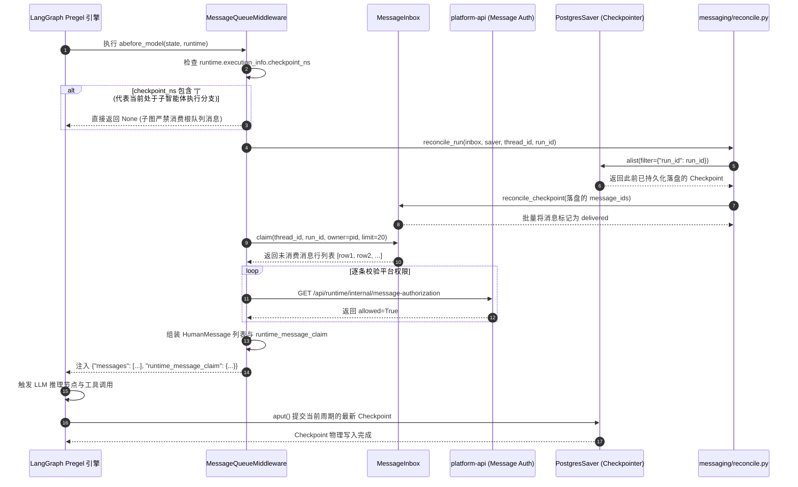

# 02-LangGraph 图执行与 checkpoint_ns 路由 (LangGraph Execution & checkpoint_ns Routing)

## 模块定位与核心价值

在大模型智能体系统从玩具走向生产级应用的过程中，最核心的技术跃迁就是从“无状态线性调用”转变为“**基于有向图与检查点的状态机（Stateful Pregel Graph Engine）**”。

`ai-agent-platform` 的底层运行时选用 LangGraph 作为编排底座，由 `runtime-service` 负责具体的图拓扑装配、节点调度与检查点持久化。为了在同一个会话（Thread）中同时支撑**主智能体（Root Agent）**与**多个并行派发的子智能体（Subagents/Subgraphs）**，平台设计了严密的命名空间路由机制（`checkpoint_ns`）与检查点对账引擎（Reconciliation Engine）：
1. **多层级拓扑隔离（Namespace Routing）**：基于 `checkpoint_ns` 将根图执行（`checkpoint_ns=""`）与子智能体执行（如 `checkpoint_ns="researcher|..."`）在同一个会话内进行状态与通道的硬隔离。
2. **根图专享消息队列挂载（MessageQueueMiddleware）**：中间件自动识别执行命名空间，确保外部队列消息只由根图消费，严禁子智能体跨层越权吞食用户指令。
3. **基于已提交检查点的确定性对账（Deterministic Reconciliation）**：绝不依赖内存或未完成写入的临时状态判定消息送达，必须以 PostgreSQL 中已落盘的根图 Loop Checkpoint 为唯一物理凭证确认消息投递。
4. **私有状态私密性保护（Private State Isolation）**：将队列消费凭证（`runtime_message_claim`）声明为 `PrivateStateAttr`，既不污染图的公共业务状态，也绝不向外部客户端透传。

---

## 零、知识前置与上下文串联（Knowledge Bridges）

### 1. 认知输入（前置模块输入）
- 依赖 [01-architecture.md](file:///Users/lijiaxin/PyCharmMiscProject/ai-agent-platform/docs/architecture/05-runtime-service/01-architecture.md)：掌握 `MessageInbox` 是如何通过咨询锁保证消息在数据库中排队存储的。
- 依赖 [04-platform-api/02-runtime-gateway.md](file:///Users/lijiaxin/PyCharmMiscProject/ai-agent-platform/docs/architecture/04-platform-api/02-runtime-gateway.md)：明确网关下发的 `run.start` 指令包含了 `checkpoint_id` 与经过严格清洗的 `platform_runtime` 配置。

### 2. 本章核心流转
- **图初始化与中间件管道装配**：`create_deep_agent` 装配包括 `MessageQueueMiddleware`、`FilesystemMiddleware` 等在内的中间件拦截链。
- **命名空间分支探测**：执行 `abefore_model` 前置钩子，探测当前执行上下文的 `info.checkpoint_ns`。
- **消息认领与授权验证**：若处于根命名空间，向平台内部授权端点请求验证通过后，将队列消息转换为 `HumanMessage` 注入图上下文。
- **增量检查点提交与收据冲销**：Pregel 循环完成一次 Super-step，将包含 `runtime_message_claim` 的 Checkpoint 写入数据库，后台由 `reconcile_run` 闭环确认收据。

### 3. 认知输出（支撑后续模块）
- 为 [03-hitl-and-interrupts.md](file:///Users/lijiaxin/PyCharmMiscProject/ai-agent-platform/docs/architecture/05-runtime-service/03-hitl-and-interrupts.md) 提供带有完整调用栈上下文的中断挂起与恢复点。
- 为 [04-tools-and-skills.md](file:///Users/lijiaxin/PyCharmMiscProject/ai-agent-platform/docs/architecture/05-runtime-service/04-tools-and-skills.md) 提供确定性运行的环境配置与工具调用上下文。

---

## 一、对立视角：简易原型 vs 生产架构（Naive vs Production）

| 维度 | 简易原型方案 (Naive) | 本运行时生产级架构 (Production Architecture) | 选型与演进考量 |
| :--- | :--- | :--- | :--- |
| **状态持久化** | 内存字典 `MemorySaver()`，进程重启或容器崩溃时全部会话状态与历史对话立即归零。 | PostgreSQL 关系持久化检查点（`PostgresSaver`），节点每走一步自动生成只读增量快照。 | 支撑长时间运行的工作流，允许智能体执行过程中随时断电重启、断点重试与故障自愈。 |
| **子智能体通信** | 子 Agent 与主 Agent 共享同一个全局状态字典，状态键互相覆盖导致数据混乱。 | `checkpoint_ns` 多层级路由：主 Agent 对应根命名空间，子 Agent 拥有形如 `subagent|xxx` 的派生命名空间。 | 彻底隔离不同 Agent 的内部临时变量、思考链与工具调用历史，防止全局命名污染。 |
| **外部消息追加** | 随意修改当前运行中的图状态，引发 LangGraph Pregel 产生版本冲突（Version Conflict）异常。 | `MessageQueueMiddleware` 挂载于模型推理前置钩子，通过标准通道追加 `HumanMessage`，完全合规。 | 遵循 LangGraph 状态机单向演化契约，绝不破坏 Pregel 引擎的内部执行确定性。 |
| **消息对账准确性** | 内存里只要把消息塞进图就认为“发送成功”，若后续节点抛出异常崩溃，消息彻底丢失且无感知。 | 严格依靠数据库中最终落盘的 Checkpoint 进行对账（`reconcile_run`），未写入落盘绝不确认消费。 | 实现真正的“至少一次（At-least-once）”强保障，杜绝在图执行失败时吞掉用户的关键消息。 |

---

## 二、源码精准坐标映射（Code Pointer Map）

### 1. 核心图组装与中间件拦截
- [services/dearflow_agent/agent.py](file:///Users/lijiaxin/PyCharmMiscProject/ai-agent-platform/apps/runtime-service/src/runtime_service/services/dearflow_agent/agent.py)：
  - `create_deep_agent()`：装配 Deep Agents 核心图，挂载 10+ 个核心中间件。
  - `PERMISSIONS`：声明文件系统沙箱的访问黑名单规则。
- [middlewares/message_queue.py](file:///Users/lijiaxin/PyCharmMiscProject/ai-agent-platform/apps/runtime-service/src/runtime_service/middlewares/message_queue.py)：
  - `MessageQueueMiddleware`：负责识别 `checkpoint_ns`、认领队列消息、请求平台鉴权并注入 `runtime_message_claim`。

### 2. 检查点持久化与对账
- [messaging/reconcile.py](file:///Users/lijiaxin/PyCharmMiscProject/ai-agent-platform/apps/runtime-service/src/runtime_service/messaging/reconcile.py)：
  - `reconcile_run()`：扫描已提交的 `loop` 来源 Checkpoint，根据快照内的 `runtime_message_claim` 批量更新收件箱状态为 `delivered`。
- [runtime/resolver.py](file:///Users/lijiaxin/PyCharmMiscProject/ai-agent-platform/apps/runtime-service/src/runtime_service/runtime/resolver.py)：
  - `reject_untrusted_configurable()`：强力拦截传入图配置中的非法注入字段（`_FORBIDDEN_CONFIGURABLE_FIELDS`）。

---

## 三、真实数据结构与报文（Real Payloads & DB Schemas）

### 1. 私有状态模型（MessageQueueState）
`runtime_message_claim` 被声明为 `PrivateStateAttr`，意味着它只对框架层中间件可见，既不会序列化暴露给最终用户，也严禁客户端从入口处逆向注入：

```python
# apps/runtime-service/src/runtime_service/middlewares/message_queue.py

class MessageQueueState(AgentState):
    runtime_message_claim: NotRequired[Annotated[dict[str, Any], PrivateStateAttr]]
```

### 2. 检查点内持久化的认领快照示例
当节点完成计算并提交检查点时，`channel_values` 中记录的结构如下：

```json
{
  "checkpoint_id": "1ef7cb92-1200-6000-8001-c80f4f932f10",
  "checkpoint_ns": "",
  "channel_values": {
    "messages": [
      {
        "type": "human",
        "id": "1c9b8823-1087-43a0-8199-281a8b139580",
        "content": "补充要求：请在最终架构分析中附带 Mermaid 时序图"
      }
    ],
    "runtime_message_claim": {
      "token": "claim-tok-88401",
      "run_id": "run-9b1deb4d",
      "message_ids": ["1c9b8823-1087-43a0-8199-281a8b139580"]
    }
  }
}
```

---

## 四、端到端函数级调用时序（Function-Level Trace）

从图节点执行前拉取队列消息，到最终落盘对账的完整闭环时序：



---

## 五、核心实现高保真伪代码（High-Fidelity Pseudocode）

### 1. 命名空间路由与消息认领守卫（MessageQueueMiddleware）
```python
# 对应 apps/runtime-service/src/runtime_service/middlewares/message_queue.py

class MessageQueueMiddleware(AgentMiddleware):
    state_schema = MessageQueueState

    async def abefore_model(self, state: MessageQueueState, runtime: Runtime) -> dict[str, Any] | None:
        info = runtime.execution_info

        # 1. 核心架构约束：多命名空间路由隔离
        # 如果 checkpoint_ns 包含 "|"（例如 "researcher|subagent_1"），说明是子图执行分支
        # 外部输入队列只属于根会话，子智能体绝对不能越权拉取根消息！
        if info and "|" in info.checkpoint_ns:
            return None

        thread_id = info.thread_id if info else get_config().get("configurable", {}).get("thread_id")
        run_id = (info.run_id if info else None) or get_config().get("metadata", {}).get("run_id")
        dsn = os.getenv("DATABASE_URI")
        if not thread_id or not run_id or not dsn:
            return None

        inbox = MessageInbox(dsn)
        checkpointer = get_checkpointer()

        # 2. 前置对账：确认上一周期已落盘的快照收据
        await reconcile_run(inbox, checkpointer, thread_id=str(thread_id), run_id=str(run_id))

        # 3. 认领待处理消息 (单批最多 20 条，带超时保护)
        token, rows = await asyncio.to_thread(
            inbox.claim, thread_id=str(thread_id), target_run_id=str(run_id), owner=str(os.getpid()), limit=20
        )
        if not rows:
            return None

        # 4. 远程安全校验：调用平台内部认证端点，杜绝已被撤销权限的用户消息被注入
        authorized_rows = []
        async with httpx.AsyncClient(timeout=10) as client:
            for row in rows:
                resp = await client.get(
                    os.environ["PLATFORM_RUNTIME_MESSAGE_AUTH_URL"],
                    params={"thread_id": str(thread_id), "run_id": str(run_id)},
                    headers={"x-runtime-message-ref": row["authorization_ref"] or ""}
                )
                if resp.status_code in {401, 403}:
                    await asyncio.to_thread(inbox.reject, token=token, message_id=row["message_id"], reason="permission_revoked")
                    continue
                if resp.json().get("allowed") is True:
                    authorized_rows.append(row)

        # 5. 组装输入消息并记录私有状态 Claim
        human_messages = [HumanMessage(id=r["message_id"], content=r["payload"]) for r in authorized_rows]
        return {
            "messages": human_messages,
            "runtime_message_claim": {
                "token": token,
                "run_id": str(run_id),
                "message_ids": sorted(r["message_id"] for r in authorized_rows),
            }
        }
```

### 2. 基于检查点物理落盘历史的安全对账（reconcile_run）
```python
# 对应 apps/runtime-service/src/runtime_service/messaging/reconcile.py

async def reconcile_run(inbox: MessageInbox, saver: Any, *, thread_id: str, run_id: str, terminal_reason: str | None = None) -> int:
    count = 0
    # 严格限定查询根图命名空间 (checkpoint_ns="")
    config = {"configurable": {"thread_id": thread_id, "checkpoint_ns": ""}}

    # 遍历该 Run 下已由数据库落盘提交的所有 Snapshot
    async for snapshot in saver.alist(config, filter={"run_id": run_id}):
        # 只认可执行主循环 (source="loop") 提交的有效快照
        if snapshot.metadata.get("source") != "loop":
            continue
        if snapshot.config["configurable"].get("checkpoint_ns", ""):
            continue

        claim = snapshot.checkpoint.get("channel_values", {}).get("runtime_message_claim", {})
        if claim.get("run_id") != run_id:
            continue

        # 物理落盘已确认，正式在收件箱中将该批消息状态置为 delivered
        count += await asyncio.to_thread(
            inbox.reconcile_checkpoint,
            thread_id=thread_id,
            target_run_id=run_id,
            checkpoint_id=snapshot.config["configurable"]["checkpoint_id"],
            message_ids=claim.get("message_ids", [])
        )

    if terminal_reason is not None:
        await asyncio.to_thread(inbox.mark_run_not_consumed, thread_id=thread_id, target_run_id=run_id, reason=terminal_reason)

    return count
```

---

## 六、假想断电与极限场景推演（Thought Experiments）

### 场景一：子智能体在执行深度检索时尝试偷取根消息
- **推演过程**：主智能体派发了 `researcher` 子智能体进行网络论文检索，子智能体的执行图进入模型调用前置阶段，触发 `abefore_model`。
- **系统表现**：`runtime.execution_info.checkpoint_ns` 的值为 `"researcher|subagent_abc"`，内部包含分隔符 `"|"`。中间件立即判定当前属于嵌套子图，直接返回 `None`。子智能体无法访问根收件箱，消息仍然安全保留在数据库中，等待主智能体完成汇总重新接管控制权时再行消费。

### 场景二：消息认领成功但模型推理超时抛出异常（中间断电）
- **推演过程**：中间件成功从数据库中 `claim` 了 2 条消息，但在接下来调用外部 OpenAI API 时发生 ReadTimeout，整个 Pregel 步骤崩溃中断，当前周期的 Checkpoint **未被提交到数据库**。
- **系统表现**：由于没有新的 Checkpoint 物理写入，`reconcile_run` 扫描不到带有最新 `runtime_message_claim` 的快照，因此**绝对不会**将这两条消息标记为 `delivered`。收件箱中这两条消息的认领状态超期后自动释放，下一次客户端重试运行或再次调度时，消息能够被再次安全认领，做到了严格的“至少一次（At-least-once）”交付。

### 场景三：攻击者试图在客户端参数中伪造私有状态字段
- **推演过程**：恶意用户在调用接口时，在请求体中硬编码传入 `{"runtime_message_claim": {"token": "fake", "run_id": "...", "message_ids": [...]}}`。
- **系统表现**：在网关层，`core/runtime_contract.py` 的 `reject_private_runtime_state` 会在入口处立即识别并抛出 `400 Bad Request`；即使穿透到运行时内部，由于该字段被标注为 `PrivateStateAttr`，Pregel 引擎严禁从外部输入中初始化该通道，恶意伪造完全无效。

---

## 七、架构不变量清单（Architectural Invariants）

1. **命名空间根专享原则**：外部消息队列的消费与对账，仅对根命名空间（`checkpoint_ns == ""`）开放；任何包含 `"|"` 的嵌套派生命名空间绝对禁止拉取根队列消息。
2. **物理落盘对账充要原则**：消息收件箱中消息状态由 `claimed` 跃迁至 `delivered` 的唯一合法依据，必须是对应包含该 `message_id` 的 Checkpoint 已经成功物理落盘提交。
3. **私有状态单向密封原则**：任何被 `PrivateStateAttr` 修饰的属性（如 `runtime_message_claim`），绝对禁止向客户端透传输出，也绝对禁止接受客户端反向注入。
4. **子图生命周期封装原则**：子智能体的内部状态变更与临时变量，必须全部封装在各自派生的 `checkpoint_ns` 下，严禁向根图的命名空间越权写污染。
