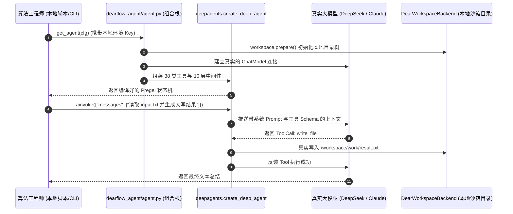

# 02-运行时执行边界、DearFlowAgent 实战与架构合理性批判式审视 (Runtime Execution & DX Architecture Critique)

> **模块定位与核心价值**：站在完全中立、客观且犀利的架构评审委员会视角，深入剖析旗舰智能体 `dearflow_agent` 在完全脱离上层控制面（Platform-API）时的底层独立运行全链路；彻底理清 Runtime 层的“业务边界”与数据透传范围；直面当前架构设计的痛点，对新开发者的认知心智负担与开发者体验（DX）进行深度批判式审视，并给出清晰的演进破局路线。

---

## 零、直面灵魂三问（Core Inquiries）

在很多工程团队中，架构师最怕被业务开发灵魂拷问：
1. **“你说底层自治，那拿你们最复杂的 `dearflow_agent` 跑给我看！我不通过 Web 界面和平台网关，到底怎么在底层发起请求并拿到处理结果？”**
2. **“你们常说 Runtime-Server 不处理业务逻辑，那平台设计的那么多 RBAC、项目权限、模型管控，底层到底管不管？底层接到的到底是什么？”**
3. **“如果一个新同学来开发新 Agent，他需要理解上层这套庞杂的逻辑吗？现在的设计到底合不合理？是不是过度设计了？”**

老王今天不护短、不讲官话套话，用真实的源码和架构事实，把这三个问题扒个底朝天！

---

## 一、实战推演：DearFlowAgent 如何在底层独立发起与执行？

很多同学以为 `dearflow_agent` 这种拥有 38 类工具、三层记忆、多模态工作空间和子智能体的“重型武器”，必须挂在平台大网关下才能跑。**大错特错！**

底层执行引擎设计的第一准则就是：**一切以图（LangGraph Pregel）为核心，图就是纯粹的状态机函数。**

### 1. 模式 A：纯本地单元测试模式（零网络、零 Token 账单）
- **源码参考**：[`tests/services/dearflow_agent/test_agent.py`](../../../../apps/runtime-service/tests/services/dearflow_agent/test_agent.py#L30-L100)
- **运行方式**：完全不连 OpenAI，不连 Platform-API，直接依赖注入 `BindableFakeMessagesChatModel`。

```python
import asyncio
from support import BindableFakeMessagesChatModel
from runtime_service.runtime import runtime_context_hash
from runtime_service.services.dearflow_agent import agent
from runtime_service.services.dearflow_agent.workspace.backend import DearWorkspaceBackend

# 第一步：构建极简本地上下文配置（Configurable）
cfg = {
    "context": {},
    "configurable": {
        "thread_id": "test-thread-001",
        "assistant_id": "dearflow_agent",
        "graph_id": "dearflow_agent",
        "langgraph_auth_user": {
            "runtime_principal": {
                "user_id": "local-dev", "tenant_id": "tenant-local",
                "project_id": "proj-local", "role": "developer", "permissions": []
            },
            "runtime_policy": {
                "version": "test-v1",
                "allowed_model_ids": [agent._DEFAULTS.model_id],
                "tool_overrides": {},
                "tool_policy_version": "test-tools-v2"
            },
            "runtime_scope": {
                "tenant_id": "tenant-local", "project_id": "proj-local",
                "thread_id": "test-thread-001", "assistant_id": "dearflow_agent",
                "operation": "run-create"
            },
            "runtime_context_hash": runtime_context_hash({}),
        }
    }
}

# 第二步：Mock 模型行为（模拟大模型返回一个调用 write_file 工具的决策）
fake_model = BindableFakeMessagesChatModel(responses=[
    agent.AIMessage(content="", tool_calls=[{
        "name": "write_file",
        "args": {"file_path": "/workspace/work/demo.txt", "content": "hello autonomy"},
        "id": "call-1"
    }]),
    agent.AIMessage(content="文件写入完成！")
])

# 第三步：Monkeypatch 拦截模型创建并启动图
async def main():
    agent.build_model = lambda *args, **kwargs: fake_model
    graph = await agent.get_agent(cfg)

    # 第四步：唤醒图执行！
    result = await graph.ainvoke({"messages": [("user", "帮我创建 demo.txt")]}, cfg, context={})
    print("Agent 执行结果:", result["messages"][-1].content)

asyncio.run(main())
```

---

### 2. 模式 B：直连真实大模型调试模式（带沙箱与真实 LLM 交互）
- **源码参考**：[`tests/services/dearflow_agent/test_live.py`](../../../../apps/runtime-service/tests/services/dearflow_agent/test_live.py#L23-L93)
- **运行方式**：算法工程师无需启动平台，只需在本地 `.env` 配置直连大模型 Key（如 `DEEPSEEK_PROXY_API_KEY`），通过单机脚本唤醒整个沙箱：



**结论**：`dearflow_agent` 具备 100% 的底层单机独立运行能力。无论是单测还是真实模型联调，都不需要上层 `platform-api` 参与。

---

## 二、架构边界定论：Runtime-Server 到底接到了什么？处不处理“业务逻辑”？

很多工程师对“业务逻辑”这个词有巨大的误解。平台层有用户管理、有飞书登录、有按月订阅、有项目成员权限（Viewer/Editor/Admin），**这些权限到底交不交给底层？**

答案是：**平台层的业务逻辑，底层连根毛都看不见，也绝不处理！**

### 1. 业务逻辑与执行逻辑的“物理绝缘表”

| 概念与能力 | 平台控制面 (Platform-API) | 运行时执行面 (Runtime-Service) | 职责切分原则 |
| :--- | :--- | :--- | :--- |
| **用户与租户管理** | ✅ 拥有 `users`, `tenants`, `projects` 表 | ❌ 完全无库、无表、无概念 | 认证（Authentication）只在边缘发生 |
| **双层 RBAC 判定** | ✅ 计算用户是否有 `PROJECT_ASSISTANT_WRITE` | ❌ 根本不知道什么叫 RBAC | 策略决策（PDP）在控制面收敛 |
| **计费与账单配额** | ✅ 扣除项目账户余额、核算 Token 费用 | ❌ 仅上报单次 Run 的 Token 消耗事实 | 商业规则绝对不下沉执行层 |
| **模型商业凭证 (Key)** | ✅ Fernet 加密持久化存储 | ❌ 仅内存瞬时解密持有数微秒，用完即焚 | 零信任凭据治理 |
| **执行期安全门禁** | ❌ 无法拦截图内部动态生成的指令 | ✅ 强制剔除黑名单工具、强制单次调用上限 | 策略执行点（PEP）在沙箱内闭环 |
| **图状态机与工作流** | ❌ 仅通过 SSE 事件盲目透传给前端 | ✅ 负责 LangGraph Checkpoint、消息入队对账 | 认知计算是底层的唯一核心职责 |

### 2. 底层 Runtime-Server 究竟接到了什么？

当一个请求从平台网关穿透到底层时，底层真正接到的只有**四张“纯事实小票（Execution Facts）”**，记录在 [`runtime_service/runtime/contracts.py`](../../../../apps/runtime-service/src/runtime_service/runtime/contracts.py)：

```python
# 1. 身份小票 (Principal): 只有 ID，没有姓名，没有密码，不查用户库
principal = RuntimePrincipal(
    user_id="usr-123", tenant_id="tenant-abc", project_id="proj-456",
    role="developer", permissions=["runtime.tool.read"]
)

# 2. 策略切片 (Policy): 控制面已经算好的结果，底座不问为什么
policy = RuntimePolicy(
    version="pol-1",
    allowed_model_ids=("deepseek:DeepSeek-V4-Flash",), # 只准调这个模型！
    denied_tool_names=("bash_execute",),             # 必须把这个工具剔除！
    tool_policy_version="tv-2"
)

# 3. 范围锚定 (Scope): 锁死操作边界
scope = RuntimeScope(
    tenant_id="tenant-abc", project_id="proj-456",
    thread_id="th-789", assistant_id="dearflow_agent", operation="run-create"
)

# 4. 指纹防伪 (Context Hash):
context_hash = "71位的SHA256指纹"
```

### 3. 底座接到后是“能处理就直接处理吗”？

**是的！底座接到的不是“请求申请”，而是“已经裁决完毕的授权事实”。**
底座的处理逻辑就像流水线工人：
1. **验防伪**：算一下签名对不对、算一下 `context_hash` 对不对；不对直接按报警器报 401/403；
2. **物理装配**：拿着 `denied_tool_names`，把工具箱里的 `bash_execute` 扳手物理拿走；拿着 `allowed_model_ids` 选定模型；
3. **闭眼执行**：把组装好的图扔进 LangGraph Pregel 引擎全速运算，谁也别来打扰。

---

## 三、批判式审视：当前设计对新开发者到底合不合理？（The Hard Truth）

现在老王站在客观中立、挑刺批判的架构师角度，回答用户的核心质疑：
**“别人如果来开发一个新 Agent，他是怎么开发的？他必须理解上层逻辑吗？当前设计合理吗？”**

---

### 1. 现在的真实开发流：新同学是怎么写新 Agent 的？

假设新来了一位算法同学小张，要开发一个新的 `data_analyst_agent`：
1. **小张需要写什么？**
   - 创建 `apps/runtime-service/src/runtime_service/services/data_analyst/`；
   - 编写分析专用的工具（如 `sql_query`, `python_chart`）；
   - 编写专用的 Prompt 模板；
   - 编写 `agent.py`，暴露一个核心入口函数：`async def get_agent(config: RunnableConfig) -> Pregel`；
2. **小张需要注册什么？**
   - 在根目录的 `langgraph.json` 中加一行：
     ```json
     "data_analyst": {
       "path": "./src/runtime_service/graphs/data_analyst.py:get_agent",
       "description": "Data Analyst Agent"
     }
     ```
3. **小张如何本地自测？**
   - 小张写一个 `test_analyst.py`，按照第一章的“模式 A”或“模式 B”，在本地直接 `pytest` 跑通全部分析逻辑；
   - **在这一步，小张完全不需要了解上层的 Vue 前端、FastAPI 网关、RBAC 角色、PostgreSQL 账户表！**

---

### 2. 公平中立的批判：当前架构的“合理之处”（为什么代码不得不这么写？）

很多新手看到 `agent.py` 里那么多数值校验，第一反应是：“太繁琐了，过度设计！”
老王客观评价：**在企业级高权限 Agent 系统中，这种设计有极其硬核的安全防御价值：**

1. **纵深防御（Defense in Depth）不是一句空话**：
   - Agent 不是普通微服务，它拥有在服务器宿主机或 Docker 沙箱里执行 Shell、读写文件的能力（RCE 风险）；
   - 如果底层不做 `facts` 验签与工具强制剔除，一旦外层网关发生配置失误或参数污染，黑客就能越权调用高危命令；
2. **多租户物理工作空间的确定性隔离**：
   - 真实的沙箱目录是 `root = /workspaces/{tenant_id}/{project_id}/{thread_id}`；
   - 如果底座没有 `RuntimePrincipal` 提供经过签名的租户信息，底座根本不敢创建本地文件系统，否则租户 A 的文件就会被租户 B 随意读取！

---

### 3. 犀利的批判：当前架构的三大痛点与设计硬伤（Over-Engineering & DX Debt）

虽然安全做到了极致，但站在**开发者体验（Developer Experience, DX）**的角度，老王必须狠狠批判现有实现的三个严重问题：

#### 🔴 痛点一：组合根（Composition Root）样板代码严重超标，关注点未分离
- **问题现状**：翻开 [`services/dearflow_agent/agent.py`](../../../../apps/runtime-service/src/runtime_service/services/dearflow_agent/agent.py)，文件一共 429 行，其中**前 150 行几乎全在写安全校验胶水代码**：
  ```python
  user = configurable.get("langgraph_auth_user")
  facts = verified_delegation_from_user(user)
  if runtime_context_hash(context) != facts.context_hash: raise ...
  if facts.scope.assistant_id != "dearflow_agent": raise ...
  ```
- **老王批判**：**这是严重的代码坏味道（Code Smell）！** 算法业务开发者最关心的是 Prompt、模型选择和工具编排。凭什么每个写 Agent 的人都必须成为加密指纹专家？底层框架没有提供一个统一的脚手架把这些样板代码抽象掉，导致每个 Agent（`dearflow`、`workflow_demo`、`reference_agent`）都在重复造轮子抄一遍校验逻辑！

#### 🔴 痛点二：测试夹具（Test Fixtures）心智负担过高
- **问题现状**：新开发者想要在本地写个单测，看到测试必须构造这么一个庞然大物：
  ```python
  User(runtime_principal={...}, runtime_policy={...}, runtime_scope={...}, runtime_context_hash=...)
  ```
- **老王批判**：这就是典型的“测试认知摩擦（Friction）”。开发者只想测一个 5 行的节点转移，却必须手动拼装 30 行包含租户、策略版本、哈希值的假数据。缺少一个官方封装的 `create_mock_runtime_config()`，让很多初学者在写单测的第一步就被劝退！

#### 🔴 痛点三：双重模式（Probe vs Execution）带来的伪代码复杂度
- **问题现状**：代码为了兼容“平台目录扫描探测（Catalog Probe）”和“真实执行（Run Execution）”，搞了一套 `executing = facts is not None and facts.scope.operation == "run-create"` 分支。探测时返回虚假的 `ChatOpenAI(model="schema-only")`，执行时才创建真实模型。
- **老王批判**：把元数据发现与执行流程杂糅在同一个 `get_agent()` 函数里，导致函数内部充斥着大量的 `None if workspace is None else ...` 防空判断，极大地破坏了代码的简洁可读性。

---

## 四、工业级演进建议：如何破局与治理？（Evolution Roadmap）

针对上述痛点，合理的演进绝不是把安全栅栏拆掉，而是**“安全下沉为框架基础设施，业务代码归还给算法本身”**：

### 建议架构：引入 `RuntimeAgentHarness` 框架包装器

将所有验签、指纹比对、工作区初始化、模型解析全部沉淀为一个高阶装饰器或基类：

```python
# ==================== 🚀 演进后的优雅 Agent 业务实现 ====================
from runtime_service.framework import runtime_agent

@runtime_agent(name="data_analyst", default_model="deepseek:v4")
def build_data_analyst_agent(ctx: AgentBuildContext) -> Pregel:
    # 开发者只需聚焦纯粹的业务逻辑！
    # ctx.model 已经是由框架解密并绑好策略的真实模型
    # ctx.workspace 已经是由框架建好的隔离工作空间
    # ctx.tools 已经是由框架剔除黑名单后的安全工具集
    return create_deep_agent(
        model=ctx.model,
        tools=ctx.tools,
        backend=ctx.workspace.backend,
        system_prompt=ANALYST_PROMPT,
    )
```

**改造效果**：
1. **业务代码骤降 70%**：Agent 实现文件从 430 行直降到 100 行纯粹的图流转逻辑；
2. **零安全认知负担**：新开发者根本不需要知道什么叫 `context_hash`，框架层统统搞定；
3. **安全防线不降反升**：避免了各个 Agent 开发者手动写校验分支时发生遗漏和疏忽。

---

## 五、架构不变量清单（Architectural Invariants）

1. **执行面零业务状态不变量**：`runtime-service` 绝对禁止引入平台管理业务相关的实体表（如组织、用户、计费、角色矩阵），执行层只对算力图状态机负责。
2. **控制面策略终态不变量**：下发到底层的 Delegation 事实载荷必须是已经完成全部业务逻辑计算后的终态结果（只包含确定的允许模型列表与禁用工具列表），底座绝不做二次策略仲裁。
3. **图执行纯单机自治不变量**：任何 Agent 的图定义必须保持在无网络连接、无外部依赖环境下，能够通过依赖注入机制完成 100% 状态机覆盖单测。
