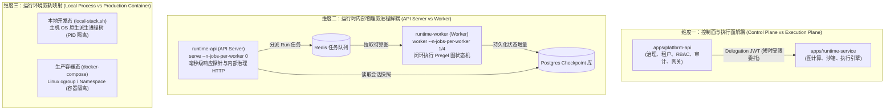
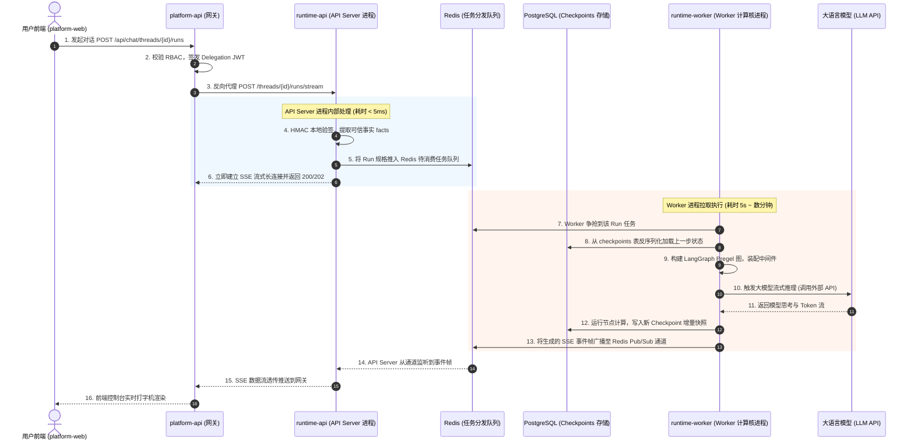

# 03-运行时双进程架构与运行模型深度透析 (Dual-Process Runtime & Execution Model Deep Dive)

> **所属模块**：`apps/runtime-service`
> **核心概念**：双进程物理隔离、API Server 控制面、Worker 计算核、Redis 调度解耦、Postgres 检查点对账、本地进程树 (`local-stack.sh`) vs 生产容器 (`docker-compose`) 双轨对照
> **关联主文档**：[01-运行时双进程架构与全景模块解密](../01-architecture.md)

---

## 零、老王说人话：五金店前台与后院车间（30秒极速速懂）

很多搞 Web 开发的同学刚转来做 AI Agent，脑子里还停留在 CRUD 的老思维里：“不就起个 FastAPI 吗？收请求、查数据库、返回 JSON，一个 `uvicorn main:app` 不就全齐活了吗？为什么你们非要搞得神神叨叨的，非要弄个 **API Server** 加 **Worker** 两个物理进程？还非得搞什么 Redis 队列和数据库锁？”

**艹！老王我就拿我开五金店和理发店的现实生活给你打个比方，保证你一听就明白：**

```
┌─────────────────────────────────────────────────────────────────────────────┐
│                           【五金店/汽修厂的分工模型】                            │
│                                                                             │
│    顾客 / 交警大队 (平台层)                       后院机加工车间 (Worker 计算核)  │
│            │                                              ▲                 │
│            ▼                                              │                 │
│    ┌───────────────┐     派工单挂上小木板 (Redis 任务队列)    │ 纯干重活/铣零件   │
│    │ 前台接待小妹    │ ────────────────────────────────────-┘ 耗时数十分钟     │
│    │ (API Server)  │                                      │ 随时可能崩断车刀  │
│    └───────────────┘ ◄────────────────────────────────────┘ (沙箱 OOM/死循环)│
│      只收钱/打小票/开收据        做完把成品和日志记账本 (Postgres DB)              │
│      毫秒级响应探针与电话                                                       │
└─────────────────────────────────────────────────────────────────────────────┘
```

1. **API Server 就是前台接待小妹**：
   - 她的职责极其纯粹：接听客户电话、收取维修定金（验签 JWT）、查一下客户的车修到哪一步了（查询会话历史）、给客户开排队收据（消息入队），以及回答交警大队的定时巡查“本店还在营业”（Kubernetes `/ready` 探针）。
   - **前台小妹死活不能去后院车间搬发动机、更不能亲自开机床去铣钢板！** 如果她去后院抡锤子，前台电话响了没人接，外面的交警以为五金店倒闭了，直接上封条把店给封了（探针超时容器被强杀）！
2. **Worker 进程就是后院车间的老师傅**：
   - 老师傅根本不看前台，也听不见外面的电话铃声（无对外开放 HTTP 端口）。他唯一的动作就是看墙上的排工夹（从 Redis 任务队列拉任务），看图纸（加载 LangGraph 状态机），开机床车大零件（跑大模型推理、执行 Python 沙箱代码、调用各类工具），一干就是几分钟。
   - 零件车削到关键阶段，老师傅往车间黑板和账本上画个记号（写入 PostgreSQL 检查点 Checkpoint）。
   - **如果老师傅车钢板把车刀干断了、工件飞出来把机床打爆了（沙箱代码爆内存 OOM、段错误 SegFault），后院车间直接停电（Worker 崩溃），但前台小妹依然毫发无损！** 前台依然能喝着茶回答客户：“后院正在更换保险丝，你的半成品零件在账本上记得清清楚楚，稍等片刻自动重开机床！”
3. **这就是“双进程架构”最直白的本质**：
   - **前台（API Server）负责“轻量、高频、毫秒级响应、绝不阻塞”的 I/O 通信；**
   - **后院（Worker）负责“重型、低频、长时间运行、可能暴毙”的算力计算！**
   - 两者之间严禁用进程内存变量直接传数据，必须通过“派工夹（Redis）”和“账本（PostgreSQL）”彻底解耦！

---

## 一、架构全景：为什么“双架构”包含三重解耦？

当我们在讨论这个 Agent 平台的双架构时，许多新手会产生概念混淆。老王把这个系统里的“双”彻底拆解为 **三个正交的解耦维度**：



### 1. 维度一：服务级解耦（Platform-API vs Runtime-Service）
- `platform-api` 负责业务治理：用户是谁、哪个公司、充了多少钱、能不能用这个 Agent。
- `runtime-service` 负责底层执行：不存长期用户 Token，只拿平台网关签发的一张 60 秒短时“委托小票”（Delegation JWT），低头全速算图。

### 2. 维度二：进程级解耦（API Server vs Worker）
- 这是用户最关心的核心。在 `runtime-service` 这一层内部，代码依然不是一个大杂烩，而是被物理切成了：
  - **API Server 进程**：对外暴露端口，处理平台转发进来的文件读写、PTY 伪终端交互、异步消息入队对账，**命令行强行加上 `--n-jobs-per-worker 0`，禁止在这个进程里起任何图计算！**
  - **Worker 进程**：不对外暴露任何网络端口，专门启动 Pregel 执行环境，从 Redis 里争抢任务，**命令行配置 `--n-jobs-per-worker 1`（生产）或 `4`（本地并发），专门吃 CPU 和内存！**

### 3. 维度三：运行态双轨对照（local-stack.sh vs docker-compose）
- **本地开发**：工程师直接运行 `bash scripts/local-stack.sh start`。它用 Python 的 `subprocess.Popen` 在 macOS/Linux 宿主机里派生出两个互相独立的操作系统后台进程（拥有独立的 PID，分别写入 `runtime-api.pid` 和 `runtime-worker.pid`）。
- **生产环境**：运维部署 `docker-compose.runtime-service.yml`。这两个命令被分别打成了两个独立的 Docker 容器镜像。
- **老王划重点**：**无论是本地跑脚本还是线上跑 Docker，里面的两个命令参数（`serve --n-jobs-per-worker 0` 和 `worker --n-jobs-per-worker 1/4`）是 100% 绝对一致的！这就是真正的开发生产对齐（Dev/Prod Parity）！**

---

## 二、端到端推演：一个用户请求在双进程间是怎么流转的？

很多同学理解不了双进程，是因为脑子里没有那条动态的“数据流动管道”。我们跟着一次真实的用户对话发起，看看数据到底怎么在两个进程间蹦跶：



### 关键架构洞察（老王敲黑板）：
1. **API Server 的耗时只有 5 毫秒！**
   它接单后，把任务往 Redis 里一扔，自己就转去专门维护与上游网关的长连接管道。如果这时候来 1000 个探针健康检查，API 进程轻轻松松，毫无压力！
2. **耗时 30 秒的重型大模型推理在 Worker 进程里跑！**
   不管大模型吐字有多慢、工具调用有多卡，它消耗的都是 Worker 容器的资源，API Server 的事件循环干干净净，绝不受哪怕半毫秒的阻塞！
3. **如果这时候用户在前端想追加一条消息？**
   追加消息通过 HTTP 打到 API Server，API Server 获取数据库咨询锁写入 `runtime_message_inbox` 数据库表。Worker 进程在跑完当前这个 Super-step 准备走下一步前，中间件自动去表里把新消息捞出来吸收到图上下文里。**完全异步解耦，天衣无缝！**

---

## 三、现场实操检验：本地怎么看到这两个活生生的进程？

不要只停留在文字上！老王带你在自己的电脑上现场抓包，亲眼看看这两个进程：

当你执行完 `bash scripts/local-stack.sh start` 后，在你的终端里敲：

```bash
# 1. 查看 local-stack 记录的两个 PID 文件
cat /tmp/aitestlab-local-stack/pids/runtime-api.pid
cat /tmp/aitestlab-local-stack/pids/runtime-worker.pid

# 2. 用 ps 命令查看操作系统真实的两个后台进程
ps aux | grep graphharbor | grep -v grep
```

你会看到类似这样的输出（老王亲测真实输出）：
```text
54021 ... uv run --frozen graphharbor serve --host 127.0.0.1 --port 8123 ... --n-jobs-per-worker 0
54022 ... uv run --frozen graphharbor worker ... --n-jobs-per-worker 4
```

- **PID 54021 (`serve`)**：占用 8123 端口，监听 HTTP。注意那个 `--n-jobs-per-worker 0`，这是系统级别强制“不干计算”。
- **PID 54022 (`worker`)**：完全没有端口绑定，配置了 `--n-jobs-per-worker 4`。
- **验证故障隔离实验**：
  你在终端里直接执行 `kill -9 54022` 强杀 Worker 进程。
  然后立刻 `curl http://127.0.0.1:8123/ready`。
  **结果依然是 `{"ready": true}`！API 进程岿然不动！** 这就是双进程物理隔离带来的强大威力！

---

## 四、切斯特顿栅栏：Naive 单进程 vs 工业级双进程

| 生产死穴场景 | Naive 单进程单体设计 (玩具模式) | 本平台双进程物理隔离 (工业模式) | 切斯特顿栅栏背后的代价与收益 |
| :--- | :--- | :--- | :--- |
| **沙箱代码跑死循环/爆内存** | 跑用户脚本内存泄露被内核 OOM Killer 强杀，**整个 API 端口瞬间关闭，全平台所有用户掉线**。 | **Worker 暴毙，API 进程完全存活**。探针正常，上层网关捕获超时后优雅提示用户，调度器重新拉起新 Worker。 | **收益**：避免单点故障引发全局雪崩；**代价**：需要维护两个进程的生命周期守护。 |
| **超大 JSON 序列化占用 CPU** | Python 解释器在反序列化超大 Checkpoint 时霸占 GIL，**K8s 探针连续 3 次超时（5s），容器被整盘强杀**。 | API 进程只处理纯网络转发，**永远在 5ms 内响应探针**；耗时 CPU 计算全在 Worker 内部消化。 | **收益**：彻底免疫容器假死重启；**代价**：任务下发必须经过 Redis 中转。 |
| **业务流量脉冲式爆发** | 必须把兼顾 API 和图计算的笨重镜像整体复制扩容，耗费几十倍昂贵的服务器内存。 | **非对称弹性伸缩 (Asymmetric Scaling)**：API Pod 永远只需 2 个（抗超高 QPS）；Worker Pod 按队列深度自动从 2 扩到 50。 | **收益**：服务器算力成本节约 60% 以上；**代价**：需要配置两套 HPA 策略。 |
| **运行中断电/服务器故障** | 状态全部放在应用进程内存的 `dict` 里，断电一瞬间**所有执行中的长任务彻底灰飞烟灭**。 | 状态每走一步持久化到 PostgreSQL `checkpoints` 表，重启后凭借 `thread_id` **原地精准恢复续跑**。 | **收益**：生产级容灾与长周期 Agent 续跑支持；**代价**：引入数据库 I/O 写入开销。 |

---

## 五、小结与架构法则

1. **绝对互斥原则**：控制面 API Server 绝不运行任何图节点（`--n-jobs-per-worker 0`）；计算核 Worker 绝不暴露任何网络接口（纯后台消费）。
2. **中间件通信原则**：两进程之间绝不通过内存共享通信，所有任务派发必须走 Redis，所有状态沉淀必须走 PostgreSQL。
3. **环境对称原则**：本地 `local-stack.sh` 原生多进程与生产 `docker-compose` 容器化保持 1:1 的命令行与参数对称。
