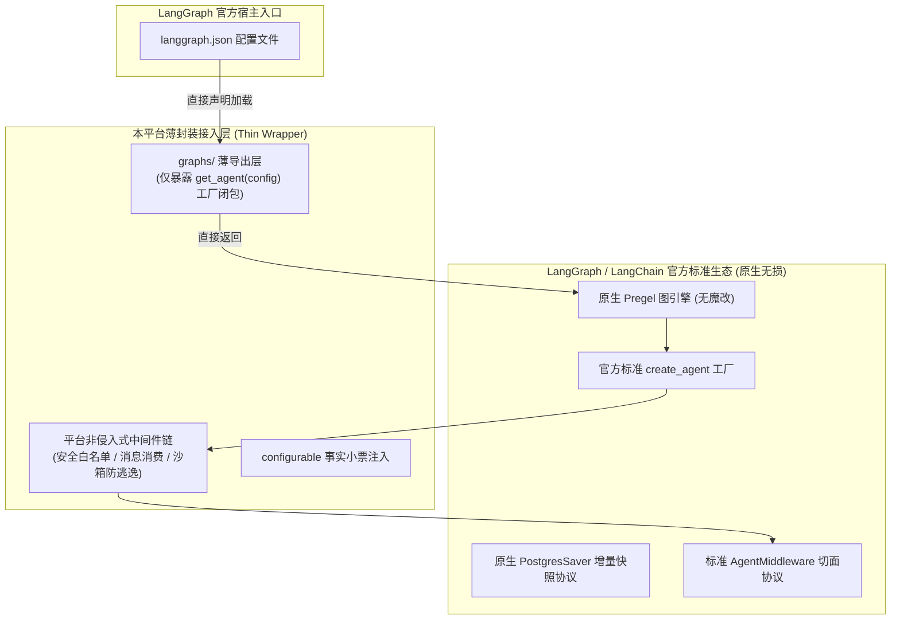

# 04-LangGraph 生态扫盲、薄封装哲学与 Agent 开发 SOP (LangGraph Ecosystem, Thin Wrapper & Agent Development Guide)

> **所属模块**：`apps/runtime-service`
> **核心概念**：LangGraph 生态扫盲（Pregel, StateGraph, Checkpointer, RunnableConfig）、薄封装设计哲学（Thin Wrapper）、标准 Agent 开发 6 步 SOP、无依赖测试规范
> **关联主文档**：[01-运行时双进程架构与全景模块解密](../01-architecture.md) | [02-LangGraph 图执行与 checkpoint_ns 路由](../02-langgraph-execution.md)

---

## 零、老王说人话：不要被 LangGraph 的一堆生僻词给唬住了！（30秒极速通透）

很多新同学一打开这个项目的代码，看到一堆 `Pregel`、`StateGraph`、`checkpoint_ns`、`RunnableConfig`、`channel_values`，当场就懵了，心里直犯嘀咕：“这他娘的都是些啥鸟玩意儿？写个 Agent 不就是写个 Prompt、调个 OpenAI API 吗？搞这么一堆名词是不是在装逼？”

**艹！老王我拿最直白的大白话给你把这几个概念扒光：**

```
┌─────────────────────────────────────────────────────────────────────────────┐
│                       【LangGraph 核心概念大白话字典】                        │
│                                                                             │
│ 1. StateGraph (状态图纸)    : 就像一个生产流水线流程图 (哪个节点连到哪个节点)    │
│ 2. Pregel (计算引擎)        : 拿着流程图真正干活的流水线控制器 (基于 BSP 算法)  │
│ 3. Checkpointer (快照照相机): 类似单机游戏的即时存档点 (每走一步咔嚓拍张照片存库)│
│ 4. RunnableConfig (背包挂件): 请求进来时随身带的钥匙包 (塞着模型ID、Token、租户) │
│ 5. Super-step (一轮节拍)    : 流水线上一道工序的统一钟声 (节点并发算，然后统一下发)│
└─────────────────────────────────────────────────────────────────────────────┘
```

1. **什么是 `StateGraph`**？
   以前我们写代码就是死循环 `while True`，模型吐一个工具名，我们就 `if tool == 'xxx'` 去执行。这样写一旦逻辑变复杂（比如有人要中断审批、要并行派发子任务、要回滚到上一步），代码就会变成一坨无法维护的意大利面！
   `StateGraph` 就是一张标准的**有向图**：你定义好有哪些“节点”（比如 `agent` 节点、`tools` 节点）和“有向边”（如果模型返回工具调用，就跳去 `tools` 节点；如果返回文本，就结束流转）。
2. **什么是 `Pregel`**？
   当你写完 `builder = StateGraph(...)` 并调用 `builder.compile()` 后，编译出来的可执行对象就叫 `Pregel`（名字源自 Google 的分布式大规模图计算框架 Pregel，采用 BSP 批量同步并行模型）。它就是图的执行引擎，负责管理状态机的每一轮迭代（Super-step）。
3. **什么是 `Checkpointer`**？
   这是 LangGraph 最灵魂的王牌！普通的 Python 脚本一旦执行到一半断电或者中断，内存里的变量全丢光。而 LangGraph 配上 PostgreSQL Checkpointer 后，**智能体每执行完一个节点，系统自动把当前整个状态字典序列化成快照写进数据库**！这就是为什么智能体可以暂停 3 天等人审批、也可以随时断电重启从断点继续跑！
4. **什么是 `RunnableConfig`**？
   这是 LangChain 全家桶通用的上下文大礼包。一个请求打过来，图怎么知道该用哪家模型、哪个租户的目录、发给谁？全靠在 `config["configurable"]` 这个小字典里塞入动态参数。

---

## 一、平台的灵魂法则：为什么我们坚决执行“薄封装（Thin Wrapper）”？

很多自研 Agent 平台的团队，招几个架构师，最喜欢干的一件蠢事就是：**过度抽象与重复造轮子**。
他们在开源框架上面疯狂套娃，自创一套自以为很牛逼的 `BaseAgentPlatformRunner`、`AbstractExecutionContext`、`UniversalAgentStep`，把 LangGraph 的原生对象死死包在里面。

**老王我必须痛骂这种愚蠢的过度设计！它的下场只有一种：官方生态一升级，自研抽象层全部报废！**
LangGraph、LangChain、DeepAgents 生态是目前全球演进最快的领域（从单图到子图路由、从简单状态到动态断点、从纯 Python 到原生中间件）。如果你搞了重型封装：
- 官方发布了超好用的新特性，你接入不了，因为你那套僵化的抽象层不支持；
- 官方修了一个致命 Bug，你升不了级，因为你的魔改代码和新版框架死锁了；
- 新同学进组，学了官方文档完全没用，还得被逼着学你们自研的那套蹩脚 API！

### 本项目的“薄封装”三大宪章：



1. **宪章一：插座式极简导出（Zero-Invasive Export）**
   去看 `src/runtime_service/graphs/` 目录！每个图的导出文件代码绝不超过 20 行：
   ```python
   # 对应 graphs/reference_agent.py
   from runtime_service.services.reference_agent.agent import get_agent

   __all__ = ["get_agent"]
   ```
   它只是薄薄一层适配器，供 `langgraph.json` 读取。**业务代码全部在 `services/` 里，框架协议全部在最外层，完全解耦！**
2. **宪章二：通过标准中间件（Middleware）扩展平台能力，绝不魔改核心图节点**
   需要防止用户提示词注入？需要拦截危险工具？需要从收件箱偷吃外部消息？需要防沙箱路径穿越？
   **平台坚决不碰 LangGraph 内部的调度逻辑！全部包装成标准的 `AgentMiddleware`（如 `MessageQueueMiddleware`、`FilesystemMiddleware`）**，挂在官方标准的中间件管道里。官方怎么推荐扩展，我们就怎么扩展！
3. **宪章三：未来升级平滑无痛（Upgrade-Friendly）**
   当未来 LangGraph 推出 2.0 或者官方新能力时，我们只需要在 `pyproject.toml` 里升级版本号，现有的 4 张图的业务代码和节点逻辑**无需动哪怕一刀手术**！

---

## 二、保姆级教学：在本项目中从零开发一个标准化 Agent（6 步 SOP）

现在，假设你的产品经理让你开发一个新的智能体：**`SqlAnalystAgent`（SQL 数据分析专家）**。
在本项目里，你应该如何按规范开发它？老王给你整理了一套**工业级 6 步标准作业程序（SOP）**：

```
                    【标准 Agent 开发 6 步 SOP】

  Step 1: 创建业务目录 ──> src/runtime_service/services/sql_analyst/
  Step 2: 编写核心提示词 ──> prompts.py (角色定位与边界约束)
  Step 3: 编写专属业务工具 ──> tools.py (利用 @tool 装饰器)
  Step 4: 组装业务图与中间件 ──> agent.py (必须接入 _runtime_model 钩子)
  Step 5: 暴露薄插座与注册 ──> graphs/sql_analyst.py & langgraph.json
  Step 6: 编写脱机独立单测 ──> tests/test_sql_analyst.py (Mock 模型极速验证)
```

---

### Step 1 & 2: 创建目录并编写提示词（`prompts.py`）

在 `apps/runtime-service/src/runtime_service/services/` 下创建新目录 `sql_analyst/`。

编写 `prompts.py`：
```python
# src/runtime_service/services/sql_analyst/prompts.py
SYSTEM_PROMPT = """你是一个专业的 PostgreSQL 数据分析专家。
你的任务是根据用户的自然语言问题，使用提供的只读 SQL 工具查询数据库，并返回结构化的分析结论。

【安全铁律】：
1. 只能执行 SELECT 查询，严禁执行 INSERT/UPDATE/DELETE/DROP 等变更操作。
2. 遇到不明确的表结构，先调用 list_tables 工具查阅 Schema。
"""
```

---

### Step 3: 编写专属业务工具（`tools.py`）

遵循 LangChain 官方标准，使用 `@tool` 装饰器定义确定性工具：

```python
# src/runtime_service/services/sql_analyst/tools.py
from langchain_core.tools import tool

@tool
def list_tables() -> str:
    """列出当前分析数据库中所有可用的数据表清单与基本说明。"""
    # 真实场景读取元数据或执行安全只读查询
    return "可用表: users(用户表), orders(订单表), products(商品表)"

@tool
def execute_readonly_sql(sql_query: str) -> str:
    """执行一条只读的 SQL 查询语句并返回最多 20 行数据结果。"""
    normalized = sql_query.strip().lower()
    if not normalized.startswith("select"):
        return "错误: 只允许执行 SELECT 查询！"
    # 执行查询逻辑并返回 JSON 字符串...
    return '[{"order_id": 1001, "amount": 259.0, "status": "paid"}]'
```

---

### Step 4: 组装核心图逻辑（`agent.py`，核心灵魂！）

这里是整个 Agent 的装配中心，老王必须要求你遵守**平台两大铁律**：
1. **必须包含 `_runtime_model(config)` 注入钩子**：方便脱机单测直接塞入 Fake/Mock 模型，不用配任何网络和外部大模型 API Key！
2. **必须使用 `resolve_runtime_config` 净化配置**：平台网关下发的权限小票必须在这里被安全解析。

```python
# src/runtime_service/services/sql_analyst/agent.py
from __future__ import annotations

from langchain.agents import create_agent
from langchain.agents.middleware import (
    ModelCallLimitMiddleware,
    ToolCallLimitMiddleware,
    ToolRetryMiddleware,
)
from langchain_core.language_models import BaseChatModel
from langchain_core.runnables import RunnableConfig
from langgraph.pregel import Pregel

from runtime_service.middlewares import MessageQueueMiddleware, ModelCallTimeoutMiddleware
from runtime_service.runtime import (
    AgentDefaults,
    build_model,
    parse_runtime_context,
    reject_untrusted_configurable,
    resolve_runtime_config,
)
from runtime_service.runtime.modeling import fetch_model_connection
from runtime_service.services.sql_analyst.prompts import SYSTEM_PROMPT
from runtime_service.services.sql_analyst.tools import execute_readonly_sql, list_tables

_DEFAULTS = AgentDefaults(
    model_id="deepseek:DeepSeek-V4-Flash",
    system_prompt=SYSTEM_PROMPT,
    prompt_version="sql-analyst-v1",
    optional_tool_names={"list_tables", "execute_readonly_sql"},
)

def _runtime_model(config: RunnableConfig) -> BaseChatModel | None:
    """【测试解耦钩子】：单测若注入了 Mock 模型，直接返回，绝不连外网！"""
    return config.get("configurable", {}).get("_runtime_model")

def get_agent(config: RunnableConfig) -> Pregel:
    """Agent 图构建根函数：每个请求到来时由 Worker 调用以实例化 Pregel 对象。"""
    # 1. 严格防御性检查：拦截任何非法注入的可信字段
    reject_untrusted_configurable(config)

    # 2. 优先尝试提取 Mock 测试模型
    model = _runtime_model(config)
    if model is None:
        # 3. 生产环境：从上下文解析平台下发的合法模型配置
        resolved, context = resolve_runtime_config(
            config,
            _DEFAULTS,
            parse_context_fn=parse_runtime_context,
        )
        connection = fetch_model_connection(resolved.model_id, context.delegation)
        model = build_model(resolved, connection)

    # 4. 装配业务专属工具
    tools = [list_tables, execute_readonly_sql]

    # 5. 组装标准中间件管道（平台能力非侵入式扩展！）
    middlewares = [
        MessageQueueMiddleware(),                          # 挂载异步消息收件箱消费
        ModelCallTimeoutMiddleware(timeout_seconds=45.0), # 模型超时熔断
        ModelCallLimitMiddleware(run_limit=15),           # 单轮思考最多 15 次
        ToolCallLimitMiddleware(run_limit=20),            # 工具调用最多 20 次
        ToolRetryMiddleware(max_retries=2),               # 工具出错自动重试 2 次
    ]

    # 6. 调用 LangChain 官方标准的 create_agent 编译图并返回原生 Pregel！
    return create_agent(
        model=model,
        tools=tools,
        system_prompt=SYSTEM_PROMPT,
        middlewares=middlewares,
    )
```

---

### Step 5: 编写薄插座并在 `langgraph.json` 注册

在 `apps/runtime-service/src/runtime_service/graphs/` 下新建 `sql_analyst.py`：

```python
# src/runtime_service/graphs/sql_analyst.py
from runtime_service.services.sql_analyst.agent import get_agent

__all__ = ["get_agent"]
```

然后打开 [`apps/runtime-service/langgraph.json`](../../../apps/runtime-service/langgraph.json)，在 `graphs` 节点下加上一行配置：

```json
{
  "graphs": {
    "sql_analyst": {
      "path": "./src/runtime_service/graphs/sql_analyst.py:get_agent",
      "description": "SQL 专家智能体：专注于企业数据库只读分析与报表产出。"
    }
  }
}
```

---

### Step 6: 编写脱机无依赖单测（核心自信保障！）

**没有单测的代码就是随时会爆炸的炸弹！**
我们在 `tests/` 下建立脱机单测，直接利用 `_runtime_model` 传入一个 `FakeChatModel`，无需数据库、无需网络，在 0.1 秒内验证整个图逻辑：

```python
# tests/services/test_sql_analyst.py
import pytest
from langchain_core.messages import AIMessage, HumanMessage
from langchain_core.language_models.fake_chat_models import GenericFakeChatModel
from runtime_service.services.sql_analyst.agent import get_agent

@pytest.mark.asyncio
async def test_sql_analyst_execution_with_mock_model():
    # 1. 构造一个预设行为的 Fake 模型
    fake_model = GenericFakeChatModel(messages=iter([
        AIMessage(content="根据数据库查询，上个月销售额为 100 万元。")
    ]))

    # 2. 注入 Mock 模型到配置中
    config = {
        "configurable": {
            "_runtime_model": fake_model,
            "thread_id": "test-thread-sql-001",
        }
    }

    # 3. 获取编译好的原生 Pregel 图
    app = get_agent(config)

    # 4. 执行一轮对话并断言结果
    result = await app.ainvoke({"messages": [HumanMessage(content="查询上个月销售额")]}, config=config)

    assert "100 万元" in result["messages"][-1].content
```

运行单测：
```bash
rtk pytest apps/runtime-service/tests/services/test_sql_analyst.py -q
```
**啪！0.05 秒全部绿灯通过！这才是工业级研发效能！**

---

## 三、黄金标杆：我写新 Agent 该抄谁的代码？

在 `apps/runtime-service/src/runtime_service/services/` 目录下，平台为你提供了两套完全不同的标准范例。老王告诉你什么场景该学谁：

| 范例智能体 | 源码位置 | 复杂度与定位 | 适合场景与学习价值 |
| :--- | :--- | :--- | :--- |
| **`reference_agent`** (极简教学级范式) | [`services/reference_agent/agent.py`](../../../apps/runtime-service/src/runtime_service/services/reference_agent/agent.py) | **代码不到 300 行**。<br/>单图标准装配、只读工具、原生中间件挂载、极简单测。 | **新手入门必抄！** 开发常规问答、SQL 查询、简单翻译或单一垂直领域的 Agent，直接照抄它！ |
| **`dearflow_agent`** (重型旗舰工业级) | [`services/dearflow_agent/agent.py`](../../../apps/runtime-service/src/runtime_service/services/dearflow_agent/agent.py) | **包含 10+ 模块、5000+ 行代码**。<br/>包含 Plan/Execute 模式、多模态工作区、PTY 终端沙箱、动态 Skills ZIP 热更、人工审批中断（HITL）、三层记忆对齐。 | **复杂工业生产必看！** 需要深度思考链（Deep Research）、需要让 Agent 写代码并运行、需要多轮人机审批的重型工程项目，参考此范式！ |

---

## 四、小结与开发铁律（Architectural Invariants）

1. **薄封装不可变铁律**：禁止在业务层发明自己的 Agent 执行框架，图的返回值必须是 LangGraph 原生 `Pregel`。
2. **测试解耦铁律**：所有新 Agent 的 `get_agent()` 必须优先检查并放行 `_runtime_model` 钩子，支持不连外网的极速脱机单测。
3. **安全净化铁律**：生产环境下所有配置必须经过 `resolve_runtime_config` 解析，杜绝直接从客户端未经验证的字典里取连接字符串或 API Key。
4. **单插座导出铁律**：所有向 `langgraph.json` 注册的图入口，统一在 `src/runtime_service/graphs/` 中放一行薄导出闭包，业务与框架协议绝对隔离。
