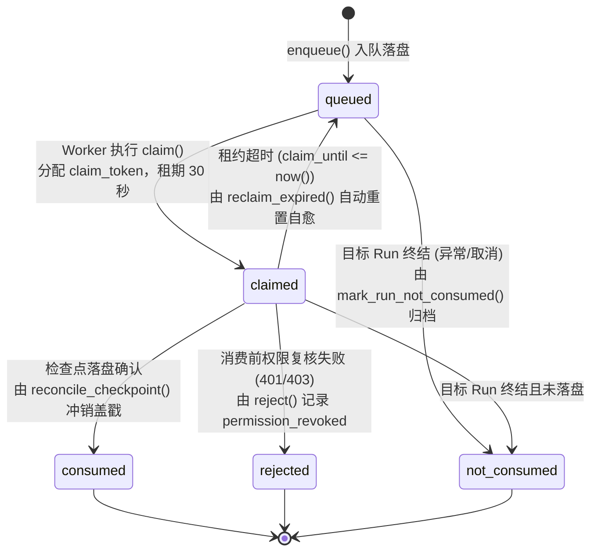
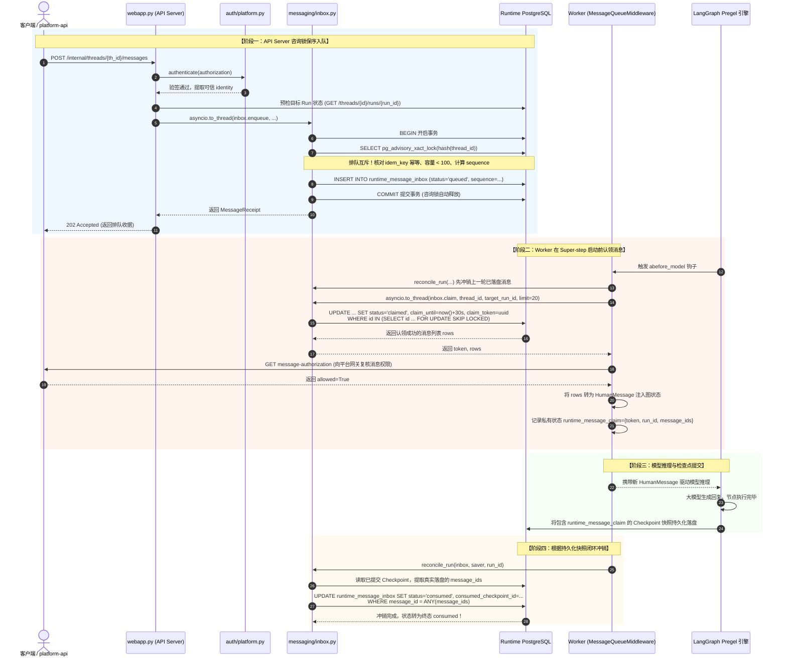

# 05-MessageInbox 数据库咨询锁与消息对账全链路深度透析 (MessageInbox Advisory Lock & Reconciliation Deep Dive)

> **所属模块**：`apps/runtime-service`
> **核心概念**：PostgreSQL 咨询锁 (`pg_advisory_xact_lock`)、消息收件箱状态机 (`queued` -> `claimed` -> `consumed` / `rejected` / `not_consumed`)、租约机制 (`claim_until`)、全链路时序联动、确定性检查点对账 (`reconcile_run`)
> **关联源码**：
> - 核心引擎：[`messaging/inbox.py`](../../../apps/runtime-service/src/runtime_service/messaging/inbox.py)
> - 闭环对账：[`messaging/reconcile.py`](../../../apps/runtime-service/src/runtime_service/messaging/reconcile.py)
> - 运维管理：[`messaging/__main__.py`](../../../apps/runtime-service/src/runtime_service/messaging/__main__.py)
> - 消费中间件：[`middlewares/message_queue.py`](../../../apps/runtime-service/src/runtime_service/middlewares/message_queue.py)
> - 外部 HTTP 端点：[`webapp.py`](../../../apps/runtime-service/src/runtime_service/webapp.py#L142-L211)

---

## 零、老王说人话：厨房传菜窗与点菜单对账（30秒极速速懂）

智能体一旦进入企业级深水区，比如跑一次 Deep Research 深度研究，或者写一个大型工程项目，耗时动辄 2 到 10 分钟。在这个漫长的执行过程中，用户随时可能追加指令：“先别爬百度了，改爬 GitHub 仓库！”或者“刚才那份表里加上邮箱字段！”

如果按普通工程师写代码的思维：**直接在内存里改当前 Agent 的全局变量，或者往它正在运行的队列里塞消息。**
**艹！老王直说了：这在 LangGraph 里纯属找死！**
LangGraph 内部是一个严格的状态机引擎，它按照 Super-step 的节拍在单向推进。你从外部毫无防备地直接改它的内存状态，轻则引发版本冲突异常（`Version Conflict`），重则导致当前步 Checkpoint 写入错乱，让整个图状态机直接死锁挂掉！

**本项目怎么解决？我们设计了 `MessageInbox` 机制，生活大白话类比就像餐厅的“传菜窗点菜单”：**

```
┌─────────────────────────────────────────────────────────────────────────────┐
│                       【传菜窗点菜单与闭环对账模型】                          │
│                                                                             │
│   客人 (用户) ──> 服务员 (API Server) ──> 钉在传菜窗木板上 (Postgres 数据库)  │
│                                                   │                         │
│   大厨炒完一个阶段 (Worker Super-step 结束) ◄─────┘ (撕下便签 claim, 租期30s)│
│            │                                                                │
│            ▼                                                                │
│   大厨把新要求加进锅里炒 (注入图为 HumanMessage)                              │
│            │                                                                │
│            ▼                                                                │
│   做完端上桌，把便签在账本上盖戳冲销 (reconcile_run, 状态变成 consumed)       │
└─────────────────────────────────────────────────────────────────────────────┘
```

1. **服务员（API Server）不进后厨**：
   收到客人追加的“别放香菜”，服务员拿一张带唯一编号的便签纸（`message_id`），算好防篡改指纹（`digest`），抢到传菜板该会话的专属图钉（`pg_advisory_xact_lock` 咨询锁），按顺序排好第几号（`sequence`），钉在木板上，给客人一张收据（202 Accepted）。
2. **大厨（Worker）按部就班看木板**：
   大厨炒完手头这盘菜的一个阶段，准备动脑子做下一道（中间件 `abefore_model` 钩子生效）。大厨抬头看木板，把属于当前菜品的便签条撕下来（`claim`，状态变成 `claimed`，加 30 秒防跑路租约），放进调料盒（转换成 `HumanMessage` 塞进图上下文）。
3. **闭环核对账本盖戳（Reconciliation）**：
   这盘菜做完了，必须以最后落盘在数据库里的正式出菜照片（持久化 Checkpoint 快照）为凭证，后台对账器（`reconcile_run`）比对无误后，才在木板上把便签盖戳归档（状态变更为 `consumed`）。
4. **这就是工业级消息收件箱的魅力**：
   **外部随意插队追加指令，底座执行引擎永远优雅稳定，掉电不丢一条消息，高并发绝不乱序！**

---

## 一、核心解密：为什么非得是 PostgreSQL 咨询锁（Advisory Lock）？

很多新手或者甚至工作几年的后端，一提到并发写排队，第一反应就是：“用行锁 `SELECT ... FOR UPDATE` 不就得了吗？”

**老王痛骂：糊涂！这是典型的教科书教条主义！在消息排队场景下用行锁，你连门都进不去！**

### 1. 为什么普通的行级锁（Row Lock）必死？

`SELECT ... FOR UPDATE` 依赖一个前置物理条件：**数据库表中必须先有一行记录存在！**
- 思考一个致命场景：一个全新的 Thread（会话刚创建，或者正在跑第一个 Run），此时客户端并发打进来两条追加指令。
- 两个并发数据库连接同时执行：
  ```sql
  SELECT sequence FROM runtime_message_inbox WHERE thread_id = 'new-thread-001' FOR UPDATE;
  ```
- **结果是什么？两个连接查出来的结果全是空集合（0 rows）！**
- 因为没有行，PostgreSQL 的行锁根本无从加起，锁了个寂寞！
- 紧接着，两个连接同时执行 `max(sequence) + 1`，两边都算出来 `sequence = 1`！然后同时执行 `INSERT`，立刻引发唯一键冲突报错（`message_id_conflict`）或者序列号重复，直接打翻翻车！

### 2. 为什么不能用表级排他锁（Table Lock）？

如果执行 `LOCK TABLE runtime_message_inbox IN EXCLUSIVE MODE`，确实不重了。但这是全表锁！全局所有租户、所有会话的追加消息全被卡死串行化，你的数据库吞吐量直接暴跌到个位数，生产环境瞬间被拖垮！

### 3. PostgreSQL 咨询锁的降维打击设计

在 [`inbox.py`](../../../apps/runtime-service/src/runtime_service/messaging/inbox.py#L63) 的第 63 行，老王用了一行极其犀利的 SQL：

```python
connection.execute(
    "SELECT pg_advisory_xact_lock(hashtextextended(%s, 0))", (thread_id,)
)
```

这就是工业级解决方案！我们把它的内部黑魔法拆开看：

```
                【pg_advisory_xact_lock 的原子排队模型】

   并发连接 A (thread_id="th-99")         并发连接 B (thread_id="th-99")
              │                                      │
              ▼                                      ▼
   hashtextextended("th-99", 0)           hashtextextended("th-99", 0)
              │                                      │
              ▼                                      ▼
   计算出 64位哈希整数: 847291048123      计算出 64位哈希整数: 847291048123
              │                                      │
              ▼                                      ▼
   获得咨询锁 (立即返回成功)                锁被 A 占用！连接 B 在内核挂起等待...
              │                                      │
              ├─ 1. 检查幂等性 (idem_key)            │
              ├─ 2. 检查队列容量 (< 100)              │
              ├─ 3. sequence = max + 1 (算得 1)      │
              └─ 4. INSERT 入库成功                  │
              │                                      │
         事务提交 (COMMIT)                           │
         锁自动释放 ─────────────────────────────────┘
                                                     │
                                                     ▼
                                            连接 B 被唤醒并获得锁！
                                                     │
                                                     ├─ 1. 检查幂等性
                                                     ├─ 2. 检查队列容量
                                                     ├─ 3. sequence = max + 1 (算得 2!)
                                                     └─ 4. INSERT 入库成功 (严格保序!)
```

#### 咨询锁的四大杀手级特性：
1. **脱离具体数据行存在（No Row Needed）**：
   咨询锁是 PostgreSQL 提供的纯应用层分布式锁。它锁的是一个 64 位的整型数值，无论表里有没有这条记录、甚至是空表，它都能在内存锁表中精准互斥！
2. **事务生命周期绑定（Transaction-Scoped, `_xact`）**：
   注意函数名带 `_xact`！这意味着**锁的生命周期严格绑定在当前数据库事务内**。一旦代码抛异常导致事务回滚（ROLLBACK），或者执行完毕提交（COMMIT），PostgreSQL 内核自动释放该锁！绝不存在因为 Python 进程暴毙导致的死锁或锁泄漏！
3. **精准到 Thread 级别的并发隔离**：
   通过 `hashtextextended(thread_id, 0)` 将字符串转为 64 位整型。锁只会阻塞**访问同一个会话（Thread）的并发请求**；不同会话之间的请求哈希不同，彼此完全并发执行，性能损耗几乎为零！
4. **锁内闭环完成三大安全防线**：
   在获得锁的临界区内，代码严密执行：
   - **防线 1：幂等冲突核对**（查 `idem_key`，相同内容幂等返回，不同内容抛 `idempotency_conflict`）；
   - **防线 2：队列防打爆阈值**（未消费消息超过 100 条抛 `queue_full`，返回 HTTP 429）；
   - **防线 3：单调严格递增序号**（`COALESCE(max(sequence), 0) + 1`，保证入队消息时间线绝对线性）。

---

## 二、真实数据库 Schema 深度解剖

底座收件箱的表结构定义在底座独立的数据库中，表名：`runtime_message_inbox`：

```sql
CREATE TABLE IF NOT EXISTS runtime_message_inbox (
    message_id UUID PRIMARY KEY,                 -- 客户端传入的全局唯一消息 ID
    thread_id TEXT NOT NULL,                     -- 所属会话 ID
    target_run_id TEXT NOT NULL,                 -- 绑定的目标运行轮次 ID (强绑定)
    sender_id TEXT NOT NULL,                     -- 发送者身份标识 (从 Token 提取的 identity)
    idem_key VARCHAR(128) NOT NULL,              -- 幂等键 (防网络抖动重试)
    payload JSONB NOT NULL,                      -- 实际投递的消息体 (纯文本或带附件字典)
    digest CHAR(64) NOT NULL,                    -- SHA-256 报文内容摘要 (防内容篡改)
    sequence BIGINT NOT NULL,                    -- 会话内单调严格自增序号 (1, 2, 3...)
    status VARCHAR(32) NOT NULL DEFAULT 'queued',-- 状态机: queued | claimed | consumed | rejected | not_consumed
    reason TEXT,                                 -- 终态原因记录 (如 permission_revoked, run_changed)
    authorization_ref TEXT,                      -- 平台鉴权凭据引用 (用于消费时二次鉴权)
    claim_token TEXT,                            -- 当前认领该消息的 Worker 租约凭证
    claim_until TIMESTAMPTZ,                     -- 租约过期截止时间 (超时自动收回)
    consumed_checkpoint_id TEXT,                 -- 最终消费该消息的 Checkpoint 快照 ID
    created_at TIMESTAMPTZ NOT NULL DEFAULT NOW(),
    updated_at TIMESTAMPTZ NOT NULL DEFAULT NOW(),
    CONSTRAINT uq_thread_sender_idem UNIQUE (thread_id, sender_id, idem_key)
);

-- 核心复合索引：加速 Worker 捞取未消费消息与租约扫描
CREATE INDEX IF NOT EXISTS idx_inbox_thread_target_status
ON runtime_message_inbox (thread_id, target_run_id, status, sequence);
```

### 消息状态机（Status Lifecycle）全生命周期跃迁图：



---

## 三、三大硬核架构拷问深度解密（FAQ & Deep Dives）

### 拷问一：为什么限制 64KB？如果用户发了 5MB 的图片怎么办？

很多初学者看到 [`inbox.py`](../../../apps/runtime-service/src/runtime_service/messaging/inbox.py#L48) 第 48 行这句硬限制代码：
```python
if len(json.dumps(payload, ensure_ascii=False, separators=(",", ":")).encode()) > 65536:
    raise ValueError("payload_too_large")
```
心里直犯嘀咕：“老王，现在的图片动辄 3MB、5MB，Base64 转出来都快 7MB 了，你卡死 64KB，那多模态大模型还怎么看图？难道平台不支持传图吗？”

**艹！老王痛骂：谁教你把几兆的图片 Base64 往关系型数据库的队列消息表里硬塞的？！**
如果你把 5MB 的图片当成消息正文塞进 PostgreSQL：
1. 数据库 WAL 预写日志当场暴涨数十倍，立刻触发昂贵的 TOAST 外部切片存储；
2. 每次 Worker 执行 `SELECT ... FOR UPDATE` 扫描队列时，都要反序列化这几兆的巨大字符串，网络 I/O 和内存被瞬间打满；
3. 多个并发会话同时塞图，PostgreSQL 进程和 Python 解释器会当场 OOM 暴毙！

#### 平台的工业级解法：Claim-Check（行李托运票据）模式
本平台采用经典的 **“传引用而非传值（Pass by Reference, Not by Value）”** 架构：

```
                    【Claim-Check 行李托运票据模式】

  1. 客户端带 5MB 超大图片
       │
       ▼ [旁路上传端点] (POST /internal/threads/{id}/images)
  2. 落盘到持久化沙箱 Workspaces 存储卷 (/workspace/images/hash.png)
       │
       ▼ [返回轻量引用凭证] (小于 200 字节的 ImageRef)
  3. 客户端向收件箱投递消息 (带有 ImageRef 票据，体积 < 1KB)
       │
       ▼ [咨询锁保序入库] (runtime_message_inbox 表毫无压力，毫秒级响应)
  4. Worker 真正执行模型推理时，拿 ImageRef 票据从 Workspaces 磁盘读出图片喂给模型！
```

源码实锤：看 [`workspace/image_refs.py`](../../../apps/runtime-service/src/runtime_service/workspace/image_refs.py) 和 [`webapp.py`](../../../apps/runtime-service/src/runtime_service/webapp.py#L90-L100)：
- 图片通过独立路由上传，落盘到 `/workspace/images/{hash}.png`；
- 传给 `MessageInbox` 的 `content` 实际上只是一个精简的 `ImageRef` 结构体：
  ```json
  {
    "type": "text",
    "text": "请帮我分析这张架构图",
    "extras": {
      "runtime_image": {
        "version": 1,
        "path": "/workspace/images/arch_design_2026.png",
        "mime_type": "image/png",
        "size_bytes": 3145728,
        "sha256": "a3f5c88b910e..."
      }
    }
  }
  ```
- 这个 JSON 报文**只有不到 200 字节**，完全在 64KB 安全红线内！
- **大象走货运（磁盘），你兜里只揣一张提货小票（ImageRef）！** 数据库队列健步如飞！

---

### 拷问二：PostgreSQL 咨询锁（Advisory Lock）到底锁了啥？它是锁一行吗？

**老王严正澄清：绝对不是锁一行！咨询锁跟数据表、行记录半毛钱物理关系都没有！**

| 对比维度 | 普通行级排他锁 (`SELECT FOR UPDATE`) | PostgreSQL 事务咨询锁 (`pg_advisory_xact_lock`) |
| :--- | :--- | :--- |
| **物理前提** | **表中必须预先存在具体的物理行**。如果表里还没这条记录（0 rows），行锁根本无从加起，锁了个寂寞！ | **完全脱离物理表与数据行**。它锁的是数据库内核内存里维护的一个 64 位无符号整数值。 |
| **形象类比** | **给具体的防盗门上锁**。如果房子还没建好（空表/空会话），锁直接挂在空气里，谁都拦不住。 | **交警手里的“红绿灯路口通行令” / 银行取号机**。只要拿着同一个号牌，不管你在哪儿都得排队！ |
| **死锁风险** | 多个事务交叉锁定不同行时极易形成环形等待，引发 Deadlock 异常回滚。 | 严格以会话 ID 哈希为唯一单锁，顺序获取，天然杜绝跨行死锁。 |
| **释放时机** | 事务提交（COMMIT）或回滚（ROLLBACK）时释放。 | 带 `_xact` 后缀同样在事务提交/回滚时由 PostgreSQL 内核自动释放，绝无进程崩溃死锁风险。 |

当执行 `SELECT pg_advisory_xact_lock(hashtextextended('thread-101', 0))` 时：
1. 数据库内核通过哈希算法把 `'thread-101'` 映射成一个 64 位整型数字（例如 `847291048123`）；
2. PostgreSQL 检查**共享内存锁哈希表（Shared Lock Hash Table）**：
   - 如果此时没人持有 `847291048123`，当前连接立即加锁成功，不费吹灰之力；
   - 如果另一个并发连接已经持有了 `847291048123`，后来的连接在数据库内核底层直接挂起等待（Sleep），直到持有者提交事务！
3. **你看，这过程跟你的表存不存在、数据有没有被插入有关系吗？半毛钱关系都没有！** 这就是为什么它在“插入新消息前分配全局自增序号”的场景下是无可争议的王者！

---

### 拷问三：多 Worker 并发时怎么抢占消息？抢到了归它一个人吗？其他 Worker 还会抢吗？

很多同学对分布式队列里 Worker 抢任务的心智模型不清晰。老王告诉你：**系统中存在“两层抢占机制”！**

#### 1. 第一层：Redis 队列争抢 Run 执行权（粗粒度）
- 生产环境中启动了 5 个 Worker 容器，同时监听同一个 Redis 任务队列；
- API Server 收到发起对话请求，把 `RunSpec` 推进 Redis 队列；
- **抢占规则**：Redis 属于单线程内存原子操作（基于 `BLPOP` 或 Redis Stream 消费组）。当一个任务弹出来时，**在物理上绝对只有唯一的某一个 Worker（比如 Worker-A）能拿到这个任务**；
- 一旦 Worker-A 抢到了，其他 Worker 根本看不到它，这个 Run 从始至终就由 Worker-A 负责跑图，直到它结束或暴毙！

#### 2. 第二层：PostgreSQL 消息收件箱争抢补充指令（细粒度，`inbox.claim`）
假设用户在 Worker-A 正在执行的过程中，追加了 3 条新指令。这 3 条指令躺在 `runtime_message_inbox` 表里，状态为 `queued`。
当 Worker 跑完一个节点准备走下一步时，调用 `inbox.claim()`：

```sql
UPDATE runtime_message_inbox SET status='claimed', claim_token=%s,
claim_until=now() + (%s || ' seconds')::interval, updated_at=now()
WHERE message_id IN (
    SELECT message_id FROM runtime_message_inbox
    WHERE thread_id=%s AND target_run_id=%s AND status='queued'
    ORDER BY sequence LIMIT %s
    FOR UPDATE SKIP LOCKED
)
RETURNING message_id, payload, sequence, authorization_ref
```

这里面藏着三个最精妙的并发设计：
1. **`FOR UPDATE SKIP LOCKED`（跳过已锁，绝不堵塞）**：
   如果多个 Worker 同时执行扫描，只要发现某些行已经被别的事务锁住了，它**绝不排队死等，而是直接跳过去抢别的行**，并发吞吐量拉满。
2. **状态变更为 `claimed` 锁定**：
   一旦被某个 Worker 认领，状态立即打成 `claimed`，并分配独立的 `claim_token`。**其他任何 Worker 查 `status='queued'` 时根本查不到它，绝对不会重复抢占！**
3. **租约时限（Lease 30秒）与死信自愈机制**：
   “老王，万一抢到消息的 Worker 突然被系统 OOM Killer 杀了呢？这条消息是不是就永远变成 `claimed` 沉底死锁了？”
   **绝对不会！** 来看 `inbox.claim()` 执行的第一句 SQL：
   ```sql
   UPDATE runtime_message_inbox SET status='queued', claim_token=NULL, claim_until=NULL
   WHERE thread_id=%s AND target_run_id=%s AND status='claimed' AND claim_until <= now()
   ```
   **每一个认领都自带 30 秒倒计时（`claim_until = now() + 30s`）！**
   如果 Worker 暴毙，30 秒后租约自然过期。下一个健康的 Worker 进来执行 claim 时，第一件事就是扫描并把所有超时的孤儿消息**重新打回 `queued` 状态**！紧接着瞬间把它重新抢出来执行！
   **这就是无中心化的“租约续期与自愈（Lease & Self-Healing）”模式！既保证了执行时的独占性，又实现了进程崩溃时的绝对防丢！**

---

## 四、全链路函数级端到端调用时序

整个链路从用户发送补充消息，到 API Server 咨询锁入队，再到 Worker 消费注入图上下文，最后完成 Checkpoint 落盘冲销，由 **4 大阶段**紧密联动：



---

## 五、核心联动源码逐行深度拆解

### 1. 入队核心实现：[`inbox.py`](../../../apps/runtime-service/src/runtime_service/messaging/inbox.py#L35-L114) 中的 6 步防御

```python
# 截取自 apps/runtime-service/src/runtime_service/messaging/inbox.py L35-L114
def enqueue(self, *, thread_id: str, target_run_id: str, sender_id: str,
            client_message_id: str, idempotency_key: str, content: Any,
            authorization_ref: str | None = None) -> MessageReceipt:
    payload = content
    # 步骤 1：体积硬限制防御，单个消息严禁超过 64KB
    if len(json.dumps(payload, ensure_ascii=False, separators=(",", ":")).encode()) > 65536:
        raise ValueError("payload_too_large")

    # 步骤 2：内容指纹防篡改计算
    digest = hashlib.sha256(
        json.dumps(payload, sort_keys=True, separators=(",", ":"), ensure_ascii=False).encode()
    ).hexdigest()
    message_id = uuid.UUID(client_message_id)

    with connect(self.dsn, row_factory=tuple_row) as connection:
        # 步骤 3：核心灵魂！获取针对该 thread_id 的 64 位事务级咨询互斥锁
        connection.execute(
            "SELECT pg_advisory_xact_lock(hashtextextended(%s, 0))", (thread_id,)
        )

        # 步骤 4：锁内幂等检测
        row = connection.execute(
            "SELECT message_id, target_run_id, sequence, status, reason, digest "
            "FROM runtime_message_inbox WHERE thread_id=%s AND sender_id=%s AND idem_key=%s",
            (thread_id, sender_id, idempotency_key),
        ).fetchone()
        if row:
            # 摘要或目标 Run 不一致，属于非法冲突
            if row[-1] != digest or row[1] != target_run_id or str(row[0]) != str(message_id):
                raise ValueError("idempotency_conflict")
            # 完全一致，幂等返回已有收据
            return MessageReceipt(str(row[0]), thread_id, row[1], row[2], row[3], row[4], payload)

        # 步骤 5：队列防打爆保护，未消费堆积上限 100 条
        pending = connection.execute(
            "SELECT count(*) FROM runtime_message_inbox WHERE thread_id=%s AND status IN ('queued','claimed')",
            (thread_id,),
        ).fetchone()[0]
        if pending >= 100:
            raise ValueError("queue_full")

        # 步骤 6：严格单调递增序列号分配并落盘
        sequence = connection.execute(
            "SELECT COALESCE(max(sequence), 0) + 1 FROM runtime_message_inbox WHERE thread_id=%s",
            (thread_id,),
        ).fetchone()[0]

        with connection.transaction():
            connection.execute(
                "INSERT INTO runtime_message_inbox(...) VALUES(...)",
                (message_id, thread_id, target_run_id, sender_id, idempotency_key, json.dumps(payload), digest, sequence, authorization_ref),
            )
        return MessageReceipt(str(message_id), thread_id, target_run_id, sequence, "queued", content=payload)
```

---

### 2. 消费与租约核心实现：[`inbox.py`](../../../apps/runtime-service/src/runtime_service/messaging/inbox.py#L116-L149)

在并发消费场景下，多个 Worker 进程可能同时争抢同一个会话的消息。代码通过 `SKIP LOCKED` 完美避开行锁争用：

```python
# 截取自 apps/runtime-service/src/runtime_service/messaging/inbox.py L116-L149
def claim(self, *, thread_id: str, target_run_id: str, owner: str,
          limit: int = 20, lease_seconds: int = 30) -> tuple[str, list[dict[str, Any]]]:
    token = str(uuid.uuid4())
    with connect(self.dsn, row_factory=tuple_row) as connection:
        # 1. 自动自愈：重置当前目标 Run 已经超时暴毙的旧 claimed 消息
        connection.execute(
            "UPDATE runtime_message_inbox SET status='queued', claim_token=NULL, claim_until=NULL "
            "WHERE thread_id=%s AND target_run_id=%s AND status='claimed' AND claim_until <= now()",
            (thread_id, target_run_id),
        )
        # 2. 原子锁定并更新租约：使用 FOR UPDATE SKIP LOCKED 防止锁等待堵塞
        rows = connection.execute(
            """UPDATE runtime_message_inbox SET status='claimed', claim_token=%s,
            claim_until=now() + (%s || ' seconds')::interval, updated_at=now()
            WHERE message_id IN (
                SELECT message_id FROM runtime_message_inbox
                WHERE thread_id=%s AND target_run_id=%s AND status='queued'
                ORDER BY sequence LIMIT %s FOR UPDATE SKIP LOCKED
            )
            RETURNING message_id, payload, sequence, authorization_ref""",
            (token, lease_seconds, thread_id, target_run_id, limit),
        ).fetchall()

        # 3. 按 sequence 升序排序，严格保证输入模型上下文的时间线性
        return token, [
            {"message_id": str(row[0]), "payload": row[1], "sequence": row[2], "authorization_ref": row[3]}
            for row in sorted(rows, key=lambda row: row[2])
        ]
```

---

### 3. 闭环对账核心实现：[`reconcile.py`](../../../apps/runtime-service/src/runtime_service/messaging/reconcile.py#L11-L51)

**这是平台拒绝“假消费”的核心屏障！** 绝不假设消息塞进图里就算成功，必须以最终入库的 Checkpoint 快照为准：

```python
# 截取自 apps/runtime-service/src/runtime_service/messaging/reconcile.py
async def reconcile_run(inbox: MessageInbox, saver: Any, *, thread_id: str, run_id: str,
                        terminal_reason: str | None = None) -> int:
    count = 0
    config = {"configurable": {"thread_id": thread_id, "checkpoint_ns": ""}}
    # 1. 扫描该 Run 所有已持久化落盘的根图检查点快照
    async for snapshot in saver.alist(config, filter={"run_id": run_id}):
        # 只认图循环迭代 (source == "loop") 产生的合法快照
        if snapshot.metadata.get("source") != "loop":
            continue
        checkpoint = snapshot.config["configurable"]
        # 子图命名空间绝不参与对账
        if checkpoint.get("checkpoint_ns", ""):
            continue

        # 2. 提取落盘快照里的消费认领存根
        claim = snapshot.checkpoint.get("channel_values", {}).get("runtime_message_claim", {})
        if claim.get("run_id") != run_id:
            continue

        # 3. 仅冲销在已落盘快照中白纸黑字记录的 message_ids！
        count += await asyncio.to_thread(
            inbox.reconcile_checkpoint,
            thread_id=thread_id,
            target_run_id=run_id,
            checkpoint_id=checkpoint["checkpoint_id"],
            message_ids=claim.get("message_ids", []),
        )

    # 4. 如果目标 Run 已经死透了（终结态），剩下的未消费消息安全标记为 not_consumed 归档
    if terminal_reason is not None:
        await asyncio.to_thread(
            inbox.mark_run_not_consumed,
            thread_id=thread_id,
            target_run_id=run_id,
            reason=terminal_reason,
        )
    return count
```

---

## 六、极限场景攻防推演（Thought Experiments）

### 场景一：前端网络抖动，100 条请求在同一毫秒并发打入同一会话（并发击穿竞态）
- **现象**：用户在极慢的网络下疯狂点击发送，网络恢复瞬间，100 条追加消息同时打到 `/internal/threads/{id}/messages`。
- **系统防御**：
  1. 100 个数据库连接在调用 `inbox.enqueue` 时，第一步就是执行 `pg_advisory_xact_lock(hashtextextended(thread_id, 0))`；
  2. 数据库内核把这 100 个连接排成一条绝对串行的队列，只有拿到锁的连接才能执行后续逻辑；
  3. 前几个请求依次被赋予 `sequence = 1, 2, 3...`，写完提交事务释放锁，下一个连接接着进入；
  4. 当未消费消息累积到 100 条时，后续请求在第 83 行被 `pending >= 100` 命中，直接抛出 `queue_full` 异常，返回 HTTP 429 熔断，保护数据库不被击穿；
  5. **最终结果**：入队的消息序号严密递增，绝无交错，绝无覆盖，队列深度受控。

### 场景二：Worker 刚把消息 Claim 出来，沙箱代码突然爆内存 OOM 导致 Worker 暴毙（进程暴毙自愈）
- **现象**：Worker 拿到 `token`，把 5 条消息状态置为 `claimed`，租约设为 30 秒。还没来得及跑模型，Worker 进程被操作系统 OOM Killer 强杀！
- **系统防御**：
  1. 此时这 5 条消息在数据库中处于 `claimed` 状态，`claim_until = now() + 30s`；
  2. 30 秒之后，租约自然过期；
  3. 当新的 Worker 进程被调度启动，或者下次调用 `claim` 时，第 128 行的 `UPDATE ... SET status='queued' WHERE claim_until <= now()` 自动触发；
  4. 这 5 条孤儿消息瞬间被“满血复活”，重新回滚为 `queued` 状态，被新 Worker 重新捞出执行！**一条消息都丢不掉！**

### 场景三：外部追加消息时，目标 Agent 正在吐出最后一个字符并恰好结束（竞态窗口）
- **现象**：用户追加消息到达 API Server 时，Worker 端的大模型正好生成完毕，Run 状态由 `running` 变为 `success`。
- **系统防御**：
  1. [`webapp.py`](../../../apps/runtime-service/src/runtime_service/webapp.py#L184) 在入队前会发起本地 HTTP 调用 `GET /threads/{id}/runs/{run_id}`；
  2. 发现目标 Run 的状态已经不是 `running`；
  3. 代码通过 `inbox.has_message` 检查这条消息是否曾在先前已经被成功接收过；
  4. 如果是全新消息，立即抛出 `HTTP 409 Conflict ("run_changed")`，拒绝入队！
  5. **最终结果**：绝不允许向一个已经死掉的 Run 塞入死信消息，客户端收到 409 后可在前端提示用户重新发起新一轮对话。

### 场景四：运维管理与 24 小时孤儿线程清理机制
- **现象**：用户在控制台直接删除了一个会话（Thread），收件箱里积压的旧记录会不会永远变成僵尸垃圾？
- **系统防御**：
  1. 运维命令行工具 [`messaging/__main__.py`](../../../apps/runtime-service/src/runtime_service/messaging/__main__.py) 提供了 `--prune-deleted` 指令；
  2. 底座执行 `prune_deleted_threads()`：扫描在 `threads` 表中已被物理删除、且不存在活跃 Run 超过 24 小时的孤儿会话记录；
  3. 安全清理过期消息，同时保留 24 小时的故障复盘重试窗口，兼顾存储紧凑与容灾审计。

---

## 七、架构不变量清单（Invariants）

1. **锁粒度单会话不变量**：向 `runtime_message_inbox` 执行写入或分配序列号，必须持有针对该 `thread_id` 的 64 位咨询互斥锁（`pg_advisory_xact_lock`），严禁无锁并发读写。
2. **入队前置 Run 状态不变量**：仅当目标 Run 的物理状态为 `running` 时才允许向其入队新消息，严禁向终态 Run（`success`, `error`, `cancelled`）注入死信。
3. **租约有限性不变量**：任何 Worker 认领消息必须持有有限租约（默认 30 秒），严禁无限期持有 `claimed` 状态。
4. **对账依据确定性不变量**：消息消费状态的最终冲销（`consumed`），必须且只能以持久化入库的检查点快照（`committed checkpoint`）中包含的存根为准，绝不允许基于内存传递判定送达。
5. **单会话堆积硬约束**：单个会话内未消费（`queued` + `claimed`）消息总数绝对不得超过 100 条；单个消息序列化体积绝对不得超过 65,536 字节（64KB）。
