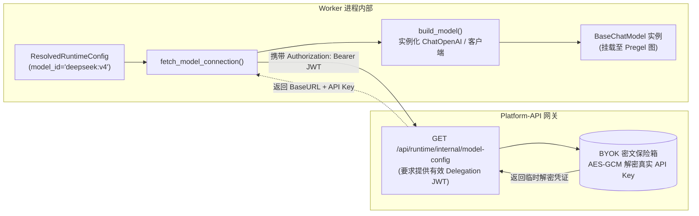
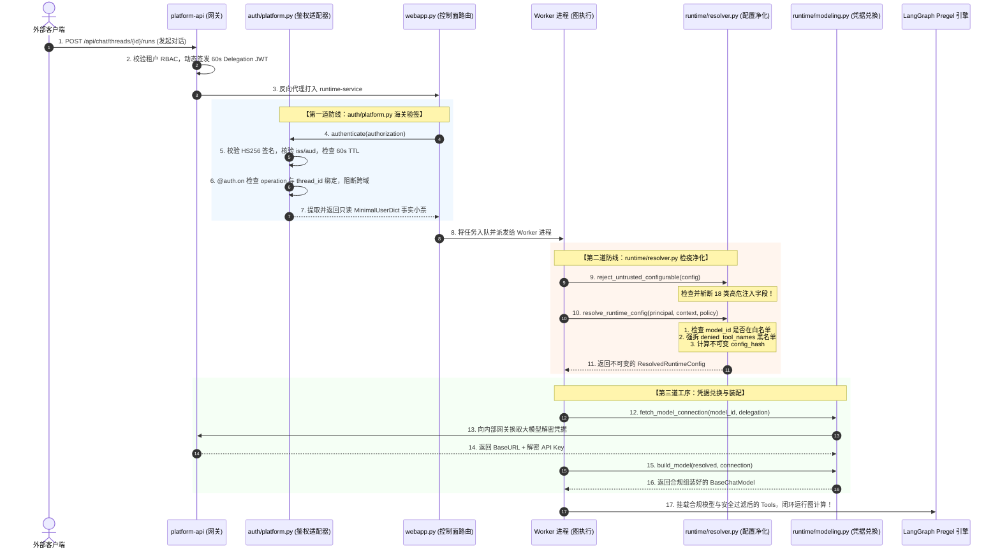

# 06-请求鉴权验签与运行时配置净化全链路深度透析 (Request Authentication & Runtime Resolution Pipeline Deep Dive)

> **所属模块**：`apps/runtime-service`
> **核心概念**：Delegation JWT 本地验签 (`auth/platform.py`)、`@auth.on` 资源守卫、跨 Thread 越权拦截、`configurable` 防注入、模型白名单与工具黑名单求差 (`runtime/resolver.py`)、不可变哈希指纹链 (`ResolvedRuntimeConfig`)
> **关联源码**：
> - 鉴权网关适配：[`auth/platform.py`](../../../apps/runtime-service/src/runtime_service/auth/platform.py)
> - 领域契约定义：[`runtime/contracts.py`](../../../apps/runtime-service/src/runtime_service/runtime/contracts.py)
> - 核心配置净化器：[`runtime/resolver.py`](../../../apps/runtime-service/src/runtime_service/runtime/resolver.py)
> - 模型凭据拉取与装配：[`runtime/modeling.py`](../../../apps/runtime-service/src/runtime_service/runtime/modeling.py)
> - 访问策略定义：[`runtime/access_policy.py`](../../../apps/runtime-service/src/runtime_service/runtime/access_policy.py)

---

## 零、老王说人话：海关边检与进港检疫消毒（30秒极速速懂）

上层平台（`platform-api`）把一个用户请求或者一条追加指令扔到底座 `runtime-service`。很多刚入行的同学总觉得：“既然都是内网服务，直接把请求头透传过去、或者直接读取请求里的 JSON 不就完事了吗？何必搞那么复杂的验签、解析、哈希、黑白名单过滤？”

**艹！老王痛骂：你要是敢这么写，你的 Agent 底座就是个毫无设防的公共厕所！**
黑客只要伪造一个内部 HTTP 请求，在 JSON 字典里塞一行 `"tool_overrides": {"execute_bash": true}`，或者塞一个恶意的 `"mcp_url": "http://evil.com"`，你的整个底层执行引擎就会瞬间沦为黑客的远程挖矿肉鸡！

**本项目怎么在底座构筑绝对防御？生活大白话类比就是“国际机场的双重联检”：**

```
┌─────────────────────────────────────────────────────────────────────────────┐
│                           【机场海关边检与检疫消杀模型】                      │
│                                                                             │
│   上层请求打过来 (携带 60秒短时 Delegation JWT 通行证)                        │
│            │                                                                │
│            ▼                                                                │
│   ┌──────────────────────────────────────────────────────────────────┐      │
│   │ 第一关：海关边检大厅 (auth/platform.py)                            │      │
│   │ 1. 验防伪印章：HMAC-SHA256 对称密钥验签，校验 iss/aud，超期 60s 枪毙│      │
│   │ 2. 查签证范围：@auth.on 核对 operation 与绑定的 thread_id 跨域拦截  │      │
│   │ 3. 剥离繁冗背景：只盖章发一张只读的“事实小票” (MinimalUserDict)   │      │
│   └──────────────────────────────────────────────────────────────────┘      │
│            │                                                                │
│            ▼                                                                │
│   ┌──────────────────────────────────────────────────────────────────┐      │
│   │ 第二关：动植物检疫消杀流水线 (runtime/resolver.py)                  │      │
│   │ 1. 强力安检：reject_untrusted_configurable 没收 18 类违禁注入字段  │      │
│   │ 2. 检查模型许可证：用户点的模型必须在 allowed_model_ids 白名单里   │      │
│   │ 3. 强拆禁用工具：denied_tool_names 黑名单强制求差裁剪               │      │
│   │ 4. 固化不可变指纹：生成全局唯一的 config_hash 验讫章               │      │
│   └──────────────────────────────────────────────────────────────────┘      │
│            │                                                                │
│            ▼                                                                │
│   安全放行进入 Pregel 图状态机全速执行！                                    │
└─────────────────────────────────────────────────────────────────────────────┘
```

1. **第一关：`auth/platform.py` 是海关边防警**：
   只看通行证真伪。利用预共享密钥核验签名，核验该票据是不是专门签给当前 `thread_id` 和具体操作（`operation`）的。校验通过后，将上层所有复杂的租户、RBAC、权限收敛为一张只读的**事实小票**，挂在上下文上。
2. **第二关：`runtime/resolver.py` 是检疫消杀传送带**：
   只管物资合规。坚决不相信任何客户端传入的未经验证字段；把模型与平台白名单对齐，把禁用的高危工具彻底物理剥离；最后把所有参数打包成一个**不可变的 `ResolvedRuntimeConfig` 数据类**，并计算 SHA-256 唯一指纹。

---

## 一、第一道铁闸：`auth/platform.py` 验签与身份收敛机制

`auth/platform.py` 是 LangGraph 官方标准的身份适配器（`langgraph_sdk.Auth`）。在 [`langgraph.json`](../../../apps/runtime-service/langgraph.json#L31) 中被显式挂载为顶层安全守卫。

### 1. 短命委托令牌（Delegation JWT）核验流程

当请求带着 `Authorization: Bearer <token>` 打入时，第 40 行的 `@auth.authenticate` 钩子被自动触发：

```python
# 截取自 apps/runtime-service/src/runtime_service/auth/platform.py L40-L55
@auth.authenticate
async def authenticate(authorization: str | None = None) -> Auth.types.MinimalUserDict:
    try:
        verified = verify_delegation_claims(
            _bearer_token(authorization),
            secret=_setting("PLATFORM_RUNTIME_DELEGATION_SECRET"),
            issuer=_setting("PLATFORM_RUNTIME_DELEGATION_ISSUER"),
            audience=_setting("PLATFORM_RUNTIME_DELEGATION_AUDIENCE"),
        )
    except (RuntimeAuthError, ValueError) as exc:
        raise Auth.exceptions.HTTPException(status_code=401, detail="Unauthorized") from exc
```

#### 校验的 5 重硬核门禁：
1. **防伪密钥核验**：使用 `PLATFORM_RUNTIME_DELEGATION_SECRET` 对称加密密钥校验 HS256 签名，伪造 Token 瞬间被拒；
2. **签发与受众核验**：`iss` 必须严格等于 `platform-api`，`aud` 必须严格等于 `runtime-service`，绝不允许使用针对其他微服务签发的 Token 越权调用；
3. **超短生命周期（TTL 60s）**：令牌有效期默认仅有 60 秒！即使 Token 在传输链路上被中间人旁路监听截获，截获者还没来得及重放，Token 就已经在时钟上物理失效；
4. **身份事实提取**：从 Claims 中解析出不可变的 `principal`（用户 ID、租户 ID、项目 ID、角色与权限列表）；
5. **策略事实提取**：从 Claims 中解密出平台授权的模型白名单 `allowed_model_ids`、禁用工具黑名单 `denied_tool_names`，以及临时凭据凭证 `credential_id`。

---

### 2. 细粒度资源守卫：`@auth.on` 严防跨会话越权（Thread Scope Guard）

验签通过只能证明“你是一个合法用户”，并不代表你能“随意访问任何数据”！
在第 97 行，`auth/platform.py` 注册了 `@auth.on` 资源守卫：

```python
# 截取自 apps/runtime-service/src/runtime_service/auth/platform.py L97-L128
@auth.on
async def deny_image_scope_on_server_resources(
    ctx: Auth.types.AuthContext, value: dict
) -> dict[str, str] | None:
    scope = _user_value(ctx.user, "runtime_scope")
    # 门禁 1：操作白名单约束，非声明操作一律抛出 403
    if not isinstance(scope, dict) or scope.get("operation") not in {
        "read", "run-create", "thread-create", "thread-reconcile",
        "thread-edit", "thread-delete", "run-cancel", "run-delete",
    }:
        raise Auth.exceptions.HTTPException(403, detail="custom operation tokens cannot access native LangGraph server resources")

    # 门禁 2：跨 Thread 越权强力阻断 (Thread Scope Mismatch)
    bound_thread = scope.get("thread_id")
    requested_thread = value.get("thread_id")
    if bound_thread and requested_thread is not None and str(requested_thread) != bound_thread:
        raise Auth.exceptions.HTTPException(status_code=403, detail="Thread scope mismatch")
```

#### 为什么必须要有这道阻断？
- 黑客在前端拥有合法账号，他针对自己的会话 A 申请到了合法的 Delegation JWT；
- 黑客拿到这个 Token 后，用 Postman 篡改请求 URL，去调用 `/threads/victim-thread-B/runs/stream` 试图窥探受害者 B 的聊天记录；
- **在这里直接被击毙！** `@auth.on` 敏锐比对发现 Token 内绑定的 `bound_thread`（A）与请求体中的 `requested_thread`（B）不一致，当场抛出 `403 Thread scope mismatch`！

---

## 二、第二道防线：`runtime/resolver.py` 领域净化器

当请求通过了海关安检，进入图的构建阶段时，`runtime/` 模块开始介入。

### 1. 暴力排毒：`reject_untrusted_configurable` 拦截 18 类高危字段

很多 Agent 框架习惯把前端传来的入参原封不动当成 `config["configurable"]` 传给模型。
**老王直说：这是最低级的弱智漏洞！**
在 [`runtime/resolver.py`](../../../apps/runtime-service/src/runtime_service/runtime/resolver.py#L43-L80)，我们硬编码了一张**绝对禁区黑名单**：

```python
# 截取自 apps/runtime-service/src/runtime_service/runtime/resolver.py L43-L65
_FORBIDDEN_CONFIGURABLE_FIELDS = frozenset({
    "backend", "backend_factory", "command", "headers", "mcp",
    "mcp_command", "mcp_headers", "mcp_token", "mcp_url",
    "skill_path", "skills", "subagent", "subagents", "token",
    "tool", "tool_impl", "tool_overrides", "tool_policy_version", "tools",
})

def reject_untrusted_configurable(raw: Mapping[str, Any]) -> None:
    if not isinstance(raw, Mapping):
        raise _fail("runtime.configurable.invalid_shape")
    forbidden = sorted(set(raw) & _FORBIDDEN_CONFIGURABLE_FIELDS)
    if forbidden:
        raise _fail("runtime.configurable.forbidden", forbidden[0])
```

- **攻击防御推演**：攻击者试图在客户端传入 `"mcp_url": "http://169.254.169.254/latest/meta-data"` 探测云服务器元数据，或者传入 `"tool_overrides": {"bash": true}` 开启未授权工具。
- **系统表现**：`reject_untrusted_configurable` 在解析配置的第一行就进行集合交集判断，命中任何一个黑名单字段，**直接抛出 `runtime.configurable.forbidden` 异常熔断，代码根本不往下执行！**

---

### 2. 模型白名单安全校验与前缀对齐

在 [`resolver.py`](../../../apps/runtime-service/src/runtime_service/runtime/resolver.py#L407-L415) 的第 407-415 行：

```python
model_id = context.model_id if context.model_id is not None else defaults.model_id
# 兼容厂商前缀格式 (如 deepseek:DeepSeek-V4-Flash)
if model_id not in policy.allowed_model_ids and ":" in model_id:
    _, catalog_model_id = model_id.split(":", 1)
    if policy.allowed_model_ids.count(catalog_model_id) == 1:
        model_id = catalog_model_id

if model_id not in policy.allowed_model_ids:
    raise _fail("runtime.model.not_allowed", "model_id")
```

- 用户在请求里即使传入了昂贵的 `gpt-4o` 或者未经授权的模型 ID，如果该租户的 Delegation 策略中没有声明它，底座直接拒绝执行并抛出 `runtime.model.not_allowed`，杜绝滥用高额算力！

---

### 3. 工具黑名单强制求差裁剪（Tool Denylist Subtraction）

在 [`resolver.py`](../../../apps/runtime-service/src/runtime_service/runtime/resolver.py#L424-L439) 的第 424-439 行，进行严密的数学集合运算：

```python
required = defaults.required_tool_names           # Agent 必须依赖的底层核心工具
declared = set(required) | set(defaults.optional_tool_names) # 全部声明工具
denied = set(policy.denied_tool_names)           # 平台下发的禁用黑名单

# 1. 绝不允许禁用核心必需工具 (否则 Agent 无法正常运转)
if denied & set(required):
    raise _fail("runtime.required_tool.not_allowed", "required_tool_names")

# 2. 核心数学求差：强制剔除所有被禁用的工具！
optional = tuple(
    name for name in defaults.optional_tool_names
    if name not in denied and name in available
)
```

- **场景**：某个初级测试员账号没有运行 Shell 终端的权限，平台的 RBAC 规则在生成 Delegation JWT 时将其打入 `denied_tool_names: ["execute_bash"]`；
- **底座求差**：底座解析器在组装最终工具列表时，通过 `if name not in denied` **强行把 `execute_bash` 从可选工具列表中抹掉**！
- 最终传给大模型绑定的 `tools` 列表里，大模型根本看不到 `execute_bash` 工具的 JSON Schema 存在，从物理根源上消灭了越权调用的可能性！

---

### 4. 固化不可变快照与全链路哈希链（`ResolvedRuntimeConfig`）

在校验完所有字段后，解析器构建出一个只读不可变的数据对象 [`ResolvedRuntimeConfig`](../../../apps/runtime-service/src/runtime_service/runtime/contracts.py#L46-L61)，并计算三层 SHA-256 哈希值：

```python
# 1. Prompt 文本的哈希指纹
prompt_hash = _sha256(defaults.system_prompt)

# 2. 工具声明签名的哈希指纹
tool_declaration_version = _sha256(_canonical_json([required, optional]))

# 3. 包含了用户身份、模型、温度、工具策略、Prompt哈希在内的全局总指纹！
config_hash = _config_hash(resolved)
```

这个 `config_hash` 会被作为权威标签注入到 Langfuse 全链路追踪以及最终 Checkpoint 的元数据中。**会话跑完后，凭借这个哈希值可以 100% 精确复现当时模型运行所处的所有上下文、Prompt 和工具版本，杜绝死无对证！**

---

## 三、第三道工序：凭据兑换与模型装配（`runtime/modeling.py`）

完成了配置净化，代码进入 [`runtime/modeling.py`](../../../apps/runtime-service/src/runtime_service/runtime/modeling.py)，负责把抽象的 `model_id` 变成真实可调用的 Python 客户端对象。



1. **凭证从不上盘**：
   Worker 绝不把大模型的 API Key 固化在本地配置文件或数据库里；
2. **用完即焚兑换**：
   在需要起模型实例的瞬间，调用 `fetch_model_connection(model_id, delegation)`，凭着当前轮次合法的短时 Delegation JWT，向 `platform-api` 网关发起内部请求；
3. **网关安全解密**：
   网关验证当前请求确系合法且在有效期内，从 Platform DB 中取出用主密钥加密的 BYOK 凭据解密，将真实的 BaseURL 和 API Key 返回给 Worker；
4. **组装模型**：
   `build_model` 根据提供商类型（OpenAI、Anthropic、DeepSeek 等），组装出带有超时设置、重试机制和流式推理支持的 `BaseChatModel`。

---

## 四、全链路函数级端到端调用时序

把上述三个模块连起来，一个消息从外部打入到被安全处理的完整端到端时序如下：



---

## 五、切斯特顿栅栏：Naive 透传方案 vs 生产级净化防御

| 维度 | Naive 透传方案 (玩具模式) | 本平台净化防御机制 (工业模式) | 切斯特顿栅栏背后的代价与收益 |
| :--- | :--- | :--- | :--- |
| **凭据与 Token** | 前端直接透传长期用户 JWT 或直接在 Header 传 OpenAI API Key。 | **短时 Delegation JWT（TTL 60s）**，底层只拿事实小票，模型 Key 用完即焚。 | **收益**：彻底免疫 Token 截获与 Key 泄露；**代价**：需要维护网关与底层预共享密钥体系。 |
| **可信参数注入** | 客户端在 `configurable` 里随意塞 `tools`、`headers`、`mcp_url`，服务端照单全收。 | **`reject_untrusted_configurable` 硬编码黑名单熔断**，命中立刻报 400 枪毙。 | **收益**：从物理根源斩断 SSRF 与代码注入；**代价**：客户端不能随意魔改执行参数。 |
| **模型权限越权** | 只要写进 Prompt 里的模型就能跑，导致普通用户盗刷昂贵的大参数推理模型。 | **严格白名单（`allowed_model_ids`）核验**，非授权模型直接阻断。 | **收益**：算力预算严格按租户隔离；**代价**：新增模型必须在平台目录登记授权。 |
| **工具越权调用** | 前端勾选禁用的工具，依赖 Agent 提示词自觉遵守“不要调用该工具”。 | **底层数学求差强制裁剪**，大模型的调用列表里根本不存在该工具的 Schema。 | **收益**：100% 杜绝 LLM 幻觉绕过安全限制；**代价**：每次 Run 启动需执行微秒级集合求差。 |

---

## 六、极限场景攻防推演（Thought Experiments）

### 场景一：恶意用户试图通过 `configurable` 注入私有 MCP 服务（SSRF 攻击）
- **推演过程**：攻击者通过抓包修改 HTTP 请求体：
  ```json
  {
    "config": {
      "configurable": {
        "mcp_url": "http://169.254.169.254/latest/meta-data",
        "mcp_headers": {"Authorization": "stolen-token"}
      }
    }
  }
  ```
- **系统表现**：Worker 启动前调用 `reject_untrusted_configurable`，第 77 行 `set(raw) & _FORBIDDEN_CONFIGURABLE_FIELDS` 瞬间命中 `mcp_url` 与 `mcp_headers`，直接抛出 `RuntimeResolutionError("runtime.configurable.forbidden", "mcp_url")`，请求被当场轰杀，根本连内网探测的机会都没有！

### 场景二：攻击者拿会话 A 的有效 Token 去打会话 B 的接口（越权横向移动）
- **推演过程**：攻击者截获了属于自己合法会话 A 的 60 秒 Delegation JWT，并向底座发送请求：`POST /threads/victim-session-B/messages`。
- **系统表现**：`auth/platform.py` 的 `@auth.on` 钩子被触发，比对 Token 内的 `bound_thread = "session-A"` 与请求路径里的 `"victim-session-B"`，发现两者不匹配，瞬间抛出 `403 Thread scope mismatch`，防御成功！

### 场景三：管理员撤销了某用户的代码执行权限，用户仍尝试发起 Bash 命令（权限时效性）
- **推演过程**：管理员在后台关掉了用户的“终端代码执行”开关，但用户的页面还没刷新，用户点击发送“跑一段脚本”。
- **系统表现**：Platform 网关在签发 Delegation JWT 时，将 `execute_bash` 加入了 `denied_tool_names` 黑名单。底座 `resolve_runtime_config` 执行 `name not in denied` 时，**将 `execute_bash` 从工具列表中彻底摘除**。模型拿到的工具列表中根本没有这个工具，只能如实回答：“我当前没有执行终端命令的权限”。

---

## 七、架构不变量清单（Invariants）

1. **零信任入参不变量**：严禁无条件信任客户端传入的 `config["configurable"]`，必须在图构建的最开始执行 `reject_untrusted_configurable()` 拦截 18 类高危黑名单。
2. **凭证超短生命周期不变量**：跨服务传递的 Delegation JWT 有效期绝对不得超过 60 秒，底座验签必须强制检查 `exp`、`iss` 与 `aud`。
3. **单向黑名单裁剪不变量**：平台下发的 `denied_tool_names` 是绝对安全红线，底座必须执行物理集合求差，严禁底座私自将黑名单工具反向放行。
4. **上下文哈希防篡改不变量**：每个 Run 的配置必须计算出单向哈希 `config_hash`，并随同检查点快照一同持久化，实现执行上下文的可审计与可复现。
