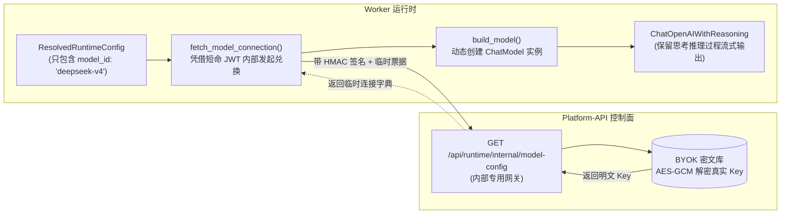

# 07-Runtime 核心内核模块源码全景剖析与职责透析 (Runtime Core Module Anatomy & Responsibilities)

> **所属模块**：`apps/runtime-service/src/runtime_service/runtime/`
> **核心概念**：底座纯逻辑内核（Pure Domain Kernel）、不可变契约、无副作用消杀、动态凭据兑换、线程资源强绑定
> **涉及文件**：`__init__.py`, `contracts.py`, `errors.py`, `runtime_config.py`, `auth.py`, `resolver.py`, `modeling.py`, `access_policy.py`, `tool_access.py`, `capabilities.py`, `resource_bindings.py`（共 11 个核心文件）

---

## 零、老王说人话：这 11 个文件到底在干嘛？（30秒极速通透）

很多刚入行接触 LangGraph 的新手，脑子里总以为开发 Agent 就是“画几条边、连几个节点、把 Prompt 塞给大模型”的玩具拼图。

**艹！老王痛骂：你要是只懂连连看，那叫调包侠玩具！去企业级多租户生产环境上线一天，不被黑客把服务器打成肉鸡、或者被用户偷刷大模型账单破产，老王我把键盘生吞了！**

底座 `apps/runtime-service/src/runtime_service/runtime/` 目录下的这 11 个文件，**根本不涉及具体的 LangGraph 图节点业务逻辑**，它干的事情比画图重要一万倍——**它是执行层的“纯逻辑安全内核（Pure Domain & Security Kernel）”！**

### 模块全景速查对照表（Typora 极速浏览）

| 文件名 | 职责定位 (一句话大白话) | 核心暴露类 / 函数 | 生产避坑与安全死穴 |
| :--- | :--- | :--- | :--- |
| [`contracts.py`](contracts.py) | **不可变数据类总纲**：定义身份、上下文、策略与最终配置的强类型数据结构。 | `RuntimePrincipal`, `RuntimeContext`, `RuntimePolicy`, `ResolvedRuntimeConfig` | 坚决使用 `frozen=True, slots=True`，杜绝运行时任何模块动态篡改字段。 |
| [`errors.py`](errors.py) | **安全防泄露异常定义**：脱敏错误基类，严禁包含任何敏感 Payload。 | `RuntimeErrorBase`, `RuntimeResolutionError`, `RuntimeAuthError` | 报错只准吐出枚举 Code 和字段名，杜绝向前端或日志泄露凭据和内网堆栈。 |
| [`runtime_config.py`](runtime_config.py) | **Context 边界隔离适配器**：安全读取 LangGraph 的 `runtime.context`。 | `context_from_runtime`, `parse_context` | 阻止业务节点随意向底层 Context 写入垃圾数据，提供统一干净的入参视图。 |
| [`auth.py`](auth.py) | **纯算法级 JWT 验签器**：脱离 Web 框架的纯数学 claims 校验引擎。 | `verify_delegation_claims`, `VerifiedDelegation`, `RuntimeScope` | 强制核验 60s TTL、HS256 签名与操作范围，阻断非授权指令与跨租户横向越权。 |
| [`resolver.py`](resolver.py) | **消杀净化与组装总车间**：整个目录代码量最大（近600行）的总装配厂。 | `reject_untrusted_configurable`, `resolve_runtime_config`, `runtime_config_snapshot` | 拦截 18 类高危注入、模型白名单匹配、工具黑名单物理求差、生成防篡改 `config_hash`。 |
| [`modeling.py`](modeling.py) | **模型工厂与凭据用完即焚**：动态换取解密 API Key 并实例化 ChatModel。 | `fetch_model_connection`, `build_model`, `ChatOpenAIWithReasoning` | 凭据永不上盘、支持 DeepSeek/OpenAI/Anthropic、保留大模型 Reasoning 思考流。 |
| [`access_policy.py`](access_policy.py) | **会话级工具审批中断策略**：控制哪些工具调用必须暂停等待人工确认。 | `interrupts_for_access_policy`, `REVIEW`, `WORKSPACE_WRITE`, `FULL_ACCESS` | 将复杂的人工审批（HITL）收敛为 3 档策略，按需放行只读或工作区写操作。 |
| [`tool_access.py`](tool_access.py) | **HTTP 直接调用守卫**：对不经过 Agent 图的外部直接工具调用进行策略核验。 | `require_tool_access` | 防止有人绕过 Agent 图逻辑直接发 HTTP 请求偷跑敏感底层工具。 |
| [`capabilities.py`](capabilities.py) | **无副作用图能力清单**：静态声明每个已部署 Agent 自带的工具资产池。 | `graph_tools`, `tool_catalog`, `SHOWCASE_TOOLS` | 只读声明，绝不授权；向 Platform Catalog 上报当前运行时有哪些开箱即用工具。 |
| [`resource_bindings.py`](resource_bindings.py) | **线程资源强绑定与隔离**：把沙箱工作区与会话 Thread 锁死在一张小票上。 | `RuntimeResourceBinding`, `resolve_resource_binding`, `thread_resource_metadata` | 杜绝会话 A 读写会话 B 的代码沙箱或挂载目录，物理级多租户目录隔离。 |
| [`__init__.py`](__init__.py) | **统一对外面板门面**：把内部纯函数安全收敛，对外提供扁平干净的导入入口。 | `__all__` 导出列表 | 严格限制公有 API 边界，避免外部直接 import 内部下划线私有工具函数。 |

---

## 一、底层基石：不可变契约与脱敏异常体系

### 1. `contracts.py`：坚如磐石的强类型数据总纲

在 Python 这种动态语言里，最大的灾难就是“中间件 A 往字典里塞个字段，中间件 B 把它改了，到了下游图节点读出来完全走形”。
[`contracts.py`](../../../apps/runtime-service/src/runtime_service/runtime/contracts.py) 彻底终结了这种野路子写法：

```python
# contracts.py
@dataclass(frozen=True, slots=True)
class RuntimePrincipal:
    user_id: str
    tenant_id: str
    project_id: str
    role: str
    permissions: tuple[str, ...]

@dataclass(frozen=True, slots=True)
class ResolvedRuntimeConfig:
    principal: RuntimePrincipal
    model_id: str
    temperature: float | None
    max_tokens: int | None
    top_p: float | None
    required_tool_names: tuple[str, ...]
    optional_tool_names: tuple[str, ...]
    prompt_version: str
    prompt_hash: str
    policy_version: str
    config_hash: str  # 全局确定性单向 SHA-256 签名
    tool_policy_version: str
    tool_declaration_version: str
    execution_mode: str | None = None
```

> **老王点拨要害**：
> 1. `frozen=True`：任何人在下游尝试 `config.model_id = "evil"` 都会当场抛出 `FrozenInstanceError` 暴毙！
> 2. `slots=True`：消除 `__dict__` 内存开销，执行速度极快，且严禁动态注入任何未声明属性！
> 3. `tuple[str, ...]`：工具列表和权限列表坚决不用可变列表 `list`，必须用只读元组，防止外部 `list.append()` 偷渡工具。

---

### 2. `errors.py`：零信息泄露的安全异常防线

很多初级程序员喜欢直接把异常对象往前端抛：`raise Exception(f"Failed to connect {db_url} with password {pwd}")`，黑客乐得后槽牙都笑掉了！
[`errors.py`](../../../apps/runtime-service/src/runtime_service/runtime/errors.py) 制定了铁律：

```python
# errors.py
class RuntimeErrorBase(ValueError):
    def __init__(self, code: str, field: str | None = None) -> None:
        self.code = code
        self.field = field
        super().__init__(code)

class RuntimeResolutionError(RuntimeErrorBase): ...
class RuntimeAuthError(RuntimeErrorBase): ...
```
- **核心规矩**：底座内抛出的安全和解析异常，**只携带机器可读的错误码（如 `runtime.model.not_allowed`）和可选的违规字段名（如 `model_id`）**。
- 绝不允许将用户输入的真实敏感数据（API Key、SQL 语句、恶意 URL）拼接到异常消息中，杜绝日志污染与侧信道泄露。

---

## 二、安全与准入中枢：纯逻辑验签与上下文隔离

### 1. `auth.py`：纯算法级 Delegation JWT 验签器

在前面我们学过 `auth/platform.py`，很多人会纳闷：为什么有两个 `auth`？
- `auth/platform.py`：负责对接 FastAPI 和 LangGraph 的 Web 协议栈（处理 HTTP Request、提取 Header、注册 `@auth.on` 钩子）；
- [`runtime/auth.py`](../../../apps/runtime-service/src/runtime_service/runtime/auth.py)：是**纯粹的领域层算法代码**，不依赖任何 HTTP 框架，可以在 0.001 秒的离线单元测试里独立运行！

```python
# runtime/auth.py 核心核验逻辑
def verify_delegation_claims(
    token: str,
    *,
    secret: str,
    issuer: str,
    audience: str | None = None,
    ...
) -> VerifiedDelegation:
    # 1. 严格使用 HS256 解码，强行校验过期时间 exp 与签发方 iss
    # 2. 严厉比对 claims 字段白名单，多一个非法 claim 直接枪毙
    unknown = set(claims) - _ALLOWED_CLAIMS
    if unknown:
        raise _invalid(field=min(unknown))

    # 3. 校验租户上下文一致性，杜绝跨租户跨项目
    if claims.get("policy_tenant_id", principal.tenant_id) != principal.tenant_id:
        raise _invalid("runtime.auth.invalid_principal", "tenant_id")
```
- 该文件解析出只读的 `VerifiedDelegation`，包含经过数学验证的 `principal`、`policy` 和 `scope`，为下一步的消杀提供事实依据。

---

### 2. `runtime_config.py`：Context 边界防腐适配器

LangGraph 内部有一个 `runtime.context` 对象。
[`runtime_config.py`](../../../apps/runtime-service/src/runtime_service/runtime/runtime_config.py) 充当了一个微小的防腐层适配器：

```python
def context_from_runtime(runtime: object) -> RuntimeContext:
    """读取 runtime.context，但绝不污染或篡改底层 LangGraph 原始对象"""
    return parse_runtime_context(getattr(runtime, "context", None))
```
它确保业务 Agent 在读取上下文时，走的是经过 `resolver.py` 严格校验过的 `RuntimeContext` 强类型，杜绝读取未经检验的杂质。

---

## 三、总装配车间：消杀工厂 `resolver.py` 的四大工序

[`resolver.py`](../../../apps/runtime-service/src/runtime_service/runtime/resolver.py) 是整个内核的“中枢大脑”，近 600 行纯函数装配代码，负责把所有散落的输入组装成最终的不可变配置。

```
                       【resolver.py 四大装配工序】

  外部上下文 (Context)   平台策略 (Policy)   代码默认值 (Defaults)
          │                     │                     │
          ▼                     ▼                     ▼
┌─────────────────────────────────────────────────────────────┐
│ 工序 1：强力杀毒 (reject_untrusted_configurable)             │
│ 扫描 18 类高危保留字段 (mcp_url / tool_overrides / command) │
└──────────────────────────────┬──────────────────────────────┘
                               │
                               ▼
┌─────────────────────────────────────────────────────────────┐
│ 工序 2：模型白名单安全对齐 (Model Whitelist Check)           │
│ model_id 必须存在于 policy.allowed_model_ids 白名单中      │
└──────────────────────────────┬──────────────────────────────┘
                               │
                               ▼
┌─────────────────────────────────────────────────────────────┐
│ 工序 3：工具黑名单物理求差 (Tool Denylist Subtraction)       │
│ denied = set(policy.denied_tool_names)                      │
│ optional = [name for name in tools if name not in denied]   │
└──────────────────────────────┬──────────────────────────────┘
                               │
                               ▼
┌─────────────────────────────────────────────────────────────┐
│ 工序 4：生成全局唯一防篡改哈希 (config_hash) 与快照固化     │
│ prompt_hash + tool_declaration_hash -> config_hash          │
└──────────────────────────────┬──────────────────────────────┘
                               │
                               ▼
           产出绝对安全不可变的 ResolvedRuntimeConfig！
```

### 核心函数清单速查

1. **`reject_untrusted_configurable(raw)`**：
   - 包含 `_FORBIDDEN_CONFIGURABLE_FIELDS`（18 个高危键：`backend`, `command`, `mcp_url`, `tool_overrides`, `tools` 等）；
   - 只要调用方试图通过 `configurable` 字典传递上述任何一个键，直接抛错熔断。
2. **`resolve_runtime_config(...)`**：
   - 核心纯函数。将 `principal`、`context`、`policy`、`defaults` 四项事实输入融合；
   - 执行模型白名单检查、必需工具可用性检查、工具黑名单物理求差裁剪；
   - 计算不可变的全局唯一签名 `config_hash`。
3. **`runtime_config_snapshot(config)` 与 `resolved_runtime_config_from_snapshot(raw)`**：
   - **确定性快照序列化与反序列化**；
   - 遵循 `schema: runtime-config/v3` 规范，不携带任何敏感密钥；
   - 反序列化时执行严格签名验算，**哪怕快照被黑客篡改了 1 个字符，哈希比对失败直接拒绝反序列化**！

---

## 四、动态凭据与模型工厂：`modeling.py` 的解密流水线

大模型的 API Key 该怎么放？硬编码在 `config.yaml` 里？还是作为环境变量扔给 Worker 容器？
**老王痛骂：谁要是这么干，一旦 Worker 跑黑客代码被提权，你的几十张企业级 API Key 瞬间全网公开！**

[`modeling.py`](../../../apps/runtime-service/src/runtime_service/runtime/modeling.py) 实现了一套优雅的**零信任凭据兑换架构**：



### 1. `fetch_model_connection`：用完即焚拉取
Worker 只拿到一个不透明的引用或者只有模型 ID，在装配前向控制面发起内部调用。控制面解密后返回，Worker 在内存中装配完后立即丢弃原始报文，**Key 永不写入日志、永不上盘、绝不存进数据库！**

### 2. `ChatOpenAIWithReasoning`：深度思考模型的守护者
在对接 DeepSeek-R1、o1 等带有推理链路（Reasoning Content）的新一代模型时，官方标准的 `ChatOpenAI` 经常把模型的思考过程直接丢弃掉。
`modeling.py` 内部专门扩展了 `ChatOpenAIWithReasoning`，在 `_create_chat_result` 和 `_convert_chunk_to_generation_chunk` 中：
```python
reasoning = _reasoning_text(choice.get("message", {}))
if reasoning:
    generation.message.additional_kwargs["reasoning_content"] = reasoning
```
这使得流式推理时，前端不仅能拿到最终回答，还能实时拿到模型的思考链（Thought Process）！

---

## 五、动态安全策略与资源隔离体系

### 1. `access_policy.py`：人工审批中断策略矩阵

Agent 调用高危工具（如删库、写文件、执行终端命令）时，到底要不要中断暂停（Interrupt）等人确认？
[`access_policy.py`](../../../apps/runtime-service/src/runtime_service/runtime/access_policy.py) 抽象出了 3 档极简的会话级安全策略：

```python
REVIEW = "review"                    # 严格人工审批：所有敏感工具调用全部挂起等待批准
WORKSPACE_WRITE = "workspace_write"  # 允许工作区写：文件读写不中断，只有提权/高危操作才中断
FULL_ACCESS = "full_access"          # 全通放行：用于自动化流水线，所有工具调用免审批
```
通过 `interrupts_for_access_policy` 函数，一键算出当前 Run 到底该挂载哪些中断点，杜绝业务代码里到处写乱七八糟的 `if` 判断！

---

### 2. `tool_access.py`：HTTP 端点的直调防越权门禁

除了 Agent 图内部会调工具，前端有时也会通过 HTTP 端点直接请求底座执行某个工具（如直接查询文档、读取特定引用）。
[`tool_access.py`](../../../apps/runtime-service/src/runtime_service/runtime/tool_access.py) 专门提供了一个守卫函数：

```python
def require_tool_access(facts: dict, *names: str) -> None:
    # 1. 验证目标工具是否在该 Agent 允许的静态声明列表中
    # 2. 验证目标工具是否在用户当前的 denied_tool_names 黑名单中
    # 只要踩中任何一条，当场抛出 403 Forbidden ("runtime.tool.not_allowed")！
```
这保证了**无论走图执行引擎，还是走直接 HTTP 调用，权限控制都是同一套底层算子在卡门禁**，绝无“后门走水路”的可能！

---

### 3. `capabilities.py`：静态图能力清单

[`capabilities.py`](../../../apps/runtime-service/src/runtime_service/runtime/capabilities.py) 是纯只读的元数据字典，它负责向外宣告：底座现在部署了哪些图（`dearflow_agent`, `showcase_demo`, `reference_agent`），每个图默认自带哪些工具（如 `read_reference`, `write_todos`, `task` 等）。
它提供 `tool_catalog()` 函数供 Platform-API 网关拉取 Catalog，在管理后台展示工具列表。

---

### 4. `resource_bindings.py`：会话资源强绑定与多租户铁壁

在 Agent 运行过程中，它往往会绑定专属的底层系统资源，比如：
- 本地沙箱的工作区路径（`workspace_root`）；
- PTY 伪终端的会话 ID；
- 挂载的临时缓存盘。

如果不做严格绑定，黑客张三只要在请求里传李四的 `workspace_id`，就能把李四代码库里的文件读光！
[`resource_bindings.py`](../../../apps/runtime-service/src/runtime_service/runtime/resource_bindings.py) 引入了 `runtime-resource-bindings/v1` 契约：

```python
@dataclass(frozen=True, slots=True)
class RuntimeResourceBinding:
    kind: str           # 比如 "workspace"
    provider: str       # 比如 "dear_workspace"
    resource_id: str    # 资源唯一 ID
    tenant_id: str      # 归属租户
    project_id: str     # 归属项目
    thread_id: str      # 归属会话 Thread
```
在恢复资源时，`resolve_resource_binding` 会进行三位一体的三重比对：
```python
if (
    values["tenant_id"] != principal.tenant_id
    or values["project_id"] != principal.project_id
    or values["thread_id"] != thread_id
):
    raise _failed(kind)  # 只要有任何一项对不上，立即抛出 recovery_failed 熔断！
```
从物理底层彻底焊死了跨租户、跨项目、跨会话偷渡资源的漏洞！

---

## 六、端到端协作全景：11 个文件是如何联合作战的？（真实案例推演）

光看理论架构图不够过瘾，老王拿一个**真实的生产级业务与攻防案例**，带你看看这 11 个文件是如何像瑞士钟表里的齿轮一样，严丝合缝、步步为营地联合作战的！

---

### 1. 真实场景设定 (The Scenario Setup)

- **用户身份**：企业开发工程师“张三”
  - 租户 ID：`tenant_acme`
  - 项目 ID：`proj_crawler`
  - 角色：`developer`
  - 会话 Thread：`thread_404_abc`
- **用户在前端发起的指令**：
  > “帮我分析这个 GitHub 仓库的代码，用 Python 编写爬虫脚本并运行测试，把结果写进沙箱工作区。”
- **请求配置与环境设定**：
  - 目标 Agent：`dearflow_agent`
  - 用户指定模型：`deepseek:DeepSeek-V4`
  - 用户指定模式：`standard`
  - 会话审批策略：`access_policy = "review"`（高危操作需人工审批）
  - 平台 RBAC 限制：公司审计要求封禁终端任意命令执行，下发黑名单 `denied_tool_names = ("execute_bash",)`
  - 恶意注入测试：黑客试图在请求体 `configurable` 里偷偷塞入 `"mcp_url": "http://169.254.169.254/metadata"` 探测云主机元数据，以及 `"tool_overrides": {"execute_bash": true}` 试图绕过封禁。

---

### 2. 真实推演：11 个文件的 8 步战役流转

```
  [客户端发出请求] (携带 60s Delegation JWT + 恶意注入字段)
         │
         ▼
┌─────────────────────────────────────────────────────────────────────────────┐
│ 步骤 1：auth.py (纯算法身份验签与解算)                                      │
│ • 调用 verify_delegation_claims(token, secret=..., issuer="platform-api") │
│ • 验证 HS256 对称签名通过，当前系统时间在 60s TTL 之内                     │
│ • 解构出不可变 Principal: 张三 (tenant_acme, proj_crawler)                   │
│ • 解构出不可变 Policy: 允许 [DeepSeek-V4, gpt-4o-mini], 禁用 [execute_bash] │
│ • 解构出不可变 Scope: 操作为 run-create，绑死在 thread_404_abc 上           │
└──────────────────────────────────────┬──────────────────────────────────────┘
                                       │
                                       ▼
┌─────────────────────────────────────────────────────────────────────────────┐
│ 步骤 2：runtime_config.py (入参边界防腐)                                    │
│ • context_from_runtime(runtime) 安全提取上下文                              │
│ • 解析出强类型 RuntimeContext(model_id="deepseek:DeepSeek-V4", policy="review")│
│ • 阻止任何未定义字段穿透到底层                                               │
└──────────────────────────────────────┬──────────────────────────────────────┘
                                       │
                                       ▼
┌─────────────────────────────────────────────────────────────────────────────┐
│ 步骤 3：resolver.py (消杀总装车间第一锤：防注入扫杀)                        │
│ • reject_untrusted_configurable(configurable) 启动扫描                      │
│ • 瞬间抓包黑客注入的 "mcp_url" 和 "tool_overrides" 字段！                   │
│ • 触发 errors.py: 立即抛出 RuntimeResolutionError("runtime.configurable.forbidden")│
│ • 假设消除了恶意字段后正常重试，继续进入下一步消杀                          │
└──────────────────────────────────────┬──────────────────────────────────────┘
                                       │
                                       ▼
┌─────────────────────────────────────────────────────────────────────────────┐
│ 步骤 4：capabilities.py + resolver.py (模型对齐与工具物理求差)              │
│ • 模型对齐：剥离 "deepseek:" 前缀，命中 policy.allowed_model_ids 白名单     │
│ • 工具资产池：capabilities.py 声明 dearflow_agent 自带 (read, write, bash...)│
│ • 核心求差：denied = {"execute_bash"}                                       │
│   optional = [t for t in declared if t not in denied]                        │
│ • 物理裁剪："execute_bash" 从可用工具列表彻底抹除！大模型甚至拿不到它的 Schema│
│ • 哈希固化：生成 config_hash = "sha256:7f8a9b..."                           │
│ • 产出不可变实例：ResolvedRuntimeConfig (来自 contracts.py)                 │
└──────────────────────────────────────┬──────────────────────────────────────┘
                                       │
                                       ▼
┌─────────────────────────────────────────────────────────────────────────────┐
│ 步骤 5：modeling.py (凭据用完即焚拉取与大模型工厂)                          │
│ • Worker 本地没有任何 API Key，调用 fetch_model_connection()               │
│ • 凭借 Delegation JWT 打入内部端点 GET /api/runtime/internal/model-config   │
│ • Platform 校验解密 BYOK，返回 BaseURL 与真实 API Key (内存临时字典)        │
│ • build_model() 实例化 ChatOpenAIWithReasoning 客户端                       │
│ • 内存字典随即被 Python GC 回收，真实 API Key 永不上盘、永不打日志           │
│ • ChatOpenAIWithReasoning 自动开启 reasoning_content 流式捕获               │
└──────────────────────────────────────┬──────────────────────────────────────┘
                                       │
                                       ▼
┌─────────────────────────────────────────────────────────────────────────────┐
│ 步骤 6：access_policy.py (动态审批中断点计算)                               │
│ • 读入 context.access_policy = "review"                                      │
│ • 调用 interrupts_for_access_policy("review", default_approvals)            │
│ • 计算判定：write_file 等敏感写操作必须挂起中断 (Interrupt)，等待人工授权   │
└──────────────────────────────────────┬──────────────────────────────────────┘
                                       │
                                       ▼
┌─────────────────────────────────────────────────────────────────────────────┐
│ 步骤 7：resource_bindings.py (沙箱工作区强绑定与防越权隔离)                 │
│ • Agent 准备在沙箱中创建项目目录，发起工作区资源解析                        │
│ • resolve_resource_binding() 执行三重比对：                                 │
│   tenant_id == "tenant_acme" 且 project_id == "proj_crawler" 且 thread_id == "thread_404_abc"│
│ • 匹配成功！安全挂载沙箱卷：/workspaces/tenant_acme/proj_crawler/thread_404_abc│
│ • 杜绝张三通过修改相对路径越权读取李四的财务项目目录                         │
└──────────────────────────────────────┬──────────────────────────────────────┘
                                       │
                                       ▼
┌─────────────────────────────────────────────────────────────────────────────┐
│ 步骤 8：安全交付 Pregel 图引擎闭环运行！                                    │
│ • 模型全速流式推理，思考过程 (Reasoning) 实时吐回前端                       │
│ • Agent 尝试写文件 -> 触发 access_policy.py 中断，前端弹窗等待张三点击“批准” │
│ • Agent 想偷跑终端执行命令 -> 压根没绑定 bash 工具，如实回答“无此权限”       │
│ • (若前端通过 HTTP 直调工具，tool_access.py 再次坚壁清野进行策略核验)        │
│ • 全程所有对外导出统一由 __init__.py 门面提供收敛                           │
└─────────────────────────────────────────────────────────────────────────────┘

---

### 3. 战役推演总结

你看懂这个案例了吗？
- **如果少了 `auth.py`**：随便谁抓个包改个 Thread ID 就能横向偷窥他人的代码；
- **如果少了 `resolver.py`**：黑客一条包含 `mcp_url` 的 JSON 就让你的底座执行任意内网探测；
- **如果少了 `modeling.py`**：几十张百万额度的大模型 API Key 就得明文配置在每个 Worker 容器的环境变量里随时面临泄密；
- **如果少了 `resource_bindings.py`**：容器里的本地磁盘沙箱就是毫无防御的公共澡堂，租户间随意串门！

这就是为什么老王反复强调：**这 11 个文件，就是守护 Agent 底座生产安全的“十一罗汉”！**

---

### 4. 开发者直接开发与调试 DearFlowAgent 实战指引 (Direct Development & Invocation Guide)

如果作为底座开发者，我们要直接对 [`dearflow_agent/agent.py`](../../../apps/runtime-service/src/runtime_service/services/dearflow_agent/agent.py) 进行单测、本地调试或二次开发，该**怎么传参**？它内部是在**哪些行**调用 `runtime/` 的？

#### ① 开发者标准入参模板 (`RunnableConfig`)

LangGraph 的入口函数统一是 `async def get_agent(config: RunnableConfig) -> Pregel`。入参必须是一个符合严格规范的字典：

```python
# 标准合规的调试/调用入参构造
developer_test_config = {
    # 1. 框架与身份凭证层 (必须合法，缺一不可)
    "configurable": {
        "thread_id": "thread-dev-test-001",
        "assistant_id": "dearflow_agent",
        "graph_id": "dearflow_agent",
        # 事实小票 (在真实生产中由 auth/platform.py 验签注入；单测中通过辅助类构造)
        "langgraph_auth_user": {
            "identity": "user-developer-01",
            "tenant_id": "tenant-dev",
            "project_id": "project-alpha",
            "role": "admin",
            "permissions": ["threads:write", "runs:create"],
            "runtime_policy": {
                "version": "policy-v1",
                "allowed_model_ids": ["DeepSeek-V4-Flash", "gpt-4o"],
                "tool_overrides": {},  # 禁用工具字典 (如 {"execute_bash": False})
                "tool_policy_version": "tp-v1",
            },
            "runtime_scope": {
                "tenant_id": "tenant-dev",
                "project_id": "project-alpha",
                "assistant_id": "dearflow_agent",
                "thread_id": "thread-dev-test-001",
                "operation": "run-create",  # 核心！只有 run-create 才会装配真实模型与沙箱
            },
            "context_hash": "sha256:...",  # 必须与下面的 context 算出的哈希全等！
        },
        "runtime_model_ref": "test-opaque-ref",  # 凭据换取引用
    },

    # 2. 业务动态运行参数 (受严格校验)
    "context": {
        "model_id": "deepseek:DeepSeek-V4-Flash",
        "execution_mode": "standard",  # flash | standard | pro | ultra
        "access_policy": "review",     # review | workspace_write | full_access
        "temperature": 0.7,
        "max_tokens": 4096,
        "top_p": 0.95,
    },

    # 3. 递归与链路追踪控制
    "recursion_limit": 100,
}
```

> **⚠️ 老王的高压电线警告（传了必死）**：
> - ❌ **严禁在 `configurable` 里传黑名单字段**：如 `"backend"`, `"command"`, `"mcp_url"`, `"tool_overrides"`, `"tools"`，第 152 行 `reject_untrusted_configurable` 会当场暴毙！
> - ❌ **严禁在 `context` 里塞用户身份**：如 `"user_id"`, `"token"`, `"tenant_id"`，`parse_runtime_context` 会直接抛出 `identity_field_forbidden` 异常！
> - ❌ **严禁篡改 `context` 导致哈希不一致**：如果传的 `context` 计算出的 SHA-256 与 Token 内的 `context_hash` 不一致，第 181 行直接抛出 `context_hash_mismatch`！

---

#### ② `dearflow_agent/agent.py` 内部对 `runtime/` 的精准源码调用点映射

打开 [`dearflow_agent/agent.py`](../../../apps/runtime-service/src/runtime_service/services/dearflow_agent/agent.py)，你可以清晰地看到这 11 个文件是如何被按需引入和执行的：

| 调用时机与源码行号 | 调用的 runtime 函数 / 类 | 核心动作与防御意图 |
| :--- | :--- | :--- |
| **第 30-42 行** | `from runtime_service.runtime import ...` | 统一通过 `__init__.py` 门面引入所需组件，拒绝私有包渗透。 |
| **第 152 行** | `reject_untrusted_configurable(configurable)` | **调用 `resolver.py`**：入港第一行代码立即对 18 类注入字段执行集合交集扫毒。 |
| **第 156 行** | `verified_delegation_from_user(user)` | **调用 `auth.py`**：从 `langgraph_auth_user` 结构中恢复出只读的 `VerifiedDelegation`。 |
| **第 179 行** | `parse_runtime_context(config.get("context"))` | **调用 `resolver.py` / `runtime_config.py`**：将弱类型字典解析为强类型不可变 `RuntimeContext`。 |
| **第 181 行** | `if runtime_context_hash(context) != facts.context_hash:` | **调用 `resolver.py`**：防篡改哈希比对，任何参数篡改直接熔断。 |
| **第 189-194 行** | `resolved = resolve_runtime_config(...)` | **调用 `resolver.py`**：白名单核验、工具黑名单物理求差、不可变配置组装与 `config_hash` 生成。 |
| **第 198-202 行** | `connection = await fetch_model_connection(...)` | **调用 `modeling.py`**：凭借 Delegation 临时票据向网关换取明文解密凭据，用完即焚。 |
| **第 203 行** | `model = build_model(resolved, connection=connection)` | **调用 `modeling.py`**：动态实例化带有推理思考捕获的 `ChatOpenAIWithReasoning`。 |
| **第 205-207 行** | `workspace = DearWorkspaceBackend(...)` | **联动 `resource_bindings.py`**：根据 `principal.tenant_id`、`project_id`、`thread_id` 锁定沙箱物理根目录。 |
| **第 346-348 行** | `interrupt_on = interrupts_for_access_policy(...)` | **调用 `access_policy.py`**：基于 `context.access_policy` 动态算出当前 Run 必须中断审批的高危工具集。 |
| **第 384 行** | `context_schema=RuntimeContext` | **声明 `contracts.py`**：将 `RuntimeContext` 设为 LangGraph 原生图上下文 Schema。 |
| **第 410 行** | `trusted_metadata={"config_hash": resolved.config_hash}` | **注入 `contracts.py`**：把不可变的全局总指纹写入 Langfuse 追踪元数据，作为事后全量复盘铁证。 |

---

#### ③ 脱机极速自测：0.05 秒本地调起 DearFlowAgent 实战代码

在本地开发调试或编写单元测试时，**坚决不需要启动 Platform-API，也不需要连接真实的外部模型**。底座设计遵循“微服务自治”与“接口依赖注入”，可以通过 `InMemorySaver` 与 Mock 假模型在几毫秒内脱机拉起图计算：

```python
# 位于 tests/services/dearflow_agent/test_agent.py 的真实脱机自测范式
import pytest
from langchain_core.messages import AIMessage
from langgraph.checkpoint.memory import InMemorySaver
from support import BindableFakeMessagesChatModel

from runtime_service.runtime import runtime_context_hash
from runtime_service.services.dearflow_agent import agent
from runtime_service.services.dearflow_agent.workspace.backend import DearWorkspaceBackend

@pytest.mark.asyncio
async def test_dearflow_local_decoupled_run(monkeypatch, tmp_path):
    # 1. 沙箱目录重定向到系统临时目录，避免污染宿主机
    monkeypatch.setenv("RUNTIME_WORKSPACE_ROOT", str(tmp_path))

    # 2. 构造合规的测试配置 (使用内存事实小票，绕过网络 JWT 验签)
    test_cfg = {
        "context": {},
        "configurable": {
            "thread_id": "test-thread-001",
            "assistant_id": "dearflow_agent",
            "graph_id": "dearflow_agent",
            "langgraph_auth_user": {
                "runtime_principal": {
                    "user_id": "dev-user",
                    "tenant_id": "tenant-test",
                    "project_id": "proj-test",
                    "role": "developer",
                    "permissions": [],
                },
                "runtime_policy": {
                    "version": "test-v1",
                    "allowed_model_ids": [agent._DEFAULTS.model_id],
                    "tool_overrides": {},
                    "tool_policy_version": "test-tools-v1",
                },
                "runtime_scope": {
                    "tenant_id": "tenant-test",
                    "project_id": "proj-test",
                    "thread_id": "test-thread-001",
                    "assistant_id": "dearflow_agent",
                    "operation": "run-create",
                },
                "runtime_context_hash": runtime_context_hash({}),
            },
        },
    }

    # 3. 依赖注入：用纯内存 Mock 假模型替换真实大模型网络连接
    mock_model = BindableFakeMessagesChatModel(
        responses=[AIMessage(content="你好！我是本地脱机运行的 DearFlow Agent。")]
    )
    monkeypatch.setattr(agent, "build_model", lambda *args, **kwargs: mock_model)

    # 4. 调起 Agent 编译图，并显式挂载纯内存检查点存储器 (绝不连数据库！)
    graph = await agent.get_agent(test_cfg)
    graph.checkpointer = InMemorySaver()

    # 5. 0.05 秒极速执行！
    inputs = {"messages": [("user", "你好，汇报当前状态")]}
    result = await graph.ainvoke(inputs, test_cfg, context={})

    # 6. 断言结果
    assert len(result["messages"]) > 1
    assert "脱机运行" in result["messages"][-1].content
    print("✅ 本地脱机测试圆满成功，执行耗时 < 0.05s！")
```

---

#### ④ 灵魂拷问：本地自测写不写数据库？生产运行态何时落盘？

很多新手开发者经常困惑：“我在本地调 `agent.ainvoke()`，消息和对话记录到底进没进 PostgreSQL？”

**老王痛快给出一句准话：本地自测连数据库的一个字节都不会碰！只有服务作为 HTTP 守护进程启动、由上层真正发起 Run 时，才会触发两段式持久化！**

##### 两种模式的持久化分水岭对比：

| 维度 | 本地开发 / 单元测试模式 | 服务启动后的运行态模式 (`local-stack.sh` / 生产 Docker) |
| :--- | :--- | :--- |
| **触发方式** | 直接 Python 脚本 `agent.ainvoke()` | 外部 HTTP 请求打入 `runtime-service:8000` |
| **进程模型** | 单进程本地运行 | API Server (`webapp.py`) + Worker (`worker.py`) 双进程协作 |
| **数据库依赖** | **完全零依赖**（不连 Postgres，连连接池都不建） | **强依赖 PostgreSQL & Redis** |
| **消息入库** | 走内存传递，不入 `runtime_message_inbox` 表 | API Server 强制申请咨询锁落入 `runtime_message_inbox` (状态: `queued`) |
| **图状态快照** | 存放在堆内存（`InMemorySaver`），跑完随进程销毁即焚 | Worker 挂载 `PostgresSaver`，每走一步将状态增量写入 `checkpoints` 表 |
| **消息对账** | 无对账逻辑，单步直通 | Worker 端 `MessageQueueMiddleware` 消费并冲销 inbox 为 `consumed` |
| **执行耗时** | **0.05 秒极速反馈**，适合 TDD 敏捷迭代 | 受网络 I/O、分布式锁与大模型长流式推理耗时制约 |

##### 生产运行态的两大落盘时机：
1. **落盘时机 1（入港防丢）**：用户在聊天界面发出指令，API Server 接收到 HTTP 请求，第一反应是向 PostgreSQL 的 `runtime_message_inbox` 表插入一行记录（申请 `pg_advisory_xact_lock` 咨询锁，状态为 `queued`）。**即使此时 Worker 暴毙或服务器瞬间断电，用户的消息已经进库，绝对不丢！**
2. **落盘时机 2（状态存档）**：后台 Worker 从 Redis 队列捞出任务驱动图推理，Worker 挂载了 `PostgresSaver`。大模型每输出一轮回复、或每个工具调用完成，LangGraph 就会向 `checkpoints`、`checkpoint_blobs` 和 `checkpoint_writes` 表写入一条增量快照。**支持前端断网重连、浏览器刷新拉取历史，以及人工审批（HITL）时的无缝断点恢复！**

---

## 七、架构不变量清单（Invariants）

1. **不可变数据不变量**：所有在模块间流转的配置与身份对象（`RuntimePrincipal`, `RuntimeContext`, `ResolvedRuntimeConfig`）必须声明为 `frozen=True, slots=True`，严禁任何就地修改。
2. **零凭据落盘不变量**：`modeling.py` 动态拉取的大模型真实 API Key 只能驻留在瞬时内存中，严禁写入任何持久化日志、数据库或文件系统。
3. **闭门消杀不变量**：外部所有未经校验的 `configurable` 必须在进入图之前由 `reject_untrusted_configurable()` 拦截，黑名单命中率必须为零才准放行。
4. **资源归属三元组不变量**：任何底层资源绑定必须同时包含 `(tenant_id, project_id, thread_id)`，恢复资源时必须与当前调用方三元组全等比对，严禁越权。
