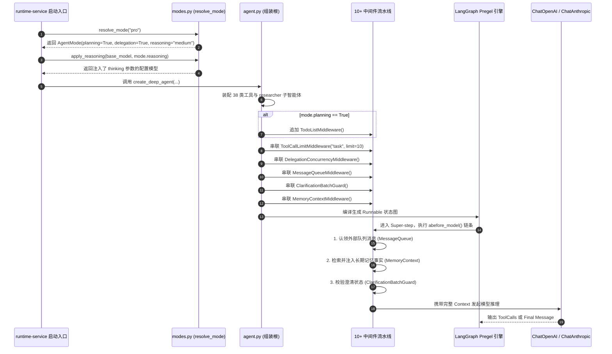

# 01-总控编排与四档执行模式 (Pregel 拓扑 / 10+ 中间件 / 算力预算)

## 模块定位与核心价值

`DearFlow Agent`（代码入口：[agent.py](../../../../apps/runtime-service/src/runtime_service/services/dearflow_agent/agent.py)）是整个平台中技术浓度最高的智能体核心组装根（Composition Root）。

在传统的智能体设计中，开发者往往写死一个 Prompt 和一组固定的 Tools。这种“一刀切”的设计在面对复杂多变的企业级需求时漏洞百出：
- 用户问一个简单定义，系统却大张旗鼓地派生子智能体和生成 Todo 列表，导致响应极其迟钝且浪费昂贵的 Token 费用；
- 用户要求重构上万行复杂工程代码，系统却使用简单的单轮推理，导致上下文迅速溢出、任务中途崩溃。

`DearFlow Agent` 提出了**自适应算力调配与四档执行模式（Execution Modes Architecture）**：
1. **模式与算力解耦（`modes.py`）**：将运行策略解构为 `flash`（闪电极速）、`standard`（标准均衡）、`pro`（专业规划）与 `ultra`（极限深度）四档，精准调控大模型的思考链深度（Reasoning Effort）、规划能力（Planning）与子智能体派发授权（Delegation）。
2. **多层中间件管道守卫（Middleware Pipeline）**：在 Pregel 图的每个 Super-step 之间，串联了多达 10 个工业级拦截中间件，负责从外部消息认领、技能挂载、工具配额熔断到文件沙箱隔离的全程设防。
3. **动态提示词组装引擎（`prompts.py`）**：依据当前执行模式、项目安全策略与挂载技能，在每次调用大模型前动态渲染最精炼的 System Prompt。

---

## 零、知识前置与上下文串联（Knowledge Bridges）

### 1. 认知输入（前置模块输入）
- 依赖 [05-runtime-service/02-langgraph-execution.md](../../05-runtime-service/02-langgraph-execution.md)：理解 LangGraph Pregel 图执行循环、Checkpointer 增量持久化以及 `checkpoint_ns` 多命名空间机制。
- 依赖 [04-platform-api/02-runtime-gateway.md](../../04-platform-api/02-runtime-gateway.md)：明确客户端请求中的 `execution_mode` 是如何在网关层完成校验并收敛至 `platform_runtime` 配置中的。

### 2. 本章核心流转
- **模式解析与算力配置**：`resolve_mode()` 读取入参，确定 `planning`、`delegation` 与 `reasoning` 的启用状态。
- **思考链预算调配**：`apply_reasoning()` 根据当前模式向底层模型实例（如 OpenAI `reasoning_effort` 或 Claude `thinking` 参数）注入对应预算。
- **中间件按需装配**：依据模式布尔值，按需挂载 `TodoListMiddleware` 与 `researcher` 子智能体，完成整个 Pregel 状态图编译。

### 3. 认知输出（支撑后续模块）
- 为 [02-memory-engine.md](02-memory-engine.md) 提供 `MemoryContextMiddleware` 在中间件流水线中的准确定位。
- 为 [03-tools-ecosystem.md](03-tools-ecosystem.md) 提供所有 38 类工具挂载至底座图的统一执行环境。

---

## 一、对立视角：简易原型 vs 生产架构（Naive vs Production）

| 维度 | 简易原型方案 (Naive) | DearFlow Agent 生产架构 (Production Architecture) | 选型与演进考量 |
| :--- | :--- | :--- | :--- |
| **算力与模式** | 单一配置写死，无论用户问什么都采用相同的参数与流程。 | 四档模式（`flash/standard/pro/ultra`）动态调配，按需激活思维链与任务规划器。 | 简单问答 1 秒内响应并节省 90% 成本；深度任务则全力开启算力与多子智能体协同。 |
| **任务规划管理** | 让模型在普通文本回复里输出“第一步、第二步”，无法被系统状态机识别跟踪。 | 动态挂载 `TodoListMiddleware`，将任务拆解为受 LangGraph 状态机严密纳管的 Todo 实体。 | 支持中断恢复后精准查看当前任务进度，避免长周期任务反复重复已经执行过的步骤。 |
| **子任务死循环防御** | 允许主 Agent 无限制派发子任务，模型陷入死循环时无限套娃消耗资金。 | 挂载 `ToolCallLimitMiddleware(tool_name="task", run_limit=10)` 强行熔断。 | 构筑确定性防护网，杜绝由于模型幻觉引发无限并发子智能体把服务器打崩。 |
| **异常调用超时** | 依赖底座全局 HTTP 超时，单个节点卡死导致整个会话长连接永久挂起。 | 节点级挂载 `ModelCallTimeoutMiddleware` 与 `max_execute_timeout=60`。 | 精确控制单个工具和单次模型调用的生命周期，超时自动捕获并向模型反馈以便自愈。 |

---

## 二、源码精准坐标映射（Code Pointer Map）

### 1. 模式解析与算力预算
- [services/dearflow_agent/modes.py](../../../../apps/runtime-service/src/runtime_service/services/dearflow_agent/modes.py)：
  - `AgentMode` 数据模型：包含 `planning: bool`, `delegation: bool`, `reasoning: str`。
  - `resolve_mode()`：将字符串模式（`flash`, `standard`, `pro`, `ultra`）解析为结构化模式对象。
  - `apply_reasoning()`：向模型注入思考链参数。

### 2. 组装根与中间件流水线
- [services/dearflow_agent/agent.py](../../../../apps/runtime-service/src/runtime_service/services/dearflow_agent/agent.py)：
  - 核心编排函数：装配全部工具、子智能体与 10+ 核心中间件。
  - 中间件清单：
    1. `ExecutionSkillsMiddleware`（技能动态注入）
    2. `FilesystemMiddleware`（工作空间文件沙箱）
    3. `TodoListMiddleware`（结构化规划任务池）
    4. `ToolCallLimitMiddleware`（`task` 工具频次硬限制）
    5. `DelegationConcurrencyMiddleware`（子图派发并发控制）
    6. `MessageQueueMiddleware`（外部消息队列认领）
    7. `ClarificationBatchGuard`（防澄清提问死锁）
    8. `MemoryContextMiddleware`（记忆动态语义检索注入）
    9. `DocumentToolsMiddleware`（文档与产物工具挂载）
    10. `ModelCallTimeoutMiddleware`（模型调用超时防护）

### 3. 系统提示词动态渲染
- [services/dearflow_agent/prompts.py](../../../../apps/runtime-service/src/runtime_service/services/dearflow_agent/prompts.py)：
  - `SYSTEM_PROMPT`：定义 Agent 的基础行为准则、格式输出规范与安全红线。

---

## 三、真实数据结构与报文（Real Payloads & DB Schemas）

### 1. 执行模式特性矩阵定义
```python
# apps/runtime-service/src/runtime_service/services/dearflow_agent/modes.py

@dataclass(frozen=True, slots=True)
class AgentMode:
    name: str
    planning: bool      # 是否挂载 TodoListMiddleware
    delegation: bool    # 是否允许派发 researcher 子智能体
    reasoning: str      # 思考链预算档位: "off" | "low" | "medium" | "high"

MODES: dict[str, AgentMode] = {
    "flash": AgentMode(name="flash", planning=False, delegation=False, reasoning="off"),
    "standard": AgentMode(name="standard", planning=False, delegation=False, reasoning="low"),
    "pro": AgentMode(name="pro", planning=True, delegation=True, reasoning="medium"),
    "ultra": AgentMode(name="ultra", planning=True, delegation=True, reasoning="high"),
}
```

### 2. 运行配置注入报文示例（config.configurable）
前端发起执行时，在配置层携带的模式控制报文：

```json
{
  "configurable": {
    "platform_runtime": {
      "execution_mode": "pro",
      "model_id": "model-claude-3-5-sonnet",
      "temperature": 0.2,
      "max_tokens": 8192,
      "access_policy": "review"
    }
  }
}
```

---

## 四、端到端函数级调用时序（Function-Level Trace）

从模式解析、图装配到中间件流水线拦截的完整时序：



---

## 五、核心实现高保真伪代码（High-Fidelity Pseudocode）

### 1. 算力动态注入（modes.py）
```python
# 对应 apps/runtime-service/src/runtime_service/services/dearflow_agent/modes.py

def apply_reasoning(model: BaseChatModel, reasoning: str) -> BaseChatModel:
    """根据模式动态调整大模型的深度思考预算，兼容主流商用模型。"""
    if reasoning == "off":
        return model

    # 针对支持 reasoning_effort 的模型 (如 OpenAI o-series)
    if hasattr(model, "reasoning_effort"):
        effort_map = {"low": "low", "medium": "medium", "high": "high"}
        return model.bind(reasoning_effort=effort_map.get(reasoning, "medium"))

    # 针对 Anthropic Claude 3.5/3.7 系列的 thinking 预算
    if hasattr(model, "thinking"):
        budget_map = {"low": 1024, "medium": 4096, "high": 16384}
        budget_tokens = budget_map.get(reasoning, 4096)
        return model.bind(thinking={"type": "enabled", "budget_tokens": budget_tokens})

    return model
```

### 2. 组装根与中间件管道装配（agent.py）
```python
# 对应 apps/runtime-service/src/runtime_service/services/dearflow_agent/agent.py

def create_dearflow_agent(context: RuntimeContext, model: BaseChatModel, backend: DearWorkspaceBackend) -> Pregel:
    # 1. 解析执行模式
    mode = resolve_mode(context.execution_mode)
    tuned_model = apply_reasoning(model, mode.reasoning)

    # 2. 组装中间件调用链 (严格遵循顺序拦截)
    middlewares = [
        # 技能拦截器：动态将启用技能的说明注入 Prompt
        ExecutionSkillsMiddleware(workspace=backend.root, backend=backend),
        # 文件系统沙箱：硬拦截对受保护目录的写入
        FilesystemMiddleware(backend=backend, tools=list(WORK_TOOLS), _permissions=PERMISSIONS, max_execute_timeout=60),
        # 动态规划任务池 (仅 pro 和 ultra 挂载)
        *([TodoListMiddleware()] if mode.planning else []),
        # 防死循环硬限制：task 工具调用上限 10 次
        ToolCallLimitMiddleware(tool_name="task", run_limit=10, thread_limit=10, exit_behavior="error"),
        # 委托并发控制器
        DelegationConcurrencyMiddleware(),
        # 外部输入收件箱认领
        MessageQueueMiddleware(),
        # 澄清风暴守护器 (限制单轮最多 1 个提问)
        ClarificationBatchGuard(),
        # 动态工作记忆检索与注入
        MemoryContextMiddleware(context=context),
    ]

    # 3. 动态配置子智能体 (仅 pro 和 ultra 开放)
    subagents = [researcher(research_tools, child_middlewares)] if mode.delegation else []

    # 4. 组装 Deep Agents 并编译 Pregel 状态机
    return create_deep_agent(
        model=tuned_model,
        system_prompt=SYSTEM_PROMPT,
        tools=ALL_TOOLS,
        subagents=subagents,
        middleware=middlewares,
        backend=backend,
        interrupt_on=interrupts_for_access_policy(context.access_policy, APPROVALS),
    )
```

---

## 六、假想断电与极限场景推演（Thought Experiments）

### 场景一：用户在 `flash` 模式下要求执行高耗时的全网深度综述
- **推演过程**：用户选择 `flash` 模式，输入：“帮我检索 50 篇关于量子计算的最新论文并生成综合报告”。
- **系统表现**：`resolve_mode("flash")` 输出 `delegation=False, planning=False`。Agent 无法使用 `task` 工具派发研究员子智能体，也无法使用 Todo 规划任务。它会退化为直接在当前会话中快速抓取少量核心信息，并在单轮回复中给出一个精简摘要，而不是卡死耗费半小时，保障了闪电模式下的极速反馈契约。若用户需要深度分析，需显式切入 `pro` 或 `ultra` 模式。

### 场景二：复杂任务由于网络波动导致模型在第 8 步推理失败
- **推演过程**：在 `pro` 模式下执行 15 步复杂工程任务，第 8 步调用外部 LLM API 时发生 504 Gateway Timeout。
- **系统表现**：由于前 7 步的中间结果与 Todo 列表已被 `TodoListMiddleware` 与 LangGraph Checkpointer 持久化入库，任务状态机保留在第 7 步快照。用户点击重试后，系统无缝从第 7 步快照唤醒，已经完成的前 7 步无需重复调用模型消耗 Token，直接继续尝试第 8 步。

### 场景三：大模型陷入逻辑死循环无限产生 `task` 调用
- **推演过程**：模型受到对抗样本诱导，在每一次回复中都调用 `task(role="general-purpose", prompt="...")` 试图自我无限分裂。
- **系统表现**：当 `task` 调用累积达到第 10 次时，`ToolCallLimitMiddleware` 立即介入拦截，抛出 `ToolCallLimitExceededError` 并将执行置为失败状态，直接掐断死循环，守护系统计算资源。

---

## 七、架构不变量清单（Architectural Invariants）

1. **算力参数单向只读原则**：`AgentMode` 中定义的特性（`planning`, `delegation`, `reasoning`）必须声明为 `frozen=True`，严禁在推理执行期间被模型生成的代码动态修改。
2. **中间件顺序确定性原则**：中间件栈的挂载顺序必须严格保持确定性，安全类守卫（权限拦截、调用限额）必须优先于业务类中间件执行。
3. **派发深度硬截断不变量**：任何会话生命周期内，`task` 工具的调用绝对不得突破 10 次硬上限。
4. **提示词纯净不变量**：System Prompt 的动态拼装必须在受控的 Python 函数中完成，严禁接受未经沙箱过滤的任意三方不可信输入拼接。
