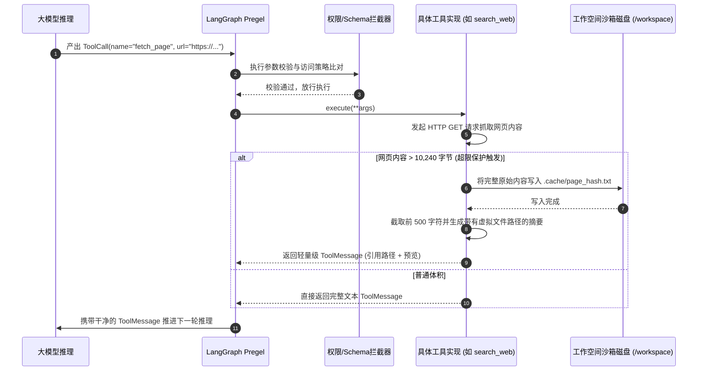

# 03-38类工具装配矩阵 (检索 / ArXiv / GitHub / 部署 / 多模态 / 图表)

## 模块定位与核心价值

如果说大语言模型是智能体的“大脑”，那么**工具生态（Tools Ecosystem）**就是智能体的“五官与双手”。在面向软件研发、学术研究与商业分析的严谨生产场景中，工具的质量、数量与边界安全性直接决定了系统的成败。

`DearFlow Agent` 拥有平台中最庞大、最完善的工具矩阵（代码坐标：[apps/runtime-service/src/runtime_service/services/dearflow_agent/tools/](file:///Users/lijiaxin/PyCharmMiscProject/ai-agent-platform/apps/runtime-service/src/runtime_service/services/dearflow_agent/tools/) 与 [capabilities.py](file:///Users/lijiaxin/PyCharmMiscProject/ai-agent-platform/apps/runtime-service/src/runtime_service/services/dearflow_agent/capabilities.py)）。其核心设计解决了大模型调用外部世界的四大顽疾：
1. **能力全景结构化分类（38 类原子能力）**：覆盖通用网络检索、学术 ArXiv 论文抓取、GitHub 工程联动、云端 Vercel 部署、多模态媒体图文处理、ECharts/Chart.js 动态图表引擎与动态 Artifacts 渲染。
2. **大结果体积分流截断（Large Output Guard）**：当网络抓取或命令执行吐出数十万字时，工具框架自动将原始报文落盘并仅向模型上下文回传引用路径与精简摘要，**彻底根绝由于单个 ToolCall 撑爆 Context Window 导致的死机崩溃**。
3. **参数强类型校验与 Schema 约束**：例如在图表工具中引入高达 83KB 的静态 JSON Schema 校验包（`chart-schemas.json`），在入参阶段就将不合规的畸形前端配置当场纠偏。
4. **统一的安全等级与审批挂钩**：所有工具依据读写权限进行分类（`WORK_TOOLS`, `DEAR_TOOLS`, `MEMORY_TOOLS` 等），与会话的三档访问策略（`access_policy`）无缝绑定。

---

## 零、知识前置与上下文串联（Knowledge Bridges）

### 1. 认知输入（前置模块输入）
- 依赖 [01-architecture-and-modes.md](file:///Users/lijiaxin/PyCharmMiscProject/ai-agent-platform/docs/architecture/07-agents/01-dearflow-agent/01-architecture-and-modes.md)：明确在 `create_deep_agent` 装配时，工具矩阵是如何按照执行模式与权限清单分流注入状态机的。
- 依赖 [05-runtime-service/03-hitl-and-interrupts.md](file:///Users/lijiaxin/PyCharmMiscProject/ai-agent-platform/docs/architecture/05-runtime-service/03-hitl-and-interrupts.md)：掌握涉及外部变更的工具（如 `deployment_execute`）是如何被 `interrupts_for_access_policy` 强行拦截并挂起等待审批的。

### 2. 本章核心流转
- **模型意图决策**：LLM 输出包含具体参数的 `ToolCall`。
- **参数校验与沙箱校验**：执行器验证输入格式；文件类操作通过 `FilesystemPermission` 进行白名单判定。
- **物理执行与大体积引流**：外部服务或本地进程执行；若结果超过体积预算（如 > 10KB），自动写入 `/large_tool_results/` 并生成虚拟文件引用。
- **反馈闭环包装**：将安全干净的输出组装为 `ToolMessage` 回传给 Pregel 引擎进入下一步思考循环。

### 3. 认知输出（支撑后续模块）
- 为 [04-workspace-sandbox.md](file:///Users/lijiaxin/PyCharmMiscProject/ai-agent-platform/docs/architecture/07-agents/01-dearflow-agent/04-workspace-sandbox.md) 提供所有文件与代码执行类工具在底层沙箱内部的真实映射支撑。

---

## 一、对立视角：简易原型 vs 生产架构（Naive vs Production）

| 维度 | 简易原型方案 (Naive) | DearFlow Agent 工具生态 (Production Architecture) | 选型与演进考量 |
| :--- | :--- | :--- | :--- |
| **工具返回值处理** | 工具执行产生什么就无脑 `str(res)` 返回给模型，遇到 500KB 的 HTML 直接把上下文塞爆。 | 自动分流机制：超限大文本自动保存为工作区临时文件，仅向模型返回前 500 字符摘要及文件提取句柄。 | 保护大模型有限的注意力窗口，杜绝由于外部长网页导致整个会话上下文报废。 |
| **专业领域工具** | 只有简单的 Python `requests.get`，抓取现代动态 SPA 网页或者 ArXiv 论文时频繁报错乱码。 | 专有领域适配器：ArXiv 工具自带 PDF 文本解析流；GitHub 工具自带 Octokit 格式清洗；图表工具自带 83KB Schema 强验。 | 确保各专业垂直领域的输入输出精确可控，杜绝大模型“猜参数”引发的报错循环。 |
| **人工澄清机制** | 模型不知道怎么做时，在最终回答里打字问用户，导致长任务执行中途直接夭折。 | 专属 `request_information` 工具（`human_input.py`），通过图状态机中断主动向前端弹出交互表单。 | 保证任务不中断：将“提问澄清”纳为工具生态的一环，收集到用户输入后无缝继续往下推任务。 |
| **可观测性记录** | 工具执行全在黑盒里跑，出错了只能看控制台 print 日志，难以复现报错上下文。 | 每个工具被自动包裹在 Langfuse 追踪切片中，输入入参、执行耗时、返回字节数与 HTTP 状态全透明。 | 支撑工业级调试与排障，随时回溯模型在哪一个工具调用参数上犯了蠢。 |

---

## 二、源码精准坐标映射（Code Pointer Map）

### 1. 能力全景总表与分类
- [services/dearflow_agent/capabilities.py](file:///Users/lijiaxin/PyCharmMiscProject/ai-agent-platform/apps/runtime-service/src/runtime_service/services/dearflow_agent/capabilities.py)：
  - `WORK_TOOLS`：工作空间基础工具（`read_file`, `write_file`, `edit_file`, `execute` 等）。
  - `DEAR_TOOLS`：核心专业能力（`search_web`, `fetch_page`, `arxiv_search`, `github`, `deployment` 等）。
  - `CHART_NAMES`：支持的图表渲染类型集合。

### 2. 专业工具实现族
- 深度网络检索：
  - [tools/search.py](file:///Users/lijiaxin/PyCharmMiscProject/ai-agent-platform/apps/runtime-service/src/runtime_service/services/dearflow_agent/tools/search.py)：`search_web`（支持 Google/Bing 聚合）与 `fetch_page`（安全网页提取）。
- 学术论文挖掘：
  - [tools/arxiv.py](file:///Users/lijiaxin/PyCharmMiscProject/ai-agent-platform/apps/runtime-service/src/runtime_service/services/dearflow_agent/tools/arxiv.py) 与 [tools/arxiv_search.py](file:///Users/lijiaxin/PyCharmMiscProject/ai-agent-platform/apps/runtime-service/src/runtime_service/services/dearflow_agent/tools/arxiv_search.py)：基于官方 API 检索 ArXiv 预印本并按章节解析 PDF 内容。
- 研发工程协同：
  - [tools/github.py](file:///Users/lijiaxin/PyCharmMiscProject/ai-agent-platform/apps/runtime-service/src/runtime_service/services/dearflow_agent/tools/github.py)：读取仓库代码树、检索 Issue、查看 Commit Diff。
  - [tools/deployment.py](file:///Users/lijiaxin/PyCharmMiscProject/ai-agent-platform/apps/runtime-service/src/runtime_service/services/dearflow_agent/tools/deployment.py)：自动化打包产物并生成可认领（Claimable）的 Vercel 静态预览地址。
- 多模态与专业图表：
  - [tools/media.py](file:///Users/lijiaxin/PyCharmMiscProject/ai-agent-platform/apps/runtime-service/src/runtime_service/services/dearflow_agent/tools/media.py)：支持提取图片 OCR、音频转录与多模态文件输入。
  - [tools/chart.py](file:///Users/lijiaxin/PyCharmMiscProject/ai-agent-platform/apps/runtime-service/src/runtime_service/services/dearflow_agent/tools/chart.py)：结合 `chart-schemas.json` 强校验前端图表选项。
- 交互澄清与产物封装：
  - [tools/human_input.py](file:///Users/lijiaxin/PyCharmMiscProject/ai-agent-platform/apps/runtime-service/src/runtime_service/services/dearflow_agent/tools/human_input.py)：`request_information` 中断提问工具。
  - [tools/artifacts.py](file:///Users/lijiaxin/PyCharmMiscProject/ai-agent-platform/apps/runtime-service/src/runtime_service/tools/artifacts.py)：创建或更新平台前端右侧抽屉渲染的交互式产物。

---

## 三、真实数据结构与报文（Real Payloads & DB Schemas）

### 1. 动态图表渲染工具报文定义（render_chart）
模型输出的图表参数必须严格遵循 ECharts 标准 Schema：

```json
{
  "name": "render_chart",
  "args": {
    "type": "echarts",
    "title": "2026年大模型推理延迟对比",
    "option": {
      "xAxis": {
        "type": "category",
        "data": ["Claude 3.5", "GPT-4o", "DeepSeek-V3"]
      },
      "yAxis": {
        "type": "value",
        "name": "首字延迟 (ms)"
      },
      "series": [
        {
          "data": [320, 280, 190],
          "type": "bar"
        }
      ]
    }
  }
}
```

### 2. 大体积结果自动落盘引流输出
当 `fetch_page` 抓取一个 150KB 的超大网页时，工具框架拦截超限内容，落盘后仅向模型上下文反馈如下轻量级 `ToolMessage`：

```json
{
  "role": "tool",
  "name": "fetch_page",
  "content": "[Output exceeds 10KB threshold (Total: 154,210 bytes). Automatically stored to disk.]\n\nPreview:\n# LangGraph Pregel Architecture Specification\nPregel is a distributed graph processing framework based on the Bulk Synchronous Parallel (BSP) model...\n\nReference: file:///workspace/.cache/fetch_page_88a01.txt\nUse read_file with offset and limit to inspect full contents if necessary."
}
```

---

## 四、端到端函数级调用时序（Function-Level Trace）

从模型触发工具、执行安全拦截到大结果分流处理的时序：



---

## 五、核心实现高保真伪代码（High-Fidelity Pseudocode）

### 1. 大体积工具输出自动引流拦截器（search.py）
```python
# 对应 apps/runtime-service/src/runtime_service/services/dearflow_agent/tools/search.py

MAX_INLINE_RESULT_BYTES = 10 * 1024  # 10KB 阈值

async def fetch_page(url: str, workspace: DearWorkspaceBackend) -> str:
    # 1. 抓取外部网页
    raw_content = await read_bounded_web_page(url, limit=5 * 1024 * 1024)

    # 2. 体积探测：如果未超限，直接在上下文返回
    if len(raw_content.encode("utf-8")) <= MAX_INLINE_RESULT_BYTES:
        return raw_content

    # 3. 超限安全分流：保存至工作区虚拟缓存目录
    cache_rel_path = f".cache/web_dump_{hashlib.sha256(url.encode()).hexdigest()[:16]}.txt"
    abs_path = workspace.resolve_path(cache_rel_path)
    os.makedirs(os.path.dirname(abs_path), exist_ok=True)
    with open(abs_path, "w", encoding="utf-8") as f:
        f.write(raw_content)

    # 4. 仅向上层模型反馈精简摘要与后续读取指针
    preview = raw_content[:600].strip()
    return (
        f"[Large Content Warning: Output was {len(raw_content)} chars and exceeded inline context budget. "
        f"Full content safely saved to '{cache_rel_path}'.]\n\n"
        f"Content Preview:\n{preview}...\n\n"
        f"Tip: Use 'read_file(path=\"{cache_rel_path}\", offset=..., limit=...)' if you need specific sections."
    )
```

### 2. 图表参数 Schema 强校验（chart.py）
```python
# 对应 apps/runtime-service/src/runtime_service/services/dearflow_agent/tools/chart.py

with open(Path(__file__).parent / "chart-schemas.json", "r") as f:
    CHART_SCHEMA_VALIDATOR = jsonschema.Draft7Validator(json.load(f))

@tool
def render_chart(type: str, title: str, option: dict[str, Any]) -> dict[str, Any]:
    """渲染富交互前端图表。option 必须严格符合 ECharts 标准。"""
    # 校验图表结构，错误则在第一时间向模型返回具体的 Schema 违规节点
    errors = sorted(CHART_SCHEMA_VALIDATOR.iter_errors(option), key=lambda e: e.path)
    if errors:
        first_error = errors[0]
        field_path = ".".join(str(p) for p in first_error.path)
        raise ValueError(f"Invalid chart option at '{field_path}': {first_error.message}")

    return {
        "status": "success",
        "chart_type": type,
        "title": title,
        "option": option,
        "render_target": "artifact_panel"
    }
```

---

## 六、假想断电与极限场景推演（Thought Experiments）

### 场景一：目标网页返回 20MB 的超大恶意二进制或垃圾日志
- **推演过程**：智能体受引导抓取一个包含了 20MB 垃圾日志的外部 URL。
- **系统表现**：`read_bounded_web_page` 使用基于流式的 `aiter_bytes`。当累计读取字节数达到预设的 5MB 硬上限时，底层直接强行熔断连接并抛出 `DocumentError("skill_source_size")`。超大流式报文根本无法进入内存，更无法撑爆工作空间磁盘。

### 场景二：模型生成的图表缺少必要的 `series` 数组（参数残缺）
- **推演过程**：大模型生成了一个格式破损的 ECharts 选项，漏掉了 `series` 核心属性。
- **系统表现**：`render_chart` 调用 `jsonschema.Draft7Validator` 进行校验，瞬间捕获该错误并抛出 `ValueError("Invalid chart option at '': 'series' is a required property")`。这个清晰的错误信息以 `ToolMessage` 形式回填给模型，大模型看到明确的错误提示后，在下一步自纠自愈，补齐 `series` 后重新调用成功，避免了前端白屏报错。

### 场景三：模型同时调用 5 个并发网络搜索工具（并发冲撞）
- **推演过程**：模型产生并行 Tool Calls，同时发出 5 个不同的关键词检索。
- **系统表现**：执行框架利用 `asyncio.gather` 并行分发这 5 个检索任务。由于搜索工具是无状态只读的，5 个网络请求并发发出并在数秒内同时返回，大幅压缩了等待耗时，且各个结果分别独立包裹为互不干扰的 `ToolMessage` 按序回填给模型。

---

## 七、架构不变量清单（Architectural Invariants）

1. **内联输出体积硬上限原则**：任何直接注入模型上下文的单个工具返回值，体积严禁超过 10KB；超限数据必须物理落盘并降级为引用句柄。
2. **Schema 强拦截零妥协原则**：复杂格式工具（图表、部署配置等）必须具备静态 JSON Schema 校验，严禁将未经验证的畸形数据下发给前端。
3. **外部网络流式截断原则**：抓取外部网页或下载外部资产时，底层网络客户端必须施加硬字节截断，严禁进行无上限的无界数据流缓冲。
4. **工具结果因果闭环原则**：所有工具无论执行成功还是捕获异常，必须产出语义清晰的标准 `ToolMessage`，严禁让未捕获的未处理异常击穿图状态机导致会话崩溃。
