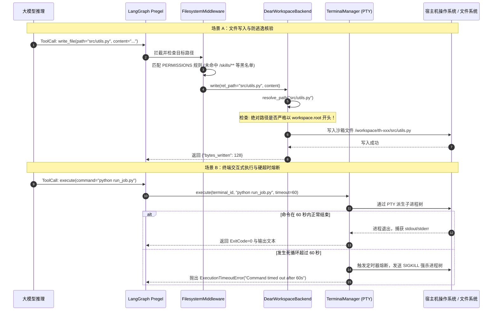

# 04-工作空间沙箱与资产管线 (DearWorkspaceBackend / PTY / 防逃逸)

## 模块定位与核心价值

当赋予智能体编写代码、调用 Shell 终端和修改文件的权力时，系统就必须直面最高等级的安全挑战——**任意文件覆盖、宿主机穿透逃逸与智能体自我篡改**。

如果一个 Agent 可以随意执行 `cd / && rm -rf *`，或者通过写入 `../../etc/shadow` 窃取系统密文，那么这个平台在任何严肃企业里都是绝对禁止部署的危险品。

`DearFlow Agent` 构建了一套严密的**虚拟工作空间沙箱与安全资产管线（Workspace Sandbox & Asset Pipeline）**（代码坐标：[workspace/backend.py](file:///Users/lijiaxin/PyCharmMiscProject/ai-agent-platform/apps/runtime-service/src/runtime_service/services/dearflow_agent/workspace/backend.py) 与 [workspace/terminal.py](file:///Users/lijiaxin/PyCharmMiscProject/ai-agent-platform/apps/runtime-service/src/runtime_service/workspace/terminal.py)）：
1. **虚拟根目录与防路径逃逸（Path Traversal Guard）**：通过 `DearWorkspaceBackend` 将 Agent 的一切文件系统感知强行锚定在专属的工作区物理目录内，彻底截断任何试图通过 `..`、软链接（Symlink）向宿主机系统目录逃逸的攻击。
2. **带硬超时的 PTY 交互式伪终端**：终端执行基于 Linux PTY 伪终端通道，对所有 Bash 执行强加 60 秒硬超时熔断，防止后台死锁挂起或恶意死循环耗尽 CPU。
3. **反自我篡改安全红线（Anti-Self-Tampering）**：基于 `FilesystemPermission`，在文件系统底层设立不可逾越的只读黑名单，**彻底封死智能体试图篡改自身技能代码（`/skills/**`）或覆写历史事实（`/conversation_history/**`）的通道**。
4. **统一资产管线（Artifacts Pipeline）**：结构化纳管输出资产（`/workspace/outputs/`），提供从文件读写、多模态预览到 ZIP 导出下载的完整闭环。

---

## 零、知识前置与上下文串联（Knowledge Bridges）

### 1. 认知输入（前置模块输入）
- 依赖 [01-architecture-and-modes.md](file:///Users/lijiaxin/PyCharmMiscProject/ai-agent-platform/docs/architecture/07-agents/01-dearflow-agent/01-architecture-and-modes.md)：明确 `FilesystemMiddleware` 是挂载在 Agent 核心中间件链上的第一道物理防御。
- 依赖 [03-tools-ecosystem.md](file:///Users/lijiaxin/PyCharmMiscProject/ai-agent-platform/docs/architecture/07-agents/01-dearflow-agent/03-tools-ecosystem.md)：理解所有基础文件工具（`read_file`, `write_file`, `edit_file`, `execute`）底层均依赖工作区后端进行路径转义。

### 2. 本章核心流转
- **虚拟路径安全转义**：工具层传入相对路径（如 `src/main.py`），沙箱执行规范化解析并验证物理边界。
- **权限安全判定**：检查目标路径是否属于只读系统保护区（如 `/skills/`），命中则抛出权限拒绝异常。
- **物理 I/O 与终端执行**：在沙箱内完成文件读写或驱动 PTY 执行命令，捕获输出流与 Exit Code。
- **前端资产映射**：检测文件是否落入输出目录，自动向前端触发 Artifacts 面板更新。

### 3. 认知输出（支撑后续模块）
- 为 [05-skills-runtime.md](file:///Users/lijiaxin/PyCharmMiscProject/ai-agent-platform/docs/architecture/07-agents/01-dearflow-agent/05-skills-runtime.md) 提供技能包解压落盘与受控执行的底层宿主环境。

---

## 一、对立视角：简易原型 vs 生产架构（Naive vs Production）

| 维度 | 简易原型方案 (Naive) | DearFlow Agent 沙箱架构 (Production Architecture) | 选型与演进考量 |
| :--- | :--- | :--- | :--- |
| **路径解析与防逃逸** | 直接 `os.path.join(base, user_path)`，攻击者传入 `../../etc/passwd` 直接穿透逃逸。 | 严格校验 `resolve_path()`：物理路径必须以 `sandbox_root` 开头，检测并阻断恶意软链接穿透。 | 封死目录遍历（Directory Traversal）漏洞，保证用户代码绝无可能触及容器或宿主机文件。 |
| **代码执行与超时** | 直接通过 Python `subprocess.run(cmd, shell=True)`，遇到无交互死循环直接让整个容器进程卡死。 | 托管于 PTY 伪终端池，全生命周期跟踪进程树，配置 60 秒强杀超时（SIGKILL）。 | 保证任何死循环、fork 炸弹或挂起命令均能被系统确定性熔断并释放系统资源。 |
| **防自身代码篡改** | 没有任何保护，模型生成代码把自身的 Python 脚本改坏，导致后续所有轮次崩溃报错。 | 底座中间件对 `/skills/**`、`/conversation_history/**` 实行硬核只读阻断（`mode="deny"`）。 | 保证智能体自身的执行逻辑不受大模型幻觉与 Prompt 注入的干扰破坏。 |
| **产物交付体验** | 文件生成在服务器某个目录，用户只能在终端里自己找或者看不到产物。 | 专有资产管线：`/workspace/outputs/` 目录变动自动同步至前端 Artifacts 抽屉，支持右侧动态预览与打包。 | 打造现代 IDE 级交互体验，让用户对代码生成、图表生成与文档交付一目了然。 |

---

## 二、源码精准坐标映射（Code Pointer Map）

### 1. 虚拟工作空间与防逃逸核心
- [services/dearflow_agent/workspace/backend.py](file:///Users/lijiaxin/PyCharmMiscProject/ai-agent-platform/apps/runtime-service/src/runtime_service/services/dearflow_agent/workspace/backend.py)：
  - `DearWorkspaceBackend`：实现抽象文件系统接口（`read`, `write`, `edit`, `glob`），执行严格的路径物理边界合规性核验。
  - `skills_hash()`：基于当前工作区技能代码计算不可变指纹。
- [services/dearflow_agent/agent.py](file:///Users/lijiaxin/PyCharmMiscProject/ai-agent-platform/apps/runtime-service/src/runtime_service/services/dearflow_agent/agent.py)：
  - `PERMISSIONS`：声明对系统目录的写入阻断规则。

### 2. 伪终端与交互式命令执行
- [workspace/terminal.py](file:///Users/lijiaxin/PyCharmMiscProject/ai-agent-platform/apps/runtime-service/src/runtime_service/workspace/terminal.py)：
  - `TerminalSession`：基于 `pty.openpty()` 的伪终端会话封装。
  - `TerminalManager`（`terminals` 单例）：管理跨会话的终端进程树、输出缓冲池与停机清理（`shutdown`）。

### 3. 产物与文档抽象
- [workspace/artifact_refs.py](file:///Users/lijiaxin/PyCharmMiscProject/ai-agent-platform/apps/runtime-service/src/runtime_service/workspace/artifact_refs.py)：
  - `ArtifactWorkspace`：识别与封装对外交付的产物实体。
- [workspace/documents.py](file:///Users/lijiaxin/PyCharmMiscProject/ai-agent-platform/apps/runtime-service/src/runtime_service/workspace/documents.py)：
  - `DocumentWorkspace`：支持读取 PDF、DOCX、TXT 等文档内容的提取管道。

---

## 三、真实数据结构与报文（Real Payloads & DB Schemas）

### 1. 沙箱权限规则定义（FilesystemPermission）
```python
# apps/runtime-service/src/runtime_service/services/dearflow_agent/agent.py

PERMISSIONS = [
    # 规则 1：绝对禁止 Agent 写入自身技能实现代码
    FilesystemPermission(operations=["write"], paths=["/skills/**"], mode="deny"),

    # 规则 2：绝对禁止 Agent 覆写历史事实记录与超大中间结果
    FilesystemPermission(
        operations=["write"],
        paths=["/conversation_history/**", "/large_tool_results/**"],
        mode="deny"
    ),
]
```

### 2. 终端执行输出结构体（TerminalOutput）
执行 Bash 命令时向状态机返回的标准化结构：

```json
{
  "terminal_id": "term-th-e90f23b1-01",
  "command": "npm run test:unit",
  "exit_code": 0,
  "output": "PASS tests/unit/agent.spec.ts\nTests: 12 passed, 12 total\nTime: 2.341 s\n",
  "truncated": false,
  "duration_seconds": 2.45
}
```

---

## 四、端到端函数级调用时序（Function-Level Trace）

从智能体发起文件写入或执行终端命令的沙箱全链路调用时序：



---

## 五、核心实现高保真伪代码（High-Fidelity Pseudocode）

### 1. 防路径遍历与逃逸解析器（workspace/backend.py）
```python
# 对应 apps/runtime-service/src/runtime_service/services/dearflow_agent/workspace/backend.py

class DearWorkspaceBackend:
    def __init__(self, root_dir: str):
        # 规范化沙箱根目录为绝对路径，解析一切软链接
        self.root = os.path.realpath(os.path.abspath(root_dir))

    def resolve_path(self, relative_path: str) -> str:
        """安全路径解析器：坚决防范任何跨越沙箱边界的尝试。"""
        # 1. 过滤空字符注入攻击
        if "\0" in relative_path:
            raise PermissionError("Null byte injection detected in path")

        # 2. 拼装目标路径并计算规范绝对路径
        joined = os.path.join(self.root, relative_path.lstrip("/"))
        resolved = os.path.realpath(os.path.abspath(joined))

        # 3. 核心安全防御：目标绝对路径必须完全以沙箱根路径为前缀！
        # 任何类似 "../../etc/passwd" 或借由符号链接跳出沙箱的路径在此处立即被击碎
        if not (resolved == self.root or resolved.startswith(self.root + os.sep)):
            raise PermissionError(f"Access denied: Path '{relative_path}' escapes sandbox root boundary")

        return resolved

    def write(self, path: str, content: str) -> int:
        target_abs = self.resolve_path(path)
        os.makedirs(os.path.dirname(target_abs), exist_ok=True)
        with open(target_abs, "w", encoding="utf-8") as f:
            return f.write(content)
```

### 2. PTY 伪终端超时控制（workspace/terminal.py）
```python
# 对应 apps/runtime-service/src/runtime_service/workspace/terminal.py

class TerminalSession:
    def __init__(self, cwd: str):
        self.cwd = cwd
        # 打开真实的 Linux 伪终端主从文件描述符
        self.master_fd, self.slave_fd = pty.openpty()
        self.proc = None

    def execute_command(self, cmd: str, timeout_seconds: int = 60) -> tuple[int, str]:
        """在受控的 PTY 环境中执行命令，带严格的进程树超时熔断机制。"""
        try:
            self.proc = subprocess.Popen(
                cmd,
                shell=True,
                stdin=self.slave_fd,
                stdout=self.slave_fd,
                stderr=self.slave_fd,
                cwd=self.cwd,
                preexec_fn=os.setsid,  # 建立独立进程组以便整树强杀
                close_fds=True,
            )

            # 等待进程退出，带超时守卫
            stdout_data, _ = self.proc.communicate(timeout=timeout_seconds)
            return self.proc.returncode, stdout_data.decode("utf-8", errors="replace")

        except subprocess.TimeoutExpired:
            # 超时强杀整个进程组（防止孙进程变成僵尸继续消耗 CPU）
            os.killpg(os.getpgid(self.proc.pid), signal.SIGKILL)
            raise TimeoutError(f"Command '{cmd}' killed after exceeding {timeout_seconds}s limit")
        finally:
            self.proc = None
```

---

## 六、假想断电与极限场景推演（Thought Experiments）

### 场景一：攻击者试图利用软链接（Symlink）绕过沙箱读取宿主机密钥
- **推演过程**：攻击者在对话中诱导 Agent 执行 Bash 命令：`ln -s /etc/shadow /workspace/my_shadow.txt`，随后尝试调用 `read_file(path="my_shadow.txt")` 读取该文件。
- **系统表现**：`resolve_path("my_shadow.txt")` 使用了 `os.path.realpath()`。该函数会自动解析软链接指向的最终真实目标文件（`/etc/shadow`）。随后比对发现目标真实路径并非以 `self.root` 为前缀，立即抛出 `PermissionError("Access denied: Path escapes sandbox root boundary")`，软链接穿透攻击被物理化解。

### 场景二：智能体在终端中执行了一个无限挂起的命令（如 `cat` 等待 stdin）
- **推演过程**：模型生成的 Shell 脚本误写了 `cat` 但没有重定向输入，导致子进程永久挂起阻塞。
- **系统表现**：`TerminalSession.execute_command` 启动了 60 秒超时计时器。当 60 秒倒计时结束，底座触发 `TimeoutExpired`，通过 `os.killpg` 瞬间向整个进程组发送 `SIGKILL` 强杀所有关联子进程，并将 `TimeoutError` 反馈给模型，模型感知到超时后自动重新调整命令，系统会话长连接绝不会假死。

### 场景三：模型尝试重写 `/skills/find-skills/run.py` 借此提权
- **推演过程**：智能体尝试调用 `write_file(path="/skills/find-skills/run.py", content="import os; os.system('chmod 777 /')")`。
- **系统表现**：请求到达 `FilesystemMiddleware` 时，中间件扫描 `PERMISSIONS` 规则表，直接匹配命中 `FilesystemPermission(operations=["write"], paths=["/skills/**"], mode="deny")`。写操作在进入底层磁盘前被中间件当场拦截，直接返回权限拒绝错误，彻底杜绝自篡改提权。

---

## 七、架构不变量清单（Architectural Invariants）

1. **沙箱物理边界绝对不可逃逸不变量**：任何在工作区内执行的文件 I/O，其解析后的 `os.path.realpath()` 绝对必须以沙箱根路径（`workspace.root`）为前缀，严禁豁免任何相对路径或符号链接。
2. **系统元数据路径只读不变量**：`/skills/**`、`/conversation_history/**` 以及 `/large_tool_results/**` 必须在中间件层物理阻断写入（`mode="deny"`），严禁任何模型操作篡改。
3. **命令执行无界熔断原则**：伪终端（PTY）中执行的任何外部命令，单条最长执行耗时严禁突破 60 秒硬上限，超时必须整树发送 `SIGKILL` 彻底物理回收。
4. **进程组孤儿回收原则**：宿主机或容器退出停机（Lifespan Shutdown）时，必须通过 `terminals.shutdown()` 排空并终结所有处于活动状态的 PTY 终端子进程。
