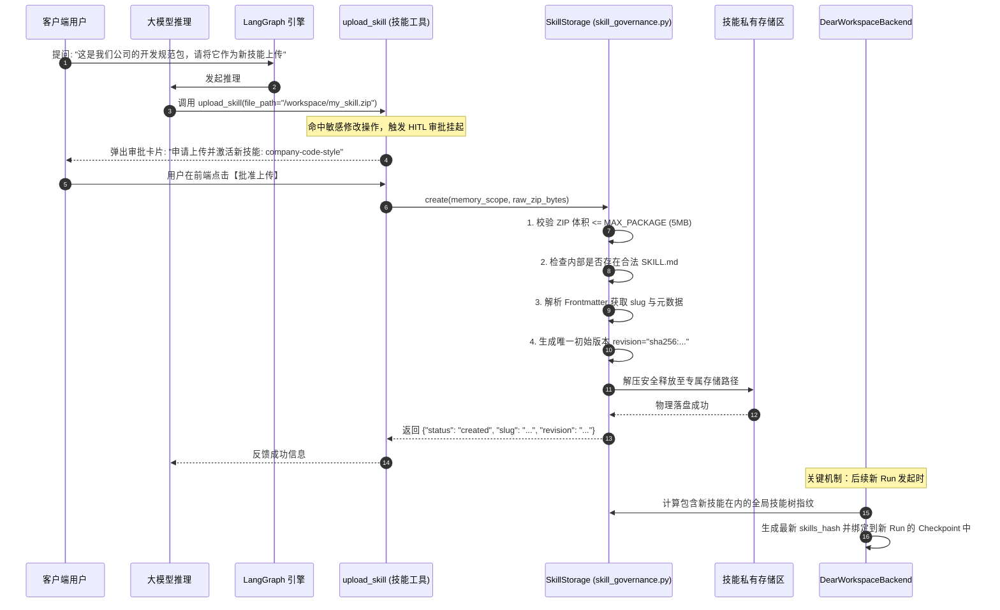

# 05-技能治理与动态热加载 (20+ 内置技能 / ZIP 乐观锁 / 快照隔离)

## 模块定位与核心价值

在大模型工程化演进中，“工具（Tools）”与“技能（Skills）”存在着根本性的认知分野：
- **工具（Tools）**是执行特定操作的底层原子接口（如“写文件”、“执行 SQL”、“发网络请求”）；
- **技能（Skills）**则是将特定领域的专家 SOP、提示词模板、执行脚本与依赖资产打包而成的**高级专业能力封装**（如“学术论文双盲评审”、“企业级咨询分析报告生成”、“专业 PPT 结构化排版”）。

如果把智能体比作一个通识大学生，工具是他的纸和笔，而技能就是他在特定领域接受的专业岗位培训课件。

`DearFlow Agent` 打造了一套企业级的**双轨制技能治理与动态热加载体系（Skills Runtime & Governance）**（代码坐标：[skill_governance.py](../../../../apps/runtime-service/src/runtime_service/services/dearflow_agent/skill_governance.py) 与 [skill_catalog.py](../../../../apps/runtime-service/src/runtime_service/services/dearflow_agent/skill_catalog.py)）：
1. **双轨制技能目录（Dual Skill Catalog）**：
   - **公共内置技能（Public Skills）**：随平台代码库打包出厂，内置 20+ 类各垂直领域的权威技能。
   - **租户私有技能（Custom Skills）**：支持企业或用户以标准 ZIP 格式自主开发并动态上传挂载，实现领域知识零代码发版热更新。
2. **乐观并发版本控制（Optimistic Locking）**：技能的更新与启停基于 `expected_revision` 强比对，杜绝多端或多人并发编辑时的脏覆盖。
3. **执行期快照不可变性（Snapshot Immutability）**：任务启动瞬间基于当前启用的全部技能计算唯一的 `skills_hash`。在长耗时任务执行期间，即便外部管理员上传了新技能，正在运行的任务依然执行原快照，**杜绝执行过程中的非受控动态突变**。
4. **强审批全生命周期管理**：技能的创建、覆写、启停与删除全部受访问策略（HITL）管控，必须经人类确认后方可落地生效。

---

## 零、知识前置与上下文串联（Knowledge Bridges）

### 1. 认知输入（前置模块输入）
- 依赖 [01-architecture-and-modes.md](01-architecture-and-modes.md)：明确 `ExecutionSkillsMiddleware` 挂载在中间件流水线顶部，负责将可用技能的元数据注册给大模型。
- 依赖 [04-workspace-sandbox.md](04-workspace-sandbox.md)：理解沙箱通过 `FilesystemPermission` 严厉阻断 Agent 擅自篡改系统技能目录的防御逻辑。

### 2. 本章核心流转
- **技能包校验与解析**：用户通过 `upload_skill` 提交 ZIP 包，系统解压核验是否包含规范的 `SKILL.md`（带 YAML Frontmatter）。
- **版本指纹计算与落盘**：`SkillStorage` 检验包大小与结构完整性，生成初始 `revision` 哈希并持久化。
- **执行期快照锚定**：任务发起时，`DearWorkspaceBackend` 计算全局 `skills_hash` 存入当前会话的 Checkpoint。
- **技能感知与动态激活**：大模型根据 `list_skills` 结果识别场景，动态调用指定技能的 SOP 与执行脚本。

### 3. 认知输出（支撑后续模块）
- 为 [06-high-fidelity-implementation.md](06-high-fidelity-implementation.md) 提供技能系统在最终状态机中完整初始化的实现细节。

---

## 一、对立视角：简易原型 vs 生产架构（Naive vs Production）

| 维度 | 简易原型方案 (Naive) | DearFlow Agent 技能架构 (Production Architecture) | 选型与演进考量 |
| :--- | :--- | :--- | :--- |
| **技能扩展机制** | 技能只能由后端工程师手写在 Python 文件里，增加新能力必须修改代码、打 Docker 镜像并重启集群。 | 标准化 ZIP 规范（包含 `SKILL.md`、Python 脚本与提示词模板），支持通过 API 或聊天窗口动态上传热加载。 | 赋能业务专家与非技术人员，实现领域知识与业务 SOP 的敏捷迭代。 |
| **执行一致性保障** | 任务执行过程中，管理员更新了技能文件，正在运行的任务中途读到了新旧混杂的代码直接崩溃。 | 基于 `skills_hash` 实现快照隔离：任务启动即锁定当前版本，热更新只对后续新发起的 Run 生效。 | 保证长时间复杂任务的执行确定性，彻底杜绝运行中途由于动态热更新引起的上下文撕裂。 |
| **并发编辑安全性** | 多个管理员同时修改同一个技能时，后提交的无脑覆盖先提交的，造成数据丢失事故。 | 引入 `expected_revision` 乐观锁机制，更新时若发现远程版本已被抢先变更，立即拒绝提交。 | 解决企业团队多人协同管理技能资产时的版本冲撞问题。 |
| **技能包安全性** | 随便上传任意大文件或畸形 ZIP 炸弹，直接耗尽服务器内存并导致解压死循环。 | 施加 `MAX_PACKAGE`（如 5MB）硬上限，解压过程实施文件数量、相对路径防穿透严格沙箱检测。 | 杜绝 ZIP 炸弹攻击与借由技能包上传实施的恶意目录穿越。 |

---

## 二、源码精准坐标映射（Code Pointer Map）

### 1. 内置 20+ 类公共专业技能
- [services/dearflow_agent/skills/](../../../../apps/runtime-service/src/runtime_service/services/dearflow_agent/skills)：
  - `academic-paper-review`：学术论文同行评审 SOP
  - `deep-research`：全网多源交叉核验深度检索技能
  - `frontend-design`：专业前端 UI/UX 与响应式组件设计
  - `chart-visualization`：复杂 ECharts/ChartJS 数据可视化配置
  - `code-documentation`：符合 Google 标准的代码文档与架构说明生成
  - `ppt-generation`：结构化演示文稿大纲与幻灯片脚本提炼
  - `skill-creator` 与 `skill-reviewer`：自主创建新技能与技能合规审查元技能

### 2. 技能仓储治理与版本控制
- [services/dearflow_agent/skill_governance.py](../../../../apps/runtime-service/src/runtime_service/services/dearflow_agent/skill_governance.py)：
  - `SkillStorage`：私有自定义技能包存储器，实现 `create`, `update`, `set_enabled`, `delete` 与乐观锁版本比较。
  - `MAX_PACKAGE`：技能包体积硬约束常量。
- [services/dearflow_agent/skill_catalog.py](../../../../apps/runtime-service/src/runtime_service/services/dearflow_agent/skill_catalog.py)：
  - `public_catalog()`：读取出厂内置技能并解析 `SKILL.md` 的 YAML Frontmatter。

### 3. 工具暴露与快照指纹
- [services/dearflow_agent/tools/skills.py](../../../../apps/runtime-service/src/runtime_service/services/dearflow_agent/tools/skills.py)：
  - `build_skill_tools()`：构建面向大模型的技能管理工具集（`list_skills`, `upload_skill`, `update_skill` 等）。
- [services/dearflow_agent/workspace/backend.py](../../../../apps/runtime-service/src/runtime_service/services/dearflow_agent/workspace/backend.py)：
  - `skills_hash()`：计算并绑定当前会话的快照哈希。

---

## 三、真实数据结构与报文（Real Payloads & DB Schemas）

### 1. 技能包标准规范（SKILL.md 结构）
每一个技能必须在根目录下包含一份标准 `SKILL.md` 文件，头部使用 YAML 声明元数据：

```markdown
---
name: academic-paper-review
description: 按照顶会标准对学术论文进行多维度、批判性的同行双盲评审
parameters:
  focus_areas: ["novelty", "methodology", "empirical_rigor"]
---

# 学术论文评审专家指南

## 评审原则
1. 创新性（Novelty）审查：核实与相关 SOTA 工作的核心差异。
2. 方法论（Methodology）可靠性：检查数学证明与算法收敛性分析。
3. 实验（Empirical Rigor）充分性：检查对比基线是否过时，是否包含消融实验（Ablation Study）。
```

### 2. 查询可用技能返回报文（list_skills）
```json
{
  "public": [
    {
      "slug": "academic-paper-review",
      "name": "academic-paper-review",
      "description": "按照顶会标准对学术论文进行多维度同行双盲评审",
      "source": "system"
    },
    {
      "slug": "deep-research",
      "name": "deep-research",
      "description": "跨信源交叉验证的互联网深度调研与事实核查",
      "source": "system"
    }
  ],
  "custom": [
    {
      "slug": "company-code-style-checker",
      "name": "company-code-style-checker",
      "description": "企业内部统一代码架构与安全红线审查规则",
      "enabled": true,
      "revision": "rev-98fbc18c",
      "source": "custom"
    }
  ]
}
```

---

## 四、端到端函数级调用时序（Function-Level Trace）

从用户提交自定义技能包，到受控审核落盘与快照锁定的完整时序：



---

## 五、核心实现高保真伪代码（High-Fidelity Pseudocode）

### 1. 技能包安全解压与乐观并发更新（skill_governance.py）
```python
# 对应 apps/runtime-service/src/runtime_service/services/dearflow_agent/skill_governance.py

MAX_PACKAGE = 5 * 1024 * 1024  # 5MB 体积硬上限

class SkillStorage:
    def update(self, scope: MemoryScope, slug: str, zip_bytes: bytes, expected_revision: str, source: str) -> dict:
        # 1. 体积预算硬拦截
        if len(zip_bytes) > MAX_PACKAGE:
            raise ValueError(f"Skill package exceeds {MAX_PACKAGE} bytes limit")

        # 2. 读取当前已存在的技能记录
        existing = self.get_skill_record(scope, slug)
        if not existing:
            raise FileNotFoundError(f"Skill '{slug}' does not exist")

        # 3. 核心机制：乐观并发版本校验！
        # 若传入的 expected_revision 与数据库/存储中的最新版本不符，说明已被其他人并发修改，立即拒绝
        if existing.revision != expected_revision:
            raise ValueError(f"Revision conflict: Expected '{expected_revision}', but found '{existing.revision}'")

        # 4. 安全验证 ZIP 内容规范 (防目录遍历与炸弹)
        with zipfile.ZipFile(io.BytesIO(zip_bytes)) as zf:
            names = zf.namelist()
            if "SKILL.md" not in names:
                raise ValueError("Skill package must contain 'SKILL.md' at root")

            for name in names:
                # 严防相对路径逃逸攻击
                if name.startswith("/") or ".." in name:
                    raise PermissionError(f"Malicious file path detected in skill ZIP: {name}")

            # 解析 SKILL.md Frontmatter 确保语法无误
            skill_md = zf.read("SKILL.md").decode("utf-8")
            meta = parse_yaml_frontmatter(skill_md)

        # 5. 生成全新的防篡改版本哈希
        next_revision = "sha256:" + hashlib.sha256(zip_bytes).hexdigest()[:32]

        # 6. 覆盖写入并更新元数据
        self._save_skill_package(scope, slug, zip_bytes, meta, next_revision)
        return {"slug": slug, "revision": next_revision, "status": "updated"}
```

### 2. 执行期快照不可变性锚定（workspace/backend.py）
```python
# 对应 apps/runtime-service/src/runtime_service/services/dearflow_agent/workspace/backend.py

def skills_hash(custom_skills: list[SkillEntity], public_skills: list[SkillEntity]) -> str:
    """计算当前环境下所有启用技能的联合哈希指纹。
    一旦与 Run 绑定，整个会话生命周期严格执行该快照，外部动态修改不污染正在运行的任务。"""
    active_tokens = []

    # 汇总公共技能版本
    for s in sorted(public_skills, key=lambda x: x.slug):
        active_tokens.append(f"public:{s.slug}:{s.version}")

    # 汇总已启用的租户私有技能版本
    for s in sorted(custom_skills, key=lambda x: x.slug):
        if s.is_enabled:
            active_tokens.append(f"custom:{s.slug}:{s.revision}")

    raw_payload = "|".join(active_tokens)
    return "skills-snap-" + hashlib.sha256(raw_payload.encode()).hexdigest()[:16]
```

---

## 六、假想断电与极限场景推演（Thought Experiments）

### 场景一：恶意用户上传伪造的嵌套 ZIP 炸弹试图撑爆磁盘
- **推演过程**：攻击者制作了一个未解压仅 2MB，但解压后会产生 100GB 全 0 数据的恶意 ZIP 文件，试图通过 `upload_skill` 击垮服务器。
- **系统表现**：
  1. `SkillStorage` 在校验完包大小不超过 5MB 后，在解压遍历时对解压后总字节数设置了流式累计限制（如解压后不得超过 20MB）。
  2. 当解压累计流达到 20MB 时，抛出 `ValueError("Decompressed skill package size exceeds threshold")` 并瞬间终止解压，自动清理临时残留碎片，有效防御了 ZIP 炸弹攻击。

### 场景二：两位管理员同时修改企业内部前端设计规范技能（并发冲撞）
- **推演过程**：管理员 A 和管理员 B 同时基于 `rev-001` 下载了前端设计技能，A 提交了修改并生成了 `rev-002`。B 稍后也提交了自身的修改，携带 `expected_revision="rev-001"`。
- **系统表现**：`SkillStorage.update` 判定 B 提供的 `expected_revision`（`rev-001`）与当前存储中的最新版本（`rev-002`）不匹配，瞬间抛出 `Revision conflict` 报错，更新被强行阻断，防止了管理员 A 的劳动成果被无声覆盖。

### 场景三：长达 1 小时的深度推理任务中途，管理员删除了该 Agent 正在使用的某个技能
- **推演过程**：智能体正在执行长耗时任务，后台某技能被管理员执行了 `delete_skill`。
- **系统表现**：该长任务在启动时已经通过 `skills_hash` 锁定了属于自身的私有快照视图，底层图状态机读取的是会话 Checkpoint 挂载的独立快照，**绝不受外部存储实时变更的干扰**。任务能够完整、稳定地继续执行完毕，彻底杜绝了动态热更导致的长会话中断崩盘。

---

## 七、架构不变量清单（Architectural Invariants）

1. **技能包体积绝对预算原则**：上传的私有自定义技能 ZIP 包体积严禁超过 5MB，解压后总膨胀体积严禁超过 20MB。
2. **规范元数据强制存在原则**：任何被认可的技能包根目录下，必须包含合法规范且包含 YAML Frontmatter 的 `SKILL.md` 文件。
3. **乐观并发版本硬校验原则**：任何对已有技能的更新、状态启停或删除，必须提供并核验 `expected_revision`，严禁无版本盲写覆盖。
4. **运行期技能快照隔离原则**：单次 Run 一旦初始化编译，必须以唯一的 `skills_hash` 固化当前技能树，外部动态上传、变更或删除绝对禁止穿透污染正在执行中的图状态机。
