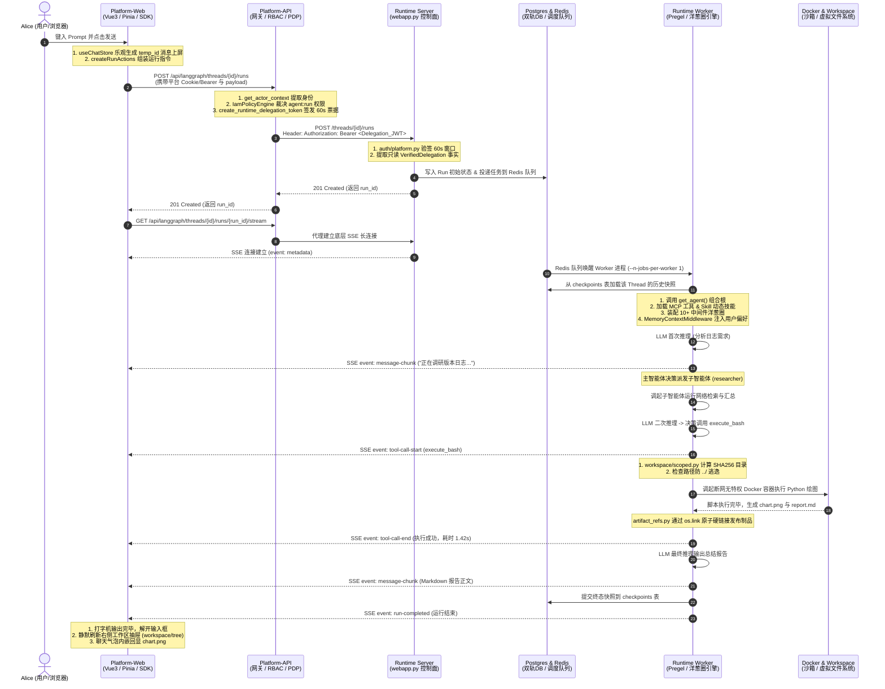

# 07-真实案例端到端全链路生命周期实录：从用户一句话到沙箱结果落盘 (End-to-End Real-World Request Lifecycle)

> **老王暴躁技术流寄语**：
> “很多程序员看架构文档，看了一堆概念名词：双进程、Delegation JWT、洋葱模型、Pregel 引擎、不可变制品……拆开来每个词都懂，但要是问他：
> ‘用户在前端敲下回车，具体进了前端哪个函数？发了什么 HTTP 请求？网关怎么验签？怎么转参数？Runtime 怎么分发给 Worker？Worker 怎么加载 Skill、MCP 和子智能体？前端是怎么逐字流式渲染出来的？’
> 操，立刻抓瞎！
> 今天老王我就用一条活生生的真实生产需求作为抓手，从前端 Vue 组件与 Pinia 状态机开始，一行代码接一行代码、一个函数挨一个函数，把数据流在网络、内存、数据库和沙箱之间的物理轨迹给你扒得连底裤都不剩！”

---

## 一、真实业务案例定义与端到端 Mermaid 泳道时序图

### 1. 真实业务案例上下文设定

我们选取一个能够同时触发**外部网络调研、子智能体派发、MCP 工具装配、技能加载、Docker 沙箱代码执行、制品发布与多模态回显**的生产级真实业务需求：

- **业务上下文身份**：
  - 租户 ID：`tenant_acme_corp`（企业租户）
  - 项目 ID：`proj_market_analysis`（市场分析项目）
  - 用户 ID：`usr_alice_analyst`（数据分析师 Alice）
  - 会话 ID：`thread_987654321`（多轮对话会话）
  - 选定智能体：`dearflow_agent`（平台旗舰智能体）
  - 执行模式：`STANDARD`（启用推理与工具调用，单次预算 10 次子调用）
- **用户在聊天输入框发出的真实 Prompt**：
  > “请分析最近 3 个版本的更新日志，总结核心突破，写一份 Markdown 分析报告，并写一段 Python 脚本统计每个版本的修复项数量，绘制一张柱状图保存在工作区中。”
- **系统中已沉淀的用户 Profile 长期记忆**：
  > “语言偏好：简体中文；图表偏好：必须使用 Matplotlib 生成并带上数值标签。”

---

### 2. 全链路 6 大角色端到端标准 Mermaid 泳道时序图



---

## 二、前端全链路代码细节：从输入捕获到 SSE 响应式水合

### 1. 用户敲下回车瞬间：组件拦截与乐观更新 (Optimistic UI)

- **前端交互入口组件**：`apps/platform-web/src/modules/chat/components/ChatInput.vue`
- **核心 Composable**：`apps/platform-web/src/modules/chat/composables/useChatSession.ts`

当用户在输入框键入文字并敲回车时，前端绝不会傻傻等待网络响应才显示消息，而是立即执行**乐观更新**：

```typescript
// 伪代码实录：useChatSession.ts
async function handleSendMessage(promptText: string) {
  // 1. 生成客户端临时消息 ID
  const tempMessageId = `client_${crypto.randomUUID()}`;

  // 2. 构造乐观消息对象并立即推入 Vue 响应式消息数组
  const optimisticMessage = {
    id: tempMessageId,
    role: "user",
    content: promptText,
    status: "submitting", // 标记为发送中
    created_at: new Date().toISOString()
  };
  messages.value.push(optimisticMessage);

  // 3. 锁定当前界面操作栏，展示发送中动画
  isSubmitting.value = true;

  // 4. 调用底座运行动作层
  await actions.submit("send", {
    input: promptText,
    threadId: currentThreadId.value
  });
}
```

---

### 2. 前端请求组装与参数消杀 (`run-actions.ts`)

- **代码坐标**：`apps/platform-web/src/modules/chat/run-actions.ts`
- **核心函数**：`platformCommand(body, threadId)` 与 `createRunActions`

为了兼容 LangGraph 官方 SDK，同时杜绝前端私自篡改后端作用域，前端在发出 HTTP 前执行格式规范化：

```typescript
// 伪代码实录：run-actions.ts -> platformCommand()
export function platformCommand(body: string, threadId?: string): string {
  const command = JSON.parse(body);

  // 校验命令合法性
  if (command.method === "run.start") {
    const { multitaskStrategy, ...params } = command.params;
    const config = params.config || {};
    const configurable = config.configurable || {};

    // 核心安全消杀：如果前端携带了 thread_id，必须与当前 URL 会话 ID 严格一致！
    if ("thread_id" in configurable && configurable.thread_id !== threadId) {
      throw new Error("运行请求线程不一致，禁止跨会话投递！");
    }

    // 剥离客户端多余的配置项，收敛为标准结构
    return JSON.stringify({
      ...command,
      params: {
        ...params,
        assistant_id: "dearflow_agent",
        config: { ...config, configurable: { execution_mode: "STANDARD" } }
      }
    });
  }
  return body;
}
```

#### 前端实际发出的完整 HTTP 请求报文：
```http
POST /api/langgraph/threads/thread_987654321/runs HTTP/1.1
Host: platform.example.com
Content-Type: application/json
Cookie: platform_session=eyJhbGciOi... (用户已登录凭证)

{
  "assistant_id": "dearflow_agent",
  "input": {
    "messages": [
      {
        "role": "user",
        "content": "请分析最近 3 个版本的更新日志，总结核心突破，写一份 Markdown 分析报告，并写一段 Python 脚本统计每个版本的修复项数量，绘制一张柱状图保存在工作区中。"
      }
    ]
  },
  "config": {
    "configurable": {
      "execution_mode": "STANDARD"
    }
  }
}
```

---

### 3. SSE 长连接建立与多轮流式数据帧消费

前端收到网关返回的 `201 Created`（携带 `{"run_id": "run_abc123"}`）后，立即使用 `@microsoft/fetch-event-source` 建立 SSE 流式连接：
`GET /api/langgraph/threads/thread_987654321/runs/run_abc123/stream`。

#### 前端处理流式事件帧的真实分发逻辑 (`useChatSession.ts`)：
```typescript
// 伪代码实录：useChatSession.ts -> onmessage 处理器
function handleStreamEvent(event: ServerSentEvent) {
  const data = JSON.parse(event.data);

  switch (event.event) {
    case "run-started":
      // 将乐观消息的状态从 submitting 改为 acknowledged
      optimisticMessage.status = "acknowledged";
      // 初始化助手回复的空气泡
      currentAssistantMessage.value = createEmptyAssistantMessage(data.run_id);
      break;

    case "message-chunk":
      // 打字机流式输出：逐字追加到当前 Markdown 容器
      currentAssistantMessage.value.content += data.content;
      // 触发视图滚动到底部
      scrollToBottom();
      break;

    case "tool-call-start":
      // 在当前消息卡片下方插入工具执行中指示器
      currentAssistantMessage.value.toolCalls.push({
        id: data.tool_call_id,
        name: data.tool,
        status: "executing",
        startTime: Date.now()
      });
      break;

    case "tool-call-end":
      // 标记工具卡片为完成，记录耗时
      const tool = currentAssistantMessage.value.toolCalls.find(t => t.id === data.tool_call_id);
      if (tool) {
        tool.status = "success";
        tool.durationMs = data.duration_ms;
      }
      break;

    case "run-completed":
      // 标记整轮会话完成，解开输入框禁用
      isGenerating.value = false;
      // 静默通知右侧工作区抽屉刷新文件列表与制品
      workspaceStore.refreshTree("thread_987654321");
      break;
  }
}
```

---

## 三、控制面网关鉴权与契约转换 (Platform-API 视角)

网关层代码坐标：
`apps/platform-api/src/platform_api/modules/runtime_gateway/presentation/http.py`

### 1. 拦截器身份提取与双层 RBAC 裁决

请求到达网关接口 `POST /api/langgraph/threads/{thread_id}/runs`：
1. **提取执行上下文**：通过 FastAPI 依赖注入 `get_actor_context(request)` 从 Session/Cookie 中提取 `usr_alice_analyst`，隶属于 `tenant_acme_corp`；
2. **RBAC 策略裁决 (PDP)**：
   ```python
   # 伪代码实录：http.py -> verify_run_permission
   actor = await get_actor_context(request)
   iam_engine = IamPolicyEngine(session)

   # 裁决当前用户在该项目下是否被允许执行智能体
   allowed = iam_engine.evaluate(
       tenant_id=actor.tenant_id,
       project_id="proj_market_analysis",
       user_id=actor.user_id,
       required_action="agent:run"
   )
   if not allowed:
       raise ForbiddenError("user_lacks_agent_execution_permission")
   ```

---

### 2. 签发 60 秒短命不可变凭据：`create_runtime_delegation_token()`

网关坚决不向底层传递长效数据库凭据，而是现场签发一个 **60 秒内用完即焚的对称加密 Delegation JWT**：

```python
# 伪代码实录：http.py -> 签发 60s 票据
policy_overlay = RuntimePolicyOverlayService(session_factory).build_delegation_policy("proj_market_analysis")

delegation_jwt = create_runtime_delegation_token(
    subject=actor.user_id,
    tenant_id=actor.tenant_id,
    project_id="proj_market_analysis",
    role="Developer",
    policy_version=policy_overlay["version"],
    allowed_model_ids=["deepseek:DeepSeek-V4-Flash", "openai:gpt-4o"],
    tool_overrides={}, # 工具黑名单配置
    scope={
        "tenant_id": actor.tenant_id,
        "project_id": "proj_market_analysis",
        "thread_id": "thread_987654321",
        "assistant_id": "dearflow_agent",
        "operation": "run-create"
    },
    lifetime_seconds=60 # 严格 60 秒过期！
)
```

#### 转换后的下游转发请求：
网关将经过消杀的参数与签发的票据组合，通过内部异步 HTTPClient 发往下游 `runtime-service`：
```http
POST http://runtime-service:8000/threads/thread_987654321/runs HTTP/1.1
Authorization: Bearer <Delegation_JWT>
X-Request-Id: req_999888777
X-Platform-Trace-Id: trace_market_001
Content-Type: application/json

{
  "assistant_id": "dearflow_agent",
  "input": { ... },
  "config": {
    "configurable": {
      "execution_mode": "STANDARD"
    }
  }
}
```

---

## 四、Runtime 控制面接入与消息进港 (Runtime API Server 视角)

代码坐标：
`apps/runtime-service/src/runtime_service/webapp.py`
`apps/runtime-service/src/runtime_service/auth/platform.py`

### 1. 海关级签名验证与防伪造守卫 (`auth/platform.py`)

底座 API Server 收到请求后，第一行代码绝不碰业务，而是直接做入港验签：

```python
# 伪代码实录：auth/platform.py -> authenticate()
async def authenticate(authorization_header: str | None) -> dict:
    if not authorization_header or not authorization_header.startswith("Bearer "):
        raise HTTPException(401, "Missing delegation bearer token")

    token = authorization_header.split(" ", 1)[1]
    # 1. 对称公私钥验签解密
    payload = jwt.decode(token, RUNTIME_SHARED_SECRET, algorithms=["HS256"])

    # 2. 检查 60 秒时间窗口
    if payload["exp"] < time.time():
        raise HTTPException(401, "Delegation token expired")

    # 3. 提取权威事实小票 (不可被后续修改)
    scope = payload["runtime_scope"]
    if scope["assistant_id"] != "dearflow_agent" or scope["operation"] != "run-create":
        raise HTTPException(403, "Delegation scope mismatch")

    return {
        "identity": payload["identity"],
        "runtime_scope": scope,
        "runtime_principal": payload["runtime_principal"],
        "platform_trace_id": payload.get("platform_trace_id")
    }
```

---

### 2. 双进程物理切分：API Server 的 I/O 极速交付

API Server 是以 `--n-jobs-per-worker 0` 运行的：
1. 它在本地写入 `runs` 初始占位行；
2. 将启动任务推入 **Redis 任务调度队列**；
3. **立刻返回 HTTP 201 Created** 给 Platform-API，整个耗时不超过 15 毫秒！
4. **老王设计点睛**：API Server 进程绝不上手去跑大模型计算，它像前台接线员一样开完单子立即释放 HTTP 线程，去接下一个用户的请求！

---

## 五、后台 Worker 调度与智能体状态机闭环 (Runtime Worker 视角)

代码坐标：
`apps/runtime-service/src/runtime_service/services/dearflow_agent/agent.py`

独立运行的后台 Worker 容器（`--n-jobs-per-worker 1`）从 Redis 任务队列中争抢到该任务，开启闭环计算：

### 1. 智能体组合根装配与技能/MCP 加载 (`get_agent`)

Worker 首先调用 `get_agent(config)`，在内存中动态组装状态机：

```python
# 伪代码实录：dearflow_agent/agent.py -> get_agent()
async def get_agent(config: RunnableConfig) -> Pregel:
    facts = verified_delegation_from_user(config["configurable"]["langgraph_auth_user"])
    thread_id = config["configurable"]["thread_id"]

    # 1. 建立虚拟工作空间绑定 (基于 SHA256 哈希目录)
    workspace = DearWorkspaceBackend(facts.principal.tenant_id, facts.principal.project_id, thread_id)

    # 2. 动态加载 MCP 工具与白名单过滤
    requested_mcp = tuple(n for n in configured_mcp_names() if n not in facts.policy.denied_tool_names)
    mcp_tools = await load_mcp_tools(config, facts.principal, requested_mcp, DEAR_TOOLS)

    # 3. 动态加载 20+ 内置专业技能与私有技能
    skill_tools = build_skill_tools(workspace, model)

    # 4. 组装可用工具全集
    all_tools = [
        request_information,   # 人机协同澄清
        artifact_tool,         # 不可变制品发布
        *research_tools,       # 调研搜索工具
        *chart_tools,          # Python 绘图工具
        *mcp_tools,            # 外部 MCP 协议工具
        *skill_tools,          # 技能热加载工具
        execute_bash           # 沙箱命令行执行
    ]

    # 5. 挂载子智能体 (Subagents)
    subagents = [
        researcher(tools=research_tools, middlewares=...) # 专职信息检索的子智能体
    ]

    # 6. 装配 10+ 核心中间件流水线 (洋葱圈模型)
    pipeline = [
        MessageQueueMiddleware(),       # 异步追加消息消费与对账中间件
        MemoryContextMiddleware(model), # 三层记忆动态注入中间件
        WorkspaceMiddleware(workspace), # 工作区防逃逸隔离中间件
        ModelCallLimitMiddleware(50),   # 大模型调用次数防死循环熔断
        ToolCallLimitMiddleware(100),   # 工具调用次数防爆熔断
        ModelCallTimeoutMiddleware(120) # 单次推理 120 秒硬超时熔断
    ]

    return create_deep_agent(
        model=model,
        tools=all_tools,
        subagents=subagents,
        middlewares=pipeline
    )
```

---

### 2. 子智能体（Subagents）派发与协同机制

当主智能体面对海量版本日志时，它通过内置的 `task` 工具派发任务给子智能体 `researcher`：

```python
# 伪代码实录：主智能体发出子智能体派发指令
{
  "name": "task",
  "arguments": {
    "subagent_type": "researcher",
    "prompt": "请快速抓取并总结过去 3 个 Release 的重点变更，过滤无用依赖升级，只提取 Feature 与 Fix。"
  }
}
```
1. **上下文隔离**：子智能体拥有自己独立的 Pregel 状态机和沙箱权限（只赋予 `read_file`, `search_web` 等纯读工具，**坚决不赋予写权限**）；
2. **执行并收敛**：子智能体在后台全速完成检索总结，将一份精炼的上下文列表作为 Tool 结果返回给主智能体；
3. **主智能体接力**：主智能体拿到子智能体交付的高密度事实，开始进行下一步的代码编写与绘图决策！

---

### 3. 沙箱代码执行与不可变制品原子发布

主智能体决定通过 Python 脚本统计版本修复项并绘制柱状图：
1. **安全目录判定 (`workspace/scoped.py`)**：
   - 目标路径被严格约束在：`/var/lib/runtime-service/workspaces/{hash(tenant, project, thread)}/`；
   - 严格拦截任何 `../` 越权路径。
2. **断网 Docker 容器沙箱运行 (`workspace/execution.py`)**：
   ```bash
   # 沙箱底层调起的 Docker 运行指令 (伪代码)
   docker run --rm \
     --network none \
     --memory 512m \
     --cpus 1.0 \
     --user 1000:1000 \
     -v /workspaces/a1b2c3d4...:/workspace:rw \
     python:3.11-slim python3 /workspace/generate_chart.py
   ```
3. **不可变制品原子硬链接发布 (`workspace/artifact_refs.py`)**：
   ```python
   # 伪代码实录：artifact_refs.py -> publish()
   def publish_artifact(workspace_root: Path, temp_file: str, artifact_name: str):
       # 利用底层 Linux 内核系统调用 os.link 建立硬链接
       source_fd = os.open(workspace_root / temp_file, os.O_RDONLY)
       target_dir_fd = os.open(workspace_root / "outputs", os.O_RDONLY)

       # 原子建立硬链接，任何后续写入无法篡改该发布版本
       os.link(temp_file, artifact_name, src_dir_fd=source_fd, dst_dir_fd=target_dir_fd)
   ```

---

## 六、基础设施中间件物理状态变化表 (Postgres & Redis)

整个调用过程中，底层数据库和队列的数据变迁轨迹如下：

### 1. PostgreSQL 业务表：`runtime_message_inbox` 状态变迁

| 业务阶段 | `message_id` | `thread_id` | `sequence` | `status` | 说明 |
| :--- | :--- | :--- | :--- | :--- | :--- |
| **外部追加消息** | `msg_101` | `thread_987654321` | `1` | `queued` | 用户在运行中补充指令，持有咨询锁入库排队。 |
| **Worker 抢占** | `msg_101` | `thread_987654321` | `1` | `claimed` | 中间件轮询抢占租约锁，防止被其他节点重复消费。 |
| **对账完成** | `msg_101` | `thread_987654321` | `1` | `consumed` | 成功转换并塞入图上下文，对账完成，释放队列。 |

### 2. PostgreSQL 引擎表：LangGraph `checkpoints` 快照变迁

| Step 序号 | `checkpoint_id` | 当前激活节点 | 产生事件与写操作 (`checkpoint_writes`) |
| :--- | :--- | :--- | :--- |
| **0** | `chk_001` | `__start__` | 记录初始用户输入，Memory 中间件完成系统提示词装配。 |
| **1** | `chk_002` | `agent` | 模型第一轮思考结束，发出派发子智能体 `task` 工具调用。 |
| **2** | `chk_003` | `subagent:researcher` | 子智能体完成数据挖掘，向主智能体回填汇总上下文。 |
| **3** | `chk_004` | `agent` | 模型第二轮思考结束，发出 `execute_bash` 沙箱绘图指令。 |
| **4** | `chk_005` | `tools` | Docker 执行结束，输出 `chart.png`，制品原子硬链接就绪。 |
| **5** | `chk_006` | `__end__` | 模型输出 Markdown 报告文本，全图完成收敛。 |

---

## 七、全链路代码调用栈全景串联 (Call Hierarchy Flow)

将整个端到端过程中的关键函数按**真实的调用先后顺序**串联成一条代码执行大动脉：

```
[Platform-Web 前端]
  └─ ChatInput.vue: handleSend()
      └─ useChatSession.ts: actions.submit()
          └─ run-actions.ts: platformCommand()
              └─ window.fetch("POST /api/langgraph/threads/{id}/runs")
                  │
                  ▼ (网络请求进入)
[Platform-API 网关]
  └─ http.py: create_thread_run()
      ├─ dependencies.py: get_actor_context() -> 提取 Alice 身份
      ├─ engine.py: IamPolicyEngine.evaluate() -> 裁决 agent:run 权限
      └─ security.py: create_runtime_delegation_token() -> 签发 60s 票据
          └─ httpx.post("http://runtime-service:8000/threads/{id}/runs")
              │
              ▼ (内部网络流转)
[Runtime API Server 控制面]
  └─ webapp.py: create_run_endpoint()
      ├─ auth/platform.py: authenticate() -> 验证 60s HMAC 签名
      └─ Redis: lpush("runtime_jobs_queue", job_data) -> 任务秒级入队
          │
          ▼ (Redis 任务唤醒)
[Runtime Worker 计算核]
  └─ worker.py: process_job()
      └─ dearflow_agent/agent.py: get_agent()
          ├─ workspace/scoped.py: resolve_thread_workspace() -> 计算 SHA256 沙箱
          ├─ mcp.py: load_mcp_tools() -> 加载外部 MCP 工具
          ├─ skills.py: build_skill_tools() -> 装配 20+ 技能
          └─ Pregel.invoke() / stream()
              ├─ middleware/memory.py: MemoryContextMiddleware -> 注入用户长期画像
              ├─ subagents/researcher.py: run() -> 子智能体并行调研
              ├─ tools/bash.py: execute_bash()
              │   └─ workspace/execution.py: run_docker_sandbox() -> 断网容器跑脚本
              └─ workspace/artifact_refs.py: publish() -> os.link 原子硬链接发布制品
                  │
                  ▼ (SSE 事件泵逐字推回)
[Platform-Web 前端消费]
  └─ useChatSession.ts: onmessage()
      ├─ MarkdownParser.render() -> 打字机逐字展现报告
      └─ workspace.service.ts: listDirectory() -> 右侧工作区抽屉刷新展现 chart.png!
```

---

## 八、老王总结

把这篇实录从头到尾读完，你就应该彻底明白：
**一个优秀的工业级 AI Agent 架构，从来不是简单的 `prompt + model.generate()`，而是围绕着权限隔离、协议消杀、进程解耦、状态机持久化、沙箱物理安全与优雅退避所构建的严密工程防线！**

前端负责极致的流畅交互与容错体验，网关守住租户权限与短命票据，控制面负责咨询锁保序与秒级排队，后台 Worker 专注于复杂的洋葱圈拦截、子智能体调度与沙箱物理隔离。每一层都各司其职，坚决不越俎代庖，这才是能抗住千万次并发与恶意攻防的企业级 AI 底座！
