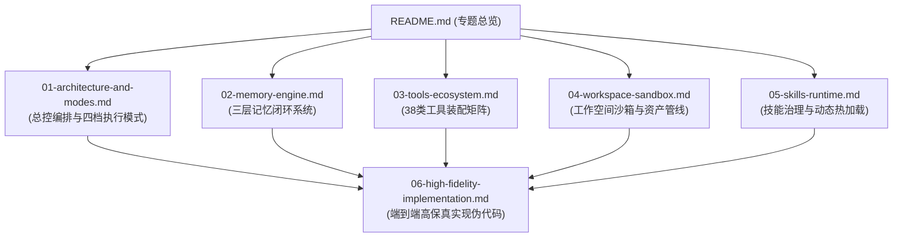

# DearFlow Agent 架构全景与专题导读

## 智能体定位与核心价值

`DearFlow Agent`（代码坐标：[apps/runtime-service/src/runtime_service/services/dearflow_agent/](../../../../apps/runtime-service/src/runtime_service/services/dearflow_agent)）是 `ai-agent-platform` 的核心旗舰智能体。

不同于演示性质的简单玩具 Agent，`DearFlow Agent` 承担了平台中最复杂的企业级通用任务：
- **深度研究与综合分析**：自主搜集论文、技术文档、企业内部知识库，多轮交叉核验。
- **软件研发与工程交付**：通过虚拟文件系统沙箱、交互式 PTY 终端进行代码阅读、修改、测试与云端发布。
- **专业技能动态武装**：随时通过自然语言或 ZIP 技能包挂载 20+ 类内置专业能力（如论文评审、PPT 生成、前端设计、图表渲染等）。
- **长期记忆与个性化闭环**：具备跨会话的用户画像事实记忆与会话上下文记忆，在多租户隐私红线内实现自主沉淀。

---

## 专题文档导航矩阵

为了全方位、无死角地剖析 DearFlow Agent 的工程实现，本专题按技术逻辑拆解为 6 个独立的深度章节：

| 章节与链接 | 核心内容与技术考量 | 对应核心源码坐标 |
|---|---|---|
| [01-architecture-and-modes.md](01-architecture-and-modes.md) | **总控编排与四档执行模式** • `create_deep_agent` 核心图拓扑组装 • 10+ 深度中间件流水线调用链 • `modes.py` 四档算力调配（Flash/Standard/Pro/Ultra）与特性组合（Reasoning/Planning/Delegation） | `agent.py` `modes.py` `prompts.py` |
| [02-memory-engine.md](02-memory-engine.md) | **三层记忆闭环系统** • Profile 画像事实记忆、Session 短期记忆与 Working 动态检索 • `MemoryContextMiddleware` 智能语义注入 • 多租户隐私边界与授权审查 | `memory.py` `middleware/memory.py` `memory_access.py` |
| [03-tools-ecosystem.md](03-tools-ecosystem.md) | **38类工具装配矩阵** • 深度检索（Web/ArXiv）、工程联动（GitHub/Vercel）、图表与多模态渲染 • 工具参数动态校验与大体积结果自动落盘引流 • 人工介入澄清工具（`request_information`） | `tools/search.py` `tools/chart.py` `tools/media.py` `tools/human_input.py` |
| [04-workspace-sandbox.md](04-workspace-sandbox.md) | **工作空间沙箱与资产管线** • `DearWorkspaceBackend` 虚拟工作空间映射与防逃逸校验 • PTY 伪终端交互式执行与硬超时防护 • `PERMISSIONS` 反自我篡改只读黑名单 | `workspace/backend.py` `workspace/terminal.py` `workspace/artifact_refs.py` |
| [05-skills-runtime.md](05-skills-runtime.md) | **技能治理与动态热加载** • 20+ 内置专业技能解析与分发 • ZIP 自定义技能包生命周期治理与 `expected_revision` 乐观锁 • `skills_hash` 快照不可变性保证运行稳定性 | `skill_governance.py` `skill_catalog.py` `tools/skills.py` |
| [06-high-fidelity-implementation.md](06-high-fidelity-implementation.md) | **端到端高保真实现伪代码** • 剥离第三方库冗余包装的单文件级完整装配还原 • 状态机从初始化、中间件拦截、工具执行到落盘全景闭环 | 全模块代码凝练还原 |

---

## 核心技术规格速览

- **底座框架**：LangGraph Pregel 状态图引擎
- **支持模型协议**：OpenAI / Anthropic / DeepSeek 标准 Chat Completion API
- **沙箱隔离机制**：基于路径正则匹配与用户/项目 ID 强隔离的虚拟工作空间
- **最大并发子智能体派发数**：10 次 / Run
- **默认超时熔断**：单命令执行最大 60 秒，单次模型调用最大 120 秒
