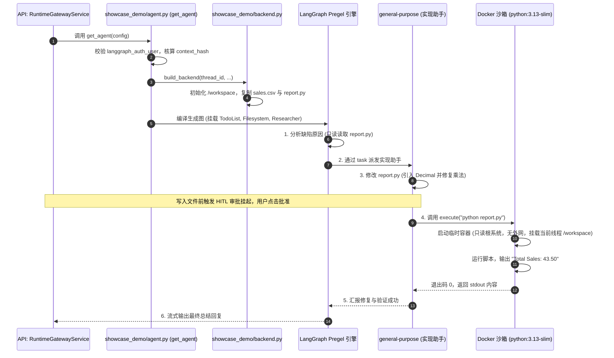

# 02-演示智能体：Showcase Agent 最小工业级参考骨架 (Showcase Demo Agent Reference)

## 模块定位与核心价值

如果说 `DearFlow Agent` 是一艘功能完备、重达十万吨的核动力航空母舰，那么 `Showcase Agent`（代码坐标：[apps/runtime-service/src/runtime_service/services/demo/showcase_demo/](file:///Users/lijiaxin/PyCharmMiscProject/ai-agent-platform/apps/runtime-service/src/runtime_service/services/demo/showcase_demo/)）就是一艘**去除了全部非核心装甲、专为教学研读与二次开发参考打造的工业级标准护卫舰**。

很多技术团队在尝试将 LangChain、LangGraph 与 Deep Agents 引入自研平台时，往往面临“官方 Demo 太简陋无法用于生产，而真实业务项目又太臃肿无从下手”的困境。

`Showcase Agent` 填补了这个空白，它的设计哲学是**“最小平台接入、最大官方原生”**：
1. **显式装配组合根（Explicit Composition Root）**：整个服务没有自建冗余的 Agent 循环、没有重复造轮子的 Builder，仅仅以一个自包含的 `agent.py`，完整演示如何将平台控制面策略、双向 Delegation 凭证置换与 LangGraph 原生图编译严丝合缝地拼接在一起。
2. **教学缺陷实战靶场（Sales Report Scenario）**：内置一个带有真实数值计算缺陷的 Python 销售报表项目（`report.py` 统计时未乘数量，预期输出 `43.50`，实际输出 `27.00`），直观演示智能体如何经历“只读代码分析 -> 制定 Todo 计划 -> 申请修改审批 -> 执行测试验证”的全流程。
3. **原生三角色子智能体矩阵（Declarative SubAgents）**：声明只读检索员（`research`）、代码实现助手（`general-purpose`）与 AntV MCP 图表助手（`chart-agent`），展示如何用最小代价实现精准的权限隔离。
4. **双运行后端隔离范式（Docker vs LocalShell）**：展示生产环境下如何将代码执行隔离在无网络、只读根目录的 Docker 容器中，同时为本地轻量开发保留 `LocalShellBackend`。

---

## 零、知识前置与上下文串联（Knowledge Bridges）

### 1. 认知输入（前置模块输入）
- 依赖 [07-agents/01-dearflow-agent/01-architecture-and-modes.md](file:///Users/lijiaxin/PyCharmMiscProject/ai-agent-platform/docs/architecture/07-agents/01-dearflow-agent/01-architecture-and-modes.md)：理解企业级 Agent 的完整中间件栈是如何与 LangGraph 运行时集成的。
- 依赖 [05-runtime-service/03-hitl-and-interrupts.md](file:///Users/lijiaxin/PyCharmMiscProject/ai-agent-platform/docs/architecture/05-runtime-service/03-hitl-and-interrupts.md)：掌握在执行修改与运行代码前，`interrupt_on` 是如何暂停状态机的。

### 2. 本章核心流转
- **平台凭据核验**：`verified_delegation_from_user` 校验 Delegation JWT 与 `context_hash` 是否一致，阻断测试后门。
- **环境安全初始化**：`create_workspace` 派生独立线程工作区，挂载初始教学工程（`sales.csv`、`report.py`）。
- **原生图编排调度**：基于 `create_deep_agent` 串联官方 `FilesystemMiddleware`、`TodoListMiddleware` 与 AntV 图表 MCP。
- **真实 Docker 执行验证**：模型在容器沙箱中运行 `python report.py`，捕获真实的合并 stdout/stderr。

### 3. 认知输出（支撑后续模块）
- 为团队开发全新的垂直领域智能体提供**可以直接 Copy 作为脚手架**的标准工程模板。

---

## 一、对立视角：简易原型 vs 生产架构（Naive vs Production）

| 维度 | 玩具级演示 Agent (Naive Demo) | Showcase Agent 生产级教学骨架 (Production Reference) | 选型与演进考量 |
| :--- | :--- | :--- | :--- |
| **执行真实性** | Mock 代码执行结果，工具直接硬编码返回 `{"status": "success"}` 假装跑过了测试。 | 真实运行 Python 解释器与测试脚本，返回真实的退出码与输出字节流，缺陷不修复测试真报错。 | 杜绝大模型在虚拟的假反馈中产生严重幻觉，保障生成的代码真实可用。 |
| **执行环境隔离** | 直接在开发机宿主机当前目录下跑 `eval()` 或 `os.system`，有删盘风险。 | 生产模式使用 Docker：无网络、只读根文件系统、去除 capabilities、CPU/内存/进程数硬限制。 | 确保即使模型写出恶意代码，破坏力也被严格锁死在单次执行的临时容器内。 |
| **平台对接纯度** | 为了接入平台在代码里手写第二套审批状态、自建消息队列甚至手写 Agent 调度循环。 | 保持轻量纯粹：所有状态机与工具循环全部委托给官方原生能力，仅增加一层可信身份核验中间件。 | 降低架构维护成本，最大化利用开源社区在底座运行时的性能优化与错误修复。 |
| **测试身份隔离** | 为了方便在生产代码里留下 `if user == "admin_test": bypass()` 等测试后门。 | 代码中硬编码 `reject_untrusted_configurable`，只要检测到 `_runtime_test_*` 直接抛出认证错误。 | 彻底阻断由开发便利性妥协带来的高危生产越权漏洞。 |

---

## 二、源码精准坐标映射（Code Pointer Map）

### 1. 组合根与平台接入
- [services/demo/showcase_demo/agent.py](file:///Users/lijiaxin/PyCharmMiscProject/ai-agent-platform/apps/runtime-service/src/runtime_service/services/demo/showcase_demo/agent.py)：
  - `get_agent()`：唯一的异步图构造工厂，负责提取并校验 `langgraph_auth_user`，解析 `RuntimeContext` 与哈希比对。
  - `_DEFAULTS`：默认绑定 `deepseek:DeepSeek-V4-Flash` 模型与版本声明。
- [services/demo/showcase_demo/prompts.py](file:///Users/lijiaxin/PyCharmMiscProject/ai-agent-platform/apps/runtime-service/src/runtime_service/services/demo/showcase_demo/prompts.py)：
  - 纯函数式系统提示词，严禁在提示词文件中读取环境变量或发起网络 I/O。

### 2. 子智能体与角色划分
- [services/demo/showcase_demo/subagents.py](file:///Users/lijiaxin/PyCharmMiscProject/ai-agent-platform/apps/runtime-service/src/runtime_service/services/demo/showcase_demo/subagents.py)：
  - `research` 角色：仅具备 `ls`, `read_file`, `glob`, `grep`，剥夺一切写权限与命令执行权限。
  - `general-purpose` 角色：明确配置的实现助手，拥有读写和执行工具，但禁止再次委派。
  - `chart-agent` 角色：专用于调用 AntV MCP 生成可视化图表。

### 3. 沙箱执行适配器
- [services/demo/showcase_demo/backend.py](file:///Users/lijiaxin/PyCharmMiscProject/ai-agent-platform/apps/runtime-service/src/runtime_service/services/demo/showcase_demo/backend.py)：
  - `create_workspace()`：初始化线程数据目录，复制初始销售报表工程。
  - `build_backend()`：根据环境变量 `RUNTIME_BACKEND` 动态切换 Docker 容器沙箱与 LocalShell 本地沙箱。

### 4. 工具与 MCP 接入
- [services/demo/showcase_demo/tools.py](file:///Users/lijiaxin/PyCharmMiscProject/ai-agent-platform/apps/runtime-service/src/runtime_service/services/demo/showcase_demo/tools.py)：
  - `fetch_documentation`：受限的官方文档拉取工具（白名单限定仅允许抓取特定官方文档域名）。
- [services/demo/showcase_demo/chart.py](file:///Users/lijiaxin/PyCharmMiscProject/ai-agent-platform/apps/runtime-service/src/runtime_service/services/demo/showcase_demo/chart.py)：
  - 适配 `@antv/mcp-server-chart@0.9.10` 标准 MCP Server，将生成的图表安全落盘到 `/workspace/charts/`。

---

## 三、真实数据结构与报文（Real Payloads & DB Schemas）

### 1. 教学项目工程初始状态（/workspace 布局）
新线程初次启动时，沙箱自动生成的真实工程目录：

```text
/workspace/
├── README.md      # 任务说明文档
├── sales.csv      # 销售数据: item,price,quantity
└── report.py      # 存在计算缺陷的统计脚本 (缺少 price * quantity)
```

其中 `report.py` 的关键缺陷代码：
```python
# report.py 缺陷代码：只加了单价，漏乘了数量
total = sum(float(row['price']) for row in reader) # 输出 27.00
# 预期修复后的正确代码：
# total = sum(Decimal(row['price']) * int(row['quantity']) for row in reader) # 输出 43.50
```

### 2. 运行时配置校验报文（RunnableConfig.configurable）
网关转发至 `get_agent` 的核心配置实体：

```json
{
  "configurable": {
    "thread_id": "th-showcase-20260929-01",
    "assistant_id": "showcase_demo",
    "graph_id": "showcase_demo",
    "langgraph_auth_user": {
      "identity": "usr-88910",
      "tenant_id": "tenant-default",
      "project_id": "proj-90f1ac23",
      "runtime_scope": {
        "operation": "run-create",
        "thread_id": "th-showcase-20260929-01"
      }
    }
  },
  "context": {
    "model_id": "deepseek:DeepSeek-V4-Flash",
    "temperature": 0.0,
    "access_policy": "review"
  }
}
```

---

## 四、端到端函数级调用时序（Function-Level Trace）

从用户要求“修复报表并验证”到 Docker 容器安全执行验证的完整时序：



---

## 五、核心实现高保真伪代码（High-Fidelity Pseudocode）

### 1. 显式装配组合根（agent.py）
```python
# 对应 apps/runtime-service/src/runtime_service/services/demo/showcase_demo/agent.py

async def get_agent(config: RunnableConfig) -> Pregel:
    configurable = config.get("configurable") or {}

    # 1. 强力安全拦截：严禁传入测试适配器参数
    reject_untrusted_configurable(configurable)
    if any(str(k).startswith("_runtime_test_") for k in configurable):
        raise RuntimeAuthError("runtime.auth.test_adapter_forbidden")

    # 2. 解析受信任的 Delegation 凭据
    user = configurable.get("langgraph_auth_user")
    facts = verified_delegation_from_user(user) if user is not None else None
    executing = facts is not None and facts.scope.operation == "run-create"

    workspace = None
    if executing:
        thread_id = configurable.get("thread_id")
        context = parse_runtime_context(config.get("context"))

        # 3. 严格比对上下文哈希与签名，防中途篡改
        if runtime_context_hash(context) != facts.context_hash:
            raise RuntimeAuthError("runtime.auth.context_hash_mismatch")

        # 4. 构建并绑定线程工作区
        workspace = create_workspace(thread_id, facts.principal)
        backend = build_backend(workspace)

    # 5. 组装声明式子智能体与官方中间件
    subagents = build_subagents(backend)
    model = build_model(resolved.model_id, temperature=0.0)

    # 6. 使用官方原生 create_deep_agent 编译状态机
    return create_deep_agent(
        model=model,
        system_prompt=SYSTEM_PROMPT,
        tools=[fetch_documentation, build_artifact_tool(workspace)],
        subagents=subagents,
        backend=backend,
        middleware=[
            TodoListMiddleware(),  # 任务规划器
            ToolCallLimitMiddleware(tool_name="task", run_limit=10),
            ModelCallTimeoutMiddleware(timeout_seconds=30),
            ImageToolsMiddleware(workspace),
        ],
        interrupt_on=interrupts_for_access_policy(context.access_policy, APPROVALS),
    )
```

### 2. Docker 生产容器安全执行隔离（backend.py）
```python
# 对应 apps/runtime-service/src/runtime_service/services/demo/showcase_demo/backend.py

class DockerExecutionBackend:
    def execute(self, command: str, timeout_seconds: int = 30) -> tuple[int, str]:
        # 严格限制超时在 1 到 60 秒之间
        timeout = max(1, min(timeout_seconds, 60))

        # 组装安全加固的 Docker 启动参数
        docker_cmd = [
            "docker", "run", "--rm",
            "--network", "none",                   # 1. 物理切断网络访问
            "--read-only",                         # 2. 根文件系统只读
            "--cap-drop", "ALL",                   # 3. 剥离所有 Linux Capabilities
            "--security-opt", "no-new-privileges", # 4. 严禁提权
            "--cpus", "1.0",                       # 5. 限制单核 CPU
            "--memory", "512m",                    # 6. 限制最大内存 512MB
            "-v", f"{self.workspace_dir}:/workspace:rw", # 仅挂载当前会话工作区
            "-w", "/workspace",
            os.environ.get("RUNTIME_SHOWCASE_IMAGE", "python:3.13-slim"),
            "sh", "-c", command
        ]

        proc = subprocess.run(
            docker_cmd,
            stdout=subprocess.PIPE,
            stderr=subprocess.STDOUT,
            timeout=timeout,
            text=True
        )
        # 限制最大返回 128 KiB 输出，防爆内存
        output = proc.stdout[:131072] if proc.stdout else ""
        return proc.returncode, output
```

---

## 六、假想断电与极限场景推演（Thought Experiments）

### 场景一：开发者试图在请求中注入 `_runtime_test_mock_user` 伪造身份
- **推演过程**：开发人员在调试时，试图在 `configurable` 里夹带测试字段绕过平台认证直接以管理员权限执行。
- **系统表现**：`get_agent` 开头显式执行 `any(str(k).startswith("_runtime_test_") for k in configurable)`。一旦发现测试前缀，立即抛出 `RuntimeAuthError("runtime.auth.test_adapter_forbidden")`，请求被瞬间掐死，彻底杜绝了“测试代码带入生产环境”的安全隐患。

### 场景二：智能体生成的修复代码中包含死循环（如 `while True: pass`）
- **推演过程**：模型修改了 `report.py` 并加入了无限循环逻辑，随后调用 `execute("python report.py")` 进行验证。
- **系统表现**：Docker 容器执行受到 `subprocess.run(timeout=30)` 守护。当达到 30 秒超时阈值时，Python 进程触发 `TimeoutExpired`，系统自动终止并强制移除该 Docker 容器（`--rm` 保证无残留容器），同时向模型回填 `ExecutionTimeoutError: Command timed out after 30s`，模型接收到错误反馈后再次进入自我纠偏。

### 场景三：只读研究角色（`research`）试图写文件
- **推演过程**：主 Agent 将任务派发给 `research` 子智能体，该子智能体产生幻觉尝试调用 `write_file(path="note.txt")`。
- **系统表现**：在 `subagents.py` 中，`research` 角色的工具清单仅声明了 `ls`, `read_file`, `glob`, `grep`，其工具表里根本不存在 `write_file`。Pregel 引擎在工具分发阶段判定工具未注册抛出异常，写操作被物理化解，绝无可能穿透。

---

## 七、架构不变量清单（Architectural Invariants）

1. **唯一显式组合根原则**：Agent 的所有组件装配、中间件挂载与模型连接，必须且仅能在 `agent.py` 的 `get_agent()` 中完成，严禁存在隐式动态全局注册。
2. **测试后门物理绝缘原则**：正式运行时入口绝对禁止包含任何 `_runtime_test_*` 前缀的入参，测试用 Mock 仅能存在于 `tests/` 目录下。
3. **Docker 沙箱安全基线原则**：生产环境执行代码时，Docker 容器必须强制满足：切断网络（`--network none`）、只读根文件系统（`--read-only`）、剥离全部特权（`--cap-drop ALL`）与超时硬熔断（最大 60 秒）。
4. **子智能体最小权限声明不变量**：子智能体角色必须显式声明其专属的最小工具集，只读检索角色严禁授予任何文件写权限或代码执行权限。
