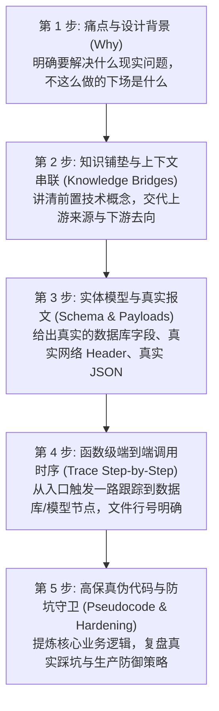

# 架构分析与源码解读方法论：工业级技术深潜文档编写指南

这份指南定义了平台内所有架构与源码解读文档的编写标准。文档服务于二次开发、生产架构落地与新成员代码熟悉。任何技术文档都必须包含业务背景、前置知识、真实报文、源码坐标、调用时序与核心伪代码。

---

## 零、 技术文档的三大常见陷阱

很多项目的内部文档写完即过时，或者让人读完依然无法着手改代码，通常源于以下三种通病：

1. **宏观图纸病**：整篇文档只有架构框图和抽象名词，没有指明具体文件、函数名与数据库表。读者知道系统有鉴权层，但不知道哪个文件负责验签。
2. **源码搬运病**：把十几个文件的代码大段粘贴进文档，缺少设计取舍说明。读者看到了具体实现，但不知道为什么采用这种写法，也不知道改动会引发什么连锁反应。
3. **知识孤岛病**：直接给出算法或数据结构，没有交代前置网络协议、输入来源与下游去向。缺少上下文，读者难以理解代码中的字段定义。

---

## 一、 借鉴谷歌与深度学习工程的五项核心心法

在大型开源软件与复杂系统分析中，谷歌工程实践与 Gemini 研发团队沉淀出了一套高效的源码剖析思路。这套方法论包含五个核心原则：

### 1. 切斯特顿栅栏与被否决方案（Chesterton's Fence & Rejected Alternatives）

代码本身记录了最终的实现方式，但没有记录放弃的方案。只看现有代码，新工程师容易产生“这块设计过于繁琐，不如改成简单写法”的冲动。

文档必须记录两点：
- **当初为什么没有采用更简单的方案**：例如平台没有使用单库 PostgreSQL 配合逻辑隔离，而是采用了双物理库。文档需要明确写出：海量执行快照并发写入时会挤占连接池，导致管理后台账号查询超时。
- **看似多余代码的实际防范目标**：例如 `tool_overrides` 参数强制要求全为 `false`，表面上限制了配置灵活性，实际是为了防止通过接口传入 `true` 实现未授权提权。

### 2. 传送门概念优先（Threshold Concepts）

大型工程的代码量通常在数万行到数百万行之间，逐行通读并不现实。任何系统都存在两到三个核心枢纽机制，被称为“传送门概念”。一旦掌握这几个机制，其余大部分模块的运行逻辑均可推导出来。

- 在 Chromium 中，这个概念是多进程架构与 IPC 管道；
- 在当前 Agent 平台中，核心枢纽是两个机制：
  1. **无状态网关与短时委托（Delegation JWT）**：决定了控制面与运行面的信任边界；
  2. **有向图状态机与检查点切片（StateGraph & Checkpoint）**：决定了长任务运行状态与单次 HTTP 连接的分离机制。

编写文档时，应将主要篇幅分配给核心枢纽机制，次要的辅助模块只做索引和简要交代。

### 3. 对比教学法（Naive Demo vs. Production Reality）

很多读者难以体会架构设计的用意，原因在于缺乏对照组。

在解析复杂模块前，先展示初学者的简易实现，再展示生产系统的完整实现：
- **简易原型**：在接口处理函数中定义全局变量，同步等待大模型返回；
- **暴露问题**：并发请求相互覆盖、网络抖动造成连接断开、大模型长思考引发网关 504 超时、服务重启导致执行进度丢失；
- **工业实现**：拆分 API 与 Worker 进程，引入 Redis 任务队列，配合 Checkpoint 持久化与流式心跳注入。

通过方案对比，技术设计的合理性能够直观呈现。

### 4. 架构不变量清单（Architectural Invariants）

不变量是指系统在任何功能迭代或重构中都必须严格遵守的边界规则。破坏不变量会导致系统稳定性崩溃。

每个模块的文档末尾，需要提炼出三到四条红线规则。例如：
- 控制面服务严禁直接读取或写入运行时数据库；
- 委托小票（Delegation JWT）的有效时间严禁超过 60 秒；
- 网关单帧 SSE 数据严禁超过 8 MiB，超限必须切断；
- 网络断开属于连接事件，严禁将未完成的 Run 标记为失败。

### 5. 假想断电与极限场景推演（Thought Experiments）

阅读静态代码难以建立系统的动态运行心智。在复杂状态机与长链路章节中，应设计具体的边界推演问题：
- “假设 Worker 正在执行第 3 个工具调用，机房网络瞬间中断 5 秒，Redis 队列、PostgreSQL 检查点以及前端页面分别处于什么状态？”
- “当用户刷新网页重新连入时，前端发出的第一个请求是什么？如何通过快照实现无感知自愈？”

通过追溯故障场景下的数据流向，验证代码异常处理分支的正确性。

---

## 二、 工业级架构分析的五步深潜法

撰写每一篇模块解读时，统一执行以下五个步骤：



1. **找准问题边界与痛点（Why）**：先说清楚如果不做这个设计，系统会面临什么故障，杜绝上来就贴结构。
2. **架设前置知识桥梁（Bridges）**：针对涉及的协议与算法（如 JWT 对称哈希、SSE 规范中的注释帧格式、ASGI 异步并发中的 `ContextVar` 原理），用简洁明了的语言完成概念交代。
3. **实体建模与真实报文（Schema & Payloads）**：给出确切的字段定义，包含数据库关键列、HTTP 请求头、JSON 载荷与枚举参数。
4. **函数级调用栈跟踪（Call-Stack Tracing）**：使用时序图，标明请求从前端组件到控制面中间件、适配层，再到运行时图节点的全流程，包含相对路径与核心类名。
5. **高保真核心伪代码（Pseudocode & Hardening）**：剥离框架代码，忠实呈现业务主分支、校验约束、边界条件与异常恢复逻辑。

---

## 三、 知识串联机制（三承三启原则）

为避免文档出现“只贴代码、没有上下文”的孤岛问题，所有模块文档必须具备明确的承前启后结构：

1. **承前（上游输入）**：
   - 标明触发当前流程的上游组件（例如前端的某一个 Composable 函数或 API 某个路由）；
   - 列出进入当前模块前必须了解的前置技术概念，避免专业术语断层。
2. **居中（当前转换）**：
   - 剖析当前模块对输入数据执行的操作，包括数据校验、权限审计、结构变形、临时状态落库。
3. **启后（下游消费）**：
   - 说明当前模块处理后的产物交给了哪个下游组件；
   - 说明下游基于该产物完成了哪些操作（例如运行时收到小票后提取白名单模型完成初始化）。

---

## 四、 目录编排与数字编号体系

为避免读者在跳转中失去阅读方向，目录与文件名统一采用两级数字编号，并按知识依赖顺序排列：

```text
docs/architecture/
├── README.md                                # 架构全景大地图、学习指南与依赖关系
├── METHODOLOGY.md                           # 本方法论规范
│
├── 01-overview/                             # 第一层：宏观拓扑与技术全景
│   ├── 01-system-topology.md                # 01-01 系统整体拓扑图与进程全景 (内嵌 Archify 交互图)
│   ├── 02-tech-stack.md                     # 01-02 技术栈清单与深度选型考量
│   └── 03-design-principles.md              # 01-03 核心架构设计原则与权衡
│
├── 02-cross-cutting/                        # 第二层：跨服务通信与协同对接
│   ├── 01-communication-matrix.md           # 02-01 服务间通信全景矩阵
│   ├── 02-delegation-auth.md                # 02-02 委托鉴权机制与短时令牌
│   ├── 03-sse-streaming-pipeline.md         # 02-03 SSE 流式推送全链路与自愈机制
│   ├── 04-trace-and-observability.md        # 02-04 全链路追踪与可观测性体系
│   └── 05-data-isolation.md                 # 02-05 存储架构与数据隔离模型
│
├── 03-platform-web/                         # 第三层：前端平台宿主架构
│   ├── 01-architecture.md                   # 03-01 前端分层与工程骨架
│   ├── 02-chat-session-engine.md            # 03-02 对话会话池与多 Tab 保活状态机
│   └── 03-component-design.md               # 03-03 控制台规范与动态 Artifacts 渲染
│
├── 04-platform-api/                         # 第四层：平台控制面与网关架构
│   ├── 01-architecture.md                   # 04-01 后端分层架构与领域划分
│   ├── 02-runtime-gateway.md                # 04-02 网关反向代理与协议转换细节
│   ├── 03-iam-and-governance.md             # 04-03 IAM 权限、租户隔离与 BYOK 模型治理
│   └── 04-catalog-management.md             # 04-04 智能体资产目录生命周期管理
│
├── 05-runtime-service/                      # 第五层：Agent 运行时执行引擎
│   ├── 01-architecture.md                   # 05-01 运行时 API 与 Worker 双进程架构
│   ├── 02-langgraph-execution.md            # 05-02 LangGraph 图执行与 checkpoint_ns 路由
│   ├── 03-hitl-and-interrupts.md            # 05-03 人机协同中断与审批恢复机制
│   └── 04-tools-and-skills.md               # 05-04 MCP 协议适配与 Skills 动态挂载
│
├── 06-scenarios/                            # 第六层：端到端经典全链路时序
│   ├── 01-agent-chat-flow.md                # 06-01 普通流式对话端到端全链路
│   ├── 02-hitl-approval-flow.md             # 06-02 工具调用触发审批与恢复全链路
│   └── 03-subagent-dispatch.md              # 06-03 主智能体派发子智能体与历史回放
│
├── 07-agents/                               # 第七层：具体智能体深度剖析与伪代码
│   ├── 01-dearflow-agent.md                 # 07-01 核心智能体：DearFlow Agent 深度解剖
│   └── 02-showcase-demo-agent.md            # 07-02 演示智能体：Showcase Agent 最小骨架
│
└── concepts/                                # 概念透析：核心门槛知识专篇库
    └── 01-mvc-ddd-hexagonal.md              # 01 从 MVC 到 DDD 与六边形架构透析
```

---

## 五、 图表与可视化交付准则

1. **宏观系统图**：使用 Archify 生成高交互独立 HTML，并在 Markdown 中通过 `<iframe src="..." width="100%" height="680px"></iframe>` 原生内嵌，支持在编辑器或预览器中就地点击、高亮与缩放。
2. **动态调用链**：使用 Mermaid 的 `sequenceDiagram`，标清请求方法、路径、状态码与核心处理函数。
3. **状态转换机**：涉及生命周期流转（如 Run 状态、审批挂起恢复），使用 `stateDiagram-v2` 标明触发条件与终态分支。

---

## 六、 单篇模块文档金牌标准模板

后续撰写具体技术文档时，严格套用以下结构：

```markdown
# [编号]-[模块名称]：[核心机制深度解密]

> **模块定位与核心价值**：一句话说明本模块在整个架构中的位置，解决的核心工程问题。

---

## 零、 知识前置与上下文串联（Knowledge Bridges）

### 1. 前置必备概念速查
- 概念 1：技术背景说明
- 概念 2：加密/网络/状态机背景说明

### 2. 链路上下文坐标
- **输入来源（上游）**：由哪个组件传递什么格式的数据过来。
- **输出去向（下游）**：处理后的数据传递给哪个组件，用于做什么。

---

## 一、 对立视角：简易原型 vs 生产架构（Naive vs. Production）

### 1. 初学者的常规写法（Naive Demo）
- 给出常见的单体、同步或未隔离代码片段。

### 2. 生产环境下的致命缺陷
- 罗列并发、超时、数据污染或越权漏洞。

### 3. 本项目的架构升级与设计取舍（Trade-offs）
- 解释为什么采用当前设计，记录被否决的备选方案（切斯特顿栅栏）。

---

## 二、 源码精准坐标映射（Code Pointer Map）

| 模块职责 | 核心代码路径 | 关键类 / 函数 / 钩子 |
|---|---|---|
| 核心业务逻辑 | `apps/.../service.py` | `process_action()` |
| 协议适配层 | `apps/.../adapter.py` | `normalize_request()` |

---

## 三、 真实数据结构与报文（Real Payloads & DB Schemas）

- 真实的 HTTP 请求/响应报文；
- 真实的 JWT Payload 或数据表结构定义。

---

## 四、 端到端函数级调用时序（Function-Level Trace）

```mermaid
sequenceDiagram
    autonumber
    ...
```

---

## 五、 核心实现高保真伪代码（High-Fidelity Pseudocode）

```python
# 剥离次要代码，精准还原业务主干与边界判断
```

---

## 六、 假想断电与极限场景推演（Thought Experiments）

- 场景推演：在某一具体执行节点突发断网或服务崩溃；
- 系统表现：状态机如何自愈、数据如何保持一致。

---

## 七、 架构不变量清单（Architectural Invariants）

列出该模块绝不可被破坏的三条红线规则：
1. 规则一；
2. 规则二；
3. 规则三。
```

---

## 七、 门槛概念透析与双层渐进式学习规范（Progressive Concept Disclosure Standard）

### 1. 为什么必须搞双层渐进？（设计背景与痛点）

工业级架构文档不可避免会用到各种进阶黑话与高门槛模式，比如 DDD（领域驱动设计）、六边形架构（Ports and Adapters）、ASGI 协程上下文变量（ContextVar）、SSE 注释帧心跳机制、Pregel 有向图执行拓扑等。

文档编写容易陷入两个极端：
- **极端一（直接假定全懂）**：通篇堆砌术语，不解释来龙去脉。新人或跨栈工程师读到一半直接卡壳，看不懂为什么好端端的代码非要绕三层写。
- **极端二（把正文写成保姆教程）**：在核心架构文档正文里插上十几页从零教学，打断了原本聚焦的系统拓扑与时序流转，导致资深工程师阅读体验稀烂。

因此，平台推行**双层渐进式概念透析规范（Two-Tier Progressive Disclosure）**：既让老手一扫而过不被打扰，又给新手提供顺手即拾的原地拐杖与深度透析传送门。

---

### 2. 第一层：原地折叠拐杖（In-situ 30s Crutch）

当正文首次引入具有认知门槛的模式或机制时，**紧随该术语下方**放置一个原生的 HTML 折叠块或高亮引用块。

#### 标准结构与三句话原则
折叠块展开后的内容严禁长篇大论，严格限制为**三句话**：
1. **生活大白话类比**：用买菜、开餐馆、修水管等日常场景说明它的本质，严禁使用其他术语套娃。
2. **解决的核心痛点**：说清楚不搞这个设计，代码在生产环境会烂成什么德行。
3. **本项目落地映射与传送门**：说明它在当前仓库对应哪几个核心目录或类，并附上直达第二层概念专篇的链接。

#### 第一层金牌模板：
```html
<details>
<summary>💡 老王说人话：什么是 [概念名称]？（30秒速懂）</summary>

1. **生活大白话类比**：[用日常生活常见事物打比方，通俗易懂]。
2. **解决的生产痛点**：[如果不这么设计，代码会变成什么大泥球，出什么故障]。
3. **本项目怎么落地**：在本项目对应 `[路径]`，完整推演与 20 行极简对比详见 [docs/architecture/concepts/01-xxx.md](file:///.../docs/architecture/concepts/01-xxx.md)。
</details>
```

---

### 3. 第二层：专属概念透析库（Dedicated Concept Deep-Dive）

所有被原地拐杖引用的重型概念，统一收录在 `docs/architecture/concepts/` 目录下，按数字编号独立立项：`01-{slug}.md`。

#### 概念透析专篇必须遵循的四步金牌结构：

```markdown
# [编号]-从 [传统旧模式] 到 [新架构模式] 深度透析

> **核心定位**：用人话与极简代码拆解 [概念名]，扫清阅读平台架构与二开代码的认知障碍。

---

## 一、 生活大白话演进史（不讲黑话讲人话）
- 用贴近日常生活的生动场景（例如苍蝇小馆到连锁五星级酒店后厨的演进）讲清楚：
  - 过去怎么做；
  - 什么时候这套做法撑不住了；
  - 新模式如何从根子上解耦。

---

## 二、 20 行极简代码对立演示（Naive vs. Production）
- **左手（反例）**：写出初学者最容易写的胶水代码、硬编码调用或大单体函数，标注其致命隐患。
- **右手（正例）**：用最精简的纯 Python 代码重构，展示抽象边界、依赖倒置与接口隔离。

---

## 三、 本项目真实工程落地对照（Mapping to Real Codebase）
- 杜绝空谈理论，必须给出平台内具体代码的物理坐标映射表：
  - 哪个目录充当领域模型（Domain Entities）？
  - 哪个文件定义了业务端口（Ports）？
  - 哪个包实现了具体的外部协议适配器（Adapters）？
- 辅以 1 张极简 Mermaid 拓扑图，标明请求从入口进入、穿透适配器、抵达领域业务的真实流向。

---

## 四、 老王灵魂拷问（思考题与自测问答）
- 设计 2~3 个刁钻的边界追问，检验读者是否真正搞懂，例如：
  - “为什么这里绝不能直接 import 具体实现，而必须通过 Protocol 注入？”
  - “如果明天我们要把存储从 PostgreSQL 换成 MongoDB，按这套设计需要改动哪些文件？”
```

---

### 4. 概念分级准入标准（何时建专篇）

编写文档时，按以下规则决定采用哪种处理方式：

| 概念属性 | 判定标准 | 处理方式 |
|---|---|---|
| **常识性基础术语** | HTTP 状态码、JSON、RESTful、Asyncio await 等通用基础知识 | 正文直接使用，不设折叠也不建专篇 |
| **局部细节机制** | 如某个请求头的取值规则、单个中间件执行顺序 | 仅在正文或注释中一句话标注，不建专篇 |
| **跨模块通用门槛** | DDD/六边形架构、Delegation JWT 短时委托、SSE 事件流保活、Pregel 状态机计算模型、HITL 审批断点 | **严格执行双层机制**：正文放折叠拐杖，`concepts/` 建独立透析专篇 |
