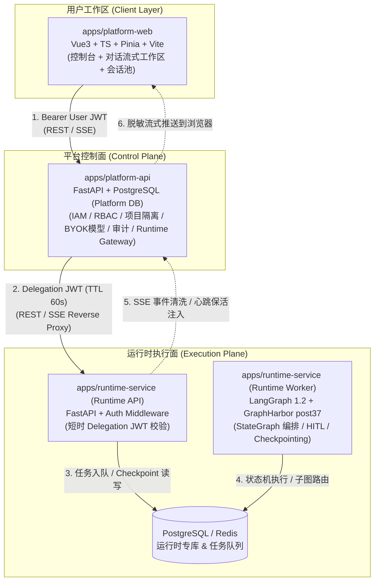
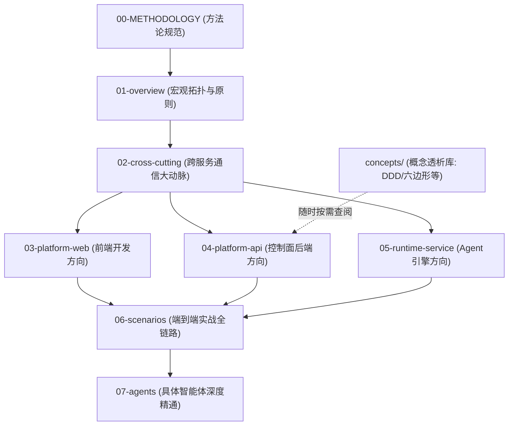

# 企业级 AI Agent 平台架构与源码深度解读

> **架构全景导航与深度学习指南**
> 本目录不是浮于表面的概览，而是面向二次开发、生产架构落地与深度源码学习的系统化技术全景。涵盖：**整体架构、跨服务通信协议、子系统设计、核心业务链路、典型智能体深度剖析与核心机制伪代码**。

---

## 零、 文档编写方法论与学习导读（必读）

为了防止文档沦为“大而化之的 PPT 概述”或“没有上下文的代码搬运工”，本项目制定了专门的**架构分析与源码解读方法论规范**：

📖 **详见规范**：[METHODOLOGY.md - 架构分析与源码解读方法论：工业级技术深潜文档编写指南](METHODOLOGY.md)

本目录所有文档均遵循 **“六维硬核标准”**：
1. **精确源码坐标映射**：具体到目录、文件、核心类和函数方法；
2. **真实数据结构与 Schema**：列出真实的 PostgreSQL 表结构、HTTP Headers 与 JSON 报文；
3. **函数级端到端调用时序**：从前端组件一路跟踪到模型/数据库执行点；
4. **高保真核心伪代码**：1:1 提炼真实生产代码中的核心算法与边界分支；
5. **真实故障防御与踩坑经验**：复盘项目中真实的容错设计（如 post37 路由修复、410 游标失效恢复、8MiB 截断）；
6. **知识串联模型（三承三启）**：开头必有概念速查与输入来源，结尾必有下游消费去向。

---

## 一、 系统架构三原则（核心认知）



1. **控制面与运行面物理隔离（Separation of Concerns）**：
   - `platform-api` 专注治理：租户、项目边界、BYOK（自带模型密钥）目录、RBAC 权限、审计与网关中继。绝不加载任何大模型 SDK 或运行 LangGraph 图节点。
   - `runtime-service` 专注执行：负责 LangGraph 图状态机、工具装配（Tools/MCP/Skills）、模型推理与人机协同审批（HITL）。绝不直接持有用户的长期登录凭证。
   - **双库独立**：平台业务库（Platform PostgreSQL）与运行时状态库（Runtime PostgreSQL + Redis）严格隔离，保证高并发执行不拖垮控制面。
2. **零信任短时委托鉴权（Delegation JWT Architecture）**：
   - 跨服务绝不透传用户原始 Token，而是由网关对权限和白名单校验后，动态签发 **60 秒超短 TTL 的 Delegation JWT**（携带严格的 `operation` 枚举、`context_hash`、`project_id` 与模型白名单）。
3. **流式管道状态机清洗与自愈（Streaming State Machine）**：
   - SSE 事件流在网关层经历 **8 MiB 单帧截断保护、敏感数据脱敏、`: heartbeat` 保活注入**；前端消费端具备 **`useSessionInterrupts` 审批状态机自愈** 与 **`410 cursor_expired` 断流降级恢复** 能力。

---

## 二、 严格编号的系统知识地图（全景索引）

所有文档已全面实施**层级两级数字编号**，严格按照知识依赖顺序排列：

```text
docs/architecture/
├── README.md                                # [当前导航] 架构全景大地图、学习指南与进度看板
├── METHODOLOGY.md                           # [编写规范] 架构分析与源码解读方法论
│
├── 01-overview/                             # 【第一层：宏观拓扑与技术全景】
│   ├── 01-system-topology.md                # 01-01 系统架构拓扑图与进程全景 (内嵌 Archify 交互大图)
│   ├── 02-tech-stack.md                     # 01-02 统一技术栈清单与深度选型考量
│   └── 03-design-principles.md              # 01-03 核心架构设计原则与权衡
│
├── 02-cross-cutting/                        # 【第二层：跨服务通信与协同对接】(重中之重)
│   ├── 01-communication-matrix.md           # 02-01 服务间通信全景矩阵 (4条干线对照)
│   ├── 02-delegation-auth.md                # 02-02 委托鉴权机制与短时令牌 (23项操作白名单/高保真伪代码)
│   ├── 03-sse-streaming-pipeline.md         # 02-03 SSE 流式推送全链路与自愈机制 (8MiB截断/心跳注入/410自愈)
│   ├── 04-trace-and-observability.md        # 02-04 全链路追踪与可观测性体系 (Trace ID/Langfuse/审计)
│   └── 05-data-isolation.md                 # 02-05 存储架构与数据隔离模型 (双库物理边界与红线)
│
├── 03-platform-web/                         # 【第三层：前端平台宿主架构 (Vue 3)】
│   ├── 01-architecture.md                   # 03-01 前端分层与工程骨架 (Modules/Stores/Composables)
│   ├── 02-chat-session-engine.md            # 03-02 对话会话池与多 Tab 保活状态机
│   └── 03-component-design.md               # 03-03 控制台规范与动态 Artifacts 渲染
│
├── 04-platform-api/                         # 【第四层：平台控制面与网关架构 (FastAPI)】
│   ├── 01-architecture.md                   # 04-01 后端分层架构与领域划分
│   ├── 02-runtime-gateway.md                # 04-02 网关反向代理与协议转换细节 (normalize_protocol)
│   ├── 03-iam-and-governance.md             # 04-03 IAM 权限、租户隔离与 BYOK 模型治理
│   └── 04-catalog-management.md             # 04-04 智能体资产目录生命周期管理
│
├── 05-runtime-service/                      # 【第五层：Agent 运行时执行引擎 (LangGraph)】
│   ├── 01-architecture.md                   # 05-01 运行时 API 与 Worker 双进程架构
│   ├── 02-langgraph-execution.md            # 05-02 LangGraph 图执行与 checkpoint_ns 路由
│   ├── 03-hitl-and-interrupts.md            # 05-03 人机协同中断与审批恢复机制
│   └── 04-tools-and-skills.md               # 05-04 MCP 协议适配与 Skills 动态挂载
│
├── 06-scenarios/                            # 【第六层：端到端经典全链路时序】
│   ├── 01-agent-chat-flow.md                # 06-01 普通流式对话端到端全链路 (Web→API→Runtime→Web)
│   ├── 02-hitl-approval-flow.md             # 06-02 工具调用触发审批与恢复全链路
│   └── 03-subagent-dispatch.md              # 06-03 主智能体派发子智能体与历史回放
│
└── 07-agents/                               # 【第七层：具体智能体深度剖析与伪代码】
    ├── 01-dearflow-agent/                   # 07-01 核心旗舰智能体：DearFlow Agent 专属专题目录
    │   ├── README.md                        # 专题导读与架构总览
    │   ├── 01-architecture-and-modes.md     # 07-01-01 总控编排与四档执行模式 (Pregel拓扑/10+中间件/算力预算)
    │   ├── 02-memory-engine.md              # 07-01-02 三层记忆闭环系统 (Profile/Session/Working注入与语义检索)
    │   ├── 03-tools-ecosystem.md            # 07-01-03 38类工具装配矩阵 (检索/ArXiv/GitHub/部署/多模态/图表)
    │   ├── 04-workspace-sandbox.md          # 07-01-04 工作空间沙箱与资产管线 (DearWorkspaceBackend/PTY/防逃逸)
    │   ├── 05-skills-runtime.md             # 07-01-05 技能治理与动态热加载 (20+内置技能/ZIP乐观锁/快照隔离)
    │   └── 06-high-fidelity-implementation.md # 07-01-06 端到端高保真实现伪代码 (单文件级全景装配闭环)
    └── 02-showcase-demo-agent.md            # 07-02 演示智能体：Showcase Agent 最小骨架
│
└── concepts/                                # 【概念透析库：扫清架构理解的门槛障碍】
    └── 01-mvc-ddd-hexagonal.md              # 01 从 MVC 到 DDD 与六边形架构深度透析
```

---

## 三、 分批推进计划与进度看板

| 阶段 | 重点领域 | 包含文档/产出物 | 状态 |
|---|---|---|---|
| **Phase 0** | **架构总纲与方法论规范** | `docs/architecture/README.md`<br>`docs/architecture/METHODOLOGY.md` | ✅ Done |
| **Phase 1** | **宏观全景与跨服务通信大动脉** | `01-overview/`（3篇全量内嵌交互大图）<br>`02-cross-cutting/`（5篇六维深度重构） | ✅ Done |
| **Phase 2** | **三大核心子服务深度剖析** | `03-platform-web/`（3篇完成 ✅ Done）<br>`04-platform-api/`（4篇完成 ✅ Done）<br>`05-runtime-service/`（4篇完成 ✅ Done） | ✅ Done |
| **Phase 3** | **端到端业务场景时序** | `06-scenarios/`（3篇完成 ✅ Done） | ✅ Done |
| **Phase 4** | **具体 Agent 深度剖析与伪代码** | `07-agents/01-dearflow-agent/`（专题 7 篇 ✅ Done）<br>`07-agents/02-showcase-demo-agent.md`（完成 ✅ Done） | ✅ Done |
| **Concepts**| **核心门槛概念透析专篇库** | `concepts/01-mvc-ddd-hexagonal.md` | ✅ Done |

---

## 四、 快速阅读推荐路径与依赖树

每个角色对知识的需求层次不同，推荐按照如下**前后依赖链条**推进阅读：



- **新同学第一步**：先看 [01-overview/01-system-topology.md](01-overview/01-system-topology.md) 在内嵌大图中看懂系统全景。
- **遇到不熟的架构黑话**：如 MVC vs DDD、六边形架构等，先看正文的 `<details>` 30秒折叠拐杖，或者直接阅读 [concepts/01-mvc-ddd-hexagonal.md](concepts/01-mvc-ddd-hexagonal.md)。
- **联调与接口二开**：必读 [02-cross-cutting/02-delegation-auth.md](02-cross-cutting/02-delegation-auth.md) 与 [02-cross-cutting/03-sse-streaming-pipeline.md](02-cross-cutting/03-sse-streaming-pipeline.md)。
- **开发新智能体 / 接入新工具**：必读 `05-runtime-service/` 与 `07-agents/01-dearflow-agent.md`。
