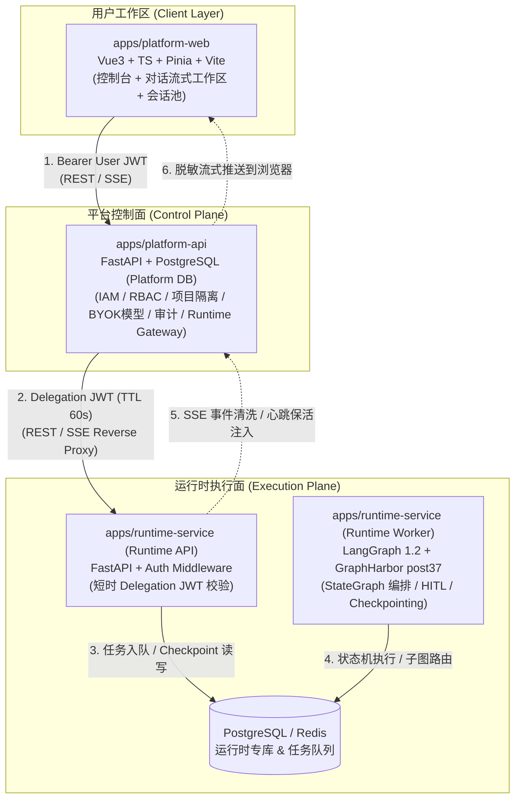
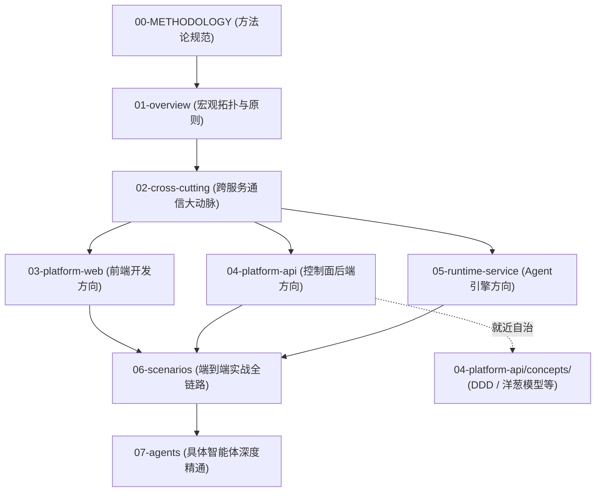

# 企业级 AI Agent 平台架构与源码深度解读

> **架构全景导航与深度学习指南**
> 本目录不是浮于表面的概览，而是面向二次开发、生产架构落地与深度源码学习的系统化技术全景。涵盖：**整体架构、跨服务通信协议、子系统设计、核心业务链路、典型智能体深度剖析与核心机制伪代码**。

---

## 零、 文档编写方法论与学习导读（必读）

为了防止文档沦为“大而化之的 PPT 概述”或“没有上下文的代码搬运工”，本项目制定了专门的**架构分析与源码解读方法论规范**：

📖 **详见规范**：[METHODOLOGY.md - 架构分析与源码解读方法论：工业级技术深潜文档编写指南](METHODOLOGY.md)

本目录所有文档均遵循 **“六维硬核标准”**：
1. **精确源码坐标映射**：具体到目录、文件、核心类和函数方法；
2. **真实数据结构与 Schema**：列出真实的 PostgreSQL 表结构、HTTP Headers 与 JSON 报文；
3. **函数级端到端调用时序**：从前端组件一路跟踪到模型/数据库执行点；
4. **高保真核心伪代码**：1:1 提炼真实生产代码中的核心算法与边界分支；
5. **真实故障防御与踩坑经验**：复盘项目中真实的容错设计（如 post37 路由修复、410 游标失效恢复、8MiB 截断）；
6. **知识串联模型（三承三启）**：开头必有概念速查与输入来源，结尾必有下游消费去向。

---

## 一、 系统架构三原则（核心认知）



1. **控制面与运行面物理隔离（Separation of Concerns）**：
   - `platform-api` 专注治理：租户、项目边界、BYOK（自带模型密钥）目录、RBAC 权限、审计与网关中继。绝不加载任何大模型 SDK 或运行 LangGraph 图节点。
   - `runtime-service` 专注执行：负责 LangGraph 图状态机、工具装配（Tools/MCP/Skills）、模型推理与人机协同审批（HITL）。绝不直接持有用户的长期登录凭证。
   - **双库独立**：平台业务库（Platform PostgreSQL）与运行时状态库（Runtime PostgreSQL + Redis）严格隔离，保证高并发执行不拖垮控制面。
2. **零信任短时委托鉴权（Delegation JWT Architecture）**：
   - 跨服务绝不透传用户原始 Token，而是由网关对权限和白名单校验后，动态签发 **60 秒超短 TTL 的 Delegation JWT**（携带严格的 `operation` 枚举、`context_hash`、`project_id` 与模型白名单）。
3. **流式管道状态机清洗与自愈（Streaming State Machine）**：
   - SSE 事件流在网关层经历 **8 MiB 单帧截断保护、敏感数据脱敏、`: heartbeat` 保活注入**；前端消费端具备 **`useSessionInterrupts` 审批状态机自愈** 与 **`410 cursor_expired` 断流降级恢复** 能力。

---

## 二、 严格编号的系统知识地图（全景索引）

所有文档已全面实施**层级两级数字编号**，严格按照知识依赖顺序排列：

```text
docs/architecture/
├── README.md                                # [当前导航] 架构全景大地图、学习指南与进度看板
├── METHODOLOGY.md                           # [编写规范] 架构分析与源码解读方法论
│
├── 01-overview/                             # 【第一层：宏观拓扑与技术全景】
│   ├── 01-system-topology.md                # 01-01 系统架构拓扑图与进程全景 (内嵌 Archify 交互大图)
│   ├── 02-tech-stack.md                     # 01-02 统一技术栈清单与深度选型考量
│   └── 03-design-principles.md              # 01-03 核心架构设计原则与权衡
│
├── 02-cross-cutting/                        # 【第二层：跨服务通信与协同对接】(重中之重)
│   ├── 01-communication-matrix.md           # 02-01 服务间通信全景矩阵 (4条干线对照)
│   ├── 02-delegation-auth.md                # 02-02 委托鉴权机制与短时令牌 (23项操作白名单/高保真伪代码)
│   ├── 03-sse-streaming-pipeline.md         # 02-03 SSE 流式推送全链路与自愈机制 (8MiB截断/心跳注入/410自愈)
│   ├── 04-trace-and-observability.md        # 02-04 全链路追踪与可观测性体系 (Trace ID/Langfuse/审计)
│   └── 05-data-isolation.md                 # 02-05 存储架构与数据隔离模型 (双库物理边界与红线)
│
├── 03-platform-web/                         # 【第三层：前端平台宿主架构 (Vue 3)】
│   ├── 01-architecture.md                   # 03-01 前端分层与工程骨架 (Modules/Stores/Composables)
│   ├── 02-chat-session-engine.md            # 03-02 对话会话池与多 Tab 保活状态机
│   └── 03-component-design.md               # 03-03 控制台规范与动态 Artifacts 渲染
│
├── 04-platform-api/                         # 【第四层：平台控制面与网关架构 (FastAPI)】
│   ├── 01-architecture.md                   # 04-01 后端分层架构与领域划分
│   ├── 02-runtime-gateway.md                # 04-02 网关反向代理与协议转换细节 (normalize_protocol)
│   ├── 03-iam-and-governance.md             # 04-03 IAM 权限、租户隔离与 BYOK 模型治理
│   ├── 04-catalog-management.md             # 04-04 智能体资产目录生命周期管理
│   └── concepts/                            # 【控制面概念透析专篇库 (就近自治)】
│       ├── 01-mvc-ddd-hexagonal.md          # 01 从 MVC 到 DDD 与六边形架构深度透析
│       ├── 02-onion-middleware-model.md     # 02 深入理解中间件洋葱圈模型 (穿透/短路/防泄漏)
│       ├── 03-chestertons-fence-in-software-defense.md # 03 切斯特顿栅栏在软件架构防御中的深度透析
│       ├── 04-control-vs-execution-plane-permissions.md # 04 控制面与执行面权限解耦与透传报文深度透析
│       ├── 05-iam-and-rbac-architecture.md # 05 IAM 身份认证、双层 RBAC 与多租户安全治理
│       ├── 06-dual-layer-rbac-deep-dive.md # 06 双层 RBAC 权限引擎设计与端到端实战推演
│       └── 07-opaque-token-and-credential-governance.md # 07 大模型凭据零信任治理与不透明临时引用票据
│
├── 05-runtime-service/                      # 【第五层：Agent 运行时执行引擎 (LangGraph)】
│   ├── 01-architecture.md                   # 05-01 运行时 API 与 Worker 双进程架构
│   ├── 02-langgraph-execution.md            # 05-02 LangGraph 图执行与 checkpoint_ns 路由
│   ├── 03-hitl-and-interrupts.md            # 05-03 人机协同中断与审批恢复机制
│   ├── 04-tools-and-skills.md               # 05-04 MCP 协议适配与 Skills 动态挂载
│   └── concepts/                            # 【运行时概念透析专篇库 (就近自治)】
│       ├── 01-runtime-autonomy-and-decoupled-testing.md # 01 执行层微服务自治与无依赖测试架构
│       ├── 02-runtime-execution-and-developer-experience-critique.md # 02 运行时执行边界与架构批判式审视
│       ├── 03-dual-process-runtime-deep-dive.md # 03 运行时双进程架构与运行模型深度透析
│       ├── 04-langgraph-ecosystem-thin-wrapper-and-agent-development-guide.md # 04 LangGraph 生态扫盲与 Agent 开发 SOP
│       ├── 05-message-inbox-advisory-lock-and-reconciliation-deep-dive.md # 05 MessageInbox 咨询锁与消息对账全链路
│       ├── 06-request-authentication-and-runtime-resolution-pipeline.md # 06 请求验签与配置净化全链路透析
│       ├── 07-runtime-core-module-anatomy-and-code-responsibilities.md # 07 Runtime 核心内核源码与职责透析
│       ├── 08-database-architecture-dual-chains-and-application-schema.md # 08 数据库双轨制架构与应用表全景透析
│       ├── 09-workspace-sandbox-pty-and-asset-pipeline.md # 09 运行时操作系统级沙箱、PTY终端与资产管线透析
│       ├── 10-runtime-webapp-api-server-and-inbox-pipeline.md # 10 运行时 Web 控制面、消息收件箱与对账引擎透析
│       ├── 11-upstream-langgraph-monkey-patches-and-hitl-bug-anatomy.md # 11 LangGraph 官方源码级猴子补丁与人机中断避坑
│       └── 12-runtime-observability-langfuse-and-otel-pipeline.md # 12 运行时可观测性架构与 Langfuse/OTel 追踪管线
│
├── 06-scenarios/                            # 【第六层：端到端经典全链路时序】
│   ├── 01-agent-chat-flow.md                # 06-01 普通流式对话端到端全链路 (Web→API→Runtime→Web)
│   ├── 02-hitl-approval-flow.md             # 06-02 工具调用触发审批与恢复全链路
│   └── 03-subagent-dispatch.md              # 06-03 主智能体派发子智能体与历史回放
│
└── 07-agents/                               # 【第七层：具体智能体深度剖析与伪代码】
    ├── 01-dearflow-agent/                   # 07-01 核心旗舰智能体：DearFlow Agent 专属专题目录
    │   ├── README.md                        # 专题导读与架构总览
    │   ├── 01-architecture-and-modes.md     # 07-01-01 总控编排与四档执行模式 (Pregel拓扑/10+中间件/算力预算)
    │   ├── 02-memory-engine.md              # 07-01-02 三层记忆闭环系统 (Profile/Session/Working注入与语义检索)
    │   ├── 03-tools-ecosystem.md            # 07-01-03 38类工具装配矩阵 (检索/ArXiv/GitHub/部署/多模态/图表)
    │   ├── 04-workspace-sandbox.md          # 07-01-04 工作空间沙箱与资产管线 (DearWorkspaceBackend/PTY/防逃逸)
    │   ├── 05-skills-runtime.md             # 07-01-05 技能治理与动态热加载 (20+内置技能/ZIP乐观锁/快照隔离)
    │   ├── 06-high-fidelity-implementation.md # 07-01-06 端到端高保真实现伪代码 (单文件级全景装配闭环)
    │   └── 07-real-world-lifecycle-case-study.md # 07-01-07 真实案例端到端全链路实录 (从用户一句话到沙箱结果落盘)
    └── 02-showcase-demo-agent.md            # 07-02 演示智能体：Showcase Agent 最小骨架
```

---

## 三、 分批推进计划与进度看板

| 阶段 | 重点领域 | 包含文档/产出物 | 状态 |
|---|---|---|---|
| **Phase 0** | **架构总纲与方法论规范** | `docs/architecture/README.md`<br>`docs/architecture/METHODOLOGY.md` | ✅ Done |
| **Phase 1** | **宏观全景与跨服务通信大动脉** | `01-overview/`（3篇全量内嵌交互大图）<br>`02-cross-cutting/`（5篇六维深度重构） | ✅ Done |
| **Phase 2** | **三大核心子服务深度剖析** | `03-platform-web/`（3篇完成 ✅ Done）<br>`04-platform-api/`（4篇完成 ✅ Done）<br>`05-runtime-service/`（4篇完成 ✅ Done） | ✅ Done |
| **Phase 3** | **端到端业务场景时序** | `06-scenarios/`（3篇完成 ✅ Done） | ✅ Done |
| **Phase 4** | **具体 Agent 深度剖析与伪代码** | `07-agents/01-dearflow-agent/`（专题 8 篇含真实案例全链路实录 ✅ Done）<br>`07-agents/02-showcase-demo-agent.md`（完成 ✅ Done） | ✅ Done |
| **Concepts**| **子系统专属概念透析专篇库（就近自治）** | `04-platform-api/concepts/01-mvc-ddd-hexagonal.md`<br>`04-platform-api/concepts/02-onion-middleware-model.md`<br>`04-platform-api/concepts/03-chestertons-fence-in-software-defense.md`<br>`04-platform-api/concepts/04-control-vs-execution-plane-permissions.md`<br>`04-platform-api/concepts/05-iam-and-rbac-architecture.md`<br>`04-platform-api/concepts/06-dual-layer-rbac-deep-dive.md`<br>`04-platform-api/concepts/07-opaque-token-and-credential-governance.md`<br>`05-runtime-service/concepts/01-runtime-autonomy-and-decoupled-testing.md`<br>`05-runtime-service/concepts/02-runtime-execution-and-developer-experience-critique.md`<br>`05-runtime-service/concepts/03-dual-process-runtime-deep-dive.md`<br>`05-runtime-service/concepts/04-langgraph-ecosystem-thin-wrapper-and-agent-development-guide.md`<br>`05-runtime-service/concepts/05-message-inbox-advisory-lock-and-reconciliation-deep-dive.md`<br>`05-runtime-service/concepts/06-request-authentication-and-runtime-resolution-pipeline.md`<br>`05-runtime-service/concepts/07-runtime-core-module-anatomy-and-code-responsibilities.md`<br>`05-runtime-service/concepts/08-database-architecture-dual-chains-and-application-schema.md`<br>`05-runtime-service/concepts/09-workspace-sandbox-pty-and-asset-pipeline.md`<br>`05-runtime-service/concepts/10-runtime-webapp-api-server-and-inbox-pipeline.md`<br>`05-runtime-service/concepts/11-upstream-langgraph-monkey-patches-and-hitl-bug-anatomy.md`<br>`05-runtime-service/concepts/12-runtime-observability-langfuse-and-otel-pipeline.md` | ✅ Done |

---

### 全平台概念透析总字典 (Concept Glossary Index)

为避免概念库散落后难以通览，平台在全局总导航中统一维护**就近自治概念专篇汇总表**：

| 所属子系统 / 领域 | 专篇文件与直达链接 | 核心解决的门槛认知与生产痛点 |
|---|---|---|
| **04-platform-api** | [01-从 MVC 到 DDD 与六边形架构](04-platform-api/concepts/01-mvc-ddd-hexagonal.md) | 扫除后端分层盲区：为什么不用平铺 MVC？代码怎么按领域拆解？端口与适配器怎么防腐？ |
| **04-platform-api** | [02-深入理解中间件洋葱圈模型](04-platform-api/concepts/02-onion-middleware-model.md) | 彻底解密 `call_next` 与 ASGI 执行链条：穿脱防护服模型、指标打点、短路守卫与 `ContextVar` 防串号。 |
| **04-platform-api** | [03-切斯特顿栅栏在软件架构防御中的深度透析](04-platform-api/concepts/03-chestertons-fence-in-software-defense.md) | 树立防御性重构意识：为什么 `tool_overrides` 只能是 `False`？为什么不能为了“灵活性”随意拆除安全栅栏？ |
| **04-platform-api** | [04-控制面与执行面权限解耦与透传报文深度透析](04-platform-api/concepts/04-control-vs-execution-plane-permissions.md) | 彻底理清微服务职责边界：权限管理到底归谁管（PDP vs PEP）？前端透传字段全景透视，跨服务防漂仪四重锁。 |
| **04-platform-api** | [05-IAM 身份认证、双层 RBAC 与多租户安全治理](04-platform-api/concepts/05-iam-and-rbac-architecture.md) | 扫清企业级权限盲区：AAA 保安三部曲、为什么不能用单布尔值 is_admin、双层 RBAC 绝缘、BYOK 密文治理与工具封禁。 |
| **04-platform-api** | [06-双层 RBAC 权限引擎设计与实战推演](04-platform-api/concepts/06-dual-layer-rbac-deep-dive.md) | 深度拆解 RBAC 架构：32 项细粒度原子权限码、IamPolicyEngine 集合交集秒级裁决、超管接管机制与车企实战全景推演。 |
| **04-platform-api** | [07-大模型凭据零信任治理与不透明临时引用票据](04-platform-api/concepts/07-opaque-token-and-credential-governance.md) | 深度解密凭据防泄露铁壁：为什么不能裸传 API Key 或静态 ID？HMAC 短命票据置换、四重兑换门禁与用完即焚机制。 |
| **05-runtime-service** | [01-执行层微服务自治与无依赖测试架构](05-runtime-service/concepts/01-runtime-autonomy-and-decoupled-testing.md) | 破除分布式单体反模式：为什么底层单测不需要启动 Platform-API？FakeChatModel 依赖注入、本地对称密钥自签发与三层解耦测试架构。 |
| **05-runtime-service** | [02-运行时执行边界、DearFlowAgent 实战与架构合理性批判式审视](05-runtime-service/concepts/02-runtime-execution-and-developer-experience-critique.md) | 直面灵魂拷问：DearFlowAgent 如何在底层独立发起与执行？Runtime 处不处理业务逻辑？新开发者体验深度批判与架构演进破局。 |
| **05-runtime-service** | [03-运行时双进程架构与运行模型深度透析](05-runtime-service/concepts/03-dual-process-runtime-deep-dive.md) | 扫除进程模型认知迷雾：五金店前台收银与车间师傅生动类比，API Server 与 Worker 物理切分，本地 `local-stack.sh` 原生进程与生产 Docker 容器的 1:1 对称映射与实操抓包。 |
| **05-runtime-service** | [04-LangGraph 生态扫盲、薄封装哲学与 Agent 开发 SOP](05-runtime-service/concepts/04-langgraph-ecosystem-thin-wrapper-and-agent-development-guide.md) | 扫除生态门槛与开发迷茫：LangGraph 生态三大件极简扫盲，坚守“薄封装”杜绝过度设计，在本项目从零开发一个标准化 Agent 的 6 步保姆级 SOP 与 0.1 秒脱机单测实操。 |
| **05-runtime-service** | [05-MessageInbox 数据库咨询锁与消息对账全链路深度透析](05-runtime-service/concepts/05-message-inbox-advisory-lock-and-reconciliation-deep-dive.md) | 扫除高并发追加消息盲区：传菜窗木板模型，为什么 PostgreSQL 咨询锁完爆行锁，租约自愈机制，全链路 4 大阶段时序与 Checkpoint 确定性对账闭环。 |
| **05-runtime-service** | [06-请求验签与配置净化全链路深度透析](05-runtime-service/concepts/06-request-authentication-and-runtime-resolution-pipeline.md) | 扫除入港认证与配置消杀盲区：机场海关边检大厅模型，`auth/platform.py` 验签与防跨线程越权守卫，`runtime/` 拦截 18 类高危字段、工具黑名单物理求差与模型凭据用完即焚拉取。 |
| **05-runtime-service** | [07-Runtime 核心内核模块源码全景剖析与职责透析](05-runtime-service/concepts/07-runtime-core-module-anatomy-and-code-responsibilities.md) | 扫除内核模块认知盲区：不可变契约总纲（`contracts.py`）、安全脱敏异常（`errors.py`）、消杀总车间（`resolver.py`）、用完即焚模型工厂（`modeling.py`）、审批中断策略（`access_policy.py`）与沙箱多租户锁死（`resource_bindings.py`）。 |
| **05-runtime-service** | [08-Runtime 数据库双轨制架构与应用表全景透析](05-runtime-service/concepts/08-database-architecture-dual-chains-and-application-schema.md) | 扫除数据库认知盲区：为什么 `db/` 几乎没代码？双轨制存储（引擎链 vs 应用链），官方 `checkpoints` 表黑盒托管与 `0001_application.py` 四大业务表（inbox/memory/skills/tasks）无 ORM 原生 SQL 设计哲学。 |
| **05-runtime-service** | [09-工作区沙箱、PTY终端与资产管线深度透析](05-runtime-service/concepts/09-workspace-sandbox-pty-and-asset-pipeline.md) | 扫除沙箱与资产管线认知盲区：智能体操作系统级运行环境，`scoped.py` 单向哈希物理隔离，`execution.py` 断网无特权 Docker 沙箱，`terminal.py` 环形缓冲 PTY 终端，`archives.py` 防解压炸弹，`html_preview.py` 注入最严 CSP 消杀与 `artifact_refs.py` 原子硬链接不可变发布。 |
| **05-runtime-service** | [10-运行时Web控制面与消息对账引擎深度透析](05-runtime-service/concepts/10-runtime-webapp-api-server-and-inbox-pipeline.md) | 扫除控制面与消息追加盲区：`webapp.py` 组合根与 Lifespan 看门狗，`terminals.shutdown` 强杀终端僵尸容器，8 大业务子路由汇聚，`MessageInbox` 咨询锁原子落库与终态自愈对账。 |
| **05-runtime-service** | [11-LangGraph官方源码级猴子补丁与人机中断避坑深度透析](05-runtime-service/concepts/11-upstream-langgraph-monkey-patches-and-hitl-bug-anatomy.md) | 扫除底座补丁认知盲区：`patches.py` 方法级替换（Method Swizzling），消灭流式输出把人机审批误判为报错的假报警，修补 `ToolNode` 异步冒泡吞没缺陷，上游最新 main 分支实测证据与切斯特顿栅栏对比。 |
| **05-runtime-service** | [12-运行时可观测性架构与Langfuse/OTel追踪管线深度透析](05-runtime-service/concepts/12-runtime-observability-langfuse-and-otel-pipeline.md) | 扫除可观测性反噬业务盲区：`_FailSoftCallback` 软着陆动态代理吞噬 APM 异常，零信任元数据消杀与敏感密钥粉碎，本地轻量 `_RuntimeDiagnosticsCallback` 离线 0.05 秒自测断言与 5 秒优雅排空防死锁。 |

---

## 四、 快速阅读推荐路径与依赖树

每个角色对知识的需求层次不同，推荐按照如下**前后依赖链条**推进阅读：



- **新同学第一步**：先看 [01-overview/01-system-topology.md](01-overview/01-system-topology.md) 在内嵌大图中看懂系统全景。
- **遇到不熟的架构黑话**：如 MVC vs DDD、六边形架构、中间件洋葱圈等，先看正文的 `<details>` 30秒折叠拐杖，或者直接阅读对应模块目录下的专属概念专篇（如 [04-platform-api/concepts/01-mvc-ddd-hexagonal.md](04-platform-api/concepts/01-mvc-ddd-hexagonal.md) 与 [04-platform-api/concepts/02-onion-middleware-model.md](04-platform-api/concepts/02-onion-middleware-model.md)）。
- **联调与接口二开**：必读 [02-cross-cutting/02-delegation-auth.md](02-cross-cutting/02-delegation-auth.md) 与 [02-cross-cutting/03-sse-streaming-pipeline.md](02-cross-cutting/03-sse-streaming-pipeline.md)。
- **开发新智能体 / 接入新工具**：必读 `05-runtime-service/` 与 `07-agents/01-dearflow-agent/README.md`。
