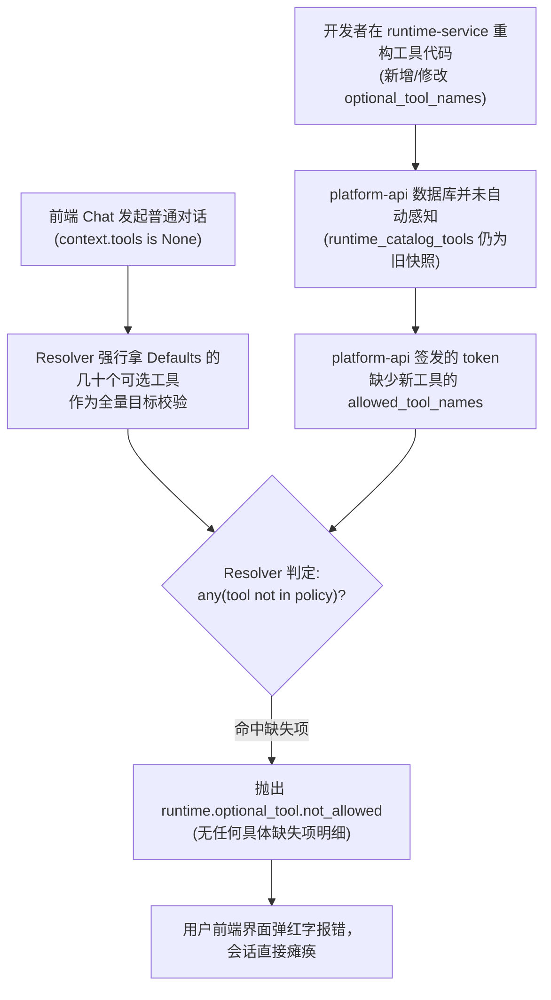

# 故障复盘与方案探讨：Runtime 可选工具校验失败 (runtime.optional_tool.not_allowed)

- **文档状态**：待团队评审与方案选型 (Draft for Team Review)
- **创建时间**：2026-09-20
- **涉及组件**：
  - `apps/runtime-service` (`runtime/resolver.py`, `services/dearflow_agent/agent.py`, `capabilities.py`)
  - `apps/platform-api` (`modules/runtime_policies/`, `modules/runtime_catalog/`, `modules/runtime_gateway/`)
  - `apps/platform-web` (`modules/chat/`, `modules/runtime/`)
  - `scripts/local-stack.sh`

---

## 1. 现象描述 (Symptoms)

在 `platform-web` 的 Chat 界面中发起常规对话（与 `dearflow_agent` 或其他全功能 Agent 交互）时，界面偶发或频繁弹出红字报错：

```text
执行出错: runtime.optional_tool.not_allowed
```

- **业务影响**：对话完全被阻断，用户输入无法流式返回，当前会话处于卡死或错误中断态；
- **历史复发性**：该问题在早期的 `showcase_demo` 多能力智能体联调中曾暴露过（见历史记录 `docs/projects/20260908-showcase-demo/FIXES_SUMMARY.md`），在本次 `dearflow_agent` 技能治理改造后再次爆发。

---

## 2. 现场排查与证据链 (Forensics & Evidence)

### 2.1 运行时日志抓包
在日志文件 `/var/folders/.../aitestlab-local-stack/logs/runtime-worker.log` 的第 946 行抓到真实异常堆栈：

```text
[error] run execution failed: graph_id="dearflow_agent", run_id="f8af3ccf-f4b3-4121-b5d8-8461f2ddab53"
Traceback (most recent call last):
  File "langgraph_runtime_pg/production_worker.py", line 504, in execute
    async with self.registry.open(graph_id, config) as graph:
  File "runtime_service/services/dearflow_agent/agent.py", line 145, in get_agent
    resolved = resolve_runtime_config(
        principal=facts.principal,
        context=context,
        policy=facts.policy,
        defaults=defaults,
        tool_permissions=permissions,
    )
  File "runtime_service/runtime/resolver.py", line 350, in resolve_runtime_config
    raise _fail("runtime.optional_tool.not_allowed", "optional_tool_names")
runtime_service.runtime.errors.RuntimeResolutionError: runtime.optional_tool.not_allowed
```

### 2.2 抛出点代码定位
在 `apps/runtime-service/src/runtime_service/runtime/resolver.py` 的第 349-350 行：

```python
required = defaults.required_tool_names
optional_source = context.tools if context.tools is not None else defaults.optional_tool_names
optional = _names(optional_source, "optional_tool_names", "runtime.optional_tool.not_declared")

if any(name not in policy.allowed_tool_names for name in optional):
    raise _fail("runtime.optional_tool.not_allowed", "optional_tool_names")
```

### 2.3 数据库与代码的集合差集比对
通过脚本直接比对 **Runtime Agent 默认声明的可选工具集** 与 **Platform SQLite 数据库中已登记的工具集**：

```python
# dearflow_agent 的 _DEFAULTS.optional_tool_names 声明的工具:
all_dearflow_tools = {
    ...59个工具...
    'upload_skill', 'update_skill', 'set_skill_enabled', 'delete_skill', 'import_skill', ...
}

# 数据库 runtime_catalog_tools 表中 sync_status='ready' 的工具:
catalog_tools = {
    ...55个工具...
    'create_skill_candidate', 'evaluate_skill_candidate', 'publish_skill', 'revoke_skill', ...
}
```

**差集分析结果**：
1. **Agent 声明了但数据库缺失的工具**：
   `['delete_skill', 'set_skill_enabled', 'update_skill', 'upload_skill']`
2. **数据库存在但 Agent 已废弃的工具**：
   `['create_skill_candidate', 'evaluate_skill_candidate', 'publish_skill', 'revoke_skill']`

---

## 3. 根因分析 (Root Causes)

这个 Bug 并非某一行简单的代码拼写错误，而是由**系统架构中的“双重真源、被动同步、全量校验、无信息报错”四联环**共同诱发的结构性脆弱点：



### 3.1 跨服务工具元数据“双重真源与被动同步”
- **工具实现真源**在 `runtime-service`（代码里定义每个工具及其权限映射）；
- **授权与策略真源**在 `platform-api`（数据库 `runtime_catalog_tools` 表与 `project_tool_policies`）；
- 两者之间的同步依赖 `POST /api/runtime/tools/refresh` 这个 HTTP 被动接口；
- 系统中**没有任何自动化自愈机制**（没有启动同步、没有调度同步、`local-stack.sh` 启动时也不跑同步）。前端该接口仅挂在控制面的一个深层按钮上。一旦代码变更而未手动点击刷新，数据库立即滞后。

### 3.2 缺省状态下的“全量严格校验”策略
- 当普通用户在 Chat 聊天时，前端并没有传 `context.tools`（`context.tools is None`），用户只是在说话，并未指名道姓要使用特定的专业工具；
- 但 `resolver.py` 的处理是：只要 `context.tools is None`，就强行取 `defaults.optional_tool_names`（全量数十个可选工具）作为本次请求的集合；
- 只要其中任何一个次要或非核心的可选工具未在 policy 允许列表中，Resolver 就会立刻一票否决整个请求，导致**基础对话因为某个无关可选工具的未同步而彻底崩盘**。

### 3.3 反人类的“哑巴报错”设计（极端缺乏可观测性）
- 抛出 `runtime.optional_tool.not_allowed` 时，代码中**完全没有输出到底是哪个（或哪几个）工具不被允许**；
- 无论是返回给前端的错误码，还是服务端的 log，都只有一句冰冷的 `not_allowed`，导致排查成本极高，开发者无法在第一时间获知是哪个工具漏了。

---

## 4. 当前应急恢复状态 (Current Status)

老王已通过调用平台管理员接口触发了一次完整的 Catalog 刷新：
- **执行操作**：`POST /api/runtime/tools/refresh`
- **同步结果**：`{ ok: True, count: 59, last_synced_at: "2026-09-19T16:06:10.071609Z" }`
- **数据库验证**：`delete_skill`, `set_skill_enabled`, `update_skill`, `upload_skill` 已全量入库，差集清零。
- **服务状态**：目前 `http://localhost:3000` 前端 Chat 已经可以正常进行对话，不会再弹此报错。

---

## 5. 候选长效优化方案（供团队讨论与选型）

针对上述四层问题，梳理出以下三种维度的方案，可以组合实施：

### 方案 A：可观测性与启动自愈（极低成本，立竿见影，强烈推荐先行落地）

#### 措施 A1：Resolver 报错精准化（把具体的未授权工具打印出来）
- **修改位置**：`apps/runtime-service/src/runtime_service/runtime/resolver.py`
- **具体做法**：
  ```python
  disallowed = sorted(set(optional) - set(policy.allowed_tool_names))
  if disallowed:
      raise _fail(
          "runtime.optional_tool.not_allowed",
          "optional_tool_names",
          f"optional tools {disallowed} are not allowed by policy (allowed: {len(policy.allowed_tool_names)})",
      )
  ```
- **价值**：一旦报错，日志和响应中直接标明是哪个工具冲突（例如 `['upload_skill']`），1 秒破案，不再猜谜。

#### 措施 A2：本地启动脚本（`local-stack.sh`）增加生命周期自愈同步
- **修改位置**：`scripts/local-stack.sh`
- **具体做法**：在 `local-stack.sh start` 的所有进程健康检查通过之后，自动执行一次轻量内部同步（调用刷新 graph 和 tools catalog），确保护航开发环境启动即为最新状态。
- **价值**：彻底消除本地拉起代码后忘记点刷新的低级事故。

---

### 方案 B：平台端生命周期自愈（系统健壮性提升）

#### 措施 B1：Platform API Lifespan 或后台自愈对齐
- **修改位置**：`apps/platform-api/src/platform_api/bootstrap/lifespan.py`
- **具体做法**：
  - 在 Platform API 启动且检测到 `langgraph_upstream_url` 健康时，在后台异步执行一次 `refresh_tools` 和 `refresh_graphs`；
  - 或者当 Gateway 在构建 Policy 发现 `runtime_catalog_tools` 为空时，触发按需自愈同步。
- **优点**：即使不通过 `local-stack.sh` 启动（例如 Docker 或单独拉起），平台也能自愈更新。

---

### 方案 C：架构层语义纠偏（可选工具弹性降级，深水区讨论）

#### 背景与冲突点：
在知识库 `docs/knowledge/14-runtime-contracts-and-resolution-design.md` 中，原架构师曾写道：
> *“这里没有把无权限 Optional Tool 静默裁剪掉。静默裁剪会造成‘模型以为能力存在’和‘实际能力不存在’的隐性分叉，也会让调用方误以为策略生效。拒绝请求更容易观测、重试和审计。”*

#### 方案 C 的反思与重新设计：
必须区分两种完全不同的上下文语义：
1. **调用方显式传了 `context.tools = ['tool_a', 'tool_b']`**：
   调用方明确要求注入这些工具。此时如果 Policy 不允许，**拒绝请求（raise error）完全合理**；
2. **调用方未传 `context.tools`（`context.tools is None`）**：
   调用方是普通的聊天客户端（如 Web UI），它根本不知道 Agent 内部装配了哪些高级工具。此时 AgentDefaults 声明的是“Agent **能**支持的所有可选工具”。
   - 如果此时 Policy 允许的工具集是子集，合理的行为应当是将可用工具做**交集降级**（Intersection）：
     `effective_optional = set(defaults.optional_tool_names) & set(policy.allowed_tool_names)`
   - 这样即使管理员禁用了某个高危工具、或者某个小工具未就绪，Agent 依然可以凭借核心能力为用户提供基础会话，而不是让用户连一句问候都发不出去。

#### 方案 C 的权衡 (Trade-offs)：
| 维度 | 保持当前现状（严格全量否决） | 方案 C（缺省时交集降级） |
|---|---|---|
| **会话可用性** | 极脆。任何一个次要工具不同步，全站聊天挂死 | 极高。非核心工具缺失不影响主流程 |
| **策略显式性** | 极强。任何配置遗漏立刻暴露 | 需在运行日志或返回 metadata 中标明降级项 |
| **符合直觉** | 违背“可选(optional)”字面语义 | 完全契约化，符合可选降级直觉 |

---

## 6. 建议团队讨论的决策点 (Decision Points for Team)

1. **短期止血项**：是否一致同意立即合入 **方案 A1（精准报错差集）** 与 **方案 A2（local-stack 启动同步）**？（改动量 < 20行，纯收益，零破坏性）
2. **长期架构项**：对于 **方案 C（缺省时对 Optional Tools 采用交集降级还是继续全量阻断）**，产品与架构团队是否愿意采纳？还是坚持严格拒绝但强化同步？
