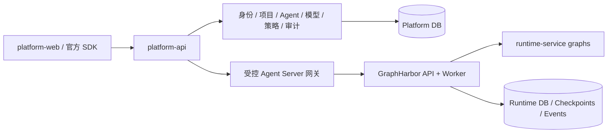

# Platform API：控制面边界与代码简化重构

- **启动日期：** 2026-09-10。
- **目标：** 面向 apps/runtime-service 重建简约平台层，提供治理与受控网关，遵循官方 Agent Server 协议并可独立部署。
- **负责人：** @lijiaxin
- **级别：** 治理改动，包含跨服务契约、业务退役与全新数据库设计。
- **状态：** 进行中（partial）。知识库/测试用例退役、新 src 包与远端目录/schema 后端已实现；GraphHarbor 0.13.0.post24 已发布，Runtime 已更新并通过本地核心测试。真实 PostgreSQL/Redis 只完成隔离联调切片；单表 Agent、新数据库、网关、完整事务治理与 Operations 全面退役尚未完成。先验证本地链路，整体开发完成后再验收容器方案。
- **评审记录：** 2026-09-10，用户同意此前方案，并明确允许重新设计全部代码结构、表结构和数据库；无需兼容旧逻辑或迁移旧数据，知识库与测试用例业务删除，未来有需求再加入。本记录覆盖前版文档的旧业务保留与渐进迁移约束。
- **GraphHarbor 边界：** 只实现 LangGraph Server 通用能力及其公开接口；完整等价性专项后置，不作为本轮平台重构的扩大范围。
- **前置顺序：** 本工程验收后，再恢复 [Showcase Demo](../20260908-showcase-demo/README.md) 的平台联调及前端验收。该 Demo 已完成的 runtime-service 验收保持有效。

## 阅读顺序

1. [01 现状审查与退役清单](01-current-state-and-retirement.md)：已证实的问题、可删除内容、保留范围和测试基线。
2. [02 运行网关与授权契约](02-runtime-gateway.md)：Run 创建、幂等、审批、事件流和治理记录的边界。
3. [03 Agent、目录与模型配置](03-agent-catalog.md)：去除宿主路径、上游 Assistant 写入和重复配置源。
4. [04 服务结构、新数据库与验收](04-service-structure-and-migration.md)：目录范式、新表职责、删除范围、初始化与交付步骤。

采用多专题模板：网关、目录、服务基础设施可以分别实施和验收，各篇自带任务与验证，不再维护重复的全局 plan/tasks/verification。

## 目标架构

Platform 拥有业务授权与审计；GraphHarbor 拥有 Thread/Run/Interrupt/Checkpoint 的执行事实；Runtime 拥有 Agent、工具和模型构造。平台采用 FastAPI 常规用例与数据库代码，无需为了“符合 LangGraph 范式”在控制面引入图编排。

## 已确认决策

| 议题 | 决策 | 影响 |
| --- | --- | --- |
| 重构方式 | 在 apps/platform-api 内重建模块化单体；代码和表结构按新职责设计 | 单一正式实现，无旧路由别名、旧表双写或兼容包 |
| 业务范围 | 保留身份、IAM、项目、用户、服务账号、公告、Agent、模型、策略、审计和系统设置 | 删除知识库、测试用例及其平台接入，未来按真实需求重新加入 |
| Run 数据 | 新建最小请求幂等/授权记录；执行状态、interrupt 和恢复由 Agent Server 持有 | 不承接旧 runtime_runs、旧审批或历史 Operation 数据 |
| Operations | 删除平台通用任务框架、Worker、队列和 artifacts | 目录读取/刷新走有限超时 HTTP；GraphHarbor 执行 Worker 不受影响 |
| 新消息并发 | 首期显式 reject，交给 Agent Server 原子裁决 | open-swe 的 interrupt 是产品选择；enqueue/interrupt 按实际需求另行验收 |
| Agent 对象 | 产品配置使用 Agent；稳定执行键 agent_key = graph_id | SDK 的 assistant_id 字段不改名；平台 UUID 可保留为管理记录 ID |
| 部署与数据 | 单 upstream 使用稳定逻辑标识，建立全新数据库与初始化基线 | 不做 URL 历史映射、旧数据回填或旧版本 schema 兼容 |

“测试用例”指 testcase 产品业务，不是新平台的自动化测试。鉴权、幂等、隔离、真实执行和部署验收仍必须完成。具体新表字段和上游协议随对应实现冻结，不能把允许重建设计等同于已完成实现。

## 现有规划的关系

- 11/13 号 Runtime 目录设计中的“职责边界、组合根、按需建文件、平台不理解 Python 路径”继续采用。
- `apps/runtime-service/docs/knowledge/platform-runtime-integration/` 中已确认的 Agent 命名、模型七字段、短期模型引用和 SDK 网关原则继续采用；旧设计与当前实现冲突时，见 01 的逐项证据，不能用历史“已完成”替代本次验收。
- [20260909 dispatch 工程](../20260909-platform-dispatch-layer/README.md) 暂缓单独实施，统一入口职责纳入 02；当前已有 `launch_runtime_run()`，不新增重复的 `core/dispatch.py`。
- 本工程没有否定 Showcase 后端成果；它修复后续平台联调需要依赖的控制面。

## 本轮验证与限制

2026-09-10 已开始实施：删除知识库/测试用例平台业务与前端接入，移除专属任务、权限、配置及依赖；新提交拒绝未注册任务。正式实现已迁入可安装 src/platform_api 包，启动资源清理、wheel 隔离安装和独立镜像烟测通过。实际实施验证见 04；以下为重构前审查基线。

- 审查对象：平台仓库 `75e5f42` 加当时工作区；platform-api 开始审查时已有 6 个改动文件。后续实施保留这些改动，并随正式包迁移更新必要导入。
- 现有 unittest：167 项，163 通过、1 失败、3 跳过，耗时 255.210 秒。失败原因见 01。
- 隔离行为探针：重复提交、上游拒绝后的占位、模型引用脱敏、历史 Thread 绕过 Agent 存在性检查均复现。它们证明本地应用逻辑，不是生产漏洞利用或完整 HTTP 链路验收。
- PostgreSQL 空库初始化及并发、真实跨服务、独立部署和浏览器回归均留待实现阶段。
- 源码审查覆盖所有模块的文件/导入关系，深入检查网关、目录、授权、Operations 和共享基础设施；其他业务按代表调用链检查，不宣称逐行安全审计完成。
