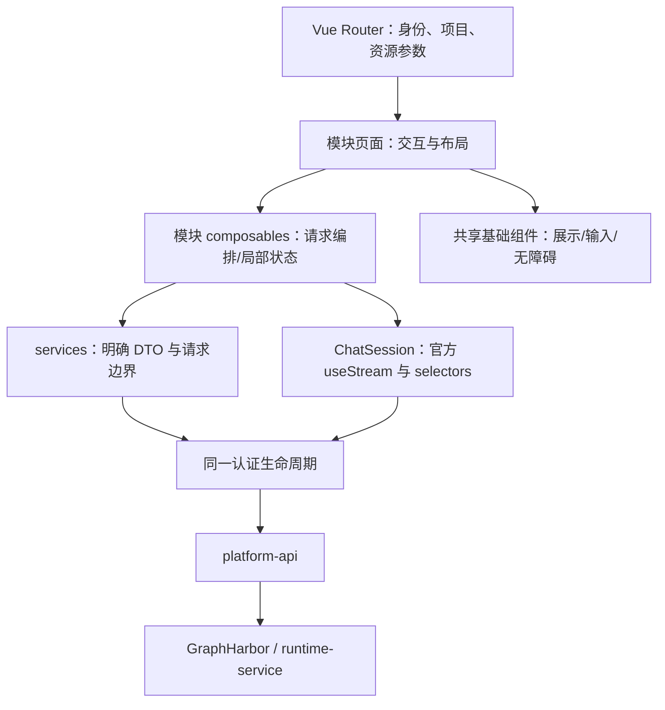

# 02 目标架构、信息架构与 UI

## 目标

保留有效工程基础，重建清楚的职责边界。用户进入平台能够直接选项目、选 Agent、发起任务、观察工作和完成审批；管理功能可找到，但不挤占 Chat。

2026-09-11 更新：视觉与 Agent 单入口以 [08](08-visual-and-agent-alignment.md) 为准；继续使用本专题的会话逻辑边界。

## 方案设计

### 1. 架构与依赖方向



- 路由不载入业务数据全集，只完成身份/项目访问门禁与参数解析。
- 页面不直接拼 URL、调用 fetch/axios；service 不读 Vue Router/Pinia，不偷偷取可变全局 projectId。
- Chat SDK 是第三方流状态所有者，不包装成自研引擎；业务层只补平台动作、契约和展示。
- 组件无业务请求；不创建一个拥有所有页面开关的“万能页面/万能表单/万能 Agent 框架”。
- 沿用现有 `modules/services/components` 目录骨架，避免为形式做全仓库搬家；重写真正有问题的模块。

### 2. 目标文件布局

以下为目标路径，标记“新增”的文件尚不存在；仅在有实际调用点时创建。

```text
apps/platform-web/src/
├── router/                     # routes、guards；导航权限从 route meta 派生
├── layouts/WorkspaceLayout.vue # 平台壳、单一项目入口
├── stores/                     # auth、workspace、theme 等跨页状态
├── components/
│   ├── base/                   # Button/Input/Dialog/Drawer/Icon
│   ├── layout/                 # 侧栏、上下文条、页面标题
│   └── platform/               # Table/Pagination/Empty/Error/Markdown
├── services/
│   ├── http/                   # REST 认证、错误、明确的重试策略
│   ├── auth/                   # token/session/permissions
│   ├── langgraph/              # SDK 工厂与项目固定的 fetch
│   ├── agents/                 # 新增；Agent 查询/配置、types，替代 assistants
│   ├── runtime/                # Model/Graph/Tool DTO，保留真实契约
│   ├── threads/                # 列表、详情、history；统一 gateway 读请求
│   └── ...                     # 项目、用户、审计等现有模块
└── modules/
    ├── agents/                 # 新增；自动 Agent 列表、详情/配置表单
    ├── chat/
    │   ├── pages/ChatPage.vue   # 路由与目标解析
    │   ├── components/ChatSession.vue  # 新增；SDK 生命周期所有者
    │   ├── components/ChatWorkspace.vue # 新增；布局组合
    │   ├── components/Transcript.vue   # 新增；Turn/RenderItem 展示
    │   ├── components/ApprovalPanel.vue # 新增；按 ID 审批
    │   ├── components/SubagentCard.vue  # 新增；作用域 selectors
    │   ├── components/InspectorPanel.vue # 新增；唯一右侧面板
    │   ├── composables/useChatSession.ts # 新增；动作协调与 SDK 引用
    │   ├── composables/useThreadList.ts  # 新增；分页元数据，无消息副本
    │   ├── transcript.ts       # 新增；SDK 数据→RenderItem 的纯投影
    │   ├── approvals.ts        # 新增；决策校验和请求生成
    │   └── run-actions.ts      # 新增；用户动作、幂等快照与结果核实
    └── ...                     # 其余有效业务按现有模块落地
```

`types/management.ts` 按实际迁移域拆到对应 service 的 `types.ts`；不建立另一份全量全局 DTO。跨域共享的 ID/错误类型才放共享位置。服务端 JSON 与 UI ViewModel 分开，业务代码不得用 `as ManagementX` 掩盖字段不匹配。

### 3. 状态所有权

| 状态 | 唯一所有者 | 生命周期/规则 |
| --- | --- | --- |
| 用户、平台角色、token 更新 | auth store + auth service | 单次 hydrate、并发 refresh 合并；退出后清理身份关联缓存 |
| 当前 projectId/access | workspace store | projectId 变更立即清空旧授权，加载中禁止动作；迟到请求按 epoch 丢弃 |
| 当前 threadId、所选 Agent | URL | 刷新可恢复；不再从 query、旧偏好、线程列表三处互相猜目标 |
| 当前线程 messages/tools/interrupts/lifecycle | 官方 SDK | 页面不复制成 Pinia run store，不累计 rawChunks 重建整个历史 |
| Thread 列表/目录数据 | 对应模块 composable | key 至少含身份会话、projectId、筛选/分页；按动作失效，不按 token 更新重拉 |
| 历史 checkpoint | History 视图 | 打开时分页加载；标记只读；不覆盖 live transcript |
| 本次提交 key、冻结 payload、网络未知结果 | run-actions | 客户端动作状态，不是服务端执行状态镜像；详见 04 |
| 草稿、选中文件、折叠、滚动 | Chat 局部状态 | key 含用户/project/thread；审批决策不持久化自动恢复，不跨账号留草稿 |
| 主题、语言 | 原有 store | 保留现有有效能力，新增文案统一走 i18n，首期以中文验收 |

不引入 Vue Query 作为本轮前置。现有规模用明确的加载 composable + AbortController/请求序号即可；后续真的需要跨页缓存时再论证，不能同时维护两份请求缓存。

### 4. 路由与导航提案

继续使用 `/workspace` 平台入口。项目域资源采用显式 projectId，避免复制链接时默默借用另一项目的本地偏好。

| 用户能力 | 目标路由 | 现状→目标 |
| --- | --- | --- |
| 入口/总览 | `/workspace/overview` | 简化为真实项目/Agent/最近会话入口；不堆不存在的 Worker/队列状态 |
| 项目管理、详情、成员 | `/workspace/projects`、`/workspace/projects/:projectId`、`.../members` | 保留生命周期和成员授权；详情进入前加载对应 access |
| Agent 列表、详情 | `/workspace/projects/:projectId/agents`、`.../agents/:agentId` | 已授权 Graph 自动对齐，移除手工新建/删除入口，保留配置编辑 |
| 新对话/会话详情 | `/workspace/projects/:projectId/chat`、`.../chat/:threadId` | 新对话用 `?agentId=` 选择；已有 Thread 以服务器 metadata.graph_id 为执行依据 |
| 模型、Graphs/Tools、策略 | `/workspace/projects/:projectId/models`、`.../graphs` | 保留后台管理，Tools/策略作为页内 tab/抽屉，不为每个 API 建菜单 |
| 用户、公告、审计、平台治理 | 现有有效路由 | 统一权限和布局；ControlPlane 做入口/摘要，PlatformConfig 做配置，SystemGovernance 做探测，避免三页重复卡片 |
| 我/安全/服务账号 | 现有有效路由 | 保留密码/资料、平台角色与项目 grant/key 独立语义 |
| resources/ui-assets、固定 sql-agent | 无 | 从正式导航和构建删除 |
| threads | 合入 Chat 的会话列表与检查面板 | 保留查找、分页、删除、运行历史能力；不再单独维护另一套聊天详情 |

导航分“工作区”“项目管理”“平台管理”；仅渲染用户可访问项。路由 meta 描述作用域、入口标签和所需权限，菜单消费同一份定义。权限码仍使用后端实际的 `project.assistant.*`，不要因产品改名擅改协议。

深链接带 projectId 时，先验证用户对该项目的 access，再显示资源；不存在/无权限显示可返回的页面，不自动跳到别人的最近会话。无任何项目和项目列表加载失败是两种不同状态。

### 5. Chat UI 结构

```text
┌平台导航┬项目 / 当前 Agent / 会话标题           运行状态 · 更多┐
│        ├会话列表────────┬对话主区───────────┬检查面板(按需)┤
│        │新对话、分页    │用户需求           │任务 / 文件   │
│        │最近/待处理    │Agent 工作过程     │变更 / 产物   │
│        │会话摘要       │  工具行/子任务卡  │运行与历史    │
│        │               │最终答复           │              │
│        │               │待审批卡/错误反馈  │              │
│        │               │输入区 + 模型入口 │              │
└────────┴───────────────┴───────────────────┴──────────────┘
```

- ≥1280px：会话列约 240px，对话 flex/最小约 480px，检查面板约 360px；面板关闭时主区自然扩展。
- 768–1279px：会话可折叠，检查面板采用单一侧抽屉，避免三列同时挤压。
- <768px：单列会话，导航/详情按需打开；输入区使用 `100dvh`/安全区，键盘弹起仍可发送和审批。
- 正常 Chat 顶部只显示项目、Agent 名称、可理解的运行状态；Thread/Run ID、原始 JSON、技术 metadata 放“运行详情”。删除说明实现细节的 source-note/架构口号。
- 工作过程按 Turn 折叠，错误和待审批始终可见；展开后保留完整文本、工具结果和时间顺序。最终答复独立突出。
- 仅一个 Inspector，替代 ContextDrawer/TasksFiles/Artifact 多面板重叠；选中项随 thread/project 切换清空。
- 运行中输入可编辑；[07 队列](07-message-queue-and-middleware.md) 上线后可发送补充消息，未提供能力时保留草稿/停止后发送。审批时普通发送禁用，草稿不丢。运行状态来源详见 04。
- 自动跟随仅当用户在底部。上滚阅读不抢焦点，显示“查看最新”；流式更新不重置折叠、选择和焦点。

### 6. UI 系统与控制面

用户已确认**保持当前前端风格，优先复用现有成熟组件，允许更简约大气**。保留浅/深主题、现有颜色与基础组件体系，主要减少重复卡片、嵌套边框和无意义装饰，调整间距及文字层级；不引入另一套 UI 框架或整体换肤。以 open-swe 的轻工具行、分组工作过程、按需详情为交互参考，不复制 Slack/Linear/GitHub 专属文案和装饰。危险/错误不能只靠颜色表达。

管理列表使用“标题/主动作→筛选→表格→分页”，统计仅在真实业务需要时出现。create/edit 复用域内表单，加载/空/无权限/失败/提交中分别表现；不写万能 JSON 编辑器代替真实产品表单。密码/API key 仅写入、关闭表单清理，不在历史或 Toast 中回显。

键盘可以完成导航、发送、工具展开、审批、对话框关闭；Enter 发送需排除 IME composition，Shift+Enter 换行；审批不能因全局 Enter 快捷键误提交。Modal/Drawer 正确管理焦点、Esc、焦点返回，图片有替代文本，流输出不逐 token 播报给屏幕阅读器。

## 任务拆分

- [x] U1：调整 `src/router/routes.ts`、`guards.ts`、`AppSidebar.vue`，形成项目域路由和单份导航权限定义。
- [x] U2：修改 `src/stores/workspace.ts`、auth hydrate，补请求隔离与退出清理。
- [x] U3：以 `ChatPage.vue` / `ChatSession.vue` 重建工作区布局、唯一详情抽屉和响应式输入/审批布局；移除旧多层壳。
- [x] U4：Agent 域表单、目录/治理保留页面已迁移并统一权限/四态；只抽取重复两次以上的 UI。
- [x] U5：已更新三份前端活标准与 README，移除旧运行目标、resources 语义及退役能力。

## 验证要求与记录

- [x] 项目 A→B 快速切换并延迟返回 A 请求，UI/access/cache 不被覆盖；退出再换用户无旧数据。
- [x] 链接直开、刷新、浏览器前进后退、无项目、无权限、404 均有明确行为。
- [x] 每个路由记录对应读写能力的权限；平台超级管理员不是隐式项目成员。
- [x] 1440×900、1024×768、390×844 的浅/深模式截图和键盘走查；检查面板不遮挡审批和发送。
- [x] 管理页全部具备 loading/empty/error/forbidden，失败不会呈现为空目录。

2026-09-10 规划阶段记录（非当前状态）：完成静态架构和页面标准核对；未制作新 UI、未运行新页面浏览器验证。

## 状态

项目路由/导航、请求隔离、新 Chat 布局及管理页面实现已完成；全站浏览器验收证据见 implementation/11-closeout.md。

## 2026-09-11 任务对账

本次按当前代码及 [01 实现记录](implementation/01-contracts-and-session-foundation.md)、[09 消息验收](implementation/09-message-delivery-completion.md)、[10 发布验证](implementation/10-graphharbor-post27-release.md) 更新。任务勾选表示该任务范围已完成；下方/上方独立验收清单未勾项仍未完整验证，不能据此宣布整个阶段通过。本次仅核对文档与代码，未重跑业务测试。

## 2026-09-11 路由与权限最终对账

实施负责人：本轮 Codex；需求/边界评审：用户（已批准）。以下入口均保留，导航和路由权限共用 routes.ts / useNavigation.ts。平台管理员不绕过项目成员授权。

| 路由（省略 /workspace） | 读取/进入 | 写入/动作 |
| --- | --- | --- |
| overview、projects | 已登录；API 返回可见项目 | 新建项目需 platform.project.create |
| projects/new | platform.project.create | 同权限 |
| projects/:projectId | platform.project.read 或 project.member.read；核实 route project | 按项目生命周期/成员动作权限 |
| projects/:projectId/members | project.member.read | project.member.write |
| projects/:projectId/agents、agents/:agentId | project.assistant.read | project.assistant.write |
| projects/:projectId/models、graphs | project.runtime.read | 平台目录治理和项目 runtime-policy 写入分别鉴权 |
| projects/:projectId/chat/:threadId? | project.runtime.read + Thread 项目归属 | project.runtime.write；消费/恢复复核当前授权 |
| users、users/:userId | platform.user.read | 用户详情按各项治理权限 |
| users/new | platform.user.create | 同权限 |
| control-plane、platform-config、system-governance | platform.config.read | 各探测/配置动作按对应权限 |
| announcements | platform.announcement.write 或 project.announcement.write | 与实际公告 scope 一致 |
| audit | platform.audit.read 或 project.audit.read | 只读 |
| service-accounts | platform.service_account.read | 平台账号/token 与项目 grant 分别判断 |
| me、security | 当前登录身份 | 只修改当前身份资料/密码 |
| access-unavailable、未知路由 | 明确拒绝/404 页面 | 无写动作 |

16 个保留管理路由已在 1440/390 真实 API 上遍历，通过入口/h1/无溢出/无 5xx/无退役请求断言；新增、详情、Chat 的业务动作用独立套件验证。加载失败与空列表分别呈现，通用 DataTable 不再把 error 显示为暂无数据。
