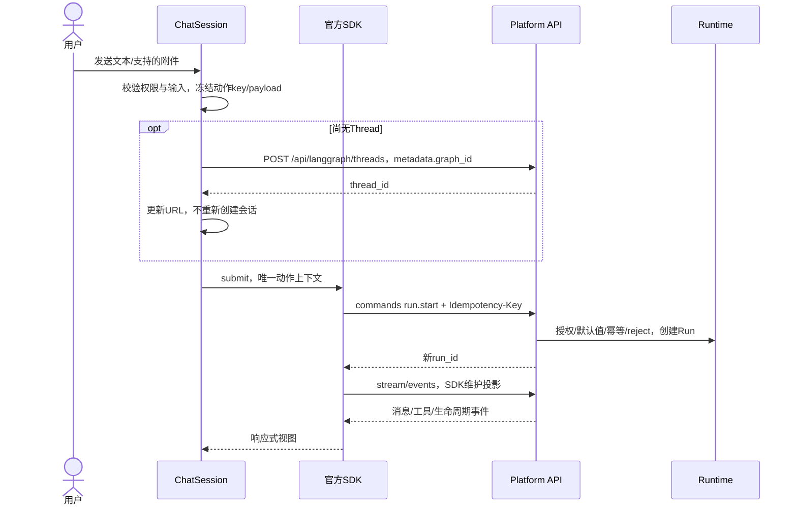

# 04 Chat 会话与交互

## 目标

让发送、刷新、断线、取消和审批都具有清楚的一致语义。借鉴 open-swe 的单一 stream provider、乐观反馈、工作与答复分离，但以本平台真实运行和授权契约为准。

## 方案设计

### 1. 会话边界

`ChatPage` 解析 `{projectId, agentId?, threadId?}`，完成授权/目标读取后挂载 `ChatSession`。Session 固定身份、projectId 和 graphId，持有唯一 `useStream`。其子组件可通过官方 `provideStream/useStreamContext` 或明确 props 使用同一个 handle，不各自创建 controller。

同项目同图切换 Thread 使用 SDK 公开响应式 threadId/hydration 能力，等待旧订阅解绑；跨项目/图/身份则销毁旧 Session 并建立新的。所有异步回调检查捕获的 `{sessionEpoch, projectId, threadId}`，不能只比较 threadId。销毁仅断开，不取消服务端任务。

Thread 列表只持有摘要，不存一份 transcript。History 面板单独读取 checkpoints，仅在用户查看历史时显示；SDK 的当前消息不和历史按 ID 手工拼接。

### 2. 展示状态，不复制执行状态机

以下是按钮和文案的**派生 UI 状态**，不能持久化为另一份运行事实：

| 界面状态 | 依据 | 输入/发送 | 可用操作 |
| --- | --- | --- | --- |
| 加载会话 | SDK hydration / 目标权限未完成 | 输入可保留，发送禁用 | 返回、明确重试读取 |
| 可发送 | 无待审批/活跃 Run/结果未知动作 | 可输入/发送 | 配置本次参数 |
| 提交中 | 新动作未拿到服务端 ACK | 可编辑下一条草稿，发送禁用 | 等待，失败后核实 |
| 运行中 | SDK lifecycle + 必要的 Run 核实 | 可输入；07 能力上线后可发送补充，否则保留草稿 | 停止、查看工具/子任务、支持时补充信息 |
| 待审批 | 当前 state/SDK pending interrupts | 普通发送禁用，草稿保留 | 逐 action approve/reject/edit |
| 停止请求中 | cancel 发出但终态未确认 | 发送禁用 | 查看状态，超时后重查 |
| 连接异常/结果未知 | transport 断线或提交结果不确定 | 保留草稿，发送禁用 | 恢复连接、核实原动作 |
| 已失败/已取消/已完成 | Run 状态与当前 state 核实 | 无阻断项时可发送 | 查看原因、新动作 |

`isLoading=false` 只说明本地 SDK 当前不在流式工作，不能单独证明服务端无活跃 Run。待审批优先于普通 busy 文案；恢复后新 Run ID 替代“当前 Run 指针”，父 Run 留在历史，旧 Run 终态不能结束新 Run。

### 3. 新对话和发送



1. 输入边界校验空内容、附件类型/大小、数值范围和权限；生成 client message ID。
2. 提交瞬间给予“发送中”反馈，优先复用 SDK optimistic projection；不在另一个数组重复添加永久用户消息。
3. 首次发送才创建 Thread，携 graph_id metadata。拿到 ID 后绑定原 Session 和 URL，不能因 URL 更新而再次创建或重复发送。
4. create Thread 失败时保留草稿。若创建成功但 Run 失败，保留该 Thread 以便重试，不每次新建空 Thread。
5. 发送成功的用户消息由 SDK/服务端 ID 对账；明确失败保留可重试反馈/草稿，不能伪装成服务端已确认。
6. ACK 与 Run 完成分离；`submit()` 的 Promise 可能到终态才 resolve，不能用它定义“消息刚被接受”的时刻。

运行中补充的完整设计见 [07](07-message-queue-and-middleware.md)：普通 HTTP 入队、根 Agent 下一模型调用前注入，复用当前流订阅；没有该后端能力时保留草稿并提示“任务运行中，停止后可发送”。不自动 cancel，不把草稿变成 SDK 排队 Run，不把通用 409 理解为“现在应该新建 Run”。

07 启用后，queued 气泡属于投递回执；consumed 与 SDK 同 ID 消息对账后只显示一次。sending/queued/unknown/rejected/not_consumed 各自明确，失败恢复草稿不能覆盖用户正在编辑的下一条输入；详见 07 §6。

### 4. 动作级幂等与重试

`run-actions.ts` 为每次用户动作保留内存快照：

```text
action = {
  actionId, idempotencyKey, kind,
  sessionEpoch, projectId, threadId, graphId,
  frozenPayload, clientMessageId?, returnedRunId?,
  transportOutcome: submitting | acknowledged | unknown | rejected
}
```

不持久化完整 payload 到 localStorage，不建浏览器消息队列。以上只描述 HTTP 动作，不保存服务端 Run 的 running/completed 状态。

- 新发送、编辑重发、重新执行、独立审批和补充消息：新 key。相同文字点两次是两个动作；同一提交尚未确认时阻止双击，07 启用后已确认入队不阻止用户继续发送另一条补充。
- 同动作网络重试：原 key、原 payload、原参数和关联 Thread；用户更改模型或草稿不影响它。
- 普通读取和取消不继承上次创建的 key；认证重试保留本次请求头。所有 key 绑定 Session，不能污染别的线程。
- SDK 无 per-submit headers：实例 scoped fetch 仅在匹配的 POST commands 上绑定当前动作，第一次生成 wire body 时记录不可变命令（含整数 command.id）。重试复用这份请求，不重新调用 submit 生成不同的 message ID/command body。
- 若重试由标准 Runs service 执行，也使用同一快照；拿到 Run ID 后通过 SDK 公开 hydration/订阅机制恢复，不写 SDK 私有 store。
- 首期禁止对写请求启用无差别自动重试。401 的受控一次刷新、明确同动作重试和 SSE 重连是不同机制。

超时/断网先查已知 Run；无 Run ID 时读取 Thread 当前状态和 Runs。**不能仅凭最近 Run/相同文本认定属于本动作。** 仍无法确定时显示“提交结果待确认”，提供同 key 原请求重试；不按新 key 再执行。刷新页面后若内存动作丢失，只恢复服务端事实，不自动补发。

### 5. 刷新、断线、终态恢复

1. 深链接进入时校验项目 access，GET Thread 读取 graph_id；不先扫前 100 个 Thread 判断存在。
2. 官方 SDK hydrate 获取 state/pending interrupts；读 Run 信息用于核实当前执行，不把网络错误当无消息。
3. 活跃运行通过 SDK 正式重连/挂载机制续接；Protocol 使用自己的 since/event identity，标准 join stream 使用 last_event_id，两者不能混填。
4. 按服务端 event/message/tool ID 去重由 SDK 负责；UI key 至少带 namespace + message/tool ID，重复 token 不累加两次。
5. 重连期间，旧画面标记为“正在恢复”；拿到当前 state 后审批面板只呈现仍 pending 的 ID。不得自动批准。
6. 正常结束由 SDK lifecycle 驱动；丢 terminal/断线才启动一次有界核实。确认后更新列表摘要和权限相关数据，不每 250ms 拉取整套 history。
7. 超出核实期限进入明确连接异常/待确认状态，用户可重试读取；不存在无限 polling 或假 completed。

设计时预算：异常核实使用逐步退避，总时长上限 30 秒，离开 Session/页面隐藏时暂停或取消；恢复可见时先查状态。具体间隔在 G1 依据服务端事件行为固定，不以死循环持续查询。正常连接下不启用备用轮询。

### 6. 显式取消

- 点击停止时必须确定服务端 Run ID；尚未获 ID 则先核实提交，不调用“最新 Run”取消别人的任务。
- 使用显式 Run cancel / 已核实 SDK stop；取消成功 ACK 后仍显示“正在停止”，直到 Run 非活跃且 state/interrupts 已同步。
- cancel 出错不能只把 SDK isLoading 清成 false 就重新启用发送；超时保持未知并可重查。
- 切换 Thread、关闭检查面板、离开 Chat、退出浏览器均不是用户取消指令。
- 已终态的取消按实际返回处理；取消后保留已生成内容与真实错误，下一条是新的用户动作、新 key。

### 7. HITL：按 interrupt ID 的决策模型

```text
pending[interruptId] = { namespace, actionRequests, reviewConfigs, fingerprint }
draft[interruptId][actionIndex] = approve | reject(message) | edit(typedArgs)
resume = { [interruptId]: { decisions: orderedDecisions } }
```

- interrupt 的 ID 是跨刷新/排序主键；actionIndex 仅代表**该不可变审批中的顺序**。若该 ID 的动作指纹改变，草稿失效，要求重新确认。
- 从当前 state/SDK 的真实 pending 集合构建面板，不通过 next_node 名称硬编码 human_approval。
- 每个 action 依据 review_configs.allowed_decisions 显示允许选项；没有 edit 权限就不显示编辑。允许规则缺失/未知形状时 fail closed，保留安全的原始内容预览和“不支持此审批类型”说明。
- approve/reject/edit 都有明确动作按钮；不预勾批准、不默认 approveAll。批量提交前列出每个 interrupt/actions 的独立决策摘要。
- edit 保留原参数类型；对象/数组用受控 JSON 编辑并校验，布尔/数字不是字符串。只编辑允许的参数，默认不允许通过改工具名切换动作。
- 构造 edit 的 `edited_action:{name,args}`；reject 的 message 按后端 schema 验证。不能仅把 `{approved:true}` 或普通聊天文本发回 DeepAgents HITL。
- 多 interrupt 一次组装 ID→response 映射，经 respondAll 或标准 command.resume 提交；不循环顺序 respond 导致第一个恢复后其他 ID 过期。
- 提交前重新核实 pending 集合/授权：已经处理或权限变更则不发送。提交中的 UI 锁定对应决策，网络错误保留草稿但再次展示最新状态后才能重试。
- 审批请求不附带 input/config/context/metadata/update/goto；原模型/工具/参数由后端首次冻结值恢复。
- 成功恢复可能生成新 Run ID；保留父关联，新的子图 interrupt 继续展示。原卡标记为已提交并以服务端处理结果结案，不能因面板临时消失就判工作完成。

必须覆盖两个并行子智能体分别 approve/reject，打乱服务端数组顺序后仍对准正确文件；这是本期核心验收，不是后置队列能力。

### 8. 编辑、重发与历史

- “重试提交”：网络不确定，原动作原 key，不追加新用户气泡。
- “重新执行”：用户主动重跑，新的 Run/新 key；从明确 checkpoint 重跑，不修改旧历史。
- “编辑后重发”：以被编辑 human 消息的 parent checkpoint 为起点，保留原分支；不是原地改文本后继续旧上下文。
- “查看历史”：只读，明确显示所选 checkpoint；未确认 checkpoint 能力时不提供有歧义的发送按钮。

现有 SDK forkFrom 与平台 config 白名单有差异（03）。G1 先验证标准 Runs checkpoint 流程，G4 再实现消息动作/历史 UI。没有可验证的 parent checkpoint 时明确禁用该消息的编辑重发，不猜上一个数组位置。若真实后端缺口导致核心分支能力未交付，记录 partial/blocked，不把删除按钮当作完成。

## 任务拆分

- [x] I1：新增 `ChatSession.vue`、`useChatSession.ts`，固定项目作用域和 SDK 生命周期；拆除旧快照合并。
- [x] I2：新增 `run-actions.ts`，实现发送/ACK/冻结 key/未知结果核实，接入 Composer 草稿和反馈。
- [x] I3：在 `ChatPage.vue` 与 `services/threads/session.service.ts` 内实现目标 Thread 直读、分页、切换和销毁隔离（未额外拆 useThreadList）。
- [x] I4：`approvals.ts`/`ApprovalPanel.vue` 支持多 ID、typed edit、批量恢复、授权重验及并行逆序审批；真实验收通过。
- [x] I5：实现 cancel 确认、刷新/断线恢复和按需历史；只保留一种有界异常核实策略。
- [x] I6：通过 checkpoint 接入验证后实现编辑重发/重新执行；替换旧 `message-actions/branching` 的不兼容部分。

## 验证要求与记录

- [x] 发送双击、同文新动作、同 key 超时重试、同 key 改 body 409，均无重复副作用。
- [x] Thread 创建后 run.start 失败，重试不新建另一个 Thread。
- [x] 刷新时运行继续；断网恢复不自动发送、不取消、不批准。
- [x] cancel ACK 后 Run 仍活跃时发送禁用；确认停止后再次发送成功。
- [x] 同图不同 Thread、跨项目、退出登录、慢响应乱序不串消息/权限/草稿。
- [x] 多 interrupt、单 interrupt 多 actions、审批重排、edit 类型、过期 ID、403、重复提交均覆盖。
- [x] 新 Run 启动后迟到的父 Run completed 不会清掉新 Run。
- [x] 编辑后分支和原分支都能读到，分支请求没有禁用 configurable 字段。

2026-09-10 规划阶段记录（非当前状态）：完成现有调用链、SDK 方法与后端审批路径审查；新方案尚未实现和联调。

## 状态

会话实现已完成；发送失败恢复、离线刷新、取消后新动作、并行审批及历史分支均有本轮网络证据，见 11。

## 2026-09-11 任务对账

前次静态核对记录：当时按代码及 [01 实现记录](implementation/01-contracts-and-session-foundation.md)、[09 消息验收](implementation/09-message-delivery-completion.md)、[10 发布验证](implementation/10-graphharbor-post27-release.md) 更新。任务勾选表示该任务范围已完成；下方/上方独立验收清单未勾项仍未完整验证，不能据此宣布整个阶段通过。本次仅核对文档与代码，未重跑业务测试。

分支验收已加强为编辑入口全流程、当前分支只有编辑后消息、原分支仍可读。GraphHarbor post27 使用顶层 checkpoint_id，详见 03。
