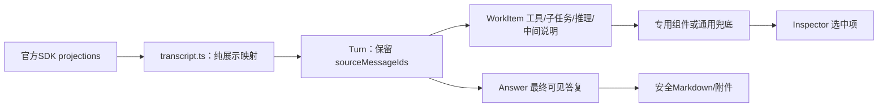

# 05 渲染能力矩阵与 open-swe 对照

## 目标

把参考文档的 13 项能力落成可执行前端设计，明确数据来源、组件、异常语义和验收。首期能展示真实 Agent 工作过程，不能把没有后端依据的文件、推理、终端或审批画成假功能。

## 方案设计

### 1. 参考阅读与采用边界

参考根目录为仓库旁的 `../research/open-swe`，以下路径相对该目录：

| 参考位置 | 实际借鉴 | 不照搬部分 |
| --- | --- | --- |
| `docs/frontend-rendering-matrix.md` | 13 项能力拆解、工作流与富内容关注点 | 极简 JSON chunk 解析、按 ns 长度猜子图、标签启发式不能直接作为生产实现 |
| `docs/ui-agent-interaction.md` | idle/running 的动作分离、平台代理、乐观反馈、恢复订阅 | 该项目独有 queueMessage/middleware/Store 入队不能视为本平台已提供；队列不等于 interrupt |
| `ui/src/features/agents/lib/AgentThreadStreamProvider.tsx` | 统一 controller、绝对代理 URL、稳定回调、完成后失效列表 | React provider 和全局 overrideFetch 不直接移植；平台需每项目/身份隔离 |
| `ui/src/features/agents/lib/provider/useSubmitAgentMessage.ts` | 提交动作集中、乐观失败回滚、区分 ACK 与 Run 完成 | queue 探测及“409=idle”只适用于它的业务接口；不复制 config.agent_model_id/effort |
| `ui/src/features/agents/lib/streamMessagesToUi.ts` | 从 SDK messages/toolCalls 形成稳定 UI 投影、工具关联 | 其合并文本等产品策略不能套用于所有平台 Agent，保留完整消息来源 |
| `ui/src/features/agents/components/messages/renderItems.ts` | buildRenderItems、splitWorkAndReply、attentionItems；工作与答复分区 | 本平台折叠也不能把错误/待审批藏掉；没有源码事实的最终回复标签不猜测 |
| `ui/src/features/agents/components/messages/timeline/WorkEntryRow.tsx` | 轻量工具行、展开查看详情、键盘与 aria-expanded | 不复制 React 组件或图标依赖体系 |
| `ui/src/features/agents/components/subagents/SubagentCard.tsx`、`SubagentActivity.tsx` | namespace 驱动作用域工具订阅，mount/unmount 管订阅 | 当前 SubagentActivity 仅显示最近工具及步骤数，**不是完整子智能体 token UI**；本项目要补 scoped messages |
| `ui/src/features/agents/components/AgentThreadView.tsx` | 明确 hydration 错态、工作区组合、stream 数据消费 | 不能把服务端 Thread 缓存当第二份实时消息源 |
| `ui/src/features/agents/components/WorkflowApprovalCard.tsx`、`PlanReview.tsx` | 审批在任务上下文中展示、明确操作出口 | 它们使用特定业务审批/计划接口，并有查询轮询；不是通用 DeepAgents 多 interrupt 合同，不能据此声称参考项目完全没有轮询 |
| `ui/src/features/agents/components/PlanArtifactFrame.tsx`、`InlinePlanArtifact.tsx` | 长产物从对话抽出、保留关联入口 | 不用 `<artifact>` 标签猜测协议，不从模型输出执行组件或任意 HTML |
| `ui/src/features/agents/components/DiffFilesView.tsx`、`TerminalPanel.tsx` | 文件/变更独立面板、终端生命周期概念 | 当前 TerminalPanel 使用 Ghostty 封装；文档里 xterm.js 只是建议；平台本期无 PTY 接口 |

参考文档把“多 Interrupt 并发”与“用户运行中追加消息”混在一起，本方案拆开：前者在已批准前端范围内，后者的后端队列与投递反馈详见新增 [07](07-message-queue-and-middleware.md)。第 5 节四个借鉴点的覆盖表也在 07；不能仅因渲染矩阵已设计就宣称队列已纳入原首期。SSE 是传输协议，不是 WebSocket；HTTP chunk 也不等于 SSE frame。

### 2. 13 项能力与交付边界

“首期”表示纳入本项目验收，不表示已经实现；“后置”明确列出缺少的后端前置。

| # | 能力 | 真实数据来源 | 首期交付 | 完整能力边界/验收 |
| --- | --- | --- | --- | --- |
| 1 | 工具调用可视化 | SDK toolCalls、ToolMessage 的 tool_call_id/output/status | 工具行、输入/结果展开、loading/error、未知工具兜底 | 同一次调用只出现一次；参数增量未完成时不把半段 JSON 当最终参数 |
| 2 | HITL approve/reject | 当前 pending interrupts、action_requests/review_configs | 审批卡、允许动作、提交状态、撤权处理 | 决策针对真实 ID；动作成功后服务端恢复，拒绝不执行副作用 |
| 3 | HITL edit | 原 action args + allowed_decisions | typed args 编辑、差异预览、校验、edited_action | 数字/布尔/对象类型不变；不能通过编辑注入身份或换任意工具 |
| 4 | 多 interrupt | SDK pending 集合/state；namespace + interrupt ID | 多卡、独立草稿、统一 ID 映射恢复 | 两子图分别 approve/reject，乱序仍准确；运行中追加消息另见 03 |
| 5 | 子智能体 + Todo | SDK subagents/subgraphs、task 调用、state.todos/write_todos | 子任务分组/层级、状态、Todo 进度 | 不按模型文本捏造任务完成；子任务失败不直接等于整个 Run 失败 |
| 6 | 子智能体 token | scoped `useMessages(stream,{namespace})` | 展开子任务可见其文本/工具/推理，主流不重复串入 | 至少两同名子任务并发、nested namespace、刷新/重连；源码已有单元 ns 流不等于浏览器验收 |
| 7 | Sandbox 文件 | 已公开 state.files 或 read/write/ls 结果、工具 artifact | “本次可见文件”与已有内容预览、来源标识 | 完整文件树/任意读取下载后置；Docker 宿主路径不暴露 |
| 8 | Skills 读取 | /skills/... 的工具读取结果与可见元数据 | 已读取技能入口、只读内容、来源路径 | 无公开目录时不列“所有已安装技能”；Skills 不能当权限 grant |
| 9 | 推理流式 | SDK 标准 contentBlocks 中**服务端实际公开**的 reasoning | 独立可折叠摘要/块，收到时增量更新 | 不推断隐藏推理，不靠正文 thinking 标签伪造；模型未提供则无推理区 |
| 10 | Markdown/富文本 | SDK 消息 string/contentBlocks、图片/文件块 | 全文本、代码块、列表/表格、图片、链接、复制 | 流中未闭合代码围栏不丢文；禁任意 HTML/脚本/不安全 URL |
| 11 | 代码变更 Diff | tool args 的 old/new 片段、已公开 patch/完整版本 | 拟修改片段与执行结果分开；有完整版本才显示完整 diff | 不拿局部 old_string/new_string 假装全文件；审批前不能标成已写入 |
| 12 | Artifacts | ToolMessage.artifact、公开输出/附件/真实 state UI 数据 | Transcript 引用 + 单一 Inspector 展示文档/代码/图片等白名单类型 | 不复活 Operations artifacts；缺原始文件不提供假下载 |
| 13 | 沙箱终端回显 | execute 工具结果及 exit_code，若有公开增量事件则显示增量 | 非交互命令输出、执行状态、截断提示 | 工具仅结束时返回就明确“执行结束后返回”；实时 PTY/WebSocket 后置 |

Showcase 支撑上述工具、审批、子智能体、Todo、Skills 与工作区演示，但 graph 是否部署由真实目录决定。默认 `langgraph.json` 不含 showcase_demo，演示验收要使用包含它的 `langgraph.demo.json`，详见 06。

### 3. 数据→视图的唯一链



最小展示模型由本项目自有，但不承担网络/Run 调度：

```text
Turn { key, sourceMessageIds, user?, workItems, answerItems }
RenderItem { key, kind, namespace, sourceMessageId?, toolCallId?, content, status? }
InspectorSelection { threadId, namespace, sourceId, kind }
```

- 先处理 SDK 标准消息对象与 contentBlocks，不先降成 legacy Message 后再丢失 getter/元数据。
- 把每个内容块保留在对应 source message 下。连续 Agent 消息可以归为一个 Turn，不能删除前面的正文；中间说明进入工作区，最后答复进入 answer 区，两者都可阅读/复制。
- `key` 来自稳定 source ID + namespace + block 的稳定序位；同名工具和相同内容不是同一消息。无来源 ID 的 fallback 只在一次规范化时生成，不能每次 computed 使用当前时间。
- ToolMessage 按 tool_call_id 与工具调用匹配；未匹配的结果提供可追溯兜底，不丢弃。返回顺序与调用顺序不同时仍关联正确。
- 工具状态以 SDK 标准状态为输入映射展示，不靠是否存在字符串猜成功。Run 终态而工具未完成时呈现“未完成/已中止”，不能永远旋转。
- 展示时不修改 SDK messages/toolCalls；复制使用该 Turn 的完整可见内容或明确选中消息，不能把合并 Turn 的首条 ID 当全部内容。
- 不在全局存所有 rawChunks，不以深度 watch 重挂根列表，不把显示问题用 setTimeout/强制刷新 key 掩盖。

### 4. 工具分派与结果呈现

目标位置：`apps/platform-web/src/modules/chat/components/tools/` 和域内 `tool-renderers.ts`（新增，按实际工具数量创建）。

| 已知能力 | 匹配方式 | 展示 |
| --- | --- | --- |
| read_file / ls / glob / grep | 精确工具名 + 校验后的输入/结果 | 文件/搜索摘要，展开原始片段与行信息 |
| write_file / edit_file | 精确名称和合法 args | 拟修改/已执行状态，路径和片段差异；关联审批 |
| execute | 精确名称和结果结构 | command、输出、exit_code、截断/错误；普通 pre 即可 |
| task | SDK 发现映射 + tool_call_id | 子任务卡，namespace 可追踪；无 namespace 只展示委派与最终返回 |
| write_todos | 校验后的 todos 数组 | Todo 面板，不在每条消息重复整份列表 |
| 其他已知公开富结果 | 受限类型检查 | 图片/链接/结构化表格等，不运行输出中的代码 |
| 未知/MCP 工具 | GenericToolResult | 名称、参数、结果/错误与安全原始 JSON |

用一个小型静态映射决定组件；不造插件平台。避免 `name.includes('write')` 将无关工具误判为文件编辑，也不复制 open-swe 的 Slack/Linear 特例。工具名相同但结果不符合预期时退回通用展示。

### 5. 子智能体和 namespace

SDK 已提供 `subagents/subgraphs` discovery 与 scoped projections，优先直接消费：

1. 通过 task 的 tool_call_id 关联 discovery 中的 ID、parentId 和 namespace。
2. 子任务卡的唯一 key 包含线程 + 完整 namespace + 调用 ID；不能用 subagent_type，不能取 `namespace[1]` 作为唯一身份。
3. 主卡显示任务描述和状态；展开详情才挂 `useMessages/useToolCalls/useValues`，折叠卸载 scoped 投影，由 SDK 管订阅引用计数。
4. 主 Agent 不显示子图逐 token 内容，子任务展开区显示自己的完整序列；父层只保留委派、进度与结果摘要。
5. 嵌套子图按 parentId/namespace 展示；未知关联放“未归类子任务”，不猜父子关系、不丢事件。
6. 刷新后已结束子任务是否可读完整 token 历史取决于持久化/回放。若只能得到最终结果就明确显示“仅保存结果”，不假造过程。

Scoped SSE 可能由 SDK 合并或重新建立连接；验收关注同一作用域没有重复消费者、卸载后资源释放，不武断要求底层只能有一条物理 SSE。

### 6. 文件、Diff、Artifact、终端的可信性

- 文件面板每项记录来源（state/工具读取/生成结果），显示完整/片段/截断/仅路径。state 没有文件时不显示“沙箱为空”，而显示“暂无可见文件数据”。
- 大内容只在展开或点击时渲染；缺公开读取接口时不能让浏览器访问 `/workspace` 或宿主路径。允许复制已有公开文本；下载仅在确有完整公开内容时提供。
- Diff 首期用前后片段并排/上下展示与行标记，避免为美化引入 Monaco。若需要精确合并 diff 算法，可在后续用成熟库，但先以真实版本契约为前提。
- Artifact 不是通过 `<artifact>` 正则从正文截取。已公开结构化 artifact/附件按类型白名单选组件；未知类型显示元数据/原文。
- SVG/HTML 不直接 `v-html` 执行；远程 iframe 和自定义前端脚本不在首期能力内。链接和图片 URL 校验 scheme，必要时经授权资源接口读取。
- 命令 UI 不提供输入 shell、重跑任意命令、文件删除等未授权动作；这类动作属于后端工具/审批或新接口，不能由前端自行直连容器。

### 7. Markdown、性能与可访问性

继续使用 markdown-it，保持 `html:false`，检验链接协议；代码块按文本展示。规范化 string/text/reasoning/image/file 块，未知块保留安全降级提示，不让整个回合消失。

先去除全列表重挂和无界重新处理，再测长列表。普通列表+稳定 key+历史分段加载优先；只有测量确认需要时启用现有 vue-virtual，并验证动态高度、选择/复制、屏幕阅读器与查找功能。

工具摘要行支持 Enter/Space 展开、aria-expanded、可见焦点；长输出支持横向/纵向滚动，不把 body 撑出视口。live region 只播报“开始/待确认/完成/失败”等摘要，不按 token 连续播报。流更新时保持输入焦点、工具展开、审批草稿和用户滚动位置。

## 任务拆分

- [x] R1：新增 `transcript.ts` 与 `Transcript.vue`（内部按 Turn 展示），覆盖结构化内容、消息顺序和稳定 key。
- [x] R2：在 `ToolResult.vue` 按精确工具名分派通用、文件、Diff、Execute 结果；合并旧工具渲染链，不另建重复组件。
- [x] R3：SubtaskDetail 使用官方 scoped selectors，支持同名并行、嵌套层级及 Todo 展示；三尺寸真实平台事件验收通过。
- [x] R4：Inspector 单一详情抽屉已接公开文件/Skills/Artifacts/运行详情，并标注来源与不完整状态；完整文件/Skills API 仍后置。
- [x] R5：Markdown 安全、无障碍、长内容按需展开与滚动已完成；XSS/键盘和 1000 消息性能实测通过，按结果移除虚拟列表依赖。

## 验证要求与记录

- [x] 文本跨工具前后不丢、结构化 AI 文本不空白、同 ID 更新不重复、流中代码块可读。
- [x] 工具 args 分段、未知工具、异常输出、结果乱序、缺 ID/无 namespace 不崩溃。
- [x] 2 个同名子智能体 + 1 层嵌套，展开能收到各自 token，主流不串；收起/切线程释放订阅。
- [x] Todo 更新从服务端来；tool proposal 未执行时不标已完成；reject 后不显示文件已变更。
- [x] 命令失败展示真实 exit_code；无 PTY 不显示实时输入或伪造终端动画。
- [x] Markdown XSS、javascript URL、恶意图片/HTML、超长工具输出均安全降级。
- [x] 长会话流式期间工具/审批组件不被全量重挂，折叠/焦点/滚动不丢。
- [x] 13 行逐行记录首期通过、后置或阻塞，不以“组件文件存在”判定 done。

2026-09-10 规划阶段记录（非当前状态）：完成两份指定文档和上述关键源码核对，明确文档/实现差异；已复现旧文本丢失，未执行新渲染器验证。

## 状态

首期渲染范围已完成（done）；完整文件/Skills API、PTY 为 deferred。

## 2026-09-11 任务对账

前次静态核对记录：当时按代码及 [01 实现记录](implementation/01-contracts-and-session-foundation.md)、[09 消息验收](implementation/09-message-delivery-completion.md)、[10 发布验证](implementation/10-graphharbor-post27-release.md) 更新。任务勾选表示该任务范围已完成；下方/上方独立验收清单未勾项仍未完整验证，不能据此宣布整个阶段通过。本次仅核对文档与代码，未重跑业务测试。

### 13 项能力的当前验收状态

以下 `done` 仅表示已批准首期范围。确定性图经真实 API/Worker/PostgreSQL/SSE；真实模型及工作区证据单列，不互相冒充。

| # | 状态 | 实现与验收证据 |
| --- | --- | --- |
| 1 | `done` | 官方 SDK 组装调用增量；transcript 乱序结果/孤立错误/缺消息 ID 单测，真实网络工具流及未知工具浏览器兜底。 |
| 2 | `done` | 并行 approve/reject 网络用例只产生获批准文件；API 当前授权、过期 ID 和重复恢复契约测试。 |
| 3 | `done` | typed edit 白名单/类型单测；浏览器变更字段提示；真实网关返回 count=4、enabled=false。 |
| 4 | `done` | 两个同名并行子图、单 interrupt 两 actions、逆序决策三尺寸通过。 |
| 5 | `done` | 服务端 Todo 与层级展示；并行/嵌套真实网络、真实 Showcase 任务列表。 |
| 6 | `done` | scoped selectors 三尺寸独立正文，主消息不混入；刷新及 20 次 Thread 切换、旧 SSE 释放通过。 |
| 7 | `done` / 扩展 `deferred` | 公开 state/已读取工具文件与来源展示，刷新后真实 result.txt 保留；完整文件 API 后置。 |
| 8 | `done` / 扩展 `deferred` | Showcase 真实读取 Skills、刷新后可查看内容；完整 Skills 目录 API 后置。 |
| 9 | `done` | 已公开 reasoning 块浏览器展开可读；只消费公开内容，不推断隐藏推理。 |
| 10 | `done` | 跨工具正文、结构化文本单测；流中代码围栏、XSS/URL/恶意图片安全降级浏览器通过。 |
| 11 | `done` | 拟修改与已返回有区别；拒绝后不产生文件；真实 Showcase 修改后的 43.50 工作区结果。 |
| 12 | `done` | document/markdown/code 白名单产物可读，HTML 代码不执行；缺 URL 文件降级说明；唯一详情抽屉。 |
| 13 | `done` / 扩展 `deferred` | 浏览器退出码 7/截断标识与真实 execute stdout/文件 43.50；交互式 PTY 后置。 |

证据目录与测量数据见 [11 收尾记录](implementation/11-closeout.md)。组件性能使用 1000 消息、200 工具、1200 次更新/60 秒；并行子图另走真实网络验收。
