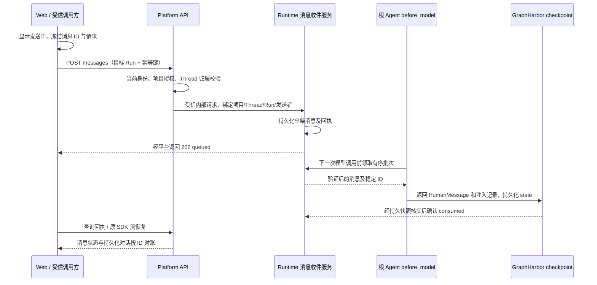

# 07 多端消息入口、持久化队列与 Middleware 注入

## 目标

让用户在 Agent 运行期间补充信息，复用当前 Run 的执行与流式订阅，在下一次模型调用前送达根 Agent。消息接收、执行和 UI 回执职责分开，支持多个浏览器及受信 API 调用方使用同一消息契约。

这是对原 01—06 前端方案的**新增跨服务设计**。2026-09-10 用户确认本专题最后完成：先完成前端主体 G1—G6，再进行 Q0—Q5，实施细节在该阶段评审。当前不提前创建队列接口、数据库迁移、抽象或 UI 占位；运行中保留草稿/停止后发送。队列不阻塞普通聊天、流式渲染、审批与前端主体验收。

## 方案设计

### 1. open-swe 第 5 节的四项覆盖

| 借鉴点 | 原方案覆盖 | 本次补充后的目标 |
| --- | --- | --- |
| BFF Proxy 隔离引擎 | 已纳入 03；现有 `/api/langgraph` 提供平台边界 | 继续复用认证、项目授权和可信委托；消息接口也经平台 |
| 多端 Middleware + Queue | 03 §7 只有约束，未纳入首期实施 | 本专题 Q0—Q5 明确 Platform API、Runtime、Web 三边任务 |
| Idle/Running 请求分离 | Idle 新 Run；Running 仅草稿/停止后发，覆盖不完整 | Idle 用官方 SDK 启动；Running 普通 HTTP 入队，继续原订阅 |
| Optimistic UI | 04 已含普通发送乐观反馈 | 扩展 sending→queued→consumed，对明确失败/未知结果分别处理 |

参考源码（相对参考仓库 `../research/open-swe`）：

- `agent/utils/thread_ops.py:queue_message_for_thread`：读取整个 messages 数组再 put；并发写存在覆盖窗口，超过 100 条还会丢弃最旧项。
- `agent/middleware/check_message_queue.py:check_message_queue_before_model`：实际使用 `langchain.agents.middleware.before_model`，读取后先 delete 再返回 messages；不能提供 checkpoint 前崩溃不丢消息的保证。
- `agent/dashboard/thread_api.py:send_dashboard_message`：Dashboard 在 busy 时入队；只有该业务接口的 409 表示 idle，不是通用 HTTP 409 语义。
- **文档与当前源码不同：** `thread_ops.py` 明确说明 Slack/Linear/GitHub webhook 已改用 `dispatch_agent_run(multitask_strategy="interrupt")`，Store 队列保留给 Dashboard。这里借鉴统一入口的设计，不把参考代码描述成已经全部统一入队。

不新增 Slack/Linear/GitHub connector、通用消息总线、平台 Worker 或 Operations。多端首先指 Web 多会话及现有受信调用方；将来增加入口时必须映射到平台身份和同一消息契约。

**无需增加独立基础设施组件或 UI 组件库。** 复用现有服务进程、PostgreSQL、官方 SDK 和 Vue 成熟组件；本专题后续仍需增加业务接口、持久化记录、Middleware 和气泡状态逻辑。这些属于现有应用内部代码，不是部署新的队列服务。图中的“Runtime 消息收件服务”也是 Runtime 内部模块。

### 2. 服务责任与链路

| 位置 | 职责 | 边界 |
| --- | --- | --- |
| Platform API runtime_gateway | 消息入口、DTO、当前授权、可信委托、错误/回执代理 | 不持有消息队列副本，不直接读写 Runtime 表，不允许用户指定 sender/tenant |
| Runtime 消息模块 | 单一持久化所有者，入队、顺序、幂等、领取、恢复与回执查询 | 不变成第二个 Run 调度器；Run/checkpoint 仍由 GraphHarbor 管理 |
| Runtime middleware | 根模型调用前消费，返回标准 state 更新 | 工具与业务节点不写消息轮询；不改变模型、工具 grant 或 RuntimeContext |
| Web ChatSession | 普通发送与补充发送分流，临时反馈及回执查询 | SDK 仍唯一拥有执行消息/工具/interrupt 投影 |

当前 `middlewares/__init__.py` 没有队列中间件；`webapp.py` 没有消息入口。`reference_agent/agent.py:get_agent` 和 `demo/showcase_demo/agent.py:get_agent` 是挂载位置。Showcase 的 middleware 工厂同时用于子 Agent，**不能把消费者放进该共用工厂**；只挂根 Agent。其他 graph 逐个声明支持，不以全局目录默认“支持队列”。

### 3. 存储与执行引擎前置门禁 Q0

**GraphHarbor 边界（2026-09-10 用户确认）：** 定位等价于官方 LangGraph Server，不是平台业务后端。源码仓库为 `~/PyCharmMiscProject/graphharbor`，相对本仓库根为 `../graphharbor`；发布凭据位置统一记录在本项目 [README](README.md)。本轮未读取凭据、未修改该仓库。

| 所属位置 | 可以承载的代码 | 不应承载的代码 |
| --- | --- | --- |
| GraphHarbor | 官方兼容协议、通用 Thread/Run/Store/checkpoint、流重放、持久执行、取消/恢复、通用认证扩展点；已复现缺陷的修复与回归测试 | 平台项目角色/grant、消息来源适配、业务收件表/回执、补充消息注入规则、审批业务策略、具体 Agent/工具逻辑 |
| Platform API / Runtime | 平台身份与授权、业务消息 API/持久收件/回执、MessageQueueMiddleware、Agent 挂载及消费策略 | 另造一套 Run 引擎、绕过或修改 GraphHarbor 私有存储来实现业务 |

开发任一阶段遇到 GraphHarbor 缺陷，可按用户授权在源码仓库修复：先用与平台业务无关的最小图/协议用例复现，再修复并运行通用回归及当前调用链验证，记录源码版本和使用的包版本。引擎修复无需等到最后的队列阶段；只有队列专项 Q0 后置。不能因为业务缺少队列能力就判定引擎有缺陷，也不能把业务功能包装成引擎优化。

本地依赖为 `graphharbor==0.13.0.post26`。已读安装包 `langgraph_runtime_pg/store.py`，存在 `AsyncPostgresStore` 工厂；`run_store.py` 有 Run claim/lease/finalization，`production_worker.py` 负责持久执行。**存在 Store 不等于已具备消息队列事务，也不证明根/子图已注入同一个 store。** 当前未完成可运行的队列 Spike。

推荐最小实现：复用现有 PostgreSQL 基础设施，由 Runtime 拥有独立的 `runtime_message_inbox` 表及迁移，显式声明实际使用的数据库驱动依赖。不新建 Redis 队列/Kafka，不直接修改 LangGraph Store 或 checkpoint 的内部表。单条消息一行，避免整个数组读改写。通用 BaseStore 的 get/put/delete 不提供这里要求的原子领取与条件确认，不能直接当可靠队列使用。

拟存字段：`message_id`、tenant/project/thread、`target_run_id`、可信 `sender_id/source`、冻结 payload 与 digest、幂等键、thread 内 sequence、status/reason、claim token/owner/期限、`consumed_checkpoint_id`、创建/更新时间。幂等唯一约束按项目/Thread/发送者/动作键限定；message ID 在同一项目/Thread 唯一，碰撞且内容/发送者不同则拒绝。序号与插入在同一短事务中按 Thread 串行分配，按服务端接受顺序消费；锁在调用模型前释放。

Q0 必须用当前 GraphHarbor 证明以下接点，再冻结实现：

1. 内部入口能在受信作用域读取指定 Thread/Run 的真实状态；pending/running/interrupt/cancelling 的映射明确，不能只用前端 isLoading。
2. 根 Agent 的 state 更新采用持久化后再推进模型节点的执行设置；可读取**已提交** checkpoint 的注入记录。不能从内存 state、custom 事件或中间件返回值推断已落盘。
3. claim 的失效接管与 Run worker ownership 相容，旧 Worker 不能在失去所有权后确认消费。至少一次投递 + 稳定 ID 去重；不承诺模型/外部工具副作用 exactly-once。
4. 当恢复从 before-model 节点之后继续时，已注入消息可从持久快照完成回执确认，不能只依赖下次中间件回调。
5. 当前授权复核接口/受信操作、终态与 checkpoint 查询、可用的通知接点均通过真实 API/Worker 分进程实验。

若缺少公开的持久快照/所有权接点，先区分通用引擎缺陷与业务需求：前者用独立复现修复 GraphHarbor；后者留在 Runtime 并调整业务方案。只有确属官方兼容或与业务无关的通用执行能力才考虑引擎改动，并记录契约与版本依赖；禁止增加平台专用 hook/端点。不修改 site-packages、不猴子补丁、不绕过 Run lease。**仅加 before_model 无法补齐这些可靠性要求。** Q0 失败只阻止队列上线，不推翻已完成的前端主体验收。

### 4. 拟新增公开与内部契约

以下均为**拟新增接口**，未包含在目前网关的 20 条路由中：

| 公开接口 | 契约 |
| --- | --- |
| POST `/api/langgraph/threads/{thread_id}/messages` | 只接受 `client_message_id`、`target_run_id`、`content`；需 `Idempotency-Key` 与固定 `x-project-id`。内容沿用已批准的文本/附件白名单；附件没有授权契约时拒绝，不能接任意 URL |
| GET `/api/langgraph/threads/{thread_id}/messages` | 有界分页查询投递回执，可按 message ID 或 target Run 过滤；默认只返回调用方可读的当前 Thread 消息。不是另一套对话历史 API |

新入队成功 `202` 返回 `{message_id, thread_id, target_run_id, sequence, status:"queued"}`；重试原动作返回同一条记录的当前回执，**不必仍是 queued**。稳定 `message_id` 由校验后的 client UUID 确定并贯穿 HumanMessage，不能使用时间戳/文本对账。

| 情况 | 返回与处理 |
| --- | --- |
| 当前无活跃目标 Run | 409 `thread_not_running`，明确 `accepted:false`；无任何消息插入 |
| 活跃 Run 已变化 / 正在取消 / 等待审批 | 409 `run_changed` / `run_cancelling` / `approval_required`；刷新状态，保留原草稿 |
| graph 未实现消费者 | 明确 `queue_not_supported`，不入队；保留停止后发送能力 |
| 同 key 不同 payload / 同 message ID 不同内容 | 409 `idempotency_conflict` / `message_id_conflict`，不换 key 自动绕过 |
| 队列达到限制、正文过大 | 显式 429/413；不静默丢旧消息。拟默认每 Thread 未完成 100 条、单条规范化 JSON 64 KiB，Q0 压测后冻结 |
| 未认证/撤权/跨项目 Thread | 401/403/按平台隐藏资源约定的 404；无入队副作用 |
| 超时、断网 | 前端显示 unknown，原 ID/key 查询或重试；不能认定失败后另建 Run |

Runtime 拟提供对应 `/internal/threads/{thread_id}/messages` POST/GET，由 Platform 代理；公开业务字段与内部身份事实分开。新增 `message-enqueue`/`message-read` 委托操作，绑定项目/Thread/目标 Run/发送者；自定义 FastAPI 路由必须显式认证和资源授权，不能只因为路径是 internal 就相信输入。复用现有可信委托签发、校验和 HTTP 适配器；消费当前权限复核复用现有授权能力，缺少时补一个限定用途内部检查，不接收客户端 role/policy。

### 5. before_model 消费、确认与竞态

推荐 `MessageQueueMiddleware.abefore_model`（LangChain 官方 `AgentMiddleware` 扩展点），根 Agent 用明确 middleware 列表组合。步骤：

1. 从验证后的运行上下文取项目、Thread、目标 Run、graph；无消费能力/非根 namespace 则不消费。正文不能指定这些值。
2. 读取本 Run 的**持久**注入记录，先对已提交但未确认的消息完成对账；按 sequence 原子领取有界批次。租约过期重领仍使用原 message ID；不提前删除记录。
3. 消费前复核发送者当前 Thread 写权限和 Run 可继续条件。撤权则 `rejected`；授权服务不可用不注入、不确认成功，保留待重试记录并呈现明确故障。
4. 返回 `HumanMessage(id=message_id, content=...)` 和注入 receipt state。receipt 绑定 Run/消息/checkpoint 分支；由 messages reducer 按稳定 ID 去重。新增消息始终是 human 内容，不能覆盖系统消息/冻结 context。
5. 在可证实的持久 checkpoint 包含该 receipt 后标记 `consumed`。含义是“已写入本 Run 的持久上下文”，不声称模型已遵循要求或工具已执行；模型请求失败也不能伪造完成。

注入记录须在本 Run 生命周期内可查，不能因消息摘要/裁剪丢掉去重依据；新的 Run/历史分支不消费旧 target Run 的信箱。确认用条件更新校验 claim 与执行所有权；终态回执不可被迟到的旧 Worker 覆盖。

| 边界 | 明确规则 |
| --- | --- |
| 两个入口同时发送 | 不覆盖、不丢弃，各自稳定 ID，按服务器事务顺序消费 |
| 已领取但 checkpoint 前崩溃 | 记录保留；有效接管后重试同 ID，不宣称 consumed |
| checkpoint 后、确认前崩溃 | 恢复/查询时从持久 receipt 确认；不能重复追加同一 human |
| 入队检查后 Run 恰好结束 | 202 只承诺持久接收；终态核实中，有 receipt 则 consumed，无 receipt 则 `not_consumed(run_ended)`，不能永远 queued |
| cancel 与入队/消费竞态 | 已持久注入则保留 consumed；未注入则 `not_consumed(run_cancelled)`；不跨到下个 Run |
| 入队后进入 interrupt | 暂停消费、保留 queued；审批仍仅由 resume 完成。恢复得到新 Run ID 时，旧 Run 中未消费消息显式 not_consumed，不自动转移/附带在 resume 中 |
| 执行工具/子 Agent 期间 | 等根下一次模型边界；不立即中断工具，不向所有并行子 Agent 广播 |
| 运行最终答复后没有下一次模型调用 | 消息显式 not_consumed；用户可将正文恢复草稿并主动作为新动作发送 |
| 查询回执、浏览器刷新 | 先依据当前 Run/持久 receipt 归并结果，再返回；没有浏览器在线也不能丢记录 |
| Thread 删除 / 保留期清理 | 按受信生命周期删除该 Thread 队列记录；清理不能截断幂等重试窗口或活跃 Run 去重记录 |

终态核实采用读取回执时的惰性对账，必要时复用已存在的 Run 终态通知；不为更新回执另建常驻平台 Worker。通知仅作失效提示，数据库回执和 checkpoint 才是事实源。清理窗口冻结为：活 Thread 保留全部 receipt/幂等记录；已删除 Thread 的记录至少保留最后更新后 24 小时，且不存在 pending/running Run 才允许清理。由 Runtime 显式运维命令 `python -m runtime_service.messaging --prune-deleted` 读取同库 GraphHarbor threads/runs 执行，缺表/失败不清理；可接现有运维调度，不新增常驻组件。迁移/回退必须保留尚未消费记录。

### 6. Web 发送和渲染

- Idle：走原官方 SDK `submit`/commands；Running 且后端已部署并声明该 graph 支持：走新 messages POST，保留原 SDK 订阅。仅入队请求等待 ACK，不能 await 整个 Run 才解锁下一次补充发送。
- 本地 busy 只决定首选动作；服务端裁决。普通新 Run 被并发 reject 或 queue 返回任何 409，都先核实状态；**不做通用的 409→切换另一写接口自动重放**。`accepted:false` 后允许用户显式再次发送。
- 点击立即显示 sending；202 后显示“排队中，等待下一次模型调用”。consumed 与 SDK 对话中的同 ID human 合并成一条；先收到流还是先收到 HTTP 回执都不重复闪烁。
- 临时消息/回执是局部投递状态，独立于 SDK 执行投影；不写入 SDK 私有 store。明确 rejected/not_consumed 保留原因和“恢复到输入框”，unknown 保留原 key/payload，不静默移除导致重复执行。
- hydration、发送 ACK、Run 终态、重新聚焦时查询回执；根注入后的标准 messages/state 流用于及时对账。跨浏览器尚未注入的 queued 状态以回执查询呈现：前台活跃会话可每 3 秒刷新该小型列表，30 秒后停止并提供手动刷新，离开/隐藏/退出立即取消。不循环拉 history，不宣称所有来源的 queued 通知已实时推送；将来确需即时通知时先验证既有事件通道，再增加通知接点。
- graph 不支持或后端尚未部署时保持运行中草稿/停止后发；这只是阶段降级，不能用它验收本专题。待审批、取消中和连接结果未知时普通发送仍受阻断。

### 7. 官方依据与实现范围

已通过 LangChain Docs / Reference MCP 核对：

- [自定义 Middleware](https://docs.langchain.com/oss/python/langchain/middleware/custom#class-based-middleware)
- [AgentMiddleware.abefore_model](https://reference.langchain.com/python/langchain/agents/middleware/types/AgentMiddleware/abefore_model)

这些证明扩展点存在，不证明本项目的 checkpoint/授权/领取事务已经实现。SDK 的 multitask `enqueue` 排的是新 Run，与同一 Run 的消息注入不同；HITL `resume` 是审批恢复，三者保持独立。

### 8. 已批准的 checkpoint 对账方案

本轮采用 Runtime 业务对账，不要求 GraphHarbor 增加平台专用 hook：Middleware 只 claim 并把稳定 ID 写入私有 state；Runtime 通过 GraphHarbor 的已提交 `aget_state`/state history 读取 checkpoint，确认 `runtime_message_claim` 中的 ID 后调用 `MessageInbox.reconcile_checkpoint()`。读取 Receipt 或 Run 终态时执行惰性对账，checkpoint 前崩溃由 lease 接管，checkpoint 后 ack 前崩溃由同一 checkpoint 重复对账恢复。只有在 GraphHarbor 无法区分已提交快照、无法读取最终 checkpoint 或 ownership fence 失效时，才提交通用引擎修复，禁止加入业务队列表和业务事件。

#### open-swe 对照结论

open-swe 的 `agent/middleware/check_message_queue.py` 在 `before_model` 读取 Store 队列后先 `delete` 再返回消息；`thread_ops.py` 也采用 Store 的读改写。它依赖 LangGraph 的同步 checkpoint 和消息 ID/业务幂等，但没有本项目要求的 claim lease、checkpoint receipt、崩溃前后对账或旧 Worker fence。因此 open-swe 能实现“运行中追加消息”的正常路径，不能证明 checkpoint 前崩溃不丢消息；这正是本方案需要补齐的可靠性差异。

## 任务拆分

- [x] Q0：真实 PostgreSQL、独立进程 checkpoint 前后崩溃与恢复验证完成；GraphHarbor 当前源码网络链路通过。
- [x] Q1：收件、幂等、顺序、claim 自动回收、回执查询及 Run 终态惰性对账已实现并验证。
- [x] Q2：reference/Showcase 根 Middleware、消费前权限复核、同 Run 累积 Receipt、跨 Run/子 namespace 隔离已实现。
- [x] Q3：目标 Run、严格 Thread scope、消息委托签发/消费授权、公开 GET 回执与私有字段脱敏已完成。
- [x] Q4：Web 专用入队、回执 hydration/刷新/有界轮询、unknown 固定 ID/key/payload 重试与状态展示已完成。
- [x] Q5：非后置消息网络场景、GraphHarbor post27 发布包、移动端、回执/取消/长任务与终态回归已通过；双浏览器同 Thread 明确 deferred。QV11 的关闭入口/迁移恢复也由 Runtime PG 测试覆盖。详见下表与 [11 收尾记录](implementation/11-closeout.md)。

新增估算 **10–16 人天**，含 Spike 与验证，不含尚未确认的通用引擎缺陷修复；与原前端 22–30 人天分列。固定顺序为 **G1→G2→G3→G4→G5→G6（前端主体验收）→Q0→Q1/Q2/Q3→Q4→Q5（队列专项验收及关键链路回归）**。Q0 不提前插入 G1，队列实际启用必须等 Q5 通过。正常代码职责分离足以支持最后补充本能力，不为后续队列预建接口/组件/通用框架。

## 验证要求与记录

- [ ] QV01（浏览器部分 deferred，用户明确暂缓）：两个浏览器/两个已授权调用方并发各发 10 条，查询/消费 ID 集合完整、顺序可追溯，无覆盖。 **deferred：双浏览器按用户要求暂缓，PG 并发证据不替代。**
- [x] QV02：同 key/payload 重发多次仅一条记录；同 key 不同正文、同 ID 不同发送者均拒绝。 **done：PG 已验证原请求去重、同 key 改正文冲突及发送者隔离。**
- [x] QV03：入队 ACK 丢失、入队/Run 结束竞态、取消、待审批，各条都有 consumed/rejected/not_consumed 可解释结果，无自动新 Run。 **done：ACK 丢失、Run 终态、注入前/后取消及待审批新 Run 隔离均有网络/PG 证据。**
- [x] QV04：领取后、checkpoint 前及 checkpoint 后确认前杀 Worker；重启恢复不丢消息、不重复 human；失效旧 Worker 无法确认。 **done：真实 PG checkpoint 前/后 SIGKILL 子进程恢复、幂等对账及失效 claim fence 测试通过；不是双浏览器并发证明。**
- [x] QV05：撤权、跨租户/项目/Thread、伪造 sender/source、旧委托/错 operation、授权服务故障均不注入；入队正文不能修改模型/工具权限。 **done：撤权、跨项目/Thread、伪造 sender/source、委托和授权服务故障均有边界测试；正文不能改变权限。**
- [x] QV06：两个并行子 Agent 不抢根队列；根工具完成后的下一模型调用能看到补充；没有下次调用的消息明确 not_consumed。 **done：根工具后注入、两个并行 child 不抢 root、无后续调用终态关闭均已验证。**
- [x] QV07：审批只由 resume 生效，普通补充不能批准；恢复的新 Run 不偷走父 Run 剩余队列，历史 checkpoint 重发不重放旧队列。 **done：审批仅由 resume 生效，父 Run 队列不被新 Run 偷取，历史 checkpoint 重发不重放旧队列。**
- [x] QV08：HTTP ACK 与 SDK 消息乱序、刷新/断网、跨项目切换，气泡按 ID 只出现一次；未知结果保留、清理订阅及查询正确。 **done：HTTP/SDK 乱序、刷新/断网、跨项目和迟到回执按 ID 幂等；会话 dispose 释放订阅。**
- [x] QV09：消息上限/大小限制生效，不静默丢弃；数据库回滚事务不返回成功；最旧 pending 年龄/拒收数/消费延迟可观测且日志不含正文/凭据。 **done：PG 已验证大小/条数限制、事务失败回滚；stats 聚合 pending 年龄、拒收数、消费延迟，日志不含正文。**
- [x] QV10：真实长任务中补充“增加一项验证”，本次 Run 根模型上下文可证实收到，后续输出可追溯；同时验证工具执行期间非立即打断。 **done：post27 网络两轮 12 秒慢工具、两批消息注入和模型上下文断言通过；该网络用例使用确定性模型，外部模型证据单列在 09。**
- [x] QV11：只关闭队列入口/降级前端后，既有消息及回执保留；新 schema 的升级与恢复演练成功，不要求恢复旧前端不兼容 bundle。 **done：PG 已验证旧 schema 加列保留数据、重复迁移幂等、入口关闭时既有请求继续可查/确认/消费，恢复开启后新请求可入队。**

2026-09-11：真实 PostgreSQL 收件测试 4 passed；Runtime 测试 27 passed；GraphHarbor R6 Worker 故障脚本 SIGTERM、SIGKILL 均 passed（各 1 terminal event，恢复后状态正确）。Runtime GET Receipt 已接入已提交 checkpoint 惰性对账。Web Chat/Agent Playwright 2 passed，移动端 1 passed。Showcase 真实长任务通过 API/Worker 重启、审批恢复和独立工作区执行（3 runs，最终 success）。取消竞态已完成队列层测试；双浏览器同一 Thread 的真实入队回归和完整 Q5 仍未完成。

规划阶段历史文档验证（非当前实现状态）：`python3 scripts/check_docs.py`、8 篇项目文档相对链接/空白检查、`git diff --check` 均通过。SDK 版本与 optional peers 通过 registry 查询核对；没有安装升级、业务代码变更或新增实现测试结果。

## 状态

本期 Q0—Q5 非后置范围已完成（done）；QV01 双浏览器并发 deferred。G6 由 06 独立记录，不从队列专项倒推。

## 2026-09-11 专项完成度（最终补充见 11）

| 项目 | 四态 | 证据与边界 |
| --- | --- | --- |
| Runtime 根 Middleware、累积 Receipt | `done` | reference/Showcase 挂载；真实 create_agent/PG；网络两批消息依次注入并各仅出现一次 |
| checkpoint 恢复与分支隔离 | `done` | 真实 PG 历史对账；checkpoint 前/后 SIGKILL 子进程恢复；其他 Run、child namespace、input/fork snapshot 不确认根队列；最新快照缺 Receipt 不抹除历史证据 |
| 自动 lease 回收与 Run 终态 | `done` | claim 内自动回收；网络取消两窗口各得到 not_consumed/consumed，刷新结果一致；终态采用查询时惰性对账 |
| 目标 Run 与权限边界 | `done` | 实际 HTTP 入队/消费授权；严格 scope/内容类型与当前权限测试；专用 operation 签发和私有字段脱敏测试；撤权后不注入，刷新后历史/回执只读可查的网络用例通过 |
| Web Receipt 与 unknown | `done` | GET hydration/有界轮询/状态；单测固定原 ID/key/payload，ACK 前不清草稿；网络断 ACK 后刷新并原请求重试已通过 |
| 长任务与移动端 | `done` | 390×844 两轮真实慢工具/网络注入、停止、草稿保留、刷新；此前真实模型发送/审批/取消与移动布局 4 个浏览器用例通过；外部模型注入测试授权 HTTP 为 mock，与网络确定性模型证据分列 |
| 双浏览器同 Thread 同时入队 | `deferred` | 用户明确暂缓，不以 PostgreSQL 并发测试替代 |
| GraphHarbor 发布构建 | `done` | post27 两包已上 PyPI，四产物哈希一致，Runtime 锁文件更新并从 PyPI 安装；无源码覆盖的五个网络场景 5 passed，见 [10](implementation/10-graphharbor-post27-release.md) |

实施记录现有 01、08、09、10、11 五份，按实质改动追加，编号不代表阶段完成数量。[09](implementation/09-message-delivery-completion.md) 列出完整文件、配置、命令与日志位置。总体 G6 的其他门禁仍以 06 为准。

本轮结果：5 个网络浏览器场景分别通过（两批注入、取消前/后窗口、撤权只读恢复、丢 ACK 原请求重试），命令与日志见 09。Q5 的完整清单仍须逐项验收，不把本轮结果扩展为所有 QV/G6 门禁通过。

## 2026-09-11 最终清单核对

Q0—Q5 的本期非后置工作均完成；QV02—QV11 已有 PG/授权契约/浏览器故障注入证据，详见 [11 收尾记录](implementation/11-closeout.md)。QV01 明确 deferred，不以 PG 并发代替双浏览器。

Runtime 的 inbox 复用 PostgreSQL 与现有 Worker，不新增组件。终态采用 Receipt 查询时惰性对账，claim 时自动回收过期 lease；命令行 `--stats`/`--prune-deleted` 用于观测与显式保留窗口清理。
