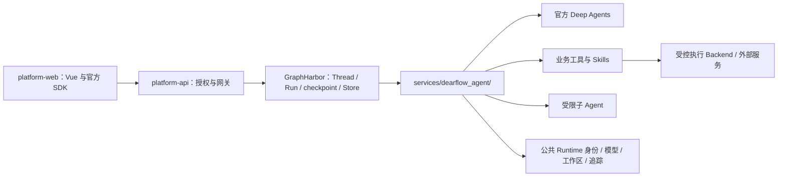

# 01 架构、边界与参考基线

## 目标

先定义可运行、可验证的最小生产底座，再沿底座迁移能力。避免复制 DeerFlow 的框架壳层，避免把 Showcase 私有实现变成生产依赖。

## 工作上下文

- **总入口：** [项目总纲与交接规则](README.md)。独立开发本章时先读总纲，不以聊天历史代替依赖证据。
- **实施阶段：** P0—P1；先完成本章第一轮实施包，再让后续专题复用底座。
- **必读前置：** 无已实现前置；阅读 [08 前端／契约](08-web-and-platform-contracts.md) 的 F0／F1 与 C01—C05、[10 阶段](10-delivery-and-production-verification.md) 的 P0／P1。
- **输入 → 输出／对接：** 仓库开发范式、参考锁版本、现有鉴权／Chat／workspace → 冻结目录与作用域、Spike 证据、前后端最小闭环。
- **当前切片／最近证据：** 2026-09-14 规划第二版；业务未实施，无实施验证记录；本文末尾只记录文档调研情况。
- **下一任务：** 01/A01 → A02（含 08/F0）；实施范围须先获批准。
- **结束回填：** 更新本章任务／验证／状态及此处游标，按总纲登记最近 implementation 记录、契约变化和下一精确任务；部分切片通过不勾选整章完成。

## 方案设计

### 1. 参考版本与事实来源

- DeerFlow 参考根目录：相对本仓库根的 `../research/deer-flow/`。
- 调研提交：`44ae750545caff29506906f4b0b1ebf79cb23fa7`（2026-09-13）。参考仓库存在本地文档与启动脚本修改；迁移时对选定文件记录实际 SHA-256，不把工作区全体内容视为纯上游提交。
- 下文标记“DeerFlow 源码”的路径均相对该参考根；本项目路径均相对本仓库根。路径带函数名表示参考符号，不表示可直接导入。
- 新增文件均标为“拟新增”；目录是职责地图，不是本轮创建脚手架的指令。
- 参考根的知识图谱缺失，Harness 子目录有旧图；旧图只辅助定位，当前源码与锁文件才是依据。

| 依赖 | 本项目 `apps/runtime-service/uv.lock` | DeerFlow `backend/uv.lock` |
|---|---|---|
| Python 解释器要求 | >=3.13 | >=3.12（`deerflow-harness` 包本身版本为 2.1.0） |
| Deep Agents | 0.7.8 | 主装配未使用 |
| LangChain | 1.3.17 | 1.3.14 |
| LangGraph | 1.2.11 | 1.2.9 |
| LangGraph SDK | 0.4.3 | 0.4.2 |
| MCP adapters | 0.3.2 | 0.2.2 |
| GraphHarbor | 0.13.0.post27 | 自有嵌入式 Runtime |

不预先升级核心依赖。P0 先验证这些锁定版本；确需升级时提交兼容性证据和版本变更方案。

正式工程规范：

- [Runtime 范式](../../../apps/runtime-service/docs/standards/runtime-service-development-standard.md)。
- [Platform API 开发规范](../../../apps/platform-api/docs/handbook/development-playbook.md)。
- [Runtime 网关规范](../../../apps/platform-api/docs/standards/runtime-gateway-interface-standard.md)。
- [前端规范](../../../apps/platform-web/docs/frontend-development-playbook.md)。
- `apps/runtime-service/docs/knowledge/13-runtime-service-target-code-layout.md` 与 `20-runtime-backend-workspace-skills-and-subagents-design.md` 作为设计背景；若旧目录／版本描述与当前代码不符，以生效标准和代码为准。

### 2. 所有权与依赖方向

| 数据／行为 | 唯一事实所有者 | 其他服务允许做什么 |
|---|---|---|
| 用户、tenant、project、Agent／模型授权 | Platform API | Runtime 验证委托；Web 显示授权后的能力 |
| Thread／Run 终态、checkpoint、官方事件 | GraphHarbor／LangGraph | 网关转发，SDK 投影，业务引用 ID；不建另一份 Run 状态机 |
| 普通子图状态 | LangGraph 子 namespace | UI 根据官方 discovery 与 namespace 读取 |
| 独立子任务执行状态 | 子 Thread／Run | Runtime 只保存父子归属、幂等键与证据引用 |
| 工作区文件和产物 | Runtime 工作区 | Platform 授权代理；Web 按文件引用读取；不把二进制存入 checkpoint |
| 长期记忆内容与提取规则 | Runtime 业务逻辑＋官方持久 Store | Platform 做身份授权与审计，Web 提供查看／修改／删除 |
| 自定义 Skill 修订与启用版本 | Runtime 服务私有技能存储 | Platform 授权，Web 管理；不写进已部署 Python 包 |
| 外部生成任务的远端句柄、投递记录 | Runtime 业务任务记录 | Run 通过标准工具／事件消费；不复制远端或引擎调度器 |

### 3. 文件归属地图

| 目标路径 | 所属职责与创建时机 |
|---|---|
| `apps/runtime-service/src/runtime_service/graphs/dearflow_agent.py`（拟新增） | 只重导出 `get_agent`，P1 注册 |
| `apps/runtime-service/src/runtime_service/services/dearflow_agent/`（拟新增目录） | Dear Agent 业务模块边界；按专题拆分文件，禁止把所有装配、工具和策略堆进单文件 |
| `.../agent.py` | 唯一组合根 `get_agent`；只负责调用 `create_agent`、装配已解析的模型／工具／Middleware，不承载具体工具实现 |
| `.../modes.py`、`.../context.py`、`.../prompts.py` | 执行模式、Context 解析和纯提示词；不读 HTTP、数据库或宿主环境 |
| `.../middleware/` | Dear Agent 专属中间件按职责拆分（澄清、保护、观测）；通用中间件仍放公共 Runtime |
| `.../tools/`、`.../subagents/` | 工具装配与实现、子 Agent 角色定义／委派策略；按增长拆模块，不建全局 Registry |
| `.../skills/`、`.../memory/` | 23 个 Skill 资源及记忆策略；只在对应章节实现时创建子目录和文件 |
| `.../workspace/` | 仅存 Dear Agent 的绑定／装配适配；通用 workspace、artifact、执行协议放公共目录 |
| `.../schemas.py`、`.../errors.py` | 业务证据、结果、记忆候选和领域错误；不复制完整 AgentState 或公共 API DTO |
| `apps/runtime-service/src/runtime_service/services/dearflow_agent/skills/<skill>/`（拟新增） | 23 个 Skill 逐个落地，资源用 `importlib.resources` 装载，随 wheel 分发 |
| `apps/runtime-service/src/runtime_service/workspace/`（现有） | 公共 scope、文件引用和 I/O；Showcase 与新 Agent 的真实复用边界 |
| `apps/runtime-service/src/runtime_service/runtime/capabilities.py`（拟新增） | 小型不可变能力描述与纯校验，共 HTTP／组合根使用；不做插件扫描或 Tool Registry |
| `apps/runtime-service/src/runtime_service/middlewares/`（现有） | 已有共享鉴权、图片、文档、队列等；只有 DearFlow 使用的补充 Middleware 留在其服务内 |
| `apps/runtime-service/src/runtime_service/observability/`（现有） | 统一 tracing、用量事实及脱敏；不持有 Run 终态 |
| `apps/platform-api/src/platform_api/modules/runtime_gateway/`（现有） | 公开请求授权、幂等、受信资源代理；新增路由先定义契约 |
| `apps/platform-api/src/platform_api/modules/runtime_catalog/`（现有） | 能力快照及模型能力字段，复用现有目录模型 |
| `apps/platform-web/src/modules/dear-agent/`（拟新增） | 专属页面／工作区／任务／成果／技能／记忆 UI，P1 起逐阶段建设，详见 08 |
| `apps/platform-web/src/modules/chat/`（现有） | 复用会话、消息、输入、官方审批、文件及子图详情；最小公开扩展点供两个真实页面使用，不承载 Dear 专属业务 |
| `apps/platform-web/src/services/dear-agent/`（拟新增） | 专属 HTTP 请求和类型按前端规范集中；通用 Thread／SDK 继续复用现有 services |
| `apps/runtime-service/tests/services/dearflow_agent/`（拟新增目录） | 与源码子目录对应按能力建设测试，真实模型场景显式标记；不创建空测试壳 |

公共能力提取只处理两个真实消费者。例如可将 Docker 执行资源管理提到 `workspace/execution.py`，由 Showcase 和 DearFlow 使用；不得把销售报表样例初始化一起提取。允许为了公共抽取更改 Showcase 的导入与装配，不在那里实现新业务。

### 4. 底座先行的可运行边界

P0 通过后，P1 的底座要能完成：授权访问新 Graph → 创建空工作区 → 读取只读 Skill → 执行一个受限真实文件任务 → 标准 HITL → 下载真实产物 → 重连并还原状态。不能先堆几十个空类／接口，再声称框架搭好。

必须先验证的技术风险：

| Spike | 要证明的行为 | 未通过时的处置 |
|---|---|---|
| S0 构图与作用域 | schema 探测不产生 I/O；正式构图校验身份、Context、项目与线程；子角色无额外隐式权限 | 修正组合方式；不关闭鉴权 |
| S1 官方子图 | 两个同角色子 Agent 同时执行时消息、审批、历史、用量不串；重连可还原 | 固定 SDK／引擎最小复现，修复公共协议问题 |
| S2 独立任务 | 官方 AsyncSubAgent／SDK 的 Thread／Run 创建、授权、context、取消、崩溃恢复满足 05 | 使用经评审的薄业务委派工具调用官方 SDK，或阻塞该阶段；不得自造执行器 |
| S3 存储与记忆 | 锁定 GraphHarbor 确实给根／子图注入持久 Store；namespace 隔离、重启保存成立 | 显式使用官方 AsyncPostgresStore 并管理生命周期；不假定文档等于本地已支持 |
| S4 工作区 | Backend 与 HTTP 解析出同一个资源根；只读 Skills 脚本可在隔离环境运行；取消有界清理 | 修正执行部署与资源映射，不退回宿主 shell |

### 5. 第一轮实施包：先搭可运行框架

用户所说“框架先搭好”定义为一个从独立前端到 Runtime 的可验证闭环，交付包含 API、授权、状态、文件和测试；不是提前实现所有技能，也不是仅建立目录。

| 顺序 | 本轮切片与精确任务 | 完成后移交什么 |
|---|---|---|
| P0-A | 本章 A01／A02：来源、S0—S4；02/C04-a：提问混批 guard 与连续中断幂等；08/F0：Chat 组合与接口边界；09/B02 最小协议试验 | 公开 API 兼容证据、部署约束、所需 schema／scope／路由与未决项；不开放产品功能 |
| P0-B | 本章 A03＋08 C01—C05 基础契约＋10/P0 | 评审后的唯一文件归属与最小接口；S2／S3 未通过则明确阻塞后续阶段，不能宣称完整底座可行 |
| P1-A | 02/C01、C04 基础：正式 graph、受信构图、Standard、官方 HITL；本章 A04 | 可通过现有网关执行的最小 Deep Agent；Context 用当前批准版本，四模式 v2 留 P2 |
| P1-B | 04/W01—W03 基础＋W05 基础：公共资源绑定、受限 Backend、只读验证技能、TXT 输入／输出、ArtifactRef | 模型／HTTP 同一个 scope；实际容器任务、取消资源清理和可下载文件；P4／P5 再扩格式 |
| P1-C | 08/W01 最小能力、W03 文件代理、W05 基础审批／澄清及回答预校验、W07 目标与列表、F1 | Dear Agent 独立路由，复用 ChatSession；最小提问 slot 与文本／单选卡片，新建／切换／恢复线程，单一官方 controller |
| P1-D | 10/P1，联合验证本章与 02／04／08 上述切片 | 专属路由输入 TXT→澄清并 resume→受限处理→人工审批→下载→刷新恢复；提问混批工具不执行；隔离、拒绝、异常和原 Chat／Showcase 回归 |

同一轮实现可覆盖多个章的这些切片，但不能将 02、04、08 的整章任务全部勾选。若一个任务包含基础和后续能力，在原任务下记录 P1 已完成的子范围及剩余 P 阶段，或就地拆成子任务，保持同一个事实来源。

P1 最小实际文件：Runtime `graphs/dearflow_agent.py` 和服务 `agent.py`／`prompts.py`／`backend.py`／所需工具与只读验证技能；公共 workspace／HTTP 必要改动；Platform 网关／catalog 对应切片；Web `modules/dear-agent/pages/DearAgentPage.vue`、所需 service/types 与路由；对应真实测试。其他文件只在有真实职责时创建。禁止提前创建空 TaskPanel／MemoryPanel／Scheduler、工具插件系统或第二个会话引擎。

P1 的身份授权、工具执行许可、容器限制、路径隔离与审批先于实际副作用，不能因“先搭框架”推迟到 P2。P2 细化更多工具、模式和预算策略，不能补做 P1 本就需要的安全边界。

P1 出口之后，按 10 的 P2—P7 迭代：先收紧工具和模式，再完整子任务，接着逐个 Skill，最后联合生产验收。后续章节的“第一步”是验证并复用这个底座及当前前置契约，不是每章重搭框架。08/F1 必须先于 07/K01 的 Web 验收完成。

### 6. 官方资料与适用边界

2026-09-13 已经通过 LangChain Docs／Reference MCP 查阅，并阅读本地安装的 Deep Agents 0.7.8 `graph.py`／`middleware/async_subagents.py`：

- [create_deep_agent API](https://reference.langchain.com/python/deepagents/graph/create_deep_agent)：文件、Skills、子 Agent、摘要、HITL 的装配入口。
- [SkillsMiddleware](https://reference.langchain.com/python/deepagents/middleware/skills/SkillsMiddleware)：渐进加载；不会自动完成我们的技能发布治理。
- [Async subagents](https://docs.langchain.com/oss/python/deepagents/async-subagents)：独立后台 Run；同步子 Agent 不等价。
- [子 Agent 流](https://docs.langchain.com/oss/python/deepagents/frontend/subagent-streaming)：官方 SDK discovery、namespace 和按需读取。
- [Persistence](https://docs.langchain.com/oss/python/langgraph/persistence)：checkpoint 与 Store 的职责区别。

本地异步工具存在静态 headers、自动建 Thread、取消 ACK 后更新本地状态等行为；这些不能直接满足本平台按 operation／thread 的委托和终态核实要求。P0 需形成实际协议证据，不复制私有实现或调用 SDK 私有属性。

## 任务拆分

- [ ] A01：冻结来源提交、选定文件哈希和 license；记录到各 Skill 的 provenance 及实施记录。
- [ ] A02：执行 S0—S4，测试文件拟为 `apps/runtime-service/tests/services/dearflow_agent/test_foundation_contracts.py` 与 `test_lifecycle_integration.py`；只在实施批准后创建。
- [ ] A03：在本专题补充通过证据与必须修正的 API 签名，冻结公共／私有模块清单。
- [ ] A04：实现 P1 最小真实闭环，更新正式规范中的复用入口；不覆盖其他项目验收状态。

## 验证要求与记录

- [ ] 冷启动导入、schema 探测、wheel 包资源完整且无 DeerFlow 运行依赖。
- [ ] 模块依赖检查：业务代码不导入 `services.demo`，公共层不导入业务组合根；graph 入口无资源副作用。
- [ ] 每个 Spike 有锁版本、复现命令、期望、实际和证据，失败时明确阻塞范围。
- 2026-09-13：完成静态调研与官方 API 核对；S0—S4 未执行。

## 状态

规划中，待人工评审。方案中的底座能力未实现，不作生产可用声明。
