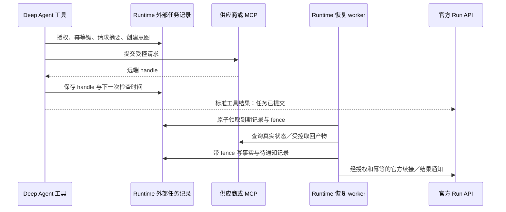

# 09 Goal、定时任务与长耗时外部调用

## 目标

明确哪些图外生命周期是本次必要依赖，哪些没有当前业务场景，应后置。对必要能力做到可恢复、可取消、可核验，不迁移 DeerFlow 的完整后台调度系统，不再创建一套 Agent 运行引擎。

## 工作上下文

- **总入口：** [项目总纲与交接规则](README.md)。独立开发本章时先读总纲，不以聊天历史代替依赖证据。
- **实施阶段：** P0 最小协议试验；P5 必需长任务；Goal／定时／持久批次后置建议待 D4。
- **必读前置：** [01 运行边界](01-architecture-and-boundaries.md)、[05 child 区别](05-subagents-and-lifecycle.md)、[04 媒体产物](04-workspace-sandbox-and-artifacts.md)、[08 C09／F5](08-web-and-platform-contracts.md)、[07 K16](07-skills-migration.md)。
- **输入 → 输出／对接：** 已授权外部调用、远端 handle → 持久恢复／真实远端状态／产物／经官方 Run 交付；不接管根 Run 状态机。
- **当前切片／最近证据：** 2026-09-14 规划第二版；业务未实施，无实施验证记录；本文末尾只记录文档调研情况。
- **下一任务：** 09/B02 最小试验；P5 再实现 B03—B06，先于 K16 实际迁移。
- **结束回填：** 更新本章任务／验证／状态及此处游标，按总纲登记最近 implementation 记录、契约变化和下一精确任务；部分切片通过不勾选整章完成。

## 方案设计

### 1. 范围决策与参考代码

参考路径相对 DeerFlow 仓库根；“后置”是本方案建议，待 D4 人工评审后生效。

| 能力 | 是什么 | 参考代码 | 本次建议 |
|---|---|---|---|
| 普通 Run 持久恢复 | 断线／进程重启后恢复官方线程与执行状态 | `backend/packages/harness/deerflow/runtime/runs/worker.py` | 必须；沿用 GraphHarbor／LangGraph，不搬 worker |
| 运行中补充消息 | 用户在根 Agent 工作期间追加要求 | `backend/packages/harness/deerflow/runtime/runs/` | 必须复用本项目 `messaging/inbox.py`、`reconcile.py` 与现有 MessageQueueMiddleware，扩展能力声明 |
| 独立子任务 | 分别启动、取消、恢复、核验结果 | `backend/app/subagent_batches/service.py`、`backend/packages/harness/deerflow/subagents/batch_service.py` | 后置；当前普通 `task` 不进入外部任务表 |
| 持久批次 DAG／汇聚 | 多任务形成可跨 Run 的批次、完成条件和汇总 | 同上 | 建议后置；普通并行子 Agent 不进入持久批次系统；批次编排后置 |
| 长 MCP／生成任务 | 远端返回 handle，数分钟后完成，进程重启仍能取回 | `backend/app/mcp_tasks/service.py`、`backend/packages/harness/deerflow/mcp/tasks/driver.py`、`runtime.py`、`ordinary.py`、`models.py` | 必须，支撑 K16 视频及实际采用的长 MCP；按协议能力启用 |
| Goal 完成判定 | 检查已完成条件、预算、缺项与证据 | `backend/packages/harness/deerflow/runtime/goal.py` | 在单次 Agent 内纳入 03 的结果验证，交付诚实完成状态 |
| Goal 自动续跑 | 一轮结束后后台自动发起下一轮直至达标 | `backend/packages/harness/deerflow/runtime/goal.py`、`runtime/runs/worker.py` | 建议后置；暂无无人值守目标场景，不能用隐藏 while 循环悄悄增加费用 |
| 定时任务 | 到时创建新任务、重试、时区与错过执行处理 | `backend/app/scheduler/service.py` | 建议后置；用户要求当前 Web 产品，尚无周期研究／日报投递需求 |

不为了未来定时功能预建 Scheduler／GoalManager／通用任务 DAG。后续明确周期研究或无人值守目标时，先查既有平台 worker／官方 SDK 调度能力，另评审授权、预算、取消、时区、misfire、幂等与交付渠道。

### 2. 必要外部任务的最小职责

业务 Agent 仍由官方引擎执行。仅为真实异步供应商／MCP 保存必要远端句柄和恢复信息，推荐路径：

图中的通知采用何种官方 Run API，必须在 P0 的实际部署上冻结：活动根 Run 可复用现有消息队列消费业务结果引用；空闲／等待外部结果的线程通过批准的官方 Run 提交路径续接。不能直接修改 checkpoint，也不能把同一个完成通知同时写队列和新建 Run。

这是用户已经发起任务的完成续接，与后置的“Goal 未完成就无限再开一轮”不同。运行结束只说明本轮模型停止，不代表远端产物已经成功；最终交付以任务和文件事实为准。

### 3. 持久记录与唯一状态归属

拟新增服务私有 `apps/runtime-service/src/runtime_service/services/dearflow_agent/external_tasks.py`；数据库访问按实际需要放同服务 `external_task_storage.py`，迁移放同服务 `migrations/` 并接现有显式部署迁移流程。先服务首个实际视频／MCP 调用，不造多供应商插件框架。

最小任务表字段建议：

| 字段组 | 内容及不变量 |
|---|---|
| 身份与归属 | `id,tenant_id,project_id,user_id,graph_id,thread_id,origin_run_id,tool_call_id`；来自受信上下文 |
| 提交去重 | `idempotency_key,request_digest,provider,operation,capability_version`；同 key 不同摘要返回冲突 |
| 远端事实 | `remote_handle,submission_state,last_remote_status,artifact_refs,last_error_code`；不保存供应商密钥 |
| 恢复控制 | `next_check_at,attempt_count,deadline_at,lease_owner,lease_until,fence`；数据库时间裁决租约 |
| 取消与通知 | `cancel_requested_at,notification_key,notification_state,delivered_run_id`；ACK 与实际完成分别记录 |
| 审计 | `created_at,updated_at,approval_ref,policy_revision`；请求内容只保存必要且受控的信息 |

`submission_state` 拟区分 `intent/submitted/unknown/rejected`，远端终态按 provider 事实规范化，不能复用成 LangGraph Run 状态。父／子 Run 的 running/interrupted/success/error 仍从引擎读取；任务表不维护第二份运行状态机。

通知使用同事务的最小 outbox 或等效可证明机制，与终态事实一起写入；worker 带租约和 fence 领取。表数量以最终数据库方案最少为准，但不能用进程内 list 替代持久交付记录。

### 4. 必须覆盖的故障窗口

1. **先记意图，后提交。** 远端成功而本地还未存 handle 时崩溃，恢复优先用原幂等键／供应商查询定位；供应商不支持时标 unknown 并人工核对，不盲目重新付费。不能承诺通用 exactly-once。
2. **租约失效。** worker A 超时后 B 接管，A 的迟到结果必须通过 fence 拒绝，不能覆盖 B 或重复通知；网络等待不占数据库事务。
3. **取消竞态。** cancel 请求已受理不等于远端已取消。供应商不支持取消时停止本地继续处理／报告真实边界，显示可能仍有已发生费用；已成功产物保留实际事实。
4. **重复回调／轮询结果。** 以业务任务、远端 handle 和产物哈希去重；通知到达后根 worker 崩溃，恢复应确认原消费状态，不重复发起模型／工具副作用。
5. **线程删除／权限撤销。** 不得为已删除线程重建新线程继续任务；停止新执行，残留远端任务记录进入受控清理／待处理列表。授权撤销后的到期任务不能用旧 token 继续取敏感资源。
6. **产物下载失败。** 远端任务成功与本地产物可交付分开，受控重取且校验 MIME／大小／哈希；过期链接重新获取，不将 URL 文本冒充 MP4。
7. **通知失败。** 有界退避、deadline、尝试次数和可查询待处理记录；通知 ACK 不等于模型已消费，沿用已有队列 checkpoint 对账模式。
8. **需要人工输入。** MCP/provider 返回 input_required 时核对实际协议；支持则转官方 interrupt，不支持则明确阻塞，不自动编造应答。

### 5. MCP 适配边界

短 MCP 工具继续使用 `langchain-mcp-adapters`。任务式协议只在服务明确声明且实际测试支持时启用，核对提交、get、result、cancel、通知和凭据续期；“SDK 有类型”不代表当前服务器已实现协议。

不复制 DeerFlow 的全部 MCP Task Driver，也不包装一套自有通用 Run API。若官方公开适配点不能覆盖持久句柄，服务私有业务工具通过官方 MCP SDK 实现必要操作，输入、结果仍为标准 ToolMessage／Command。S2／长任务 Spike 要记录具体版本和不支持项。

### 6. 部署与运行管理

- Runtime 拥有外部任务表及处理逻辑；Platform 负责授权、审计和公开查询，不在 Platform 再存一份远端任务终态。
- `apps/runtime-service/src/runtime_service/webapp.py` 的 lifespan 只挂接已批准拓扑需要的资源／worker；多副本必须通过数据库领取确保唯一有效处理者，不能每个副本无锁扫全表。
- 最大并发、单任务 deadline、队列容量、外部限流和退避有服务策略。长轮询不占模型调用循环、不会靠发送“继续”等隐藏用户消息延长运行。
- 指标至少包含提交未知数、到期未检查数、最长任务年龄、租约争用、取消未终结数、通知延迟／失败、重试与实际供应商费用；日志按任务关联且脱敏。
- 首发只承诺已验证的 provider 与部署拓扑；不因为一个假服务测试通过就宣称所有 MCP／视频供应商都支持恢复。

## 任务拆分

- [ ] B01：D4 确认后将 Goal 自动续跑／定时／持久批次标 deferred，记录触发其未来实施的具体业务条件；不创建空实现。
- [ ] B02：以真实异步视频服务或可控 MCP 任务服务完成提交、ACK 丢失、取消与重启 Spike，冻结官方通知方式及供应商幂等边界。
- [ ] B03：实现最小持久任务、租约／fence、提交未知处理与 outbox，拟新增 `apps/runtime-service/tests/services/dearflow_agent/test_external_tasks.py`。
- [ ] B04：实现受信查询／取消、审批保持、文件下载与官方 Run 结果续接，拟新增 `apps/runtime-service/tests/integration/test_dearflow_external_tasks.py`。
- [ ] B05：真实数据库／双 worker 故障测试，拟新增 `apps/runtime-service/tests/durable/test_dearflow_external_tasks.py`；不得只用内存 fake 证明持久性。
- [ ] B06：K16 真实视频闭环及长 MCP 协议矩阵，记录供应商支持／不支持／未知状态和上线运维说明。

## 验证要求与记录

- [ ] 创建意图、远端提交、保存 handle、记录终态、发送通知各个边界注入崩溃，恢复不盲目重复付费。
- [ ] 双 worker、租约过期、重复消息／迟到结果、权限撤销、线程删除、取消与完成竞态。
- [ ] 主 Run 活动／空闲／interrupted／已删除四类情形的结果交付符合既定官方路径。
- [ ] 真实视频或长 MCP 重启后取回同一任务和产物；不支持远端幂等／取消时准确展示边界。
- [ ] 不直接写引擎 checkpoint／runs 表，不新增私有 Agent executor，不泄露凭据到持久消息。
- 2026-09-13：完成必要性与恢复协议规划；无任务服务、数据库迁移或真实供应商验证已经执行。

## 状态

规划中。必要的外部长任务恢复纳入实施建议；Goal 自动续跑、定时任务、持久批次编排建议后置，待 D4 评审。
