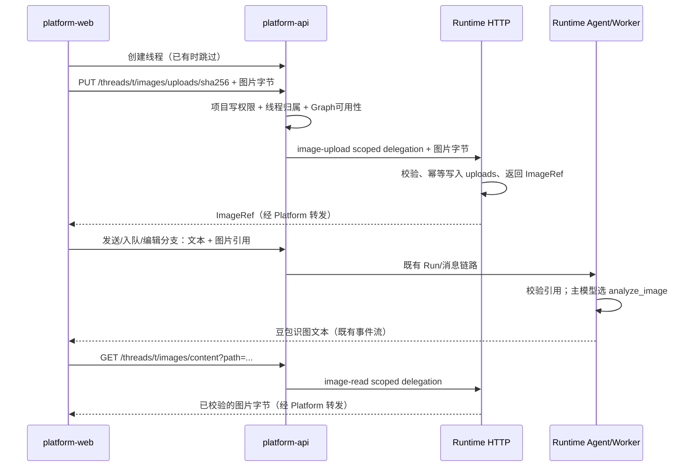

# 04 平台图片链路：契约与实施边界

## 目标与状态

**状态：规划中，未实施。** 本文和 05—08 是第二阶段执行方案；01—03 记录第一阶段已经完成的 Runtime 能力，不代表聊天页面图片链路已经交付。

用户于 2026-09-13 要求将适配方案写到可执行粒度。本次仅授权编写方案；新增文件访问授权边界须由用户评审本方案后实施，不自动继承第一阶段的实施批准。

目标：在 Showcase 聊天页面完成上传图片识别、批准文生图、主 Agent 委派图表 MCP、图片预览/下载及刷新后恢复。工具启用、工具权限、模型连接和 MCP 配置仍由 Runtime 管理；Platform API 只负责用户对项目/线程资源的访问权限。

涉及 `runtime-service`、`platform-api`、`platform-web`。这是跨服务契约改动，并新增文件访问及委托 scope，按治理改动执行评审与验证。无需数据库迁移、不引入对象存储或新运行依赖。

## 1. 已核实事实与直接影响

| 事实源 | 当前行为 | 本阶段结论 |
| --- | --- | --- |
| `apps/platform-web/src/utils/chat-content.ts` 的 `fileToChatAttachmentBlock()` | 图片为 `{type:image,mimeType,data,metadata}` Base64 块 | 草稿可继续使用，但提交前上传，消息只保留引用 |
| `apps/platform-web/src/modules/chat/composables/useChatAttachments.ts` | 单文件 5 MiB、每消息最多 8 个、合计 20 MiB；支持 GIF/PDF | Showcase 图片路径只开放 PNG/JPEG/WebP，其他 Agent 保留现有行为 |
| `apps/runtime-service/src/runtime_service/messaging/inbox.py` 的 `MessageInbox.enqueue()` | 序列化消息内容最多 65,536 字节 | 不能把 5 MiB Base64 直接送入运行中消息队列，也不扩容队列存二进制 |
| `apps/platform-web/src/modules/chat/composables/useChatSession.ts` | `send()` 内创建线程；`queueMessage()`、`fork()` 分开组装请求 | 三个入口必须复用同一个图片提交预处理；线程创建在上传之前 |
| `apps/runtime-service/src/runtime_service/tools/images.py` | 识图接受线程文件路径；生成返回路径字符串；`ImageWorkspace` 做安全文件 IO | 增加上传/元信息操作与标准结果引用，复用现有目录边界 |
| `apps/runtime-service/src/runtime_service/services/demo/showcase_demo/backend.py` | scope JSON 的 SHA-256 派生工作区目录 | HTTP 进程与 worker 必须使用完全相同的派生算法、根路径和共享存储 |
| `apps/runtime-service/src/runtime_service/webapp.py` | 已挂载 FastAPI 自定义应用和内部消息接口 | 图片 HTTP 接口挂在该应用，不启动第二个 Web 服务 |
| `apps/platform-api/src/platform_api/modules/runtime_gateway/presentation/http.py` | 显式路由网关，无图片上传/读取路由 | 增加两个公开接口，不开放任意上游路径代理 |
| `apps/platform-api/src/platform_api/core/security/tokens.py` / Runtime `runtime/auth.py` | operation 只允许 read、run-create、message-enqueue、message-read | 两端同时增加 image-upload、image-read，不能复用 run-create 执行令牌 |
| `apps/platform-web/src/modules/chat/transcript.ts` / `MessageContent.vue` | 支持 URL/Base64 图片，但 `/workspace/...` 仅是文字 | 解析结构化线程图片引用，用认证请求取 Blob，不能直接把工作区路径塞进 img |
| `ApprovalPanel.vue` / `approvals.ts` | 按 review_configs 的 allowed_decisions 展示审批 | 复用审批协议，只补文案和生成工具标题 |
| `SubagentCard.vue` / `SubtaskDetail.vue` | 支持 task 和子图实时事件；历史不能假设仍有子图消息 | 必须验收刷新后的图表可见性，提供持久化 task 返回路径的受限识别 |

文档可能存在旧说明：Showcase 当前已同时注册在 `apps/runtime-service/langgraph.json` 和 `langgraph.demo.json`；以这两个实际配置为准。网关标准中的旧“20 条”计数也不能硬编码沿用，实施时按实际路由测试集合增加 2 条。

## 2. 范围与选型

1. 图片先上传到线程 workspace，再提交小型引用；不建立附件数据库或通用资产中心。
2. 上传使用带内容哈希的幂等 PUT，raw binary body；避免 multipart 解析和新依赖。
3. 图片读取采用有上限的二进制响应，API 先收完整内容并验证上游状态，再响应浏览器。单图最多 20 MiB，第一版不实现 Range、分片、服务端缩略图或永久公开 URL。
4. 消息引用使用 LangChain 标准文本块的 `extras` 扩展；不新增自定义 `type`。主模型收到文本与工作区路径，豆包只在 `analyze_image` 工具里读取图片。
5. 文生图/MCP 在现有路径文本之外附加结构化 artifact，保留模型可读的 `/workspace/...` 返回形式。
6. 不更改原有 `task` 授权，不向平台工具 catalog 添加图片/MCP 权限，不更改模型选择器或暴露图片模型 key。
7. 本阶段仅将 `showcase_demo` 接入线程图片存储；公共 IO 和消息规范可复用，其他 Agent 接入需显式声明，不能默认让所有 graph 访问 Showcase 目录。
8. 真实 Server 重启后图片和历史引用可读取是验收项；跨机器无共享存储、跨线程复制附件、自动垃圾回收、GIF/PDF 识别不在本阶段。

## 3. 三条闭环



文生图：用户请求 → `generate_image` interrupt → 前端按真实 interrupt ID 批准/拒绝 → 既有恢复路径 → 保存 `generated/` → ToolMessage 路径 + artifact → 认证预览。

图表：用户请求 → 主模型 `task(chart-agent)` → AntV 工具 → Runtime 下载并保存 `charts/` → 子图 artifact/父 task 汇报路径 → 认证预览。前端不主动调用 AntV，不根据关键词替模型选择工具。

## 4. 唯一跨服务类型：ImageRef v1

字段在三端同名。下面路径/哈希是结构示例，不代表真实文件已存在：

```json
{
  "version": 1,
  "path": "/workspace/uploads/aaaaaaaaaaaaaaaaaaaaaaaaaaaaaaaaaaaaaaaaaaaaaaaaaaaaaaaaaaaaaaaa.png",
  "mime_type": "image/png",
  "size_bytes": 12345,
  "sha256": "aaaaaaaaaaaaaaaaaaaaaaaaaaaaaaaaaaaaaaaaaaaaaaaaaaaaaaaaaaaaaaaa"
}
```

| 字段 | 校验与来源 |
| --- | --- |
| version | 固定整数 1，不接受 bool |
| path | 规范 POSIX 虚拟路径；只允许 uploads/generated/charts 直接子文件，无反斜杠、空字节、`.`/`..`、额外目录 |
| mime_type | 从真实图片检测，枚举 image/png、image/jpeg、image/webp，不信任请求声明 |
| size_bytes | 真实文件长度、正整数；上传 ≤5 MiB，产物读取 ≤20 MiB |
| sha256 | 实际字节 SHA-256，小写 64 位十六进制 |

uploads 文件名是 `<sha256>.<png|jpg|webp>`；generated/charts 保留现有 UUID hex 32 位文件名。字段不包含宿主机路径、租户目录、可公开 URL、签名 URL、key。`thread_id`/project 由访问接口和当前会话提供，不能从 ref 里选择其他线程。

名称仅为 UI 的展示标签，放在下面 `extras.runtime_image.name`，长度 1—120、禁止控制字符。路径和下载 filename 均不得采用用户提供的 name。

## 5. 消息契约

```json
[
  {"type":"text","text":"这张图里有什么？"},
  {
    "type":"text",
    "text":"[图片附件] 示例.png\n/workspace/uploads/aaaaaaaaaaaaaaaaaaaaaaaaaaaaaaaaaaaaaaaaaaaaaaaaaaaaaaaaaaaaaaaa.png",
    "extras": {
      "runtime_image": {
        "version":1,
        "path":"/workspace/uploads/aaaaaaaaaaaaaaaaaaaaaaaaaaaaaaaaaaaaaaaaaaaaaaaaaaaaaaaaaaaaaaaa.png",
        "mime_type":"image/png",
        "size_bytes":12345,
        "sha256":"aaaaaaaaaaaaaaaaaaaaaaaaaaaaaaaaaaaaaaaaaaaaaaaaaaaaaaaaaaaaaaaa",
        "name":"示例.png"
      }
    }
  }
]
```

- 新建 Run、Protocol input.add、运行中 `/messages`、编辑分支提交使用相同 content；恢复审批不附带附件、不重复上传。
- 每条消息图片 ≤8 张，上传图片合计 ≤20 MiB；Runtime 根据实际文件复核，不能相信 size_bytes 声明。
- 正常文字块维持原结构；带 runtime_image 的文本块只允许 `type/text/extras`，extras 只允许 runtime_image，引用字段严格白名单。
- UI/Agent 不把 `text` 当授权凭证。Runtime 以真实文件生成可信的模型文本，不能让用户伪造 text 指向另一文件。
- 入队仍维持 65,536 字节限制；引用消息超过限制（通常是文字过长）必须显式拒绝。不要因为附件很小就绕过总消息字节限制。
- 首条消息、排队消息和历史 checkpoint 保留 refs，而不是新上传的 Base64。
- 当前安装版 `HumanMessage` 本地序列化已确认保留文本块 extras；SDK→GraphHarbor→checkpoint→history 的完整保留性仍必须在任务 G0 证明。G0 失败先修适配，不静默丢字段，也不直接改成一套私有事件协议。
- 遗留 Base64 历史照常可看；再次用于 Showcase 执行时，在 Runtime 首轮模型前校验并幂等物化为引用，或明确报告格式/大小错误。不得原样发给文本主模型。不做离线批量 checkpoint 迁移。

## 6. 工具结果契约

`generate_image` 改为官方 `response_format="content_and_artifact"`：content 仍是单个真实路径；artifact 为：

```json
{"runtime_images":[{"version":1,"path":"/workspace/generated/bbbbbbbbbbbbbbbbbbbbbbbbbbbbbbbb.png","mime_type":"image/png","size_bytes":12345,"sha256":"aaaaaaaaaaaaaaaaaaaaaaaaaaaaaaaaaaaaaaaaaaaaaaaaaaaaaaaaaaaaaaaa"}]}
```

MCP `persist_image` 将 refs 写入 `CallToolResult.structuredContent.runtime_images`，保留其他已存在 structuredContent 字段。安装版适配器把它包装成 `ToolMessage.artifact.structured_content.runtime_images`，前端需支持这个确切层级。

必须同时支持：
- 普通工具：`artifact.runtime_images`；
- MCP 工具：`artifact.structured_content.runtime_images`；
- 历史父 task：严格提取 `chart-agent` 的持久化汇报里的 `/workspace/charts/<32hex>.<ext>` 路径，作为弱引用加载，读取接口才决定文件是否存在；不声称父 task 自动继承子图 artifact。

仅服务端真实落盘成功后产生 ref；工具失败不产生成功 artifact。前端按当前 project/thread/path 去重，不能把同一图在父子卡片渲染成两个最终产物。实时 artifact 未到但路径文本先到时，显示文本占位，状态补齐后升级，不新增自定义 SSE event。

## 7. HTTP 契约

公开前缀 `/api/langgraph`；内部接口由 Runtime FastAPI app 承载。

| 操作 | Platform API | Runtime HTTP | scope.operation |
| --- | --- | --- | --- |
| 上传 | `PUT /threads/{thread_id}/images/uploads/{sha256}` | `PUT /internal/threads/{thread_id}/images/uploads/{sha256}` | image-upload |
| 预览/下载 | `GET /threads/{thread_id}/images/content?path={urlencoded-path}` | `GET /internal/threads/{thread_id}/images/content?path={urlencoded-path}` | image-read |

### 上传

- 浏览器请求头：平台 Bearer、`x-project-id`、真实 `Content-Type`；body 为原始图片字节。
- hash 在浏览器用 `crypto.subtle.digest` 对待上传的原始字节计算；禁止边转码边沿用旧 hash。
- 服务器 bounded read，缺失/伪造 Content-Length 也执行实际 5 MiB 上限；不调用无界 request.body()。
- Runtime 验证真实格式、像素 ≤2500 万、实际 digest 等于路径 hash。Content-Type 和真实格式不一致返回 415。
- 成功统一 200 + ImageRef，同一线程/同样字节重试返回同一 ref；不额外引入 Idempotency-Key 表。新字节不允许覆盖旧文件。
- 校验全部成功后以同目录临时文件 + 原子发布方式写入；并发相同 hash 只产生一个最终文件。失败清理仅本次临时文件，不删除现有图片。
- 不创建 Run、不执行模型、不弹文生图审批；用户主动上传属于附件输入。

### 读取

- 只读取上述三个图片目录中的单个规范文件，禁止读取 report.py、sales.csv、skills、配置文件、目录列表或任意 URL。
- query path 只做一次 URL 解码，二次编码绕过按无效路径拒绝；Platform 通过 params 转发，不能拼接未转义 URL。
- Runtime 在文件描述符上完成读取和内容检测，禁止“先检查 Path、后 FileResponse 再打开”的竞态。
- 200：真实图片 MIME、准确 Content-Length、`Cache-Control: private, no-store`、`X-Content-Type-Options: nosniff`；不返回供应商重定向，不返回宿主路径。
- Platform 最多缓冲 20 MiB，每次实际下载均执行当前项目/线程授权。返回头重建白名单，不能透传 Set-Cookie、Authorization、Location。
- 浏览器预览和下载均先通过认证 client 获取 Blob；下载使用客户端固定安全文件名。第一版不新增 download query，也不让 img 直接向带 token 的 URL 发请求。
- 不实现 Range/ETag/服务端持久缓存；内存临时 Blob 只在当前会话挂载期间使用。

### 错误语义

错误外壳沿用现有 PlatformApiError 格式，新增 code 必须被 HTTP adapter 原样映射；不能把全部 4xx 压成 502。

| HTTP | code | 用户/程序动作 |
| --- | --- | --- |
| 401 | 既有认证错误 | 现有 client 刷新 token；失败提示重新登录 |
| 403 | thread_project_denied / runtime_target_denied / image_scope_denied | 不重试，不泄露文件信息 |
| 404 | image_not_found | 显示“图片不存在或已清理”，保留文本路径 |
| 409 | image_digest_mismatch / image_content_conflict | 修正内容或重新选择附件，不覆盖旧文件 |
| 409 | image_capability_unavailable | 当前 graph 未接入图片工作区，前端不静默退回 Base64 |
| 413 | image_too_large / payload_too_large | 显示限制、保留草稿 |
| 415 | image_type_unsupported | 只接受 PNG/JPEG/WebP；伪 MIME 也拒绝 |
| 422 | image_reference_invalid / image_path_invalid | 字段/路径错误；无需调用供应商 |
| 503 | image_workspace_unavailable | API/worker 存储未配置好或不可读，不返回假 404 |
| 502/504 | 既有上游不可用/超时 | 上传结果未知时按同一 hash 重试；读取可人工重试；不重发 Run |

## 8. 授权及部署硬边界

1. Platform `RuntimeGatewayService._load_thread(write=True/False)` 校验项目成员与 thread.project_id；由实际线程 metadata 决定 graph，拒绝客户端 graph/root/tenant 注入。
2. 上传需要项目 Runtime 写权限且 graph 当前可执行；读取沿用线程只读授权，graph 后续禁用不应导致已有历史图像无理由消失。两者仍须命中该 graph 的图片存储能力。
3. Platform 通过已有 `delegation_headers_factory` 生成 tenant/project/assistant/thread/operation 完整的短期内部 JWT；客户端不得提供内部委托头。
4. Runtime 自定义路由独立 `authenticate()` 并逐字段校验 operation/thread/graph，principal 与 scope 的 tenant/project 必须一致。泛 read、run-create、message-enqueue 凭证不能调用上传接口。
5. 新 image-* scope 不能用于原生 threads/runs/state/messages 等 Server 接口；Runtime Auth 注册针对新 scope 的默认拒绝 handler，并在真实 GraphHarbor 验证事件覆盖。自定义图片路由直接检查精确 scope。不要借本项目改变旧 scope 的既有授权语义。
6. 路径派生只用可信 scope，不能信任用户消息中的路径根或 ImageRef 的名称。部署中的 API 与 worker 必须共享线程文件根；没有共享卷时停止部署，不能以暴露宿主目录弥补。
7. 文件留存沿用线程 workspace 既有策略。本阶段取消上传/删除线程不会自动物理删除历史图片；说明逻辑删除后必须无法经 API 访问。磁盘配额和物理清理由部署者负责，不能写定时递归清理器作为顺手功能。

## 9. 实施顺序与文档事实来源

执行顺序：08 的 G0 契约穿透实验 → 05 的公共 IO/HTTP/消息转换 → 06 的授权代理 → 07 的发送/展示 → 08 的全链路/重启/权限验收。

04 是协议唯一事实源，05/06/07 只引用它，不分别定义另一版 JSON。发现 SDK 丢 extras、worker 无共享文件根或 image scope 越界，先解决对应任务；不得只做前端演示后标 done。

本阶段所有任务初始未完成，详见各专题。评审通过后在项目 README 记录批准范围和时间，再实施代码。

## 参考

- [LangChain TextContentBlock extras](https://reference.langchain.com/python/langchain-core/messages/content/TextContentBlock)
- [官方自定义 Middleware](https://docs.langchain.com/oss/python/langchain/middleware/custom)
- [LangGraph Auth.on](https://reference.langchain.com/python/langgraph-sdk/auth/Auth/on)
- 第一阶段路径/工具实现：[01](01-image-tools.md)、[02](02-chart-subagent.md)、[实现记录](implementation/01-runtime-image-chart.md)。
