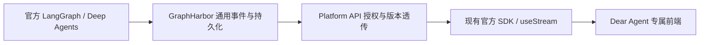

# GraphHarbor v3 对齐方案

实施补充（2026-09-15）：post29完成生命周期对齐并发布；平台失败验收发现通用Worker遗漏顶层recursion_limit，按用户“修复已有缺陷”的授权在post30修复配置传递，仍由原生LangGraph限制步数。不新增业务策略或执行器、不覆盖post29产物。最终状态和证据以README、tasks及03实施记录为准；前端与默认切换后置。

## 1. 需求与非目标

用户要求按官方实现补齐GraphHarbor，包括`started/running/completed/failed/interrupted`及可选`graph_name/error/cause`，随后让当前平台尝试切换v3。目标是完整覆盖这组生命周期和平台实际依赖的事件／恢复链路，不把所有LangSmith托管功能或未来扩展纳入本次。

不新增独立child Run、单子Agent取消、子任务调度器、计费账本；这些不是切换v3自动获得的能力。前端仍只交接，GraphHarbor不导入Dear Agent业务代码。

## 2. 官方来源与版本基线

2026-09-15已通过LangChain Docs及Reference MCP查询：

| 来源 | 确认内容 |
|---|---|
| [LangGraph Event Streaming](https://docs.langchain.com/oss/python/langgraph/event-streaming) | v3提供typed projections、ProtocolEvent、lifecycle、子图与interrupt；远程部署另见Server streaming |
| [Lifecycle](https://docs.langchain.com/oss/python/langgraph/event-streaming#lifecycle) | 五种event值；可选graph_name、error、cause；cause描述工具调用、fan-out Send、edge等真实触发原因 |
| [LangChain Event Streaming](https://docs.langchain.com/oss/python/langchain/event-streaming) | 多数应用／前端场景推荐Event Streaming |
| [Deep Agents Event Streaming](https://docs.langchain.com/oss/python/deepagents/event-streaming) | subagents投影用于发现、跟踪子Agent及结果 |
| [Pregel.stream_events参考](https://reference.langchain.com/python/langgraph/pregel/main/Pregel/stream_events) | v1/v2返回StreamEvent字典；v3返回GraphRunStream；API仍标experimental |
| [Server Streaming](https://docs.langchain.com/langsmith/streaming) | 远程Run／线程流与恢复；线程流自身也有lifecycle，不能说所有“v2”都没有生命周期 |

当前源码／锁文件基线：GraphHarbor post28、LangGraph 1.2.11、Python SDK 0.4.3；Runtime Deep Agents 0.7.8；Web `@langchain/langgraph-sdk` 1.10.2、`@langchain/vue` 1.0.35且SDK已有patch。官方Server比较基线在GraphHarbor中记录为`langgraph-api==0.13.0`。A阶段重新核实精确锁版本及对照环境，记录artifact哈希，不自动追最新版。

若该官方Server版本不支持目标远程行为，记录为基线不支持，先选择并评审新的冻结对照版本；不能以图内v3通过替代官方Server验收。官方文档推荐与API仍experimental并不矛盾，迁移必须锁版本和可回退。

## 3. v2与v3的差异：先分清层次

| 层次 | 当前含义 | 本次处理 |
|---|---|---|
| 图内`astream_events(version="v2")` | Runnable回调事件字典，如on_chat_model_stream、run_id、parent_ids；用于底层追踪 | 不把这些字段直接当v3子图协议 |
| 图内`stream/astream(..., stream_mode=...)` | updates／values／messages等底层模式流；其version参数不能与上项混为一谈 | 允许底层用途继续使用 |
| 图内`stream_events/astream_events(version="v3")` | GraphRunStream／AsyncGraphRunStream及typed projections | 使用官方实现产生事件，GraphHarbor已有该执行路径 |
| 远程Run SSE | GraphHarbor的`runs.stream`／join回放区分v2和v3；post28的v2分支不输出lifecycle，v3输出typed envelope | 官方Server差分验证后完善，不仅校验HTTP 200 |
| 线程命令／订阅Protocol v2 | `/threads/{id}/stream/events`＋命令接口；当前Vue useStream经JS SDK使用此路径，也可承载lifecycle | 保持官方SDK路径，验证同源事件及过滤；不把接口名字改成v3 |

所以“平台切换v3”是让目标入口稳定消费官方事件语义，包含Run创建／resume／回放和现有线程订阅；不是给每个URL或SDK配置添加一个`v3`。

| 维度 | 旧流的应用开发方式 | v3 Event Streaming优势／限制 |
|---|---|---|
| 消息与工具 | 手动处理事件或模式、拼token及工具参数 | messages／tool_calls等官方投影减少手写组装；线上的envelope仍须与SDK版本匹配 |
| 子Agent | 需要从task、debug或namespace中建立可靠关联 | lifecycle＋cause＋subgraphs/subagents给出执行作用域与真实触发关系；同名并发更容易正确展示 |
| 多消费者 | 应用自行分发原始迭代器事件 | 一个底层流支持多个投影同时消费，读取messages不会吞掉values所需事件；不代表服务端重复执行 |
| 完成／中断／失败 | 结合流、Run状态和checkpoint判断 | output／interrupted／interrupts有明确接口；SDK1.9.28的output在失败时也可resolve，必须结合根lifecycle判断；Server仍须保证终态持久化 |
| 内容 | 不同旧模式可能是消息对象、增量或字典 | 更统一的内容块及类型投影；文本、reasoning、工具参数、usage均需回归，不能只测文本 |
| 成本／速度 | 由模型、网络、存储与执行图决定 | 不保证token更少、推理更快或自动修复超时；需要实测事件开销和积压 |
| 兼容性 | 现有消费者已经依赖旧形状 | v3仍experimental，增加切换与回退验证成本；暂保留v2读写路径 |

对本项目最直接的收益：减少子任务归属猜测，统一状态消费，复用官方SDK的消息／子图／中断处理。完整计费、独立子取消与恢复仍是另外的能力。

## 4. 当前事实与待补齐项

| 位置 | 已有事实 | 本次缺口／需要验证 |
|---|---|---|
| GraphHarbor `graph_executor.py:invoke_graph` | 原生v3执行；post28保留data.namespace非空的子lifecycle，真正根lifecycle仍过滤 | 根started与可选字段不能被一刀切丢失；核对官方根事件序列与Worker终态去重 |
| `protocol.py:project_v3_event` | 接受原生／内部envelope；Worker running/success/error/timeout/interrupted映射为lifecycle | 五种事件、可选字段、缺字段、未来cause变体、异常类型不失真；区分内部pending/retry与官方事件集合 |
| `production_worker.py:ProductionWorker.run_once`、`run_store.py:RunRepository.finish` | Worker负责根终态事务落库与fanout | 根graph_name、错误详情、重试／取消竞态；不得在提交失败时提前发completed |
| `streaming.py:_event_frame` | Run SSE v3保留typed envelope，v2过滤lifecycle；从Run kwargs恢复版本 | 子作用域过滤、v3控制帧、断点回放、live/replay一致；SSE id与seq语义需官方对照 |
| `protocol_api.py:_wire_matches` | 线程订阅按外层params.namespace过滤 | 子lifecycle外层可能为空，实际目标scope在data.namespace；按官方订阅语义验证是否漏发，不能简单改所有namespace |
| platform-api | 显式v3与枚举校验已存在；SDK create缺version时用原HTTP客户端 | resume当前只复用context/config，没有持久流版本；创建／等待／加入／命令入口需检查一致性 |
| Web | useStream与官方投影已存在；SDK补丁处理过订阅问题 | 核对现有消费能力，不假设必须重写；同名子图、根／子终态、历史与重连仍待浏览器验收 |

P3证据仅证明已有成功／父取消及实际Langfuse回读，详情见[此前实施记录](../20260913-dearflow-agent/implementation/08-p3-server-verification-closeout.md)。本轮尚未执行官方差分，不把上述待核对项全部认定成已证实bug。

## 5. lifecycle实现规则

| event／字段 | 实现要求 | 验证要求 |
|---|---|---|
| started | 在官方对应作用域开始时保留；不为了凑五种事件人为补一条 | 原生图及Server对照中确实触发started，透传／回放不丢失 |
| running | 保留官方运行事件及通用Run执行状态映射，不当周期心跳使用 | 普通图与Deep Agents各自按官方真实行为验收 |
| completed | 子图以真实图事件为准；根以已提交终态为准 | 子完成不能结束根流；根持久化失败不能泄漏成功；终态不重复 |
| failed | 保留真实error，区分子失败被父捕获与整个Run失败 | 子failed不强制父failed；Worker异常／重试耗尽／超时按官方Server比较结果处理 |
| interrupted | 官方interrupt／暂停事实，不等同执行成功 | 中断ID及payload可resume；父取消仍保留cancel_requested等既有原因，不能假冒HITL问题 |
| graph_name | 来自实际compiled graph／agent name；角色名不是唯一执行标识 | 有名称原样保留，无名称不猜；命名根图和同名子图分别验证 |
| error | 原生官方结构原样兼容；Server产生的异常对齐冻结官方版本 | 类型／内容符合schema；不意外泄漏凭据；可选字段不能被强制填字符串null |
| cause | 保留官方discriminator及附加字段；toolCall的tool_call_id实际关联 | 工具分派、Send与edge分别采集；未知合法cause类型不丢弃；没有cause就缺省 |
| namespace／seq | 外层是事件发出scope，data内可表示目标子scope；按真实字段分工 | 同名并发、嵌套、作用域订阅、事件顺序及回放一致；按seq排序，不按可能漂移的timestamp |

五种event不是`started→running→completed→failed→interrupted`固定链；成功、失败、暂停互为不同结果，重试和resume还涉及attempt／新Run。先用官方样本冻结具体偏序，不发明状态转移。

根事件处理：先对照官方Server。优先保留原生非终态及其字段，继续由现有RunRepository事务保证根终态；若确需补齐根终态字段，在已有调用链传递实际元数据。禁止把整套原生根lifecycle全部放开再让Worker重复发终态，也禁止另加终态账本。

## 6. 分层改动与平台迁移

### GraphHarbor

沿已有`invoke_graph → ProductionWorker → RunRepository → project_v3_event → Run SSE/Protocol订阅`补齐。复用`tests/acceptance_app`、`scripts/compare_official_protocol.py`、`tests/javascript`和compatibility文档；不用Dear Agent充当Server协议测试图。

Run SSE、线程Protocol订阅和线程状态通知分别验收；控制帧、过滤、SSE id不能只因为名字类似就混用。普通GraphHarbor root状态接口仍使用success/error等RunStatus，不直接把数据库status换成completed/failed。

### Platform API与Runtime

- `apps/platform-api/src/platform_api/adapters/langgraph/runs_sdk_adapter.py`：检查create/stream/join/wait各入口的官方版本能力；继续使用现有SDK或HTTP客户端，不能给不支持的SDK方法硬塞参数。
- `apps/platform-api/src/platform_api/core/runtime_contract.py`及`modules/runtime_gateway/application/service.py`：保留枚举校验、幂等和授权；版本是通用传输设置，不塞入Dear业务RuntimeContext。
- resume优先从已授权的checkpoint来源Run读取有效版本。A阶段确认官方Run详情是否公开该字段；不能依赖当前未公开的数据库kwargs。若详情拿不到，才在现有RunRequestRecord增加一个持久`stream_version`字段，缺省v2，与首次请求原子保存并纳入幂等比较。不要另建配置快照表／版本管理服务。
- 已有模型／权限／context/config快照恢复逻辑不放宽。若前端SDK必须在resume显式指定版本，只允许官方支持的传输字段并校验与源Run一致，不能顺便允许改模型或权限；先以真实SDK证明必要性再加。
- 旧记录默认v2；同一幂等请求版本不能漂移。重启后resume、重复resume、多中断及checkpoint来源选择均回归。
- `apps/runtime-service/pyproject.toml`、`uv.lock`只在B候选包通过后升级。Dear Agent不写第二套事件adapter；沿既有测试追加失败／中断／产物审批和研究链路。

### 前端与默认切换

前端业务只在`apps/platform-web/src/modules/dear-agent/`，网络仍在`src/services/`；共享Chat不复制第二份事件基础，不同步改Chat行为。现有`useStream`／subgraphs投影若已满足目标，仅修实际映射缺陷，不新增自定义SSE解析器。

先以验收客户端显式v3完成C。D前端接入后只切Dear新运行入口，其他入口逐项验收；如果现有useStream已经使用同源typed事件，所谓切换是完善端到端语义，不必替换线程协议。前端未实施前不能靠全局Server默认v3让旧消费者被动切换。

## 7. 风险、回退与发布

- 官方接口experimental：冻结版本，记录差分基线；只修已证实缺口，不追随未锁版本猜schema。
- resume版本持久化：优先复用已存在事实；需要新列时用项目Alembic增量nullable/default迁移，旧数据读作v2，不重写事件历史。
- 事件重复或丢失：Server事务终态／lease fence维持原约束，测试取消与提交竞态、worker恢复、断流和旧游标。
- 性能：同一确定性图对比v2/v3的首事件、终态可见延迟、事件数、字节及峰值内存；另记真实模型耗时。沿既有指标，不承诺切v3提速，不预做批处理优化。
- 发布：按GraphHarbor既有runbook出新版本、构建hash、安装包隔离测试，再更新平台锁文件；不覆盖post28发布物。
- 回退：恢复旧入口对新Run的v2选择，已创建v3 Run继续用具备v3支持的Server完成／回放；不要在运行中改其版本或删记录。包回退须先确认无依赖新语义的在途Run。若有新增兼容列，优先保留列并回退代码，不破坏已有v3历史。
- 范围外的单子取消、计费、浏览器业务开发不借协议升级夹带实现；发现需求列入任务边界，不静默扩张。
