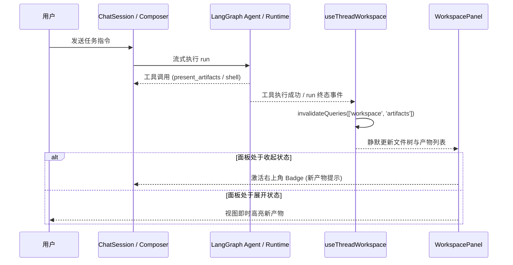

# 前端接入契约（后端实现版）

## 状态与入口

Runtime 和 Platform API 已实现本页文件及 Terminal 接口；本次没有修改前端功能。文件组件位置见 [04](04-code-change-map.md#4-platform-web仅设计后续开发)，Terminal 接入见本页后半部分。

公开前缀：`/api/langgraph/threads/{thread_id}`。所有请求使用现有平台认证及 `x-project-id`；不把平台 token 传进 iframe，不直连 Runtime。接口响应均禁止缓存。

| 方法与后缀 | 参数 | 成功响应 |
| --- | --- | --- |
| GET `/capabilities` | 无 | `workspace: true` 表示可浏览；`artifacts` 是支持发布的 MIME 列表 |
| GET `/workspace/tree` | `path` 默认 `/workspace`；`limit` 默认 100、范围 1—200；可选 `cursor` | JSON `{items, next_cursor}` |
| GET `/artifacts` | `limit/cursor` 同上 | JSON `{items, next_cursor}` |
| GET `/workspace/preview` | 必填 `path` | 文本为 JSON；图片为图片字节；HTML 为安全 HTML 文档，按 Content-Type 分支 |
| GET `/workspace/content` | 必填 `path` | 原文件字节，`Content-Disposition: attachment`，ETag 为内容摘要 |
| GET `/files/content` | 必填 uploads/outputs 引用 path | 已有下载接口继续兼容；普通文件请使用 workspace/content |

path 必须使用服务端返回的虚拟路径，通过请求客户端参数编码；不使用宿主路径。artifact 的 key/选中项使用 **path**，因为同内容不同扩展名共享 artifact_id。

## 数据结构

```ts
type PreviewKind = 'text' | 'markdown' | 'image' | 'html-sandbox' | 'download';
type WorkspaceEntry = {
  path: string; name: string; type: 'file' | 'directory';
  size_bytes: number | null; mtime: string; mime_type: string | null;
  preview_kind: PreviewKind | null; is_artifact: boolean;
};
type ArtifactRef = {
  version: 1; artifact_id: string; path: string; file_name: string;
  mime_type: string; size_bytes: number; sha256: string;
  kind: string; preview_kind: PreviewKind;
};
type Page<T> = { items: T[]; next_cursor: string | null };
type TextPreview = {
  path: string; file_name: string; mime_type: string; size_bytes: number;
  sha256: string; preview_kind: 'text' | 'markdown'; text: string; truncated: boolean;
};
```

目录项的 size_bytes/mime_type/preview_kind 为 null；mtime 为带时区的 ISO 时间。目录只返回一层，按名称排序，隐藏符号链接和特殊文件。文件树的 preview_kind 是按扩展名给出的策略提示，实际内容在预览时校验，不能认为列表成功就意味着内容有效。

artifact 列表根据 outputs 哈希文件名发现产物，不读取整个目录所有文件的内容；摘要在下载/预览时核验。file_name 当前是哈希文件名，没有原始名称、created_at、source_message_id。`kind` 保留历史分类，渲染请以 preview_kind 为准。

## 示例

YAML 普通文件预览（未发布也可以）：

```http
GET /api/langgraph/threads/thread-1/workspace/preview?path=%2Fworkspace%2Fwork%2Fpayment_openapi.yaml
x-project-id: <当前项目>
```

```json
{
  "path": "/workspace/work/payment_openapi.yaml",
  "file_name": "payment_openapi.yaml",
  "mime_type": "application/yaml",
  "size_bytes": 14,
  "sha256": "<64位内容摘要>",
  "preview_kind": "text",
  "text": "openapi: 3.1.0\n",
  "truncated": false
}
```

单层目录示例：

```json
{
  "items": [{
    "path": "/workspace/work", "name": "work", "type": "directory",
    "size_bytes": null, "mtime": "2026-09-17T08:00:00+00:00",
    "mime_type": null, "preview_kind": null, "is_artifact": false
  }],
  "next_cursor": null
}
```

## 预览和下载

- 文本/源码/SVG：只读文本；Markdown 可切换渲染/原文，渲染器必须禁用原始 HTML 并过滤危险链接。
- 图片：PNG/JPEG/WebP 已校验实际格式，转 Blob URL 显示，切换或卸载时 revokeObjectURL。
- HTML：接口返回**静态安全版本**，保留支持的标签和 CSS 布局；脚本、导航、表单、iframe、SVG/MathML 嵌入被去除，外部资源被 CSP 阻止。前端使用 `<iframe sandbox="" referrerpolicy="no-referrer">` 加载返回内容，srcdoc 或 Blob 均可；不要添加 allow-scripts/allow-same-origin。HTML 文档内置 CSP meta，不能只依赖 fetch 响应头。需要原文件时下载，不把原文件作为预览内容。
- PDF/Office/ZIP 和未知二进制：文件信息与下载，不 inline。未知二进制允许普通文件下载，但不允许发布为 artifact。
- 下载应鉴权 fetch → Blob → object URL → 下载，完成后释放 URL；不要用裸链接绕过认证。

限制：原文件读取/发布上限 20 MiB；文本仅返回前 256 KiB，truncated 表示还有后续内容；HTML 超过 256 KiB 返回 413，提供下载入口；单目录最多扫描 10,000 个条目，超过返回 413。空工作区根目录和不存在的 outputs 列表返回空列表，缺失具体子目录或文件返回 404。

## 刷新、分页与错误

1. 进入线程读取 capabilities、根目录和 artifacts；展开子目录请求对应 path，同目录下一页使用 next_cursor。
2. 收到 `present_artifacts` 成功的结构化工具结果，刷新 artifacts；运行结束再刷新文件树和列表。不等待尚不存在的 `artifact.published` 自定义事件。
3. 切换 project/thread 时取消旧请求，清空列表和选中项；不让旧响应写回新线程。刷新后按虚拟 path 恢复，重新鉴权。
4. 列表分页期间目录发生结构变化会返回 409 `workspace_directory_changed`，清空 cursor 从第一页刷新。实时列表不是运行快照，不提供“本轮变更”。

| HTTP 状态 | 典型错误码 | 前端行为 |
| --- | --- | --- |
| 400 | `invalid_workspace_path` / `invalid_workspace_cursor` | 提示无效请求；cursor 错误重新加载第一页 |
| 401 / 403 | 未认证、`thread_project_denied`、`runtime_target_denied`、scope 拒绝 | 沿用登录/权限错误处理，不能显示为空目录 |
| 404 | `workspace_file_unavailable` / `artifact_not_found` | 提示文件不存在，刷新目录；不猜测替代路径 |
| 409 | `workspace_directory_changed` / `artifact_hash_mismatch` | 刷新分页或提示产物损坏，禁止继续显示旧预览 |
| 413 | `file_too_large` / `html_preview_too_large` / `workspace_directory_too_large` | 展示限制；只有预览超限且原文件未超 20 MiB 时提供下载 |
| 415 | `workspace_preview_unsupported` / `artifact_image_type_mismatch` | 不支持预览或格式不符，显示下载/错误 |
| 422 | `invalid_document` 或参数验证错误 | 文本编码/格式不合法，显示错误 |
| 502 / 503 | Runtime 不可用或运输响应无效 | 可重试错误，不能当空目录 |

平台现有错误 envelope 沿用网关实现；Runtime 的原始错误详情可能在上游错误映射中保留，前端优先按 HTTP 状态判断，不依赖错误消息文本。

## 验收责任

后端已提供格式/权限/路径测试、两服务真实 HTTP 用例和 Chromium/Firefox HTML 隔离脚本。前端接入时需落实完整工作区交互、分页、切线程竞态、下载文件名、终端输入单飞和刷新恢复。

---

# 前端架构与交互方案设计（参考借鉴 open-swe）

本设计参考 `../research/open-swe（相对仓库根目录的外部参考源码）`（以下简称 open-swe）中关于 `AgentRightPanel`、`RightPanelTabs`、`TerminalPanel` 和 `SandboxedHtmlFrame` 的成熟工程实践，结合平台现有 Vue 3 技术栈与后端契约进行对齐。

## 1. 整体面板容器与布局（解决固定 320px 挤爆问题）

在原有设计中，右侧面板被生硬地设计为“仅有 `hasArtifacts` 时显示，固定 320px 宽”，这在代码预览、HTML 预览以及终端交互场景下体验极差。借鉴 open-swe 的 `AgentRightPanel`，升级为自适应弹性工作区：

1. **容器与尺寸控制**：
   - **宽度可调节（Resize Handle）**：默认宽度 480px，支持在 360px ~ 960px 之间水平拖拽缩放（持久化至 `localStorage`），提供顺畅的调整手柄。
   - **全屏最大化（Maximize / Restore）**：支持一键全屏展开（占满主编辑/聊天区域），方便深入排查终端或查看复杂图表/HTML 产物；再次点击还原。
   - **收起与展开（Collapse / Expand）**：面板顶部及主聊天栏右上角提供明显的展开/收起按钮。窄屏/移动端（`< 768px`）自适应为右侧滑出抽屉（Drawer）。
   - **快捷键支持**：`Mod+Alt+B` 开关工作区面板，`Mod+J` 或 `Ctrl+\`` 快速切换/激活终端。
2. **常驻入口与新产物通知（打通链路体验）**：
   - 聊天界面右上角提供常驻 **“工作区 (Workspace)”** 按钮，无论当前是否有产物，只要 `capabilities.workspace === true` 即可随时主动打开浏览。
   - 当 Agent 执行 `present_artifacts` 或生成新产物时，如果工作区处于折叠状态，按钮显示高亮小红点/Badge 徽章，提示“有新产物生成”，点击一键定位到该产物。

## 2. 工作区 Tab 体系与主从布局

工作区分为三大核心 Tab（按 `capabilities` 动态控制是否渲染 Terminal）：

```text
┌──────────────────────── Workspace ─────────────────────────────┐
│ [📁 Files]   [📦 Artifacts (3)]   [💻 Terminal (2)]    [⤢] [✕] │
├────────────────────────────────────────────────────────────────┤
│ ┌── 侧边列表 (可折叠) ──┬── 主预览区 (WorkspacePreview) ───────┐ │
│ │ ▾ /workspace         │ [文件名] [复制] [下载] [全屏]         │ │
│ │   ▾ work             │ ──────────────────────────────────── │ │
│ │     📄 index.html    │ (代码高亮 / HTML Sandbox / 图片 /    │ │
│ │     📄 main.py       │  Markdown 原文/渲染切换 / 二进制卡片)│ │
│ │   ▸ outputs          │                                      │ │
│ └──────────────────────┴──────────────────────────────────────┘ │
└────────────────────────────────────────────────────────────────┘
```

- **Tab 1: Files（文件树）**：
  - 左侧为单层按需展开的工作区目录树（`WorkspaceTree`），支持加载指示器、局部错误重试及路径提示。
  - 右侧为预览主区域，默认选中最新或根目录说明；支持点击树中文件即时加载 preview。
  - 侧边文件树支持一键折叠（Toggle Sidebar），让大段代码或 HTML 能够全宽浏览。
- **Tab 2: Artifacts（交付物产物库）**：
  - 左侧为 Agent 明确发布的交付物卡片列表，显示文件名、分类（`kind`）、大小和 SHA-256 摘要。
  - 右侧主区域展示选中 Artifact 的受限安全预览或原件下载。
- **Tab 3: Terminal（终端控制台）**：
  - 呈现多终端会话管理与 PTY 交互。

## 3. Terminal 终端核心设计与技术选型

### 3.1 终端渲染器选型（严禁裸手写 DOM）
- 必须采用工业级标准库：**`@xterm/xterm` + `@xterm/addon-fit`**（可预留 `@xterm/addon-web-links`）。
- 禁止使用 `<pre>` 标签拼接 ANSI 控制字符，以避免颜色、退格光标和全屏交互（如 vim/htop）错乱。
- 终端主题与平台暗黑模式（Dark/Light）自动联动同步。

### 3.2 多终端会话（Multi-Session）管理
- 后端支持最多 4 个并发会话。前端在 Terminal Tab 内部提供二级 Tab 栏：
  - `[终端 1] [终端 2] [+]`：点击 `+` 弹窗确认直接执行风险后调用 `POST /terminals` 创建新会话。
  - 每个会话 Tab 显示运行状态（运行中、已退出 + exit code）。
  - 右侧提供会话操作按钮组：**清屏 (Clear)**、**重启/重连 (Restart)**、**关闭终端 (Delete Session)**。

### 3.3 保持存活机制（Tab 切换不销毁 DOM）
- **核心原则（借鉴 open-swe）**：用户在工作区内部切换 Tab（例如从 Terminal 切换到 Files 查看代码），**绝对不能销毁 Terminal 实例**！必须使用 `v-show` 保持 Terminal DOM 挂载。
- 处于后台隐藏状态时：自动将 HTTP 输出轮询间隔降频（如退避至 3000ms 或暂停输出抓取），保持心跳与 PTY 存活。
- 切回前台显示时：恢复 200~500ms 高频轮询，并立即调用 `fitAddon.fit()` 重新适配容器尺寸。
- **真正销毁时机**：仅在用户主动点击“关闭终端”执行 `DELETE /terminals/{id}`，或者切换了 `thread_id`（离开当前线程）时，才彻底释放 xterm 实例与停止轮询。

### 3.4 终端六类后端契约与协议规范

后端实现见 [06](06-terminal-backend.md)。采用真实 PTY + 鉴权 HTTP 轮询，没有 WebSocket URL、SSE endpoint 或一次性连接 token。沿用本页的认证、`x-project-id` 和公开前缀 `/api/langgraph/threads/{thread_id}`。不要直连 Runtime 的 `/internal` 路由。

| 方法与后缀 | 请求 | 响应 |
| --- | --- | --- |
| POST `/terminals` | `{request_id: UUID, acknowledge_execution: true, rows?: 24, cols?: 80}` | `TerminalSession`，HTTP 200 |
| GET `/terminals` | 无 | `{items: TerminalSession[], instance_id: string}`，只含本人的当前线程会话 |
| GET `/terminals/{terminal_id}/output` | query `offset`，默认 0，非负字节位置 | `TerminalOutput` |
| POST `/terminals/{terminal_id}/input` | `{sequence: number, data_base64: string}` | `{accepted_bytes: number, next_input_sequence: number}` |
| POST `/terminals/{terminal_id}/resize` | `{rows: number, cols: number}` | `TerminalSession` |
| DELETE `/terminals/{terminal_id}` | 无 | `TerminalSession`，退出状态；保留期内重复关闭可用 |

rows 范围 2—200；cols 范围 2—400。所有 body 禁止额外字段，不能指定 shell、cwd、env 或命令参数。input 的 sequence 是非负整数；原始字节每次 1—4096 字节，Base64 最长 5464 字符。以 UTF-8 **字节**分块，不能按 JavaScript 字符串长度截断。

创建前显示确认：“终端输入会直接执行，不经过 Agent 审批”。用户主动确认才发送 `acknowledge_execution: true`，不要随面板挂载自动创建。`request_id` 使用 `crypto.randomUUID()`，本次创建网络失败时以同一个 ID 重试；用户明确新增另一个终端才产生新 ID。

```ts
type TerminalSession = {
  terminal_id: string; // 不透明标识，原样保存并编码为 path segment
  backend: 'local' | 'docker';
  isolation: 'host-development' | 'docker';
  status: 'running' | 'exited';
  exit_code: number | null; // 强制结束可为负数，启动瞬间可能为 null
  reason: null | 'shell_exit' | 'closed' | 'idle_expired'
    | 'lifetime_expired' | 'runtime_shutdown' | 'disabled';
  rows: number; cols: number;
  next_input_sequence: number;
  start_offset: number; end_offset: number;
};
type TerminalOutput = TerminalSession & {
  data_base64: string;
  offset: number; next_offset: number;
  truncated: boolean;
};
```

### 3.5 输出流解码、单飞重试与生命周期管控

1. **输出轮询与解码**：
   - 活跃面板 200—500ms 轮询，后台退避到 3000ms。取消旧请求、切换项目/线程后丢弃迟到响应。
   - Base64 解码成 `Uint8Array` 后送入 xterm；若转字符串，复用同一 `TextDecoder` 并启用 `{stream:true}`，避免跨块 UTF-8 中文乱码。offset 永远用响应的 `next_offset`。
   - `truncated=true` 表示 1 MiB 环形缓冲淘汰了旧输出，提示“部分历史输出已过期”，清理终端解析状态后从响应 offset 继续渲染。
   - `status=exited` 时禁用输入，但继续读取直到 `next_offset === end_offset`，再停止轮询并展示退出码。
2. **输入单飞串行队列**：
   - 输入必须保持单飞串行队列。初始 `sequence` 取会话 `next_input_sequence`。
   - 成功后移除 `accepted_bytes` 字节，剩余字节用返回的 `next_input_sequence` 继续发。
   - 超时/断线用完全相同的 sequence 与字节重试（服务端幂等）；未确认前禁止发送下一批。
   - 遇到 409 冲突暂停输入并提示“状态不一致，正在重新同步”。Ctrl-C 发送 `0x03`（Base64 `Aw==`）。
   - resize 尺寸防抖发送（如 200ms debounce）。
3. **错误与生命周期**：
   - 401/403：提示无权限并停止轮询；
   - 404：会话过期或已被清理，从列表移除；
   - 409 `terminal_instance_changed`：Runtime 实例重启，旧会话丢失，提示用户新建；
   - 429：超出并发配额（最多 4 个运行会话），提示关闭旧终端。

### 3.6 终端与 Chat 深度联动（借鉴 open-swe）
- **选中文本快捷操作（Add to Chat）**：在终端划词选中文本后，浮现快捷小按钮或右键菜单支持“引用到提问框”，一键填充到当前聊天 Composer，极大方便用户向 Agent 汇报运行报错。
- **文件路径跳转（Open in Files）**：终端输出中打印的相对路径（如 `/workspace/work/...` 或 `./src/...`），点击可在 Files Tab 预览中自动选中并打开。

## 4. 预览与安全沙箱规范

### 4.1 SandboxedHtmlFrame 实现规范
- 参考 open-swe 的 `SandboxedHtmlFrame` 实现，纯净且防御性：
  ```html
  <iframe
    ref="iframeRef"
    :srcdoc="safeHtml"
    sandbox=""
    referrerpolicy="no-referrer"
    class="w-full h-full border-0 bg-white"
  />
  ```
- **绝对禁止**添加 `allow-scripts` 或 `allow-same-origin`；
- 后端已在 preview 接口中去除了脚本并嵌入安全 CSP meta，前端使用 `srcdoc` 呈现；
- 提供“在安全全屏查看”及“下载原始 HTML 文件”入口。

### 4.2 代码与文本预览（WorkspacePreview）
- 针对 `preview_kind === 'text'`：提供轻量语法高亮（基于语言推断）、行号展示（Line Numbers）、一键复制代码（Copy All）与下载。
- 当 `truncated === true` 时，顶部醒目提示：“当前展示前 256 KiB 内容，如需完整文件请点击下载”。
- 针对 `preview_kind === 'markdown'`：支持“渲染视图 (Preview)”与“源码视图 (Source)”一键平滑切换，渲染时严格禁用直接注入未经净化的外部 HTML。

## 5. 跨组件状态联动与打通全链路流程



1. **事件驱动的刷新机制**：
   - 在 `ChatSession.vue` 中接入事件监听：当流式输出中解析到 `present_artifacts` 的工具回执，或者当前 Run 状态变为终态（`success` / `error` / `interrupted`）时，通知 `useThreadWorkspace` 触发文件树与产物列表的静默刷新。
2. **切线程保护（Race Condition Prevention）**：
   - 当路由或外部切换 `threadId` 或 `projectId` 时，中止（AbortController）所有正在发起的 workspace / terminal 轮询请求；
   - 重置当前选中的文件路径与展开的目录节点，清空所有活跃终端会话，防止数据串台。

## 6. 前端代码落地规划

| 操作 | 代码文件位置 | 职责定位 |
| --- | --- | --- |
| 依赖安装 | `package.json` | 增加 `@xterm/xterm` 与 `@xterm/addon-fit` |
| 新增 | `apps/platform-web/src/types/workspace.ts` | 统一存放 WorkspaceEntry, ArtifactRef, TerminalSession, PreviewKind 等 DTO |
| 新增 | `apps/platform-web/src/services/threads/workspace.service.ts` | 封装 capabilities, tree, preview, content, artifacts 请求 |
| 新增 | `apps/platform-web/src/services/threads/terminal.service.ts` | 封装 terminals 的 6 类 API（增查读写扩删） |
| 新增 | `apps/platform-web/src/composables/useThreadWorkspace.ts` | 统一管理工作区状态、分页、目录缓存、失效静默刷新、选中态 |
| 新增 | `apps/platform-web/src/composables/useThreadTerminal.ts` | 封装单飞输入队列、200~500ms 轮询、Base64/UTF-8 流式解码、尺寸去抖 |
| 新增 | `apps/platform-web/src/components/workspace/SandboxedHtmlFrame.vue` | 纯净安全的沙箱 iframe 容器（`sandbox=""` + `referrerpolicy="no-referrer"`） |
| 新增 | `apps/platform-web/src/components/workspace/WorkspaceTree.vue` | 单层懒加载目录树、折叠/展开、图标分发、文件点击选中 |
| 新增 | `apps/platform-web/src/components/workspace/WorkspacePreview.vue` | 支持 Code、Markdown、HTML Sandbox、Image、Download 卡片的统一预览器 |
| 新增 | `apps/platform-web/src/components/workspace/TerminalPanel.vue` | 基于 xterm 的多终端会话管理面板、保活挂载、输入队列与操作栏 |
| 新增 | `apps/platform-web/src/components/workspace/WorkspacePanel.vue` | 右侧主容器：拖拽缩放、全屏切换、Files/Artifacts/Terminal 选项卡、未读徽标 |
| 修改 | `apps/platform-web/src/modules/chat/components/ChatSession.vue` | 替换掉原本硬编码 320px 的 `ChatArtifactPanel`，引入弹性 `WorkspacePanel` 与常驻开关 |
| 修改 | `apps/platform-web/src/modules/dear-agent/components/DearAgentSession.vue` | 同步复用 `WorkspacePanel`，保证平台内体验一致 |
| 单元测试 | `src/composables/useThreadWorkspace.spec.ts` 等 | 覆盖切线程取消、分页、单飞输入重试等逻辑 |

