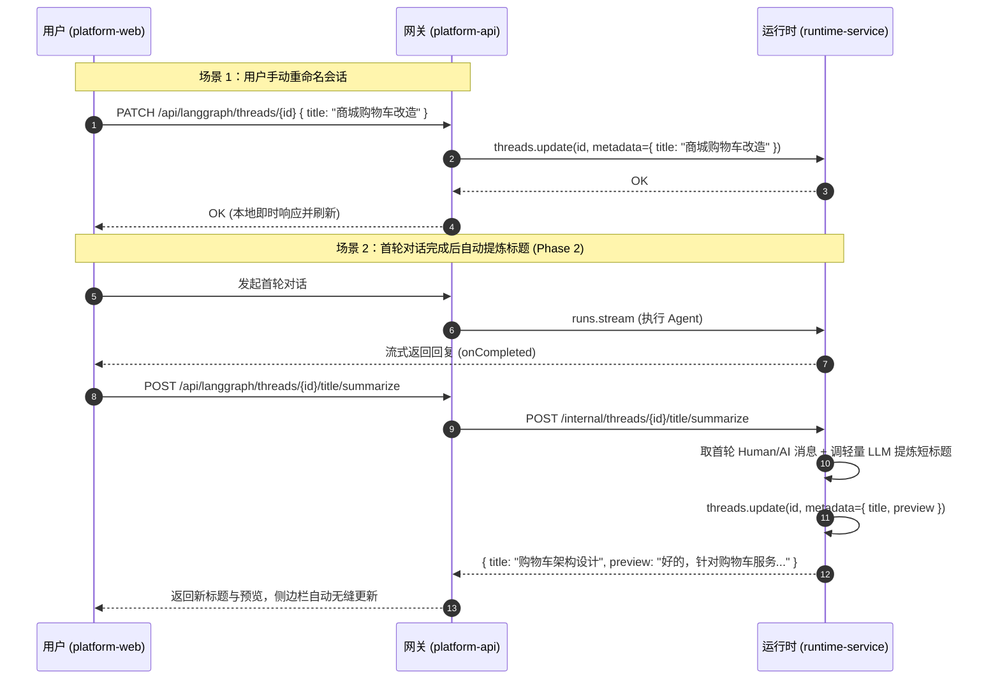

# 会话标题识别与消息预览优化 - 整体方案

## 背景
用户在进行对话时，侧边栏出现两处交互体验缺陷：
1. **所有会话标题千篇一律**：如果用户多次点击欢迎页快捷卡片（如“设计功能方案：根据业务需求给出优雅的架构与接口设计”），会话标题直接被截取为该提示词的前80个字符，导致侧边栏全是相同的文字，根本无法根据标题识别具体对话；
2. **副标题显示“(无内容)”**：列表项原本预留了第二行用于展示消息摘要（`item.preview`），但由于系统在创建和运行期间从未向 `thread.metadata.preview` 写入任何内容，触发保底显示为硬编码的 `(无内容)`。

## 目标
1. 彻底修复 `(无内容)` 视觉噪点，将其转化为有实际价值的最新消息预览（Preview）；
2. 提供会话标题的手动重命名能力，允许用户自定义辨识度高的标题；
3. 清洗推荐模板引导语对标题的污染，并在首轮对话完成后通过大模型（LLM）智能提炼不超过 12 字的高信息量标题。

## 架构与分工

### 为什么涉及 runtime-service？
- **若仅做手动改名与规则截取**：不需要涉及 runtime-service，由 `platform-api` 开放元数据更新接口即可。
- **若做 LLM 智能总结标题**：必须涉及 `runtime-service`。
  - 模型实例（`build_model` / `ChatOpenAI`）内聚在 `runtime-service`，`platform-api` 是纯控制面网关，不具备大模型执行基础设施；
  - 会话底层 Checkpoint 与历史消息只在 `runtime-service` 挂载的存储中。

### 整体架构



## 实施计划
- **Phase 1：基础建设与手动重命名（P0 - 已全部交付完成）**
  - 后端：`platform-api` 在 `runtime_gateway` 增加 `PATCH /threads/{id}` 接口，支持更新 metadata；
  - 前端：`session.service.ts` 接入 update 接口；
  - 前端：`ChatThreadSidebar.vue` & `DearAgentThreadSidebar.vue` 增加 Inline 编辑重命名交互，清除 `(无内容)` 噪点；
  - 前端：`thread-title.ts` 实现模板词清洗与首末条消息摘要提取。
- **Phase 2：LLM 智能提取标题（P1 - 详细规划方案）**
  - 详见下方 [Phase 2 智能标题提炼详细设计方案](#phase-2-智能标题提炼详细设计方案)。

---

## Phase 2 智能标题提炼详细设计方案

### 1. 架构定位：符合 LangChain 规范的轻量 `create_agent`
遵循 LangChain 统一开发范式与 KISS 原则：
1. **标准化开发范式**：使用 LangChain 官方 `create_agent(model=..., system_prompt=..., tools=[])` 构建轻量 Agent。既符合平台全局 Agent 的统一开发契约，又具备标准化生命周期。
2. **极简无工具（Zero-tool）极速执行**：由于标题提炼仅需文本抽象理解，无需挂载外部工具（`tools=[]`），无需附加复杂状态检查点（`checkpointer=None`），保障单次执行在 200~400ms 内极速完成。
3. **架构正解**：作为公共通用组件，落库在 `apps/runtime-service/src/runtime_service/utils/title_summarizer.py`，对外导出统一异步函数 `summarize_thread_title(messages: list[dict]) -> str`。

### 2. 模型与资源选型（基于 runtime-service/.env）
复用 `apps/runtime-service/.env` 中现成的 DeepSeek 高性能代理配置：
- **模型名称**：`${DEEPSEEK_PROXY_DEFAULT_MODEL}`（当前默认为 `DeepSeek-V4-Flash`，极低延迟、超高性价比）
- **网关地址**：`${DEEPSEEK_PROXY_URL}`（`http://120.48.180.39:20002/v1`）
- **访问密钥**：`${DEEPSEEK_PROXY_API_KEY}`
- **技术实现**：
  使用 `langchain_deepseek.ChatDeepSeek(model=..., api_key=..., base_url=..., temperature=0.3, max_tokens=30)` 作为底层模型，传入 `create_agent`。

### 3. 代码落地方位与文件清单

| 服务模块 | 落地文件路径 | 核心职责 |
|---|---|---|
| **总结 Agent 工具** | `apps/runtime-service/src/runtime_service/utils/title_summarizer.py` | 基于 `create_agent` 构建轻量 Agent，封装 DeepSeek 模型调用、Prompt、<=10 字强制截断与清洗 |
| **Runtime HTTP 路由** | `apps/runtime-service/src/runtime_service/http/title_summary.py` | 暴露内部接口 `POST /internal/threads/{thread_id}/title/summarize` |
| **服务挂载** | `apps/runtime-service/src/runtime_service/webapp.py` | 注册 `title_summary.router` 到 Runtime FastAPI 实例 |
| **网关代理层** | `apps/platform-api/src/platform_api/modules/runtime_gateway/presentation/http.py` | 暴露 `POST /api/langgraph/threads/{thread_id}/title/summarize`，做权限校验并调用 Runtime |
| **前端交互（侧栏卡片）** | `apps/platform-web/src/modules/chat/components/ChatThreadSidebar.vue` | 悬浮显示 ✨ AI 魔法棒按钮（Tooltip“AI 智能生成标题”），点击带 loading 动画并触发提炼 |
| **前端交互（侧栏卡片）** | `apps/platform-web/src/modules/dear-agent/components/DearAgentThreadSidebar.vue` | DearAgent 侧栏对齐相同 ✨ 魔法棒交互 |
| **前端页面控制器** | `apps/platform-web/src/modules/chat/pages/ChatPage.vue` | 监听 `@ai-summarize-title`，调用网关接口并原地响应式更新会话标题 |
| **前端页面控制器** | `apps/platform-web/src/modules/dear-agent/pages/DearAgentPage.vue` | DearAgent 页面对齐原地更新会话标题 |

### 4. Agent 实现与核心代码结构设计

```python
# apps/runtime-service/src/runtime_service/utils/title_summarizer.py
import os
import re
from collections.abc import Sequence
from langchain.agents import create_agent
from langchain_deepseek import ChatDeepSeek
from langchain_core.messages import BaseMessage, HumanMessage, AIMessage

TITLE_SYSTEM_PROMPT = """你是一个极简会话标题提炼专家。
你的唯一任务是根据用户与AI的首轮对话，提炼出一个高辨识度、高度概括会话主旨的中文标题。

【硬性约束】：
1. 长度绝对不能超过 10 个汉字或字符；
2. 严禁出现任何标点符号（无逗号、句号、冒号、感叹号）；
3. 严禁包含任何书名号《》、双引号""、单引号、括号；
4. 严禁包含废话前缀，如“关于...”、“讨论...”、“...的方案”、“标题：”；
5. 只输出标题纯文本本身，绝不解释。"""

def get_title_agent():
    api_key = os.environ.get("DEEPSEEK_PROXY_API_KEY", "")
    base_url = os.environ.get("DEEPSEEK_PROXY_URL", "http://120.48.180.39:20002/v1")
    model_name = os.environ.get("DEEPSEEK_PROXY_DEFAULT_MODEL", "DeepSeek-V4-Flash")

    model = ChatDeepSeek(
        model=model_name,
        api_key=api_key,
        base_url=base_url,
        temperature=0.3,
        max_tokens=30,
    )
    return create_agent(
        model=model,
        tools=[],
        system_prompt=TITLE_SYSTEM_PROMPT,
        name="title_summarizer_agent",
    )

def clean_generated_title(raw_title: str) -> str:
    cleaned = raw_title.strip()
    cleaned = re.sub(r"^(标题|会话标题|主题)[:：\s]*", "", cleaned)
    cleaned = re.sub(r"^[\s\"'《“「(（]+|[\s\"'》”」)）]+$", "", cleaned)
    cleaned = re.sub(r"[。！？!?,，]+$", "", cleaned)
    return cleaned[:10].strip()

async def summarize_thread_title(messages: Sequence[dict | BaseMessage]) -> str:
    agent = get_title_agent()
    # 格式化 messages 并 ainvoke
    response = await agent.ainvoke({"messages": messages})
    raw_title = response["messages"][-1].content
    return clean_generated_title(str(raw_title))
```


### 5. 接口契约规范

#### 5.1 Runtime 内部接口
- **URL**: `POST /internal/threads/{thread_id}/title/summarize`
- **Request Body**:
```json
{
  "messages": [
    {"role": "user", "content": "帮我设计一个用户注册和登录的接口架构方案，包括 JWT 刷新机制"},
    {"role": "assistant", "content": "好的，针对用户注册和登录，我们可以采用如下架构..."}
  ]
}
```
*(注：若 `messages` 为空，Runtime 服务自动从底层 Checkpoint 存储读取该 `thread_id` 的前两轮消息)*
- **Response Body**:
```json
{
  "title": "用户注册与登录架构",
  "model": "DeepSeek-V4-Flash",
  "tokens_used": 28
}
```

#### 5.2 Platform-API 网关接口
- **URL**: `POST /api/langgraph/threads/{thread_id}/title/summarize`
- **Headers**: 携带用户认证 Token 与 `X-Project-Id`
- **Behavior**:
  1. 鉴权：校验当前用户对该 Project/Thread 是否有读取权限；
  2. 调用 Runtime 提炼标题；
  3. 自动原子落库：直接调用 `ThreadService.update_thread(thread_id, metadata={"title": generated_title})`；
  4. 返回最终结果 `{"thread_id": "...", "title": "用户注册与登录架构"}`。

### 6. 异常容灾与降级策略
1. **静默失败不阻断**：标题生成属于辅助增强体验，调用超时（如 > 1.5s）或 LLM 报错时，前端 `catch` 错误打日志即可，绝对不能阻断主聊天流，标题保持 Phase 1 的本地清洗规则生成的保底标题。
2. **防重复生成**：若用户已经手动编辑修改过标题（`metadata.custom_title == true`），自动提炼直接跳过，不得覆盖用户的自定义命名。


